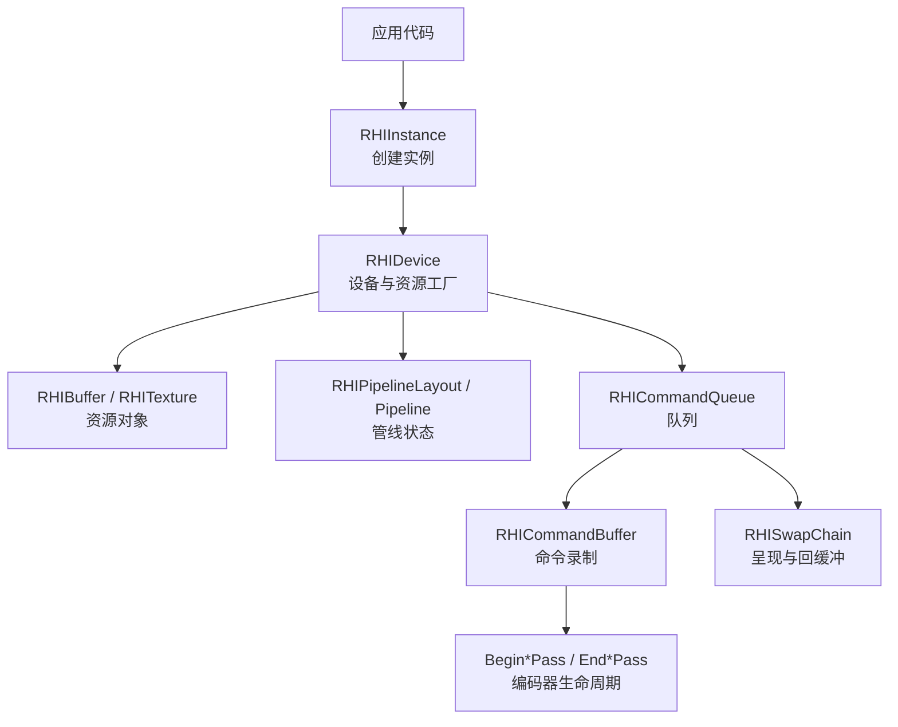
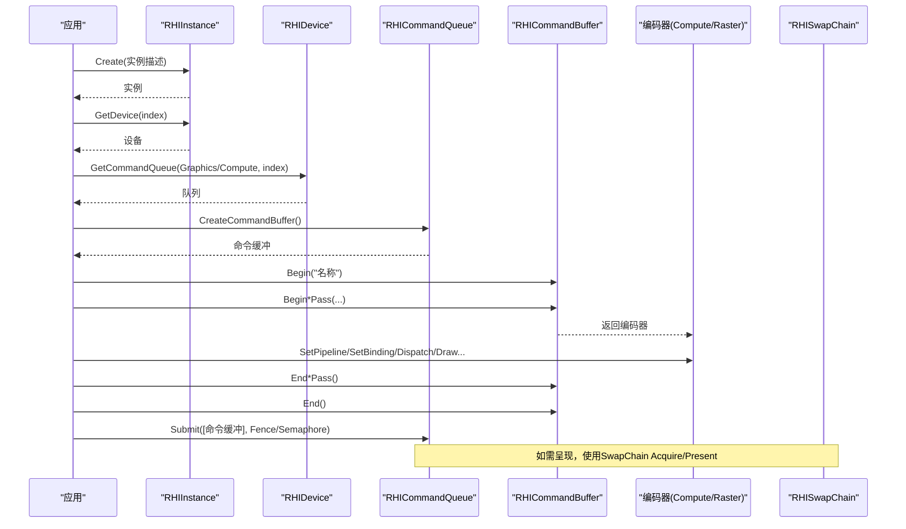
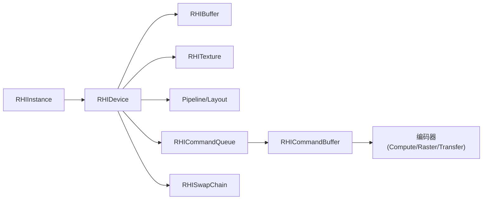
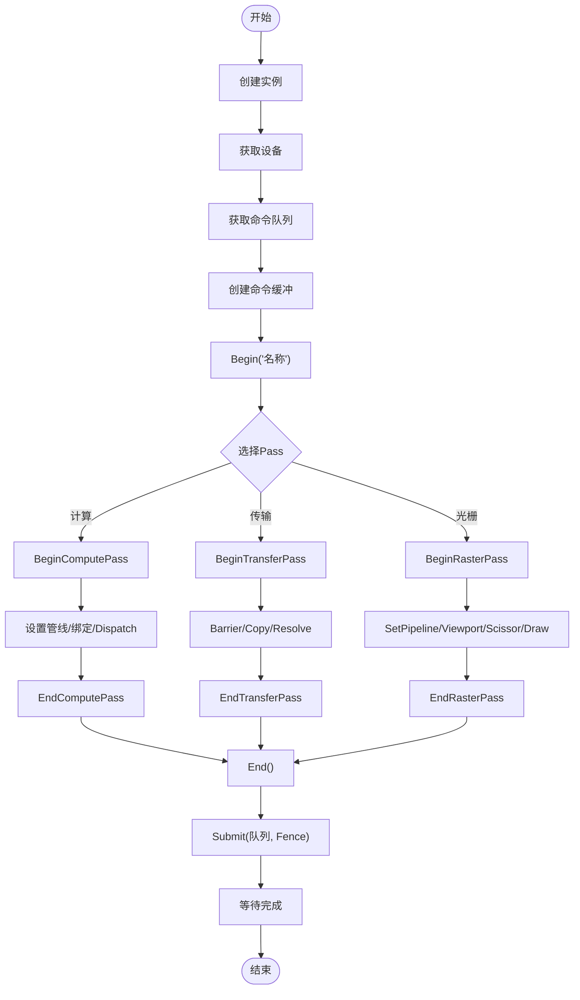

# API参考

<cite>
**本文引用的文件**
- [RHIInstance.cs](file://src/SharpGPU/Abstract/RHIInstance.cs)
- [RHIDevice.cs](file://src/SharpGPU/Abstract/RHIDevice.cs)
- [RHIBuffer.cs](file://src/SharpGPU/Abstract/RHIBuffer.cs)
- [RHITexture.cs](file://src/SharpGPU/Abstract/RHITexture.cs)
- [RHIPipeline.cs](file://src/SharpGPU/Abstract/RHIPipeline.cs)
- [RHICommandBuffer.cs](file://src/SharpGPU/Abstract/RHICommandBuffer.cs)
- [RHISwapChain.cs](file://src/SharpGPU/Abstract/RHISwapChain.cs)
- [RHISampler.cs](file://src/SharpGPU/Abstract/RHISampler.cs)
- [RHIMemory.cs](file://src/SharpGPU/Abstract/RHIMemory.cs)
- [Dx12Instance.cs](file://src/SharpGPU/Dx12/Dx12Instance.cs)
- [ComputeWorkload.cs](file://samples/ComputeAndDraw/ComputeWorkload.cs)
- [RasterWorkload.cs](file://samples/ComputeAndDraw/RasterWorkload.cs)
</cite>

## 目录
1. [简介](#简介)
2. [项目结构](#项目结构)
3. [核心组件](#核心组件)
4. [架构总览](#架构总览)
5. [详细组件分析](#详细组件分析)
6. [依赖关系分析](#依赖关系分析)
7. [性能考虑](#性能考虑)
8. [故障排查指南](#故障排查指南)
9. [结论](#结论)
10. [附录：示例与最佳实践](#附录示例与最佳实践)

## 简介
本API参考面向SharpGPU的公共抽象层（HAL），覆盖实例、设备、资源管理（缓冲、纹理、管线等）、命令与交换链等关键接口。文档聚焦于方法签名、参数与返回值语义、调用顺序、错误处理模式、性能注意事项与线程安全要点，并通过仓库中的示例展示正确用法。

## 项目结构
- 抽象层位于 src/SharpGPU/Abstract，定义跨后端一致的RHI接口与数据结构。
- 后端实现位于 src/SharpGPU/{Dx12,Metal,Vulkan}，提供具体平台能力与原生交互。
- 示例位于 samples/ComputeAndDraw，演示计算与光栅化工作负载的标准流程。
- 构建与验证脚本位于 eng/，文档与设计说明位于 docs/。

图表来源
- [RHIInstance.cs:46-156](file://src/SharpGPU/Abstract/RHIInstance.cs#L46-L156)
- [RHIDevice.cs:422-601](file://src/SharpGPU/Abstract/RHIDevice.cs#L422-L601)
- [RHICommandBuffer.cs:26-190](file://src/SharpGPU/Abstract/RHICommandBuffer.cs#L26-L190)
- [RHISwapChain.cs:299-451](file://src/SharpGPU/Abstract/RHISwapChain.cs#L299-L451)

章节来源
- [RHIInstance.cs:46-156](file://src/SharpGPU/Abstract/RHIInstance.cs#L46-L156)
- [RHIDevice.cs:422-601](file://src/SharpGPU/Abstract/RHIDevice.cs#L422-L601)
- [RHICommandBuffer.cs:26-190](file://src/SharpGPU/Abstract/RHICommandBuffer.cs#L26-L190)
- [RHISwapChain.cs:299-451](file://src/SharpGPU/Abstract/RHISwapChain.cs#L299-L451)

## 核心组件
- RHIInstance：后端实例化、设备枚举、平台能力探测。
- RHIDevice：设备信息、能力查询、资源与同步原语工厂、内存需求查询。
- 资源类：RHIBuffer、RHITexture、RHISampler、RHIBufferView、RHITextureView。
- 管线：RHIPipelineLayout、RHIComputePipeline、RHIRasterPipeline、RHIRaytracingPipeline、RHIWorkGraphPipeline。
- 命令：RHICommandQueue、RHICommandBuffer、各类Pass编码器。
- 呈现：RHISwapChain（获取回缓冲、调整大小、呈现）。
- 内存：RHIHeap、RHIResourceMemoryRequirements、稀疏纹理支持。

章节来源
- [RHIInstance.cs:6-156](file://src/SharpGPU/Abstract/RHIInstance.cs#L6-L156)
- [RHIDevice.cs:9-800](file://src/SharpGPU/Abstract/RHIDevice.cs#L9-L800)
- [RHIBuffer.cs:6-47](file://src/SharpGPU/Abstract/RHIBuffer.cs#L6-L47)
- [RHITexture.cs:7-139](file://src/SharpGPU/Abstract/RHITexture.cs#L7-L139)
- [RHISampler.cs:6-36](file://src/SharpGPU/Abstract/RHISampler.cs#L6-L36)
- [RHIPipeline.cs:11-800](file://src/SharpGPU/Abstract/RHIPipeline.cs#L11-L800)
- [RHICommandBuffer.cs:6-190](file://src/SharpGPU/Abstract/RHICommandBuffer.cs#L6-L190)
- [RHISwapChain.cs:7-567](file://src/SharpGPU/Abstract/RHISwapChain.cs#L7-L567)
- [RHIMemory.cs:9-800](file://src/SharpGPU/Abstract/RHIMemory.cs#L9-L800)

## 架构总览
SharpGPU采用“抽象HAL + 多后端实现”的分层设计。上层通过统一的RHI接口创建实例、设备与资源，后端在内部完成具体原生API绑定与能力探测。命令录制遵循“开始记录 -> 开启Pass -> 设置状态/绑定 -> 提交绘制/计算 -> 结束Pass -> 结束记录 -> 提交队列”的严格顺序。

图表来源
- [RHIInstance.cs:122-156](file://src/SharpGPU/Abstract/RHIInstance.cs#L122-L156)
- [RHIDevice.cs:527-601](file://src/SharpGPU/Abstract/RHIDevice.cs#L527-L601)
- [RHICommandBuffer.cs:170-190](file://src/SharpGPU/Abstract/RHICommandBuffer.cs#L170-L190)
- [RHISwapChain.cs:327-451](file://src/SharpGPU/Abstract/RHISwapChain.cs#L327-L451)

## 详细组件分析

### RHIInstance（实例）
- 作用：选择并初始化后端，枚举设备，提供平台能力检测。
- 关键成员
  - RHIInstanceDescriptor：后端类型、表面类型、调试/验证开关、各队列请求数。
  - DeviceCount、BackendType、GetDevice(index)。
  - IsBackendSupported(backend, out reason)：检查当前平台是否支持指定后端。
  - GetBackendByPlatform(forceVulkan)：按平台自动选择默认后端。
  - Create(descriptor)：根据后端创建具体实例。
- 错误处理：不支持的后端抛出异常；未编译的后端路径会抛出特定异常。
- 线程安全：静态方法无共享可变状态；实例创建后由调用方负责生命周期。

章节来源
- [RHIInstance.cs:6-156](file://src/SharpGPU/Abstract/RHIInstance.cs#L6-L156)
- [Dx12Instance.cs:20-130](file://src/SharpGPU/Dx12/Dx12Instance.cs#L20-L130)

### RHIDevice（设备）
- 作用：设备信息查询、能力探测、资源与同步原语工厂、内存需求查询。
- 关键属性
  - Name、VendorId、DeviceId、DriverVersion、Type、BackendType、Limit、Capabilities、AdapterIdentity。
  - ComputeQueueCount、TransferQueueCount、GraphicsQueueCount。
  - State、DeviceLossDiagnostic：设备状态与丢失诊断。
- 关键方法
  - GetCommandQueue(pipeline, index)：获取命令队列。
  - CreateSwapChain/CreateFence/CreateSemaphore/CreateStorageQueue/CreateQuery/CreateHeap。
  - CreateBuffer/CreateTexture/CreateSamplerFeedbackMap（可选）。
  - QueryRasterAttachmentSupport/QueryFormatSupport/QueryResolveSupport：能力查询。
  - QueryClockCalibration：时钟校准。
  - QueryCooperativeMatrixConfigs：协矩阵配置查询（可选）。
- 错误处理：设备不可用或丢失时抛出RHIException；参数校验失败抛出标准异常。
- 线程安全：设备状态读写使用锁与Volatile；多线程访问需外部同步或使用独立队列。

章节来源
- [RHIDevice.cs:9-800](file://src/SharpGPU/Abstract/RHIDevice.cs#L9-L800)

### 资源：缓冲与纹理
- RHIBuffer
  - Descriptor：字节大小、格式、用途标志、存储模式。
  - Map/UnMap：CPU映射读写。
  - CreateBufferView：创建视图用于着色器绑定。
- RHITexture
  - Descriptor：Mip数量、尺寸、像素格式、采样数、存储模式、用途、维度。
  - CreateTextureView：创建视图。
  - 采样反馈相关：IsSamplerFeedbackMap、PairedSamplerFeedbackTexture、SamplerFeedbackMode/MipRegion。
- 内存与堆
  - RHIResourceMemoryRequirements：大小、对齐、存储模式、兼容性掩码。
  - RHIHeapDescription/RHIHeap：堆描述与分配、放置资源注册、稀疏纹理支持。
  - 稀疏纹理：RHISparseTextureMemoryRequirements、RHISparseTextureTileBinding等。

章节来源
- [RHIBuffer.cs:6-47](file://src/SharpGPU/Abstract/RHIBuffer.cs#L6-L47)
- [RHITexture.cs:7-139](file://src/SharpGPU/Abstract/RHITexture.cs#L7-L139)
- [RHIMemory.cs:9-800](file://src/SharpGPU/Abstract/RHIMemory.cs#L9-L800)

### 管线与布局
- RHIPipelineLayout：绑定表布局、推送常量、静态采样器。
- RHIComputePipeline：线程组大小、函数、布局。
- RHIRasterPipeline：采样数、颜色/深度格式、附件接口、渲染状态、顶点/网格装配器、片段函数。
- RHIRaytracingPipeline：线程组、负载/属性大小、递归深度、函数库、射线组。
- RHIWorkGraphPipeline：名称、函数库、布局。
- 校验：RHIRasterPipelineContract对附件、混合、深度模板等进行强校验。

章节来源
- [RHIPipeline.cs:11-800](file://src/SharpGPU/Abstract/RHIPipeline.cs#L11-L800)

### 命令与编码器
- RHICommandQueue：从设备获取，承载命令缓冲提交。
- RHICommandBuffer
  - Begin/End：记录生命周期。
  - Begin*Pass/End*Pass：传输、计算、光线追踪、光栅、机器学习、工作图Pass。
  - Get*Encoder：获取对应编码器。
  - 状态机：Initial -> Recording -> Executable -> Submitted，非法转换抛异常。
- 典型顺序：Begin -> BeginCompute/Raster/Transfer -> 设置状态/绑定 -> 调度/绘制 -> End*Pass -> End -> Submit。

章节来源
- [RHICommandBuffer.cs:6-190](file://src/SharpGPU/Abstract/RHICommandBuffer.cs#L6-L190)

### 交换链（呈现）
- RHISwapChain
  - BackTextureIndex、ImageCount。
  - AcquireBackBuffer：获取回缓冲图像，支持超时、信号量、完成栅栏。
  - Resize：窗口大小变化。
  - Present：等待信号量并提交呈现，支持完成栅栏。
- 结果与状态：AcquireResult/OperationResult封装状态、诊断与有效性校验。
- 错误处理：设备丢失或表面丢失时标记设备状态并抛出诊断。

章节来源
- [RHISwapChain.cs:7-567](file://src/SharpGPU/Abstract/RHISwapChain.cs#L7-L567)

### 采样器
- RHISamplerDescriptor：LOD范围、各向异性、过滤模式、寻址模式、比较模式。
- RHIStaticSamplerElement/Descriptor：静态采样器绑定元素与索引。

章节来源
- [RHISampler.cs:6-36](file://src/SharpGPU/Abstract/RHISampler.cs#L6-L36)

## 依赖关系分析
- RHIInstance依赖后端实现（如Dx12Instance）进行原生初始化与设备枚举。
- RHIDevice依赖能力查询与后端实现以暴露资源创建与内存需求。
- 资源与管线依赖设备；命令缓冲依赖队列；呈现依赖设备与交换链。
- 示例代码展示了从实例到设备、队列、命令缓冲、资源、管线、编码器的完整依赖链。

图表来源
- [RHIInstance.cs:122-156](file://src/SharpGPU/Abstract/RHIInstance.cs#L122-L156)
- [RHIDevice.cs:527-601](file://src/SharpGPU/Abstract/RHIDevice.cs#L527-L601)
- [RHICommandBuffer.cs:170-190](file://src/SharpGPU/Abstract/RHICommandBuffer.cs#L170-L190)
- [RHISwapChain.cs:327-451](file://src/SharpGPU/Abstract/RHISwapChain.cs#L327-L451)

章节来源
- [RHIInstance.cs:122-156](file://src/SharpGPU/Abstract/RHIInstance.cs#L122-L156)
- [RHIDevice.cs:527-601](file://src/SharpGPU/Abstract/RHIDevice.cs#L527-L601)
- [RHICommandBuffer.cs:170-190](file://src/SharpGPU/Abstract/RHICommandBuffer.cs#L170-L190)
- [RHISwapChain.cs:327-451](file://src/SharpGPU/Abstract/RHISwapChain.cs#L327-L451)

## 性能考虑
- 资源复用：尽量重用缓冲、纹理、管线与布局，避免频繁创建销毁。
- 内存对齐：使用设备提供的内存需求与对齐信息进行堆分配与放置，减少碎片。
- 批量化：合并多次小操作为一次Pass或批量提交，降低驱动开销。
- 屏障最小化：仅在必要时插入状态/数据屏障，避免过度同步。
- 异步与队列：合理分配计算/传输/图形队列，利用并行性。
- 能力探测：使用前先查询能力（格式支持、MSAA解析、附件组合），避免运行时降级。
- 呈现策略：选择合适的Present模式，避免不必要的垂直同步阻塞。

[本节为通用指导，不直接分析具体文件]

## 故障排查指南
- 设备丢失：当出现DeviceLost状态，需重建设备与资源；捕获并处理RHIException。
- 命令缓冲状态错误：确保Begin/End与Pass成对调用，避免重复Begin或无效End。
- 交换链状态：Acquire/Present返回非Success状态时需处理（如OutOfDate、Suboptimal）。
- 参数校验失败：检查格式、用途、维度、采样数、对齐等是否符合要求。
- 能力不足：使用Query*Support提前判断，否则可能抛出NotSupportedException。

章节来源
- [RHIDevice.cs:465-525](file://src/SharpGPU/Abstract/RHIDevice.cs#L465-L525)
- [RHICommandBuffer.cs:36-151](file://src/SharpGPU/Abstract/RHICommandBuffer.cs#L36-L151)
- [RHISwapChain.cs:246-297](file://src/SharpGPU/Abstract/RHISwapChain.cs#L246-L297)

## 结论
SharpGPU通过清晰的抽象层与多后端实现，提供了统一且强大的GPU编程接口。正确使用实例、设备、资源、命令与呈现的流程，结合能力查询与错误处理，可在不同平台上获得一致的高性能体验。建议始终遵循API的顺序约束与校验规则，充分利用队列与内存管理能力，以获得最佳性能与稳定性。

[本节为总结，不直接分析具体文件]

## 附录：示例与最佳实践

### 计算工作负载（Compute）
- 步骤概览
  - 创建实例与设备，选择后端。
  - 创建函数、管线布局、计算管线。
  - 创建输出缓冲与读回缓冲，创建视图与绑定表。
  - 录制命令：Begin -> BeginComputePass -> Barrier/SetPipeline/SetBindingTable/Dispatch -> EndComputePass -> BeginTransferPass -> CopyBufferToBuffer -> EndTransferPass -> End。
  - 提交队列并等待栅栏，读取结果。
- 关键点
  - 使用正确的用途标志与存储模式。
  - 在Compute与Transfer之间插入合适的Barrier。
  - 使用Fence确保执行完成后再读回。

章节来源
- [ComputeWorkload.cs:17-161](file://samples/ComputeAndDraw/ComputeWorkload.cs#L17-L161)

### 光栅化工作负载（Raster）
- 步骤概览
  - 创建实例与设备，获取图形队列。
  - 创建目标纹理、管线布局、顶点和片段函数、光栅管线。
  - 录制命令：Begin -> PrepareRenderTarget(Transfer) -> BeginRasterPass -> SetPipeline/SetViewport/SetScissor/Statistics -> Draw -> EndRasterPass -> Transfer Resolve -> End。
  - 提交队列并等待栅栏，读取统计结果。
- 关键点
  - 颜色附件格式与用途必须匹配。
  - 使用Statistics进行管线统计。
  - 注意渲染前将纹理过渡到RenderTarget布局。

章节来源
- [RasterWorkload.cs:37-161](file://samples/ComputeAndDraw/RasterWorkload.cs#L37-L161)

### 常见调用顺序流程图

图表来源
- [RHICommandBuffer.cs:170-190](file://src/SharpGPU/Abstract/RHICommandBuffer.cs#L170-L190)
- [ComputeWorkload.cs:116-147](file://samples/ComputeAndDraw/ComputeWorkload.cs#L116-L147)
- [RasterWorkload.cs:104-152](file://samples/ComputeAndDraw/RasterWorkload.cs#L104-L152)

### 线程安全与生命周期
- 设备状态变更：设备丢失时通过MarkDeviceLost更新状态，后续调用应抛出诊断异常。
- 命令缓冲状态机：严格遵循状态转换，避免并发Begin/End或嵌套编码器。
- 交换链同步：Acquire/Present中预留的信号量与栅栏需在异常路径回滚，避免死锁。
- 资源释放：遵循“视图先于资源、堆先于放置资源”的释放顺序。

章节来源
- [RHIDevice.cs:465-525](file://src/SharpGPU/Abstract/RHIDevice.cs#L465-L525)
- [RHICommandBuffer.cs:36-151](file://src/SharpGPU/Abstract/RHICommandBuffer.cs#L36-L151)
- [RHISwapChain.cs:327-451](file://src/SharpGPU/Abstract/RHISwapChain.cs#L327-L451)