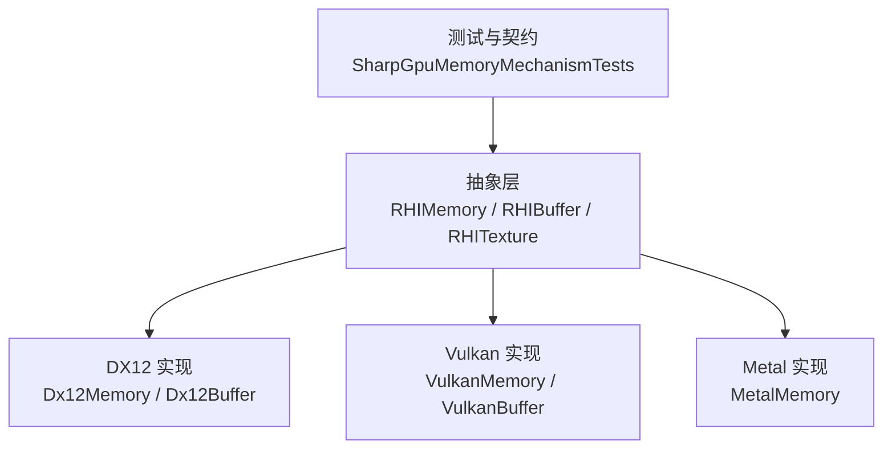
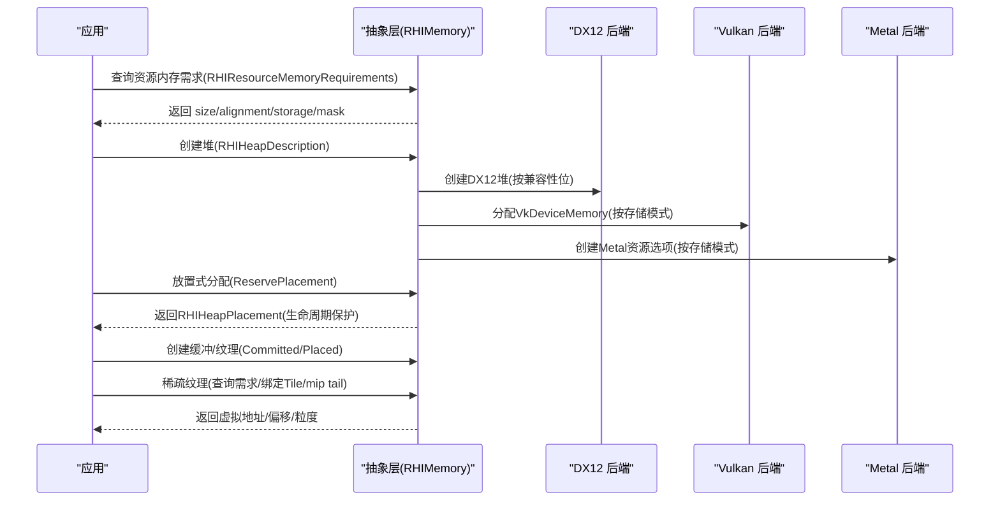
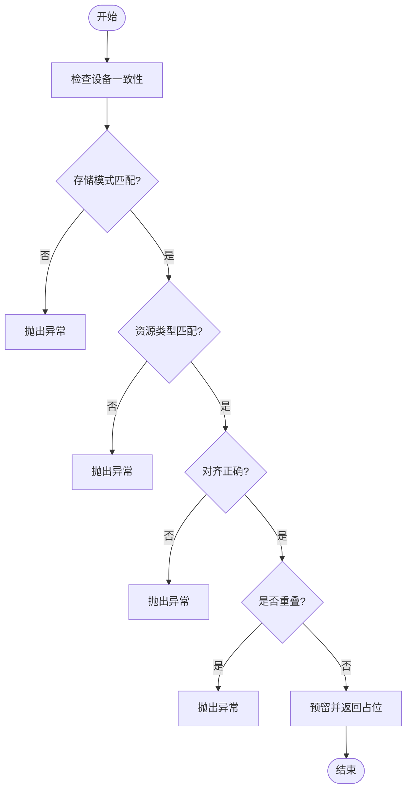
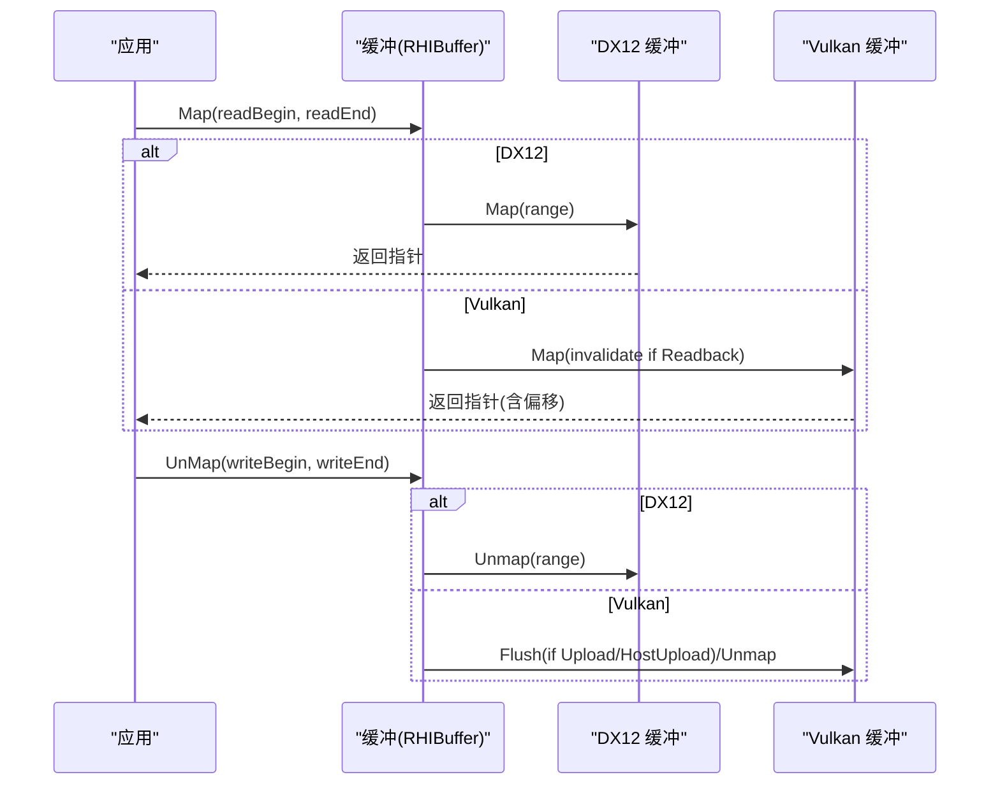
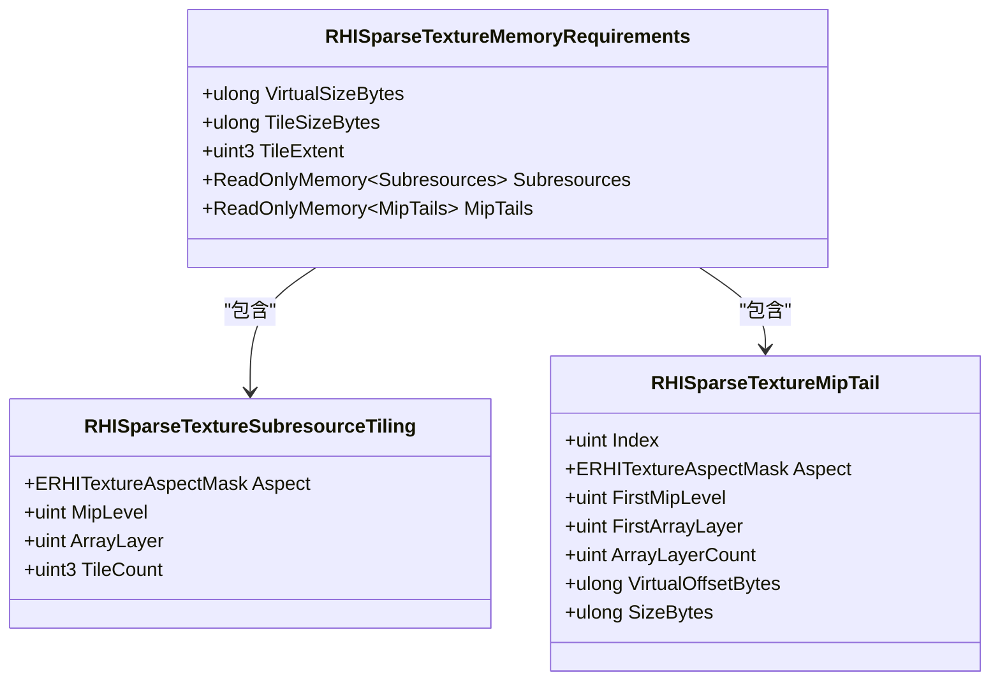
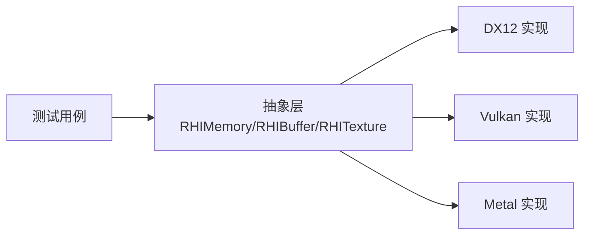

# 内存管理API

<cite>
**本文引用的文件**
- [RHIMemory.cs](file://src/SharpGPU/Abstract/RHIMemory.cs)
- [RHIUtility.cs](file://src/SharpGPU/Abstract/RHIUtility.cs)
- [RHIBuffer.cs](file://src/SharpGPU/Abstract/RHIBuffer.cs)
- [RHITexture.cs](file://src/SharpGPU/Abstract/RHITexture.cs)
- [Dx12Memory.cs](file://src/SharpGPU/Dx12/Dx12Memory.cs)
- [Dx12Buffer.cs](file://src/SharpGPU/Dx12/Dx12Buffer.cs)
- [VulkanMemory.cs](file://src/SharpGPU/Vulkan/VulkanMemory.cs)
- [VulkanBuffer.cs](file://src/SharpGPU/Vulkan/VulkanBuffer.cs)
- [MetalMemory.cs](file://src/SharpGPU/Metal/MetalMemory.cs)
- [SharpGpuMemoryMechanismTests.cs](file://tests/SharpGPU.Conformance.Tests/SharpGpuMemoryMechanismTests.cs)
</cite>

## 目录
1. [简介](#简介)
2. [项目结构](#项目结构)
3. [核心组件](#核心组件)
4. [架构总览](#架构总览)
5. [详细组件分析](#详细组件分析)
6. [依赖关系分析](#依赖关系分析)
7. [性能考虑](#性能考虑)
8. [故障排查指南](#故障排查指南)
9. [结论](#结论)
10. [附录](#附录)

## 简介
本文件系统化梳理 SharpGPU 的内存管理 API，重点覆盖：
- 内存分配器 RHIHeap 与放置式分配（Placed）机制
- 显存与主机内存之间的数据传输路径（HostUpload/GPUUpload/Readback/GPULocal）
- 稀疏纹理（Sparse Texture）的虚拟地址、分块（Tile）与 mip tail 模型
- 内存映射、数据上传/下载的最佳实践
- 内存泄漏防护、碎片化控制与性能优化建议

## 项目结构
SharpGPU 将内存抽象定义在 Abstract 层，各后端（DX12/Vulkan/Metal）实现具体堆与资源创建、映射与绑定逻辑。测试用例验证了堆放置、对齐、重叠检测、稀疏绑定等关键行为。

图表来源
- [RHIMemory.cs:1-800](file://src/SharpGPU/Abstract/RHIMemory.cs#L1-L800)
- [Dx12Memory.cs:1-357](file://src/SharpGPU/Dx12/Dx12Memory.cs#L1-L357)
- [VulkanMemory.cs:1-731](file://src/SharpGPU/Vulkan/VulkanMemory.cs#L1-L731)
- [MetalMemory.cs:1-354](file://src/SharpGPU/Metal/MetalMemory.cs#L1-L354)
- [SharpGpuMemoryMechanismTests.cs:1-508](file://tests/SharpGPU.Conformance.Tests/SharpGpuMemoryMechanismTests.cs#L1-L508)

章节来源
- [RHIMemory.cs:1-800](file://src/SharpGPU/Abstract/RHIMemory.cs#L1-L800)
- [RHIUtility.cs:569-577](file://src/SharpGPU/Abstract/RHIUtility.cs#L569-L577)

## 核心组件
- 存储模式 ERHIStorageMode：GPULocal、Readback、GPUUpload、HostUpload、Memoryless
- 资源内存需求 RHIResourceMemoryRequirements：size、alignment、storage mode、兼容性掩码、资源类型
- 堆描述 RHIHeapDescription：size 与兼容性要求
- 堆 RHIHeap：封装原生堆，提供放置预留（ReservePlacement）、稀疏范围校验（ValidateSparseSpan）
- 放置占位 RHIHeapPlacement：RAII 风格的生命周期管理，防止堆提前释放
- 稀疏纹理需求 RHISparseTextureMemoryRequirements：虚拟大小、tile 尺寸/粒度、子资源 tile 网格、mip tail 信息
- 缓冲区/纹理抽象：RHIBuffer、RHITexture，提供 Map/Unmap、视图创建等

章节来源
- [RHIMemory.cs:23-165](file://src/SharpGPU/Abstract/RHIMemory.cs#L23-L165)
- [RHIMemory.cs:167-457](file://src/SharpGPU/Abstract/RHIMemory.cs#L167-L457)
- [RHIMemory.cs:459-800](file://src/SharpGPU/Abstract/RHIMemory.cs#L459-L800)
- [RHIBuffer.cs:6-47](file://src/SharpGPU/Abstract/RHIBuffer.cs#L6-L47)
- [RHITexture.cs:39-141](file://src/SharpGPU/Abstract/RHITexture.cs#L39-L141)
- [RHIUtility.cs:569-577](file://src/SharpGPU/Abstract/RHIUtility.cs#L569-L577)

## 架构总览
下图展示从应用到后端的内存分配与使用流程，包括放置式分配、稀疏纹理与不同存储模式的映射策略。

图表来源
- [RHIMemory.cs:167-457](file://src/SharpGPU/Abstract/RHIMemory.cs#L167-L457)
- [Dx12Memory.cs:318-357](file://src/SharpGPU/Dx12/Dx12Memory.cs#L318-L357)
- [VulkanMemory.cs:537-731](file://src/SharpGPU/Vulkan/VulkanMemory.cs#L537-L731)
- [MetalMemory.cs:8-87](file://src/SharpGPU/Metal/MetalMemory.cs#L8-L87)

## 详细组件分析

### 存储模式与访问权限
- GPULocal：GPU 本地显存，高性能但不可直接映射；适合渲染与计算读写
- GPUUpload：用于从 CPU 向 GPU 上传数据的临时缓冲
- HostUpload：CPU 可写、GPU 可读，适合频繁小量上传
- Readback：GPU 结果回读至 CPU，支持无效化缓存
- Memoryless：无后备存储（如 MSAA/Resolve 中间态），仅用于特定管线阶段

章节来源
- [RHIUtility.cs:569-577](file://src/SharpGPU/Abstract/RHIUtility.cs#L569-L577)
- [Dx12Memory.cs:115-123](file://src/SharpGPU/Dx12/Dx12Memory.cs#L115-L123)
- [VulkanMemory.cs:120-127](file://src/SharpGPU/Vulkan/VulkanMemory.cs#L120-L127)
- [MetalMemory.cs:76-86](file://src/SharpGPU/Metal/MetalMemory.cs#L76-L86)

### 堆与放置式分配（RHIHeap + RHIHeapPlacement）
- RHIHeap 负责原生堆生命周期与放置预留，严格校验：
  - 设备一致性、存储模式匹配、资源类型一致、原生标志兼容、对齐与范围不越界、不重叠
- RHIHeapPlacement 以 RAII 方式持有占用区间，释放时归还空间；堆销毁前若有活跃放置会失败，避免悬垂引用

图表来源
- [RHIMemory.cs:167-457](file://src/SharpGPU/Abstract/RHIMemory.cs#L167-L457)

章节来源
- [RHIMemory.cs:167-457](file://src/SharpGPU/Abstract/RHIMemory.cs#L167-L457)
- [SharpGpuMemoryMechanismTests.cs:16-81](file://tests/SharpGPU.Conformance.Tests/SharpGpuMemoryMechanismTests.cs#L16-L81)

### 缓冲区映射与数据传输
- DX12 缓冲：
  - 非 GPULocal 可 Map/Unmap；Map 返回指针，Unmap 指定写入范围
  - 通过 CreateCommittedResource 或 CreatePlacedResource 创建
- Vulkan 缓冲：
  - 非 GPULocal 可 Map/Unmap；支持共享映射（placed heap）与 invalidate/flush
  - 根据存储模式决定 flush/invalidate 行为
- Metal 缓冲：
  - 通过 MTLResourceOptions 配置存储模式与缓存策略

图表来源
- [Dx12Buffer.cs:99-146](file://src/SharpGPU/Dx12/Dx12Buffer.cs#L99-L146)
- [VulkanBuffer.cs:192-303](file://src/SharpGPU/Vulkan/VulkanBuffer.cs#L192-L303)

章节来源
- [Dx12Buffer.cs:37-146](file://src/SharpGPU/Dx12/Dx12Buffer.cs#L37-L146)
- [VulkanBuffer.cs:65-339](file://src/SharpGPU/Vulkan/VulkanBuffer.cs#L65-L339)
- [MetalMemory.cs:10-87](file://src/SharpGPU/Metal/MetalMemory.cs#L10-L87)

### 纹理与稀疏纹理（Sparse Texture）
- 普通纹理：
  - 创建描述符包含维度、格式、采样数、存储模式、用途
  - 各后端对纹理创建进行参数校验与转换
- 稀疏纹理：
  - 通过后端工具查询 RHISparseTextureMemoryRequirements：
    - 虚拟大小、tile 尺寸/粒度、标准子资源的 tile 网格、mip tail 区域
  - 绑定/解绑操作由命令队列执行，需满足对齐、范围、aspect 限制
  - 各后端对稀疏特性有额外约束（例如 DX12/Vulkan 当前仅暴露颜色面精确分块）

图表来源
- [RHIMemory.cs:515-748](file://src/SharpGPU/Abstract/RHIMemory.cs#L515-L748)
- [Dx12Memory.cs:130-312](file://src/SharpGPU/Dx12/Dx12Memory.cs#L130-L312)
- [VulkanMemory.cs:133-370](file://src/SharpGPU/Vulkan/VulkanMemory.cs#L133-L370)
- [MetalMemory.cs:92-354](file://src/SharpGPU/Metal/MetalMemory.cs#L92-L354)

章节来源
- [RHITexture.cs:39-141](file://src/SharpGPU/Abstract/RHITexture.cs#L39-L141)
- [Dx12Memory.cs:29-71](file://src/SharpGPU/Dx12/Dx12Memory.cs#L29-L71)
- [VulkanMemory.cs:33-90](file://src/SharpGPU/Vulkan/VulkanMemory.cs#L33-L90)
- [MetalMemory.cs:22-87](file://src/SharpGPU/Metal/MetalMemory.cs#L22-L87)
- [RHIMemory.cs:459-800](file://src/SharpGPU/Abstract/RHIMemory.cs#L459-L800)

### 内存预算与驻留（Budget & Residency）
- 预算查询（Vulkan）：
  - 通过扩展获取 memory heap 预算与使用量，聚合为 RHIMemoryBudget
- 驻留请求：
  - 通过 RHIResidencyRequestDescriptor 指定 MakeResident/Evict 及完成栅栏

章节来源
- [VulkanMemory.cs:376-533](file://src/SharpGPU/Vulkan/VulkanMemory.cs#L376-L533)
- [RHIMemory.cs:118-165](file://src/SharpGPU/Abstract/RHIMemory.cs#L118-L165)

## 依赖关系分析
- 抽象层依赖存储模式枚举与资源描述
- 各后端实现依赖各自原生 API（Direct3D12/Vulkan/Metal）
- 测试用例验证堆放置、对齐、重叠、稀疏绑定等行为

图表来源
- [RHIMemory.cs:1-800](file://src/SharpGPU/Abstract/RHIMemory.cs#L1-L800)
- [Dx12Memory.cs:1-357](file://src/SharpGPU/Dx12/Dx12Memory.cs#L1-L357)
- [VulkanMemory.cs:1-731](file://src/SharpGPU/Vulkan/VulkanMemory.cs#L1-L731)
- [MetalMemory.cs:1-354](file://src/SharpGPU/Metal/MetalMemory.cs#L1-L354)
- [SharpGpuMemoryMechanismTests.cs:1-508](file://tests/SharpGPU.Conformance.Tests/SharpGpuMemoryMechanismTests.cs#L1-L508)

章节来源
- [RHIUtility.cs:569-577](file://src/SharpGPU/Abstract/RHIUtility.cs#L569-L577)
- [SharpGpuMemoryMechanismTests.cs:16-81](file://tests/SharpGPU.Conformance.Tests/SharpGpuMemoryMechanismTests.cs#L16-L81)

## 性能考虑
- 优先使用 GPULocal 纹理/缓冲进行渲染与计算，减少跨域拷贝
- 上传路径：
  - 小批量频繁上传使用 HostUpload/GPUUpload 缓冲，合并批次降低同步开销
  - 大文件上传尽量一次性提交，避免多次 Map/Unmap
- 稀疏纹理：
  - 按需绑定 Tile，减少显存占用；合理划分 mip tail 区域
  - 遵循后端粒度与对齐约束，避免无效绑定
- 映射与缓存：
  - Vulkan Readback 需要 invalidate；GPUUpload/HostUpload 需要 flush
  - 避免长时间保持映射，及时 Unmap 释放总线带宽
- 堆与放置：
  - 使用 Placed 分配复用堆，减少碎片与分配次数
  - 确保对齐与范围不重叠，避免运行时错误

[本节为通用指导，无需源码引用]

## 故障排查指南
- 常见异常与原因
  - 对齐错误：offset/size 未满足 alignment；检查 RHIResourceMemoryRequirements.Alignment
  - 重叠冲突：多个放置区间重叠；检查 ReservePlacement 返回值与释放时机
  - 设备不一致：requirements 来自其他设备；确保同一设备上下文
  - 存储模式不匹配：堆与资源 storage mode 不一致
  - 稀疏绑定非法：aspect 多选、extent 为零、unbind 携带 heap
- 调试建议
  - 使用测试用例中的断言思路，逐步缩小问题范围
  - 记录每次 Map/Unmap 的范围与调用顺序，确认 flush/invalidate 是否正确
  - 对于稀疏纹理，打印 tile grid 与 mip tail 信息，核对后端约束

章节来源
- [RHIMemory.cs:218-327](file://src/SharpGPU/Abstract/RHIMemory.cs#L218-L327)
- [RHIMemory.cs:750-800](file://src/SharpGPU/Abstract/RHIMemory.cs#L750-L800)
- [Dx12Buffer.cs:99-146](file://src/SharpGPU/Dx12/Dx12Buffer.cs#L99-L146)
- [VulkanBuffer.cs:192-303](file://src/SharpGPU/Vulkan/VulkanBuffer.cs#L192-L303)
- [SharpGpuMemoryMechanismTests.cs:147-190](file://tests/SharpGPU.Conformance.Tests/SharpGpuMemoryMechanismTests.cs#L147-L190)

## 结论
SharpGPU 的内存管理以抽象层统一接口、后端差异化实现的方式，提供了：
- 严格的堆放置与生命周期管理，避免悬垂引用与碎片化
- 清晰的存储模式语义，指导高效的数据传输路径
- 完善的稀疏纹理模型，支持细粒度显存控制
结合最佳实践与故障排查方法，可在多后端上获得稳定且高性能的内存使用体验。

[本节为总结性内容，无需源码引用]

## 附录

### 代码示例路径（不含具体代码）
- 创建缓冲（Committed/Placed）
  - [Dx12Buffer.cs:37-86](file://src/SharpGPU/Dx12/Dx12Buffer.cs#L37-L86)
  - [VulkanBuffer.cs:65-181](file://src/SharpGPU/Vulkan/VulkanBuffer.cs#L65-L181)
- 缓冲映射与卸载
  - [Dx12Buffer.cs:99-146](file://src/SharpGPU/Dx12/Dx12Buffer.cs#L99-L146)
  - [VulkanBuffer.cs:192-303](file://src/SharpGPU/Vulkan/VulkanBuffer.cs#L192-L303)
- 纹理创建与视图
  - [Dx12Memory.cs:29-71](file://src/SharpGPU/Dx12/Dx12Memory.cs#L29-L71)
  - [VulkanMemory.cs:33-90](file://src/SharpGPU/Vulkan/VulkanMemory.cs#L33-L90)
  - [MetalMemory.cs:22-87](file://src/SharpGPU/Metal/MetalMemory.cs#L22-L87)
- 稀疏纹理需求查询与绑定
  - [Dx12Memory.cs:191-302](file://src/SharpGPU/Dx12/Dx12Memory.cs#L191-L302)
  - [VulkanMemory.cs:206-359](file://src/SharpGPU/Vulkan/VulkanMemory.cs#L206-L359)
  - [MetalMemory.cs:219-341](file://src/SharpGPU/Metal/MetalMemory.cs#L219-L341)
  - [RHIMemory.cs:515-800](file://src/SharpGPU/Abstract/RHIMemory.cs#L515-L800)
- 堆放置与生命周期
  - [RHIMemory.cs:167-457](file://src/SharpGPU/Abstract/RHIMemory.cs#L167-L457)
  - [SharpGpuMemoryMechanismTests.cs:16-81](file://tests/SharpGPU.Conformance.Tests/SharpGpuMemoryMechanismTests.cs#L16-L81)