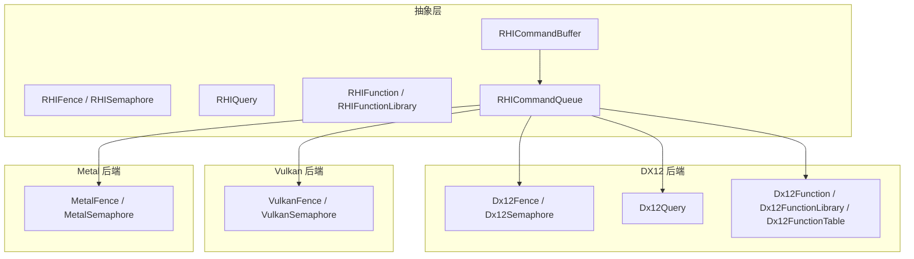
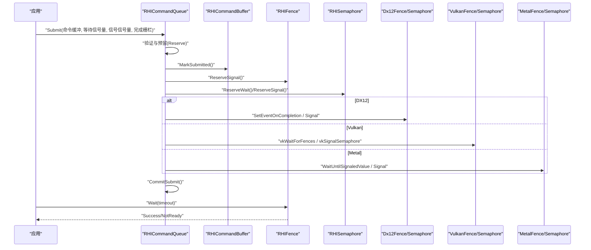
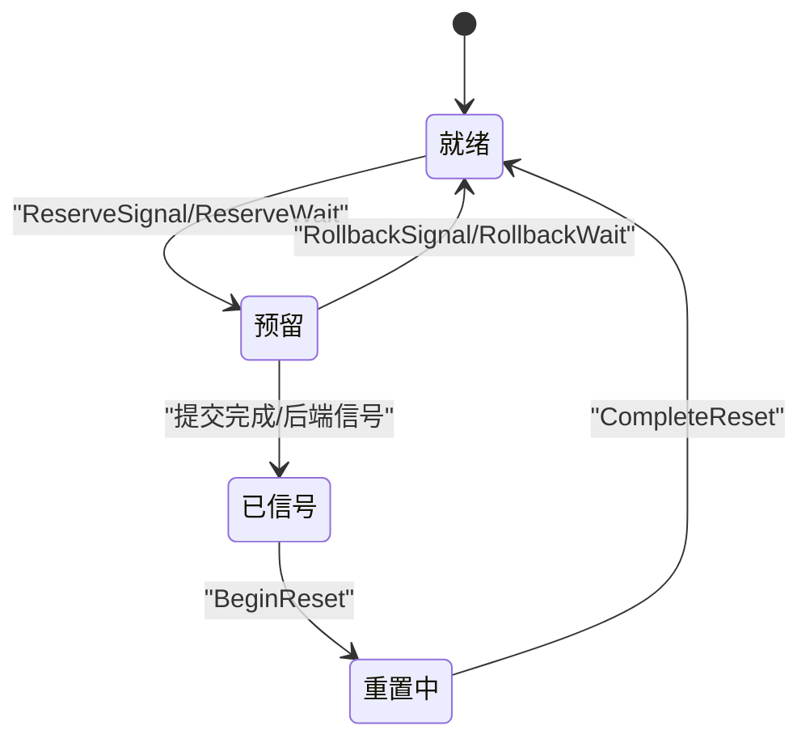
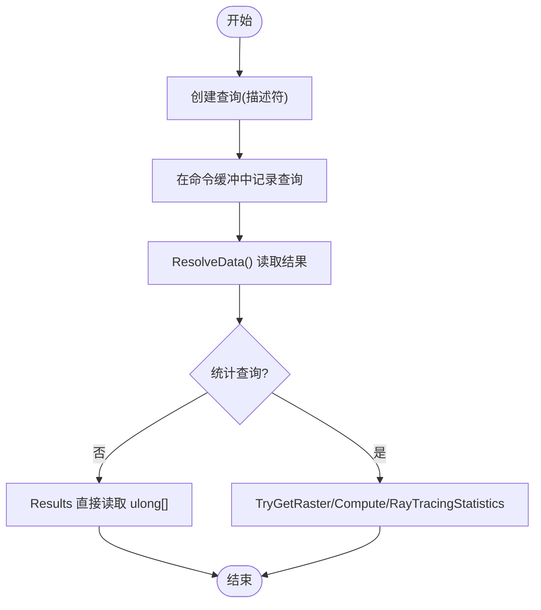
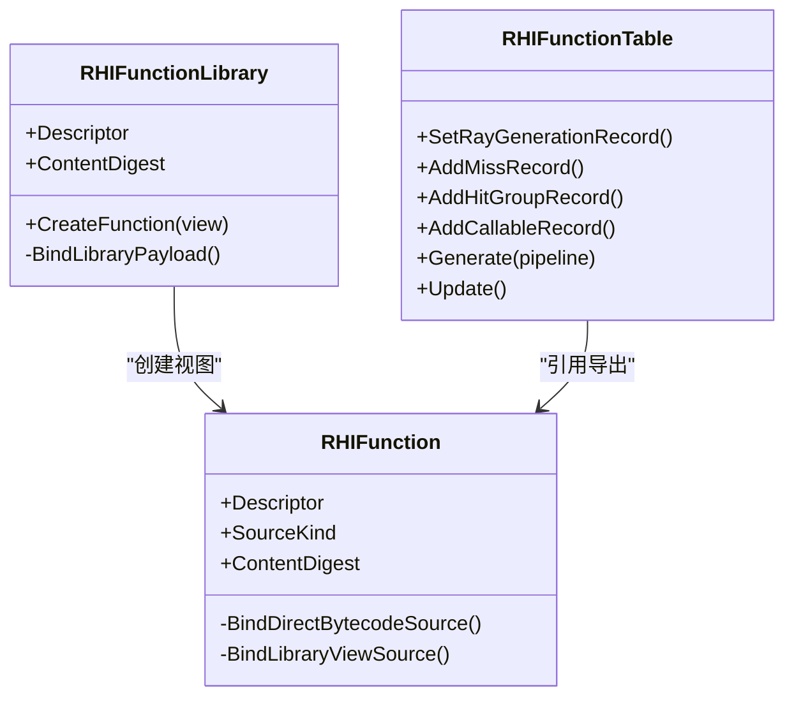
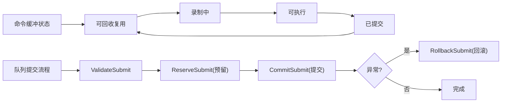
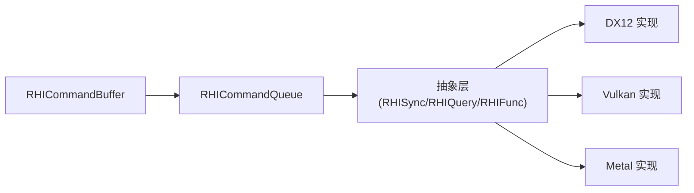

# 同步机制API

<cite>
**本文引用的文件**
- [RHISynchronous.cs](file://src/SharpGPU/Abstract/RHISynchronous.cs)
- [RHIQuery.cs](file://src/SharpGPU/Abstract/RHIQuery.cs)
- [RHIFunction.cs](file://src/SharpGPU/Abstract/RHIFunction.cs)
- [Dx12Synchronous.cs](file://src/SharpGPU/Dx12/Dx12Synchronous.cs)
- [Dx12Query.cs](file://src/SharpGPU/Dx12/Dx12Query.cs)
- [Dx12Function.cs](file://src/SharpGPU/Dx12/Dx12Function.cs)
- [VulkanSynchronous.cs](file://src/SharpGPU/Vulkan/VulkanSynchronous.cs)
- [MetalSynchronous.cs](file://src/SharpGPU/Metal/MetalSynchronous.cs)
- [RHICommandQueue.cs](file://src/SharpGPU/Abstract/RHICommandQueue.cs)
- [RHICommandBuffer.cs](file://src/SharpGPU/Abstract/RHICommandBuffer.cs)
</cite>

## 目录
1. [简介](#简介)
2. [项目结构](#项目结构)
3. [核心组件](#核心组件)
4. [架构总览](#架构总览)
5. [详细组件分析](#详细组件分析)
6. [依赖关系分析](#依赖关系分析)
7. [性能考虑](#性能考虑)
8. [故障排查指南](#故障排查指南)
9. [结论](#结论)
10. [附录：代码示例与最佳实践](#附录：代码示例与最佳实践)

## 简介
本文件面向使用 SharpGPU 的开发者，系统化说明同步机制 API 的设计与用法，重点覆盖以下主题：
- 栅栏（Fence）、二进制信号量（Semaphore）的状态机、提交与等待流程
- 查询（Query）：时间戳、遮挡、管线统计数据的记录与读取
- 事件（Event）：在 Metal 后端以共享事件实现完成栅栏与二进制信号量
- 函数库（Function/Library）：字节码加载、内容摘要、可重用视图与执行绑定
- CPU-GPU 同步模式：提交工作、设置同步点、等待完成、重置复用
- 多线程环境下的注意事项与性能优化建议

## 项目结构
SharpGPU 将同步原语抽象为后端无关接口，并在各后端（DX12、Vulkan、Metal）提供具体实现。命令队列负责统一提交语义，命令缓冲维护状态机以确保正确性。

图表来源
- [RHISynchronous.cs:14-176](file://src/SharpGPU/Abstract/RHISynchronous.cs#L14-L176)
- [RHIQuery.cs:310-446](file://src/SharpGPU/Abstract/RHIQuery.cs#L310-L446)
- [RHIFunction.cs:79-229](file://src/SharpGPU/Abstract/RHIFunction.cs#L79-L229)
- [RHICommandQueue.cs:60-108](file://src/SharpGPU/Abstract/RHICommandQueue.cs#L60-L108)
- [RHICommandBuffer.cs:26-190](file://src/SharpGPU/Abstract/RHICommandBuffer.cs#L26-L190)
- [Dx12Synchronous.cs:8-199](file://src/SharpGPU/Dx12/Dx12Synchronous.cs#L8-L199)
- [Dx12Query.cs:7-316](file://src/SharpGPU/Dx12/Dx12Query.cs#L7-L316)
- [Dx12Function.cs:10-224](file://src/SharpGPU/Dx12/Dx12Function.cs#L10-L224)
- [VulkanSynchronous.cs:7-155](file://src/SharpGPU/Vulkan/VulkanSynchronous.cs#L7-L155)
- [MetalSynchronous.cs:11-168](file://src/SharpGPU/Metal/MetalSynchronous.cs#L11-L168)

章节来源
- [RHISynchronous.cs:14-176](file://src/SharpGPU/Abstract/RHISynchronous.cs#L14-L176)
- [RHICommandQueue.cs:60-108](file://src/SharpGPU/Abstract/RHICommandQueue.cs#L60-L108)
- [RHICommandBuffer.cs:26-190](file://src/SharpGPU/Abstract/RHICommandBuffer.cs#L26-L190)

## 核心组件
- 栅栏（RHIFence）：用于标记 GPU 工作完成，支持状态查询、等待（带超时）、重置；内部通过原子状态机保证“准备-挂起-已信号-重置”等转换的正确性。
- 二进制信号量（RHISemaphore）：用于跨队列或跨设备同步，支持等待与信号的预留、提交与回滚，避免重复提交。
- 查询（RHIQuery）：支持时间戳、遮挡、管线统计三类查询；统计数据按域（光栅/计算/光线追踪）提供强类型访问。
- 函数与函数库（RHIFunction / RHIFunctionLibrary）：封装着色器字节码或库视图，生成内容摘要，支持创建函数视图并绑定到管线或表。
- 命令队列（RHICommandQueue）：统一提交命令缓冲与同步对象，校验参数、预留/提交/回滚同步操作，确保一致性。
- 命令缓冲（RHICommandBuffer）：维护录制/结束/提交状态机，防止非法嵌套与重复提交。

章节来源
- [RHISynchronous.cs:14-176](file://src/SharpGPU/Abstract/RHISynchronous.cs#L14-L176)
- [RHIQuery.cs:178-446](file://src/SharpGPU/Abstract/RHIQuery.cs#L178-L446)
- [RHIFunction.cs:79-229](file://src/SharpGPU/Abstract/RHIFunction.cs#L79-L229)
- [RHICommandQueue.cs:118-330](file://src/SharpGPU/Abstract/RHICommandQueue.cs#L118-L330)
- [RHICommandBuffer.cs:26-190](file://src/SharpGPU/Abstract/RHICommandBuffer.cs#L26-L190)

## 架构总览
下图展示从应用层到后端的同步调用链：应用通过命令队列提交命令缓冲与同步对象，后端实现将同步原语映射到原生 API（如 D3D12 Fence、Vulkan Fence、Metal Shared Event）。

图表来源
- [RHICommandQueue.cs:118-330](file://src/SharpGPU/Abstract/RHICommandQueue.cs#L118-L330)
- [Dx12Synchronous.cs:82-149](file://src/SharpGPU/Dx12/Dx12Synchronous.cs#L82-L149)
- [VulkanSynchronous.cs:90-121](file://src/SharpGPU/Vulkan/VulkanSynchronous.cs#L90-L121)
- [MetalSynchronous.cs:72-120](file://src/SharpGPU/Metal/MetalSynchronous.cs#L72-L120)

## 详细组件分析

### 栅栏（Fence）与二进制信号量（Semaphore）
- 状态机：就绪（Ready）→ 预留（Pending）→ 已信号（Signaled）→ 重置中（Resetting）→ 就绪。基类通过原子比较交换保证并发安全，并提供 BeginReset/CompleteReset/RollbackReset 等受保护方法。
- 等待：后端实现根据平台特性选择高效等待方式（D3D12 SetEventOnCompletion + AutoResetEvent，Vulkan vkWaitForFences，Metal MTLSharedEvent.WaitUntilSignaledValue）。
- 二进制信号量：支持等待与信号的预留/提交/回滚，避免重复提交与竞态。

图表来源
- [RHISynchronous.cs:14-176](file://src/SharpGPU/Abstract/RHISynchronous.cs#L14-L176)
- [RHISynchronous.cs:178-280](file://src/SharpGPU/Abstract/RHISynchronous.cs#L178-L280)
- [Dx12Synchronous.cs:8-199](file://src/SharpGPU/Dx12/Dx12Synchronous.cs#L8-L199)
- [VulkanSynchronous.cs:7-155](file://src/SharpGPU/Vulkan/VulkanSynchronous.cs#L7-L155)
- [MetalSynchronous.cs:11-168](file://src/SharpGPU/Metal/MetalSynchronous.cs#L11-L168)

章节来源
- [RHISynchronous.cs:14-176](file://src/SharpGPU/Abstract/RHISynchronous.cs#L14-L176)
- [RHISynchronous.cs:178-280](file://src/SharpGPU/Abstract/RHISynchronous.cs#L178-L280)
- [Dx12Synchronous.cs:8-199](file://src/SharpGPU/Dx12/Dx12Synchronous.cs#L8-L199)
- [VulkanSynchronous.cs:7-155](file://src/SharpGPU/Vulkan/VulkanSynchronous.cs#L7-L155)
- [MetalSynchronous.cs:11-168](file://src/SharpGPU/Metal/MetalSynchronous.cs#L11-L168)

### 查询（Query）：时间戳、遮挡与管线统计
- 描述符（RHIQueryDescriptor）：指定类型（时间戳/遮挡/统计）、数量、统计域与计数器掩码。
- 结果读取：ResolveData 将后端查询结果复制到托管内存；统计查询提供强类型 TryGet*Statistics 方法。
- 后端差异：DX12 根据能力选择 PipelineStatistics 或 PipelineStatistics1，并分配对应大小的读回缓冲区。

图表来源
- [RHIQuery.cs:178-446](file://src/SharpGPU/Abstract/RHIQuery.cs#L178-L446)
- [Dx12Query.cs:36-153](file://src/SharpGPU/Dx12/Dx12Query.cs#L36-L153)
- [Dx12Query.cs:155-306](file://src/SharpGPU/Dx12/Dx12Query.cs#L155-L306)

章节来源
- [RHIQuery.cs:178-446](file://src/SharpGPU/Abstract/RHIQuery.cs#L178-L446)
- [Dx12Query.cs:36-153](file://src/SharpGPU/Dx12/Dx12Query.cs#L36-L153)
- [Dx12Query.cs:155-306](file://src/SharpGPU/Dx12/Dx12Query.cs#L155-L306)

### 函数库（Function/Library）：加载与执行
- 函数（RHIFunction）：支持直接字节码或库视图两种来源；生成内容摘要用于缓存与一致性检查。
- 函数库（RHIFunctionLibrary）：持有字节码与摘要，CreateFunction 基于视图创建函数实例；DX12 会校验功能库能力与阶段类别。
- 函数表（RHIFunctionTable）：管理光线追踪相关记录（RayGeneration/Miss/HitGroup/Callable），Generate/Update 写入 GPU 可见表。

图表来源
- [RHIFunction.cs:79-229](file://src/SharpGPU/Abstract/RHIFunction.cs#L79-L229)
- [Dx12Function.cs:10-224](file://src/SharpGPU/Dx12/Dx12Function.cs#L10-L224)
- [Dx12Function.cs:238-667](file://src/SharpGPU/Dx12/Dx12Function.cs#L238-L667)

章节来源
- [RHIFunction.cs:79-229](file://src/SharpGPU/Abstract/RHIFunction.cs#L79-L229)
- [Dx12Function.cs:10-224](file://src/SharpGPU/Dx12/Dx12Function.cs#L10-L224)
- [Dx12Function.cs:238-667](file://src/SharpGPU/Dx12/Dx12Function.cs#L238-L667)

### 命令队列与命令缓冲的状态机
- 命令缓冲：Initial → Recording → Executable → Submitted，禁止重复开始编码器、必须在结束编码器后才能结束缓冲。
- 命令队列：提交前进行严格校验（空提交检测、唯一性、设备归属、阶段掩码合法性），并通过预留/提交/回滚三阶段保证原子性。

图表来源
- [RHICommandBuffer.cs:26-190](file://src/SharpGPU/Abstract/RHICommandBuffer.cs#L26-L190)
- [RHICommandQueue.cs:118-330](file://src/SharpGPU/Abstract/RHICommandQueue.cs#L118-L330)

章节来源
- [RHICommandBuffer.cs:26-190](file://src/SharpGPU/Abstract/RHICommandBuffer.cs#L26-L190)
- [RHICommandQueue.cs:118-330](file://src/SharpGPU/Abstract/RHICommandQueue.cs#L118-L330)

## 依赖关系分析
- 抽象层对后端无直接依赖，仅定义接口与数据结构。
- 后端实现依赖各自原生 API（D3D12、Vulkan、Metal），并通过工具类进行错误处理与资源管理。
- 命令队列依赖所有同步原语与命令缓冲，承担一致性校验与生命周期协调。

图表来源
- [RHISynchronous.cs:14-176](file://src/SharpGPU/Abstract/RHISynchronous.cs#L14-L176)
- [RHIQuery.cs:310-446](file://src/SharpGPU/Abstract/RHIQuery.cs#L310-L446)
- [RHIFunction.cs:79-229](file://src/SharpGPU/Abstract/RHIFunction.cs#L79-L229)
- [RHICommandQueue.cs:60-108](file://src/SharpGPU/Abstract/RHICommandQueue.cs#L60-L108)
- [RHICommandBuffer.cs:26-190](file://src/SharpGPU/Abstract/RHICommandBuffer.cs#L26-L190)

章节来源
- [RHISynchronous.cs:14-176](file://src/SharpGPU/Abstract/RHISynchronous.cs#L14-L176)
- [RHICommandQueue.cs:60-108](file://src/SharpGPU/Abstract/RHICommandQueue.cs#L60-L108)

## 性能考虑
- 减少同步开销：尽量批量化提交工作，避免每帧多次小提交；合理使用二进制信号量进行细粒度流水线并行。
- 查询精度与成本：时间戳查询适合热点路径测量；管线统计仅在需要时启用，避免不必要的写回。
- 等待策略：优先使用非阻塞状态检查（Status/NotReady），必要时再使用带超时的 Wait；避免忙轮询。
- 内存与拷贝：查询结果读取应尽量批量合并，减少 Map/Unmap 次数；统计结果按域强类型访问，避免多余拷贝。
- 函数库复用：使用内容摘要进行缓存与失效判断，减少重复编译与上传。

[本节为通用指导，不直接分析具体文件]

## 故障排查指南
- 栅栏未就绪即等待：确保先 ReserveSignal 并提交工作后再 Wait；若处于 Resetting 状态不可等待。
- 重复提交信号量：同一帧内不要对同一信号量重复 ReserveSignal/ReserveWait；队列提交会校验唯一性。
- 查询类型不匹配：统计查询必须使用对应的 TryGet*Statistics 方法；否则抛出无效操作异常。
- 函数库视图失效：若库被释放，视图不可用；需保持库生命周期大于视图。
- 命令缓冲状态错误：未在录制状态开始编码器、或存在活动编码器时结束缓冲都会抛错。

章节来源
- [RHISynchronous.cs:136-176](file://src/SharpGPU/Abstract/RHISynchronous.cs#L136-L176)
- [RHICommandQueue.cs:118-330](file://src/SharpGPU/Abstract/RHICommandQueue.cs#L118-L330)
- [RHIQuery.cs:310-446](file://src/SharpGPU/Abstract/RHIQuery.cs#L310-L446)
- [RHIFunction.cs:173-185](file://src/SharpGPU/Abstract/RHIFunction.cs#L173-L185)
- [RHICommandBuffer.cs:36-190](file://src/SharpGPU/Abstract/RHICommandBuffer.cs#L36-L190)

## 结论
SharpGPU 的同步机制通过统一的抽象层屏蔽后端差异，提供健壮的状态机与严格的提交校验。结合查询与函数库能力，开发者可在多后端上构建高性能、可移植的渲染与计算管线。遵循本文的最佳实践与排障建议，可有效降低同步开销并提升整体吞吐。

[本节为总结，不直接分析具体文件]

## 附录：代码示例与最佳实践
以下为典型操作流程的参考路径，便于对照实现：
- 栅栏设置与等待
  - 预留信号值与提交：[Dx12Synchronous.cs:132-149](file://src/SharpGPU/Dx12/Dx12Synchronous.cs#L132-L149)
  - 等待完成（含超时）：[Dx12Synchronous.cs:82-130](file://src/SharpGPU/Dx12/Dx12Synchronous.cs#L82-L130)
  - 重置与复用：[Dx12Synchronous.cs:67-80](file://src/SharpGPU/Dx12/Dx12Synchronous.cs#L67-L80)
  - Vulkan 等待：[VulkanSynchronous.cs:90-121](file://src/SharpGPU/Vulkan/VulkanSynchronous.cs#L90-L121)
  - Metal 等待：[MetalSynchronous.cs:72-120](file://src/SharpGPU/Metal/MetalSynchronous.cs#L72-L120)
- 查询结果读取
  - 创建与分配：[Dx12Query.cs:36-113](file://src/SharpGPU/Dx12/Dx12Query.cs#L36-L113)
  - 读取与复制：[Dx12Query.cs:115-153](file://src/SharpGPU/Dx12/Dx12Query.cs#L115-L153)
  - 统计结果解析：[Dx12Query.cs:155-241](file://src/SharpGPU/Dx12/Dx12Query.cs#L155-L241)
- 函数库加载与执行
  - 函数库创建与摘要：[Dx12Function.cs:104-189](file://src/SharpGPU/Dx12/Dx12Function.cs#L104-L189)
  - 函数视图创建：[Dx12Function.cs:25-45](file://src/SharpGPU/Dx12/Dx12Function.cs#L25-L45)
  - 函数表生成与更新：[Dx12Function.cs:391-507](file://src/SharpGPU/Dx12/Dx12Function.cs#L391-L507)
- 命令队列提交与同步
  - 提交描述与校验：[RHICommandQueue.cs:118-242](file://src/SharpGPU/Abstract/RHICommandQueue.cs#L118-L242)
  - 预留/提交/回滚：[RHICommandQueue.cs:244-330](file://src/SharpGPU/Abstract/RHICommandQueue.cs#L244-L330)

最佳实践要点
- 使用 Reserve/Commit/Rollback 三阶段确保原子性与一致性。
- 合理选择同步原语：跨队列/跨设备用信号量，单队列完成用栅栏。
- 查询与统计按需开启，避免频繁 Map/Unmap。
- 函数库与函数视图注意生命周期管理，避免释放后使用。

[本节为实践指引，不直接分析具体文件]