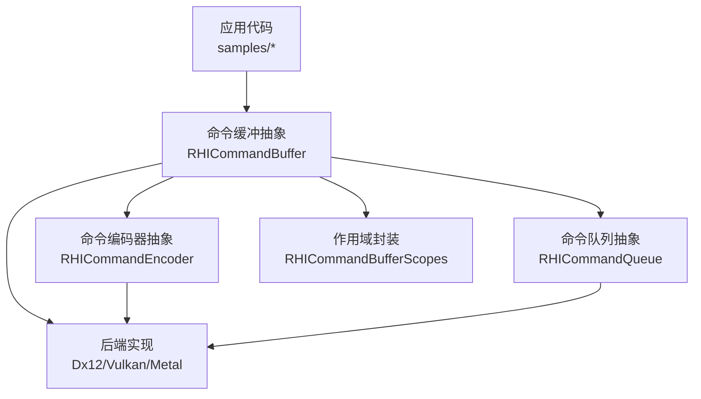
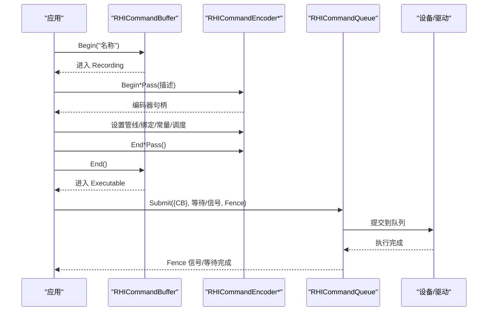
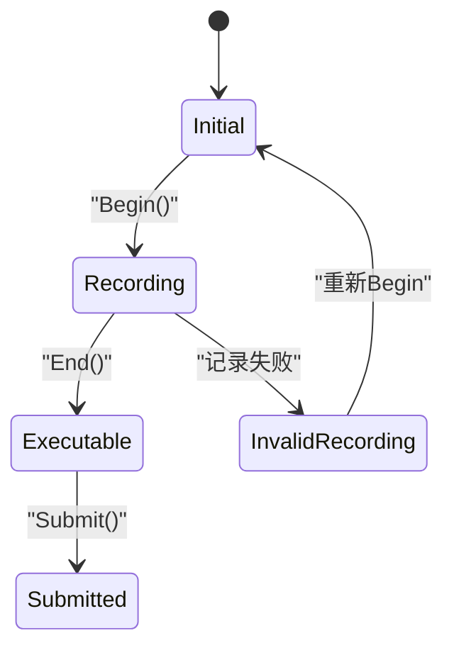
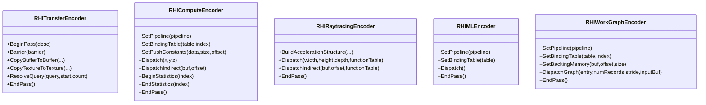
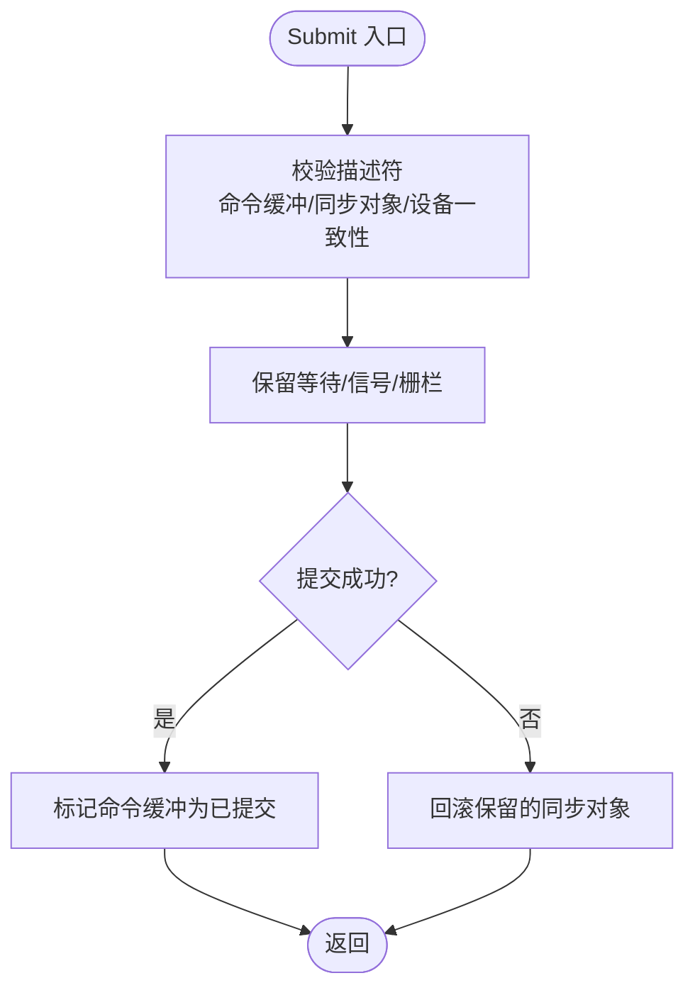
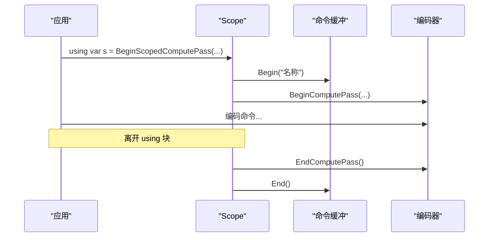
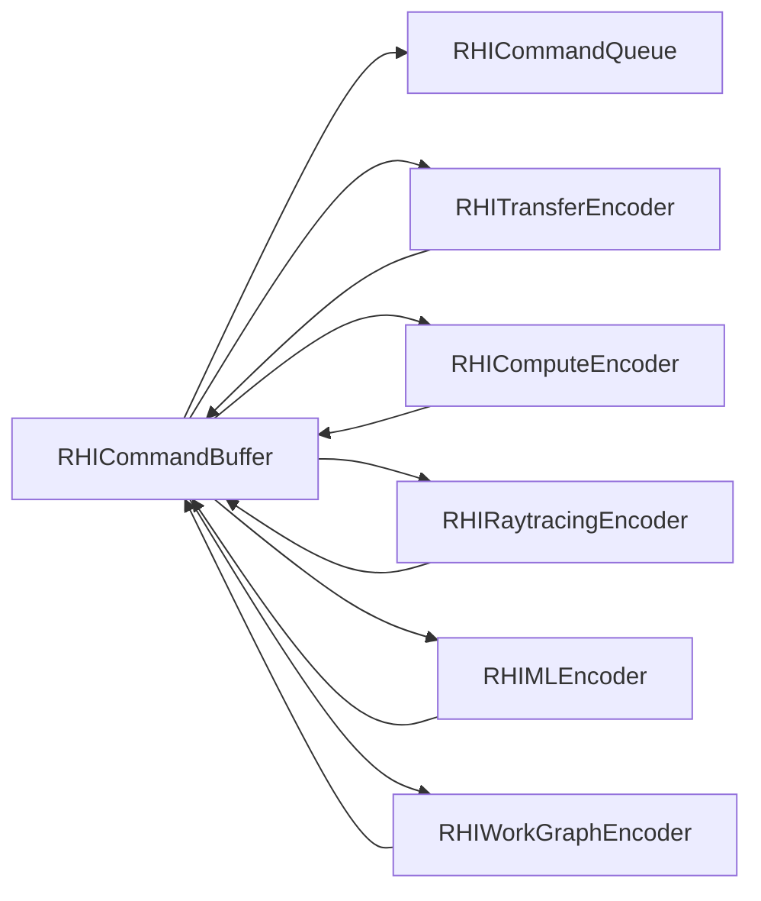

# 命令系统API

<cite>
**本文引用的文件**
- [RHICommandBuffer.cs](file://src/SharpGPU/Abstract/RHICommandBuffer.cs)
- [RHICommandEncoder.cs](file://src/SharpGPU/Abstract/RHICommandEncoder.cs)
- [RHICommandQueue.cs](file://src/SharpGPU/Abstract/RHICommandQueue.cs)
- [RHICommandBufferScopes.cs](file://src/SharpGPU/Common/Scopes/RHICommandBufferScopes.cs)
- [Dx12CommandBuffer.cs](file://src/SharpGPU/Dx12/Dx12CommandBuffer.cs)
- [VulkanCommandBuffer.cs](file://src/SharpGPU/Vulkan/VulkanCommandBuffer.cs)
- [ComputeWorkload.cs](file://samples/ComputeAndDraw/ComputeWorkload.cs)
- [RasterWorkload.cs](file://samples/ComputeAndDraw/RasterWorkload.cs)
</cite>

## 目录
1. [简介](#简介)
2. [项目结构](#项目结构)
3. [核心组件](#核心组件)
4. [架构总览](#架构总览)
5. [详细组件分析](#详细组件分析)
6. [依赖关系分析](#依赖关系分析)
7. [性能考虑](#性能考虑)
8. [故障排查指南](#故障排查指南)
9. [结论](#结论)
10. [附录：使用示例与最佳实践](#附录使用示例与最佳实践)

## 简介
本文件为 SharpGPU 命令系统的完整 API 文档，聚焦以下主题：
- 命令缓冲（RHICommandBuffer）：录制、提交、执行的生命周期与状态机。
- 命令编码器（RHICommandEncoder）：传输、计算、光栅化、光线追踪、机器学习与工作图编码器的职责与用法。
- 命令队列（RHICommandQueue）：提交描述、同步原语（信号量、栅栏）、异步执行与完成通知。
- 作用域（Scopes）：基于 using 的自动资源管理与生命周期保障。
- 典型工作流：计算着色器、光栅化渲染、光线追踪的命令编码流程。
- 异步执行、同步点与性能监控的最佳实践。

## 项目结构
SharpGPU 将命令系统抽象在 Abstract 层，并通过各后端（Dx12、Vulkan、Metal）实现具体细节；Common.Scopes 提供基于 using 的作用域封装；samples 提供端到端的使用示例。

图表来源
- [RHICommandBuffer.cs:26-190](file://src/SharpGPU/Abstract/RHICommandBuffer.cs#L26-L190)
- [RHICommandEncoder.cs:110-402](file://src/SharpGPU/Abstract/RHICommandEncoder.cs#L110-L402)
- [RHICommandQueue.cs:60-108](file://src/SharpGPU/Abstract/RHICommandQueue.cs#L60-L108)
- [RHICommandBufferScopes.cs:6-168](file://src/SharpGPU/Common/Scopes/RHICommandBufferScopes.cs#L6-L168)

章节来源
- [RHICommandBuffer.cs:26-190](file://src/SharpGPU/Abstract/RHICommandBuffer.cs#L26-L190)
- [RHICommandEncoder.cs:110-402](file://src/SharpGPU/Abstract/RHICommandEncoder.cs#L110-L402)
- [RHICommandQueue.cs:60-108](file://src/SharpGPU/Abstract/RHICommandQueue.cs#L60-L108)
- [RHICommandBufferScopes.cs:6-168](file://src/SharpGPU/Common/Scopes/RHICommandBufferScopes.cs#L6-L168)

## 核心组件
- RHICommandBuffer：命令缓冲抽象，管理 Begin/End、子编码器生命周期、状态转换与提交校验。
- RHICommandEncoder：各类任务编码器的基类，定义屏障、时间戳、统计、管线绑定、调度等通用能力。
- RHICommandQueue：命令队列抽象，负责创建命令缓冲、提交命令、处理等待/信号同步与完成栅栏。
- Scopes：通过 IDisposable 模式确保 EndPass/End 被正确调用，避免状态不一致。

章节来源
- [RHICommandBuffer.cs:26-190](file://src/SharpGPU/Abstract/RHICommandBuffer.cs#L26-L190)
- [RHICommandEncoder.cs:110-402](file://src/SharpGPU/Abstract/RHICommandEncoder.cs#L110-L402)
- [RHICommandQueue.cs:60-108](file://src/SharpGPU/Abstract/RHICommandQueue.cs#L60-L108)
- [RHICommandBufferScopes.cs:6-168](file://src/SharpGPU/Common/Scopes/RHICommandBufferScopes.cs#L6-L168)

## 架构总览
命令系统采用“抽象 + 后端”的分层设计：
- 上层通过 RHICommandBuffer 开始录制，按需开启不同编码器进行任务编码。
- 编码器内部维护当前管线、绑定表、常量、屏障等上下文。
- 录制完成后，通过 RHICommandQueue.Submit 提交到 GPU 队列，支持等待/信号同步与完成栅栏。
- 各后端（Dx12/Vulkan/Metal）在 Begin/End/Submit 中对接原生 API。

图表来源
- [RHICommandBuffer.cs:36-164](file://src/SharpGPU/Abstract/RHICommandBuffer.cs#L36-L164)
- [RHICommandEncoder.cs:110-402](file://src/SharpGPU/Abstract/RHICommandEncoder.cs#L110-L402)
- [RHICommandQueue.cs:118-310](file://src/SharpGPU/Abstract/RHICommandQueue.cs#L118-L310)
- [Dx12CommandBuffer.cs:87-200](file://src/SharpGPU/Dx12/Dx12CommandBuffer.cs#L87-L200)
- [VulkanCommandBuffer.cs:82-98](file://src/SharpGPU/Vulkan/VulkanCommandBuffer.cs#L82-L98)

## 详细组件分析

### 命令缓冲（RHICommandBuffer）
- 状态机：Initial → Recording → Executable → Submitted（或 InvalidRecording）。
- 关键方法：
  - Begin(name)：重置并进入录制状态。
  - Begin*Pass(...) / End*Pass()：开启/结束特定编码器，保证同一时间仅一个编码器活跃。
  - End()：结束录制，进入可提交状态。
  - ValidateCanSubmit()/MarkSubmitted()：提交前校验与标记。
- 错误防护：重复 Begin、未结束编码器即提交、非 Recording 状态操作等均会抛出异常。

图表来源
- [RHICommandBuffer.cs:6-164](file://src/SharpGPU/Abstract/RHICommandBuffer.cs#L6-L164)

章节来源
- [RHICommandBuffer.cs:26-190](file://src/SharpGPU/Abstract/RHICommandBuffer.cs#L26-L190)

### 命令编码器（RHICommandEncoder）
- 传输编码器（RHITransferEncoder）：复制、布局转换、屏障、时间戳、查询解析。
- 计算编码器（RHIComputeEncoder）：设置管线、绑定表、推送常量、Dispatch/Indirect、统计、采样反馈（可选）。
- 光线追踪编码器（RHIRaytracingEncoder）：构建加速结构、发射射线、函数表绑定、统计。
- 机器学习编码器（RHIMLEncoder）：设置管线与绑定表、Dispatch。
- 工作图编码器（RHIWorkGraphEncoder）：设置管线、绑定表、推送常量、后备内存、DispatchGraph。
- 公共能力：Barrier/Barriers、PushDebugGroup/PopDebugGroup、WriteTimestamp、BeginStatistics/EndStatistics。

图表来源
- [RHICommandEncoder.cs:110-402](file://src/SharpGPU/Abstract/RHICommandEncoder.cs#L110-L402)

章节来源
- [RHICommandEncoder.cs:110-402](file://src/SharpGPU/Abstract/RHICommandEncoder.cs#L110-L402)

### 命令队列（RHICommandQueue）
- 创建命令缓冲：CreateCommandBuffer()。
- 提交命令：Submit(descriptor)，包含命令缓冲列表、等待/信号同步、完成栅栏。
- 同步语义：
  - WaitSemaphores：指定阶段掩码等待。
  - SignalSemaphores：提交后发出信号。
  - CompletionFence：CPU 侧等待 GPU 完成。
- 提交前校验：检查命令缓冲归属、重复提交、同步对象有效性、设备一致性等。
- 原子性：Reserve/Commit/Rollback 保证部分失败时回滚已保留的资源。

图表来源
- [RHICommandQueue.cs:118-310](file://src/SharpGPU/Abstract/RHICommandQueue.cs#L118-L310)

章节来源
- [RHICommandQueue.cs:60-519](file://src/SharpGPU/Abstract/RHICommandQueue.cs#L60-L519)

### 作用域（Scopes）与自动资源管理
- RHICommandBufferScope：using 包裹 Begin/End，确保命令缓冲正确结束。
- Pass 级 Scope：Transfer/Compute/Raster/Raytracing/ML/WorkGraph 均提供对应 Scope，Dispose 时调用 EndPass。
- 扩展方法：BeginScoped*Pass(...) 简化用法，减少忘记关闭的风险。

图表来源
- [RHICommandBufferScopes.cs:6-168](file://src/SharpGPU/Common/Scopes/RHICommandBufferScopes.cs#L6-L168)
- [RHICommandBuffer.cs:170-189](file://src/SharpGPU/Abstract/RHICommandBuffer.cs#L170-L189)

章节来源
- [RHICommandBufferScopes.cs:6-168](file://src/SharpGPU/Common/Scopes/RHICommandBufferScopes.cs#L6-L168)

## 依赖关系分析
- RHICommandBuffer 依赖 RHICommandQueue（关联队列），并在 Begin/End 中管理编码器状态。
- 各编码器依赖命令缓冲以获取设备能力、时间戳与统计写入。
- 后端实现（Dx12/Vulkan）在 Begin/End/Submit 中对接原生命令缓冲与队列。
- 作用域对命令缓冲和编码器进行轻量包装，不引入额外运行时依赖。

图表来源
- [RHICommandBuffer.cs:26-190](file://src/SharpGPU/Abstract/RHICommandBuffer.cs#L26-L190)
- [RHICommandEncoder.cs:110-402](file://src/SharpGPU/Abstract/RHICommandEncoder.cs#L110-L402)

章节来源
- [RHICommandBuffer.cs:26-190](file://src/SharpGPU/Abstract/RHICommandBuffer.cs#L26-L190)
- [RHICommandEncoder.cs:110-402](file://src/SharpGPU/Abstract/RHICommandEncoder.cs#L110-L402)

## 性能考虑
- 尽量合并小任务：将多个拷贝/调度放入同一 Pass，减少状态切换与屏障开销。
- 合理使用屏障：仅在数据依赖处插入最小必要屏障，避免过度同步。
- 使用统计与时间戳：通过 WriteTimestamp/Statistics 量化热点路径。
- 复用命令缓冲：多帧复用需配合 Fence 确保上一帧完成后再 Reset。
- 批量提交：一次 Submit 包含多个命令缓冲可减少队列调度开销。
- 后端差异：注意 Dx12/Vulkan 在 Begin/Reset/Close 时的性能特征，避免频繁分配与释放。

[本节为通用指导，无需特定文件引用]

## 故障排查指南
- “命令缓冲已在录制”：重复 Begin 或未 End 就再次 Begin。
- “存在活跃编码器”：未结束当前编码器就尝试开始新编码器。
- “命令缓冲未结束就提交”：必须先 End() 进入 Executable 再 Submit。
- “命令缓冲不属于该队列”：跨队列提交非法。
- “同步对象无效或来自不同设备”：Wait/Signal/Fence 必须与队列所属设备一致。
- “重复提交命令缓冲”：同一提交中不可重复出现同一命令缓冲。
- “记录失败导致无效录制”：某些后端在失败时会进入 InvalidRecording，需要重新 Begin。

章节来源
- [RHICommandBuffer.cs:36-164](file://src/SharpGPU/Abstract/RHICommandBuffer.cs#L36-L164)
- [RHICommandQueue.cs:118-310](file://src/SharpGPU/Abstract/RHICommandQueue.cs#L118-L310)
- [Dx12CommandBuffer.cs:87-200](file://src/SharpGPU/Dx12/Dx12CommandBuffer.cs#L87-L200)
- [VulkanCommandBuffer.cs:82-98](file://src/SharpGPU/Vulkan/VulkanCommandBuffer.cs#L82-L98)

## 结论
SharpGPU 的命令系统通过清晰的抽象与严格的狀態机，提供了跨后端的统一命令录制与提交接口。结合作用域封装，开发者可以安全地管理命令缓冲与编码器生命周期；借助队列的同步原语，可实现高效的异步执行与完成通知。遵循本文档的实践建议，可在计算、光栅化与光线追踪等多种负载下获得稳定且高性能的表现。

[本节为总结，无需特定文件引用]

## 附录：使用示例与最佳实践

### 计算着色器命令编码示例
- 步骤概览：
  - 创建命令缓冲并开始录制。
  - 开启 Compute Pass，设置管线、绑定表、推送常量。
  - 插入必要的屏障，执行 Dispatch。
  - 结束 Compute Pass，必要时开启 Transfer Pass 进行读回。
  - 结束命令缓冲并提交到队列，使用 Fence 等待完成。
- 参考路径：
  - [ComputeWorkload.cs:116-147](file://samples/ComputeAndDraw/ComputeWorkload.cs#L116-L147)

章节来源
- [ComputeWorkload.cs:116-147](file://samples/ComputeAndDraw/ComputeWorkload.cs#L116-L147)

### 光栅化渲染命令编码示例
- 步骤概览：
  - 准备渲染目标（布局转换）。
  - 开启 Raster Pass，设置管线、视口、裁剪区域。
  - 使用 Statistics 记录像素/图元统计。
  - 绘制调用，结束 Pass 与命令缓冲。
  - 提交并等待完成，读取统计结果。
- 参考路径：
  - [RasterWorkload.cs:104-152](file://samples/ComputeAndDraw/RasterWorkload.cs#L104-L152)

章节来源
- [RasterWorkload.cs:104-152](file://samples/ComputeAndDraw/RasterWorkload.cs#L104-L152)

### 光线追踪命令编码示例
- 步骤概览：
  - 开启 Raytracing Pass。
  - 构建加速结构（Top/Bottom Level）。
  - 设置管线与函数表，执行 Dispatch/DispatchIndirect。
  - 结束 Pass 与命令缓冲，提交并等待。
- 参考路径（API 定义）：
  - [RHIRaytracingEncoder 相关方法:279-339](file://src/SharpGPU/Abstract/RHICommandEncoder.cs#L279-L339)

章节来源
- [RHICommandEncoder.cs:279-339](file://src/SharpGPU/Abstract/RHICommandEncoder.cs#L279-L339)

### 异步执行、同步点与性能监控最佳实践
- 异步执行：
  - 使用 Fence 在 CPU 侧等待 GPU 完成，避免阻塞主循环。
  - 利用 WaitSemaphores/SignalSemaphores 在多队列或多线程间建立顺序。
- 同步点：
  - 在数据依赖处插入最小屏障，避免不必要的同步。
  - 使用 ResolveQuery 将统计结果从 GPU 读回。
- 性能监控：
  - 使用 WriteTimestamp 与 Statistics 量化关键路径。
  - 结合调试组 PushDebugGroup/PopDebugGroup 定位问题。
- 参考路径：
  - [RHICommandQueue 提交与同步:118-310](file://src/SharpGPU/Abstract/RHICommandQueue.cs#L118-310)
  - [RHICommandEncoder 统计与时间戳:110-402](file://src/SharpGPU/Abstract/RHICommandEncoder.cs#L110-402)

章节来源
- [RHICommandQueue.cs:118-310](file://src/SharpGPU/Abstract/RHICommandQueue.cs#L118-L310)
- [RHICommandEncoder.cs:110-402](file://src/SharpGPU/Abstract/RHICommandEncoder.cs#L110-L402)