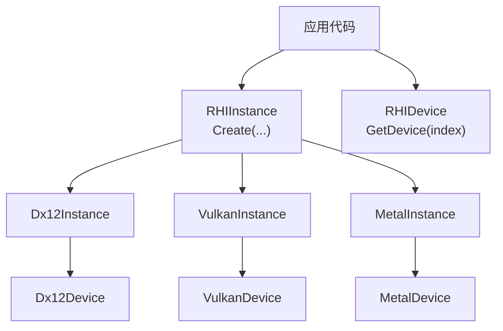
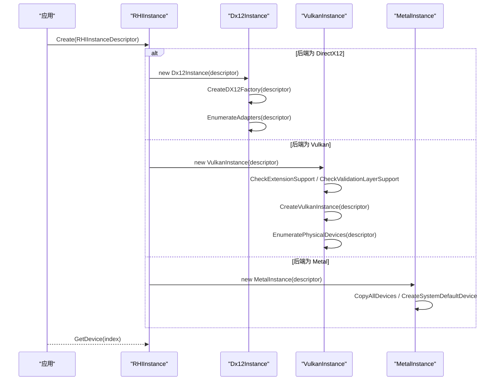
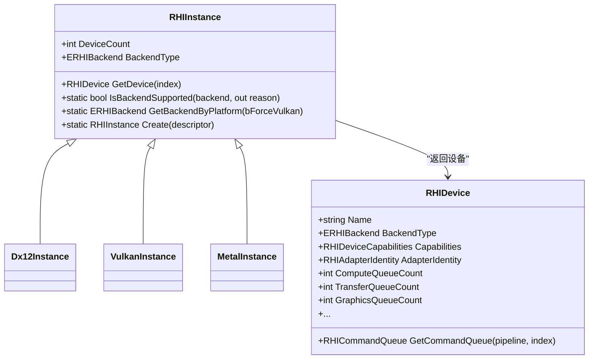

# 实例和设备管理API

<cite>
**本文引用的文件**
- [RHIInstance.cs](file://src/SharpGPU/Abstract/RHIInstance.cs)
- [Dx12Instance.cs](file://src/SharpGPU/Dx12/Dx12Instance.cs)
- [VulkanInstance.cs](file://src/SharpGPU/Vulkan/VulkanInstance.cs)
- [MetalInstance.cs](file://src/SharpGPU/Metal/MetalInstance.cs)
- [RHIDevice.cs](file://src/SharpGPU/Abstract/RHIDevice.cs)
- [RHIUtility.cs](file://src/SharpGPU/Abstract/RHIUtility.cs)
- [RHISwapChain.cs](file://src/SharpGPU/Abstract/RHISwapChain.cs)
- [ComputeWorkload.cs](file://samples/ComputeAndDraw/ComputeWorkload.cs)
</cite>

## 目录
1. [简介](#简介)
2. [项目结构](#项目结构)
3. [核心组件](#核心组件)
4. [架构总览](#架构总览)
5. [详细组件分析](#详细组件分析)
6. [依赖关系分析](#依赖关系分析)
7. [性能考量](#性能考量)
8. [故障排查指南](#故障排查指南)
9. [结论](#结论)
10. [附录：代码示例与最佳实践](#附录：代码示例与最佳实践)

## 简介
本章节面向需要创建并管理 SharpGPU 实例与设备的开发者，重点说明：
- RHIInstance.Create 的创建流程、后端选择与平台检测
- 设备枚举与选择机制（DX12、Vulkan、Metal）
- RHIInstanceDescriptor 配置项含义与影响
- RHIAdapterIdentity 的 LUID/UUID 匹配机制
- 错误处理模式与平台兼容性策略
- 完整的使用示例路径，便于快速上手

## 项目结构
SharpGPU 采用抽象 HAL + 多后端实现的模块化设计：
- 抽象层：定义跨后端的实例、设备、队列、资源等接口与数据结构
- 后端实现：DirectX12、Vulkan、Metal 各自提供实例与设备的具体实现
- 工具与公共类型：后端枚举、表面类型、能力查询等

图表来源
- [RHIInstance.cs:122-156](file://src/SharpGPU/Abstract/RHIInstance.cs#L122-L156)
- [Dx12Instance.cs:20-24](file://src/SharpGPU/Dx12/Dx12Instance.cs#L20-L24)
- [VulkanInstance.cs:74-85](file://src/SharpGPU/Vulkan/VulkanInstance.cs#L74-L85)
- [MetalInstance.cs:16-54](file://src/SharpGPU/Metal/MetalInstance.cs#L16-L54)

章节来源
- [RHIInstance.cs:1-159](file://src/SharpGPU/Abstract/RHIInstance.cs#L1-L159)
- [Dx12Instance.cs:1-237](file://src/SharpGPU/Dx12/Dx12Instance.cs#L1-L237)
- [VulkanInstance.cs:1-800](file://src/SharpGPU/Vulkan/VulkanInstance.cs#L1-L800)
- [MetalInstance.cs:1-79](file://src/SharpGPU/Metal/MetalInstance.cs#L1-L79)

## 核心组件
- RHIInstanceDescriptor：实例创建配置，包含后端类型、表面类型、调试层与验证层开关、各队列请求数量。
- RHIInstance：抽象实例，提供 Create、IsBackendSupported、GetBackendByPlatform、GetDevice 等方法。
- RHIAdapterIdentity：适配器标识，包含 LUID 与 DeviceUuid，用于精确匹配设备。
- RHIDevice：抽象设备，暴露设备能力、队列、资源创建与状态管理。

章节来源
- [RHIInstance.cs:6-44](file://src/SharpGPU/Abstract/RHIInstance.cs#L6-L44)
- [RHIInstance.cs:46-156](file://src/SharpGPU/Abstract/RHIInstance.cs#L46-L156)
- [RHIDevice.cs:422-601](file://src/SharpGPU/Abstract/RHIDevice.cs#L422-L601)

## 架构总览
实例创建与设备枚举的整体流程如下：

图表来源
- [RHIInstance.cs:122-156](file://src/SharpGPU/Abstract/RHIInstance.cs#L122-L156)
- [Dx12Instance.cs:20-106](file://src/SharpGPU/Dx12/Dx12Instance.cs#L20-L106)
- [VulkanInstance.cs:74-418](file://src/SharpGPU/Vulkan/VulkanInstance.cs#L74-L418)
- [MetalInstance.cs:16-54](file://src/SharpGPU/Metal/MetalInstance.cs#L16-L54)

## 详细组件分析

### RHIInstanceDescriptor 配置选项
- Backend：后端类型，可选值见 ERHIBackend（Metal、Vulkan、DirectX12）。
- SurfaceKind：原生表面类型，用于 Vulkan 实例扩展与设备枚举；常见值包括 Win32Hwnd、AppKitNsWindow、X11Window、WaylandSurface、UIKitUiWindow、AndroidNativeWindow、Headless。
- EnableDebugLayer：是否启用后端调试层（DX12 通过 Agility SDK 获取调试接口；Vulkan 通过 debug_utils 扩展）。
- EnableValidation：是否启用验证层（Vulkan 要求 VK_LAYER_KHRONOS_validation；DX12 可开启 GPU 级验证）。
- ComputeQueueRequestCount / TransferQueueRequestCount / GraphicsQueueRequestCount：向底层请求的队列数量，影响设备初始化时的队列分配。

章节来源
- [RHIInstance.cs:6-15](file://src/SharpGPU/Abstract/RHIInstance.cs#L6-L15)
- [RHISwapChain.cs:20-30](file://src/SharpGPU/Abstract/RHISwapChain.cs#L20-L30)
- [Dx12Instance.cs:26-76](file://src/SharpGPU/Dx12/Dx12Instance.cs#L26-L76)
- [VulkanInstance.cs:127-230](file://src/SharpGPU/Vulkan/VulkanInstance.cs#L127-L230)

### RHIInstance.Create 方法
- 参数校验：检查后端是否为有效枚举且非 Pending。
- 平台支持检查：调用 IsBackendSupported，根据当前操作系统判断后端可用性。
- 后端分发：根据后端类型构造具体实例（MetalInstance、VulkanInstance、Dx12Instance）。
- 编译期开关：DirectX12 在禁用 SHARPGPU_ENABLE_DX12 时抛出不支持异常。

章节来源
- [RHIInstance.cs:122-156](file://src/SharpGPU/Abstract/RHIInstance.cs#L122-L156)

### 后端检测与切换
- IsBackendSupported：基于操作系统判断后端是否可用，返回原因字符串。
- GetBackendByPlatform：按平台自动选择默认后端（Windows 优先 DX12，macOS/iOS 优先 Metal，Linux/Android 使用 Vulkan），也可强制使用 Vulkan。

章节来源
- [RHIInstance.cs:59-120](file://src/SharpGPU/Abstract/RHIInstance.cs#L59-L120)

### 设备枚举与选择机制
- DirectX12：
  - 创建 DXGI Factory，可选启用 Debug Layer 与 GPU Validation。
  - 枚举所有适配器，跳过软件适配器，创建对应设备对象。
  - 提供 GetDevice(index) 访问已枚举的设备列表。
- Vulkan：
  - 检查所需扩展（如 surface 相关扩展、debug_utils）。
  - 检查验证层可用性（VK_LAYER_KHRONOS_validation）。
  - 创建 VkInstance，枚举物理设备并过滤（例如 Android 最低版本要求）。
  - 提供 GetDevice(index) 访问已枚举的设备列表。
- Metal：
  - 枚举系统所有 MTLDevice，若无则尝试创建默认设备。
  - 提供 GetDevice(index) 访问已枚举的设备列表。

章节来源
- [Dx12Instance.cs:26-120](file://src/SharpGPU/Dx12/Dx12Instance.cs#L26-L120)
- [VulkanInstance.cs:127-418](file://src/SharpGPU/Vulkan/VulkanInstance.cs#L127-L418)
- [MetalInstance.cs:16-68](file://src/SharpGPU/Metal/MetalInstance.cs#L16-L68)

### RHIAdapterIdentity 的 LUID 与 UUID 匹配
- 字段：
  - Luid：适配器逻辑唯一标识（long）。
  - DeviceUuid：设备全局唯一标识（Guid）。
  - HasLuid / HasDeviceUuid：指示是否存在对应标识。
- RequireMatch(expected, operation)：
  - 若期望与实际均存在 LUID，则必须相等，否则抛出无效操作异常。
  - 若期望与实际均存在 DeviceUuid，则必须相等，否则抛出无效操作异常。
- 用途：确保后续操作针对同一物理设备，避免跨设备误用。

章节来源
- [RHIInstance.cs:17-44](file://src/SharpGPU/Abstract/RHIInstance.cs#L17-L44)

### 设备抽象与能力
- RHIDevice 暴露设备名称、厂商 ID、设备 ID、驱动版本、设备类型、后端类型、限制、能力、适配器身份、队列计数、设备状态与丢失诊断等。
- 提供命令队列获取、交换链创建、同步原语、存储队列、查询、堆、缓冲、纹理等资源创建接口。
- 提供格式支持、MSAA 解析支持、时钟校准、协作矩阵配置等查询能力。

章节来源
- [RHIDevice.cs:422-601](file://src/SharpGPU/Abstract/RHIDevice.cs#L422-L601)

## 依赖关系分析
- RHIInstance 依赖后端实现类进行实例化与设备枚举。
- 各后端实例依赖各自的底层库：
  - DX12 依赖 Vortice.Direct3D12 与 DXGI。
  - Vulkan 依赖 Vortice.Vulkan 及动态加载的 vkGetInstanceProcAddr 等函数。
  - Metal 依赖 SharpMetal 提供的 MTLDevice。
- RHIDevice 作为抽象基类被各后端设备实现继承，统一上层 API。

图表来源
- [RHIInstance.cs:46-156](file://src/SharpGPU/Abstract/RHIInstance.cs#L46-L156)
- [RHIDevice.cs:422-601](file://src/SharpGPU/Abstract/RHIDevice.cs#L422-L601)
- [Dx12Instance.cs:8-131](file://src/SharpGPU/Dx12/Dx12Instance.cs#L8-L131)
- [VulkanInstance.cs:9-680](file://src/SharpGPU/Vulkan/VulkanInstance.cs#L9-L680)
- [MetalInstance.cs:9-77](file://src/SharpGPU/Metal/MetalInstance.cs#L9-L77)

章节来源
- [RHIInstance.cs:46-156](file://src/SharpGPU/Abstract/RHIInstance.cs#L46-L156)
- [RHIDevice.cs:422-601](file://src/SharpGPU/Abstract/RHIDevice.cs#L422-L601)

## 性能考量
- 队列请求数量：合理设置 ComputeQueueRequestCount、TransferQueueRequestCount、GraphicsQueueRequestCount，避免过多队列导致资源竞争或过少导致吞吐受限。
- 调试与验证：EnableDebugLayer 与 EnableValidation 会引入额外开销，建议在开发与调试阶段启用，发布构建中关闭。
- 平台特性：不同后端对某些特性的支持差异较大，应通过 RHIDevice.Capabilities 与 Query* 系列方法进行运行时探测，避免不必要的回退路径。

[本节为通用指导，不直接分析具体文件]

## 故障排查指南
- 后端不可用：
  - IsBackendSupported 返回 false 并提供原因，常见于平台不匹配或未安装必要运行时（如 DX12 Agility SDK、Vulkan Loader）。
- 设备枚举失败：
  - DX12：无法创建 DXGI Factory 或适配器创建失败会抛出异常，包含适配器描述信息。
  - Vulkan：未找到支持的设备或扩展缺失会抛出异常；Android 要求 Vulkan 1.1+。
  - Metal：无可用设备时会抛出异常。
- 验证层缺失：
  - Vulkan 启用验证层但缺少 VK_LAYER_KHRONOS_validation 将抛出异常。
- 设备丢失：
  - RHIDevice 提供 MarkDeviceLost 与 ThrowIfDeviceUnavailable，结合 DeviceLossDiagnostic 进行诊断。

章节来源
- [Dx12Instance.cs:26-106](file://src/SharpGPU/Dx12/Dx12Instance.cs#L26-L106)
- [VulkanInstance.cs:127-418](file://src/SharpGPU/Vulkan/VulkanInstance.cs#L127-L418)
- [MetalInstance.cs:16-54](file://src/SharpGPU/Metal/MetalInstance.cs#L16-L54)
- [RHIDevice.cs:465-525](file://src/SharpGPU/Abstract/RHIDevice.cs#L465-L525)

## 结论
SharpGPU 通过统一的 RHIInstance 抽象与多后端实现，提供了跨平台的实例创建、设备枚举与选择能力。开发者可通过 RHIInstanceDescriptor 精细控制后端行为，利用 RHIAdapterIdentity 确保设备一致性，并结合 RHIDevice 的能力查询与队列管理完成高性能渲染与计算任务。建议在生产环境关闭调试与验证层，并通过平台检测与能力查询保证稳定性与兼容性。

[本节为总结性内容，不直接分析具体文件]

## 附录：代码示例与最佳实践

### 示例：创建实例、获取设备、检查后端支持
- 检查后端支持：
  - 参考路径：[ComputeWorkload.cs:27-43](file://samples/ComputeAndDraw/ComputeWorkload.cs#L27-L43)
- 创建实例并获取设备：
  - 参考路径：[ComputeWorkload.cs:45-59](file://samples/ComputeAndDraw/ComputeWorkload.cs#L45-L59)
- 后端选择与平台兼容：
  - 参考路径：[RHIInstance.cs:59-120](file://src/SharpGPU/Abstract/RHIInstance.cs#L59-L120)

### 示例：设备匹配与一致性
- 使用 RHIAdapterIdentity.RequireMatch 确保后续操作针对同一设备：
  - 参考路径：[RHIInstance.cs:30-43](file://src/SharpGPU/Abstract/RHIInstance.cs#L30-L43)

### 示例：队列与资源创建
- 获取命令队列与创建资源：
  - 参考路径：[ComputeWorkload.cs:61-100](file://samples/ComputeAndDraw/ComputeWorkload.cs#L61-L100)

### 最佳实践
- 使用 IsBackendSupported 进行运行时后端可用性检查，再决定执行路径。
- 使用 GetBackendByPlatform 快速获得默认后端，必要时强制指定 Vulkan。
- 在开发阶段启用 EnableDebugLayer 与 EnableValidation，发布构建中关闭。
- 合理设置队列请求数量，避免资源浪费或瓶颈。
- 使用 RHIAdapterIdentity 进行设备匹配，防止跨设备误用。

[本节为实践指导，不直接分析具体文件]