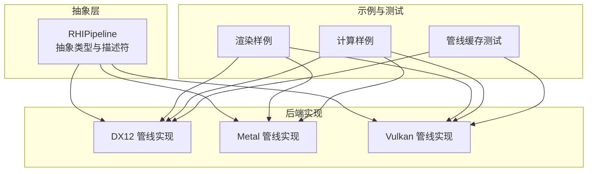
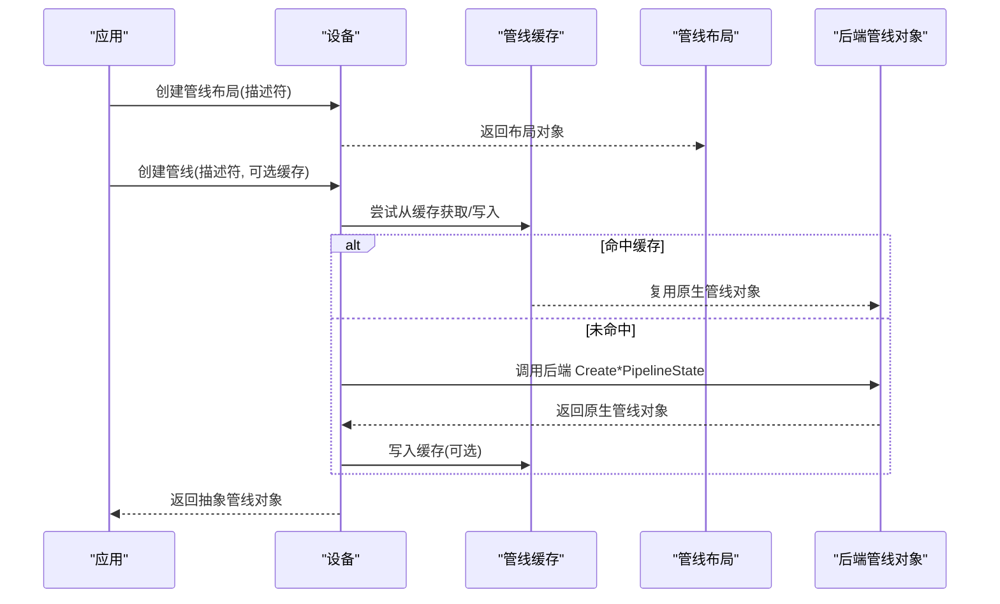
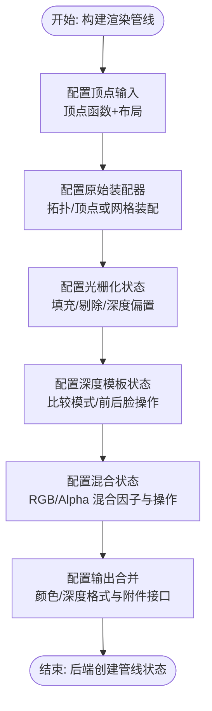
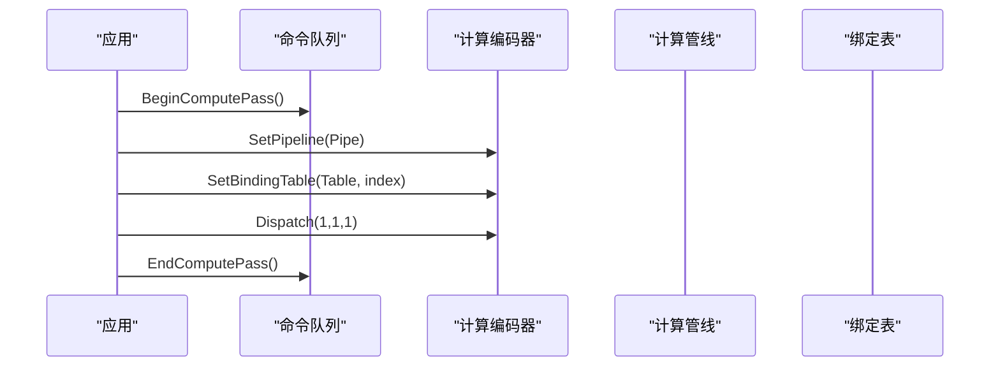
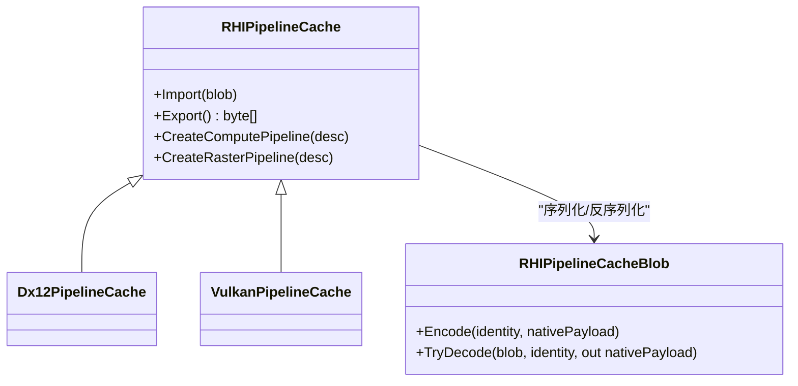
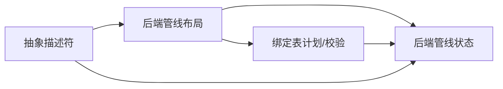

# 管线API

<cite>
**本文引用的文件**
- [RHIPipeline.cs](file://src/SharpGPU/Abstract/RHIPipeline.cs)
- [Dx12Pipeline.cs](file://src/SharpGPU/Dx12/Dx12Pipeline.cs)
- [MetalPipeline.cs](file://src/SharpGPU/Metal/MetalPipeline.cs)
- [VulkanPipeline.cs](file://src/SharpGPU/Vulkan/VulkanPipeline.cs)
- [RasterWorkload.cs](file://samples/ComputeAndDraw/RasterWorkload.cs)
- [ComputeWorkload.cs](file://samples/ComputeAndDraw/ComputeWorkload.cs)
- [Dx12PipelineCacheGpuTests.cs](file://tests/SharpGPU.Conformance.Tests/Dx12PipelineCacheGpuTests.cs)
</cite>

## 目录
1. [简介](#简介)
2. [项目结构](#项目结构)
3. [核心组件](#核心组件)
4. [架构总览](#架构总览)
5. [详细组件分析](#详细组件分析)
6. [依赖关系分析](#依赖关系分析)
7. [性能考量](#性能考量)
8. [故障排查指南](#故障排查指南)
9. [结论](#结论)
10. [附录](#附录)

## 简介
本文件系统性梳理 SharpGPU 的管线 API，重点围绕 RHIPipeline 抽象类及其各后端专用实现（DirectX 12、Metal、Vulkan），覆盖渲染管线与计算管线的阶段配置（顶点输入、光栅化、混合、输出合并）、计算管线线程组与工作负载、管线状态创建/编译/缓存机制，并提供完整的构建示例路径与最佳实践。

## 项目结构
SharpGPU 将管线相关能力分为三层：
- 抽象层：定义跨后端的统一接口与描述符（如 RHIRasterPipelineDescriptor、RHIComputePipelineDescriptor、RHIPipelineLayout 等）。
- 后端实现层：针对 DX12、Metal、Vulkan 的具体管线对象与状态构建逻辑。
- 示例与测试：提供可运行的渲染/计算样例以及管线缓存的兼容性验证。

图表来源
- [RHIPipeline.cs:11-264](file://src/SharpGPU/Abstract/RHIPipeline.cs#L11-L264)
- [Dx12Pipeline.cs:240-800](file://src/SharpGPU/Dx12/Dx12Pipeline.cs#L240-L800)
- [MetalPipeline.cs:16-767](file://src/SharpGPU/Metal/MetalPipeline.cs#L16-L767)
- [VulkanPipeline.cs:10-800](file://src/SharpGPU/Vulkan/VulkanPipeline.cs#L10-L800)

章节来源
- [RHIPipeline.cs:11-264](file://src/SharpGPU/Abstract/RHIPipeline.cs#L11-L264)

## 核心组件
- 管线布局与绑定表
  - RHIPipelineLayout：描述根签名/描述符集布局、推常量大小、静态采样器等，并生成用于缓存的身份标识。
  - 各后端具体布局：Dx12PipelineLayout、MetalPipelineLayout、VulkanPipelineLayout。
- 管线类型
  - RHIRasterPipeline：渲染管线，包含顶点装配、光栅化、混合、深度模板、输出合并等阶段配置。
  - RHIComputePipeline：计算管线，包含线程组尺寸与计算着色器函数。
  - RHIRaytracingPipeline：光线追踪管线（含命中组、miss/callable 组、局部常量等）。
  - RHIWorkGraphPipeline：工作图管线（名称、函数库、布局）。
- 描述符与状态
  - RHIRasterPipelineDescriptor：采样数、颜色/深度格式、附件接口、片段函数、顶点/网格装配器、渲染状态。
  - RHIComputePipelineDescriptor：线程组尺寸、计算函数、管线布局。
  - RHIBlendStateDescriptor / RHIRasterizerStateDescriptor / RHIDepthStencilStateDescriptor：混合、光栅化、深度模板状态。
  - RHIVertexLayoutDescriptor / RHIVertexElementDescriptor：顶点输入布局与元素。
- 管线缓存
  - RHIPipelineCache：跨后端统一的管线缓存抽象，支持导入/导出二进制 blob，内部维护设备身份与 ABI 版本校验。
  - 后端缓存：Dx12PipelineCache、VulkanPipelineCache。

章节来源
- [RHIPipeline.cs:11-264](file://src/SharpGPU/Abstract/RHIPipeline.cs#L11-L264)
- [RHIPipeline.cs:1075-1400](file://src/SharpGPU/Abstract/RHIPipeline.cs#L1075-L1400)
- [Dx12Pipeline.cs:240-800](file://src/SharpGPU/Dx12/Dx12Pipeline.cs#L240-L800)
- [MetalPipeline.cs:16-767](file://src/SharpGPU/Metal/MetalPipeline.cs#L16-L767)
- [VulkanPipeline.cs:10-800](file://src/SharpGPU/Vulkan/VulkanPipeline.cs#L10-L800)

## 架构总览
SharpGPU 通过统一的抽象描述符驱动各后端管线对象的创建与编译。渲染管线在抽象层完成参数快照与一致性校验，后端再将其映射到原生状态对象（例如 DX12 的 PSO、Vulkan 的 Graphics Pipeline、Metal 的 Render Pipeline State）。计算管线则根据线程组尺寸与着色器函数创建对应 PSO。

图表来源
- [RHIPipeline.cs:1075-1161](file://src/SharpGPU/Abstract/RHIPipeline.cs#L1075-L1161)
- [Dx12Pipeline.cs:465-527](file://src/SharpGPU/Dx12/Dx12Pipeline.cs#L465-L527)
- [VulkanPipeline.cs:238-310](file://src/SharpGPU/Vulkan/VulkanPipeline.cs#L238-L310)
- [MetalPipeline.cs:100-142](file://src/SharpGPU/Metal/MetalPipeline.cs#L100-L142)

## 详细组件分析

### 渲染管线阶段配置
- 顶点输入
  - 通过 RHIVertexAssemblerDescriptor 指定顶点函数与顶点布局；每个布局包含索引、步长、步进模式及元素数组。
  - 后端将布局转换为原生顶点输入状态（如 Vulkan 的 VkVertexInputBindingDescription/AttributeDescription，Metal 的 MTLVertexDescriptor）。
- 光栅化
  - 由 RHIRasterizerStateDescriptor 控制填充模式、剔除模式、深度裁剪、保守光栅、抗锯齿线、正面朝向、深度偏置等。
  - 后端映射为多边形模式、剔除模式、深度偏置等原生状态。
- 混合
  - RHIBlendStateDescriptor 支持独立混合与每附件混合，RHIBlendDescriptor 指定 RGB/Alpha 源/目标混合因子与操作、写通道。
  - 后端构建混合状态（DX12 BlendState、Vulkan ColorBlendAttachmentState、Metal BlendState）。
- 输出合并
  - RHIRasterPipelineDescriptor 指定颜色/深度格式、附件接口（输入/输出位置映射）、片段函数、采样数等。
  - 后端据此设置 RTV/DSV 格式、动态渲染信息或 RenderPass/Subpass 兼容信息。

图表来源
- [RHIPipeline.cs:53-135](file://src/SharpGPU/Abstract/RHIPipeline.cs#L53-L135)
- [VulkanPipeline.cs:432-712](file://src/SharpGPU/Vulkan/VulkanPipeline.cs#L432-L712)
- [MetalPipeline.cs:457-585](file://src/SharpGPU/Metal/MetalPipeline.cs#L457-L585)
- [Dx12Pipeline.cs:776-800](file://src/SharpGPU/Dx12/Dx12Pipeline.cs#L776-L800)

章节来源
- [RHIPipeline.cs:53-135](file://src/SharpGPU/Abstract/RHIPipeline.cs#L53-L135)
- [VulkanPipeline.cs:432-712](file://src/SharpGPU/Vulkan/VulkanPipeline.cs#L432-L712)
- [MetalPipeline.cs:457-585](file://src/SharpGPU/Metal/MetalPipeline.cs#L457-L585)
- [Dx12Pipeline.cs:776-800](file://src/SharpGPU/Dx12/Dx12Pipeline.cs#L776-L800)

### 计算管线线程组与工作负载
- 线程组
  - RHIComputePipelineDescriptor.ThreadSize 指定线程组维度（x/y/z），后端据此创建 Compute Pipeline State。
- 工作负载
  - 命令编码中通过 Dispatch(x,y,z) 提交工作项；示例展示了 1x1x1 的简单调度。
- 绑定与资源
  - 使用 RHIPipelineLayout 与 RHIBindingTable 将缓冲区视图绑定到着色器可见的资源槽位。

图表来源
- [ComputeWorkload.cs:74-130](file://samples/ComputeAndDraw/ComputeWorkload.cs#L74-L130)
- [Dx12Pipeline.cs:465-527](file://src/SharpGPU/Dx12/Dx12Pipeline.cs#L465-L527)
- [VulkanPipeline.cs:238-310](file://src/SharpGPU/Vulkan/VulkanPipeline.cs#L238-L310)
- [MetalPipeline.cs:100-142](file://src/SharpGPU/Metal/MetalPipeline.cs#L100-L142)

章节来源
- [ComputeWorkload.cs:74-130](file://samples/ComputeAndDraw/ComputeWorkload.cs#L74-L130)
- [Dx12Pipeline.cs:465-527](file://src/SharpGPU/Dx12/Dx12Pipeline.cs#L465-L527)
- [VulkanPipeline.cs:238-310](file://src/SharpGPU/Vulkan/VulkanPipeline.cs#L238-L310)
- [MetalPipeline.cs:100-142](file://src/SharpGPU/Metal/MetalPipeline.cs#L100-L142)

### 管线状态的创建、编译与缓存机制
- 创建流程
  - 先创建管线布局（Root Signature/Descriptor Sets 等），再基于布局与着色器函数创建具体管线对象。
  - 渲染管线需额外配置顶点输入、光栅化、混合、深度模板与输出合并。
- 编译与优化
  - 各后端在创建管线时进行必要的编译与优化（例如 Metal 使用编译器任务选项，Vulkan 使用动态渲染/RenderPass 组合）。
- 缓存机制
  - RHIPipelineCache 提供 Import/Export 能力，内部对 native payload 做 SHA256 校验，并检查 schema/ABI/后端/设备/驱动版本一致性。
  - 后端缓存（Dx12PipelineCache、VulkanPipelineCache）在创建管线时优先尝试命中缓存，否则创建并写入缓存。

图表来源
- [RHIPipeline.cs:1075-1400](file://src/SharpGPU/Abstract/RHIPipeline.cs#L1075-L1400)
- [Dx12PipelineCacheGpuTests.cs:22-81](file://tests/SharpGPU.Conformance.Tests/Dx12PipelineCacheGpuTests.cs#L22-L81)

章节来源
- [RHIPipeline.cs:1075-1400](file://src/SharpGPU/Abstract/RHIPipeline.cs#L1075-L1400)
- [Dx12PipelineCacheGpuTests.cs:22-81](file://tests/SharpGPU.Conformance.Tests/Dx12PipelineCacheGpuTests.cs#L22-L81)

### 代码示例：渲染管线构建
- 示例路径：[RasterWorkload.cs](file://samples/ComputeAndDraw/RasterWorkload.cs)
- 关键步骤
  - 创建实例与设备、查询图形队列。
  - 创建管线布局（空绑定表布局）。
  - 编译顶点/片段函数。
  - 构建 RHIRasterPipelineDescriptor（采样数、颜色格式、片段函数、顶点装配器、渲染状态）。
  - 创建渲染管线并在命令缓冲中执行绘制。

章节来源
- [RasterWorkload.cs:69-102](file://samples/ComputeAndDraw/RasterWorkload.cs#L69-L102)
- [RasterWorkload.cs:104-160](file://samples/ComputeAndDraw/RasterWorkload.cs#L104-L160)

### 代码示例：计算管线构建
- 示例路径：[ComputeWorkload.cs](file://samples/ComputeAndDraw/ComputeWorkload.cs)
- 关键步骤
  - 编译着色器并创建函数。
  - 创建管线布局与绑定表布局。
  - 构建 RHIComputePipelineDescriptor（线程组尺寸、计算函数、布局）。
  - 在计算通道中设置管线、绑定表并 Dispatch。

章节来源
- [ComputeWorkload.cs:74-130](file://samples/ComputeAndDraw/ComputeWorkload.cs#L74-L130)

## 依赖关系分析
- 抽象到后端
  - 所有后端均依赖抽象描述符（如 RHIRasterPipelineDescriptor、RHIComputePipelineDescriptor）以保持一致性。
  - 后端各自实现布局与管线对象的生命周期管理。
- 绑定表与布局
  - 各后端对绑定表布局进行计划与校验（如 DX12 限制 Root Signature DWORD 数量，Vulkan 限制 Descriptor Set 数量）。
- 附件与格式
  - 渲染管线对颜色/深度格式、采样数、混合能力进行设备能力查询与校验。

图表来源
- [Dx12Pipeline.cs:31-126](file://src/SharpGPU/Dx12/Dx12Pipeline.cs#L31-L126)
- [VulkanPipeline.cs:10-237](file://src/SharpGPU/Vulkan/VulkanPipeline.cs#L10-L237)
- [MetalPipeline.cs:16-98](file://src/SharpGPU/Metal/MetalPipeline.cs#L16-L98)

章节来源
- [Dx12Pipeline.cs:31-126](file://src/SharpGPU/Dx12/Dx12Pipeline.cs#L31-L126)
- [VulkanPipeline.cs:10-237](file://src/SharpGPU/Vulkan/VulkanPipeline.cs#L10-L237)
- [MetalPipeline.cs:16-98](file://src/SharpGPU/Metal/MetalPipeline.cs#L16-L98)

## 性能考量
- 管线缓存
  - 使用 RHIPipelineCache 避免重复编译，显著降低启动与切换开销；注意设备/驱动/ABI 变更导致缓存失效。
- 动态状态
  - 合理设置动态状态（如视口、剪裁矩形、混合常量）以减少管线切换频率。
- 绑定表与布局
  - 控制 Root Signature/Descriptor Set 规模，避免超出平台限制（如 DX12 的 64 DWORD 限制、Vulkan 的最大绑定集合数）。
- 附件与格式
  - 选择设备支持的格式与采样数，减少不支持导致的降级或错误。
- 光栅化与混合
  - 关闭不必要的特性（如 AlphaToCoverage、独立混合）可降低复杂度。

## 故障排查指南
- 常见异常与原因
  - 管线布局重复空间/索引：后端会抛出异常提示重复声明。
  - 推常量对齐与范围越界：DX12 要求 4 字节对齐且范围不越界。
  - 附件格式不支持：渲染管线会报告不可用原因。
  - 管线缓存损坏或不兼容：Import 返回 Corrupt/Incompatible，需重建缓存。
- 调试建议
  - 启用后端调试消息收集（如 DX12 InfoQueue）定位创建失败原因。
  - 检查描述符快照与校验结果（如 RHIRasterPipelineContract 的快照与验证）。

章节来源
- [Dx12Pipeline.cs:45-126](file://src/SharpGPU/Dx12/Dx12Pipeline.cs#L45-L126)
- [Dx12Pipeline.cs:174-201](file://src/SharpGPU/Dx12/Dx12Pipeline.cs#L174-L201)
- [VulkanPipeline.cs:86-94](file://src/SharpGPU/Vulkan/VulkanPipeline.cs#L86-L94)
- [RHIPipeline.cs:1090-1129](file://src/SharpGPU/Abstract/RHIPipeline.cs#L1090-L1129)

## 结论
SharpGPU 通过统一的抽象描述符与后端适配，提供了跨平台的渲染与计算管线能力。其管线缓存机制有效提升了性能与稳定性，而严格的描述符校验与设备能力查询确保了正确性与可移植性。在实际工程中，应优先利用管线缓存、合理组织绑定表与布局、选择合适的动态状态与附件格式，以获得最佳性能与可维护性。

## 附录
- 完整示例参考
  - 渲染管线：[RasterWorkload.cs](file://samples/ComputeAndDraw/RasterWorkload.cs)
  - 计算管线：[ComputeWorkload.cs](file://samples/ComputeAndDraw/ComputeWorkload.cs)
  - 管线缓存测试：[Dx12PipelineCacheGpuTests.cs](file://tests/SharpGPU.Conformance.Tests/Dx12PipelineCacheGpuTests.cs)