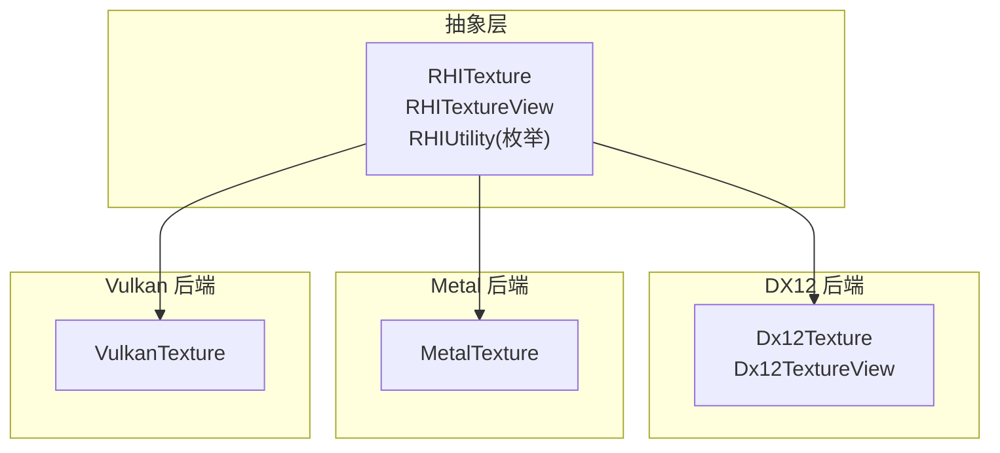
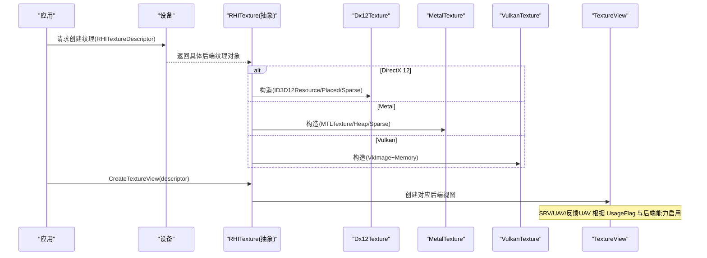
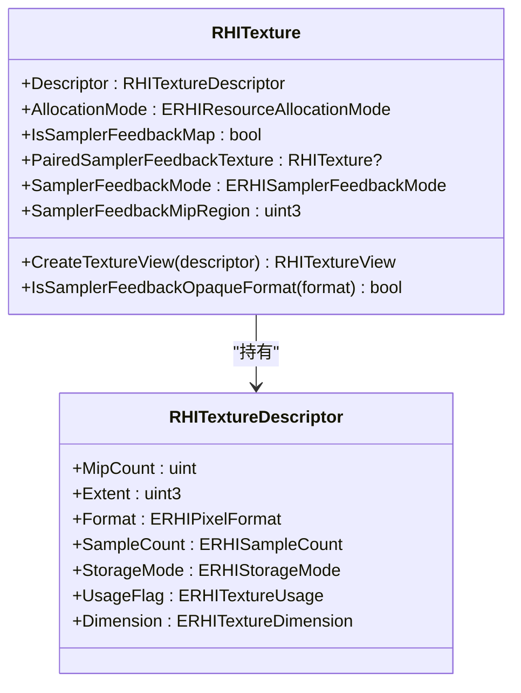
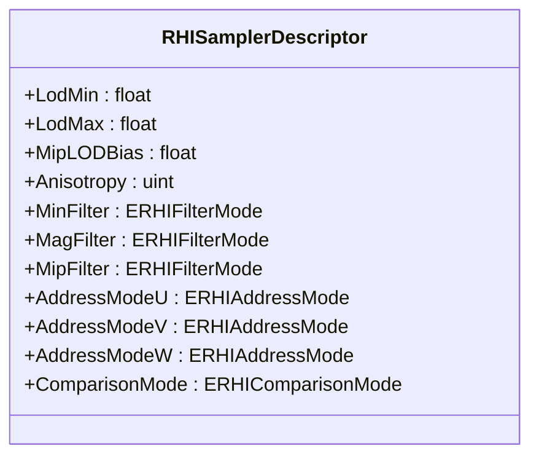
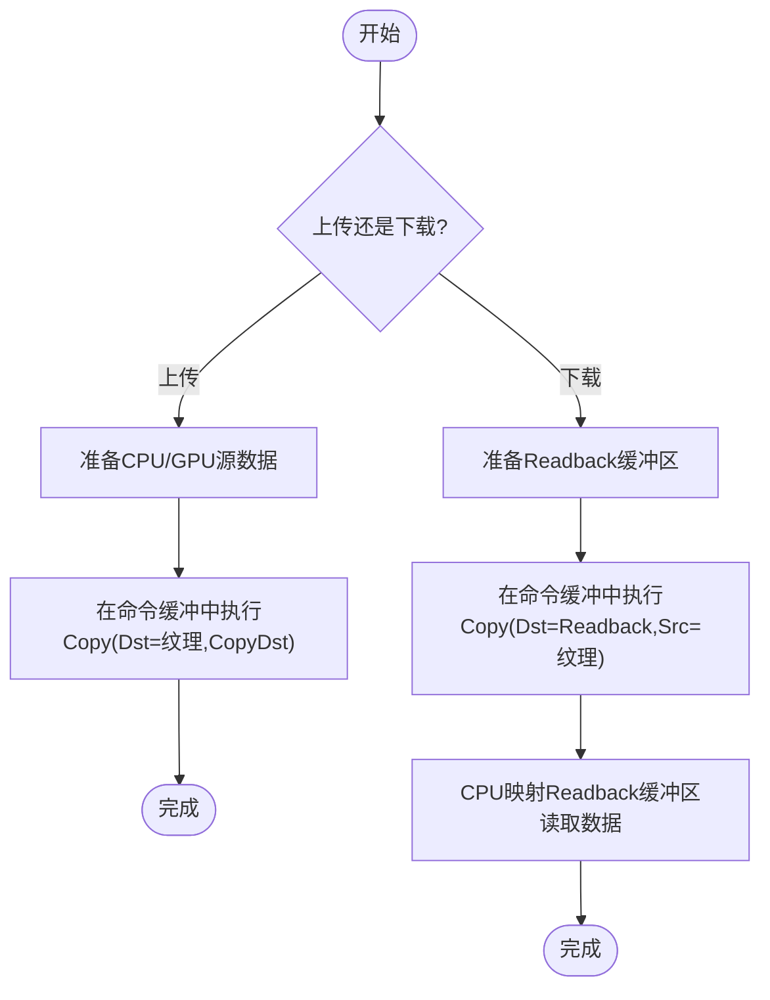
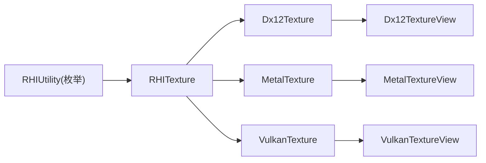

# 纹理API

<cite>
**本文引用的文件**
- [RHITexture.cs](file://src/SharpGPU/Abstract/RHITexture.cs)
- [RHITextureView.cs](file://src/SharpGPU/Abstract/RHITextureView.cs)
- [RHIUtility.cs](file://src/SharpGPU/Abstract/RHIUtility.cs)
- [Dx12Texture.cs](file://src/SharpGPU/Dx12/Dx12Texture.cs)
- [Dx12TextureView.cs](file://src/SharpGPU/Dx12/Dx12TextureView.cs)
- [MetalTexture.cs](file://src/SharpGPU/Metal/MetalTexture.cs)
- [VulkanTexture.cs](file://src/SharpGPU/Vulkan/VulkanTexture.cs)
</cite>

## 目录
1. [简介](#简介)
2. [项目结构](#项目结构)
3. [核心组件](#核心组件)
4. [架构总览](#架构总览)
5. [详细组件分析](#详细组件分析)
6. [依赖关系分析](#依赖关系分析)
7. [性能考虑](#性能考虑)
8. [故障排查指南](#故障排查指南)
9. [结论](#结论)
10. [附录：代码示例路径与最佳实践](#附录代码示例路径与最佳实践)

## 简介
本文件为 SharpGPU 纹理 API 的全面技术文档，聚焦 RHITexture 抽象及其在各后端（DirectX 12、Metal、Vulkan）的具体实现。内容涵盖：
- 纹理格式、尺寸、层级和面数的配置
- 采样器状态、过滤模式与寻址模式的设置
- 纹理数据的上传、下载与多级渐缩图生成
- 压缩格式支持、内存布局优化与跨平台兼容性
- 完整的创建、数据填充与访问流程说明（以“代码片段路径”形式提供）

## 项目结构
SharpGPU 将纹理抽象定义在 Abstract 层，具体后端实现位于 Dx12、Metal、Vulkan 三个目录中；工具与枚举集中在 RHIUtility 与各后端的 Utility 类中。纹理视图通过各后端的 TextureView 实现，负责描述符/句柄的创建与生命周期管理。

图表来源
- [RHITexture.cs:50-139](file://src/SharpGPU/Abstract/RHITexture.cs#L50-L139)
- [Dx12Texture.cs:7-199](file://src/SharpGPU/Dx12/Dx12Texture.cs#L7-L199)
- [MetalTexture.cs:9-197](file://src/SharpGPU/Metal/MetalTexture.cs#L9-L197)
- [VulkanTexture.cs:8-247](file://src/SharpGPU/Vulkan/VulkanTexture.cs#L8-L247)

章节来源
- [RHITexture.cs:50-139](file://src/SharpGPU/Abstract/RHITexture.cs#L50-L139)
- [RHIUtility.cs:184-277](file://src/SharpGPU/Abstract/RHIUtility.cs#L184-L277)
- [RHIUtility.cs:353-379](file://src/SharpGPU/Abstract/RHIUtility.cs#L353-L379)
- [RHIUtility.cs:644-661](file://src/SharpGPU/Abstract/RHIUtility.cs#L644-L661)

## 核心组件
- RHITexture：纹理资源抽象基类，持有纹理描述符、分配模式、采样反馈映射等元信息，并提供 CreateTextureView 接口。
- RHITextureView：纹理视图抽象，用于限定可见的子资源范围（mip/array slice）。
- 采样器相关：RHISamplerDescriptor 定义 LOD、各向异性、过滤与寻址模式、比较模式等。
- 像素格式与维度：ERHIPixelFormat、ERHITextureDimension、ERHISampleCount、ERHITextureUsage 等枚举集中定义。

关键要点
- 纹理描述符包含 MipCount、Extent、Format、SampleCount、StorageMode、UsageFlag、Dimension。
- 采样反馈地图（Sampler Feedback Map）是特殊纹理，需通过设备创建并绑定配对采样纹理。
- 视图类型包括 ShaderResource 与 UnorderedAccess，不同后端对支持的维度/格式有差异。

章节来源
- [RHITexture.cs:39-139](file://src/SharpGPU/Abstract/RHITexture.cs#L39-L139)
- [RHITextureView.cs:5-21](file://src/SharpGPU/Abstract/RHITextureView.cs#L5-L21)
- [RHIUtility.cs:184-277](file://src/SharpGPU/Abstract/RHIUtility.cs#L184-L277)
- [RHIUtility.cs:353-379](file://src/SharpGPU/Abstract/RHIUtility.cs#L353-L379)
- [RHIUtility.cs:644-661](file://src/SharpGPU/Abstract/RHIUtility.cs#L644-L661)

## 架构总览
下图展示从应用层到各后端纹理资源的创建与视图使用流程，以及采样反馈地图的特殊绑定过程。

图表来源
- [Dx12Texture.cs:30-132](file://src/SharpGPU/Dx12/Dx12Texture.cs#L30-L132)
- [MetalTexture.cs:23-146](file://src/SharpGPU/Metal/MetalTexture.cs#L23-L146)
- [VulkanTexture.cs:43-204](file://src/SharpGPU/Vulkan/VulkanTexture.cs#L43-L204)
- [Dx12TextureView.cs:39-113](file://src/SharpGPU/Dx12/Dx12TextureView.cs#L39-L113)

## 详细组件分析

### RHITexture 抽象与描述符
- 描述符字段：MipCount、Extent(x,y,z)、Format、SampleCount、StorageMode、UsageFlag、Dimension。
- 分配模式：Committed/Placed/Sparse/External，影响内存管理与堆放置。
- 采样反馈地图：IsSamplerFeedbackMap、PairedSamplerFeedbackTexture、SamplerFeedbackMode、SamplerFeedbackMipRegion。

图表来源
- [RHITexture.cs:39-139](file://src/SharpGPU/Abstract/RHITexture.cs#L39-L139)

章节来源
- [RHITexture.cs:39-139](file://src/SharpGPU/Abstract/RHITexture.cs#L39-L139)

### 纹理视图与描述符
- 视图描述符：BaseMipLevel、MipCount、BaseArraySlice、ArrayCount、ViewType。
- 视图类型：ShaderResource、UnorderedAccess。
- 后端约束：例如 DX12 中 Opaque 采样反馈地图不可作为 SRV，必须先解码。

```mermaid
flowchart TD
Start(["创建纹理视图"]) --> CheckType{"视图类型?"}
CheckType --> |SRV| CheckFeedback{"是否采样反馈地图?"}
CheckFeedback --> |是| Error["不允许SRV, 需先解码"]
CheckFeedback --> |否| BuildSRV["构建SRV描述符并创建"]
CheckType --> |UAV| CheckFeedback2{"是否采样反馈UAV?"}
CheckFeedback2 --> |是| PairCheck{"配对纹理是否存活?"}
PairCheck --> |否| Error2["需要有效的配对采样纹理"]
PairCheck --> |是| BuildUAV["创建反馈UAV"]
CheckFeedback2 --> |否| BuildUAV2["创建普通UAV"]
BuildSRV --> End(["完成"])
BuildUAV --> End
BuildUAV2 --> End
Error --> End
Error2 --> End
```

图表来源
- [Dx12TextureView.cs:39-113](file://src/SharpGPU/Dx12/Dx12TextureView.cs#L39-L113)
- [RHITextureView.cs:5-21](file://src/SharpGPU/Abstract/RHITextureView.cs#L5-L21)

章节来源
- [Dx12TextureView.cs:39-113](file://src/SharpGPU/Dx12/Dx12TextureView.cs#L39-L113)
- [RHITextureView.cs:5-21](file://src/SharpGPU/Abstract/RHITextureView.cs#L5-L21)

### 采样器状态、过滤与寻址
- 采样器描述符：LodMin/LodMax、MipLODBias、Anisotropy、MinFilter/MagFilter/MipFilter、AddressModeU/V/W、ComparisonMode。
- 过滤模式：Point、Linear、Anisotropic。
- 寻址模式：Repeat、ClampToEdge、MirrorRepeat。
- 比较模式：Never/Less/Equal/LessEqual/Greater/NotEqual/GreaterEqual/Always。

图表来源
- [RHISampler.cs:6-25](file://src/SharpGPU/Abstract/RHISampler.cs#L6-L25)
- [RHIUtility.cs:365-379](file://src/SharpGPU/Abstract/RHIUtility.cs#L365-L379)
- [RHIUtility.cs:495-506](file://src/SharpGPU/Abstract/RHIUtility.cs#L495-L506)

章节来源
- [RHISampler.cs:6-25](file://src/SharpGPU/Abstract/RHISampler.cs#L6-L25)
- [RHIUtility.cs:365-379](file://src/SharpGPU/Abstract/RHIUtility.cs#L365-L379)
- [RHIUtility.cs:495-506](file://src/SharpGPU/Abstract/RHIUtility.cs#L495-L506)

### 纹理数据上传、下载与多级渐缩图
- 多级渐缩图：由 RHITextureDescriptor.MipCount 指定；后端在创建时按该数量准备子资源。
- 数据上传：通常通过命令缓冲进行 Copy 操作，目标纹理需具备 CopyDst 使用位；源数据可来自 CPU 缓冲区或 GPU 缓冲区。
- 数据下载：将纹理复制到 Readback 存储模式的缓冲区，再在 CPU 侧读取。
- 注意：不同后端对格式/维度的支持存在差异，需在创建前检查可用性。

[此图为概念流程图，不直接映射到具体源码]

### 压缩格式支持与内存布局
- 压缩格式：DXT1/3/5、BC4/5/6H/7、ASTC(多种块大小)，以及 YUV2 视频格式。
- 内存布局：后端会依据 Format/Dimension/MipCount 计算子资源步长与对齐；不同平台对块大小与对齐要求不同。
- 建议：优先使用硬件压缩格式以降低带宽与显存占用；确保 mip 链尺寸符合块对齐要求。

章节来源
- [RHIUtility.cs:184-277](file://src/SharpGPU/Abstract/RHIUtility.cs#L184-L277)

### 后端实现要点

#### DirectX 12
- 纹理创建：支持 Committed、Placed、Sparse 三种分配模式；外部资源包装。
- 视图创建：根据 UsageFlag 决定 SRV/UAV 的可用性与描述符填充；采样反馈地图需特殊处理。
- 错误处理：失败时抛出包含设备移除原因与 HRESULT 的异常。

章节来源
- [Dx12Texture.cs:30-132](file://src/SharpGPU/Dx12/Dx12Texture.cs#L30-L132)
- [Dx12TextureView.cs:39-113](file://src/SharpGPU/Dx12/Dx12TextureView.cs#L39-L113)

#### Metal
- 纹理创建：基于 MTLTexture 或 Heap 放置；支持 Sparse。
- 原生纹理包装：可从外部 MTLTexture 包装为 RHITexture，需显式指定 Usage。
- 释放：遵循 Objective-C 生命周期管理，必要时移除驻留分配。

章节来源
- [MetalTexture.cs:23-146](file://src/SharpGPU/Metal/MetalTexture.cs#L23-L146)
- [MetalTexture.cs:148-176](file://src/SharpGPU/Metal/MetalTexture.cs#L148-L176)
- [MetalTexture.cs:184-195](file://src/SharpGPU/Metal/MetalTexture.cs#L184-L195)

#### Vulkan
- 纹理创建：VkImage + VkDeviceMemory 分离；支持 Placed 与 Sparse。
- 子资源范围归一化：校验 AspectMask、Mip/Array 范围合法性。
- 释放：区分外部图像与自有内存，避免重复释放。

章节来源
- [VulkanTexture.cs:43-204](file://src/SharpGPU/Vulkan/VulkanTexture.cs#L43-L204)
- [VulkanTexture.cs:253-343](file://src/SharpGPU/Vulkan/VulkanTexture.cs#L253-L343)

## 依赖关系分析
- RHITexture 依赖 RHIUtility 中的枚举定义（格式、维度、用法等）。
- 各后端 Texture 依赖对应的 Memory/Utility 工具类进行描述符构建与资源创建。
- TextureView 依赖后端 Device 与 Descriptor 管理逻辑，确保 GPU 可见性。

图表来源
- [RHIUtility.cs:184-277](file://src/SharpGPU/Abstract/RHIUtility.cs#L184-L277)
- [Dx12Texture.cs:30-132](file://src/SharpGPU/Dx12/Dx12Texture.cs#L30-L132)
- [MetalTexture.cs:23-146](file://src/SharpGPU/Metal/MetalTexture.cs#L23-L146)
- [VulkanTexture.cs:43-204](file://src/SharpGPU/Vulkan/VulkanTexture.cs#L43-L204)

章节来源
- [RHIUtility.cs:184-277](file://src/SharpGPU/Abstract/RHIUtility.cs#L184-L277)
- [Dx12Texture.cs:30-132](file://src/SharpGPU/Dx12/Dx12Texture.cs#L30-L132)
- [MetalTexture.cs:23-146](file://src/SharpGPU/Metal/MetalTexture.cs#L23-L146)
- [VulkanTexture.cs:43-204](file://src/SharpGPU/Vulkan/VulkanTexture.cs#L43-L204)

## 性能考虑
- 选择合适格式：压缩格式（DXT/BC/ASTC）显著降低带宽与显存占用，但需注意块对齐与解码开销。
- 多级渐缩图：合理设置 MipCount，减少过采样带来的带宽浪费。
- 存储模式：GPU 本地（GPULocal）适合渲染与着色器读写；HostUpload/Readback 用于 CPU 交互。
- 视图最小化：仅暴露必要的 BaseMipLevel 与 ArraySlice，减少描述符与同步成本。
- 批量化上传：合并多次拷贝为单次命令，减少屏障与状态切换。

[本节为通用指导，不直接分析具体文件]

## 故障排查指南
- 创建失败：检查 UsageFlag 是否与视图类型兼容；确认格式/维度/采样数受支持。
- 采样反馈地图：
  - Opaque 地图不可作为 SRV，需先解码为可读格式。
  - 创建 UAV 时需保证配对采样纹理仍有效。
- 子资源范围越界：Vulkan 端会校验 AspectMask 与 Mip/Array 范围，越界将抛异常。
- 内存不足：OOM 或设备移除时，记录设备移除原因与 HRESULT，定位问题。

章节来源
- [Dx12TextureView.cs:46-113](file://src/SharpGPU/Dx12/Dx12TextureView.cs#L46-L113)
- [VulkanTexture.cs:253-343](file://src/SharpGPU/Vulkan/VulkanTexture.cs#L253-L343)
- [Dx12Texture.cs:47-52](file://src/SharpGPU/Dx12/Dx12Texture.cs#L47-L52)

## 结论
SharpGPU 的纹理 API 通过统一的抽象层屏蔽了多后端差异，提供了灵活的纹理描述、视图控制与采样器配置。借助压缩格式、多级渐缩图与合理的存储模式，可在跨平台上获得良好的性能与兼容性。实际使用中应严格遵循 UsageFlag 与视图类型的约束，并充分利用采样反馈地图进行性能分析与优化。

## 附录：代码示例路径与最佳实践
以下为常见任务的“代码片段路径”，便于快速定位实现位置与参考用法（不包含具体代码内容）：
- 创建 2D 纹理（含多级渐缩图）
  - [Dx12Texture.cs:30-55](file://src/SharpGPU/Dx12/Dx12Texture.cs#L30-L55)
  - [MetalTexture.cs:23-48](file://src/SharpGPU/Metal/MetalTexture.cs#L23-L48)
  - [VulkanTexture.cs:43-107](file://src/SharpGPU/Vulkan/VulkanTexture.cs#L43-L107)
- 创建 Cube/CubeArray/3D 纹理
  - [VulkanTexture.cs:294-304](file://src/SharpGPU/Vulkan/VulkanTexture.cs#L294-L304)
  - [Dx12TextureView.cs:57-66](file://src/SharpGPU/Dx12/Dx12TextureView.cs#L57-L66)
- 设置采样器（过滤/寻址/比较）
  - [RHISampler.cs:6-25](file://src/SharpGPU/Abstract/RHISampler.cs#L6-L25)
  - [RHIUtility.cs:365-379](file://src/SharpGPU/Abstract/RHIUtility.cs#L365-L379)
  - [RHIUtility.cs:495-506](file://src/SharpGPU/Abstract/RHIUtility.cs#L495-L506)
- 创建 SRV/UAV 视图
  - [Dx12TextureView.cs:39-113](file://src/SharpGPU/Dx12/Dx12TextureView.cs#L39-L113)
- 上传纹理数据（CopyDst）
  - 参考命令缓冲与拷贝流程（概念流程图）
- 下载纹理数据（Readback）
  - 参考命令缓冲与拷贝流程（概念流程图）
- 压缩格式使用
  - [RHIUtility.cs:234-268](file://src/SharpGPU/Abstract/RHIUtility.cs#L234-L268)
- 采样反馈地图创建与配对
  - [Dx12Texture.cs:134-179](file://src/SharpGPU/Dx12/Dx12Texture.cs#L134-L179)
  - [RHITexture.cs:122-139](file://src/SharpGPU/Abstract/RHITexture.cs#L122-L139)