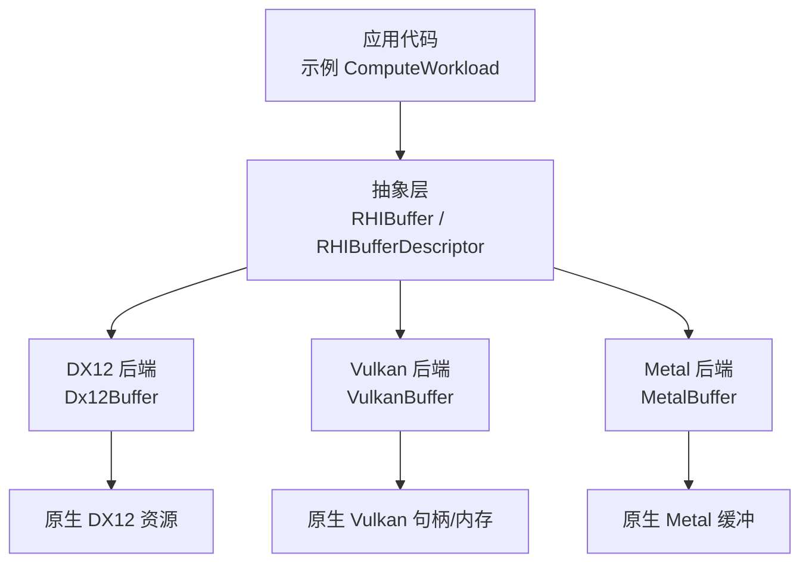
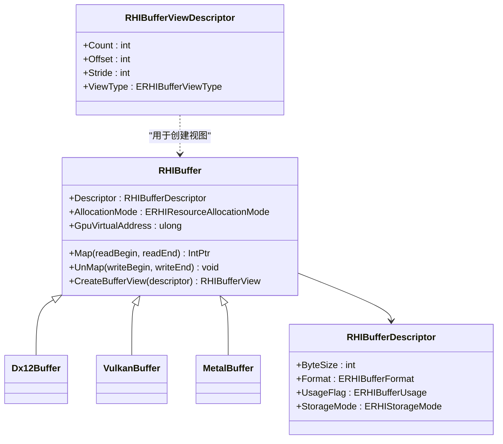
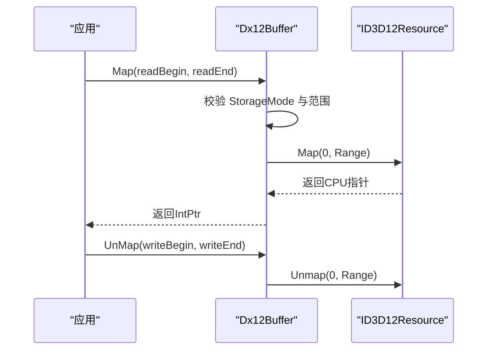
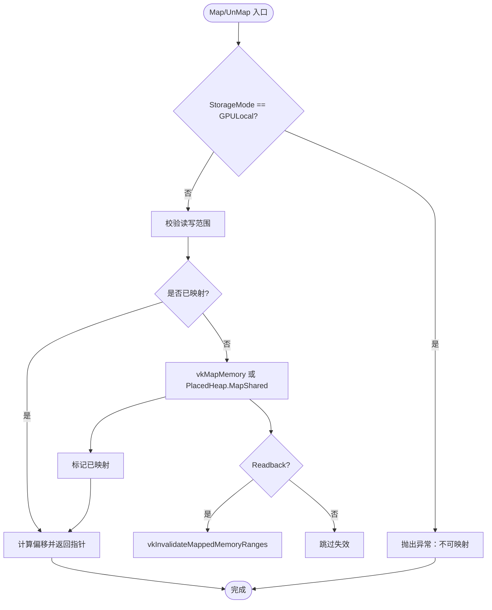
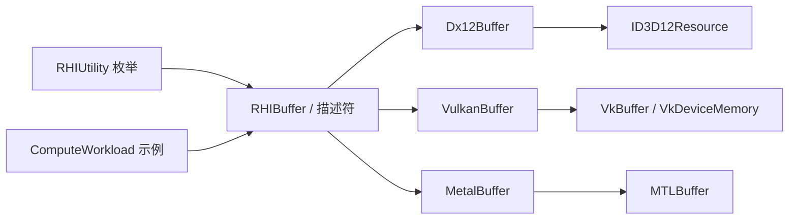

# 缓冲区API

<cite>
**本文引用的文件**
- [RHIBuffer.cs](file://src/SharpGPU/Abstract/RHIBuffer.cs)
- [RHIUtility.cs](file://src/SharpGPU/Abstract/RHIUtility.cs)
- [RHIBufferView.cs](file://src/SharpGPU/Abstract/RHIBufferView.cs)
- [Dx12Buffer.cs](file://src/SharpGPU/Dx12/Dx12Buffer.cs)
- [VulkanBuffer.cs](file://src/SharpGPU/Vulkan/VulkanBuffer.cs)
- [MetalBuffer.cs](file://src/SharpGPU/Metal/MetalBuffer.cs)
- [ComputeWorkload.cs](file://samples/ComputeAndDraw/ComputeWorkload.cs)
</cite>

## 目录
1. [简介](#简介)
2. [项目结构](#项目结构)
3. [核心组件](#核心组件)
4. [架构总览](#架构总览)
5. [详细组件分析](#详细组件分析)
6. [依赖关系分析](#依赖关系分析)
7. [性能考虑](#性能考虑)
8. [故障排查指南](#故障排查指南)
9. [结论](#结论)
10. [附录：完整使用流程示例](#附录完整使用流程示例)

## 简介
本文件面向 SharpGPU 的缓冲区 API，系统性说明抽象层 RHIBuffer 与描述符 RHIBufferDescriptor 的设计与用法，解释缓冲区格式（ERHIBufferFormat）、使用标志（ERHIBufferUsage）和存储模式（ERHIStorageMode）的配置选项；覆盖缓冲区的生命周期管理、内存映射（Map/UnMap）操作和数据传输机制；并提供跨后端（DX12、Vulkan、Metal）的实现差异与优化建议。文末附带完整的创建、上传、同步与销毁流程示例路径。

## 项目结构
- 抽象接口与公共类型位于 src/SharpGPU/Abstract，定义统一的 RHI 抽象：
  - RHIBuffer：缓冲区抽象基类，提供 Map/UnMap、视图创建、GPU 虚拟地址访问等能力。
  - RHIBufferDescriptor：用于描述缓冲区大小、格式、用途与存储模式。
  - RHIBufferViewDescriptor：用于描述缓冲区视图的偏移、步长、类型等。
  - RHIUtility：集中定义各类枚举，包括 ERHIBufferFormat、ERHIBufferUsage、ERHIStorageMode 等。
- 后端实现位于各平台子目录：
  - Dx12Buffer：DirectX12 后端实现。
  - VulkanBuffer：Vulkan 后端实现。
  - MetalBuffer：Metal 后端实现。
- 示例位于 samples/ComputeAndDraw，演示了缓冲区创建、计算着色器写入、拷贝回读与 CPU 读取的完整流程。

图表来源
- [RHIBuffer.cs:14-47](file://src/SharpGPU/Abstract/RHIBuffer.cs#L14-L47)
- [Dx12Buffer.cs:7-147](file://src/SharpGPU/Dx12/Dx12Buffer.cs#L7-L147)
- [VulkanBuffer.cs:7-376](file://src/SharpGPU/Vulkan/VulkanBuffer.cs#L7-L376)
- [MetalBuffer.cs:8-142](file://src/SharpGPU/Metal/MetalBuffer.cs#L8-L142)

章节来源
- [RHIBuffer.cs:1-49](file://src/SharpGPU/Abstract/RHIBuffer.cs#L1-L49)
- [RHIUtility.cs:279-650](file://src/SharpGPU/Abstract/RHIUtility.cs#L279-L650)
- [RHIBufferView.cs:1-18](file://src/SharpGPU/Abstract/RHIBufferView.cs#L1-L18)
- [ComputeWorkload.cs:87-160](file://samples/ComputeAndDraw/ComputeWorkload.cs#L87-L160)

## 核心组件
- RHIBufferDescriptor
  - ByteSize：缓冲区字节大小。
  - Format：缓冲区数据格式（当前主要支持无符号整型）。
  - UsageFlag：缓冲区用途标志位组合，控制底层资源创建时的使用语义。
  - StorageMode：存储模式，决定内存位置、可映射性与缓存策略。
- RHIBuffer（抽象基类）
  - Descriptor：只读描述符访问。
  - AllocationMode：分配模式（Committed/Placed/External），由具体后端设置。
  - GpuVirtualAddress：可选暴露 GPU 虚拟地址（不同后端支持度不同）。
  - Map(readBegin, readEnd)：将指定范围映射到 CPU 可访问指针。
  - UnMap(writeBegin, writeEnd)：结束映射并刷新/失效缓存。
  - CreateBufferView(descriptor)：基于描述符创建缓冲区视图。
- RHIBufferViewDescriptor
  - Count/Offset/Stride：视图元素数量、起始偏移与元素步长。
  - ViewType：视图类型（如 UniformBuffer、ShaderResource、UnorderedAccess 等）。

章节来源
- [RHIBuffer.cs:6-47](file://src/SharpGPU/Abstract/RHIBuffer.cs#L6-L47)
- [RHIBufferView.cs:5-11](file://src/SharpGPU/Abstract/RHIBufferView.cs#L5-L11)
- [RHIUtility.cs:279-285](file://src/SharpGPU/Abstract/RHIUtility.cs#L279-L285)
- [RHIUtility.cs:569-577](file://src/SharpGPU/Abstract/RHIUtility.cs#L569-L577)
- [RHIUtility.cs:614-632](file://src/SharpGPU/Abstract/RHIUtility.cs#L614-L632)
- [RHIUtility.cs:634-641](file://src/SharpGPU/Abstract/RHIUtility.cs#L634-L641)

## 架构总览
缓冲区 API 采用“抽象 + 多后端”设计：
- 抽象层统一对外暴露 Buffer 创建、映射、视图与生命周期管理。
- 各后端根据平台特性实现具体的资源创建、内存分配、映射与同步行为。
- 通过 RHIBufferDescriptor 的 UsageFlag 与 StorageMode 驱动后端选择合适的资源状态与内存属性。

图表来源
- [RHIBuffer.cs:14-47](file://src/SharpGPU/Abstract/RHIBuffer.cs#L14-L47)
- [Dx12Buffer.cs:7-147](file://src/SharpGPU/Dx12/Dx12Buffer.cs#L7-L147)
- [VulkanBuffer.cs:7-376](file://src/SharpGPU/Vulkan/VulkanBuffer.cs#L7-L376)
- [MetalBuffer.cs:8-142](file://src/SharpGPU/Metal/MetalBuffer.cs#L8-L142)
- [RHIBufferView.cs:5-11](file://src/SharpGPU/Abstract/RHIBufferView.cs#L5-L11)

## 详细组件分析

### 抽象层：RHIBuffer 与描述符
- 职责
  - 封装缓冲区的基本信息（大小、格式、用途、存储模式）。
  - 提供跨后端的统一映射接口与视图创建入口。
  - 暴露可选的 GPU 虚拟地址访问（取决于后端能力）。
- 关键约束
  - 所有公开方法在访问前会检查对象是否已释放。
  - 默认分配模式为 Committed，具体后端可能改为 Placed/External。

章节来源
- [RHIBuffer.cs:14-47](file://src/SharpGPU/Abstract/RHIBuffer.cs#L14-L47)

### 配置选项：格式、用途与存储模式
- ERHIBufferFormat
  - 当前支持无符号整型（UInt16/UInt32），以及未定义占位。
- ERHIBufferUsage
  - CopySrc/CopyDst：拷贝源/目的。
  - AccelStruct：加速结构与不透明度微图构建输入/存储（Vulkan 下启用扩展时映射特定标志）。
  - IndexBuffer/VertexBuffer：顶点/索引缓冲。
  - UniformBuffer：常量缓冲。
  - IndirectBuffer：间接参数缓冲。
  - ShaderResource/UnorderedAccess：着色器只读/读写访问。
- ERHIStorageMode
  - GPULocal：GPU 本地内存，通常不可映射。
  - Readback：主机可读回缓冲，适合从 GPU 结果回读。
  - GPUUpload/HostUpload：主机到 GPU 的上传缓冲。
  - Memoryless：无后备存储（例如某些帧缓冲相关场景）。

章节来源
- [RHIUtility.cs:279-285](file://src/SharpGPU/Abstract/RHIUtility.cs#L279-L285)
- [RHIUtility.cs:614-632](file://src/SharpGPU/Abstract/RHIUtility.cs#L614-L632)
- [RHIUtility.cs:569-577](file://src/SharpGPU/Abstract/RHIUtility.cs#L569-L577)

### 后端实现：DX12
- 资源创建
  - 根据 StorageMode 选择堆类型与初始资源状态。
  - 支持 Committed 与 Placed 两种分配模式，以及外部资源包装。
- 映射与同步
  - 仅非 GPULocal 缓冲可映射；对无效范围进行边界校验。
  - Map/Unmap 调用原生 ID3D12Resource 的映射接口，并处理 Range。
- GPU 虚拟地址
  - 直接暴露底层资源的 GPU 虚拟地址。

图表来源
- [Dx12Buffer.cs:99-133](file://src/SharpGPU/Dx12/Dx12Buffer.cs#L99-L133)

章节来源
- [Dx12Buffer.cs:37-147](file://src/SharpGPU/Dx12/Dx12Buffer.cs#L37-L147)

### 后端实现：Vulkan
- 资源创建
  - 构造 VkBufferCreateInfo，并根据 StorageMode 选择内存属性与类型。
  - 若使用设备地址（ShaderDeviceAddress），附加分配标志。
  - 支持 Committed 与 Placed 两种分配模式，以及外部资源包装。
- 映射与同步
  - 非 GPULocal 缓冲可映射；首次 Map 时根据 StorageMode 决定是否 invalidate。
  - UnMap 时根据 StorageMode 决定是否 flush 并解除映射。
  - 对放置堆（PlacedHeap）使用共享映射封装。
- GPU 虚拟地址
  - 通过 vkGetBufferDeviceAddress 获取，需能力检查。

图表来源
- [VulkanBuffer.cs:192-303](file://src/SharpGPU/Vulkan/VulkanBuffer.cs#L192-L303)

章节来源
- [VulkanBuffer.cs:65-376](file://src/SharpGPU/Vulkan/VulkanBuffer.cs#L65-L376)

### 后端实现：Metal
- 资源创建
  - 通过 MTLDevice.NewBuffer 创建缓冲，或使用 MTLHeap 放置缓冲。
  - 根据 StorageMode 选择缓冲选项。
- 映射与同步
  - GPULocal/Memoryless 缓冲不可映射。
  - Managed 模式下，UnMap 时调用 DidModifyRange 通知系统同步。
- GPU 虚拟地址
  - 通过 MTLBuffer.GpuAddress 获取，若为 0 则不支持。

章节来源
- [MetalBuffer.cs:31-142](file://src/SharpGPU/Metal/MetalBuffer.cs#L31-L142)

### 缓冲区视图（RHIBufferView）
- 用途
  - 将原始缓冲以结构化方式绑定到管线（如常量缓冲、着色器资源、无序访问视图）。
- 描述符
  - Count/Offset/Stride 控制元素布局。
  - ViewType 指定视图类型（UniformBuffer、ShaderResource、UnorderedAccess 等）。

章节来源
- [RHIBufferView.cs:5-11](file://src/SharpGPU/Abstract/RHIBufferView.cs#L5-L11)
- [RHIUtility.cs:634-641](file://src/SharpGPU/Abstract/RHIUtility.cs#L634-L641)

## 依赖关系分析
- 抽象层依赖
  - RHIBuffer 依赖 RHIBufferDescriptor 与 RHIBufferViewDescriptor。
  - 枚举定义集中在 RHIUtility。
- 后端依赖
  - Dx12Buffer 依赖 Vortice.Direct3D12 原生资源。
  - VulkanBuffer 依赖 Vortice.Vulkan 原生句柄与内存。
  - MetalBuffer 依赖 SharpMetal.Metal 原生缓冲。
- 示例依赖
  - ComputeWorkload 展示跨后端的使用模式：创建输出缓冲（GPULocal）、拷贝回读缓冲（Readback）、视图绑定、命令编码与提交、栅栏等待、Map 读取与 UnMap。

图表来源
- [RHIUtility.cs:279-650](file://src/SharpGPU/Abstract/RHIUtility.cs#L279-L650)
- [RHIBuffer.cs:14-47](file://src/SharpGPU/Abstract/RHIBuffer.cs#L14-L47)
- [Dx12Buffer.cs:7-147](file://src/SharpGPU/Dx12/Dx12Buffer.cs#L7-L147)
- [VulkanBuffer.cs:7-376](file://src/SharpGPU/Vulkan/VulkanBuffer.cs#L7-L376)
- [MetalBuffer.cs:8-142](file://src/SharpGPU/Metal/MetalBuffer.cs#L8-L142)
- [ComputeWorkload.cs:87-160](file://samples/ComputeAndDraw/ComputeWorkload.cs#L87-L160)

章节来源
- [RHIUtility.cs:279-650](file://src/SharpGPU/Abstract/RHIUtility.cs#L279-L650)
- [ComputeWorkload.cs:87-160](file://samples/ComputeAndDraw/ComputeWorkload.cs#L87-L160)

## 性能考虑
- 存储模式选择
  - GPULocal：适合仅 GPU 读写的高频数据，避免主机映射开销；不可映射。
  - Readback：适合结果回读，Map 时自动失效缓存，确保 CPU 读到最新数据。
  - GPUUpload/HostUpload：适合频繁上传的小块数据，注意批量合并减少映射次数。
  - Memoryless：适用于无后备存储的特殊场景（如部分渲染目标）。
- 用途标志最小化
  - 仅声明需要的 UsageFlag，避免不必要的资源状态转换与限制。
- 视图复用
  - 合理设置 Stride/Offset/Count，减少重复创建视图的开销。
- 映射粒度
  - 尽量缩小 Map/UnMap 的范围，降低缓存一致性成本。
- 后端差异
  - DX12：注意资源初始状态与屏障，避免多余的状态切换。
  - Vulkan：合理使用 PlacedHeap 共享映射，必要时显式 Flush/Invalidate。
  - Metal：Managed 模式下及时调用 DidModifyRange，避免隐式同步带来的延迟。

[本节为通用指导，不直接分析具体文件]

## 故障排查指南
- 常见错误
  - 对 GPULocal 缓冲调用 Map/UnMap：后端会抛出非法操作异常。
  - 范围越界：readBegin/readEnd 超出缓冲区大小或顺序错误，抛出参数异常。
  - Vulkan 未映射即 UnMap：抛出非法操作异常。
  - Metal 未暴露 GPU 地址：访问 GpuVirtualAddress 抛出不支持异常。
- 定位建议
  - 检查 RHIBufferDescriptor 的 StorageMode 与 UsageFlag 是否与使用场景匹配。
  - 确认命令序列中正确的屏障与状态转换。
  - 对于 Vulkan，检查是否启用了所需能力（如设备地址）。

章节来源
- [Dx12Buffer.cs:99-133](file://src/SharpGPU/Dx12/Dx12Buffer.cs#L99-L133)
- [VulkanBuffer.cs:192-303](file://src/SharpGPU/Vulkan/VulkanBuffer.cs#L192-L303)
- [MetalBuffer.cs:85-120](file://src/SharpGPU/Metal/MetalBuffer.cs#L85-L120)
- [MetalBuffer.cs:12-24](file://src/SharpGPU/Metal/MetalBuffer.cs#L12-L24)

## 结论
SharpGPU 的缓冲区 API 通过抽象层统一了跨后端的缓冲区创建、映射与视图管理，配合灵活的描述符与枚举配置，能够适配多种使用场景。理解 StorageMode 与 UsageFlag 的影响，并结合各后端的映射与同步细节，是实现高性能与稳定性的关键。示例展示了典型的“GPU 写 -> 拷贝回读 -> CPU 读取”的完整流程，可作为实际项目的参考模板。

[本节为总结性内容，不直接分析具体文件]

## 附录：完整使用流程示例
以下流程来自示例工程，展示了从创建到销毁的完整生命周期：
- 创建输出缓冲（GPULocal，无序访问）与回读缓冲（Readback，拷贝目的）。
- 创建输出缓冲的无序访问视图并绑定到着色器。
- 编码计算传递，执行 dispatch。
- 编码传输传递，将结果从输出缓冲拷贝到回读缓冲。
- 提交命令并等待栅栏完成。
- 映射回读缓冲读取结果，完成后取消映射。
- 释放所有资源（使用 using 语句自动析构）。

章节来源
- [ComputeWorkload.cs:87-160](file://samples/ComputeAndDraw/ComputeWorkload.cs#L87-L160)