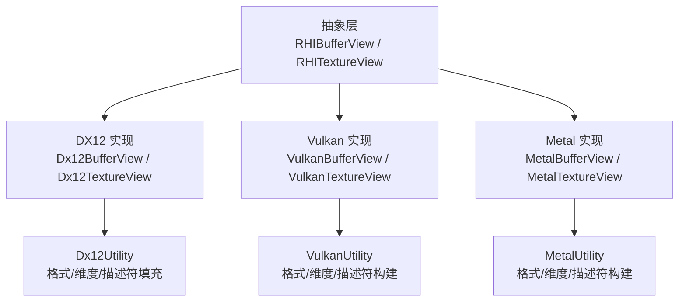
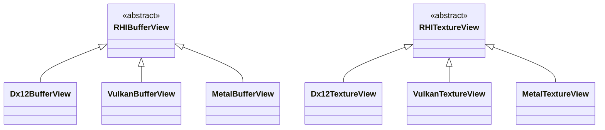
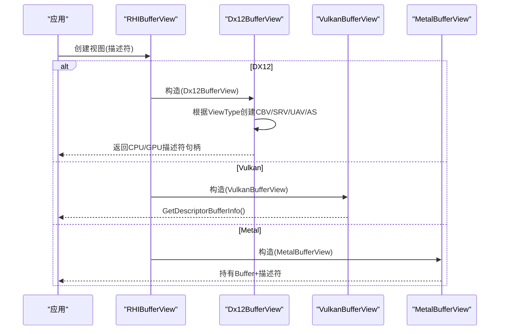
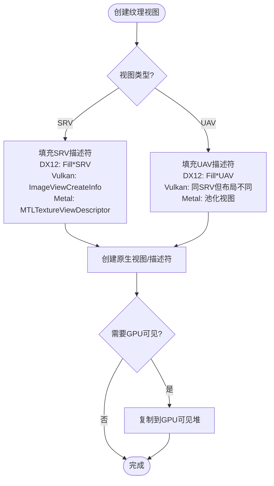
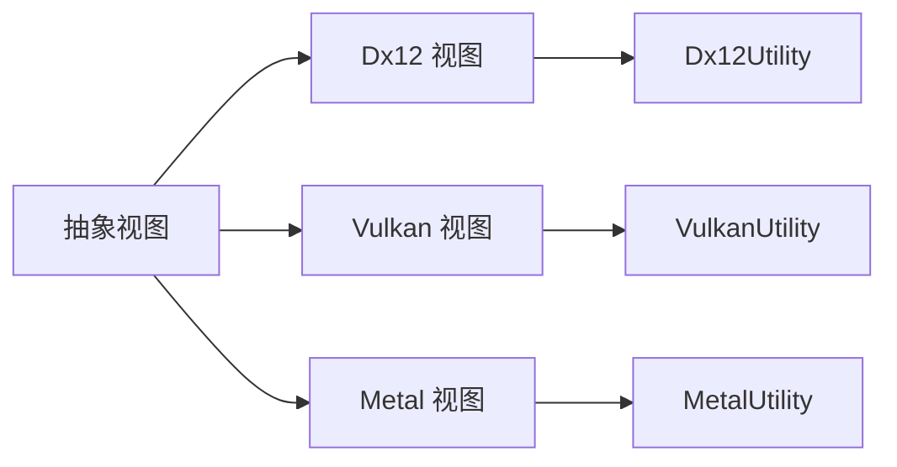

# 视图API

<cite>
**本文引用的文件**
- [RHIBufferView.cs](file://src/SharpGPU/Abstract/RHIBufferView.cs)
- [RHITextureView.cs](file://src/SharpGPU/Abstract/RHITextureView.cs)
- [RHIUtility.cs](file://src/SharpGPU/Abstract/RHIUtility.cs)
- [Dx12BufferView.cs](file://src/SharpGPU/Dx12/Dx12BufferView.cs)
- [Dx12TextureView.cs](file://src/SharpGPU/Dx12/Dx12TextureView.cs)
- [Dx12Utility.cs](file://src/SharpGPU/Dx12/Dx12Utility.cs)
- [VulkanBufferView.cs](file://src/SharpGPU/Vulkan/VulkanBufferView.cs)
- [VulkanTextureView.cs](file://src/SharpGPU/Vulkan/VulkanTextureView.cs)
- [MetalBufferView.cs](file://src/SharpGPU/Metal/MetalBufferView.cs)
- [MetalTextureView.cs](file://src/SharpGPU/Metal/MetalTextureView.cs)
</cite>

## 目录
1. [简介](#简介)
2. [项目结构](#项目结构)
3. [核心组件](#核心组件)
4. [架构总览](#架构总览)
5. [详细组件分析](#详细组件分析)
6. [依赖关系分析](#依赖关系分析)
7. [性能与缓存策略](#性能与缓存策略)
8. [故障排查指南](#故障排查指南)
9. [结论](#结论)
10. [附录：示例与最佳实践](#附录示例与最佳实践)

## 简介
本文件聚焦于 SharpGPU 的“视图”抽象层，系统性地解释缓冲区视图（RHIBufferView）与纹理视图（RHITextureView）的概念、作用、描述符参数配置、与底层资源的绑定关系及生命周期管理。文档同时覆盖 DirectX 12、Vulkan、Metal 三种后端的实现差异，并提供创建不同类型视图的实践建议、性能考量与常见问题排查方法。

## 项目结构
- 抽象层位于 src/SharpGPU/Abstract，定义跨后端统一的视图类型与描述符结构体。
- 各后端实现位于对应子目录：Dx12、Vulkan、Metal，分别将抽象视图映射到平台原生资源与描述符。
- 工具类 Dx12Utility、VulkanUtility、MetalUtility 提供格式、维度、描述符填充等转换逻辑。

图表来源
- [RHIBufferView.cs:5-16](file://src/SharpGPU/Abstract/RHIBufferView.cs#L5-L16)
- [RHITextureView.cs:5-21](file://src/SharpGPU/Abstract/RHITextureView.cs#L5-L21)
- [Dx12BufferView.cs:5-124](file://src/SharpGPU/Dx12/Dx12BufferView.cs#L5-L124)
- [Dx12TextureView.cs:6-123](file://src/SharpGPU/Dx12/Dx12TextureView.cs#L6-L123)
- [VulkanBufferView.cs:5-36](file://src/SharpGPU/Vulkan/VulkanBufferView.cs#L5-L36)
- [VulkanTextureView.cs:5-68](file://src/SharpGPU/Vulkan/VulkanTextureView.cs#L5-L68)
- [MetalBufferView.cs:3-20](file://src/SharpGPU/Metal/MetalBufferView.cs#L3-L20)
- [MetalTextureView.cs:106-165](file://src/SharpGPU/Metal/MetalTextureView.cs#L106-L165)

章节来源
- [RHIBufferView.cs:5-16](file://src/SharpGPU/Abstract/RHIBufferView.cs#L5-L16)
- [RHITextureView.cs:5-21](file://src/SharpGPU/Abstract/RHITextureView.cs#L5-L21)

## 核心组件
- RHIBufferViewDescriptor：描述缓冲区视图的范围与步长、元素数量、视图类型。
- RHIBufferView：抽象基类，承载具体后端对缓冲区的“切片式”访问语义。
- RHITextureViewDescriptor：描述纹理视图的层级范围、数组切片、视图类型。
- RHITextureView：抽象基类，承载具体后端对纹理的“子区域/子层级”访问语义。
- 枚举 ERHIBufferViewType、ERHITextureViewType：统一视图类型（如着色器资源、无序访问、常量缓冲、加速结构等）。

关键要点
- 偏移量与范围：缓冲区通过 Offset/Stride/Count 组合表达；纹理通过 BaseMipLevel/MipCount/BaseArraySlice/ArrayCount 表达。
- 视图类型：不同后端对支持的视图类型有差异，例如 DX12 支持加速结构视图，Vulkan/Metal 当前实现未暴露该类型。
- 组件映射：Vulkan 视图默认使用恒等分量映射；DX12 设置固定组件映射值以适配着色器采样。

章节来源
- [RHIBufferView.cs:5-16](file://src/SharpGPU/Abstract/RHIBufferView.cs#L5-L16)
- [RHITextureView.cs:5-21](file://src/SharpGPU/Abstract/RHITextureView.cs#L5-L21)
- [RHIUtility.cs:634-661](file://src/SharpGPU/Abstract/RHIUtility.cs#L634-L661)

## 架构总览
视图在 SharpGPU 中扮演“资源切片 + 访问语义”的角色：同一底层资源可通过多个视图以不同范围/格式/用途暴露给着色器或计算管线。

图表来源
- [RHIBufferView.cs:13-16](file://src/SharpGPU/Abstract/RHIBufferView.cs#L13-L16)
- [RHITextureView.cs:18-21](file://src/SharpGPU/Abstract/RHITextureView.cs#L18-L21)
- [Dx12BufferView.cs:5-124](file://src/SharpGPU/Dx12/Dx12BufferView.cs#L5-L124)
- [Dx12TextureView.cs:6-123](file://src/SharpGPU/Dx12/Dx12TextureView.cs#L6-L123)
- [VulkanBufferView.cs:5-36](file://src/SharpGPU/Vulkan/VulkanBufferView.cs#L5-L36)
- [VulkanTextureView.cs:5-68](file://src/SharpGPU/Vulkan/VulkanTextureView.cs#L5-L68)
- [MetalBufferView.cs:3-20](file://src/SharpGPU/Metal/MetalBufferView.cs#L3-L20)
- [MetalTextureView.cs:106-165](file://src/SharpGPU/Metal/MetalTextureView.cs#L106-L165)

## 详细组件分析

### 缓冲区视图（RHIBufferView）
- 描述符字段
  - Count：元素个数（用于 SRV/UAV）。
  - Offset：起始偏移（字节索引，按 Stride 缩放）。
  - Stride：元素步长（字节），决定每个元素的跨度。
  - ViewType：视图类型（UniformBuffer/ShaderResource/UnorderedAccess/AccelStruct）。
- 后端行为
  - DX12：根据 ViewType 创建 CBV/SRV/UAV/加速结构视图，并分配 CPU/GPU 可见描述符对，复制到 GPU 可见堆。
  - Vulkan：构造 VkDescriptorBufferInfo，range 由 Stride×Count 或 UniformBuffer 的 Stride 决定。
  - Metal：保留描述符与 Buffer 引用，便于上层按需构建描述符。
- 生命周期
  - 继承 Disposal，Release 时释放 DX12 的描述符对；Vulkan/Metal 当前 Release 为空（由设备/池管理）。

图表来源
- [Dx12BufferView.cs:38-114](file://src/SharpGPU/Dx12/Dx12BufferView.cs#L38-L114)
- [VulkanBufferView.cs:14-31](file://src/SharpGPU/Vulkan/VulkanBufferView.cs#L14-L31)
- [MetalBufferView.cs:11-15](file://src/SharpGPU/Metal/MetalBufferView.cs#L11-L15)

章节来源
- [RHIBufferView.cs:5-16](file://src/SharpGPU/Abstract/RHIBufferView.cs#L5-L16)
- [Dx12BufferView.cs:38-124](file://src/SharpGPU/Dx12/Dx12BufferView.cs#L38-L124)
- [VulkanBufferView.cs:14-36](file://src/SharpGPU/Vulkan/VulkanBufferView.cs#L14-L36)
- [MetalBufferView.cs:3-20](file://src/SharpGPU/Metal/MetalBufferView.cs#L3-L20)

### 纹理视图（RHITextureView）
- 描述符字段
  - BaseMipLevel/MipCount：mipmap 层级范围。
  - BaseArraySlice/ArrayCount：数组切片范围。
  - ViewType：ShaderResource/UnorderedAccess。
- 后端行为
  - DX12：根据维度与类型填充 SRV/UAV 描述符，调用 CreateShaderResourceView/CreateUnorderedAccessView，并复制至 GPU 可见堆；支持采样反馈 UAV（需配对采样纹理存活）。
  - Vulkan：创建 VkImageView，包含 subresourceRange 与组件映射（默认恒等）。
  - Metal：复用纹理视图池，支持全视图快速路径与自定义 Level/Slice 范围。
- 生命周期
  - DX12：Release 释放描述符对。
  - Vulkan：Release 销毁 VkImageView。
  - Metal：Release 归还视图索引租约。

图表来源
- [Dx12TextureView.cs:39-113](file://src/SharpGPU/Dx12/Dx12TextureView.cs#L39-L113)
- [VulkanTextureView.cs:17-52](file://src/SharpGPU/Vulkan/VulkanTextureView.cs#L17-L52)
- [MetalTextureView.cs:118-159](file://src/SharpGPU/Metal/MetalTextureView.cs#L118-L159)

章节来源
- [RHITextureView.cs:5-21](file://src/SharpGPU/Abstract/RHITextureView.cs#L5-L21)
- [Dx12TextureView.cs:39-123](file://src/SharpGPU/Dx12/Dx12TextureView.cs#L39-L123)
- [VulkanTextureView.cs:17-68](file://src/SharpGPU/Vulkan/VulkanTextureView.cs#L17-L68)
- [MetalTextureView.cs:106-165](file://src/SharpGPU/Metal/MetalTextureView.cs#L106-L165)

### 视图类型与枚举
- ERHIBufferViewType：AccelStruct、UniformBuffer、ShaderResource、UnorderedAccess。
- ERHITextureViewType：ShaderResource、UnorderedAccess。

章节来源
- [RHIUtility.cs:634-661](file://src/SharpGPU/Abstract/RHIUtility.cs#L634-L661)

## 依赖关系分析
- 抽象层仅定义数据结构与接口，不依赖具体后端。
- DX12 实现依赖 Dx12Utility 进行格式/维度/描述符填充，并使用设备分配的 DescriptorPair 管理 CPU/GPU 可见描述符。
- Vulkan 实现依赖 VulkanUtility 进行格式/维度转换，直接创建 VkImageView。
- Metal 实现依赖 MetalUtility 进行格式/维度转换，并通过纹理视图池优化重复创建。

图表来源
- [Dx12BufferView.cs:5-124](file://src/SharpGPU/Dx12/Dx12BufferView.cs#L5-L124)
- [Dx12TextureView.cs:6-123](file://src/SharpGPU/Dx12/Dx12TextureView.cs#L6-L123)
- [VulkanBufferView.cs:5-36](file://src/SharpGPU/Vulkan/VulkanBufferView.cs#L5-L36)
- [VulkanTextureView.cs:5-68](file://src/SharpGPU/Vulkan/VulkanTextureView.cs#L5-L68)
- [MetalBufferView.cs:3-20](file://src/SharpGPU/Metal/MetalBufferView.cs#L3-L20)
- [MetalTextureView.cs:106-165](file://src/SharpGPU/Metal/MetalTextureView.cs#L106-L165)

章节来源
- [Dx12Utility.cs:1-200](file://src/SharpGPU/Dx12/Dx12Utility.cs#L1-L200)
- [VulkanUtility.cs:1-200](file://src/SharpGPU/Vulkan/VulkanUtility.cs#L1-L200)

## 性能与缓存策略
- DX12 描述符对与堆
  - 视图创建时会分配一对描述符（Staging 与 ShaderVisible），并复制到 GPU 可见堆，减少运行时更新成本。
  - 释放时归还描述符对，避免泄漏。
- Vulkan 视图对象
  - 视图为轻量级句柄，创建/销毁开销较低；注意合理复用 VkImageView。
- Metal 纹理视图池
  - 使用池化机制复用视图索引，降低频繁创建/销毁的开销；支持“全视图”快速路径。
- 通用建议
  - 尽量复用视图对象，避免每帧重建。
  - 合理设置 Stride/Count/Range，避免过大范围导致带宽浪费。
  - 对于大量小视图，优先选择池化/批量创建的后端特性（如 Metal 视图池、DX12 描述符堆）。

[本节为通用性能指导，不直接分析具体文件]

## 故障排查指南
- 无法创建视图
  - DX12：若资源 UsageFlag 不支持目标视图类型，会抛出异常。检查资源创建时的 UsageFlag 是否包含 ShaderResource/UnorderedAccess/ConstantBuffer/AccelStruct 等。
  - DX12 采样反馈 UAV：要求配对采样纹理仍存活，否则抛异常。
  - Vulkan：确保 ImageLayout 与描述符一致；检查 Format/Dimension 转换结果。
- 数据读取异常
  - 检查 Offset/Stride/Count 是否正确；确认缓冲区对齐与步长符合预期。
  - 纹理视图的 BaseMipLevel/MipCount/BaseArraySlice/ArrayCount 是否越界。
- 内存与生命周期
  - 确保视图对象在其生命周期内不被提前释放；DX12 视图释放会归还描述符对。
  - Vulkan 视图释放会销毁 VkImageView，避免悬垂引用。
  - Metal 视图释放会归还池索引，避免池耗尽。

章节来源
- [Dx12BufferView.cs:110-124](file://src/SharpGPU/Dx12/Dx12BufferView.cs#L110-L124)
- [Dx12TextureView.cs:46-113](file://src/SharpGPU/Dx12/Dx12TextureView.cs#L46-L113)
- [VulkanTextureView.cs:17-68](file://src/SharpGPU/Vulkan/VulkanTextureView.cs#L17-L68)
- [MetalTextureView.cs:118-165](file://src/SharpGPU/Metal/MetalTextureView.cs#L118-L165)

## 结论
SharpGPU 的视图 API 通过抽象层统一了缓冲区与纹理的“切片式”访问语义，并在各后端实现了高效的原生映射。理解描述符参数（偏移/范围/类型）与后端差异（DX12 描述符对、Vulkan 图像视图、Metal 视图池）是正确使用视图的关键。遵循复用与范围最小化原则，可显著提升渲染/计算效率并降低资源压力。

[本节为总结性内容，不直接分析具体文件]

## 附录：示例与最佳实践

- 创建缓冲区视图
  - 常量缓冲（UniformBuffer）：设置 Stride 为常量块大小，Offset 指向所需偏移，Count 通常忽略。
  - 着色器资源（ShaderResource）：设置 Count 为元素数，Stride 为结构体字节大小，Offset 为起始位置。
  - 无序访问（UnorderedAccess）：同 SRV 的参数设置，但资源需具备 UAV 使用标志。
  - 加速结构（AccelStruct）：仅 DX12 支持，需资源具备相应用法。

- 创建纹理视图
  - 完整视图：BaseMipLevel=0, MipCount=全部, BaseArraySlice=0, ArrayCount=全部。
  - 部分视图：指定 mipmap 与数组切片范围，减少采样带宽。
  - 采样反馈 UAV：需保证配对采样纹理存活，且资源支持采样反馈。

- 组件映射与格式
  - Vulkan：默认恒等映射（r,g,b,a -> r,g,b,a）。
  - DX12：设置固定组件映射值以适配着色器采样。
  - 格式转换：通过 Dx12Utility/VulkanUtility/MetalUtility 将内部像素格式转换为后端格式。

- 生命周期与缓存
  - 视图对象应尽可能复用；DX12 视图释放会归还描述符对。
  - Vulkan 视图对象轻量，但仍建议复用。
  - Metal 视图池可显著降低创建开销，优先使用池化路径。

- 常见错误定位
  - 资源用法不匹配：检查 UsageFlag 是否包含所需能力。
  - 范围越界：校验 Offset/Stride/Count 与纹理层级/数组范围。
  - 采样反馈约束：确保配对纹理有效且未被释放。

章节来源
- [Dx12BufferView.cs:38-114](file://src/SharpGPU/Dx12/Dx12BufferView.cs#L38-L114)
- [Dx12TextureView.cs:39-113](file://src/SharpGPU/Dx12/Dx12TextureView.cs#L39-L113)
- [VulkanBufferView.cs:14-31](file://src/SharpGPU/Vulkan/VulkanBufferView.cs#L14-L31)
- [VulkanTextureView.cs:17-52](file://src/SharpGPU/Vulkan/VulkanTextureView.cs#L17-L52)
- [MetalTextureView.cs:118-159](file://src/SharpGPU/Metal/MetalTextureView.cs#L118-L159)