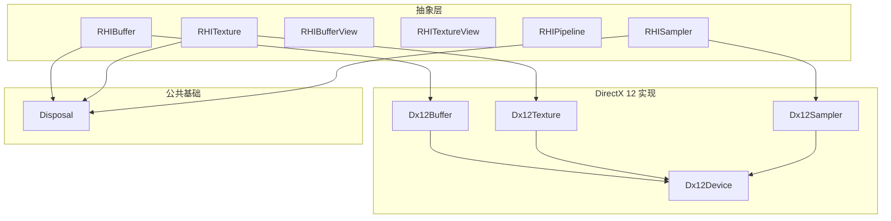
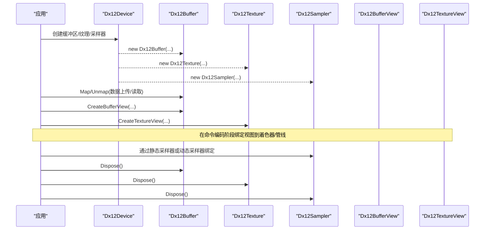
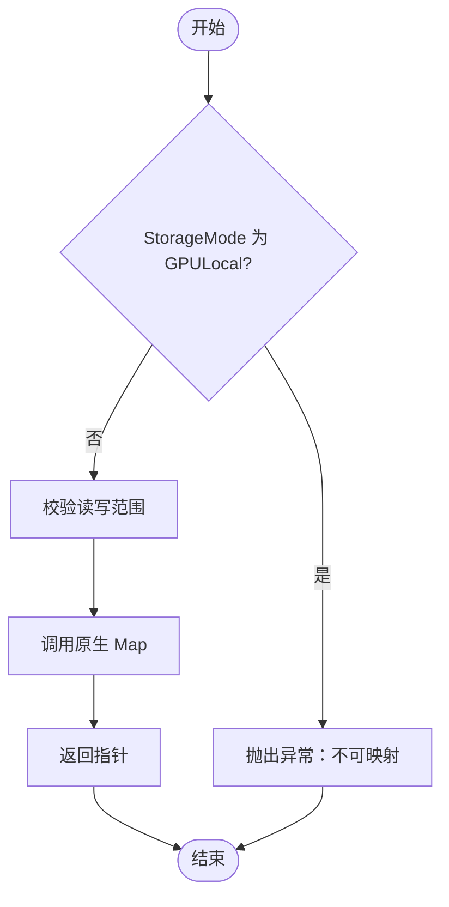
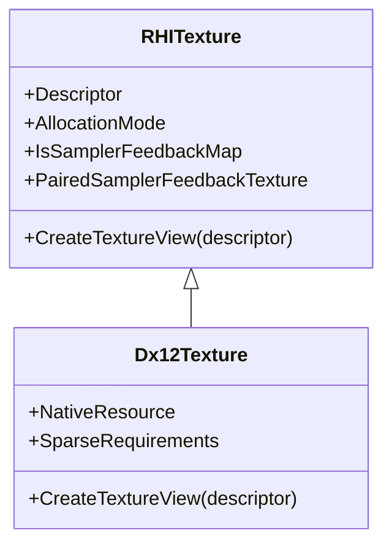
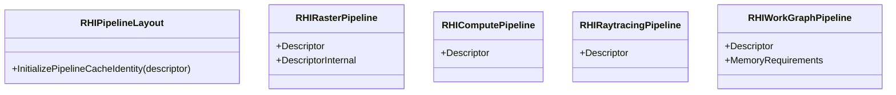
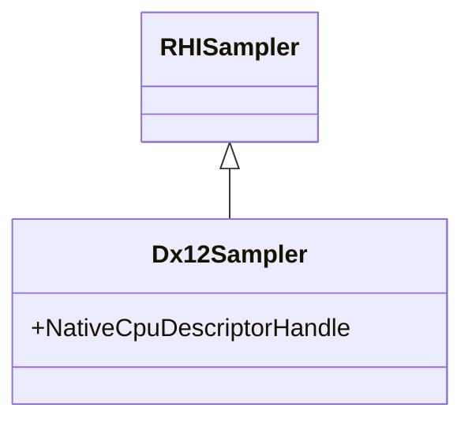
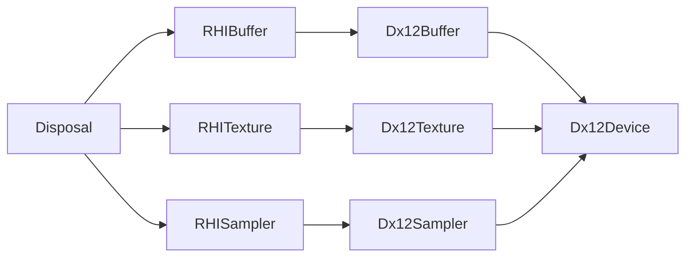

# 资源管理API

<cite>
**本文引用的文件**
- [RHIBuffer.cs](file://src/SharpGPU/Abstract/RHIBuffer.cs)
- [RHITexture.cs](file://src/SharpGPU/Abstract/RHITexture.cs)
- [RHIBufferView.cs](file://src/SharpGPU/Abstract/RHIBufferView.cs)
- [RHITextureView.cs](file://src/SharpGPU/Abstract/RHITextureView.cs)
- [RHIPipeline.cs](file://src/SharpGPU/Abstract/RHIPipeline.cs)
- [RHISampler.cs](file://src/SharpGPU/Abstract/RHISampler.cs)
- [Dx12Buffer.cs](file://src/SharpGPU/Dx12/Dx12Buffer.cs)
- [Dx12Texture.cs](file://src/SharpGPU/Dx12/Dx12Texture.cs)
- [Dx12Sampler.cs](file://src/SharpGPU/Dx12/Dx12Sampler.cs)
- [Dx12Device.cs](file://src/SharpGPU/Dx12/Dx12Device.cs)
- [Disposal.cs](file://src/SharpGPU/Common/Core/Disposal.cs)
- [Program.cs](file://samples/ComputeAndDraw/Program.cs)
</cite>

## 目录
1. [简介](#简介)
2. [项目结构](#项目结构)
3. [核心组件](#核心组件)
4. [架构总览](#架构总览)
5. [详细组件分析](#详细组件分析)
6. [依赖关系分析](#依赖关系分析)
7. [性能考虑](#性能考虑)
8. [故障排查指南](#故障排查指南)
9. [结论](#结论)
10. [附录](#附录)

## 简介
本文件面向使用 SharpGPU 的开发者，系统化说明资源管理 API：缓冲区（RHIBuffer）、纹理（RHITexture）、视图（BufferView、TextureView）、管线（RHIPipeline）与采样器（RHISampler）的创建、配置与使用。文档涵盖描述符参数含义与约束、内存分配策略、生命周期管理、资源绑定模式，并提供完整的代码示例路径，展示从资源创建、数据上传、视图绑定到销毁的全流程。同时给出性能优化建议与最佳实践，帮助在不同后端（如 DirectX 12）上获得稳定高效的渲染或计算性能。

## 项目结构
SharpGPU 采用抽象接口 + 后端实现的层次化设计：
- 抽象层（Abstract）：定义跨后端的资源类型、描述符与管线接口，确保一致的编程模型。
- 后端实现（Dx12/Metal/Vulkan）：将抽象接口映射到具体平台 API（例如 Dx12*）。
- 公共基础设施（Common）：提供通用基类（如 Disposal）与工具。
- 示例（samples）：演示如何组合上述 API 完成典型工作负载。

图表来源
- [RHIBuffer.cs:14-47](file://src/SharpGPU/Abstract/RHIBuffer.cs#L14-L47)
- [RHITexture.cs:50-139](file://src/SharpGPU/Abstract/RHITexture.cs#L50-L139)
- [RHISampler.cs:33-36](file://src/SharpGPU/Abstract/RHISampler.cs#L33-L36)
- [Dx12Buffer.cs:8-147](file://src/SharpGPU/Dx12/Dx12Buffer.cs#L8-L147)
- [Dx12Texture.cs:7-199](file://src/SharpGPU/Dx12/Dx12Texture.cs#L7-L199)
- [Dx12Sampler.cs:4-58](file://src/SharpGPU/Dx12/Dx12Sampler.cs#L4-L58)
- [Dx12Device.cs:48-158](file://src/SharpGPU/Dx12/Dx12Device.cs#L48-L158)
- [Disposal.cs:7-63](file://src/SharpGPU/Common/Core/Disposal.cs#L7-L63)

章节来源
- [Program.cs:7-15](file://samples/ComputeAndDraw/Program.cs#L7-L15)

## 核心组件
本节概述各资源类型的职责与关键能力：
- RHIBuffer：表示 GPU 可访问的线性内存块，支持映射/解映射、创建 BufferView、暴露可选的 GPU 虚拟地址（后端相关）。
- RHITexture：表示二维/三维纹理资源，支持创建 TextureView、采样反馈图配对等高级特性。
- RHIBufferView / RHITextureView：对底层资源的“视图”描述，限定可见范围、格式、数组切片、mip 层级等。
- RHIPipeline：封装图形/计算/光线追踪等工作负载的状态机，包含布局、混合、光栅化、深度模板等状态。
- RHISampler：定义纹理采样行为（过滤、寻址、LOD、比较模式等），并支持静态采样器集合。

章节来源
- [RHIBuffer.cs:6-47](file://src/SharpGPU/Abstract/RHIBuffer.cs#L6-L47)
- [RHITexture.cs:7-139](file://src/SharpGPU/Abstract/RHITexture.cs#L7-L139)
- [RHIBufferView.cs:5-16](file://src/SharpGPU/Abstract/RHIBufferView.cs#L5-L16)
- [RHITextureView.cs:5-21](file://src/SharpGPU/Abstract/RHITextureView.cs#L5-L21)
- [RHIPipeline.cs:11-264](file://src/SharpGPU/Abstract/RHIPipeline.cs#L11-L264)
- [RHISampler.cs:6-36](file://src/SharpGPU/Abstract/RHISampler.cs#L6-L36)

## 架构总览
下图展示了从设备创建资源到视图绑定与销毁的整体流程，以及抽象与 DX12 实现的对应关系。

图表来源
- [Dx12Device.cs:264-303](file://src/SharpGPU/Dx12/Dx12Device.cs#L264-L303)
- [Dx12Buffer.cs:37-147](file://src/SharpGPU/Dx12/Dx12Buffer.cs#L37-L147)
- [Dx12Texture.cs:30-186](file://src/SharpGPU/Dx12/Dx12Texture.cs#L30-L186)
- [Dx12Sampler.cs:28-58](file://src/SharpGPU/Dx12/Dx12Sampler.cs#L28-L58)

## 详细组件分析

### 缓冲区（RHIBuffer）
- 描述符字段
  - ByteSize：缓冲区字节大小。
  - Format：缓冲区的元素格式（用于解释数据布局）。
  - UsageFlag：用途标志（如常量缓冲、顶点缓冲、存储缓冲等）。
  - StorageMode：存储位置（如 GPU 本地、共享等），影响是否可映射。
- 关键方法
  - Map/UnMap：CPU 访问 GPU 内存的入口；GPULocal 模式下不可映射。
  - CreateBufferView：基于偏移、步长、数量创建视图。
- 后端实现要点（DX12）
  - 提交式资源（Committed）与放置式资源（Placed）两种分配方式。
  - 映射时校验范围与存储模式，调用原生 Map/Unmap。
  - 释放时清理原生资源与堆放置信息。

图表来源
- [Dx12Buffer.cs:99-133](file://src/SharpGPU/Dx12/Dx12Buffer.cs#L99-L133)

章节来源
- [RHIBuffer.cs:6-47](file://src/SharpGPU/Abstract/RHIBuffer.cs#L6-L47)
- [Dx12Buffer.cs:37-147](file://src/SharpGPU/Dx12/Dx12Buffer.cs#L37-L147)

### 纹理（RHITexture）
- 描述符字段
  - MipCount：mipmap 层级数。
  - Extent：尺寸（宽、高、深）。
  - Format：像素格式。
  - SampleCount：多重采样数。
  - StorageMode：存储位置。
  - UsageFlag：用途标志（如着色器资源、渲染目标、拷贝源/目的等）。
  - Dimension：维度（1D/2D/3D/Cube）。
- 采样反馈图
  - 可通过设备创建与采样纹理配对的反馈图，记录采样使用情况（MinMip、MipRegionUsed 等）。
  - 反馈图具有专用格式与只写 UAO 访问语义。
- 后端实现要点（DX12）
  - 使用默认堆创建纹理资源，支持稀疏纹理预留与查询需求。
  - 提供工厂方法创建采样反馈图，并与被采样纹理建立配对关系。

图表来源
- [RHITexture.cs:39-139](file://src/SharpGPU/Abstract/RHITexture.cs#L39-L139)
- [Dx12Texture.cs:7-199](file://src/SharpGPU/Dx12/Dx12Texture.cs#L7-L199)

章节来源
- [RHITexture.cs:39-139](file://src/SharpGPU/Abstract/RHITexture.cs#L39-L139)
- [Dx12Texture.cs:30-186](file://src/SharpGPU/Dx12/Dx12Texture.cs#L30-L186)

### 视图（BufferView、TextureView）
- BufferView 描述符
  - Count：元素个数。
  - Offset：起始偏移。
  - Stride：元素步长。
  - ViewType：视图类型（如 CBV/SRV/UAV）。
- TextureView 描述符
  - MipCount/BaseMipLevel：mip 范围。
  - ArrayCount/BaseArraySlice：数组切片范围。
  - ViewType：视图类型（如 SRV/RTV/DSV/UAO）。
- 作用
  - 在不复制数据的前提下，以不同视角访问同一底层资源。
  - 与管线绑定阶段配合，将资源映射到着色器可见的描述符表。

章节来源
- [RHIBufferView.cs:5-16](file://src/SharpGPU/Abstract/RHIBufferView.cs#L5-L16)
- [RHITextureView.cs:5-21](file://src/SharpGPU/Abstract/RHITextureView.cs#L5-L21)

### 管线（RHIPipeline）
- 布局与绑定表
  - PipelineLayoutDescriptor：是否使用局部签名、顶点布局、PushConstant 大小、绑定表布局、静态采样器等。
- 光栅化管线
  - RHIRasterPipelineDescriptor：采样数、颜色/深度格式、附件接口、混合/光栅化/深度模板状态、片段函数、原语装配器等。
  - 内部验证：样本数、颜色附件数量与格式、深度/模板兼容性、原语装配器互斥等。
- 计算/光线追踪管线
  - RHIComputePipelineDescriptor：线程组大小、计算函数、布局。
  - RHIRaytracingPipelineDescriptor：线程组、负载/属性大小、递归深度、函数库、射线组等。
- 工作图管线
  - RHIWorkGraphPipelineDescriptor：名称、函数库、布局。

图表来源
- [RHIPipeline.cs:11-264](file://src/SharpGPU/Abstract/RHIPipeline.cs#L11-L264)

章节来源
- [RHIPipeline.cs:11-264](file://src/SharpGPU/Abstract/RHIPipeline.cs#L11-L264)

### 采样器（RHISampler）
- 描述符字段
  - LodMin/LodMax：LOD 范围。
  - MipLODBias：mip LOD 偏置。
  - Anisotropy：各向异性等级。
  - MinFilter/MagFilter/MipFilter：过滤模式。
  - AddressModeU/V/W：寻址模式。
  - ComparisonMode：比较模式（用于深度/阴影贴图）。
- 静态采样器
  - RHIStaticSamplerDescriptor：按索引绑定的采样器集合，便于在管线布局中固定。
- 后端实现要点（DX12）
  - 转换为原生采样器描述，按完整 descriptor intern 共享 CPU 槽；BindingTable sampler 段才占用 GPU heap。

图表来源
- [RHISampler.cs:6-36](file://src/SharpGPU/Abstract/RHISampler.cs#L6-L36)
- [Dx12Sampler.cs:4-58](file://src/SharpGPU/Dx12/Dx12Sampler.cs#L4-L58)

章节来源
- [RHISampler.cs:6-36](file://src/SharpGPU/Abstract/RHISampler.cs#L6-L36)
- [Dx12Sampler.cs:28-58](file://src/SharpGPU/Dx12/Dx12Sampler.cs#L28-L58)

## 依赖关系分析
- 抽象与实现
  - 所有资源类型继承自 Disposal，统一生命周期管理。
  - 后端实现（Dx12*）负责将抽象对象映射到原生资源与描述符。
- 设备与资源
  - 设备负责创建资源、查询内存需求、创建堆与队列等。
- 视图与管线
  - 视图由资源创建，管线通过布局与绑定表引用视图。

图表来源
- [Disposal.cs:7-63](file://src/SharpGPU/Common/Core/Disposal.cs#L7-L63)
- [Dx12Buffer.cs:8-147](file://src/SharpGPU/Dx12/Dx12Buffer.cs#L8-L147)
- [Dx12Texture.cs:7-199](file://src/SharpGPU/Dx12/Dx12Texture.cs#L7-L199)
- [Dx12Sampler.cs:4-58](file://src/SharpGPU/Dx12/Dx12Sampler.cs#L4-L58)
- [Dx12Device.cs:48-158](file://src/SharpGPU/Dx12/Dx12Device.cs#L48-L158)

章节来源
- [Dx12Device.cs:264-303](file://src/SharpGPU/Dx12/Dx12Device.cs#L264-L303)

## 性能考虑
- 内存分配策略
  - 优先使用放置式资源（Placed）复用堆，减少频繁分配开销。
  - 对频繁更新的数据（如常量缓冲）使用上传堆或映射写入，避免不必要的同步。
- 视图与绑定
  - 尽量复用视图对象，减少描述符分配与拷贝。
  - 使用静态采样器减少运行时绑定成本。
- 管线状态
  - 合理设置混合、光栅化、深度模板状态，避免每帧切换。
  - 利用管线缓存标识（PipelineLayout 身份）提升缓存命中率。
- 采样反馈
  - 仅在需要时使用采样反馈图，注意其专用格式与只写访问限制。

[本节为通用指导，不直接分析具体文件]

## 故障排查指南
- 映射失败
  - 检查 StorageMode 是否为 GPULocal；若是则不可映射。
  - 校验读写范围是否在缓冲区边界内。
- 纹理创建失败
  - 检查 UsageFlag 是否为已知组合；确认设备能力与格式支持。
  - 若创建采样反馈图，确认配对纹理属于同一设备且模式受支持。
- 管线验证错误
  - 颜色附件数量与格式需符合限制；深度/模板启用需具备相应 aspect。
  - 原语装配器不能同时指定顶点与网格装配器。
- 生命周期问题
  - 确保在销毁前释放所有视图与绑定；遵循先视图后资源的顺序。
  - 使用 Disposal 的 Dispose 进行显式释放，避免最终确定器泄漏。

章节来源
- [Dx12Buffer.cs:99-133](file://src/SharpGPU/Dx12/Dx12Buffer.cs#L99-L133)
- [Dx12Texture.cs:118-132](file://src/SharpGPU/Dx12/Dx12Texture.cs#L118-L132)
- [Dx12Device.cs:305-358](file://src/SharpGPU/Dx12/Dx12Device.cs#L305-L358)
- [RHIPipeline.cs:266-725](file://src/SharpGPU/Abstract/RHIPipeline.cs#L266-L725)
- [Disposal.cs:7-63](file://src/SharpGPU/Common/Core/Disposal.cs#L7-L63)

## 结论
SharpGPU 的资源管理 API 通过抽象层统一了跨后端的资源创建、视图绑定与管线配置，并在 DX12 等后端实现了高效的原生映射。理解描述符参数与约束、掌握内存分配策略与生命周期管理，是构建高性能渲染/计算应用的关键。结合本文的流程与最佳实践，可在保证正确性的前提下获得更优的性能表现。

[本节为总结性内容，不直接分析具体文件]

## 附录
- 完整示例路径
  - 示例程序入口：[Program.cs:7-15](file://samples/ComputeAndDraw/Program.cs#L7-L15)
  - 缓冲区创建与使用：参考 [Dx12Buffer.cs:37-147](file://src/SharpGPU/Dx12/Dx12Buffer.cs#L37-L147)
  - 纹理创建与视图：参考 [Dx12Texture.cs:30-186](file://src/SharpGPU/Dx12/Dx12Texture.cs#L30-L186)
  - 采样器创建与绑定：参考 [Dx12Sampler.cs:28-58](file://src/SharpGPU/Dx12/Dx12Sampler.cs#L28-L58)
  - 管线状态配置：参考 [RHIPipeline.cs:11-264](file://src/SharpGPU/Abstract/RHIPipeline.cs#L11-L264)
  - 生命周期管理：参考 [Disposal.cs:7-63](file://src/SharpGPU/Common/Core/Disposal.cs#L7-L63)