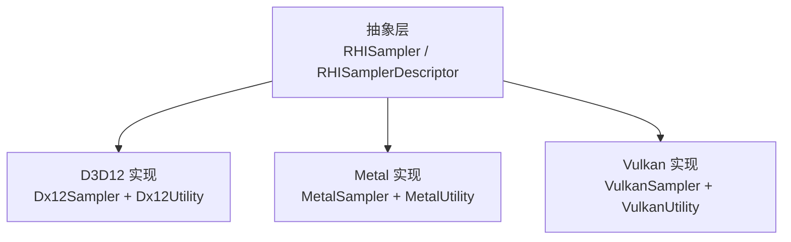
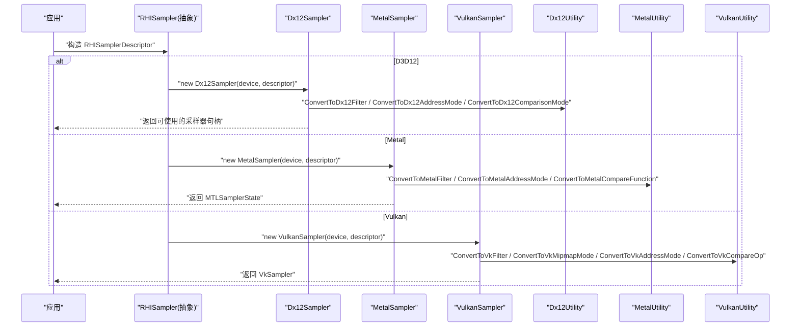
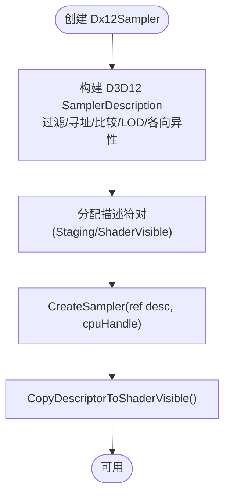
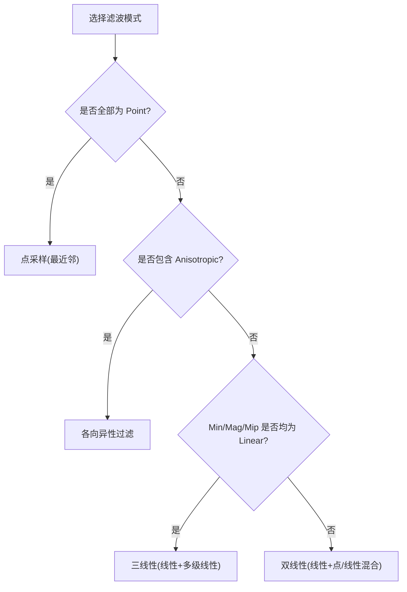
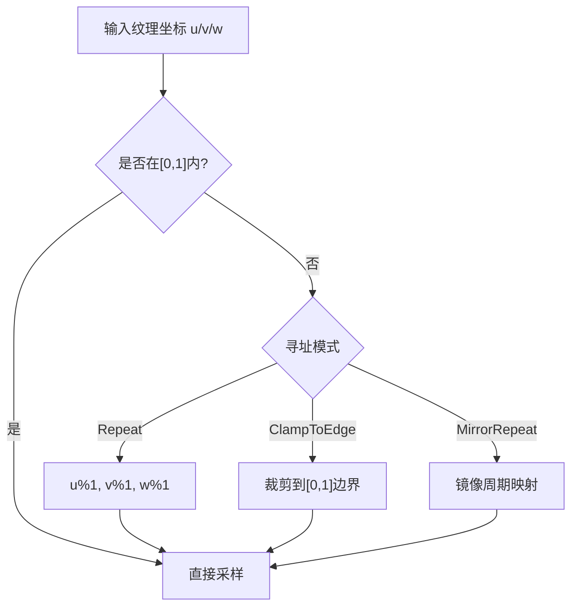
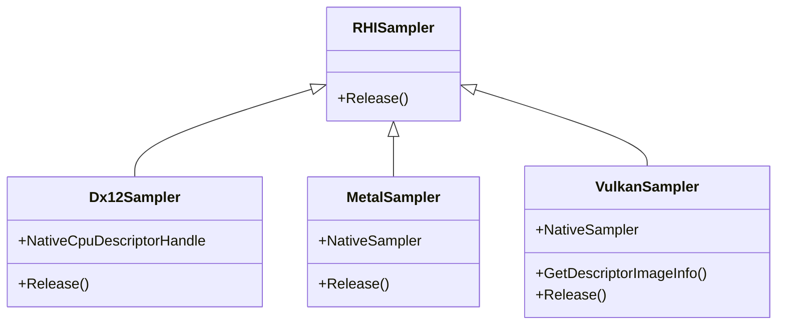
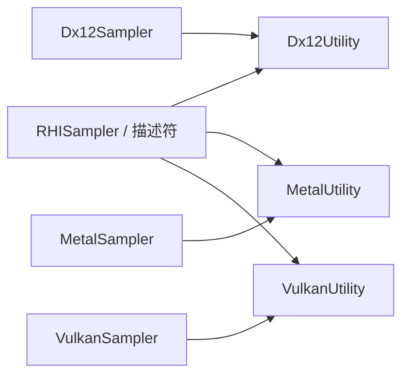

# 采样器API

<cite>
**本文引用的文件**
- [RHISampler.cs](file://src/SharpGPU/Abstract/RHISampler.cs)
- [RHIUtility.cs](file://src/SharpGPU/Abstract/RHIUtility.cs)
- [Dx12Sampler.cs](file://src/SharpGPU/Dx12/Dx12Sampler.cs)
- [Dx12Utility.cs](file://src/SharpGPU/Dx12/Dx12Utility.cs)
- [MetalSampler.cs](file://src/SharpGPU/Metal/MetalSampler.cs)
- [MetalUtility.cs](file://src/SharpGPU/Metal/MetalUtility.cs)
- [VulkanSampler.cs](file://src/SharpGPU/Vulkan/VulkanSampler.cs)
- [VulkanUtility.cs](file://src/SharpGPU/Vulkan/VulkanUtility.cs)
</cite>

## 目录
1. [简介](#简介)
2. [项目结构](#项目结构)
3. [核心组件](#核心组件)
4. [架构总览](#架构总览)
5. [详细组件分析](#详细组件分析)
6. [依赖关系分析](#依赖关系分析)
7. [性能考量](#性能考量)
8. [故障排查指南](#故障排查指南)
9. [结论](#结论)
10. [附录：使用示例与最佳实践](#附录：使用示例与最佳实践)

## 简介
本文件为 SharpGPU 的采样器 API 文档，聚焦 RHISampler 抽象及其在各后端（Direct3D 12、Metal、Vulkan）的实现。内容涵盖：
- RHISamplerDescriptor 配置项说明（过滤模式、寻址模式、比较模式、各 LOD 控制、各向异性等）
- 纹理采样模式（点采样、线性采样）、过滤模式（最近邻、双线性、三线性）与寻址模式（重复、镜像、边界）
- 静态采样器描述符（RHIStaticSamplerElement / RHIStaticSamplerDescriptor）的作用与用法
- 采样器状态对象的创建与管理生命周期
- 高级特性支持情况：采样器反馈、可变率着色（VRS）在采样器层面的关联与限制

## 项目结构
采样器相关代码采用“抽象接口 + 多后端实现”的分层组织：
- 抽象层：定义跨后端的统一数据结构与基类
- 后端层：针对 D3D12、Metal、Vulkan 的具体实现与转换工具

图表来源
- [RHISampler.cs:6-36](file://src/SharpGPU/Abstract/RHISampler.cs#L6-L36)
- [Dx12Sampler.cs:1-61](file://src/SharpGPU/Dx12/Dx12Sampler.cs#L1-L61)
- [MetalSampler.cs:1-46](file://src/SharpGPU/Metal/MetalSampler.cs#L1-L46)
- [VulkanSampler.cs:1-60](file://src/SharpGPU/Vulkan/VulkanSampler.cs#L1-L60)

章节来源
- [RHISampler.cs:6-36](file://src/SharpGPU/Abstract/RHISampler.cs#L6-L36)

## 核心组件
- RHISamplerDescriptor：采样器描述符，包含 LOD 范围、LOD 偏移、各向异性、最小/最大/多级滤波模式、U/V/W 寻址模式、比较模式等。
- RHIStaticSamplerElement / RHIStaticSamplerDescriptor：用于管线或根签名中声明静态采样器的元素与描述符集合。
- RHISampler：抽象基类，承载资源生命周期管理（继承自 Disposal）。

章节来源
- [RHISampler.cs:6-36](file://src/SharpGPU/Abstract/RHISampler.cs#L6-L36)

## 架构总览
下图展示了从应用层到具体后端的采样器创建流程，以及配置项如何被转换为后端原生对象。

图表来源
- [Dx12Sampler.cs:28-48](file://src/SharpGPU/Dx12/Dx12Sampler.cs#L28-L48)
- [MetalSampler.cs:14-34](file://src/SharpGPU/Metal/MetalSampler.cs#L14-L34)
- [VulkanSampler.cs:13-41](file://src/SharpGPU/Vulkan/VulkanSampler.cs#L13-L41)
- [Dx12Utility.cs:621-680](file://src/SharpGPU/Dx12/Dx12Utility.cs#L621-L680)
- [MetalUtility.cs:509-530](file://src/SharpGPU/Metal/MetalUtility.cs#L509-L530)
- [VulkanUtility.cs:123-286](file://src/SharpGPU/Vulkan/VulkanUtility.cs#L123-L286)

## 详细组件分析

### 抽象层：RHISampler 与描述符
- RHISamplerDescriptor 字段含义
  - LodMin/LodMax：LOD 下限与上限
  - MipLODBias：多级贴图 LOD 偏移
  - Anisotropy：各向异性过滤强度
  - MinFilter/MagFilter/MipFilter：最小/最大/多级滤波模式
  - AddressModeU/V/W：U/V/W 轴寻址模式
  - ComparisonMode：比较模式（用于深度比较采样）
- RHIStaticSamplerElement：绑定槽位 + 采样器描述符
- RHIStaticSamplerDescriptor：索引 + 元素数组（用于静态采样器表）

章节来源
- [RHISampler.cs:6-31](file://src/SharpGPU/Abstract/RHISampler.cs#L6-L31)

### 枚举与语义：过滤、寻址与比较
- ERHIFilterMode：Point（点采样/最近邻）、Linear（线性/双线性）、Anisotropic（各向异性）
- ERHIAddressMode：Repeat（重复）、ClampToEdge（边界/边缘钳制）、MirrorRepeat（镜像重复）
- ERHIComparisonMode：Never/Less/Equal/LessEqual/Greater/NotEqual/GreaterEqual/Always

这些枚举是跨后端统一的配置语义，由各后端 Utility 映射到原生 API。

章节来源
- [RHIUtility.cs:365-379](file://src/SharpGPU/Abstract/RHIUtility.cs#L365-L379)
- [RHIUtility.cs:495-506](file://src/SharpGPU/Abstract/RHIUtility.cs#L495-L506)

### D3D12 后端：Dx12Sampler
- 将 RHISamplerDescriptor 转换为 D3D12 SamplerDescription
- 通过设备分配并创建采样器描述符对（CPU 可见与 GPU 可见），最终调用 CreateSampler
- 释放时归还描述符对

图表来源
- [Dx12Sampler.cs:28-48](file://src/SharpGPU/Dx12/Dx12Sampler.cs#L28-L48)
- [Dx12Utility.cs:621-680](file://src/SharpGPU/Dx12/Dx12Utility.cs#L621-L680)

章节来源
- [Dx12Sampler.cs:28-57](file://src/SharpGPU/Dx12/Dx12Sampler.cs#L28-L57)
- [Dx12Utility.cs:621-680](file://src/SharpGPU/Dx12/Dx12Utility.cs#L621-L680)

### Metal 后端：MetalSampler
- 将描述符映射为 MTLSamplerDescriptor 并创建 MTLSamplerState
- 注意：Anisotropy 至少为 1；LOD 使用 Clamp；比较函数映射至 CompareFunction

章节来源
- [MetalSampler.cs:14-34](file://src/SharpGPU/Metal/MetalSampler.cs#L14-L34)
- [MetalUtility.cs:509-530](file://src/SharpGPU/Metal/MetalUtility.cs#L509-L530)

### Vulkan 后端：VulkanSampler
- 构建 VkSamplerCreateInfo，设置 min/mag/mipmap 模式、地址模式、LOD、各向异性、比较操作、边框颜色等
- 通过 vkCreateSampler 创建 VkSampler，并提供 GetDescriptorImageInfo 以配合描述集使用
- 释放时调用 vkDestroySampler

章节来源
- [VulkanSampler.cs:13-55](file://src/SharpGPU/Vulkan/VulkanSampler.cs#L13-L55)
- [VulkanUtility.cs:123-286](file://src/SharpGPU/Vulkan/VulkanUtility.cs#L123-L286)

### 过滤模式与采样模式详解
- 点采样（最近邻）：ERHIFilterMode.Point，适用于像素化风格或性能敏感场景
- 线性采样（双线性）：ERHIFilterMode.Linear，常用默认选项
- 三线性：由 MinFilter/MagFilter/MipFilter 组合决定，当三者均为 Linear 时等效三线性
- 各向异性：ERHIFIFilterMode.Anisotropic，提升倾斜表面质量；需结合 Anisotropy 值

图表来源
- [Dx12Utility.cs:621-637](file://src/SharpGPU/Dx12/Dx12Utility.cs#L621-L637)
- [RHIUtility.cs:373-379](file://src/SharpGPU/Abstract/RHIUtility.cs#L373-L379)

章节来源
- [Dx12Utility.cs:621-637](file://src/SharpGPU/Dx12/Dx12Utility.cs#L621-L637)
- [RHIUtility.cs:373-379](file://src/SharpGPU/Abstract/RHIUtility.cs#L373-L379)

### 寻址模式详解
- Repeat（重复）：坐标超出 [0,1] 时循环
- ClampToEdge（边界/边缘钳制）：超出部分取边界值
- MirrorRepeat（镜像重复）：超出部分镜像翻转

图表来源
- [RHIUtility.cs:365-371](file://src/SharpGPU/Abstract/RHIUtility.cs#L365-L371)
- [Dx12Utility.cs:639-650](file://src/SharpGPU/Dx12/Dx12Utility.cs#L639-L650)

章节来源
- [RHIUtility.cs:365-371](file://src/SharpGPU/Abstract/RHIUtility.cs#L365-L371)
- [Dx12Utility.cs:639-650](file://src/SharpGPU/Dx12/Dx12Utility.cs#L639-L650)

### 比较模式（深度比较采样）
- 比较模式用于深度缓冲区的采样比较，常见于阴影贴图
- 支持 Never/Less/Equal/LessEqual/Greater/NotEqual/GreaterEqual/Always
- 各后端分别映射到对应比较函数/操作

章节来源
- [RHIUtility.cs:495-506](file://src/SharpGPU/Abstract/RHIUtility.cs#L495-L506)
- [Dx12Utility.cs:653-680](file://src/SharpGPU/Dx12/Dx12Utility.cs#L653-L680)
- [MetalUtility.cs:509-530](file://src/SharpGPU/Metal/MetalUtility.cs#L509-L530)
- [VulkanSampler.cs:27-30](file://src/SharpGPU/Vulkan/VulkanSampler.cs#L27-L30)

### 静态采样器（RHIStaticSamplerElement / RHIStaticSamplerDescriptor）
- 用途：在管线或根签名阶段固定绑定采样器，避免运行时频繁切换
- 结构：每个元素包含 BindSlot 与 RHISamplerDescriptor；描述符包含 Index 与 Elements 数组
- 典型场景：UI 材质、HUD、全屏后处理等固定采样策略

章节来源
- [RHISampler.cs:21-31](file://src/SharpGPU/Abstract/RHISampler.cs#L21-L31)

### 采样器状态对象的生命周期
- 创建：传入 RHISamplerDescriptor，后端 Utility 完成枚举与参数映射，创建原生对象
- 使用：作为着色器资源绑定到采样单元
- 释放：遵循 Disposal 模式，释放原生资源与描述符内存

图表来源
- [RHISampler.cs:33-36](file://src/SharpGPU/Abstract/RHISampler.cs#L33-L36)
- [Dx12Sampler.cs:4-57](file://src/SharpGPU/Dx12/Dx12Sampler.cs#L4-L57)
- [MetalSampler.cs:7-43](file://src/SharpGPU/Metal/MetalSampler.cs#L7-L43)
- [VulkanSampler.cs:5-55](file://src/SharpGPU/Vulkan/VulkanSampler.cs#L5-L55)

## 依赖关系分析
- 抽象层依赖：无外部后端依赖，仅定义数据结构和基类
- 后端层依赖：
  - D3D12：依赖 Dx12Utility 进行枚举与参数转换
  - Metal：依赖 MetalUtility 进行枚举与参数转换
  - Vulkan：依赖 VulkanUtility 进行枚举与参数转换

图表来源
- [Dx12Sampler.cs:28-48](file://src/SharpGPU/Dx12/Dx12Sampler.cs#L28-L48)
- [MetalSampler.cs:14-34](file://src/SharpGPU/Metal/MetalSampler.cs#L14-L34)
- [VulkanSampler.cs:13-41](file://src/SharpGPU/Vulkan/VulkanSampler.cs#L13-L41)

章节来源
- [Dx12Sampler.cs:28-48](file://src/SharpGPU/Dx12/Dx12Sampler.cs#L28-L48)
- [MetalSampler.cs:14-34](file://src/SharpGPU/Metal/MetalSampler.cs#L14-L34)
- [VulkanSampler.cs:13-41](file://src/SharpGPU/Vulkan/VulkanSampler.cs#L13-L41)

## 性能考量
- 滤波模式选择
  - 点采样性能最高但锯齿明显；线性/各向异性更平滑但开销更大
  - 各向异性在高倾斜角度下改善显著，但应谨慎设置 Anisotropy 值
- LOD 控制
  - 合理设置 LodMin/LodMax 与 MipLODBias 可减少不必要的精细级采样
- 寻址模式
  - ClampToEdge 通常最安全；Repeat/MirrorRepeat 需注意纹理边界伪影
- 描述符与资源管理
  - D3D12 使用描述符对（Staging/ShaderVisible）减少 CPU-GPU 同步开销
  - 静态采样器可降低运行时切换成本

## 故障排查指南
- 创建失败
  - D3D12：检查 HRESULT 与设备状态，确认描述符堆容量与对齐
  - Metal：检查 MTLSamplerState 指针是否为空
  - Vulkan：检查 vkCreateSampler 返回值与错误码
- 显示异常
  - 寻址模式不当导致纹理拉伸或黑边
  - 比较模式误用导致深度采样结果不正确
- 性能问题
  - 过高的各向异性或错误的 LOD 范围导致带宽压力
  - 频繁创建/销毁采样器造成 CPU 瓶颈

章节来源
- [Dx12Sampler.cs:50-57](file://src/SharpGPU/Dx12/Dx12Sampler.cs#L50-L57)
- [MetalSampler.cs:30-43](file://src/SharpGPU/Metal/MetalSampler.cs#L30-L43)
- [VulkanSampler.cs:52-55](file://src/SharpGPU/Vulkan/VulkanSampler.cs#L52-L55)

## 结论
SharpGPU 的采样器 API 通过统一的抽象与后端适配，提供了跨平台的纹理采样能力。开发者可通过 RHISamplerDescriptor 灵活配置滤波、寻址与比较模式，并在不同后端获得一致的行为。对于高性能场景，建议结合 LOD 控制、合适的滤波与寻址模式，以及静态采样器来优化性能。

## 附录：使用示例与最佳实践
- 基础线性采样（通用）
  - 设置 MinFilter/MagFilter = Linear，MipFilter = Linear，AddressModeU/V/W = Repeat 或 ClampToEdge
  - 适用：大多数纹理渲染
- 点采样（像素风）
  - 设置 MinFilter/MagFilter/MipFilter = Point
  - 适用：像素艺术、体素渲染
- 各向异性增强
  - 设置 MinFilter/MagFilter/MipFilter = Anisotropic，Anisotropy 根据需求调整
  - 适用：地面、墙面等大倾斜面
- 深度比较采样（阴影贴图）
  - 设置 ComparisonMode 为 Less/LessEqual 等，结合深度纹理
  - 适用：阴影投射/接收
- 静态采样器
  - 使用 RHIStaticSamplerDescriptor 在管线阶段固定采样器
  - 适用：UI、HUD、全屏特效等固定采样策略

章节来源
- [RHISampler.cs:6-31](file://src/SharpGPU/Abstract/RHISampler.cs#L6-L31)
- [Dx12Sampler.cs:28-48](file://src/SharpGPU/Dx12/Dx12Sampler.cs#L28-L48)
- [MetalSampler.cs:14-34](file://src/SharpGPU/Metal/MetalSampler.cs#L14-L34)
- [VulkanSampler.cs:13-41](file://src/SharpGPU/Vulkan/VulkanSampler.cs#L13-L41)

## 高级特性支持情况

### 采样器反馈（Sampler Feedback）
- 当前采样器 API 未直接暴露采样器反馈专用字段或开关
- 若需启用采样器反馈，通常需要在管线/命令层面额外配置（例如 D3D12 的反馈相关描述符与状态），不在 RHISamplerDescriptor 范围内
- 建议在管线构建阶段结合后端特定能力启用，而非通过采样器描述符

章节来源
- [RHISampler.cs:6-31](file://src/SharpGPU/Abstract/RHISampler.cs#L6-L31)

### 可变率着色（Variable Rate Shading, VRS）
- 采样器本身不直接控制 VRS；VRS 通常由管线/光栅化状态或专门的着色率附件控制
- 在 D3D12 中，VRS 通过 ShadingRate 与 ShadingRateCombiner 等配置；在 Vulkan/Metal 也有各自机制
- 因此，VRS 不属于采样器描述符范畴，但与纹理采样共同影响最终渲染效率

章节来源
- [Dx12Utility.cs:697-749](file://src/SharpGPU/Dx12/Dx12Utility.cs#L697-L749)