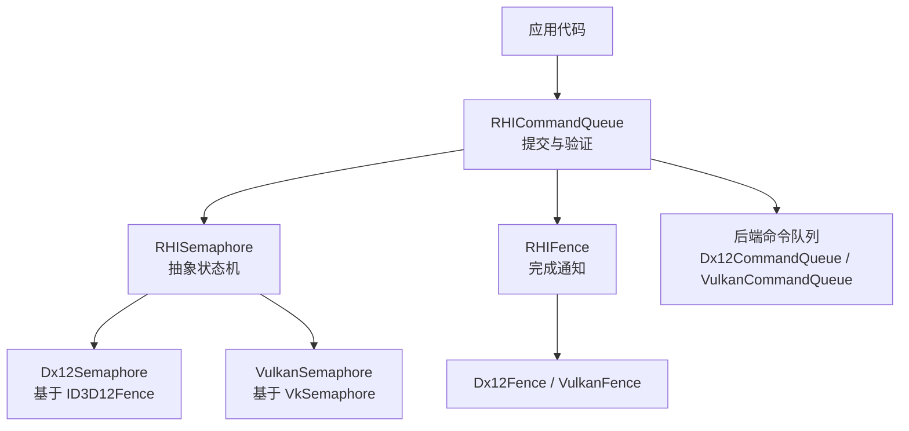
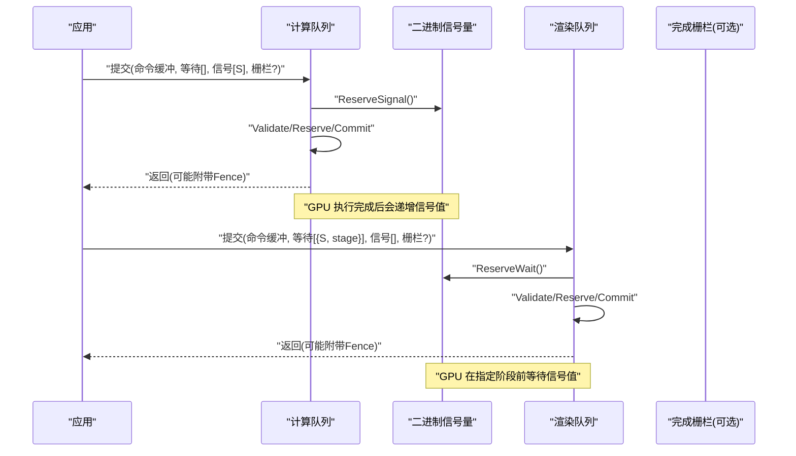
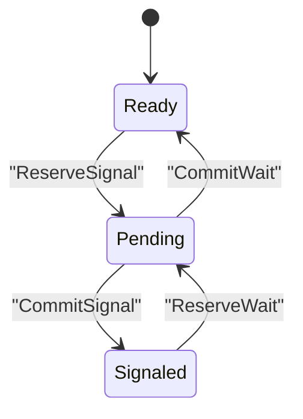
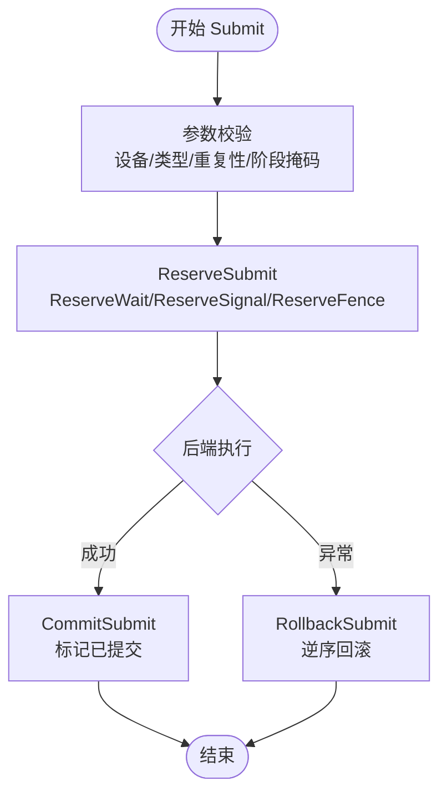
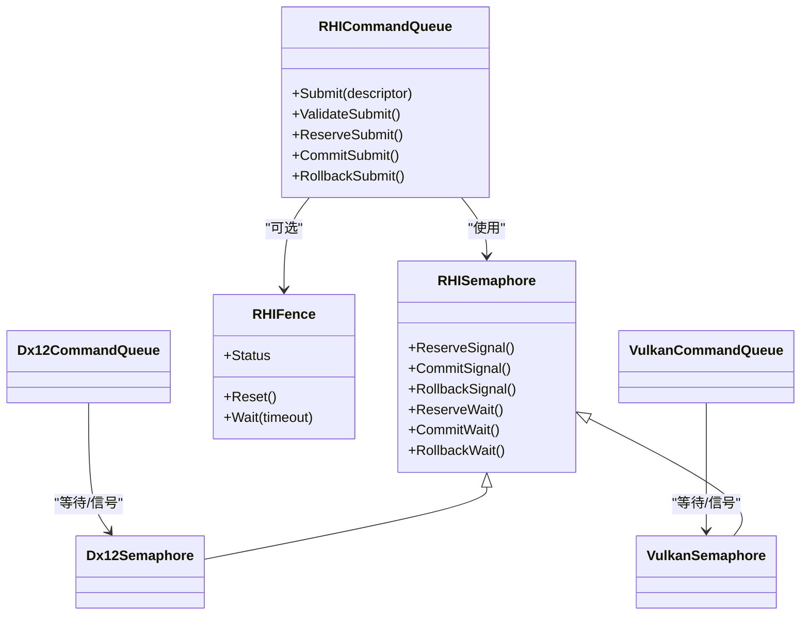

# 信号量通信

<cite>
**本文引用的文件**
- [RHISynchronous.cs](file://src/SharpGPU/Abstract/RHISynchronous.cs)
- [RHICommandQueue.cs](file://src/SharpGPU/Abstract/RHICommandQueue.cs)
- [Dx12Synchronous.cs](file://src/SharpGPU/Dx12/Dx12Synchronous.cs)
- [VulkanSynchronous.cs](file://src/SharpGPU/Vulkan/VulkanSynchronous.cs)
- [Dx12CommandQueue.cs](file://src/SharpGPU/Dx12/Dx12CommandQueue.cs)
- [VulkanCommandQueue.cs](file://src/SharpGPU/Vulkan/VulkanCommandQueue.cs)
- [RHIDevice.cs](file://src/SharpGPU/Abstract/RHIDevice.cs)
- [RHISwapChain.cs](file://src/SharpGPU/Abstract/RHISwapChain.cs)
</cite>

## 目录
1. [简介](#简介)
2. [项目结构](#项目结构)
3. [核心组件](#核心组件)
4. [架构总览](#架构总览)
5. [详细组件分析](#详细组件分析)
6. [依赖关系分析](#依赖关系分析)
7. [性能考量](#性能考量)
8. [故障排查指南](#故障排查指南)
9. [结论](#结论)
10. [附录](#附录)

## 简介
本文件系统性阐述 SharpGPU 中的二进制信号量通信机制，覆盖设计原理、状态与生命周期管理、跨队列同步模式、与栅栏的区别、多设备/多队列使用范式、性能特点与限制、不同后端（DirectX 12、Vulkan）的实现细节，以及最佳实践与常见问题解决方案。文档面向希望在不深入底层 API 的前提下正确使用信号量的开发者。

## 项目结构
SharpGPU 将同步原语抽象为 RHI 层接口，并在各后端提供具体实现：
- 抽象层：定义 RHISemaphore、RHIFence、提交描述符、队列提交流程等通用语义
- 后端实现：DX12 使用 ID3D12Fence 模拟二进制信号量；Vulkan 使用 VkSemaphore
- 命令队列：封装等待/信号序列、资源校验、提交原子性与回滚

图表来源
- [RHICommandQueue.cs:118-310](file://src/SharpGPU/Abstract/RHICommandQueue.cs#L118-L310)
- [RHISynchronous.cs:178-280](file://src/SharpGPU/Abstract/RHISynchronous.cs#L178-L280)
- [Dx12Synchronous.cs:151-196](file://src/SharpGPU/Dx12/Dx12Synchronous.cs#L151-L196)
- [VulkanSynchronous.cs:126-152](file://src/SharpGPU/Vulkan/VulkanSynchronous.cs#L126-L152)
- [Dx12CommandQueue.cs:58-154](file://src/SharpGPU/Dx12/Dx12CommandQueue.cs#L58-L154)
- [VulkanCommandQueue.cs:63-158](file://src/SharpGPU/Vulkan/VulkanCommandQueue.cs#L63-L158)

章节来源
- [RHICommandQueue.cs:1-519](file://src/SharpGPU/Abstract/RHICommandQueue.cs#L1-L519)
- [RHISynchronous.cs:1-671](file://src/SharpGPU/Abstract/RHISynchronous.cs#L1-L671)

## 核心组件
- RHISemaphore：二进制信号量的抽象基类，维护 Ready/Pending/Signaled/Resetting 状态机，提供 ReserveSignal/CommitSignal/RollbackSignal、ReserveWait/CommitWait/RollbackWait 等方法，确保“先提交后消费”的严格顺序。
- RHIFence：用于 CPU 侧等待 GPU 完成的同步对象，支持超时等待与重置。
- RHIQueueSubmitDescriptor：一次队列提交的容器，包含命令缓冲、等待信号量列表、信号信号量列表、完成栅栏。
- RHICommandQueue：负责提交前的参数校验、信号量/栅栏的状态预留与提交、异常时的回滚，以及后端特定的执行路径。

章节来源
- [RHISynchronous.cs:178-280](file://src/SharpGPU/Abstract/RHISynchronous.cs#L178-L280)
- [RHISynchronous.cs:14-176](file://src/SharpGPU/Abstract/RHISynchronous.cs#L14-L176)
- [RHICommandQueue.cs:25-58](file://src/SharpGPU/Abstract/RHICommandQueue.cs#L25-L58)
- [RHICommandQueue.cs:118-310](file://src/SharpGPU/Abstract/RHICommandQueue.cs#L118-L310)

## 架构总览
下图展示了一次典型的多队列同步流程：计算队列发出工作并信号一个信号量，渲染队列等待该信号量后再开始绘制。

图表来源
- [RHICommandQueue.cs:118-310](file://src/SharpGPU/Abstract/RHICommandQueue.cs#L118-L310)
- [Dx12CommandQueue.cs:58-154](file://src/SharpGPU/Dx12/Dx12CommandQueue.cs#L58-L154)
- [VulkanCommandQueue.cs:63-158](file://src/SharpGPU/Vulkan/VulkanCommandQueue.cs#L63-L158)
- [RHISynchronous.cs:178-280](file://src/SharpGPU/Abstract/RHISynchronous.cs#L178-L280)

## 详细组件分析

### 二进制信号量状态机与生命周期
- 初始状态：Ready
- 信号路径：ReserveSignal → Pending → CommitSignal → Signaled
- 等待路径：ReserveWait → Pending → CommitWait → Ready
- 关键约束：
  - 同一信号量不可重复提交相同操作（避免重复信号/等待）
  - 等待必须在已有信号之后进行（或已处于 Signaled）
  - 提交失败需回滚到先前状态，保证一致性

图表来源
- [RHISynchronous.cs:178-280](file://src/SharpGPU/Abstract/RHISynchronous.cs#L178-L280)

章节来源
- [RHISynchronous.cs:178-280](file://src/SharpGPU/Abstract/RHISynchronous.cs#L178-L280)

### 队列提交与信号量集成
- 提交描述符包含命令缓冲、等待信号量数组（含阶段掩码）、信号信号量数组、完成栅栏
- 提交前校验：
  - 所有信号量必须属于同一设备且未释放
  - 等待/信号列表内不得重复
  - 同一信号量不能同时出现在等待和信号列表中
  - 等待阶段掩码必须非空且合法
- 提交流程：
  - ReserveSubmit：对每个等待/信号调用 Reserve*，对栅栏调用 ReserveSignal
  - 后端执行：DX12 通过 Wait/Signal 操作 ID3D12Fence；Vulkan 通过 vkQueueSubmit 传入 VkSemaphore
  - CommitSubmit：标记命令缓冲已提交，并将信号量/栅栏置为已提交状态
  - RollbackSubmit：异常时按逆序回滚

图表来源
- [RHICommandQueue.cs:118-310](file://src/SharpGPU/Abstract/RHICommandQueue.cs#L118-L310)
- [Dx12CommandQueue.cs:58-154](file://src/SharpGPU/Dx12/Dx12CommandQueue.cs#L58-L154)
- [VulkanCommandQueue.cs:63-158](file://src/SharpGPU/Vulkan/VulkanCommandQueue.cs#L63-L158)

章节来源
- [RHICommandQueue.cs:118-310](file://src/SharpGPU/Abstract/RHICommandQueue.cs#L118-L310)
- [Dx12CommandQueue.cs:58-154](file://src/SharpGPU/Dx12/Dx12CommandQueue.cs#L58-L154)
- [VulkanCommandQueue.cs:63-158](file://src/SharpGPU/Vulkan/VulkanCommandQueue.cs#L63-L158)

### 后端实现细节

#### DirectX 12
- 二进制信号量：使用 ID3D12Fence 作为信号量载体，内部维护自增的信号值与最后信号值
- 等待：在提交前调用 CommandQueue.Wait(fence, value)，确保在指定阶段之前完成
- 信号：提交后调用 CommandQueue.Signal(fence, value)
- 注意：等待信号量必须有有效的上次信号值，否则抛出异常

章节来源
- [Dx12Synchronous.cs:151-196](file://src/SharpGPU/Dx12/Dx12Synchronous.cs#L151-L196)
- [Dx12CommandQueue.cs:58-154](file://src/SharpGPU/Dx12/Dx12CommandQueue.cs#L58-L154)

#### Vulkan
- 二进制信号量：直接使用 VkSemaphore
- 等待：vkQueueSubmit 中传入 pWaitSemaphores 与 pWaitDstStageMask，将等待绑定到具体阶段
- 信号：vkQueueSubmit 中传入 pSignalSemaphores
- 注意：阶段掩码由抽象层 ERHIStageMask 转换为 VkPipelineStageFlags

章节来源
- [VulkanSynchronous.cs:126-152](file://src/SharpGPU/Vulkan/VulkanSynchronous.cs#L126-L152)
- [VulkanCommandQueue.cs:63-158](file://src/SharpGPU/Vulkan/VulkanCommandQueue.cs#L63-L158)

### 与栅栏（Fence）的区别与适用场景
- 信号量（Semaphore）：
  - 用于 GPU 间或队列间的同步，不暴露给 CPU 轮询（CPU 仅通过提交/等待间接感知）
  - 适合跨队列流水线、帧间依赖、呈现前后同步
- 栅栏（Fence）：
  - 用于 CPU 等待 GPU 完成某项工作，支持超时查询
  - 适合 CPU 驱动的控制流、资源回收、调试与统计
- 选择建议：
  - 队列间数据依赖用信号量
  - CPU 需要知道 GPU 何时完成用栅栏
  - 两者可组合：队列提交携带信号量用于下游队列，同时携带栅栏用于 CPU 侧确认

章节来源
- [RHISynchronous.cs:14-176](file://src/SharpGPU/Abstract/RHISynchronous.cs#L14-L176)
- [RHISynchronous.cs:178-280](file://src/SharpGPU/Abstract/RHISynchronous.cs#L178-L280)

### 多设备、多队列使用模式
- 单设备多队列：
  - 计算队列生成数据并信号信号量
  - 渲染队列等待该信号量后再消费数据
  - 可使用完成栅栏让 CPU 在适当时机复用资源
- 多设备：
  - 信号量必须与命令队列所属设备一致，跨设备需显式共享（如 DX12 共享句柄或 Vulkan 外部内存），当前抽象层要求同设备
- 交换链集成：
  - 交换链可配置 SignalSemaphore，用于呈现前同步

章节来源
- [RHICommandQueue.cs:493-509](file://src/SharpGPU/Abstract/RHICommandQueue.cs#L493-L509)
- [RHISwapChain.cs:51-60](file://src/SharpGPU/Abstract/RHISwapChain.cs#L51-L60)
- [RHIDevice.cs:530-530](file://src/SharpGPU/Abstract/RHIDevice.cs#L530-L530)

### 代码示例（步骤级说明）
以下为在不同队列之间进行同步通信的步骤指引（不直接粘贴源码，参考对应路径）：
- 创建信号量：
  - 通过设备创建信号量对象，确保后续在同一设备上使用
  - 参考：[RHIDevice.cs:530-530](file://src/SharpGPU/Abstract/RHIDevice.cs#L530-L530)
- 计算队列提交：
  - 准备命令缓冲与信号列表，调用队列提交
  - 参考：[RHICommandQueue.cs:25-58](file://src/SharpGPU/Abstract/RHICommandQueue.cs#L25-L58)、[Dx12CommandQueue.cs:58-154](file://src/SharpGPU/Dx12/Dx12CommandQueue.cs#L58-L154)、[VulkanCommandQueue.cs:63-158](file://src/SharpGPU/Vulkan/VulkanCommandQueue.cs#L63-L158)
- 渲染队列提交：
  - 构造等待列表，包含信号量与阶段掩码，再提交
  - 参考：[RHICommandQueue.cs:6-23](file://src/SharpGPU/Abstract/RHICommandQueue.cs#L6-L23)、[VulkanCommandQueue.cs:102-110](file://src/SharpGPU/Vulkan/VulkanCommandQueue.cs#L102-L110)
- CPU 侧完成检测（可选）：
  - 使用栅栏进行超时等待
  - 参考：[RHISynchronous.cs:14-176](file://src/SharpGPU/Abstract/RHISynchronous.cs#L14-L176)

## 依赖关系分析
- 抽象层依赖：
  - RHISemaphore 被 RHICommandQueue 在提交流程中使用
  - RHIFence 用于 CPU 侧完成通知
- 后端依赖：
  - Dx12Semaphore 基于 ID3D12Fence
  - VulkanSemaphore 基于 VkSemaphore
- 队列实现依赖：
  - Dx12CommandQueue 与 VulkanCommandQueue 分别处理各自后端的等待/信号序列

图表来源
- [RHICommandQueue.cs:118-310](file://src/SharpGPU/Abstract/RHICommandQueue.cs#L118-L310)
- [RHISynchronous.cs:178-280](file://src/SharpGPU/Abstract/RHISynchronous.cs#L178-L280)
- [Dx12Synchronous.cs:151-196](file://src/SharpGPU/Dx12/Dx12Synchronous.cs#L151-L196)
- [VulkanSynchronous.cs:126-152](file://src/SharpGPU/Vulkan/VulkanSynchronous.cs#L126-L152)
- [Dx12CommandQueue.cs:58-154](file://src/SharpGPU/Dx12/Dx12CommandQueue.cs#L58-L154)
- [VulkanCommandQueue.cs:63-158](file://src/SharpGPU/Vulkan/VulkanCommandQueue.cs#L63-L158)

章节来源
- [RHICommandQueue.cs:118-310](file://src/SharpGPU/Abstract/RHICommandQueue.cs#L118-L310)
- [RHISynchronous.cs:178-280](file://src/SharpGPU/Abstract/RHISynchronous.cs#L178-L280)

## 性能考量
- 低开销队列间同步：
  - 信号量避免了 CPU 轮询，减少 CPU-GPU 同步开销
  - 阶段掩码精确控制等待点，减少不必要的屏障
- 提交批量化：
  - 合理合并命令缓冲与同步原语，降低提交次数
- 避免频繁重置：
  - 信号量与栅栏的重置应谨慎，尽量复用对象
- 后端差异：
  - DX12 使用 Fence 模拟信号量，需注意值递增与等待值的正确性
  - Vulkan 原生支持 VkSemaphore，阶段转换需准确

章节来源
- [Dx12Synchronous.cs:151-196](file://src/SharpGPU/Dx12/Dx12Synchronous.cs#L151-L196)
- [VulkanSynchronous.cs:126-152](file://src/SharpGPU/Vulkan/VulkanSynchronous.cs#L126-L152)
- [RHICommandQueue.cs:118-310](file://src/SharpGPU/Abstract/RHICommandQueue.cs#L118-L310)

## 故障排查指南
- 常见错误与原因：
  - 等待阶段掩码为空：提交校验失败，需设置非空的 ERHIStageMask
  - 信号量重复：同一提交中重复出现同一信号量
  - 信号量混用：同一信号量既出现在等待又出现在信号列表
  - 设备不一致：信号量不属于当前命令队列的设备
  - 无有效信号值（DX12）：等待信号量未提前信号过
- 定位方法：
  - 检查提交描述符中的等待/信号列表
  - 检查信号量状态机是否处于预期状态
  - 查看后端特定异常信息（如 DX12 的无效值、Vulkan 的阶段转换）

章节来源
- [RHICommandQueue.cs:166-225](file://src/SharpGPU/Abstract/RHICommandQueue.cs#L166-L225)
- [RHICommandQueue.cs:493-509](file://src/SharpGPU/Abstract/RHICommandQueue.cs#L493-L509)
- [Dx12CommandQueue.cs:96-107](file://src/SharpGPU/Dx12/Dx12CommandQueue.cs#L96-L107)

## 结论
SharpGPU 的二进制信号量以严格的抽象状态机与提交流程为核心，结合后端的具体实现，提供了高效、安全的队列间同步能力。通过合理的阶段掩码、正确的状态管理与良好的对象复用策略，可以在多设备、多队列环境下构建高性能的图形与计算管线。

## 附录
- 最佳实践
  - 明确区分信号量与栅栏的使用场景
  - 为每次等待指定精确的阶段掩码
  - 避免在单次提交中重复使用同一信号量
  - 优先复用信号量与栅栏对象，减少分配与重置
  - 在交换链中利用 SignalSemaphore 进行呈现同步
- 参考路径
  - 信号量创建：[RHIDevice.cs:530-530](file://src/SharpGPU/Abstract/RHIDevice.cs#L530-L530)
  - 队列提交与校验：[RHICommandQueue.cs:118-310](file://src/SharpGPU/Abstract/RHICommandQueue.cs#L118-L310)
  - 后端实现：[Dx12CommandQueue.cs:58-154](file://src/SharpGPU/Dx12/Dx12CommandQueue.cs#L58-L154)、[VulkanCommandQueue.cs:63-158](file://src/SharpGPU/Vulkan/VulkanCommandQueue.cs#L63-L158)
  - 交换链集成：[RHISwapChain.cs:51-60](file://src/SharpGPU/Abstract/RHISwapChain.cs#L51-L60)