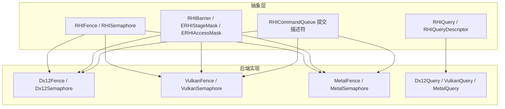
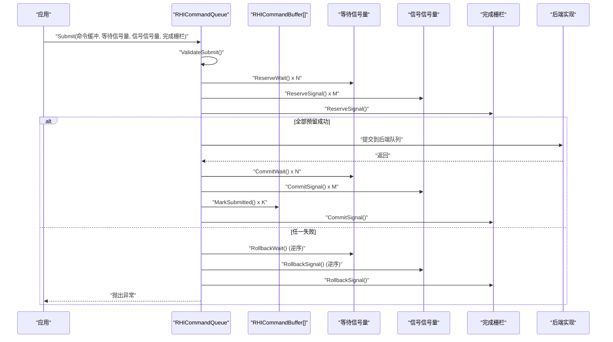
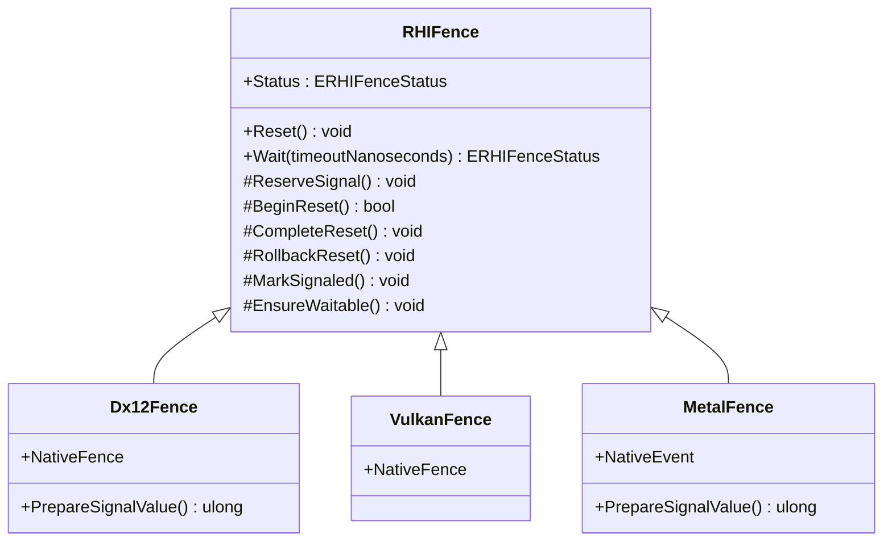
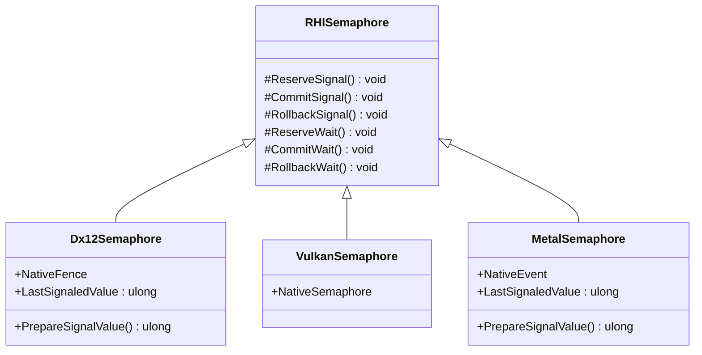
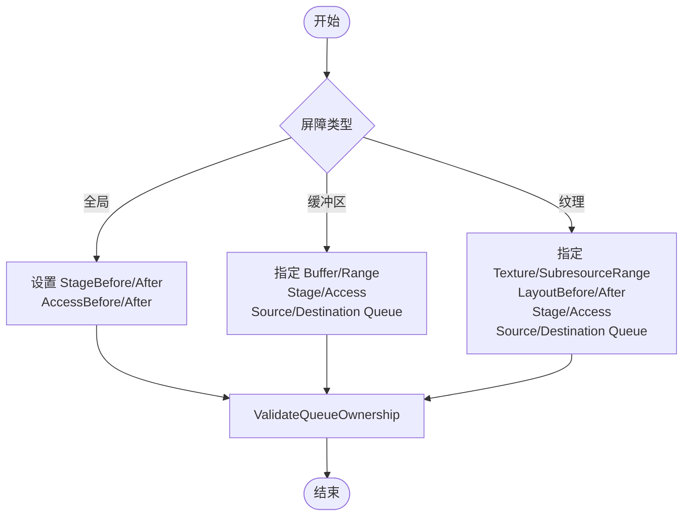
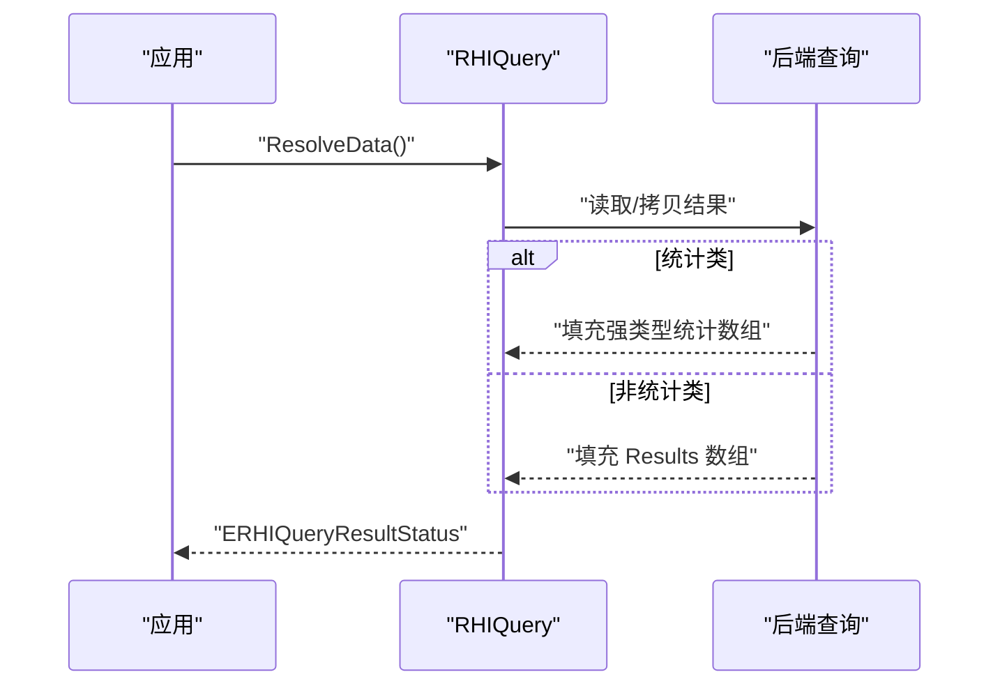
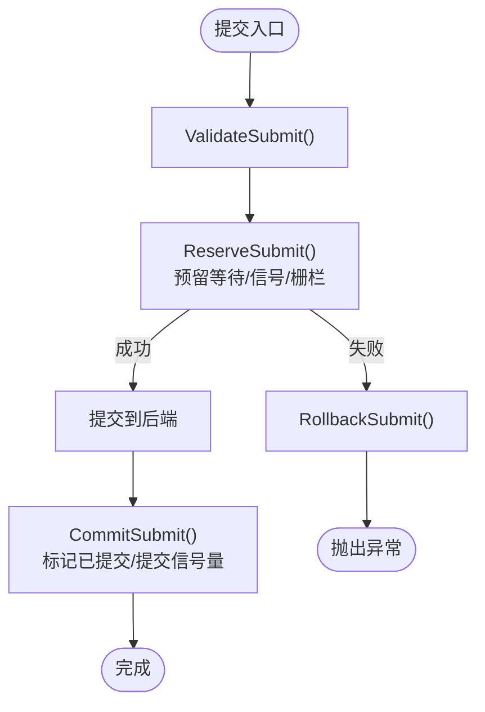
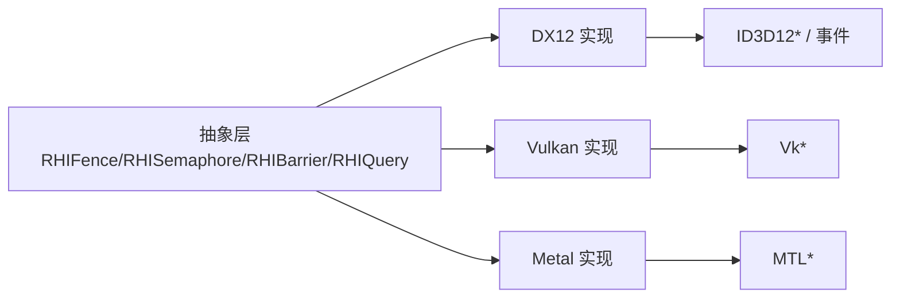

# 同步机制

<cite>
**本文引用的文件**
- [RHISynchronous.cs](file://src/SharpGPU/Abstract/RHISynchronous.cs)
- [RHIQuery.cs](file://src/SharpGPU/Abstract/RHIQuery.cs)
- [RHICommandQueue.cs](file://src/SharpGPU/Abstract/RHICommandQueue.cs)
- [Dx12Synchronous.cs](file://src/SharpGPU/Dx12/Dx12Synchronous.cs)
- [VulkanSynchronous.cs](file://src/SharpGPU/Vulkan/VulkanSynchronous.cs)
- [MetalSynchronous.cs](file://src/SharpGPU/Metal/MetalSynchronous.cs)
- [Dx12Query.cs](file://src/SharpGPU/Dx12/Dx12Query.cs)
- [VulkanQuery.cs](file://src/SharpGPU/Vulkan/VulkanQuery.cs)
- [MetalQuery.cs](file://src/SharpGPU/Metal/MetalQuery.cs)
</cite>

## 目录
1. [简介](#简介)
2. [项目结构](#项目结构)
3. [核心组件](#核心组件)
4. [架构总览](#架构总览)
5. [详细组件分析](#详细组件分析)
6. [依赖关系分析](#依赖关系分析)
7. [性能考量](#性能考量)
8. [故障排查指南](#故障排查指南)
9. [结论](#结论)
10. [附录：最佳实践与示例模式](#附录最佳实践与示例模式)

## 简介
本文件系统性梳理 SharpGPU 的同步机制，涵盖栅栏（Fence）、二进制信号量（Semaphore）、屏障（Barrier）、查询（Query）与时间戳等关键原语。文档面向不同层次的读者，既提供高层概念与使用场景，也深入到各后端（DirectX 12、Vulkan、Metal）的具体实现细节，帮助开发者正确实现 CPU-GPU 同步、资源访问同步、命令执行同步，并给出异步编程模式、性能监控、时间戳校准与优化建议。

## 项目结构
SharpGPU 将同步相关能力抽象在 Abstract 层，并通过 Dx12、Vulkan、Metal 三个后端分别实现具体平台语义。查询与计时功能同样遵循“抽象接口 + 后端实现”的分层组织方式。

**图示来源**
- [RHISynchronous.cs:14-280](file://src/SharpGPU/Abstract/RHISynchronous.cs#L14-L280)
- [RHIQuery.cs:178-446](file://src/SharpGPU/Abstract/RHIQuery.cs#L178-L446)
- [RHICommandQueue.cs:6-58](file://src/SharpGPU/Abstract/RHICommandQueue.cs#L6-L58)
- [Dx12Synchronous.cs:8-199](file://src/SharpGPU/Dx12/Dx12Synchronous.cs#L8-L199)
- [VulkanSynchronous.cs:7-155](file://src/SharpGPU/Vulkan/VulkanSynchronous.cs#L7-L155)
- [MetalSynchronous.cs:11-168](file://src/SharpGPU/Metal/MetalSynchronous.cs#L11-L168)
- [Dx12Query.cs:7-316](file://src/SharpGPU/Dx12/Dx12Query.cs#L7-L316)
- [VulkanQuery.cs:6-385](file://src/SharpGPU/Vulkan/VulkanQuery.cs#L6-L385)
- [MetalQuery.cs:10-393](file://src/SharpGPU/Metal/MetalQuery.cs#L10-L393)

**章节来源**
- [RHISynchronous.cs:14-280](file://src/SharpGPU/Abstract/RHISynchronous.cs#L14-L280)
- [RHICommandQueue.cs:60-108](file://src/SharpGPU/Abstract/RHICommandQueue.cs#L60-L108)
- [RHIQuery.cs:178-446](file://src/SharpGPU/Abstract/RHIQuery.cs#L178-L446)

## 核心组件
- 栅栏（RHIFence）：用于标记 GPU 工作完成并在 CPU 侧等待或轮询状态，支持 Reset、Wait(timeout)、状态查询。内部通过生命周期状态机保证安全使用。
- 二进制信号量（RHISemaphore）：跨队列/跨设备（由后端扩展）的轻量级同步点，支持 Reserve/Commit/Rollback 三阶段提交模型，避免重复提交与竞态。
- 屏障（RHIBarrier）：描述资源在不同阶段（Stage）与访问模式（Access）之间的转换，支持全局、缓冲区、纹理三种粒度；可表达队列所有权转移。
- 查询（RHIQuery）：覆盖遮挡、时间戳、管线统计三类；提供 ResolveData 获取结果，统计类查询暴露强类型结果访问器。
- 命令队列提交（RHICommandQueue.Submit）：统一封装命令缓冲、等待/信号信号量、完成栅栏的组合提交，内置参数校验与原子性保障。

**章节来源**
- [RHISynchronous.cs:14-280](file://src/SharpGPU/Abstract/RHISynchronous.cs#L14-L280)
- [RHISynchronous.cs:282-661](file://src/SharpGPU/Abstract/RHISynchronous.cs#L282-L661)
- [RHIQuery.cs:7-446](file://src/SharpGPU/Abstract/RHIQuery.cs#L7-L446)
- [RHICommandQueue.cs:60-108](file://src/SharpGPU/Abstract/RHICommandQueue.cs#L60-L108)

## 架构总览
下图展示从应用层到后端的同步调用链：应用通过命令队列提交一组命令缓冲，并可附带等待/信号信号量以及完成栅栏；后端根据平台特性映射为原生同步对象（如 DX12 Fence/Semaphore、Vulkan Fence/Semaphore、Metal SharedEvent）。

**图示来源**
- [RHICommandQueue.cs:118-330](file://src/SharpGPU/Abstract/RHICommandQueue.cs#L118-L330)

**章节来源**
- [RHICommandQueue.cs:118-330](file://src/SharpGPU/Abstract/RHICommandQueue.cs#L118-L330)

## 详细组件分析

### 栅栏（RHIFence）与后端实现
- 抽象层：定义状态机（Ready/Pending/Signaled/Resetting），提供 ReserveSignal、BeginReset/CompleteReset/RollbackReset、EnsureWaitable、MarkSignaled 等方法，确保线程安全与使用顺序正确。
- 后端实现：
  - DX12：基于 ID3D12Fence 与 AutoResetEvent 实现 Wait，支持超时；维护 Next/LastSignaledValue。
  - Vulkan：vkGetFenceStatus/vkWaitForFences 实现状态检查与阻塞等待。
  - Metal：基于 MTLSharedEvent 的 WaitUntilSignaledValue，支持超时。

**图示来源**
- [RHISynchronous.cs:14-176](file://src/SharpGPU/Abstract/RHISynchronous.cs#L14-L176)
- [Dx12Synchronous.cs:8-149](file://src/SharpGPU/Dx12/Dx12Synchronous.cs#L8-L149)
- [VulkanSynchronous.cs:7-122](file://src/SharpGPU/Vulkan/VulkanSynchronous.cs#L7-L122)
- [MetalSynchronous.cs:11-130](file://src/SharpGPU/Metal/MetalSynchronous.cs#L11-L130)

**章节来源**
- [RHISynchronous.cs:14-176](file://src/SharpGPU/Abstract/RHISynchronous.cs#L14-L176)
- [Dx12Synchronous.cs:8-149](file://src/SharpGPU/Dx12/Dx12Synchronous.cs#L8-L149)
- [VulkanSynchronous.cs:7-122](file://src/SharpGPU/Vulkan/VulkanSynchronous.cs#L7-L122)
- [MetalSynchronous.cs:11-130](file://src/SharpGPU/Metal/MetalSynchronous.cs#L11-L130)

### 二进制信号量（RHISemaphore）与后端实现
- 抽象层：提供 ReserveSignal/CommitSignal/RollbackSignal 与 ReserveWait/CommitWait/RollbackWait 三阶段提交模型，防止重复提交与非法状态迁移。
- 后端实现：
  - DX12：复用 ID3D12Fence 作为二进制信号量，维护 LastSignaledValue。
  - Vulkan：VkSemaphore 创建与销毁。
  - Metal：MTLSharedEvent 作为二进制信号量。

**图示来源**
- [RHISynchronous.cs:178-280](file://src/SharpGPU/Abstract/RHISynchronous.cs#L178-L280)
- [Dx12Synchronous.cs:151-199](file://src/SharpGPU/Dx12/Dx12Synchronous.cs#L151-L199)
- [VulkanSynchronous.cs:126-155](file://src/SharpGPU/Vulkan/VulkanSynchronous.cs#L126-L155)
- [MetalSynchronous.cs:132-168](file://src/SharpGPU/Metal/MetalSynchronous.cs#L132-L168)

**章节来源**
- [RHISynchronous.cs:178-280](file://src/SharpGPU/Abstract/RHISynchronous.cs#L178-L280)
- [Dx12Synchronous.cs:151-199](file://src/SharpGPU/Dx12/Dx12Synchronous.cs#L151-L199)
- [VulkanSynchronous.cs:126-155](file://src/SharpGPU/Vulkan/VulkanSynchronous.cs#L126-L155)
- [MetalSynchronous.cs:132-168](file://src/SharpGPU/Metal/MetalSynchronous.cs#L132-L168)

### 屏障（Barriers）与队列所有权
- 阶段与访问掩码：ERHIStageMask 与 ERHIAccessMask 精确描述资源在哪些阶段之前/之后以何种方式被访问。
- 屏障种类：全局、缓冲区、纹理；纹理支持子资源范围与布局转换。
- 队列所有权转移：通过 SourceQueue/DestinationQueue 指定逻辑队列间的转移，工具方法 ValidateQueueOwnership 强制一致性约束。

**图示来源**
- [RHISynchronous.cs:282-661](file://src/SharpGPU/Abstract/RHISynchronous.cs#L282-L661)

**章节来源**
- [RHISynchronous.cs:282-661](file://src/SharpGPU/Abstract/RHISynchronous.cs#L282-L661)

### 查询（Query）与时间戳
- 抽象接口：RHIQuery 提供 Results、ResolveData、统计类强类型访问器（TryGetRasterStatistics/TryGetComputeStatistics/TryGetRayTracingStatistics）。
- 后端实现：
  - DX12：QueryHeap + Readback Buffer，统计类支持 PipelineStatistics/PipelineStatistics1。
  - Vulkan：QueryPool + vkGetQueryPoolResults，统计类按启用计数器打包解析。
  - Metal：CounterHeap/CounterSampleBuffer 与可见性结果缓冲，时间戳频率换算纳秒。

**图示来源**
- [RHIQuery.cs:310-446](file://src/SharpGPU/Abstract/RHIQuery.cs#L310-L446)
- [Dx12Query.cs:115-153](file://src/SharpGPU/Dx12/Dx12Query.cs#L115-L153)
- [VulkanQuery.cs:84-150](file://src/SharpGPU/Vulkan/VulkanQuery.cs#L84-L150)
- [MetalQuery.cs:175-224](file://src/SharpGPU/Metal/MetalQuery.cs#L175-L224)

**章节来源**
- [RHIQuery.cs:310-446](file://src/SharpGPU/Abstract/RHIQuery.cs#L310-L446)
- [Dx12Query.cs:115-153](file://src/SharpGPU/Dx12/Dx12Query.cs#L115-L153)
- [VulkanQuery.cs:84-150](file://src/SharpGPU/Vulkan/VulkanQuery.cs#L84-L150)
- [MetalQuery.cs:175-224](file://src/SharpGPU/Metal/MetalQuery.cs#L175-L224)

### 命令队列提交与同步组合
- 提交描述符：包含命令缓冲、等待/信号信号量、完成栅栏。
- 验证与原子性：ValidateSubmit 检查空提交、重复、设备归属、阶段掩码合法性；Reserve/Commit/Rollback 保证部分失败的清理。

**图示来源**
- [RHICommandQueue.cs:118-330](file://src/SharpGPU/Abstract/RHICommandQueue.cs#L118-L330)

**章节来源**
- [RHICommandQueue.cs:118-330](file://src/SharpGPU/Abstract/RHICommandQueue.cs#L118-L330)

## 依赖关系分析
- 抽象层对后端无直接依赖，仅定义接口与数据结构。
- 后端实现依赖各自原生 API（DX12、Vulkan、Metal），并通过工具类进行错误处理与转换。
- 命令队列提交依赖信号量/栅栏的生命周期管理，确保跨队列/跨设备同步的正确性。

**图示来源**
- [RHISynchronous.cs:14-280](file://src/SharpGPU/Abstract/RHISynchronous.cs#L14-L280)
- [Dx12Synchronous.cs:8-199](file://src/SharpGPU/Dx12/Dx12Synchronous.cs#L8-L199)
- [VulkanSynchronous.cs:7-155](file://src/SharpGPU/Vulkan/VulkanSynchronous.cs#L7-L155)
- [MetalSynchronous.cs:11-168](file://src/SharpGPU/Metal/MetalSynchronous.cs#L11-L168)

**章节来源**
- [RHISynchronous.cs:14-280](file://src/SharpGPU/Abstract/RHISynchronous.cs#L14-L280)
- [Dx12Synchronous.cs:8-199](file://src/SharpGPU/Dx12/Dx12Synchronous.cs#L8-L199)
- [VulkanSynchronous.cs:7-155](file://src/SharpGPU/Vulkan/VulkanSynchronous.cs#L7-L155)
- [MetalSynchronous.cs:11-168](file://src/SharpGPU/Metal/MetalSynchronous.cs#L11-L168)

## 性能考量
- 减少不必要的同步点：优先使用屏障做细粒度资源同步，仅在必要时使用栅栏/信号量。
- 批量提交与延迟读取：将多个命令缓冲合并提交，查询结果尽量批量 Resolve，降低系统调用开销。
- 时间戳精度与校准：Metal 提供时间戳频率换算；Vulkan/DX12 的时间戳需结合设备时钟校准信息评估偏差。
- 避免频繁 Reset：栅栏重置前确保已完成，利用状态机保护避免无效重置。
- 合理选择查询类型：统计类查询按需启用计数器，减少额外开销。

[本节为通用指导，不直接分析具体文件]

## 故障排查指南
- 提交为空：ValidateSubmit 会拒绝空提交（无命令缓冲且无同步操作）。
- 重复提交：同一命令缓冲或信号量在同一提交中重复出现将被拒绝。
- 设备归属错误：信号量/栅栏必须与队列所属设备一致。
- 阶段掩码非法：等待信号量的阶段掩码必须为已知位集合。
- 栅栏状态错误：未提交即等待、重置时仍有待决信号等将抛异常。
- 查询类型不匹配：统计类查询必须使用对应域与类型，否则 ResolveData 将报错。

**章节来源**
- [RHICommandQueue.cs:118-242](file://src/SharpGPU/Abstract/RHICommandQueue.cs#L118-L242)
- [RHISynchronous.cs:136-176](file://src/SharpGPU/Abstract/RHISynchronous.cs#L136-L176)
- [RHIQuery.cs:310-446](file://src/SharpGPU/Abstract/RHIQuery.cs#L310-L446)

## 结论
SharpGPU 通过统一的抽象层屏蔽了多后端差异，提供了健壮且高效的同步原语。借助三阶段提交模型、严格的状态机与详尽的参数校验，开发者可以安全地构建复杂的异步渲染与计算流水线。配合查询与时间戳能力，可实现精细的性能分析与调优。

[本节为总结性内容，不直接分析具体文件]

## 附录：最佳实践与示例模式

- CPU-GPU 同步
  - 使用完成栅栏标记一帧或一批命令的完成，CPU 侧 Wait(timeout) 控制帧节奏。
  - 参考路径：[Dx12Synchronous.cs:82-130](file://src/SharpGPU/Dx12/Dx12Synchronous.cs#L82-L130)、[VulkanSynchronous.cs:90-116](file://src/SharpGPU/Vulkan/VulkanSynchronous.cs#L90-L116)、[MetalSynchronous.cs:72-108](file://src/SharpGPU/Metal/MetalSynchronous.cs#L72-L108)

- 资源访问同步
  - 使用屏障描述资源在阶段与访问模式间的转换，必要时进行队列所有权转移。
  - 参考路径：[RHISynchronous.cs:282-661](file://src/SharpGPU/Abstract/RHISynchronous.cs#L282-L661)

- 命令执行同步
  - 在提交中包含等待/信号信号量，形成跨队列/跨设备的依赖图。
  - 参考路径：[RHICommandQueue.cs:118-330](file://src/SharpGPU/Abstract/RHICommandQueue.cs#L118-L330)

- 异步编程模式
  - 采用 Reserve/Commit/Rollback 模式，确保异常路径下的资源与状态一致性。
  - 参考路径：[RHICommandQueue.cs:244-330](file://src/SharpGPU/Abstract/RHICommandQueue.cs#L244-L330)

- 性能监控与时间戳
  - 使用查询记录时间戳与管线统计，ResolveData 后读取结果进行分析。
  - 参考路径：[Dx12Query.cs:115-153](file://src/SharpGPU/Dx12/Dx12Query.cs#L115-L153)、[VulkanQuery.cs:84-150](file://src/SharpGPU/Vulkan/VulkanQuery.cs#L84-L150)、[MetalQuery.cs:175-224](file://src/SharpGPU/Metal/MetalQuery.cs#L175-L224)

- 死锁避免
  - 避免循环依赖的信号量图；确保等待与信号顺序一致；谨慎使用全局屏障。
  - 参考路径：[RHISynchronous.cs:282-661](file://src/SharpGPU/Abstract/RHISynchronous.cs#L282-L661)

- 时间戳校准
  - 结合设备时钟校准信息评估时间戳偏差，跨设备比较时需归一化。
  - 参考路径：[RHIQuery.cs:21-85](file://src/SharpGPU/Abstract/RHIQuery.cs#L21-L85)