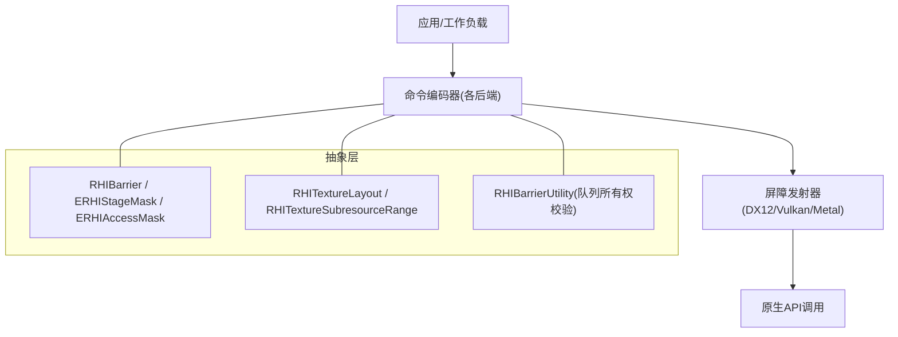
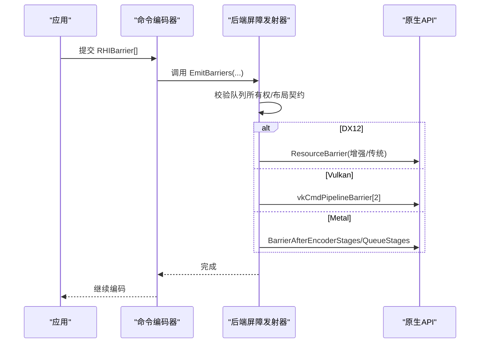
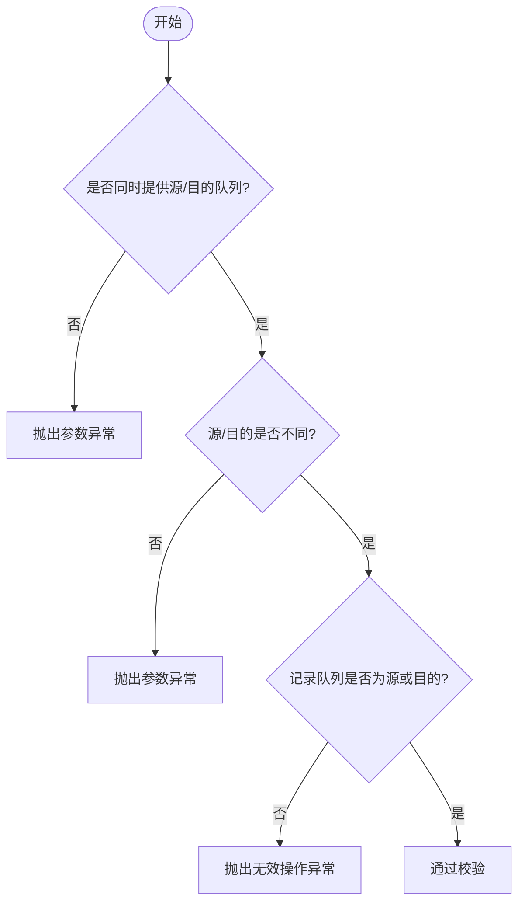
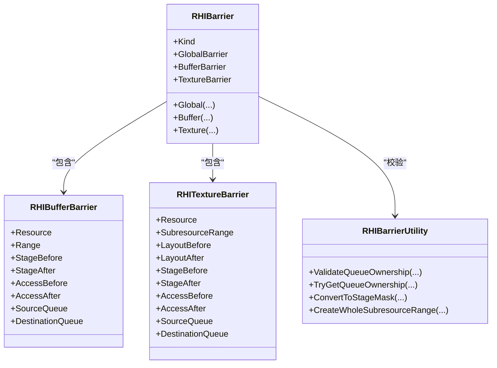

# 屏障管理

<cite>
**本文引用的文件**
- [RHISynchronous.cs](file://src/SharpGPU/Abstract/RHISynchronous.cs)
- [Dx12CommandEncoder.cs](file://src/SharpGPU/Dx12/Dx12CommandEncoder.cs)
- [VulkanCommandEncoder.cs](file://src/SharpGPU/Vulkan/VulkanCommandEncoder.cs)
- [MetalCommandEncoder.cs](file://src/SharpGPU/Metal/MetalCommandEncoder.cs)
- [BarrierModelTests.cs](file://tests/SharpGPU.Conformance.Tests/BarrierModelTests.cs)
- [ComputeWorkload.cs](file://samples/ComputeAndDraw/ComputeWorkload.cs)
- [RasterWorkload.cs](file://samples/ComputeAndDraw/RasterWorkload.cs)
</cite>

## 目录
1. [简介](#简介)
2. [项目结构](#项目结构)
3. [核心组件](#核心组件)
4. [架构总览](#架构总览)
5. [详细组件分析](#详细组件分析)
6. [依赖关系分析](#依赖关系分析)
7. [性能考虑](#性能考虑)
8. [故障排查指南](#故障排查指南)
9. [结论](#结论)
10. [附录：代码示例路径](#附录代码示例路径)

## 简介
本文件系统性梳理 SharpGPU 的屏障（Barrier）管理机制，覆盖三类屏障：全局屏障、缓冲区屏障与纹理屏障；深入解释阶段掩码（ERHIStageMask）与访问掩码（ERHIAccessMask）的概念与作用；说明纹理布局转换与子资源范围；提供具体使用示例的路径引用；阐述队列所有权转移机制与限制；总结不同后端（DirectX 12、Vulkan、Metal）对屏障的支持差异与优化策略；并给出性能优化技巧与常见陷阱规避建议。

## 项目结构
SharpGPU 在抽象层定义统一的屏障模型与枚举，在各后端实现中将其映射为原生 API 调用：
- 抽象层：统一的数据结构与工具方法，包括阶段/访问掩码、纹理布局、子资源范围、三种屏障类型及队列所有权校验等。
- 后端实现：
  - DirectX 12：增强屏障与资源状态转换，按能力选择最优路径。
  - Vulkan：支持同步2与同步1两种路径，合并内存/缓冲/图像屏障以减少调用开销。
  - Metal：区分编码器内屏障与队列级屏障，针对 ML 阶段做特殊处理。

图表来源
- [RHISynchronous.cs:284-435](file://src/SharpGPU/Abstract/RHISynchronous.cs#L284-L435)
- [Dx12CommandEncoder.cs:295-350](file://src/SharpGPU/Dx12/Dx12CommandEncoder.cs#L295-L350)
- [VulkanCommandEncoder.cs:129-207](file://src/SharpGPU/Vulkan/VulkanCommandEncoder.cs#L129-L207)
- [MetalCommandEncoder.cs:69-184](file://src/SharpGPU/Metal/MetalCommandEncoder.cs#L69-L184)

章节来源
- [RHISynchronous.cs:284-660](file://src/SharpGPU/Abstract/RHISynchronous.cs#L284-L660)
- [Dx12CommandEncoder.cs:295-350](file://src/SharpGPU/Dx12/Dx12CommandEncoder.cs#L295-L350)
- [VulkanCommandEncoder.cs:129-207](file://src/SharpGPU/Vulkan/VulkanCommandEncoder.cs#L129-L207)
- [MetalCommandEncoder.cs:69-184](file://src/SharpGPU/Metal/MetalCommandEncoder.cs#L69-L184)

## 核心组件
- 阶段掩码 ERHIStageMask：描述屏障生效的管线阶段集合，如 Transfer、Vertex、Fragment、Compute、RayTracing、AccelStructBuild/Copy、MachineLearning 等，并提供 AllGraphics、AllShading、All 等组合。
- 访问掩码 ERHIAccessMask：描述屏障前后资源的访问语义，如 ShaderRead/Write、RenderTargetRead/Write、DepthStencilRead/Write、TransferRead/Write、ResolveRead/Write、Present、AccelStructRead/Write 等。
- 纹理布局 ERHITextureLayout：描述纹理在不同阶段的内存布局，如 General、CopySource/Destination、ShaderReadOnly、RenderTarget、DepthStencilReadOnly/Write、ResolveSource/Destination、Present、ShadingRateSurface、Common 等。
- 子资源范围 RHITextureSubresourceRange：指定 mip 层级、数组层数与 aspect（Color/Depth/Stencil），支持“全部”快捷构造。
- 缓冲范围 RHIBufferRange：Offset + Size，支持“整个缓冲”快捷构造。
- 屏障类型：
  - 全局屏障 RHIGlobalBarrier：不绑定具体资源，仅声明阶段与访问的同步点。
  - 缓冲屏障 RHIBufferBarrier：针对特定缓冲及其范围进行阶段/访问同步，可选队列所有权转移。
  - 纹理屏障 RHITextureBarrier：针对纹理的子资源范围进行布局转换与阶段/访问同步，可选队列所有权转移。
- 队列所有权校验：确保源/目的逻辑队列成对出现且不同，且记录队列必须是源或目的之一。

章节来源
- [RHISynchronous.cs:284-435](file://src/SharpGPU/Abstract/RHISynchronous.cs#L284-L435)
- [RHISynchronous.cs:512-660](file://src/SharpGPU/Abstract/RHISynchronous.cs#L512-L660)

## 架构总览
屏障从上层命令编码器下发到后端专用发射器，由发射器将抽象屏障转换为原生 API 调用。DX12 优先使用增强屏障，否则回退到单资源或批量资源屏障；Vulkan 根据是否启用同步2选择不同路径，并对图像布局做一致性检查；Metal 将屏障分为编码器内与队列级两类，并对 ML 阶段做特殊处理。

图表来源
- [Dx12CommandEncoder.cs:295-350](file://src/SharpGPU/Dx12/Dx12CommandEncoder.cs#L295-L350)
- [VulkanCommandEncoder.cs:154-207](file://src/SharpGPU/Vulkan/VulkanCommandEncoder.cs#L154-L207)
- [MetalCommandEncoder.cs:88-136](file://src/SharpGPU/Metal/MetalCommandEncoder.cs#L88-L136)

## 详细组件分析

### 阶段掩码与访问掩码
- ERHIStageMask：用于指明屏障生效的管线阶段集合。例如 Compute->Fragment 的过渡，或 Transfer->VertexInput 的读取准备。
- ERHIAccessMask：用于指明屏障前后的访问语义变化，如从 ShaderWrite 转为 ShaderRead，或从 TransferWrite 转为 RenderTargetWrite。

这些掩码在后端会被映射为具体的阶段标志与访问标志（如 Vulkan 的 VkPipelineStageFlags/VkAccessFlags，DX12 的资源状态，Metal 的阶段位）。

章节来源
- [RHISynchronous.cs:284-328](file://src/SharpGPU/Abstract/RHISynchronous.cs#L284-L328)

### 纹理布局与子资源范围
- 纹理布局转换：通过 ERHITextureLayout 指定 Before/After 布局，驱动后端进行必要的内存重排或缓存刷新。
- 子资源范围：RHITextureSubresourceRange 精确控制 mip/层/aspect，避免对整图不必要的操作。
- 全量快捷构造：RHITextureSubresourceRange.Whole() 可快速表示“所有 mip/层”，并根据格式推断 aspect。

章节来源
- [RHISynchronous.cs:330-394](file://src/SharpGPU/Abstract/RHISynchronous.cs#L330-L394)
- [RHISynchronous.cs:627-654](file://src/SharpGPU/Abstract/RHISynchronous.cs#L627-L654)

### 三类屏障的使用方法与适用场景
- 全局屏障：适用于跨资源的全局同步点，如 Compute 完成后等待 Fragment 开始。
- 缓冲屏障：适用于读写缓冲的同步，如 Compute 写入后 Transfer 读取，或 GPU 间拷贝前准备。
- 纹理屏障：适用于纹理布局转换与访问切换，如 CopyDestination -> RenderTarget，或 ResolveSource -> Present。

章节来源
- [RHISynchronous.cs:396-510](file://src/SharpGPU/Abstract/RHISynchronous.cs#L396-L510)

### 队列所有权转移机制与限制
- 条件：必须同时提供 SourceQueue 与 DestinationQueue，且两者不同；记录队列必须是源或目的之一。
- 用途：在多个逻辑队列之间共享资源时，显式声明所有权转移，保证数据可见性与顺序性。
- 验证：RHIBarrierUtility.ValidateQueueOwnership 会拒绝不完整、相同或无关队列的组合。

图表来源
- [RHISynchronous.cs:512-610](file://src/SharpGPU/Abstract/RHISynchronous.cs#L512-L610)

章节来源
- [RHISynchronous.cs:512-610](file://src/SharpGPU/Abstract/RHISynchronous.cs#L512-L610)
- [BarrierModelTests.cs:83-122](file://tests/SharpGPU.Conformance.Tests/BarrierModelTests.cs#L83-L122)

### 后端实现差异与优化策略

#### DirectX 12
- 增强屏障优先：若设备支持增强屏障，则使用增强路径；否则回退到单资源或批量资源屏障。
- 资源状态转换：通过 ResourceStates 与 UAV/Aliasing 等屏障类型进行状态切换。
- 无序访问排序屏障：为特定纹理生成只读/写转换的细粒度屏障，减少过度同步。

章节来源
- [Dx12CommandEncoder.cs:295-350](file://src/SharpGPU/Dx12/Dx12CommandEncoder.cs#L295-L350)

#### Vulkan
- 同步2优先：若启用同步2，则使用 VkMemoryBarrier2/VkBufferMemoryBarrier2/VkImageMemoryBarrier2 并通过 DependencyInfo 一次性提交。
- 同步1兼容：将屏障按 Src/Dst 阶段桶合并，减少多次调用。
- 图像布局一致性：对纯布局断言不做实际转换，仅更新已知布局；失败时回滚布局快照。

章节来源
- [VulkanCommandEncoder.cs:154-207](file://src/SharpGPU/Vulkan/VulkanCommandEncoder.cs#L154-L207)
- [VulkanCommandEncoder.cs:240-372](file://src/SharpGPU/Vulkan/VulkanCommandEncoder.cs#L240-L372)

#### Metal
- 编码器内 vs 队列级：非跨队列且不含 ML 的屏障可合并为编码器内屏障；涉及 ML 或跨队列时使用队列级屏障。
- ML 阶段特殊处理：当包含 MachineLearning 阶段时，需使用队列级屏障以确保正确顺序。
- 有效性校验：对阶段掩码进行合法性检查，避免非法位组合。

章节来源
- [MetalCommandEncoder.cs:69-184](file://src/SharpGPU/Metal/MetalCommandEncoder.cs#L69-L184)

### 代码示例路径
- 计算着色器写入后转拷贝读取（缓冲屏障）：
  - [ComputeWorkload.cs:120-140](file://samples/ComputeAndDraw/ComputeWorkload.cs#L120-L140)
- 渲染目标准备（纹理屏障，布局转换）：
  - [RasterWorkload.cs:169-177](file://samples/ComputeAndDraw/RasterWorkload.cs#L169-L177)
- 单元测试中的屏障构造与校验：
  - [BarrierModelTests.cs:30-81](file://tests/SharpGPU.Conformance.Tests/BarrierModelTests.cs#L30-L81)
  - [BarrierModelTests.cs:124-149](file://tests/SharpGPU.Conformance.Tests/BarrierModelTests.cs#L124-L149)
  - [BarrierModelTests.cs:165-194](file://tests/SharpGPU.Conformance.Tests/BarrierModelTests.cs#L165-L194)

## 依赖关系分析
- 抽象层被各后端复用：RHIBarrier、ERHIStageMask、ERHIAccessMask、RHITextureLayout、RHITextureSubresourceRange 等被 DX12/Vulkan/Metal 的屏障发射器消费。
- 队列所有权校验集中化：RHIBarrierUtility 提供统一校验，避免后端重复实现。
- 后端差异化：各后端根据自身能力选择最优路径（DX12 增强屏障、Vulkan 同步2、Metal 编码器内/队列级分离）。

图表来源
- [RHISynchronous.cs:396-510](file://src/SharpGPU/Abstract/RHISynchronous.cs#L396-L510)
- [RHISynchronous.cs:512-660](file://src/SharpGPU/Abstract/RHISynchronous.cs#L512-L660)

章节来源
- [RHISynchronous.cs:396-660](file://src/SharpGPU/Abstract/RHISynchronous.cs#L396-L660)

## 性能考虑
- 合并屏障：尽量将同阶段/访问的屏障合并提交，减少调用次数（Vulkan 的桶合并、Metal 的编码器内合并）。
- 最小化范围：使用子资源范围限定 mip/层/aspect，避免整图转换带来的额外开销。
- 选择合适的布局：尽可能让纹理处于最接近使用的布局（如 RenderTarget、ShaderReadOnly），减少频繁转换。
- 避免过度同步：仅在必要时插入屏障，利用阶段/访问掩码的精确性降低同步成本。
- 后端特性利用：
  - DX12：启用增强屏障以获得更细粒度的状态转换。
  - Vulkan：优先使用同步2，减少 barrier 数量与结构体大小。
  - Metal：合理使用编码器内屏障，避免不必要的队列级屏障。

## 故障排查指南
- 队列所有权错误：
  - 现象：抛出参数异常或无效操作异常。
  - 原因：未同时提供源/目的队列、源/目的相同、记录队列不是源或目的。
  - 解决：检查 RHIBufferBarrier/RHITextureBarrier 的 SourceQueue/DestinationQueue 设置，并确保记录队列合法。
- 纹理布局不一致：
  - 现象：Vulkan 路径下可能触发布局断言失败或回滚。
  - 原因：布局转换与实际使用不符或缺少必要屏障。
  - 解决：确保在进入使用前有正确的布局转换屏障，并使用子资源范围精确控制。
- Metal 阶段掩码非法：
  - 现象：抛出参数异常。
  - 原因：传入的阶段掩码包含无效位。
  - 解决：使用有效阶段组合，避免 ML 阶段误用编码器内屏障。

章节来源
- [RHISynchronous.cs:512-610](file://src/SharpGPU/Abstract/RHISynchronous.cs#L512-L610)
- [VulkanCommandEncoder.cs:154-207](file://src/SharpGPU/Vulkan/VulkanCommandEncoder.cs#L154-L207)
- [MetalCommandEncoder.cs:88-136](file://src/SharpGPU/Metal/MetalCommandEncoder.cs#L88-L136)

## 结论
SharpGPU 的屏障管理以抽象层为核心，统一了阶段/访问掩码、纹理布局与子资源范围等概念，并在各后端实现了高效且安全的映射。通过严格的队列所有权校验与后端特定的优化策略，开发者可以在不同平台上获得一致且高性能的同步行为。遵循最小化范围、合理布局与合并屏障的原则，可以显著降低同步开销并避免常见陷阱。

## 附录：代码示例路径
- 缓冲屏障（Compute->Transfer）：
  - [ComputeWorkload.cs:120-140](file://samples/ComputeAndDraw/ComputeWorkload.cs#L120-L140)
- 纹理屏障（CopyDestination->RenderTarget）：
  - [RasterWorkload.cs:169-177](file://samples/ComputeAndDraw/RasterWorkload.cs#L169-L177)
- 屏障构造与队列所有权测试：
  - [BarrierModelTests.cs:30-122](file://tests/SharpGPU.Conformance.Tests/BarrierModelTests.cs#L30-L122)
  - [BarrierModelTests.cs:124-194](file://tests/SharpGPU.Conformance.Tests/BarrierModelTests.cs#L124-L194)