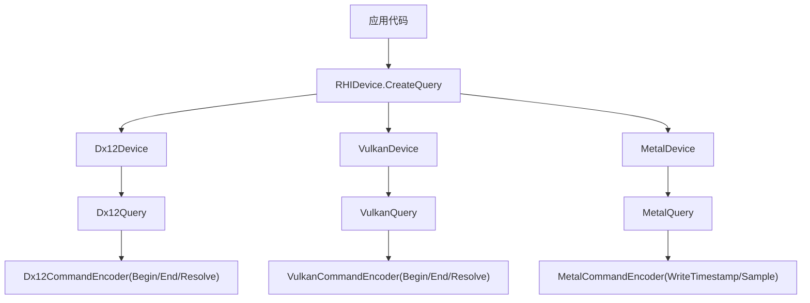
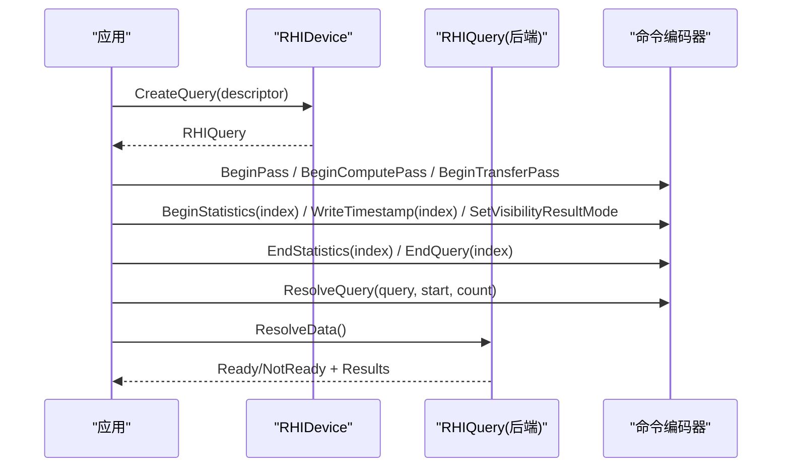
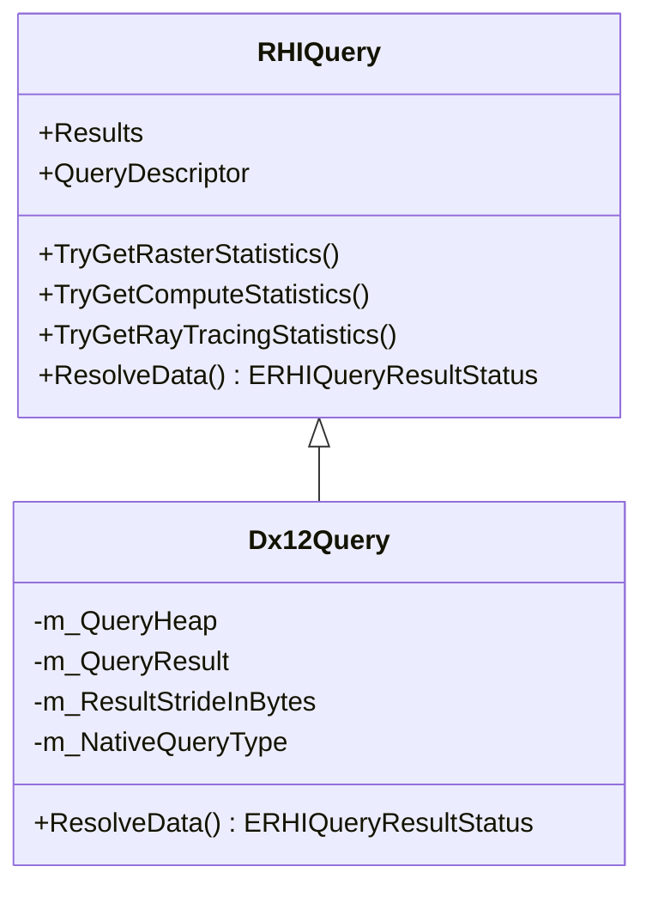
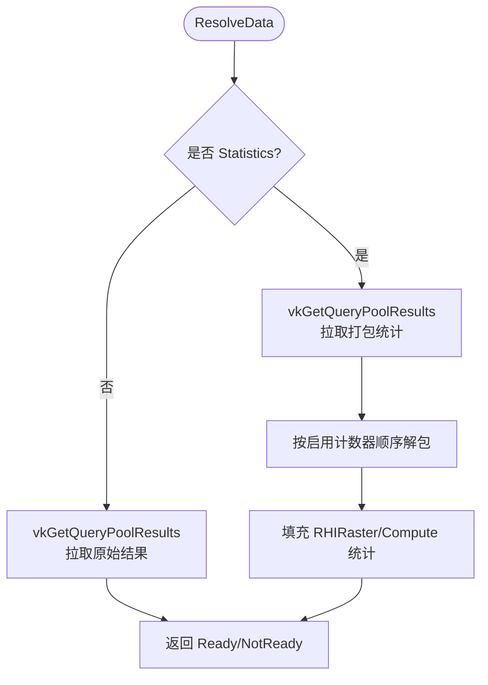
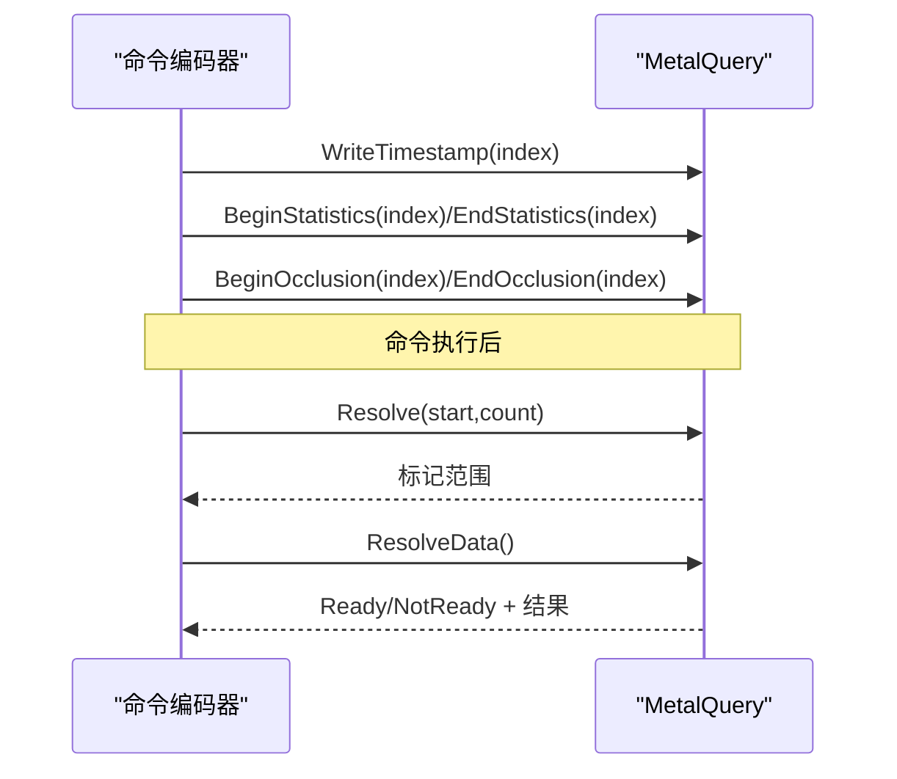
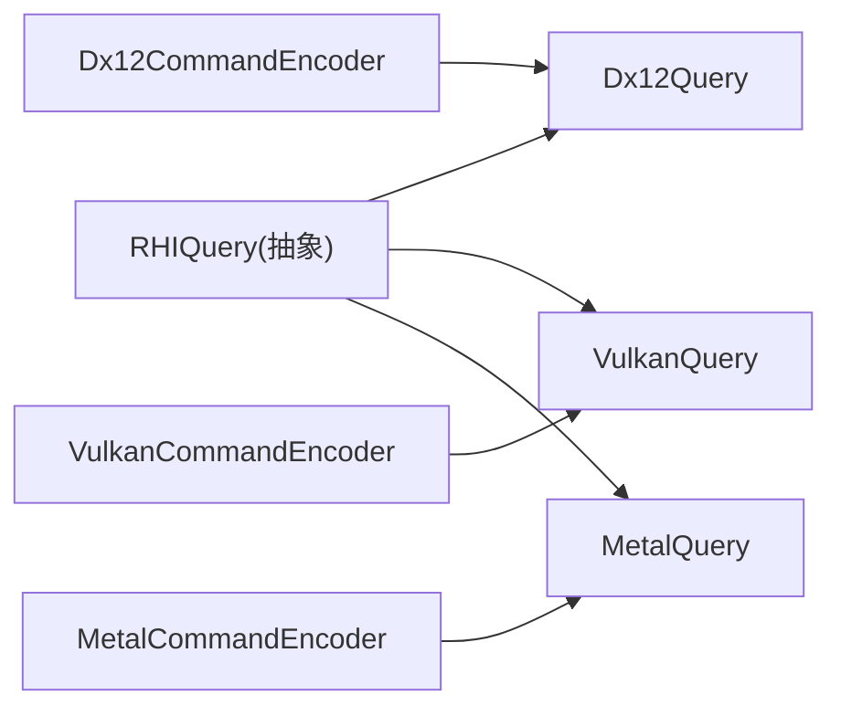

# 查询系统

<cite>
**本文引用的文件**
- [RHIQuery.cs](file://src/SharpGPU/Abstract/RHIQuery.cs)
- [Dx12Query.cs](file://src/SharpGPU/Dx12/Dx12Query.cs)
- [VulkanQuery.cs](file://src/SharpGPU/Vulkan/VulkanQuery.cs)
- [MetalQuery.cs](file://src/SharpGPU/Metal/MetalQuery.cs)
- [RHIDevice.cs](file://src/SharpGPU/Abstract/RHIDevice.cs)
- [Dx12Device.cs](file://src/SharpGPU/Dx12/Dx12Device.cs)
- [VulkanDevice.cs](file://src/SharpGPU/Vulkan/VulkanDevice.cs)
- [MetalDevice.cs](file://src/SharpGPU/Metal/MetalDevice.cs)
- [RasterWorkload.cs](file://samples/ComputeAndDraw/RasterWorkload.cs)
- [Program.cs](file://benchmarks/SharpGPU.Benchmarks/Program.cs)
</cite>

## 目录
1. [简介](#简介)
2. [项目结构](#项目结构)
3. [核心组件](#核心组件)
4. [架构总览](#架构总览)
5. [详细组件分析](#详细组件分析)
6. [依赖关系分析](#依赖关系分析)
7. [性能考虑](#性能考虑)
8. [故障排查指南](#故障排查指南)
9. [结论](#结论)
10. [附录：使用示例与最佳实践](#附录使用示例与最佳实践)

## 简介
本文件系统性说明 SharpGPU 的查询（Query）子系统，覆盖以下主题：
- 查询对象的作用与类型：时间戳查询、管道统计查询、遮挡查询等。
- 查询的创建、记录与结果获取流程。
- 不同后端（DirectX 12、Vulkan、Metal）的实现差异与支持情况。
- 查询结果的解读方法与性能分析技巧。
- 在渲染管线中的应用场景：帧时间测量、GPU 利用率分析、绘制调用统计等。
- 最佳实践与性能注意事项。

## 项目结构
SharpGPU 将查询抽象为 RHI 层接口，并在各后端提供具体实现：
- 抽象层：定义查询描述符、统计域、统计计数器、查询基类及结果状态。
- 后端层：DX12、Vulkan、Metal 分别实现查询对象的创建、命令编码、结果解析。
- 设备层：提供 CreateQuery 入口，统一由后端构造具体查询对象。
- 示例与基准：展示如何在渲染/计算/传输通道中使用查询进行统计与计时。

图表来源
- [RHIDevice.cs:532-540](file://src/SharpGPU/Abstract/RHIDevice.cs#L532-L540)
- [Dx12Device.cs:215-225](file://src/SharpGPU/Dx12/Dx12Device.cs#L215-L225)
- [VulkanDevice.cs:182-191](file://src/SharpGPU/Vulkan/VulkanDevice.cs#L182-L191)
- [MetalDevice.cs:216-226](file://src/SharpGPU/Metal/MetalDevice.cs#L216-L226)

章节来源
- [RHIDevice.cs:532-540](file://src/SharpGPU/Abstract/RHIDevice.cs#L532-L540)
- [Dx12Device.cs:215-225](file://src/SharpGPU/Dx12/Dx12Device.cs#L215-L225)
- [VulkanDevice.cs:182-191](file://src/SharpGPU/Vulkan/VulkanDevice.cs#L182-L191)
- [MetalDevice.cs:216-226](file://src/SharpGPU/Metal/MetalDevice.cs#L216-L226)

## 核心组件
- 查询描述符 RHIQueryDescriptor：指定 Count、Type、Domain、CounterMask，用于声明查询数量、类型、统计域与计数器掩码。
- 查询基类 RHIQuery：封装通用结果存储、范围校验、类型校验、按域获取统计数据的 TryGet* 方法，以及 ResolveData 抽象。
- 后端查询实现：
  - Dx12Query：基于 QueryHeap + Readback Buffer，支持 Occlusion、Statistics、Timestamp。
  - VulkanQuery：基于 VkQueryPool，支持 Statistics/Timestamp/Occlusion，并维护已解析范围。
  - MetalQuery：基于 CounterHeap/CounterSampleBuffer/Visibility Result Buffer，支持 Timestamp、Occlusion、Statistics。
- 设备层 RHIDevice：CreateQuery 抽象方法由各后端实现，返回具体查询对象。

章节来源
- [RHIQuery.cs:178-206](file://src/SharpGPU/Abstract/RHIQuery.cs#L178-L206)
- [RHIQuery.cs:310-446](file://src/SharpGPU/Abstract/RHIQuery.cs#L310-L446)
- [Dx12Query.cs:36-113](file://src/SharpGPU/Dx12/Dx12Query.cs#L36-L113)
- [VulkanQuery.cs:31-75](file://src/SharpGPU/Vulkan/VulkanQuery.cs#L31-L75)
- [MetalQuery.cs:21-118](file://src/SharpGPU/Metal/MetalQuery.cs#L21-L118)
- [RHIDevice.cs:532-540](file://src/SharpGPU/Abstract/RHIDevice.cs#L532-L540)

## 架构总览
查询生命周期分为三个阶段：
1. 创建：通过设备 CreateQuery(RHIQueryDescriptor) 创建后端查询对象，内部分配原生资源（QueryHeap/QueryPool/CounterHeap）。
2. 记录：在命令缓冲中 Begin/End 对应查询区间；或写入时间戳；或设置可见性结果缓冲区。
3. 解析：提交命令后，调用 ResolveData 将 GPU 结果拷贝到 CPU 可访问内存，并按域读取统计数据。

图表来源
- [RHIDevice.cs:532-540](file://src/SharpGPU/Abstract/RHIDevice.cs#L532-L540)
- [Dx12CommandEncoder.cs:1531-1550](file://src/SharpGPU/Dx12/Dx12CommandEncoder.cs#L1531-L1550)
- [VulkanQuery.cs:84-118](file://src/SharpGPU/Vulkan/VulkanQuery.cs#L84-L118)
- [MetalQuery.cs:175-224](file://src/SharpGPU/Metal/MetalQuery.cs#L175-L224)

## 详细组件分析

### 抽象层：查询类型、统计域与数据模型
- ERHIQueryType：包含 Occlusion、Statistics、Timestamp、TimestampTransfer 等。
- ERHIPipelineStatisticsDomain：Raster、Compute、RayTracing。
- ERHIPipelineStatisticCounter：细粒度计数器位掩码，如输入装配顶点/图元、各阶段调用次数、裁剪器、像素着色器、细分、网格/任务着色器等。
- RHIRasterPipelineStatistics / RHIComputePipelineStatistics / RHIRayTracingPipelineStatistics：按域的结构化统计结果。
- RHIQueryDescriptor：Count、Type、Domain、CounterMask。
- RHIQuery：统一的结果访问接口，禁止对 Statistics 查询直接读 Results，必须用 TryGet* 系列方法。

章节来源
- [RHIQuery.cs:7-19](file://src/SharpGPU/Abstract/RHIQuery.cs#L7-L19)
- [RHIQuery.cs:87-176](file://src/SharpGPU/Abstract/RHIQuery.cs#L87-L176)
- [RHIQuery.cs:178-206](file://src/SharpGPU/Abstract/RHIQuery.cs#L178-L206)
- [RHIQuery.cs:310-446](file://src/SharpGPU/Abstract/RHIQuery.cs#L310-L446)

### DirectX 12 后端实现
- 资源：QueryHeap + Readback Buffer。根据 Type 选择 QueryType/HeapType。
- 统计：若启用 Mesh Shader 相关计数器则使用 PipelineStatistics1，否则使用 PipelineStatistics。
- 解析：Map Readback Buffer，复制原始结果或按域填充结构化统计。
- 命令编码：BeginQuery/EndQuery/ResolveQueryData 针对不同类型映射到 D3D12 原语。

图表来源
- [RHIQuery.cs:310-446](file://src/SharpGPU/Abstract/RHIQuery.cs#L310-L446)
- [Dx12Query.cs:7-35](file://src/SharpGPU/Dx12/Dx12Query.cs#L7-L35)
- [Dx12Query.cs:115-153](file://src/SharpGPU/Dx12/Dx12Query.cs#L115-L153)

章节来源
- [Dx12Query.cs:36-113](file://src/SharpGPU/Dx12/Dx12Query.cs#L36-L113)
- [Dx12Query.cs:155-241](file://src/SharpGPU/Dx12/Dx12Query.cs#L155-L241)
- [Dx12Query.cs:243-306](file://src/SharpGPU/Dx12/Dx12Query.cs#L243-L306)
- [Dx12CommandEncoder.cs:1531-1550](file://src/SharpGPU/Dx12/Dx12CommandEncoder.cs#L1531-L1550)
- [Dx12CommandEncoder.cs:1740-1754](file://src/SharpGPU/Dx12/Dx12CommandEncoder.cs#L1740-L1754)
- [Dx12CommandEncoder.cs:1996-2010](file://src/SharpGPU/Dx12/Dx12CommandEncoder.cs#L1996-L2010)
- [Dx12CommandEncoder.cs:3478-3506](file://src/SharpGPU/Dx12/Dx12CommandEncoder.cs#L3478-L3506)
- [Dx12CommandEncoder.cs:4092-4354](file://src/SharpGPU/Dx12/Dx12CommandEncoder.cs#L4092-L4354)

### Vulkan 后端实现
- 资源：VkQueryPool，根据 Type 选择查询类型，Statistics 时附加 pipelineStatistics 标志。
- 统计：将 CounterMask 转换为 VkQueryPipelineStatisticFlags，并枚举启用的计数器顺序以构建紧凑结果布局。
- 解析：vkGetQueryPoolResults 拉取结果，非就绪返回 NotReady；Statistics 时解包为结构化统计。
- 范围解析：MarkResolvedRange 记录已解析起始索引与计数，避免重复解析。

图表来源
- [VulkanQuery.cs:84-150](file://src/SharpGPU/Vulkan/VulkanQuery.cs#L84-L150)
- [VulkanQuery.cs:168-254](file://src/SharpGPU/Vulkan/VulkanQuery.cs#L168-L254)
- [VulkanQuery.cs:256-331](file://src/SharpGPU/Vulkan/VulkanQuery.cs#L256-L331)

章节来源
- [VulkanQuery.cs:31-75](file://src/SharpGPU/Vulkan/VulkanQuery.cs#L31-L75)
- [VulkanQuery.cs:77-118](file://src/SharpGPU/Vulkan/VulkanQuery.cs#L77-L118)
- [VulkanQuery.cs:120-150](file://src/SharpGPU/Vulkan/VulkanQuery.cs#L120-L150)
- [VulkanQuery.cs:152-254](file://src/SharpGPU/Vulkan/VulkanQuery.cs#L152-L254)
- [VulkanQuery.cs:256-331](file://src/SharpGPU/Vulkan/VulkanQuery.cs#L256-L331)

### Metal 后端实现
- 资源：
  - Timestamp：MTL4CounterHeap + 结果缓冲区，支持精确时间戳。
  - Occlusion：Visibility Result Buffer，计数模式。
  - Statistics：CounterSampleBuffer，采样开始/结束点，差值计算。
- 解析：
  - Timestamp：ResolveCounterRange 读取条目，按频率换算纳秒。
  - Occlusion：读取可见性结果缓冲区。
  - Statistics：读取开始/结束样本，逐字段差值填充统计。
- 限制：需要 Metal 4 能力与相应 Selector 支持。

图表来源
- [MetalQuery.cs:21-118](file://src/SharpGPU/Metal/MetalQuery.cs#L21-L118)
- [MetalQuery.cs:133-173](file://src/SharpGPU/Metal/MetalQuery.cs#L133-L173)
- [MetalQuery.cs:175-224](file://src/SharpGPU/Metal/MetalQuery.cs#L175-L224)
- [MetalQuery.cs:226-248](file://src/SharpGPU/Metal/MetalQuery.cs#L226-L248)
- [MetalQuery.cs:300-369](file://src/SharpGPU/Metal/MetalQuery.cs#L300-L369)

章节来源
- [MetalQuery.cs:21-118](file://src/SharpGPU/Metal/MetalQuery.cs#L21-L118)
- [MetalQuery.cs:133-173](file://src/SharpGPU/Metal/MetalQuery.cs#L133-L173)
- [MetalQuery.cs:175-224](file://src/SharpGPU/Metal/MetalQuery.cs#L175-L224)
- [MetalQuery.cs:226-248](file://src/SharpGPU/Metal/MetalQuery.cs#L226-L248)
- [MetalQuery.cs:300-369](file://src/SharpGPU/Metal/MetalQuery.cs#L300-L369)

### 设备层与查询创建
- RHIDevice.CreateQuery：抽象方法，由各后端实现，返回具体查询对象。
- 各后端设备在 CreateQuery 中根据 descriptor 构造对应查询实例，完成原生资源初始化。

章节来源
- [RHIDevice.cs:532-540](file://src/SharpGPU/Abstract/RHIDevice.cs#L532-L540)
- [Dx12Device.cs:215-225](file://src/SharpGPU/Dx12/Dx12Device.cs#L215-L225)
- [VulkanDevice.cs:182-191](file://src/SharpGPU/Vulkan/VulkanDevice.cs#L182-L191)
- [MetalDevice.cs:216-226](file://src/SharpGPU/Metal/MetalDevice.cs#L216-L226)

## 依赖关系分析
- 抽象层与后端层通过 RHIQuery 接口解耦，便于扩展新后端。
- 命令编码器依赖具体后端查询对象，调用 Begin/End/Resolve 等方法。
- 统计计数器在不同后端存在名称与语义映射差异，需通过转换函数处理。

图表来源
- [RHIQuery.cs:310-446](file://src/SharpGPU/Abstract/RHIQuery.cs#L310-L446)
- [Dx12CommandEncoder.cs:1531-1550](file://src/SharpGPU/Dx12/Dx12CommandEncoder.cs#L1531-L1550)
- [VulkanQuery.cs:84-118](file://src/SharpGPU/Vulkan/VulkanQuery.cs#L84-L118)
- [MetalQuery.cs:133-173](file://src/SharpGPU/Metal/MetalQuery.cs#L133-L173)

章节来源
- [RHIQuery.cs:310-446](file://src/SharpGPU/Abstract/RHIQuery.cs#L310-L446)
- [Dx12CommandEncoder.cs:1531-1550](file://src/SharpGPU/Dx12/Dx12CommandEncoder.cs#L1531-L1550)
- [VulkanQuery.cs:84-118](file://src/SharpGPU/Vulkan/VulkanQuery.cs#L84-L118)
- [MetalQuery.cs:133-173](file://src/SharpGPU/Metal/MetalQuery.cs#L133-L173)

## 性能考虑
- 查询开销：频繁 Begin/End 会引入额外命令与同步成本，建议批量统计关键路径。
- 结果解析：ResolveData 可能阻塞或返回 NotReady，应结合 Fence 或异步机制确保数据就绪。
- 统计粒度：仅启用需要的计数器，减少带宽与解析开销。
- 时间戳精度：Metal 使用精确时间戳；DX12/Vulkan 时间戳需考虑校准与频率换算。
- 资源复用：尽量复用 QueryHeap/QueryPool/CounterHeap，避免频繁创建销毁。
- 跨后端差异：Mesh Shader 统计在 DX12 需 PipelineStatistics1；Vulkan 需特定扩展标志；Metal 需 Metal 4。

[本节为通用指导，不直接分析具体文件]

## 故障排查指南
- 类型不匹配：对非 Statistics 查询调用 TryGet* 将抛出异常；请确认 QueryDescriptor.Domain 与调用方法一致。
- 范围越界：ValidateRange 检查 startIndex+count 不超过 Count，避免越界访问。
- 设备不一致：Require* 验证器会拒绝来自不同设备的查询对象。
- 后端不支持：Metal 需要 Metal 4 与相应 Selector；DX12 需要 Mesh Shader Tier 支持；Vulkan 需要对应扩展。
- 结果未就绪：ResolveData 返回 NotReady 时，检查命令提交与同步，必要时等待 Fence。

章节来源
- [RHIQuery.cs:208-309](file://src/SharpGPU/Abstract/RHIQuery.cs#L208-L309)
- [RHIQuery.cs:351-374](file://src/SharpGPU/Abstract/RHIQuery.cs#L351-L374)
- [MetalQuery.cs:250-297](file://src/SharpGPU/Metal/MetalQuery.cs#L250-L297)
- [Dx12Query.cs:243-262](file://src/SharpGPU/Dx12/Dx12Query.cs#L243-L262)
- [VulkanQuery.cs:120-150](file://src/SharpGPU/Vulkan/VulkanQuery.cs#L120-L150)

## 结论
SharpGPU 查询系统通过统一的抽象层屏蔽后端差异，提供时间戳、管道统计、遮挡等能力。开发者可在渲染/计算/传输通道中灵活插入查询，获得细粒度的性能洞察。遵循最佳实践与性能建议，可有效降低开销并获得稳定可靠的测量结果。

[本节为总结，不直接分析具体文件]

## 附录：使用示例与最佳实践

### 示例：栅格管线统计
- 创建查询：指定 Domain=Raster，CounterMask 选择所需计数器。
- 记录：在栅格 Pass 中 BeginStatistics/EndStatistics 包裹绘制调用。
- 解析：在传输 Pass 中 ResolveQuery，然后调用 TryGetRasterStatistics 读取结果。

章节来源
- [RasterWorkload.cs:50-58](file://samples/ComputeAndDraw/RasterWorkload.cs#L50-L58)
- [RasterWorkload.cs:107-136](file://samples/ComputeAndDraw/RasterWorkload.cs#L107-L136)
- [RasterWorkload.cs:139-160](file://samples/ComputeAndDraw/RasterWorkload.cs#L139-L160)

### 示例：基准中的查询使用
- 在基准程序中创建查询并用于性能测量，结合队列提交与 Fence 等待，确保结果可用。

章节来源
- [Program.cs:550-560](file://benchmarks/SharpGPU.Benchmarks/Program.cs#L550-L560)

### 最佳实践
- 明确查询目标：仅启用必要计数器，减少带宽与解析成本。
- 合理批量化：合并相邻查询区间，减少 Begin/End 次数。
- 同步策略：使用 Fence 或队列提交保证 ResolveData 前数据就绪。
- 跨后端兼容：注意 Mesh Shader、扩展名与能力检测，避免在不支持设备上运行。
- 结果解读：时间戳需按频率换算；统计需按域读取；遮挡查询结果为可见性计数。

[本节为通用指导，不直接分析具体文件]