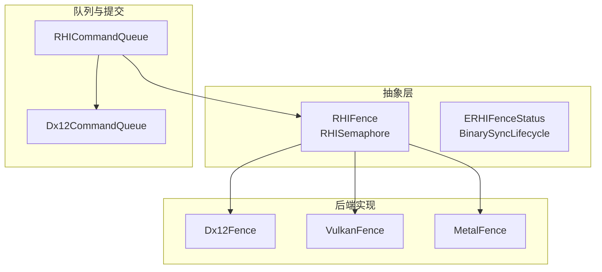
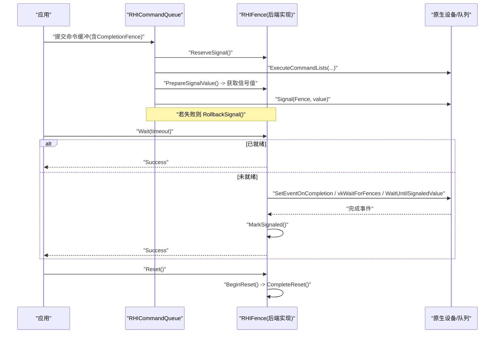
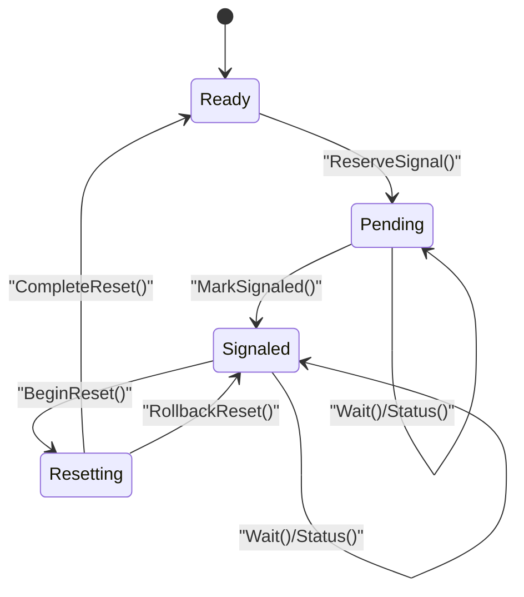
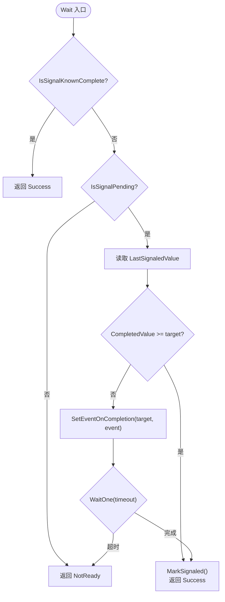
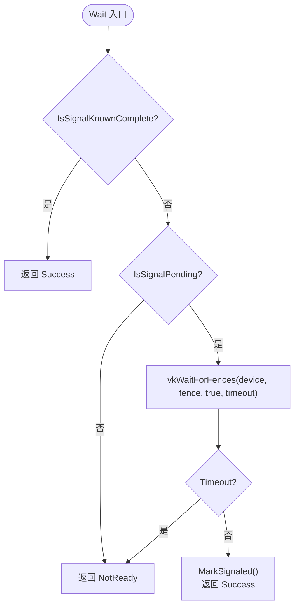
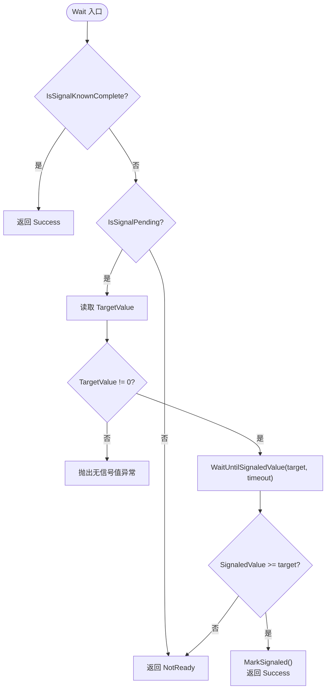
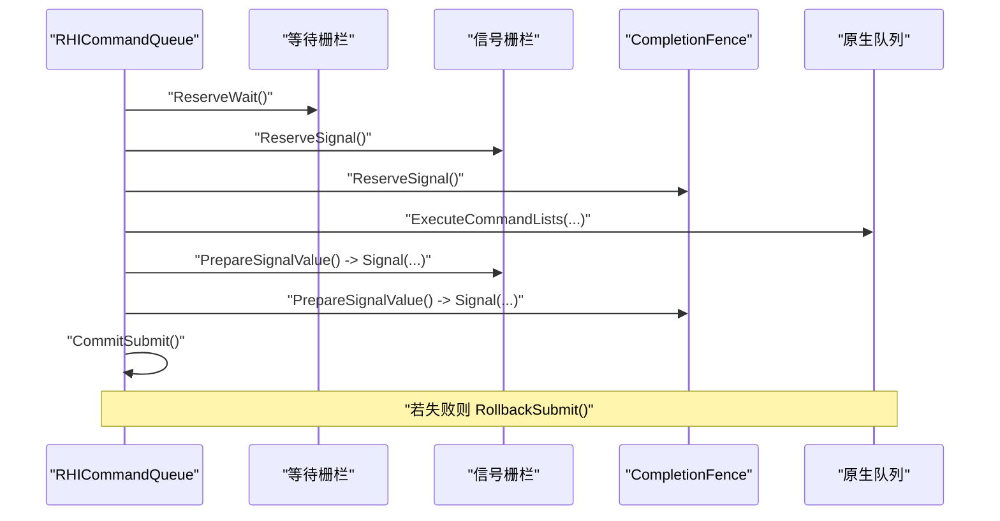
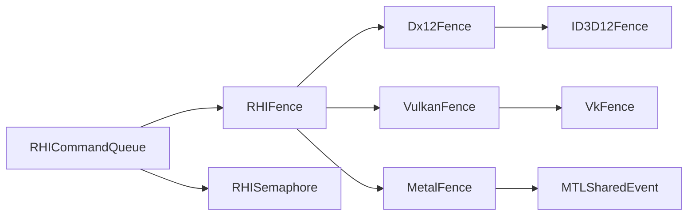

# 栅栏同步

<cite>
**本文引用的文件**
- [RHISynchronous.cs](file://src/SharpGPU/Abstract/RHISynchronous.cs)
- [Dx12Synchronous.cs](file://src/SharpGPU/Dx12/Dx12Synchronous.cs)
- [VulkanSynchronous.cs](file://src/SharpGPU/Vulkan/VulkanSynchronous.cs)
- [MetalSynchronous.cs](file://src/SharpGPU/Metal/MetalSynchronous.cs)
- [RHICommandQueue.cs](file://src/SharpGPU/Abstract/RHICommandQueue.cs)
- [Dx12CommandQueue.cs](file://src/SharpGPU/Dx12/Dx12CommandQueue.cs)
- [QueueSubmissionContractTests.cs](file://tests/SharpGPU.Conformance.Tests/QueueSubmissionContractTests.cs)
</cite>

## 目录
1. [简介](#简介)
2. [项目结构](#项目结构)
3. [核心组件](#核心组件)
4. [架构总览](#架构总览)
5. [详细组件分析](#详细组件分析)
6. [依赖关系分析](#依赖关系分析)
7. [性能考虑](#性能考虑)
8. [故障排查指南](#故障排查指南)
9. [结论](#结论)
10. [附录：使用示例与最佳实践](#附录使用示例与最佳实践)

## 简介
本文件聚焦于 SharpGPU 中的栅栏（Fence）同步机制，围绕 RHIFence 抽象类及其在 DX12、Vulkan、Metal 后端的实现展开。文档解释栅栏的状态机、生命周期转换、信号与等待操作、错误处理策略，并给出在不同后端下的差异说明。同时提供 CPU-GPU 同步的典型应用场景与最佳实践，帮助读者正确、高效地使用栅栏完成命令执行完成通知与资源访问同步。

## 项目结构
SharpGPU 将同步原语抽象为 RHI 层接口，并在各后端分别实现：
- 抽象层：定义 RHIFence、RHISemaphore、状态枚举、屏障等通用类型与生命周期管理。
- 后端实现：DX12、Vulkan、Metal 各自封装原生同步对象（ID3D12Fence、VkFence、MTLSharedEvent）。
- 队列提交：RHICommandQueue 负责协调等待/信号栅栏与命令缓冲的提交流程，保证原子性与可回滚。

图表来源
- [RHISynchronous.cs:7-176](file://src/SharpGPU/Abstract/RHISynchronous.cs#L7-L176)
- [Dx12Synchronous.cs:8-149](file://src/SharpGPU/Dx12/Dx12Synchronous.cs#L8-L149)
- [VulkanSynchronous.cs:7-122](file://src/SharpGPU/Vulkan/VulkanSynchronous.cs#L7-L122)
- [MetalSynchronous.cs:11-130](file://src/SharpGPU/Metal/MetalSynchronous.cs#L11-L130)
- [RHICommandQueue.cs:250-330](file://src/SharpGPU/Abstract/RHICommandQueue.cs#L250-L330)
- [Dx12CommandQueue.cs:120-196](file://src/SharpGPU/Dx12/Dx12CommandQueue.cs#L120-L196)

章节来源
- [RHISynchronous.cs:7-176](file://src/SharpGPU/Abstract/RHISynchronous.cs#L7-L176)
- [RHICommandQueue.cs:250-330](file://src/SharpGPU/Abstract/RHICommandQueue.cs#L250-L330)

## 核心组件
- RHIFence：抽象栅栏基类，维护内部状态 m_State，提供 ReserveSignal、Reset、Wait、MarkSignaled、BeginReset、CompleteReset、RollbackReset、EnsureWaitable 等方法，确保线程安全与状态一致性。
- ERHIFenceStatus：对外暴露的栅栏状态枚举（Success、NotReady、Undefined）。
- BinarySyncLifecycle：内部状态机（Ready、Pending、Signaled、Resetting），用于驱动栅栏的生命周期。
- 后端 Fence 实现：
  - Dx12Fence：基于 ID3D12Fence + AutoResetEvent，支持 SetEventOnCompletion 与 CompletedValue 轮询。
  - VulkanFence：基于 VkFence，使用 vkGetFenceStatus 查询与 vkWaitForFences 阻塞等待。
  - MetalFence：基于 MTLSharedEvent，使用 WaitUntilSignaledValue 与 SignaledValue 比较。
- 队列提交：RHICommandQueue 通过 ReserveSignal/CommitSignal/RollbackSignal 组合，保证提交操作的原子性；具体后端队列（如 Dx12CommandQueue）调用 PrepareSignalValue 获取值并提交到原生队列。

章节来源
- [RHISynchronous.cs:7-176](file://src/SharpGPU/Abstract/RHISynchronous.cs#L7-L176)
- [Dx12Synchronous.cs:8-149](file://src/SharpGPU/Dx12/Dx12Synchronous.cs#L8-L149)
- [VulkanSynchronous.cs:7-122](file://src/SharpGPU/Vulkan/VulkanSynchronous.cs#L7-L122)
- [MetalSynchronous.cs:11-130](file://src/SharpGPU/Metal/MetalSynchronous.cs#L11-L130)
- [RHICommandQueue.cs:250-330](file://src/SharpGPU/Abstract/RHICommandQueue.cs#L250-L330)
- [Dx12CommandQueue.cs:120-196](file://src/SharpGPU/Dx12/Dx12CommandQueue.cs#L120-L196)

## 架构总览
下图展示了从应用层到后端的栅栏同步调用链：应用通过队列提交描述符包含 CompletionFence，队列在 Reserve 阶段标记栅栏为 Pending，在后端提交时 PrepareSignalValue 生成信号值并调用原生 Signal，CPU 侧通过 Wait 或 Status 检查完成，完成后 MarkSignaled 进入 Signaled 状态，随后可 Reset 回到 Ready。

图表来源
- [RHICommandQueue.cs:250-330](file://src/SharpGPU/Abstract/RHICommandQueue.cs#L250-L330)
- [Dx12CommandQueue.cs:120-196](file://src/SharpGPU/Dx12/Dx12CommandQueue.cs#L120-L196)
- [Dx12Synchronous.cs:82-149](file://src/SharpGPU/Dx12/Dx12Synchronous.cs#L82-L149)
- [VulkanSynchronous.cs:90-122](file://src/SharpGPU/Vulkan/VulkanSynchronous.cs#L90-L122)
- [MetalSynchronous.cs:72-130](file://src/SharpGPU/Metal/MetalSynchronous.cs#L72-L130)

## 详细组件分析

### RHIFence 状态机与生命周期
- 初始状态：Ready
- 提交信号前：ReserveSignal() 将状态从 Ready 转为 Pending
- GPU 完成信号：后端回调或轮询触发 MarkSignaled()，将状态从 Pending 转为 Signaled
- 重置：BeginReset() 要求当前为 Signaled，转入 Resetting；CompleteReset() 转回 Ready；RollbackReset() 回退到 Signaled
- 等待：EnsureWaitable() 禁止在 Ready 或 Resetting 状态下等待；Wait() 根据后端实现阻塞或轮询，完成后 MarkSignaled()

图表来源
- [RHISynchronous.cs:37-163](file://src/SharpGPU/Abstract/RHISynchronous.cs#L37-L163)
- [RHISynchronous.cs:63-114](file://src/SharpGPU/Abstract/RHISynchronous.cs#L63-L114)

章节来源
- [RHISynchronous.cs:37-163](file://src/SharpGPU/Abstract/RHISynchronous.cs#L37-L163)
- [RHISynchronous.cs:63-114](file://src/SharpGPU/Abstract/RHISynchronous.cs#L63-L114)

### DX12 后端实现（Dx12Fence）
- 创建：通过 ID3D12Device::CreateFence 创建原生栅栏，并初始化 AutoResetEvent 与信号值计数器。
- 状态查询：Status 先检查内部 IsSignalKnownComplete，否则读取 LastSignaledValue 并与 CompletedValue 比较，必要时 MarkSignaled。
- 等待：Wait 使用 SetEventOnCompletion(targetValue, eventHandle) 配合 AutoResetEvent 等待，支持超时；若未完成返回 NotReady。
- 信号值准备：PrepareSignalValue 在 ReserveSignal 之后调用，递增 NextFenceValue 并写入 LastSignaledValue。
- 释放：Release 中释放事件与原生栅栏。

图表来源
- [Dx12Synchronous.cs:18-42](file://src/SharpGPU/Dx12/Dx12Synchronous.cs#L18-L42)
- [Dx12Synchronous.cs:82-149](file://src/SharpGPU/Dx12/Dx12Synchronous.cs#L82-L149)
- [Dx12Synchronous.cs:132-149](file://src/SharpGPU/Dx12/Dx12Synchronous.cs#L132-L149)

章节来源
- [Dx12Synchronous.cs:8-149](file://src/SharpGPU/Dx12/Dx12Synchronous.cs#L8-L149)

### Vulkan 后端实现（VulkanFence）
- 创建：vkCreateFence 创建 VkFence。
- 状态查询：vkGetFenceStatus 返回 Success/NotReady/其他错误；成功时 MarkSignaled。
- 等待：vkWaitForFences 直接阻塞等待，支持纳秒级超时；超时返回 NotReady。
- 重置：vkResetFences 重置原生栅栏；异常时 RollbackReset 保持状态一致。

图表来源
- [VulkanSynchronous.cs:11-41](file://src/SharpGPU/Vulkan/VulkanSynchronous.cs#L11-L41)
- [VulkanSynchronous.cs:90-122](file://src/SharpGPU/Vulkan/VulkanSynchronous.cs#L90-L122)
- [VulkanSynchronous.cs:62-88](file://src/SharpGPU/Vulkan/VulkanSynchronous.cs#L62-L88)

章节来源
- [VulkanSynchronous.cs:7-122](file://src/SharpGPU/Vulkan/VulkanSynchronous.cs#L7-L122)

### Metal 后端实现（MetalFence）
- 创建：NewSharedEvent 创建 MTLSharedEvent；不支持时报 NotSupportedException。
- 状态查询：比较 SignaledValue 与 TargetValue，必要时 MarkSignaled。
- 等待：WaitUntilSignaledValue(targetValue, timeoutMilliseconds) 阻塞等待；未完成返回 NotReady。
- 信号值准备：PrepareSignalValue 在 ReserveSignal 之后调用，递增 NextSignalValue 并写入 TargetValue。

图表来源
- [MetalSynchronous.cs:31-55](file://src/SharpGPU/Metal/MetalSynchronous.cs#L31-L55)
- [MetalSynchronous.cs:72-130](file://src/SharpGPU/Metal/MetalSynchronous.cs#L72-L130)
- [MetalSynchronous.cs:110-130](file://src/SharpGPU/Metal/MetalSynchronous.cs#L110-L130)

章节来源
- [MetalSynchronous.cs:11-130](file://src/SharpGPU/Metal/MetalSynchronous.cs#L11-L130)

### 队列提交流程与栅栏集成
- 预留阶段：对等待/信号栅栏与 CompletionFence 调用 Reserve*，失败时按顺序 Rollback。
- 提交阶段：后端队列（如 Dx12CommandQueue）调用 PrepareSignalValue 获取值并执行原生 Signal；最后 CommitSubmit 标记命令缓冲已提交。
- 回滚阶段：任何步骤失败均调用 RollbackSubmit 恢复栅栏状态。

图表来源
- [RHICommandQueue.cs:250-330](file://src/SharpGPU/Abstract/RHICommandQueue.cs#L250-L330)
- [Dx12CommandQueue.cs:120-196](file://src/SharpGPU/Dx12/Dx12CommandQueue.cs#L120-L196)

章节来源
- [RHICommandQueue.cs:250-330](file://src/SharpGPU/Abstract/RHICommandQueue.cs#L250-L330)
- [Dx12CommandQueue.cs:120-196](file://src/SharpGPU/Dx12/Dx12CommandQueue.cs#L120-L196)

## 依赖关系分析
- RHIFence 依赖 Disposal 基类进行资源释放；各后端实现依赖各自的原生库（Direct3D12、Vulkan、Metal）。
- RHICommandQueue 依赖 RHIFence 与 RHISemaphore 的预留/提交/回滚协议，确保提交原子性。
- 后端队列（如 Dx12CommandQueue）依赖对应后端的原生 API 完成实际信号与等待。

图表来源
- [RHICommandQueue.cs:250-330](file://src/SharpGPU/Abstract/RHICommandQueue.cs#L250-L330)
- [Dx12Synchronous.cs:8-149](file://src/SharpGPU/Dx12/Dx12Synchronous.cs#L8-L149)
- [VulkanSynchronous.cs:7-122](file://src/SharpGPU/Vulkan/VulkanSynchronous.cs#L7-L122)
- [MetalSynchronous.cs:11-130](file://src/SharpGPU/Metal/MetalSynchronous.cs#L11-L130)

章节来源
- [RHICommandQueue.cs:250-330](file://src/SharpGPU/Abstract/RHICommandQueue.cs#L250-L330)

## 性能考虑
- 避免频繁轮询：优先使用阻塞等待（DX12 的 SetEventOnCompletion、Vulkan 的 vkWaitForFences、Metal 的 WaitUntilSignaledValue），减少 CPU 忙等。
- 合理设置超时：在需要非阻塞场景下，设置合理的超时时间，避免长时间占用线程。
- 批量提交：尽量合并多个命令缓冲与信号，减少多次 Signal 调用开销。
- 重用栅栏：复用同一栅栏实例，避免频繁创建/销毁带来的系统调用成本。
- 状态检查优化：在高频路径中优先使用 Status 快速判断，仅在必要时进行阻塞等待。

[本节为通用指导，不直接分析具体文件]

## 故障排查指南
- 设备不可用：ThrowIfSynchronizationDisposed 会检查设备状态，若设备丢失将抛出相应异常。
- 非法状态转换：
  - 在未 Ready 时尝试 ReserveSignal 将抛出无效操作异常。
  - 在 Resetting 或 Ready 时调用 Wait 将抛出无效操作异常。
  - BeginReset 在非 Signaled 状态将抛出无效操作异常。
- 无信号值：DX12/Metal 在 Wait 前若无目标信号值将抛出无效操作异常。
- 回滚机制：队列提交过程中任一环节失败，都会按逆序 Rollback 已预留的栅栏状态，保证一致性。

章节来源
- [RHISynchronous.cs:37-163](file://src/SharpGPU/Abstract/RHISynchronous.cs#L37-L163)
- [Dx12Synchronous.cs:82-149](file://src/SharpGPU/Dx12/Dx12Synchronous.cs#L82-L149)
- [MetalSynchronous.cs:72-130](file://src/SharpGPU/Metal/MetalSynchronous.cs#L72-L130)
- [RHICommandQueue.cs:250-330](file://src/SharpGPU/Abstract/RHICommandQueue.cs#L250-L330)

## 结论
SharpGPU 的栅栏同步通过统一的 RHIFence 抽象与后端实现，提供了跨平台一致的同步语义。其内部状态机确保了正确的生命周期管理与错误恢复，队列提交流程保证了原子性与可回滚。在实际使用中，应遵循“预留-提交-等待-重置”的流程，结合后端特性选择合适的等待策略，以获得最佳性能与稳定性。

[本节为总结，不直接分析具体文件]

## 附录：使用示例与最佳实践

### 典型使用流程（概念性步骤）
- 创建栅栏：由设备或队列创建 RHIFence 实例（具体后端实现不同）。
- 提交命令：在队列提交描述符中包含 CompletionFence，调用 ReserveSignal 预留信号。
- 执行命令：后端队列执行命令缓冲，并在末尾 Signal(Fence, value)。
- 等待完成：CPU 侧调用 Wait(timeout) 或循环 Status 检查，完成后进入 Signaled。
- 重置栅栏：调用 Reset() 将栅栏恢复到 Ready，以便复用。

章节来源
- [RHICommandQueue.cs:250-330](file://src/SharpGPU/Abstract/RHICommandQueue.cs#L250-L330)
- [Dx12CommandQueue.cs:120-196](file://src/SharpGPU/Dx12/Dx12CommandQueue.cs#L120-L196)
- [QueueSubmissionContractTests.cs:233-256](file://tests/SharpGPU.Conformance.Tests/QueueSubmissionContractTests.cs#L233-L256)

### 后端差异要点
- DX12：使用 ID3D12Fence 与 AutoResetEvent，支持 SetEventOnCompletion；适合高吞吐场景。
- Vulkan：使用 VkFence 与 vkWaitForFences，精确纳秒超时；适合细粒度控制。
- Metal：使用 MTLSharedEvent，需检查支持；适合 Apple 生态的高性能同步。

章节来源
- [Dx12Synchronous.cs:8-149](file://src/SharpGPU/Dx12/Dx12Synchronous.cs#L8-L149)
- [VulkanSynchronous.cs:7-122](file://src/SharpGPU/Vulkan/VulkanSynchronous.cs#L7-L122)
- [MetalSynchronous.cs:11-130](file://src/SharpGPU/Metal/MetalSynchronous.cs#L11-L130)

### CPU-GPU 同步应用场景
- 命令执行完成通知：队列提交后通过 CompletionFence 通知 CPU 任务完成，再进行后续数据处理或下一帧提交。
- 资源访问同步：在资源从 GPU 写切换到 CPU 读之前，确保栅栏已 Signaled，避免数据竞争。
- 多队列协作：结合信号/等待栅栏（RHISemaphore）实现跨队列有序执行。

[本节为概念性内容，不直接分析具体文件]