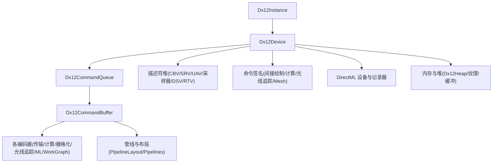
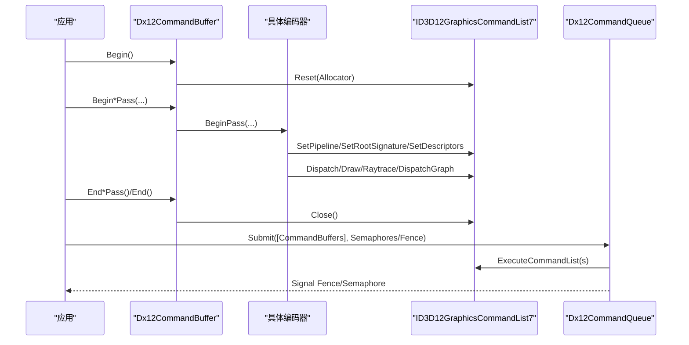
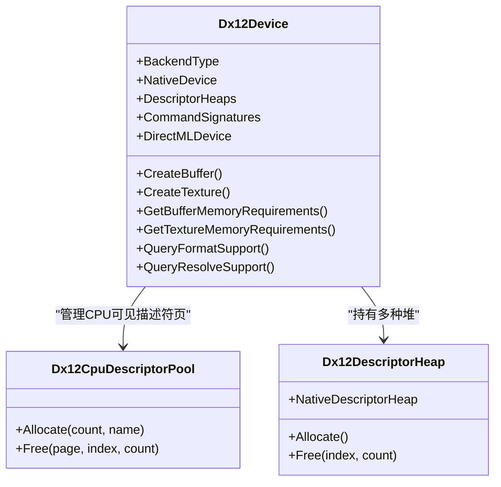
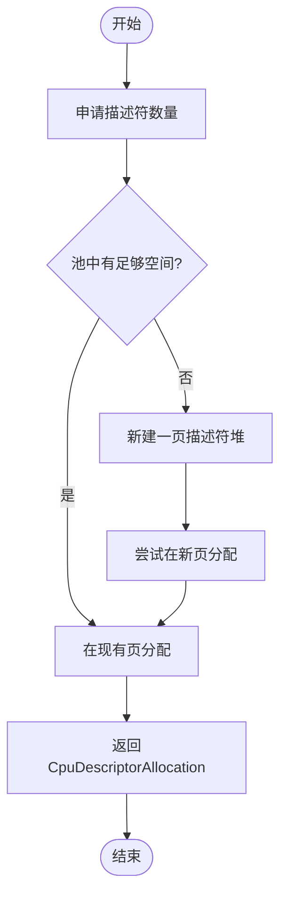
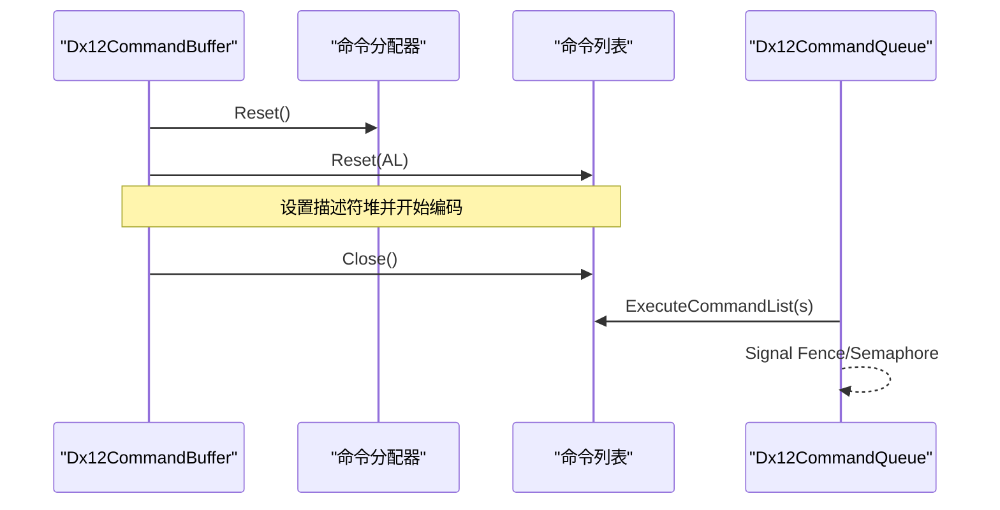
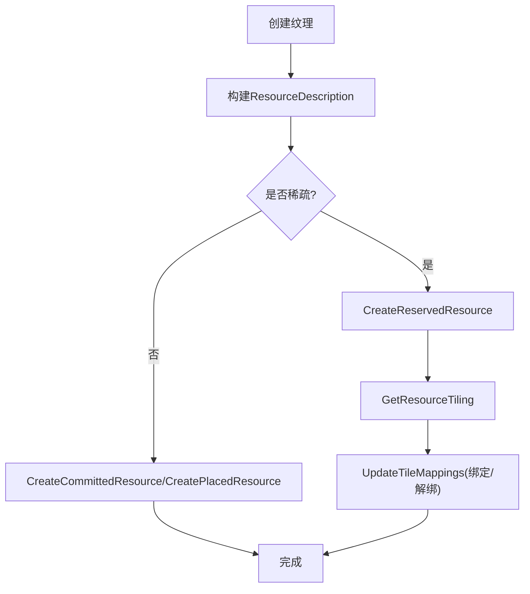
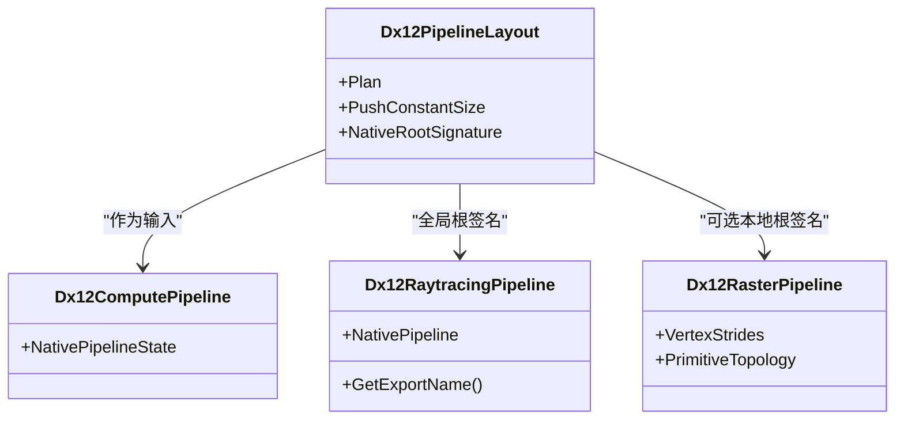
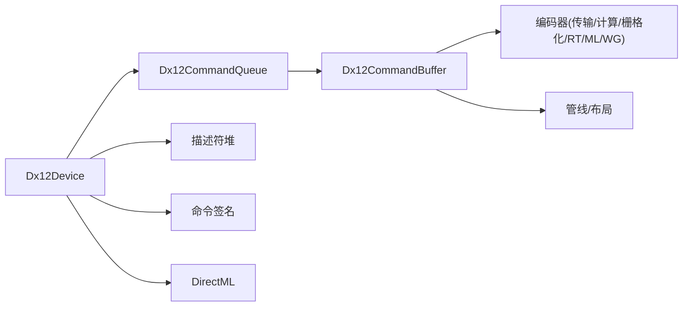

# DirectX 12 后端

<cite>
**本文引用的文件**
- [Dx12Device.cs](file://src/SharpGPU/Dx12/Dx12Device.cs)
- [Dx12CommandBuffer.cs](file://src/SharpGPU/Dx12/Dx12CommandBuffer.cs)
- [Dx12CommandQueue.cs](file://src/SharpGPU/Dx12/Dx12CommandQueue.cs)
- [Dx12Memory.cs](file://src/SharpGPU/Dx12/Dx12Memory.cs)
- [Dx12Texture.cs](file://src/SharpGPU/Dx12/Dx12Texture.cs)
- [Dx12Utility.cs](file://src/SharpGPU/Dx12/Dx12Utility.cs)
- [Dx12Pipeline.cs](file://src/SharpGPU/Dx12/Dx12Pipeline.cs)
- [Dx12Instance.cs](file://src/SharpGPU/Dx12/Dx12Instance.cs)
</cite>

## 目录
1. [简介](#简介)
2. [项目结构](#项目结构)
3. [核心组件](#核心组件)
4. [架构总览](#架构总览)
5. [详细组件分析](#详细组件分析)
6. [依赖关系分析](#依赖关系分析)
7. [性能考虑](#性能考虑)
8. [故障排除指南](#故障排除指南)
9. [结论](#结论)
10. [附录](#附录)

## 简介
本文件面向使用 SharpGPU DirectX 12 后端的开发者，系统性阐述 Dx12Device 的设备初始化、能力探测、资源管理、命令执行机制，并深入说明 DX12 特有的描述符堆管理、命令签名、渲染通道与光线追踪支持。同时覆盖 DirectML 集成、Work Graph 支持与 Mesh Shading 实现，提供性能优化策略、内存管理最佳实践与调试技巧，以及 DX12 特定的配置选项、错误处理与故障排除方法。

## 项目结构
DX12 后端位于 src/SharpGPU/Dx12 目录，围绕设备、命令队列、命令缓冲、资源与管线等关键对象组织：
- 设备与实例：Dx12Instance、Dx12Device
- 命令系统：Dx12CommandQueue、Dx12CommandBuffer 及各类编码器（传输、计算、栅格化、光线追踪、机器学习、Work Graph）
- 资源与内存：Dx12Buffer、Dx12Texture、Dx12Heap、Dx12MemoryUtility、Dx12SparseMemoryUtility
- 管线与绑定：Dx12PipelineLayout、Dx12ComputePipeline、Dx12RaytracingPipeline、Dx12RasterPipeline、Dx12BindingTableBinder
- 工具与转换：Dx12Utility（格式/过滤/采样/堆类型/查询等转换）、描述符堆池与分配器

图表来源
- [Dx12Instance.cs:20-106](file://src/SharpGPU/Dx12/Dx12Instance.cs#L20-L106)
- [Dx12Device.cs:137-157](file://src/SharpGPU/Dx12/Dx12Device.cs#L137-L157)
- [Dx12CommandQueue.cs:36-56](file://src/SharpGPU/Dx12/Dx12CommandQueue.cs#L36-L56)
- [Dx12CommandBuffer.cs:39-56](file://src/SharpGPU/Dx12/Dx12CommandBuffer.cs#L39-L56)

章节来源
- [Dx12Instance.cs:20-106](file://src/SharpGPU/Dx12/Dx12Instance.cs#L20-L106)
- [Dx12Device.cs:137-157](file://src/SharpGPU/Dx12/Dx12Device.cs#L137-L157)

## 核心组件
- 设备层：负责创建原生设备、枚举适配器、创建命令队列、描述符堆、命令签名、DirectML 对象，并进行能力探测与特性检查。
- 命令层：命令队列封装提交、等待/信号同步；命令缓冲封装分配器与命令列表生命周期，并提供多通道编码器入口。
- 资源层：统一构建资源描述、堆分配、放置资源、稀疏纹理保留与瓦片映射。
- 管线层：根签名与管线状态创建、绑定表计划与绑定、Mesh Shading 流水线流、光线追踪状态对象。
- 工具层：格式/过滤/地址模式/堆类型/查询类型等转换，错误码到 RHI 错误映射，命令列表创建辅助。

章节来源
- [Dx12Device.cs:137-157](file://src/SharpGPU/Dx12/Dx12Device.cs#L137-L157)
- [Dx12CommandQueue.cs:36-56](file://src/SharpGPU/Dx12/Dx12CommandQueue.cs#L36-L56)
- [Dx12CommandBuffer.cs:39-56](file://src/SharpGPU/Dx12/Dx12CommandBuffer.cs#L39-L56)
- [Dx12Memory.cs:13-71](file://src/SharpGPU/Dx12/Dx12Memory.cs#L13-L71)
- [Dx12Pipeline.cs:240-372](file://src/SharpGPU/Dx12/Dx12Pipeline.cs#L240-L372)
- [Dx12Utility.cs:371-384](file://src/SharpGPU/Dx12/Dx12Utility.cs#L371-L384)

## 架构总览
下图展示从应用调用到 GPU 执行的典型路径：命令缓冲开始录制 → 选择编码器 → 设置管线/绑定 → 发出绘制/计算/光线追踪/Work Graph 命令 → 结束并提交到命令队列。

图表来源
- [Dx12CommandBuffer.cs:87-111](file://src/SharpGPU/Dx12/Dx12CommandBuffer.cs#L87-L111)
- [Dx12CommandBuffer.cs:188-210](file://src/SharpGPU/Dx12/Dx12CommandBuffer.cs#L188-L210)
- [Dx12CommandQueue.cs:58-154](file://src/SharpGPU/Dx12/Dx12CommandQueue.cs#L58-L154)

## 详细组件分析

### Dx12Device：设备初始化、能力探测、资源管理与命令执行支撑
- 设备初始化
  - 通过 DXGI 适配器信息填充设备标识、驱动版本与类型。
  - 创建原生 ID3D12Device10、DirectML 对象、能力探测、命令队列、描述符堆与命令签名。
- 能力探测
  - 查询格式支持、MSAA 质量级别、采样反馈层级、管线统计计数器掩码等。
  - 将 DX12 原生能力映射为 RHI 能力与限制。
- 资源管理
  - 提供缓冲/纹理内存需求查询、放置资源创建、堆兼容性位选择与堆标志映射。
  - 支持采样反馈贴图创建与配对视图生成。
- 命令执行支撑
  - 暴露 DrawIndirect/DispatchComputeIndirect/DispatchRayIndirect/DispatchMeshIndirect 等命令签名。
  - 提供 DirectML 设备与命令记录器访问。

图表来源
- [Dx12Device.cs:48-157](file://src/SharpGPU/Dx12/Dx12Device.cs#L48-L157)
- [Dx12Utility.cs:247-339](file://src/SharpGPU/Dx12/Dx12Utility.cs#L247-L339)
- [Dx12Utility.cs:43-121](file://src/SharpGPU/Dx12/Dx12Utility.cs#L43-L121)

章节来源
- [Dx12Device.cs:137-157](file://src/SharpGPU/Dx12/Dx12Device.cs#L137-L157)
- [Dx12Device.cs:229-262](file://src/SharpGPU/Dx12/Dx12Device.cs#L229-L262)
- [Dx12Device.cs:546-673](file://src/SharpGPU/Dx12/Dx12Device.cs#L546-L673)
- [Dx12Device.cs:785-800](file://src/SharpGPU/Dx12/Dx12Device.cs#L785-L800)

### 描述符堆管理：CPU/GPU 可见堆与池化分配
- 设计要点
  - 分离 CPU 可见的 Staging 堆与 GPU 可见的 ShaderVisible 堆。
  - 使用 Dx12CpuDescriptorPool 分页管理 CPU 可见堆，按需扩容。
  - Dx12DescriptorHeap 内部维护空闲块合并，避免碎片。
- 使用流程
  - 在命令缓冲中设置已绑定的描述符堆句柄集合。
  - 通过池分配临时 CBV/SRV/UAV 描述符，并在命令缓冲结束时释放。

图表来源
- [Dx12Utility.cs:247-339](file://src/SharpGPU/Dx12/Dx12Utility.cs#L247-L339)
- [Dx12CommandBuffer.cs:50-56](file://src/SharpGPU/Dx12/Dx12CommandBuffer.cs#L50-L56)
- [Dx12CommandBuffer.cs:262-282](file://src/SharpGPU/Dx12/Dx12CommandBuffer.cs#L262-L282)

章节来源
- [Dx12Utility.cs:43-121](file://src/SharpGPU/Dx12/Dx12Utility.cs#L43-L121)
- [Dx12Utility.cs:247-339](file://src/SharpGPU/Dx12/Dx12Utility.cs#L247-L339)
- [Dx12CommandBuffer.cs:50-56](file://src/SharpGPU/Dx12/Dx12CommandBuffer.cs#L50-L56)
- [Dx12CommandBuffer.cs:262-282](file://src/SharpGPU/Dx12/Dx12CommandBuffer.cs#L262-L282)

### 命令执行机制：命令缓冲与队列
- 命令缓冲
  - 构造时创建命令分配器与图形命令列表（无初始管线状态）。
  - Begin() 重置分配器与命令列表，设置描述符堆，开启 PIX 事件标记（调试）。
  - 提供 Begin*Pass/End*Pass 切换不同编码器（传输、计算、栅格化、光线追踪、ML、Work Graph）。
  - End() 关闭命令列表，失败时输出设备消息用于诊断。
- 命令队列
  - 提交前校验所有同步原语均为 DX12 类型。
  - 依次 Wait -> ExecuteCommandList(s) -> Signal，支持完成栅栏与呈现同步。
  - 稀疏绑定通过 UpdateTileMappings 更新瓦片映射。

图表来源
- [Dx12CommandBuffer.cs:58-85](file://src/SharpGPU/Dx12/Dx12CommandBuffer.cs#L58-L85)
- [Dx12CommandBuffer.cs:87-111](file://src/SharpGPU/Dx12/Dx12CommandBuffer.cs#L87-L111)
- [Dx12CommandBuffer.cs:188-210](file://src/SharpGPU/Dx12/Dx12CommandBuffer.cs#L188-L210)
- [Dx12CommandQueue.cs:58-154](file://src/SharpGPU/Dx12/Dx12CommandQueue.cs#L58-L154)

章节来源
- [Dx12CommandBuffer.cs:39-56](file://src/SharpGPU/Dx12/Dx12CommandBuffer.cs#L39-L56)
- [Dx12CommandBuffer.cs:87-111](file://src/SharpGPU/Dx12/Dx12CommandBuffer.cs#L87-L111)
- [Dx12CommandBuffer.cs:188-210](file://src/SharpGPU/Dx12/Dx12CommandBuffer.cs#L188-L210)
- [Dx12CommandQueue.cs:58-154](file://src/SharpGPU/Dx12/Dx12CommandQueue.cs#L58-L154)

### 内存与资源管理：堆、放置资源与稀疏纹理
- 常规资源
  - 构建缓冲/纹理描述，校验存储模式与维度/格式/采样数。
  - 通过 CreateCommittedResource 或 CreatePlacedResource 创建资源。
  - 堆兼容性位区分 Buffer/非RTV纹理/RTV纹理三类，映射到堆标志。
- 稀疏纹理
  - 使用 CreateReservedResource 保留资源，查询 GetResourceTiling 获取瓦片信息。
  - 通过 UpdateTileMappings 进行瓦片绑定/解绑与尾级 mip 绑定。

图表来源
- [Dx12Memory.cs:13-71](file://src/SharpGPU/Dx12/Dx12Memory.cs#L13-L71)
- [Dx12Memory.cs:134-189](file://src/SharpGPU/Dx12/Dx12Memory.cs#L134-L189)
- [Dx12Memory.cs:191-302](file://src/SharpGPU/Dx12/Dx12Memory.cs#L191-L302)
- [Dx12Texture.cs:30-55](file://src/SharpGPU/Dx12/Dx12Texture.cs#L30-L55)
- [Dx12Texture.cs:57-83](file://src/SharpGPU/Dx12/Dx12Texture.cs#L57-L83)
- [Dx12Texture.cs:85-116](file://src/SharpGPU/Dx12/Dx12Texture.cs#L85-L116)

章节来源
- [Dx12Memory.cs:13-71](file://src/SharpGPU/Dx12/Dx12Memory.cs#L13-L71)
- [Dx12Memory.cs:134-189](file://src/SharpGPU/Dx12/Dx12Memory.cs#L134-L189)
- [Dx12Memory.cs:191-302](file://src/SharpGPU/Dx12/Dx12Memory.cs#L191-L302)
- [Dx12Texture.cs:30-55](file://src/SharpGPU/Dx12/Dx12Texture.cs#L30-L55)
- [Dx12Texture.cs:57-83](file://src/SharpGPU/Dx12/Dx12Texture.cs#L57-L83)
- [Dx12Texture.cs:85-116](file://src/SharpGPU/Dx12/Dx12Texture.cs#L85-L116)

### 管线与绑定：根签名、管线状态与 Mesh Shading
- 根签名与布局
  - 根据绑定表布局构建 DescriptorRange，限制 Root Signature DWORD 成本不超过 64。
  - 支持本地根签名与顶点布局标志。
- 管线状态
  - 计算管线：基于 ComputePipelineStateDescription 创建。
  - 光线追踪管线：基于 StateObjectDescription 组合库导出、命中组、局部常量根签名与射线配置。
  - Mesh Shading：通过自定义 PipelineStateStream 注入 Task/Mesh/Pixel 阶段。
- 绑定表
  - 运行时将绑定表组映射到根参数索引，批量设置 DescriptorTable。

图表来源
- [Dx12Pipeline.cs:240-372](file://src/SharpGPU/Dx12/Dx12Pipeline.cs#L240-L372)
- [Dx12Pipeline.cs:465-527](file://src/SharpGPU/Dx12/Dx12Pipeline.cs#L465-L527)
- [Dx12Pipeline.cs:529-774](file://src/SharpGPU/Dx12/Dx12Pipeline.cs#L529-L774)
- [Dx12Pipeline.cs:776-800](file://src/SharpGPU/Dx12/Dx12Pipeline.cs#L776-L800)

章节来源
- [Dx12Pipeline.cs:240-372](file://src/SharpGPU/Dx12/Dx12Pipeline.cs#L240-L372)
- [Dx12Pipeline.cs:465-527](file://src/SharpGPU/Dx12/Dx12Pipeline.cs#L465-L527)
- [Dx12Pipeline.cs:529-774](file://src/SharpGPU/Dx12/Dx12Pipeline.cs#L529-L774)
- [Dx12Pipeline.cs:776-800](file://src/SharpGPU/Dx12/Dx12Pipeline.cs#L776-L800)

### 光线追踪支持：状态对象、导出与局部常量
- 状态对象构建
  - 收集 Ray Generation/Miss/Hit/Callable 导出名称，构建 DxilLibraryDescription。
  - 添加 HitGroup 子对象、RaytracingShaderConfig、RaytracingPipelineConfig1。
  - 若启用 Opacity Micromap，设置相应管线标志。
- 局部常量
  - 当需要每导出局部数据时，创建 LocalRootSignature 并通过 SubObjectToExportsAssociation 关联导出。

章节来源
- [Dx12Pipeline.cs:529-774](file://src/SharpGPU/Dx12/Dx12Pipeline.cs#L529-L774)

### DirectML 集成：设备、编译与命令录制
- 设备与记录器
  - 在设备初始化时尝试创建 DirectML 设备与命令记录器，暴露 SupportsDirectML 能力。
- 算子编译与执行
  - 通过 DirectMLDevice 创建与编译算子，使用 DirectMLCommandRecorder 将 Dispatch 录制到 DX12 命令列表中。

章节来源
- [Dx12Device.cs:87-108](file://src/SharpGPU/Dx12/Dx12Device.cs#L87-L108)
- [Dx12Device.cs:2487-2516](file://src/SharpGPU/Dx12/Dx12Device.cs#L2487-L2516)
- [Dx12Pipeline.cs:1309-1310](file://src/SharpGPU/Dx12/Dx12Pipeline.cs#L1309-L1310)

### Work Graph 支持：通道与调度
- 通道
  - 命令缓冲提供 BeginWorkGraphPass/EndWorkGraphPass 与对应编码器接口。
- 调度
  - 工作图通过 DispatchGraph 指定节点名、线程组与输入记录缓冲区进行调度。

章节来源
- [Dx12CommandBuffer.cs:242-260](file://src/SharpGPU/Dx12/Dx12CommandBuffer.cs#L242-L260)

### Mesh Shading 实现：流水线流与统计
- 流水线流
  - 使用自定义 PipelineStateStream 注入 Task/Mesh/Pixel 阶段，配合根签名与光栅/深度/混合状态。
- 统计
  - 设备能力中根据硬件支持包含 Mesh Shader 相关统计计数器。

章节来源
- [Dx12Pipeline.cs:385-416](file://src/SharpGPU/Dx12/Dx12Pipeline.cs#L385-L416)
- [Dx12Device.cs:761-783](file://src/SharpGPU/Dx12/Dx12Device.cs#L761-L783)

## 依赖关系分析
- 组件耦合
  - Dx12Device 聚合命令队列、描述符堆、命令签名与 DirectML 对象，承担资源与能力中心。
  - Dx12CommandBuffer 依赖 Dx12CommandQueue 提供的原生命令列表与分配器，协调各编码器。
  - 管线与绑定表强依赖 Dx12Device 创建的根签名与描述符堆。
- 外部依赖
  - Vortice.Direct3D12 提供 DX12 原生接口。
  - Vortice.DirectML 提供机器学习算子与命令录制。
  - DXGI 工厂用于枚举适配器与调试层。

图表来源
- [Dx12Device.cs:137-157](file://src/SharpGPU/Dx12/Dx12Device.cs#L137-L157)
- [Dx12CommandQueue.cs:36-56](file://src/SharpGPU/Dx12/Dx12CommandQueue.cs#L36-L56)
- [Dx12CommandBuffer.cs:39-56](file://src/SharpGPU/Dx12/Dx12CommandBuffer.cs#L39-L56)

章节来源
- [Dx12Device.cs:137-157](file://src/SharpGPU/Dx12/Dx12Device.cs#L137-L157)
- [Dx12CommandQueue.cs:36-56](file://src/SharpGPU/Dx12/Dx12CommandQueue.cs#L36-L56)
- [Dx12CommandBuffer.cs:39-56](file://src/SharpGPU/Dx12/Dx12CommandBuffer.cs#L39-L56)

## 性能考虑
- 描述符堆
  - 使用分页池减少频繁创建/销毁开销；尽量复用 GPU 可见堆，减少拷贝。
  - 合理预估容量，避免频繁扩容导致的重新分配。
- 命令缓冲
  - 批量设置根参数与描述符，减少状态切换；合理使用本地根签名降低全局根签名成本。
  - 避免在单帧内过多小命令，合并绘制/计算批次。
- 内存
  - 优先使用默认堆与放置资源，减少显存碎片；对齐行距与堆大小以满足 DX12 对齐要求。
  - 稀疏纹理仅在必要时使用，注意瓦片映射的批量化。
- 管线
  - 缓存管线状态与根签名；利用管线缓存减少编译开销。
  - 控制 Root Signature DWORD 成本，避免超过 64 限制导致降级。
- 光线追踪
  - 复用状态对象与导出表；合理设置最大递归深度与负载大小。
- DirectML
  - 预编译算子，复用命令记录器；将 ML 任务与渲染/计算任务交错以隐藏延迟。

[本节为通用指导，不直接分析具体文件]

## 故障排除指南
- 常见错误与定位
  - 命令缓冲 Begin/End 失败：检查分配器是否仍在飞行、提交顺序是否正确；查看设备消息输出。
  - 描述符堆溢出：增大页面容量或优化分配策略；确保及时释放临时描述符。
  - 格式不支持：使用 QueryFormatSupport/QueryResolveSupport 提前验证；检查 MSAA 质量级别。
  - 设备丢失：捕获 HRESULT 映射到的 ERHIErrorCode.DeviceLost，并恢复设备状态。
- 调试技巧
  - 启用调试层与 GPU 验证；在命令缓冲 End 失败时 Dump 设备消息。
  - 使用 PIX 事件标记命名关键编码段，便于可视化分析。
  - 对 DirectML 与光线追踪，分别检查算子编译与状态对象创建返回值。

章节来源
- [Dx12CommandBuffer.cs:87-111](file://src/SharpGPU/Dx12/Dx12CommandBuffer.cs#L87-L111)
- [Dx12CommandBuffer.cs:188-210](file://src/SharpGPU/Dx12/Dx12CommandBuffer.cs#L188-L210)
- [Dx12Pipeline.cs:418-463](file://src/SharpGPU/Dx12/Dx12Pipeline.cs#L418-L463)
- [Dx12Utility.cs:351-435](file://src/SharpGPU/Dx12/Dx12Utility.cs#L351-L435)

## 结论
SharpGPU 的 DX12 后端以 Dx12Device 为核心，围绕描述符堆、命令签名、管线与资源管理构建了高效且可扩展的渲染与计算框架。通过对格式与能力的前置探测、合理的内存与堆管理、以及 DirectML/Work Graph/Mesh Shading 的集成，能够在现代 GPU 上获得良好性能与功能覆盖。结合调试与性能优化建议，可进一步提升稳定性与吞吐。

[本节为总结性内容，不直接分析具体文件]

## 附录
- DX12 特定配置选项
  - 调试层与 GPU 验证：在实例创建时启用，有助于捕获早期错误。
  - Agility SDK：确保 D3D12Core.dll 存在并按需加载。
  - 队列请求：按场景调整 compute/transfer/graphics 队列数量。
- 错误处理
  - 统一通过 CHECK_HR 与 RequireCreatedObject 抛出 RHIException，并映射设备状态。
- 参考路径
  - 设备初始化：[Dx12Device.cs:137-157](file://src/SharpGPU/Dx12/Dx12Device.cs#L137-L157)
  - 能力探测：[Dx12Device.cs:546-673](file://src/SharpGPU/Dx12/Dx12Device.cs#L546-L673)
  - 描述符堆：[Dx12Utility.cs:247-339](file://src/SharpGPU/Dx12/Dx12Utility.cs#L247-L339)
  - 命令缓冲：[Dx12CommandBuffer.cs:87-111](file://src/SharpGPU/Dx12/Dx12CommandBuffer.cs#L87-L111)
  - 提交：[Dx12CommandQueue.cs:58-154](file://src/SharpGPU/Dx12/Dx12CommandQueue.cs#L58-L154)
  - 管线：[Dx12Pipeline.cs:240-372](file://src/SharpGPU/Dx12/Dx12Pipeline.cs#L240-L372)
  - 光线追踪：[Dx12Pipeline.cs:529-774](file://src/SharpGPU/Dx12/Dx12Pipeline.cs#L529-L774)
  - DirectML：[Dx12Device.cs:87-108](file://src/SharpGPU/Dx12/Dx12Device.cs#L87-L108)
  - Work Graph：[Dx12CommandBuffer.cs:242-260](file://src/SharpGPU/Dx12/Dx12CommandBuffer.cs#L242-L260)