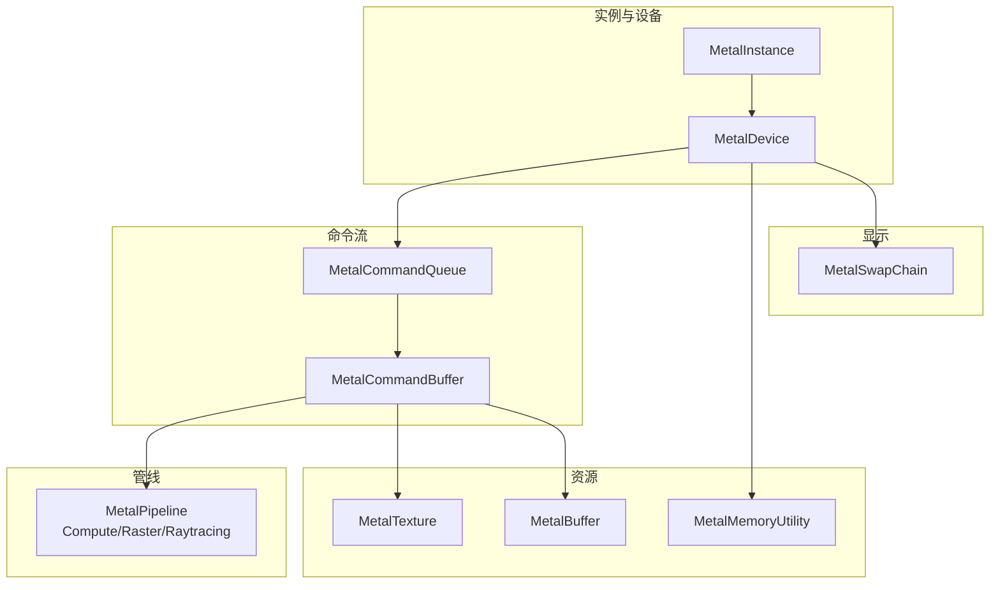
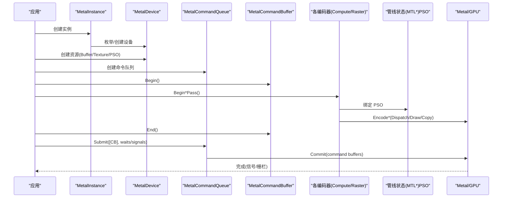
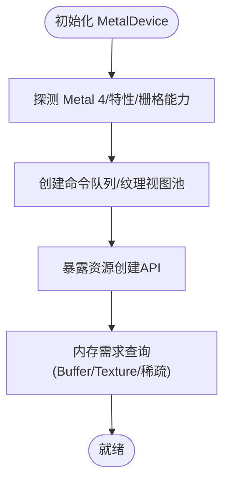
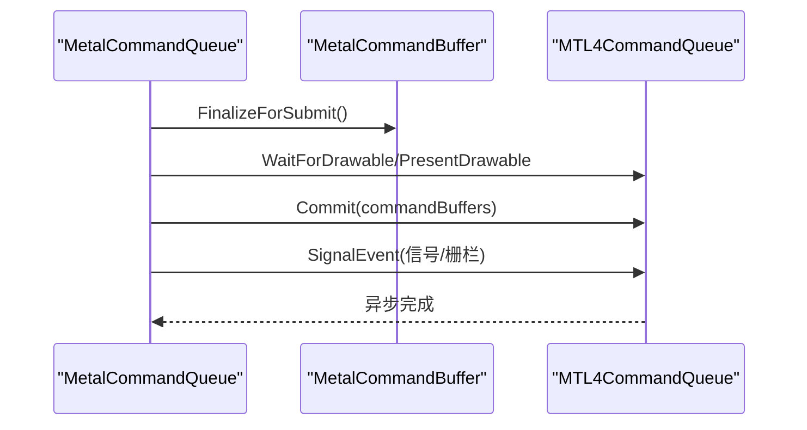
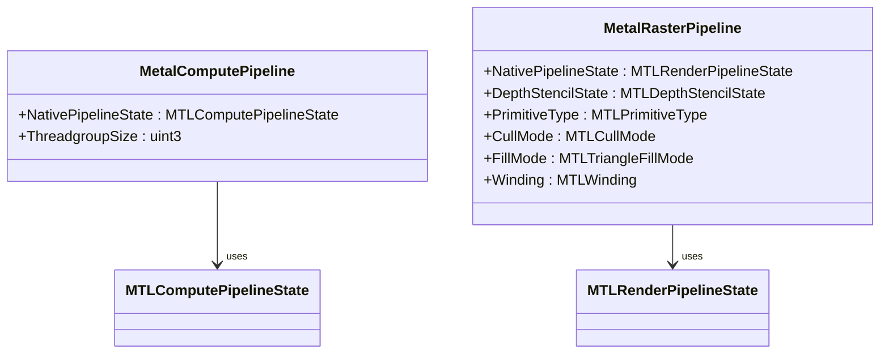
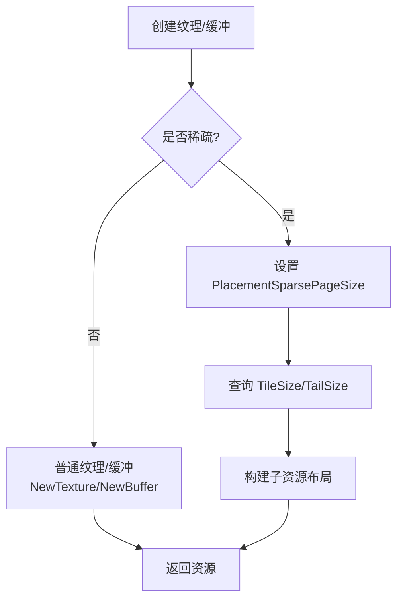
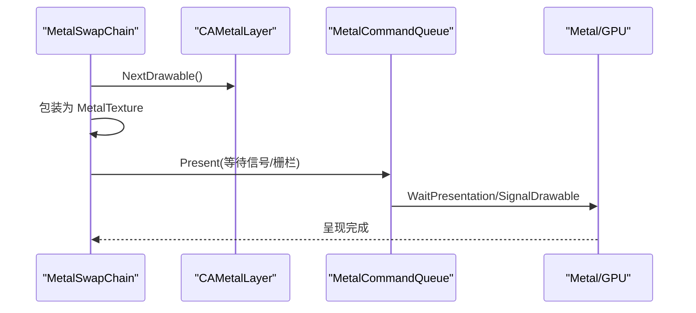
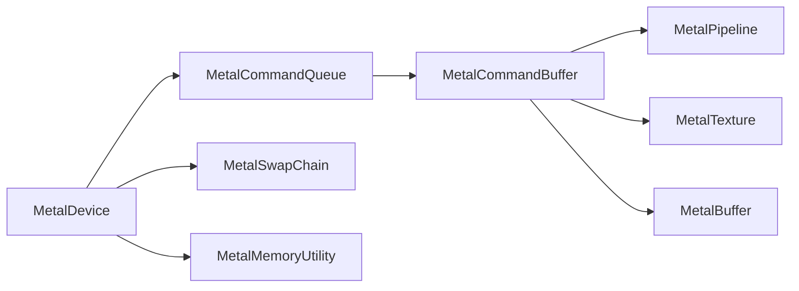

# Metal 后端

<cite>
**本文引用的文件**
- [MetalDevice.cs](file://src/SharpGPU/Metal/MetalDevice.cs)
- [MetalInstance.cs](file://src/SharpGPU/Metal/MetalInstance.cs)
- [MetalCommandQueue.cs](file://src/SharpGPU/Metal/MetalCommandQueue.cs)
- [MetalCommandBuffer.cs](file://src/SharpGPU/Metal/MetalCommandBuffer.cs)
- [MetalPipeline.cs](file://src/SharpGPU/Metal/MetalPipeline.cs)
- [MetalTexture.cs](file://src/SharpGPU/Metal/MetalTexture.cs)
- [MetalBuffer.cs](file://src/SharpGPU/Metal/MetalBuffer.cs)
- [MetalMemory.cs](file://src/SharpGPU/Metal/MetalMemory.cs)
- [MetalUtility.cs](file://src/SharpGPU/Metal/MetalUtility.cs)
- [MetalSwapChain.cs](file://src/SharpGPU/Metal/MetalSwapChain.cs)
</cite>

## 目录
1. [简介](#简介)
2. [项目结构](#项目结构)
3. [核心组件](#核心组件)
4. [架构总览](#架构总览)
5. [详细组件分析](#详细组件分析)
6. [依赖关系分析](#依赖关系分析)
7. [性能与调试](#性能与调试)
8. [故障排查指南](#故障排查指南)
9. [结论](#结论)
10. [附录：配置与最佳实践](#附录：配置与最佳实践)

## 简介
本文件面向使用 SharpGPU 的开发者，系统性阐述 Metal 后端的实现细节与使用要点。重点覆盖：
- 设备发现、上下文管理与资源生命周期
- Metal 特有对象（MTLDevice、MTLCommandQueue、MTLRenderPipelineState、MTLComputePipelineState）的使用方式
- 内存管理模型、纹理格式支持与计算着色器流程
- 平台相关优化（iOS/macOS）、常见问题与最佳实践

## 项目结构
Metal 后端位于 src/SharpGPU/Metal 命名空间下，围绕 RHI 抽象层提供具体实现。关键文件职责如下：
- MetalInstance：设备枚举与默认设备创建
- MetalDevice：设备能力探测、队列与资源工厂
- MetalCommandQueue / MetalCommandBuffer：命令提交、同步原语与编码器生命周期
- MetalPipeline：计算/光栅管线状态构建
- MetalTexture / MetalBuffer / MetalMemory：资源创建、内存选项与稀疏纹理支持
- MetalUtility：类型转换与常量映射
- MetalSwapChain：CAMetalLayer 绑定、呈现与尺寸调整

**图示来源**
- [MetalInstance.cs:16-54](file://src/SharpGPU/Metal/MetalInstance.cs#L16-L54)
- [MetalDevice.cs:55-95](file://src/SharpGPU/Metal/MetalDevice.cs#L55-L95)
- [MetalCommandQueue.cs:26-41](file://src/SharpGPU/Metal/MetalCommandQueue.cs#L26-L41)
- [MetalCommandBuffer.cs:37-48](file://src/SharpGPU/Metal/MetalCommandBuffer.cs#L37-L48)
- [MetalPipeline.cs:100-142](file://src/SharpGPU/Metal/MetalPipeline.cs#L100-L142)
- [MetalTexture.cs:23-48](file://src/SharpGPU/Metal/MetalTexture.cs#L23-L48)
- [MetalBuffer.cs:31-48](file://src/SharpGPU/Metal/MetalBuffer.cs#L31-L48)
- [MetalMemory.cs:22-87](file://src/SharpGPU/Metal/MetalMemory.cs#L22-L87)
- [MetalSwapChain.cs:52-78](file://src/SharpGPU/Metal/MetalSwapChain.cs#L52-L78)

**章节来源**
- [MetalInstance.cs:16-54](file://src/SharpGPU/Metal/MetalInstance.cs#L16-L54)
- [MetalDevice.cs:55-95](file://src/SharpGPU/Metal/MetalDevice.cs#L55-L95)

## 核心组件
- 设备与实例
  - MetalInstance：枚举系统所有 MTLDevice，若无可用则回退到默认设备；持有设备列表并负责释放。
  - MetalDevice：封装 MTLDevice，探测 Metal 4 能力、栅格能力、时间戳查询可用性；创建命令队列、纹理视图池；提供资源创建接口（Buffer/Texture/Heap/SwapChain/Fence/Semaphore/Query）。
- 命令系统
  - MetalCommandQueue：基于 MTL4CommandQueue 提交命令缓冲；维护 MTLResidencySet 提升驻留效率；处理等待/信号事件与可绘制对象同步。
  - MetalCommandBuffer：封装 MTL4CommandBuffer/Allocator；统一管理 Transfer/Compute/Raster/Raytracing/ML 编码器；记录阶段可见性以决定屏障粒度。
- 管线
  - MetalComputePipeline：通过 MTLComputePipelineDescriptor 创建 MTLComputePipelineState。
  - MetalRasterPipeline：通过 MTL4RenderPipelineDescriptor + MTL4Compiler 创建 MTLRenderPipelineState，并配置顶点描述、颜色/深度附件、混合等。
- 资源
  - MetalTexture/MetalBuffer：分别包装 MTLTexture/MTLBuffer；支持放置式分配与外部所有权；纹理支持稀疏纹理与要求查询。
  - MetalMemoryUtility：统一将 RHI 描述转换为 MTL 描述（存储模式、用途、维度、采样数等），并校验参数。
- 交换链
  - MetalSwapChain：创建并配置 CAMetalLayer，绑定 AppKit/UIView，处理获取/呈现/调整大小，并与命令队列进行同步。

**章节来源**
- [MetalDevice.cs:55-95](file://src/SharpGPU/Metal/MetalDevice.cs#L55-L95)
- [MetalCommandQueue.cs:26-41](file://src/SharpGPU/Metal/MetalCommandQueue.cs#L26-L41)
- [MetalCommandBuffer.cs:37-48](file://src/SharpGPU/Metal/MetalCommandBuffer.cs#L37-L48)
- [MetalPipeline.cs:100-142](file://src/SharpGPU/Metal/MetalPipeline.cs#L100-L142)
- [MetalPipeline.cs:457-585](file://src/SharpGPU/Metal/MetalPipeline.cs#L457-L585)
- [MetalTexture.cs:23-48](file://src/SharpGPU/Metal/MetalTexture.cs#L23-L48)
- [MetalBuffer.cs:31-48](file://src/SharpGPU/Metal/MetalBuffer.cs#L31-L48)
- [MetalMemory.cs:22-87](file://src/SharpGPU/Metal/MetalMemory.cs#L22-L87)
- [MetalSwapChain.cs:52-78](file://src/SharpGPU/Metal/MetalSwapChain.cs#L52-L78)

## 架构总览
下图展示了从应用调用到 GPU 执行的端到端路径，以及关键 Metal 对象的协作关系。

**图示来源**
- [MetalInstance.cs:16-54](file://src/SharpGPU/Metal/MetalInstance.cs#L16-L54)
- [MetalDevice.cs:55-95](file://src/SharpGPU/Metal/MetalDevice.cs#L55-L95)
- [MetalCommandQueue.cs:71-181](file://src/SharpGPU/Metal/MetalCommandQueue.cs#L71-L181)
- [MetalCommandBuffer.cs:50-167](file://src/SharpGPU/Metal/MetalCommandBuffer.cs#L50-L167)
- [MetalPipeline.cs:100-142](file://src/SharpGPU/Metal/MetalPipeline.cs#L100-L142)
- [MetalPipeline.cs:457-585](file://src/SharpGPU/Metal/MetalPipeline.cs#L457-L585)

## 详细组件分析

### 设备发现与上下文管理（MetalInstance / MetalDevice）
- 设备发现
  - 尝试 CopyAllDevices；若为空则创建默认设备；最终至少保留一个可用设备。
- 设备能力
  - 检测 Metal 4、原生参数表、Placement Sparse、时间戳查询不可用原因等。
  - 探测栅格能力（MSAA、渲染目标创建可行性）。
- 上下文与队列
  - 构造时创建图形/计算/传输队列与纹理视图池。
  - 提供 GetCommandQueue、CreateSwapChain/CreateFence/CreateSemaphore/CreateStorageQueue/CreateQuery/CreateHeap 等工厂方法。
- 资源需求查询
  - 为 Buffer/Texture/稀疏纹理提供 HeapBufferSizeAndAlign/HeapTextureSizeAndAlign/SparseTileSizeInBytes 等查询，返回统一的内存需求。

**图示来源**
- [MetalInstance.cs:16-54](file://src/SharpGPU/Metal/MetalInstance.cs#L16-L54)
- [MetalDevice.cs:55-95](file://src/SharpGPU/Metal/MetalDevice.cs#L55-L95)
- [MetalDevice.cs:245-319](file://src/SharpGPU/Metal/MetalDevice.cs#L245-L319)

**章节来源**
- [MetalInstance.cs:16-54](file://src/SharpGPU/Metal/MetalInstance.cs#L16-L54)
- [MetalDevice.cs:55-95](file://src/SharpGPU/Metal/MetalDevice.cs#L55-L95)
- [MetalDevice.cs:245-319](file://src/SharpGPU/Metal/MetalDevice.cs#L245-L319)

### 命令队列与命令缓冲（MetalCommandQueue / MetalCommandBuffer）
- 提交流程
  - 验证等待/信号/完成栅栏类型；收集命令缓冲指针；对可绘制对象执行 WaitForDrawable；Commit 提交；随后 SignalEvent 信号化。
  - 使用 MTLResidencySet 跟踪资源驻留，减少换页开销。
- 屏障策略
  - 在编码器内追踪已产生工作的阶段位，用于选择 Intra-encoder 或 Cross-encoder 屏障。
- 命令缓冲生命周期
  - Begin/End 控制 MTL4CommandBuffer 编码；Begin*Pass 打开对应编码器；FinalizeForSubmit 确保未提前结束。

**图示来源**
- [MetalCommandQueue.cs:71-181](file://src/SharpGPU/Metal/MetalCommandQueue.cs#L71-L181)
- [MetalCommandBuffer.cs:246-255](file://src/SharpGPU/Metal/MetalCommandBuffer.cs#L246-L255)

**章节来源**
- [MetalCommandQueue.cs:71-181](file://src/SharpGPU/Metal/MetalCommandQueue.cs#L71-L181)
- [MetalCommandBuffer.cs:50-167](file://src/SharpGPU/Metal/MetalCommandBuffer.cs#L50-L167)

### 管线状态（MTLRenderPipelineState / MTLComputePipelineState）
- 计算管线
  - 使用 MTLComputePipelineDescriptor 指定 ComputeFunction，启用间接命令缓冲支持，创建 MTLComputePipelineState。
- 光栅管线
  - 使用 MTL4RenderPipelineDescriptor + MTL4Compiler 创建 MTLRenderPipelineState；配置顶点描述、颜色附件像素格式与混合、深度/模板状态、图元拓扑等。
- 光线追踪管线
  - 基于 Compute Pipeline 组织 Ray Generation/Miss/Callable/HitGroup，链接可见函数与相交函数。

**图示来源**
- [MetalPipeline.cs:100-142](file://src/SharpGPU/Metal/MetalPipeline.cs#L100-L142)
- [MetalPipeline.cs:457-585](file://src/SharpGPU/Metal/MetalPipeline.cs#L457-L585)

**章节来源**
- [MetalPipeline.cs:100-142](file://src/SharpGPU/Metal/MetalPipeline.cs#L100-L142)
- [MetalPipeline.cs:457-585](file://src/SharpGPU/Metal/MetalPipeline.cs#L457-L585)

### 内存管理与纹理格式
- 内存选项
  - 将 RHI 存储模式映射为 MTLResourceOptions/MTLStorageMode；上传路径使用 WriteCombined 缓存模式。
- 纹理描述
  - 严格校验维度、采样数、格式、MipCount 与范围；按用途组合 MTLTextureUsage。
- 稀疏纹理
  - Placement-Sparse 仅支持 GPU-Local、单采样、Color Aspect 的 2D/3D；查询 TileSize/TailSize 并生成子资源布局。
- 缓冲区
  - 支持放置式分配；GPULocal/Memoryless 不可映射；Managed 模式下需 DidModifyRange 通知。

**图示来源**
- [MetalMemory.cs:22-87](file://src/SharpGPU/Metal/MetalMemory.cs#L22-L87)
- [MetalMemory.cs:171-217](file://src/SharpGPU/Metal/MetalMemory.cs#L171-L217)
- [MetalMemory.cs:219-341](file://src/SharpGPU/Metal/MetalMemory.cs#L219-L341)
- [MetalBuffer.cs:85-120](file://src/SharpGPU/Metal/MetalBuffer.cs#L85-L120)

**章节来源**
- [MetalMemory.cs:22-87](file://src/SharpGPU/Metal/MetalMemory.cs#L22-L87)
- [MetalMemory.cs:171-217](file://src/SharpGPU/Metal/MetalMemory.cs#L171-L217)
- [MetalMemory.cs:219-341](file://src/SharpGPU/Metal/MetalMemory.cs#L219-L341)
- [MetalBuffer.cs:85-120](file://src/SharpGPU/Metal/MetalBuffer.cs#L85-L120)

### 交换链与呈现（MetalSwapChain）
- 层与表面
  - 创建 CAMetalLayer 并绑定到 NSView/UIView；根据内容比例设置 ContentsScale。
- 获取与呈现
  - NextDrawable 获取可绘制对象，包装为 MetalTexture；Present 前等待同步原语；完成后清理帧状态。
- 调整大小
  - 更新 DrawableSize 与 Layer Frame；必要时重建 Layer 并重新附着。

**图示来源**
- [MetalSwapChain.cs:52-78](file://src/SharpGPU/Metal/MetalSwapChain.cs#L52-L78)
- [MetalSwapChain.cs:464-517](file://src/SharpGPU/Metal/MetalSwapChain.cs#L464-L517)
- [MetalSwapChain.cs:619-670](file://src/SharpGPU/Metal/MetalSwapChain.cs#L619-L670)

**章节来源**
- [MetalSwapChain.cs:52-78](file://src/SharpGPU/Metal/MetalSwapChain.cs#L52-L78)
- [MetalSwapChain.cs:464-517](file://src/SharpGPU/Metal/MetalSwapChain.cs#L464-L517)
- [MetalSwapChain.cs:619-670](file://src/SharpGPU/Metal/MetalSwapChain.cs#L619-L670)

## 依赖关系分析
- 强依赖
  - MetalDevice 依赖 MTLDevice 进行能力探测与资源创建。
  - MetalCommandQueue 依赖 MTL4CommandQueue 与 MTLResidencySet。
  - MetalCommandBuffer 依赖 MTL4CommandBuffer/Allocator 与各编码器。
  - MetalPipeline 依赖 MTLComputePipelineState/MTLRenderPipelineState。
  - MetalTexture/MetalBuffer 依赖 MTLTexture/MTLBuffer。
  - MetalSwapChain 依赖 CAMetalLayer 及平台视图对象。
- 耦合点
  - 所有资源均通过 MetalDevice 创建，保证同设备一致性。
  - 命令提交顺序与同步原语（事件/栅栏）贯穿队列与交换链。

**图示来源**
- [MetalDevice.cs:55-95](file://src/SharpGPU/Metal/MetalDevice.cs#L55-L95)
- [MetalCommandQueue.cs:26-41](file://src/SharpGPU/Metal/MetalCommandQueue.cs#L26-L41)
- [MetalCommandBuffer.cs:37-48](file://src/SharpGPU/Metal/MetalCommandBuffer.cs#L37-L48)
- [MetalPipeline.cs:100-142](file://src/SharpGPU/Metal/MetalPipeline.cs#L100-L142)
- [MetalTexture.cs:23-48](file://src/SharpGPU/Metal/MetalTexture.cs#L23-L48)
- [MetalBuffer.cs:31-48](file://src/SharpGPU/Metal/MetalBuffer.cs#L31-L48)
- [MetalSwapChain.cs:52-78](file://src/SharpGPU/Metal/MetalSwapChain.cs#L52-L78)

**章节来源**
- [MetalDevice.cs:55-95](file://src/SharpGPU/Metal/MetalDevice.cs#L55-L95)
- [MetalCommandQueue.cs:26-41](file://src/SharpGPU/Metal/MetalCommandQueue.cs#L26-L41)
- [MetalCommandBuffer.cs:37-48](file://src/SharpGPU/Metal/MetalCommandBuffer.cs#L37-L48)
- [MetalPipeline.cs:100-142](file://src/SharpGPU/Metal/MetalPipeline.cs#L100-L142)
- [MetalTexture.cs:23-48](file://src/SharpGPU/Metal/MetalTexture.cs#L23-L48)
- [MetalBuffer.cs:31-48](file://src/SharpGPU/Metal/MetalBuffer.cs#L31-L48)
- [MetalSwapChain.cs:52-78](file://src/SharpGPU/Metal/MetalSwapChain.cs#L52-L78)

## 性能与调试
- 性能要点
  - 使用 MTLResidencySet 注册资源，减少频繁换页；队列侧集中管理驻留集合。
  - 合理设置纹理用途（ShaderRead/Write/RenderTarget）与存储模式（Private/Shared/Managed/Memoryless）。
  - 使用放置式分配（Heap）聚合资源，降低碎片与对齐开销。
  - 光栅管线中正确设置 AlphaToCoverage、混合与写入掩码，避免多余写操作。
  - 交换链使用 DisplaySyncEnabled 与 AllowsNextDrawableTimeout 控制呈现时机。
- 调试建议
  - 为命令缓冲设置 Label，便于 Metal Tools 识别。
  - 关注队列反馈错误（如超时、设备丢失、访问被撤销），及时降级或恢复。
  - 利用时间戳查询（若设备支持）评估关键路径耗时。

[本节为通用指导，不直接引用具体代码行]

## 故障排查指南
- 常见错误与定位
  - 无法创建默认设备：检查系统 Metal 驱动与权限。
  - 不支持 Metal 4/原生参数表：当前后端要求 Metal 4 与 MTL4 绑定表能力。
  - 时间戳查询不可用：设备未提供 MTL4CounterHeap 支持。
  - 交换链格式无效：非支持的呈现格式或未满足 HDR 能力。
  - 缓冲区映射失败：GPULocal/Memoryless 不可映射；Managed 需 DidModifyRange。
  - 稀疏纹理限制：仅支持 GPU-Local、单采样、Color Aspect 的 2D/3D。
- 恢复策略
  - 捕获设备丢失异常，标记设备状态并重建必要资源。
  - 对呈现失败（NotReady/Timeout）重试或调整交换链参数。
  - 对队列提交失败，回滚等待/信号预留，避免状态不一致。

**章节来源**
- [MetalInstance.cs:16-54](file://src/SharpGPU/Metal/MetalInstance.cs#L16-L54)
- [MetalDevice.cs:55-95](file://src/SharpGPU/Metal/MetalDevice.cs#L55-L95)
- [MetalDevice.cs:216-227](file://src/SharpGPU/Metal/MetalDevice.cs#L216-L227)
- [MetalSwapChain.cs:730-797](file://src/SharpGPU/Metal/MetalSwapChain.cs#L730-L797)
- [MetalBuffer.cs:85-120](file://src/SharpGPU/Metal/MetalBuffer.cs#L85-L120)
- [MetalMemory.cs:108-169](file://src/SharpGPU/Metal/MetalMemory.cs#L108-L169)

## 结论
SharpGPU 的 Metal 后端以 Metal 4 为核心，围绕 MTLDevice/MTLCommandQueue/MTLRenderPipelineState/MTLComputePipelineState 构建了完整的资源与命令体系。通过严格的参数校验、能力探测与内存模型映射，提供了稳定高效的渲染与计算路径。结合驻留集、放置式分配与交换链同步，可在 iOS/macOS 上获得良好性能与体验。

[本节为总结性内容，不直接引用具体代码行]

## 附录：配置与最佳实践
- 设备与队列
  - 优先使用 Metal 4 能力路径；确保原生参数表可用。
  - 为不同任务（图形/计算/传输）使用独立队列，减少交叉阻塞。
- 资源与内存
  - 纹理用途尽量精确，避免过度标记导致额外拷贝。
  - 大纹理使用放置式分配与稀疏纹理（满足条件时）。
  - 上传/读回使用 HostUpload/Readback 存储模式，注意 Managed 模式的 DidModifyRange。
- 管线与着色器
  - 光栅管线中按需开启 AlphaToCoverage 与混合；正确设置深度/模板比较与操作。
  - 计算管线启用间接命令缓冲支持以提升批量效率。
- 呈现
  - 交换链帧数建议 2-3；DisplaySyncEnabled 与 AllowsNextDrawableTimeout 配合以获得平滑呈现。
  - 在 UIKit/AppKit 上正确设置图层内容与缩放因子。
- 调试与性能
  - 为命令缓冲命名；使用时间戳查询评估热点。
  - 关注队列反馈错误，及时处理设备丢失与超时。

[本节为通用指导，不直接引用具体代码行]