# Vulkan 后端

<cite>
**本文引用的文件**
- [VulkanDevice.cs](file://src/SharpGPU/Vulkan/VulkanDevice.cs)
- [VulkanInstance.cs](file://src/SharpGPU/Vulkan/VulkanInstance.cs)
- [VulkanCommandQueue.cs](file://src/SharpGPU/Vulkan/VulkanCommandQueue.cs)
- [VulkanCommandBuffer.cs](file://src/SharpGPU/Vulkan/VulkanCommandBuffer.cs)
- [VulkanMemory.cs](file://src/SharpGPU/Vulkan/VulkanMemory.cs)
- [VulkanPipeline.cs](file://src/SharpGPU/Vulkan/VulkanPipeline.cs)
- [VulkanUtility.cs](file://src/SharpGPU/Vulkan/VulkanUtility.cs)
- [VulkanBindingTable.cs](file://src/SharpGPU/Vulkan/VulkanBindingTable.cs)
</cite>

## 更新摘要
**变更内容**
- 新增统一描述符绑定方法实现，包含描述符池分页和"2倍浪费超集共享"模型
- 更新了描述符分配器架构，支持更高效的资源共享机制
- 增强了描述符池策略，优化了内存使用和资源利用率
- 改进了描述符集租约管理，提供更好的生命周期控制

## 目录
1. [简介](#简介)
2. [项目结构](#项目结构)
3. [核心组件](#核心组件)
4. [架构总览](#架构总览)
5. [详细组件分析](#详细组件分析)
6. [依赖关系分析](#依赖关系分析)
7. [性能考量](#性能考量)
8. [故障排查指南](#故障排查指南)
9. [结论](#结论)
10. [附录](#附录)

## 简介
本文件面向 SharpGPU 的 Vulkan 后端，系统性阐述从实例创建、物理设备枚举、逻辑设备与队列管理，到命令缓冲录制与提交、管线状态对象、描述符集布局、内存分配与着色器模块管理的完整实现。特别关注最新的统一描述符绑定方法实现，包括描述符池分页和"2倍浪费超集共享"模型，为更好的表间资源共享提供技术支持。同时覆盖验证层使用、性能分析工具集成点、跨平台兼容性处理，以及针对 Vulkan 的配置选项、错误诊断与优化建议。

## 项目结构
Vulkan 后端位于 src/SharpGPU/Vulkan 目录下，围绕以下关键文件组织：
- 实例与设备生命周期：VulkanInstance.cs、VulkanDevice.cs
- 命令与同步：VulkanCommandQueue.cs、VulkanCommandBuffer.cs
- 资源与内存：VulkanMemory.cs（含堆、稀疏纹理、预算查询）
- 管线与着色器：VulkanPipeline.cs（计算/光栅管线、布局、私有绑定）
- 描述符绑定系统：VulkanBindingTable.cs（统一描述符绑定、池分页、共享策略）
- 通用转换与工具：VulkanUtility.cs（格式/阶段/访问标志转换、错误封装、平台检测）

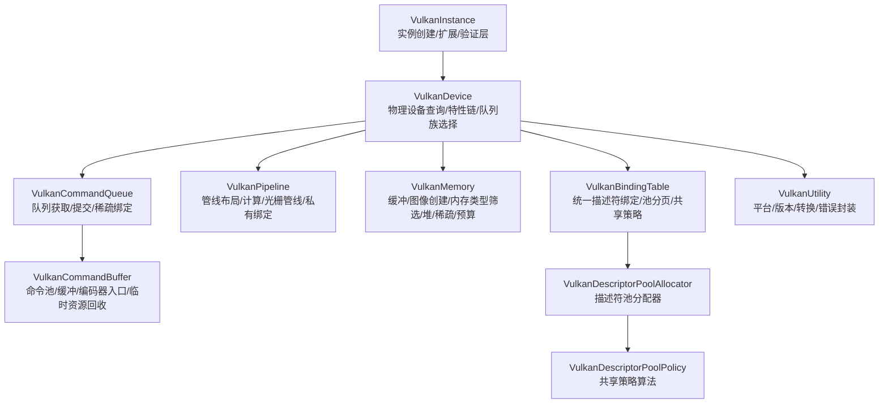

**图表来源**
- [VulkanInstance.cs:74-418](file://src/SharpGPU/Vulkan/VulkanInstance.cs#L74-L418)
- [VulkanDevice.cs:182-800](file://src/SharpGPU/Vulkan/VulkanDevice.cs#L182-L800)
- [VulkanCommandQueue.cs:46-158](file://src/SharpGPU/Vulkan/VulkanCommandQueue.cs#L46-L158)
- [VulkanCommandBuffer.cs:43-80](file://src/SharpGPU/Vulkan/VulkanCommandBuffer.cs#L43-L80)
- [VulkanPipeline.cs:32-177](file://src/SharpGPU/Vulkan/VulkanPipeline.cs#L32-L177)
- [VulkanMemory.cs:9-127](file://src/SharpGPU/Vulkan/VulkanMemory.cs#L9-L127)
- [VulkanBindingTable.cs:1222-1558](file://src/SharpGPU/Vulkan/VulkanBindingTable.cs#L1222-L1558)
- [VulkanUtility.cs:27-121](file://src/SharpGPU/Vulkan/VulkanUtility.cs#L27-L121)

**章节来源**
- [VulkanInstance.cs:74-418](file://src/SharpGPU/Vulkan/VulkanInstance.cs#L74-L418)
- [VulkanDevice.cs:182-800](file://src/SharpGPU/Vulkan/VulkanDevice.cs#L182-L800)

## 核心组件
- VulkanInstance：负责加载 Vulkan 库、枚举实例扩展与层、根据表面类型启用必要扩展、创建 VkInstance 并枚举物理设备。
- VulkanDevice：查询物理设备属性与能力、构建特性链、选择队列族并创建逻辑设备、维护描述符限制与动态渲染/同步等特性开关。
- VulkanCommandQueue：封装 VkQueue，提供提交与稀疏绑定接口，完成等待/信号语义映射与错误回滚。
- VulkanCommandBuffer：管理命令池与缓冲，提供传输/计算/光栅/光线追踪编码入口，维护图像布局覆盖与临时资源回收。
- VulkanPipeline：创建管线布局、计算管线与光栅管线，支持动态渲染、私有绑定布局与兼容变体。
- VulkanMemory：缓冲/图像创建信息构造、内存类型筛选、堆分配与映射、稀疏纹理需求查询与绑定、内存预算查询。
- **VulkanBindingTable**：**统一描述符绑定系统，包含描述符池分页、共享策略和租约管理**。
- VulkanUtility：平台检测、版本计算、RHI 与 Vulkan 类型转换、统一错误封装。

**章节来源**
- [VulkanInstance.cs:74-418](file://src/SharpGPU/Vulkan/VulkanInstance.cs#L74-L418)
- [VulkanDevice.cs:182-800](file://src/SharpGPU/Vulkan/VulkanDevice.cs#L182-L800)
- [VulkanCommandQueue.cs:46-158](file://src/SharpGPU/Vulkan/VulkanCommandQueue.cs#L46-L158)
- [VulkanCommandBuffer.cs:43-80](file://src/SharpGPU/Vulkan/VulkanCommandBuffer.cs#L43-L80)
- [VulkanPipeline.cs:32-177](file://src/SharpGPU/Vulkan/VulkanPipeline.cs#L32-L177)
- [VulkanMemory.cs:9-127](file://src/SharpGPU/Vulkan/VulkanMemory.cs#L9-L127)
- [VulkanBindingTable.cs:1222-1558](file://src/SharpGPU/Vulkan/VulkanBindingTable.cs#L1222-L1558)
- [VulkanUtility.cs:27-121](file://src/SharpGPU/Vulkan/VulkanUtility.cs#L27-L121)

## 架构总览
下图展示了从应用调用到 GPU 执行的端到端流程，涵盖实例初始化、设备选择、队列与命令缓冲、管线与内存资源、描述符绑定系统、提交与同步。

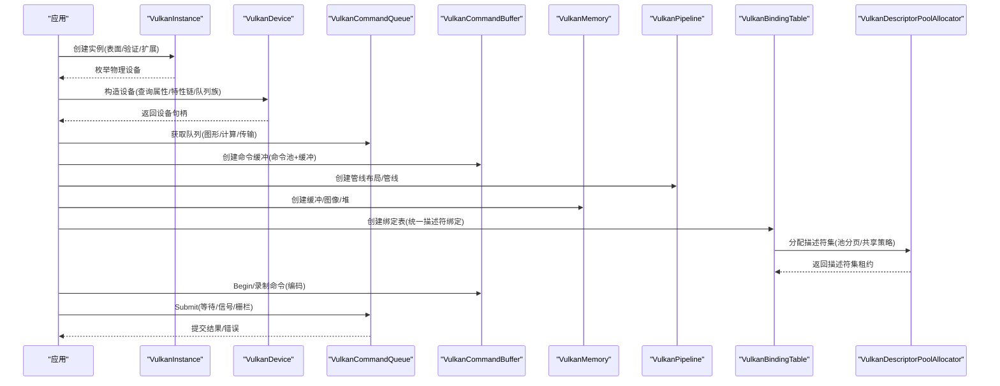

**图表来源**
- [VulkanInstance.cs:74-418](file://src/SharpGPU/Vulkan/VulkanInstance.cs#L74-L418)
- [VulkanDevice.cs:182-800](file://src/SharpGPU/Vulkan/VulkanDevice.cs#L182-L800)
- [VulkanCommandQueue.cs:46-158](file://src/SharpGPU/Vulkan/VulkanCommandQueue.cs#L46-L158)
- [VulkanCommandBuffer.cs:43-80](file://src/SharpGPU/Vulkan/VulkanCommandBuffer.cs#L43-L80)
- [VulkanPipeline.cs:32-177](file://src/SharpGPU/Vulkan/VulkanPipeline.cs#L32-L177)
- [VulkanMemory.cs:9-127](file://src/SharpGPU/Vulkan/VulkanMemory.cs#L9-L127)
- [VulkanBindingTable.cs:1222-1558](file://src/SharpGPU/Vulkan/VulkanBindingTable.cs#L1222-L1558)

## 详细组件分析

### VulkanInstance：实例创建、扩展与验证层
- 扩展检查：根据表面类型要求 VK_KHR_surface 及对应平台扩展；可选启用 portability enumeration。
- 验证层：当启用验证时，要求 VK_EXT_debug_utils，并注入 Khronos 验证层。
- 实例创建：设置应用/引擎信息、API 版本、扩展与层指针，创建 VkInstance 并挂载调试消息回调。
- 物理设备枚举：遍历所有物理设备，按平台最低 API 版本过滤，构造 VulkanDevice。

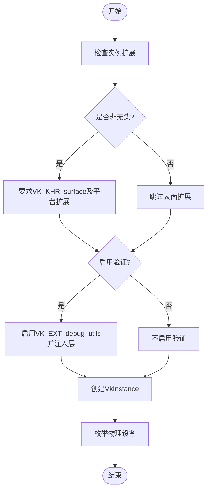

**图表来源**
- [VulkanInstance.cs:127-380](file://src/SharpGPU/Vulkan/VulkanInstance.cs#L127-L380)
- [VulkanInstance.cs:382-418](file://src/SharpGPU/Vulkan/VulkanInstance.cs#L382-L418)

**章节来源**
- [VulkanInstance.cs:127-380](file://src/SharpGPU/Vulkan/VulkanInstance.cs#L127-L380)
- [VulkanInstance.cs:382-418](file://src/SharpGPU/Vulkan/VulkanInstance.cs#L382-L418)

### VulkanDevice：物理设备查询、特性链与队列族选择
- 设备属性查询：名称、厂商/设备 ID、驱动/API 版本、设备类型判定、内存属性与基础限制。
- 特性链构建：基于实例与物理设备 API 版本，组合 V1.2/V1.3/V1.4 特性结构与扩展特性（如动态渲染、同步2、描述符索引、深度模板解析、分离布局、局部读取等）。
- 队列族选择：识别图形/计算/传输队列族，统计各家族队列数量，生成唯一队列族集合与优先级数组，创建 VkDevice。
- 能力暴露：维护动态渲染、RenderPass2、稀疏驻留、校准时间戳、波/协同矩阵等能力标志与限制。

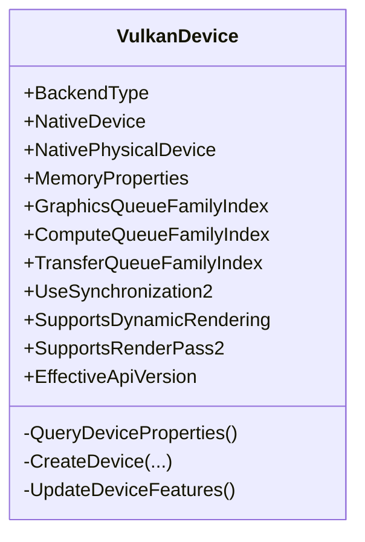

**图表来源**
- [VulkanDevice.cs:11-191](file://src/SharpGPU/Vulkan/VulkanDevice.cs#L11-L191)
- [VulkanDevice.cs:193-800](file://src/SharpGPU/Vulkan/VulkanDevice.cs#L193-L800)

**章节来源**
- [VulkanDevice.cs:193-800](file://src/SharpGPU/Vulkan/VulkanDevice.cs#L193-L800)

### VulkanCommandQueue：提交与稀疏绑定
- 队列获取：通过 vkGetDeviceQueue 获取原生队列，记录队列族索引。
- 提交流程：校验参数，将 RHI 等待/信号阶段转换为 VkPipelineStageFlags，构建 VkSubmitInfo 并提交，异常时回滚并标记设备丢失。
- 稀疏绑定：校验队列族支持，构建 VkBindSparseInfo，包含图像块与尾部分配绑定，提交后清理或标记设备丢失。

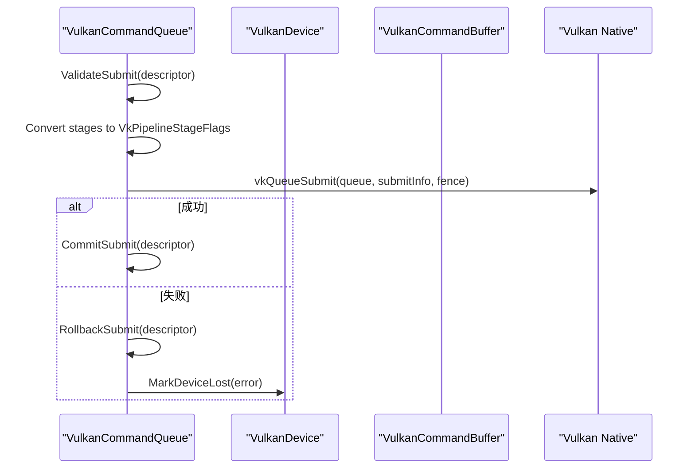

**图表来源**
- [VulkanCommandQueue.cs:63-158](file://src/SharpGPU/Vulkan/VulkanCommandQueue.cs#L63-L158)
- [VulkanCommandQueue.cs:160-369](file://src/SharpGPU/Vulkan/VulkanCommandQueue.cs#L160-L369)

**章节来源**
- [VulkanCommandQueue.cs:63-158](file://src/SharpGPU/Vulkan/VulkanCommandQueue.cs#L63-L158)
- [VulkanCommandQueue.cs:160-369](file://src/SharpGPU/Vulkan/VulkanCommandQueue.cs#L160-L369)

### VulkanCommandBuffer：命令缓冲录制与临时资源管理
- 命令池与缓冲：为每个命令缓冲创建独立命令池与主级缓冲，复用队列族。
- 录制入口：Begin/End 封装 vkBeginCommandBuffer/vkEndCommandBuffer；提供传输/计算/光栅/光线追踪 Pass 的 Begin/End。
- 图像布局覆盖：维护子资源布局状态，支持检查、要求已知布局、设置布局与回滚。
- 临时资源：注册并回收临时分配、视图、帧缓冲、渲染通道、描述符集租约与光栅管线变体，确保异常路径下可安全回滚。

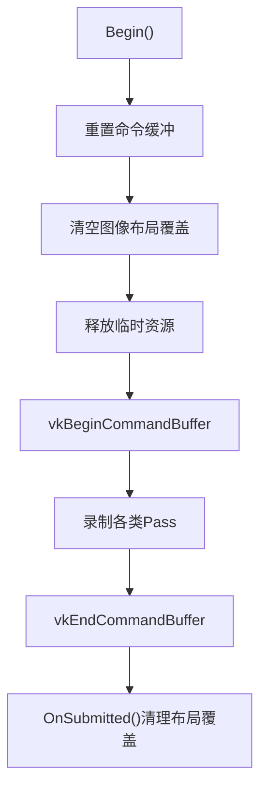

**图表来源**
- [VulkanCommandBuffer.cs:43-98](file://src/SharpGPU/Vulkan/VulkanCommandBuffer.cs#L43-L98)
- [VulkanCommandBuffer.cs:100-194](file://src/SharpGPU/Vulkan/VulkanCommandBuffer.cs#L100-L194)
- [VulkanCommandBuffer.cs:196-330](file://src/SharpGPU/Vulkan/VulkanCommandBuffer.cs#L196-L330)
- [VulkanCommandBuffer.cs:441-555](file://src/SharpGPU/Vulkan/VulkanCommandBuffer.cs#L441-L555)

**章节来源**
- [VulkanCommandBuffer.cs:43-98](file://src/SharpGPU/Vulkan/VulkanCommandBuffer.cs#L43-L98)
- [VulkanCommandBuffer.cs:100-194](file://src/SharpGPU/Vulkan/VulkanCommandBuffer.cs#L100-L194)
- [VulkanCommandBuffer.cs:196-330](file://src/SharpGPU/Vulkan/VulkanCommandBuffer.cs#L196-L330)
- [VulkanCommandBuffer.cs:441-555](file://src/SharpGPU/Vulkan/VulkanCommandBuffer.cs#L441-L555)

### VulkanPipeline：管线状态对象与描述符集布局
- 管线布局：聚合多个绑定表布局，构建 VkDescriptorSetLayout 数组与 VkPipelineLayout，支持推常量范围。
- 计算管线：从函数获取着色器阶段信息，创建 VkComputePipelineCreateInfo 并通过缓存或原生创建管线。
- 光栅管线：组装顶点输入、输入装配、视口/裁剪、光栅化、多重采样、深度模板、颜色混合、动态状态、动态渲染附件映射；必要时创建私有绑定布局与有效管线布局；支持 RenderPass 兼容变体。

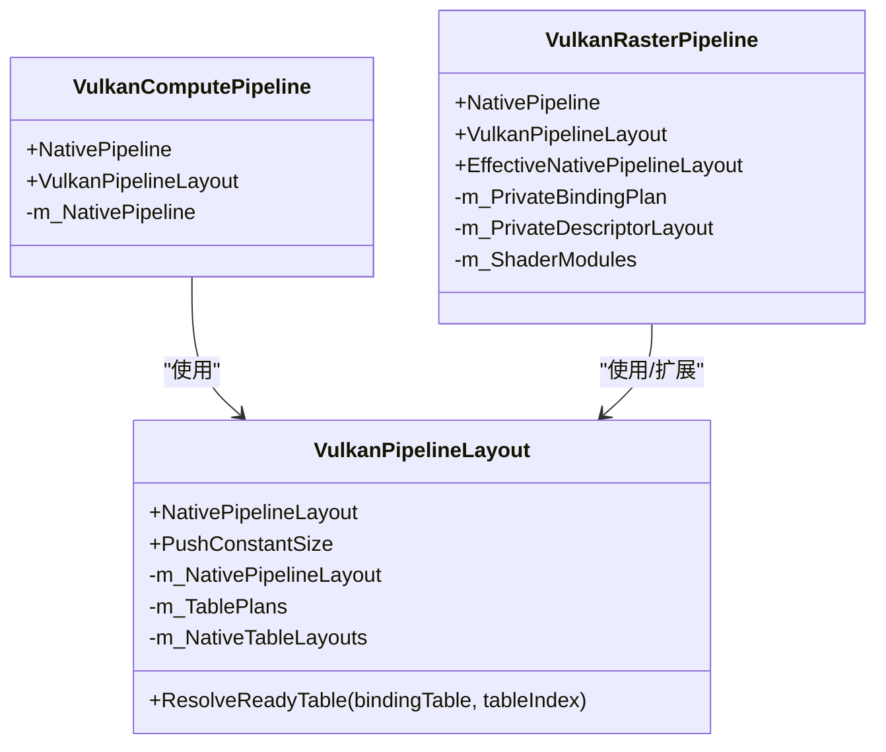

**图表来源**
- [VulkanPipeline.cs:10-177](file://src/SharpGPU/Vulkan/VulkanPipeline.cs#L10-L177)
- [VulkanPipeline.cs:238-310](file://src/SharpGPU/Vulkan/VulkanPipeline.cs#L238-L310)
- [VulkanPipeline.cs:312-742](file://src/SharpGPU/Vulkan/VulkanPipeline.cs#L312-L742)

**章节来源**
- [VulkanPipeline.cs:10-177](file://src/SharpGPU/Vulkan/VulkanPipeline.cs#L10-L177)
- [VulkanPipeline.cs:238-310](file://src/SharpGPU/Vulkan/VulkanPipeline.cs#L238-L310)
- [VulkanPipeline.cs:312-742](file://src/SharpGPU/Vulkan/VulkanPipeline.cs#L312-L742)

### VulkanMemory：内存分配、堆与稀疏纹理
- 缓冲/图像创建：校验描述符，转换用途与格式，构建 VkBufferCreateInfo/VkImageCreateInfo。
- 内存类型筛选：依据存储模式与资源需求，筛选兼容的 VkMemoryPropertyFlags 并抛出不可用异常。
- 堆与映射：分配 VkDeviceMemory，支持共享映射、失效/刷新、引用计数与释放；在析构中确保正确解映射与释放。
- 稀疏纹理：验证稀疏约束（仅 GPU 本地、单采样、维度限制），查询 VkSparseImageMemoryRequirements，构建子资源瓦片与 mip-tail 信息，用于后续绑定。
- 内存预算：通过 VK_EXT_memory_budget 查询堆预算与使用量，聚合选中的堆并返回 RHIMemoryBudget。

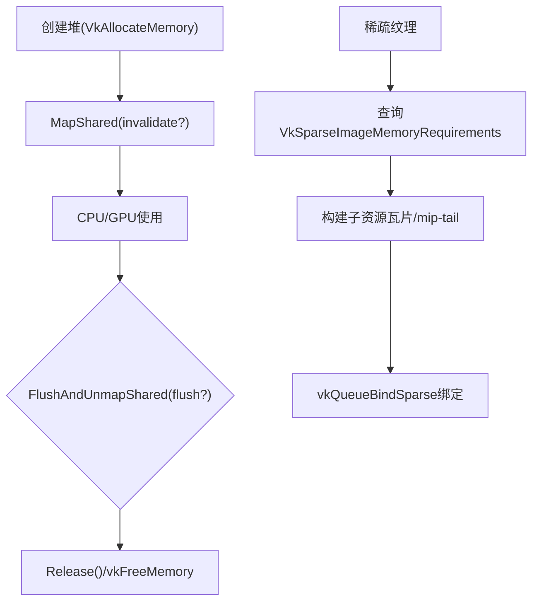

**图表来源**
- [VulkanMemory.cs:9-127](file://src/SharpGPU/Vulkan/VulkanMemory.cs#L9-L127)
- [VulkanMemory.cs:133-370](file://src/SharpGPU/Vulkan/VulkanMemory.cs#L133-L370)
- [VulkanMemory.cs:376-533](file://src/SharpGPU/Vulkan/VulkanMemory.cs#L376-L533)
- [VulkanMemory.cs:539-728](file://src/SharpGPU/Vulkan/VulkanMemory.cs#L539-L728)

**章节来源**
- [VulkanMemory.cs:9-127](file://src/SharpGPU/Vulkan/VulkanMemory.cs#L9-L127)
- [VulkanMemory.cs:133-370](file://src/SharpGPU/Vulkan/VulkanMemory.cs#L133-L370)
- [VulkanMemory.cs:376-533](file://src/SharpGPU/Vulkan/VulkanMemory.cs#L376-L533)
- [VulkanMemory.cs:539-728](file://src/SharpGPU/Vulkan/VulkanMemory.cs#L539-L728)

### VulkanBindingTable：统一描述符绑定系统与池分页

**更新** 实现了统一的描述符绑定方法，包含描述符池分页和"2倍浪费超集共享"模型，提供更好的资源共享机制。

- **统一描述符绑定**：通过 VulkanBindingTableLayout 和 VulkanBindingTable 提供一致的绑定接口，支持多种描述符类型（采样器、图像、缓冲区、加速结构等）。
- **描述符池分页**：VulkanDescriptorPoolAllocator 管理多个描述符池页面，根据描述符需求动态创建和管理页面。
- **"2倍浪费超集共享"模型**：VulkanDescriptorPoolPolicy 实现智能共享策略，允许超集页面被请求者共享，但浪费不超过2倍。
- **描述符集租约**：VulkanDescriptorSetLease 提供描述符集的租约管理，支持安全的生命周期控制和自动回收。

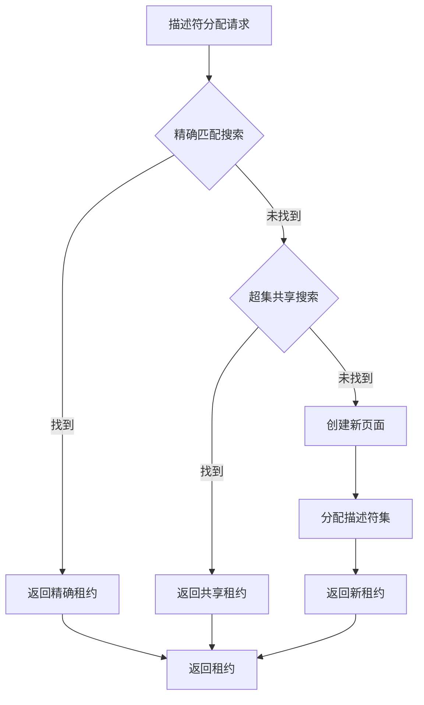

**图表来源**
- [VulkanBindingTable.cs:1255-1307](file://src/SharpGPU/Vulkan/VulkanBindingTable.cs#L1255-L1307)
- [VulkanBindingTable.cs:1368-1405](file://src/SharpGPU/Vulkan/VulkanBindingTable.cs#L1368-L1405)
- [VulkanBindingTable.cs:1407-1433](file://src/SharpGPU/Vulkan/VulkanBindingTable.cs#L1407-L1433)

**章节来源**
- [VulkanBindingTable.cs:8-83](file://src/SharpGPU/Vulkan/VulkanBindingTable.cs#L8-L83)
- [VulkanBindingTable.cs:84-647](file://src/SharpGPU/Vulkan/VulkanBindingTable.cs#L84-L647)
- [VulkanBindingTable.cs:1222-1558](file://src/SharpGPU/Vulkan/VulkanBindingTable.cs#L1222-L1558)

### VulkanDescriptorPoolPolicy：共享策略算法

**更新** 实现了"2倍浪费超集共享"模型，优化描述符池的资源利用率。

- **SetsPerPage**：根据描述符总数计算每页的描述符集数量，采用分级策略（128/32/4/1）。
- **CanSharePage**：判断页面是否可以被共享，要求页面是请求的超集且浪费不超过2倍。
- **IsSuperset**：检查页面是否包含请求的所有描述符类型且数量足够。

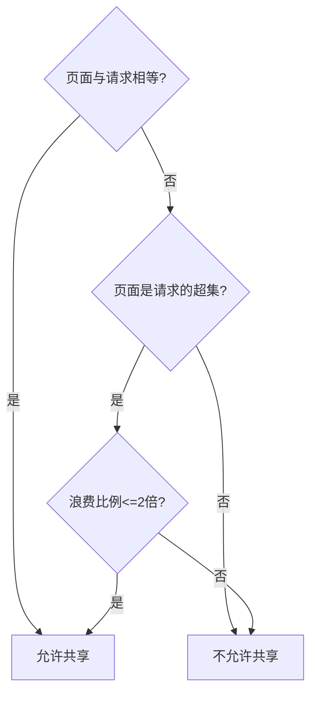

**图表来源**
- [VulkanBindingTable.cs:1144-1202](file://src/SharpGPU/Vulkan/VulkanBindingTable.cs#L1144-L1202)

**章节来源**
- [VulkanBindingTable.cs:1144-1202](file://src/SharpGPU/Vulkan/VulkanBindingTable.cs#L1144-L1202)

### VulkanUtility：转换与错误封装
- 平台检测：识别 Android/iOS/Windows/macOS/Linux。
- 版本计算：将主次补丁位组合为 Vulkan 版本字。
- 类型转换：像素格式、交换链格式、顶点格式、索引类型、加速结构顶点格式、缓冲/图像用途、采样数、图像类型/视图类型、数组层数、图像面、内存属性、阶段/访问标志、图像布局等。
- 错误封装：将 VkResult 映射为 RHI 错误码与设备状态，统一抛出 RHIException。

**章节来源**
- [VulkanUtility.cs:27-121](file://src/SharpGPU/Vulkan/VulkanUtility.cs#L27-L121)
- [VulkanUtility.cs:123-800](file://src/SharpGPU/Vulkan/VulkanUtility.cs#L123-L800)

## 依赖关系分析
- 组件耦合：
  - VulkanInstance 依赖 VulkanUtility 进行平台/版本判断与错误处理，并创建 VulkanDevice。
  - VulkanDevice 依赖 VulkanUtility 进行能力查询与特性链构建，并为队列、内存、管线提供能力与限制。
  - VulkanCommandQueue 依赖 VulkanDevice 的能力与队列族信息，并在提交/稀疏绑定时调用 VulkanUtility 的阶段/访问转换。
  - VulkanCommandBuffer 依赖 VulkanCommandQueue 的命令池与队列族，并协调各编码器（传输/计算/光栅/光线追踪）。
  - VulkanPipeline 依赖 VulkanDevice 的管线布局与能力，使用 VulkanUtility 进行格式/状态转换。
  - VulkanMemory 依赖 VulkanDevice 的内存属性与能力，使用 VulkanUtility 进行内存属性与格式转换。
  - **VulkanBindingTable 依赖 VulkanDevice 的描述符功能和限制，使用 VulkanDescriptorPoolAllocator 进行描述符集分配**。
  - **VulkanDescriptorPoolAllocator 依赖 VulkanDescriptorPoolPolicy 进行共享策略决策**。
- 外部依赖：Vortice.Vulkan 提供的 Vk* 类型与原生函数；Khronos 验证层与扩展。

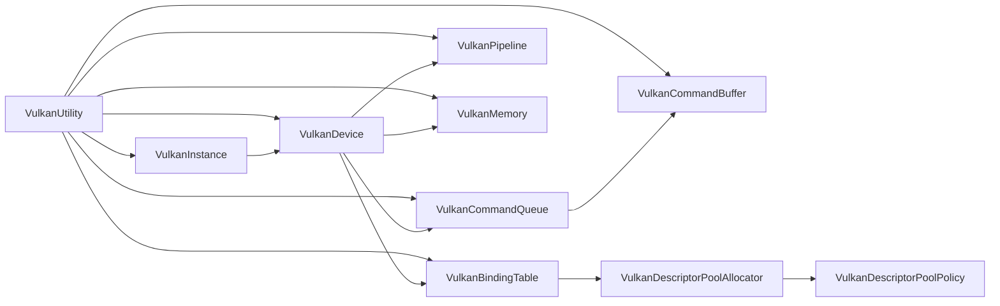

**图表来源**
- [VulkanInstance.cs:74-418](file://src/SharpGPU/Vulkan/VulkanInstance.cs#L74-L418)
- [VulkanDevice.cs:182-800](file://src/SharpGPU/Vulkan/VulkanDevice.cs#L182-L800)
- [VulkanCommandQueue.cs:46-158](file://src/SharpGPU/Vulkan/VulkanCommandQueue.cs#L46-L158)
- [VulkanCommandBuffer.cs:43-80](file://src/SharpGPU/Vulkan/VulkanCommandBuffer.cs#L43-L80)
- [VulkanPipeline.cs:32-177](file://src/SharpGPU/Vulkan/VulkanPipeline.cs#L32-L177)
- [VulkanMemory.cs:9-127](file://src/SharpGPU/Vulkan/VulkanMemory.cs#L9-L127)
- [VulkanBindingTable.cs:1222-1558](file://src/SharpGPU/Vulkan/VulkanBindingTable.cs#L1222-L1558)
- [VulkanUtility.cs:27-121](file://src/SharpGPU/Vulkan/VulkanUtility.cs#L27-L121)

**章节来源**
- [VulkanInstance.cs:74-418](file://src/SharpGPU/Vulkan/VulkanInstance.cs#L74-L418)
- [VulkanDevice.cs:182-800](file://src/SharpGPU/Vulkan/VulkanDevice.cs#L182-L800)
- [VulkanCommandQueue.cs:46-158](file://src/SharpGPU/Vulkan/VulkanCommandQueue.cs#L46-L158)
- [VulkanCommandBuffer.cs:43-80](file://src/SharpGPU/Vulkan/VulkanCommandBuffer.cs#L43-L80)
- [VulkanPipeline.cs:32-177](file://src/SharpGPU/Vulkan/VulkanPipeline.cs#L32-L177)
- [VulkanMemory.cs:9-127](file://src/SharpGPU/Vulkan/VulkanMemory.cs#L9-L127)
- [VulkanBindingTable.cs:1222-1558](file://src/SharpGPU/Vulkan/VulkanBindingTable.cs#L1222-L1558)
- [VulkanUtility.cs:27-121](file://src/SharpGPU/Vulkan/VulkanUtility.cs#L27-L121)

## 性能考量
- 队列并行：尽量分离图形、计算与传输队列族，减少跨队列依赖与同步开销。
- 同步策略：优先使用同步2（若可用）以获得更细粒度的阶段/访问控制；避免过度屏障。
- 管线重用：复用 VkPipelineLayout 与 VkPipeline，减少创建成本；利用管线缓存提升首次创建速度。
- 内存分配：合理选择内存类型与堆大小，避免频繁分配；对 CPU/GPU 共享内存使用合适的映射与刷新策略。
- 动态渲染：在支持的平台上使用动态渲染以减少 RenderPass 切换与状态重建。
- 稀疏纹理：仅在需要按需驻留时使用，注意瓦片粒度与对齐，避免碎片化。
- 预算监控：定期查询内存预算与使用量，及时调整资源规模以避免溢出。
- **描述符池优化**：利用"2倍浪费超集共享"模型提高描述符池利用率，减少内存浪费；通过分页策略平衡内存使用与分配效率。

[本节为通用指导，无需特定文件来源]

## 故障排查指南
- 实例创建失败：检查所需扩展是否可用（如 VK_KHR_surface、平台表面扩展）、验证层是否安装且启用。
- 设备选择失败：确认物理设备 API 版本满足最低要求（Android 需 1.1+），并具备所需扩展与特性。
- 队列族缺失：若未找到计算/传输队列族，会回退至图形队列族；确保至少存在一个队列族。
- 提交失败：检查等待/信号阶段是否正确转换，队列族与命令缓冲是否匹配；捕获设备丢失并回滚。
- 管线创建失败：检查着色器阶段、布局、动态渲染配置与附件格式；利用管线缓存的错误提示定位问题。
- 内存分配失败：确认内存类型与属性满足存储模式；检查堆大小与对齐；使用预算查询评估剩余空间。
- 稀疏绑定失败：验证队列族支持稀疏绑定，子资源瓦片范围不越界，堆兼容性与偏移正确。
- **描述符分配失败**：检查描述符池容量是否足够，验证共享策略是否正常工作，确认描述符集租约是否正确释放。

**章节来源**
- [VulkanInstance.cs:127-380](file://src/SharpGPU/Vulkan/VulkanInstance.cs#L127-L380)
- [VulkanDevice.cs:193-800](file://src/SharpGPU/Vulkan/VulkanDevice.cs#L193-L800)
- [VulkanCommandQueue.cs:63-158](file://src/SharpGPU/Vulkan/VulkanCommandQueue.cs#L63-L158)
- [VulkanPipeline.cs:238-310](file://src/SharpGPU/Vulkan/VulkanPipeline.cs#L238-L310)
- [VulkanMemory.cs:539-728](file://src/SharpGPU/Vulkan/VulkanMemory.cs#L539-L728)
- [VulkanBindingTable.cs:1309-1345](file://src/SharpGPU/Vulkan/VulkanBindingTable.cs#L1309-L1345)

## 结论
SharpGPU 的 Vulkan 后端以清晰的层次组织实现了从实例到设备、队列、命令缓冲、管线与内存的全链路管理。通过特性链与扩展探测，兼顾不同 Vulkan 版本与平台差异；借助验证层与统一错误封装，提升可诊断性；结合动态渲染、同步2与稀疏纹理等现代特性，提供高性能与灵活性。**最新的统一描述符绑定方法通过描述符池分页和"2倍浪费超集共享"模型，显著提升了资源利用率和表间共享效率**。建议在工程中合理使用队列并行、管线缓存、内存预算和描述符池优化，以获得稳定与高效的渲染与计算体验。

[本节为总结，无需特定文件来源]

## 附录
- 配置选项建议：
  - 启用验证层：开发阶段开启 VK_EXT_debug_utils 与 Khronos 验证层，便于早期发现问题。
  - 队列请求：根据工作负载调整图形/计算/传输队列数量，避免过多导致上下文切换开销。
  - 动态渲染：在支持设备上优先使用动态渲染，减少 RenderPass 切换。
  - 同步2：在支持设备上启用同步2，获得更精确的阶段/访问控制。
  - **描述符池配置**：根据应用的工作负载特点调整描述符池大小和共享策略，平衡内存使用与分配性能。
- 性能分析工具集成点：
  - 调试标签：通过 vkCmdBeginDebugUtilsLabelEXT/vkCmdEndDebugUtilsLabelEXT 标注命令缓冲片段，便于 PIX/RenderDoc 等工具分析。
  - 校准时间戳：在支持的设备上启用 VK_KHR_calibrated_timestamps，提高 CPU/GPU 时间同步精度。
  - **描述符池监控**：利用 AllocatedSetCount 属性监控描述符集使用情况，优化池大小和共享策略。
- 跨平台兼容性：
  - 表面扩展：根据平台启用相应 surface 扩展（Win32/X11/Wayland/Android/AppKit/UIKit）。
  - Portability：在 iOS 等平台启用 portability enumeration 以增强设备枚举兼容性。
  - 平台最低版本：Android 要求 Vulkan 1.1+，确保 loader 与驱动满足要求。

**章节来源**
- [VulkanInstance.cs:127-198](file://src/SharpGPU/Vulkan/VulkanInstance.cs#L127-L198)
- [VulkanInstance.cs:420-478](file://src/SharpGPU/Vulkan/VulkanInstance.cs#L420-L478)
- [VulkanDevice.cs:193-800](file://src/SharpGPU/Vulkan/VulkanDevice.cs#L193-L800)
- [VulkanUtility.cs:27-57](file://src/SharpGPU/Vulkan/VulkanUtility.cs#L27-L57)
- [VulkanBindingTable.cs:1235-1253](file://src/SharpGPU/Vulkan/VulkanBindingTable.cs#L1235-L1253)