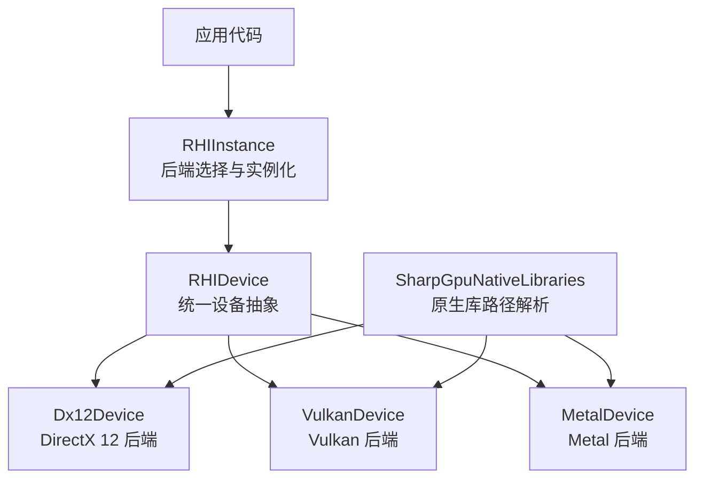
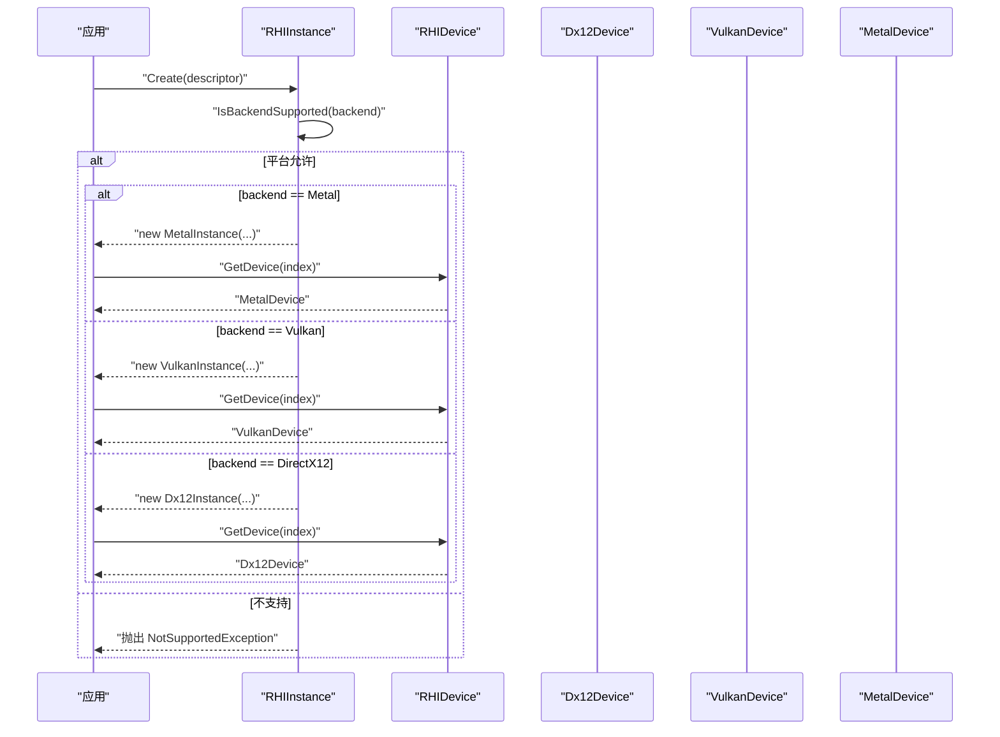
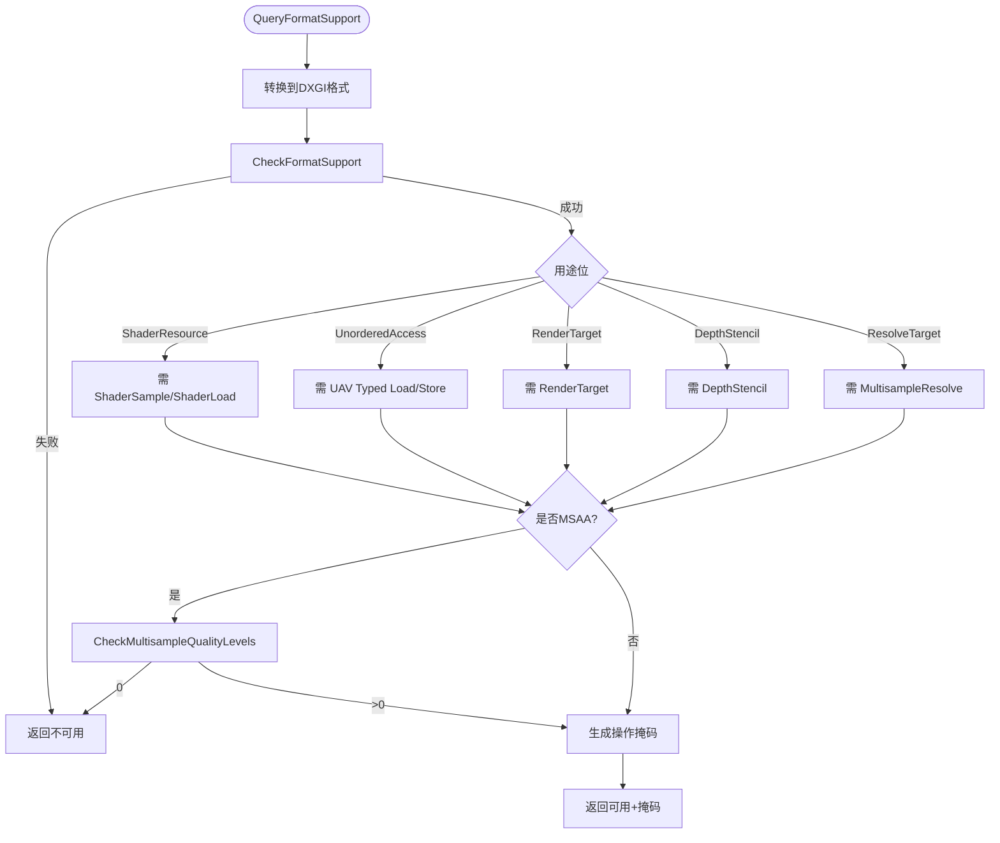
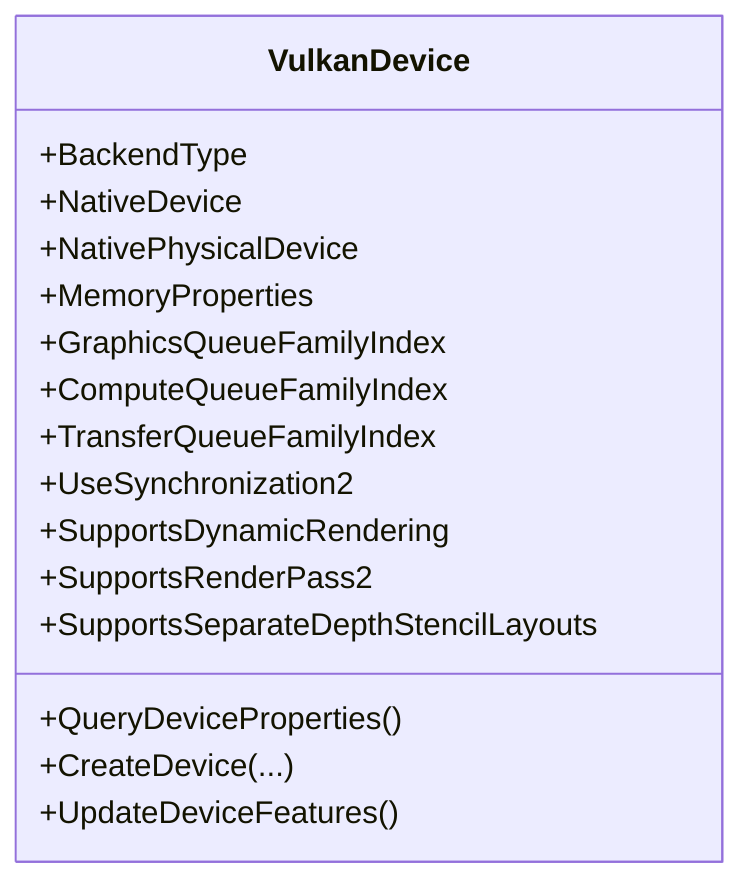
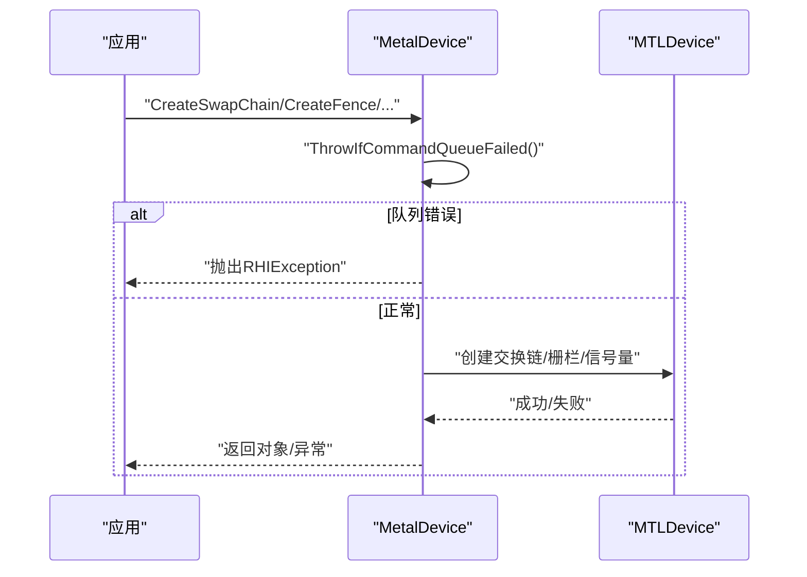
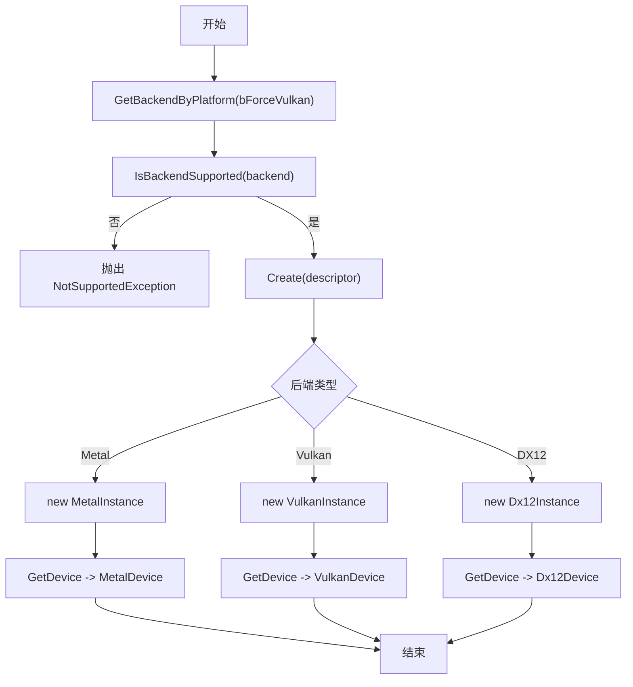
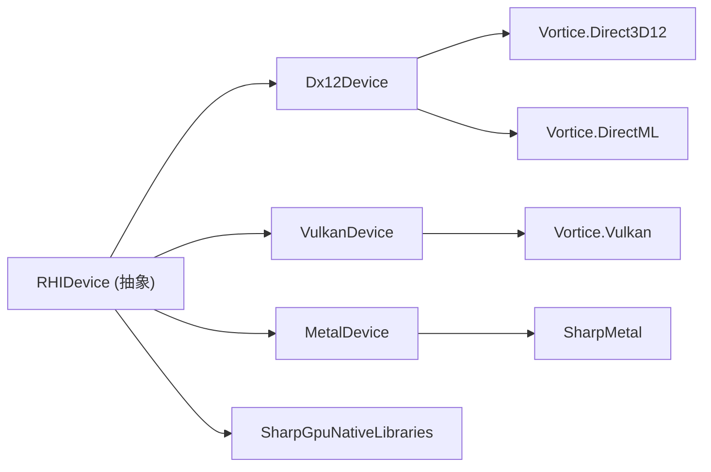

# 后端实现

<cite>
**本文引用的文件**
- [RHIInstance.cs](file://src/SharpGPU/Abstract/RHIInstance.cs)
- [RHIDevice.cs](file://src/SharpGPU/Abstract/RHIDevice.cs)
- [Dx12Device.cs](file://src/SharpGPU/Dx12/Dx12Device.cs)
- [VulkanDevice.cs](file://src/SharpGPU/Vulkan/VulkanDevice.cs)
- [MetalDevice.cs](file://src/SharpGPU/Metal/MetalDevice.cs)
- [SharpGpuNativeLibraries.cs](file://src/SharpGPU/Common/SharpGpuNativeLibraries.cs)
- [SharpGPU.csproj](file://src/SharpGPU/SharpGPU.csproj)
- [FeatureMatrix.md](file://docs/SharpGPU/FeatureMatrix.md)
- [DESIGN.md](file://DESIGN.md)
- [README.md](file://README.md)
</cite>

## 目录
1. [简介](#简介)
2. [项目结构](#项目结构)
3. [核心组件](#核心组件)
4. [架构总览](#架构总览)
5. [详细组件分析](#详细组件分析)
6. [依赖关系分析](#依赖关系分析)
7. [性能考量](#性能考量)
8. [故障排除指南](#故障排除指南)
9. [结论](#结论)
10. [附录](#附录)

## 简介
本文件聚焦 SharpGPU 的后端实现，系统阐述 DirectX 12、Vulkan 与 Metal 三个后端的实现细节、特性与限制；说明后端选择机制、运行时能力探测与动态切换过程；总结各后端优化策略、性能特征与平台兼容性；并提供配置选项、调试技巧、故障排除方法以及迁移指南与最佳实践。

## 项目结构
SharpGPU 采用“抽象 HAL + 多后端实现”的层次化组织：
- 抽象层（Abstract）：定义统一的设备、队列、资源、查询、交换链等接口与能力模型。
- 后端实现（Dx12 / Vulkan / Metal）：分别对接原生 API，实现具体能力探测、资源创建与命令编码。
- 公共基础设施（Common）：提供原生库定位、工具类与内存/屏障等通用逻辑。
- 文档与示例：功能矩阵、快速入门、设计约束与验证流程。

图表来源
- [RHIInstance.cs:46-156](file://src/SharpGPU/Abstract/RHIInstance.cs#L46-L156)
- [RHIDevice.cs:422-601](file://src/SharpGPU/Abstract/RHIDevice.cs#L422-L601)
- [Dx12Device.cs:48-158](file://src/SharpGPU/Dx12/Dx12Device.cs#L48-L158)
- [VulkanDevice.cs:11-191](file://src/SharpGPU/Vulkan/VulkanDevice.cs#L11-L191)
- [MetalDevice.cs:12-95](file://src/SharpGPU/Metal/MetalDevice.cs#L12-L95)
- [SharpGpuNativeLibraries.cs:7-73](file://src/SharpGPU/Common/SharpGpuNativeLibraries.cs#L7-L73)

章节来源
- [README.md:1-23](file://README.md#L1-L23)
- [DESIGN.md:1-33](file://DESIGN.md#L1-L33)

## 核心组件
- RHIInstance：负责后端支持性检查、平台适配与实例化；提供 GetBackendByPlatform 与 Create。
- RHIDevice：统一设备抽象，暴露能力查询、资源创建、队列获取、状态诊断等。
- 后端 Device：Dx12Device、VulkanDevice、MetalDevice 各自实现能力探测、原生对象创建与命令编码。
- 原生库定位：SharpGpuNativeLibraries 在首次请求时冻结并解析 DirectML/DirectStorage/PIX 等 DLL 路径。

章节来源
- [RHIInstance.cs:59-156](file://src/SharpGPU/Abstract/RHIInstance.cs#L59-L156)
- [RHIDevice.cs:422-601](file://src/SharpGPU/Abstract/RHIDevice.cs#L422-L601)
- [SharpGpuNativeLibraries.cs:16-73](file://src/SharpGPU/Common/SharpGpuNativeLibraries.cs#L16-L73)

## 架构总览
后端选择与初始化流程：
- 调用方通过 RHIInstanceDescriptor 指定后端或交由 GetBackendByPlatform 按平台选择。
- IsBackendSupported 进行平台级前置校验（如 DX12 仅 Windows，Metal 仅 macOS/iOS）。
- Create 根据后端枚举构造对应 Instance，再创建 Device。
- 每个 Device 在构造中完成能力探测、队列族/扩展启用、资源池与签名创建等。

图表来源
- [RHIInstance.cs:59-156](file://src/SharpGPU/Abstract/RHIInstance.cs#L59-L156)
- [Dx12Device.cs:137-158](file://src/SharpGPU/Dx12/Dx12Device.cs#L137-L158)
- [VulkanDevice.cs:182-191](file://src/SharpGPU/Vulkan/VulkanDevice.cs#L182-L191)
- [MetalDevice.cs:55-95](file://src/SharpGPU/Metal/MetalDevice.cs#L55-L95)

## 详细组件分析

### DirectX 12 后端
- 设备与能力
  - 从 DXGI 适配器获取名称、厂商/设备 ID、驱动版本与 LUID。
  - 通过 CheckFormatSupport、CheckMultisampleQualityLevels 等查询格式支持、MSAA 质量级别与混合能力。
  - 采样反馈能力通过 D3D12 Options7 SamplerFeedbackTier 映射为 Tier1/Tier2。
- 资源与内存
  - 使用 Heap 与 Placed Resources 精确控制缓冲/纹理分配；提供 GetBufferMemoryRequirements/GetTextureMemoryRequirements。
  - 支持放置式缓冲与纹理创建，并在失败时回滚预留位置。
- 命令与管线
  - 创建指令签名（DrawIndirect、DispatchRayIndirect、DispatchMeshIndirect 等），按需启用 DirectML 记录器。
  - 对 Framebuffer Read/Write、Resolve、Raster 附件组合进行严格的能力判定与降级拒绝。
- 平台与构建
  - 默认启用 SHARPGPU_ENABLE_DX12 编译开关；需要 D3D12 Agility 原生库可用。

图表来源
- [Dx12Device.cs:546-759](file://src/SharpGPU/Dx12/Dx12Device.cs#L546-L759)

章节来源
- [Dx12Device.cs:48-158](file://src/SharpGPU/Dx12/Dx12Device.cs#L48-L158)
- [Dx12Device.cs:229-358](file://src/SharpGPU/Dx12/Dx12Device.cs#L229-L358)
- [Dx12Device.cs:420-544](file://src/SharpGPU/Dx12/Dx12Device.cs#L420-L544)
- [Dx12Device.cs:546-759](file://src/SharpGPU/Dx12/Dx12Device.cs#L546-L759)
- [SharpGPU.csproj:12](file://src/SharpGPU/SharpGPU.csproj#L12)
- [DESIGN.md:11-15](file://DESIGN.md#L11-L15)

### Vulkan 后端
- 设备与能力
  - 查询物理设备属性、内存属性、队列族，并基于需求选择图形/计算/传输队列族。
  - 枚举设备扩展，动态启用 Dynamic Rendering、RenderPass2、Synchronization2、Fragment Shading Rate、Cooperative Matrix、Opacity Micromap、Ray Tracing Motion Blur 等。
  - 通过 Features2 链式查询组合能力，决定有效 API 版本与特性启用。
- 资源与内存
  - 提供 Descriptor Pool Allocator，管理描述符集与绑定表。
  - 支持稀疏绑定与相关队列族检测。
- 命令与管线
  - 根据可用扩展选择命令路径（如动态渲染 vs RenderPass2）。
  - 对深度/模板分离布局、独立 resolve、局部读取等进行能力判定。
- 平台与构建
  - 跨平台（Windows/Linux/Android），依赖 Vortice.Vulkan 绑定。

图表来源
- [VulkanDevice.cs:11-191](file://src/SharpGPU/Vulkan/VulkanDevice.cs#L11-L191)
- [VulkanDevice.cs:193-800](file://src/SharpGPU/Vulkan/VulkanDevice.cs#L193-L800)

章节来源
- [VulkanDevice.cs:182-800](file://src/SharpGPU/Vulkan/VulkanDevice.cs#L182-L800)

### Metal 后端
- 设备与能力
  - 要求 Metal 4 与 MTL4 原生参数表支持；否则直接拒绝。
  - 通过 MTLDevice.SupportsTextureSampleCount 与 NewTexture 探针判断格式/用法/MSAA 支持。
  - 时间戳查询依赖 MTL4CounterHeap，不可用时明确不可用原因。
- 资源与内存
  - 支持 Placement Sparse 与常规堆内存；提供纹理视图池以优化视图创建。
  - 提供稀疏纹理内存需求查询与创建。
- 命令与管线
  - 通过 MTL4 命令队列错误回调将 OOM/设备移除/超时等映射为统一诊断。
  - 对帧缓冲读写、本地读、混合能力进行严格判定。
- 平台与构建
  - 仅 macOS/iOS；通过 SharpMetal 绑定访问原生 API。

图表来源
- [MetalDevice.cs:97-168](file://src/SharpGPU/Metal/MetalDevice.cs#L97-L168)
- [MetalDevice.cs:189-227](file://src/SharpGPU/Metal/MetalDevice.cs#L189-L227)

章节来源
- [MetalDevice.cs:12-95](file://src/SharpGPU/Metal/MetalDevice.cs#L12-L95)
- [MetalDevice.cs:97-168](file://src/SharpGPU/Metal/MetalDevice.cs#L97-L168)
- [MetalDevice.cs:229-370](file://src/SharpGPU/Metal/MetalDevice.cs#L229-L370)
- [MetalDevice.cs:372-800](file://src/SharpGPU/Metal/MetalDevice.cs#L372-L800)

### 后端选择机制、运行时能力探测与动态切换
- 选择机制
  - RHIInstance.GetBackendByPlatform：默认 Windows 选 DX12，macOS/iOS 选 Metal，Linux/Android 选 Vulkan；可强制 Vulkan。
  - RHIInstance.IsBackendSupported：平台前置校验（DX12 仅 Windows，Metal 仅 macOS/iOS）。
  - RHIInstance.Create：根据后端枚举构造对应 Instance，再获取 Device。
- 运行时能力探测
  - 每个 Device 在构造中执行能力探测（DX12：CheckFormatSupport/Options7；Vulkan：Extensions/Features2；Metal：NewTexture 探针）。
  - 能力结果通过 RHICapability 表达（Tier/Strategy/Limits/Provenance/UnavailableReason）。
- 动态切换
  - 高层可通过 RHIInstanceDescriptor 切换后端；同一进程内可多次 Create 不同后端实例。
  - 设备丢失/队列提交失败会转换为统一诊断，上层可据此重建或降级。

图表来源
- [RHIInstance.cs:59-156](file://src/SharpGPU/Abstract/RHIInstance.cs#L59-L156)

章节来源
- [RHIInstance.cs:59-156](file://src/SharpGPU/Abstract/RHIInstance.cs#L59-L156)
- [FeatureMatrix.md:1-88](file://docs/SharpGPU/FeatureMatrix.md#L1-L88)

## 依赖关系分析
- 外部依赖
  - DX12：Vortice.Direct3D12、Vortice.DirectML、Vortice.DirectStorage；需要 D3D12 Agility 原生库。
  - Vulkan：Vortice.Vulkan；需要匹配的 Vulkan 主机与驱动。
  - Metal：SharpMetal；需要 Metal 4 与 Apple 平台。
- 内部依赖
  - 所有后端继承 RHIDevice，复用统一能力模型与资源生命周期管理。
  - 共享工具：SharpGpuNativeLibraries 用于原生库路径解析；BarrierUtility/Utility 用于格式/用法转换。

图表来源
- [SharpGPU.csproj:15-21](file://src/SharpGPU/SharpGPU.csproj#L15-L21)
- [DESIGN.md:11-15](file://DESIGN.md#L11-L15)

章节来源
- [SharpGPU.csproj:1-47](file://src/SharpGPU/SharpGPU.csproj#L1-L47)
- [DESIGN.md:11-15](file://DESIGN.md#L11-L15)

## 性能考量
- 资源分配
  - DX12/Metal 均支持 Placed Resources，减少碎片并提高批量分配效率；Vulkan 通过 Descriptor Pool Allocator 降低描述符分配开销。
- 命令编码
  - DX12 使用 Command Signature 与 Indirect 调用提升批量绘制/计算效率；Metal 利用 MTL4 原生参数表减少绑定开销。
  - Vulkan 优先使用 Dynamic Rendering/RenderPass2/Synchronization2 以减少状态切换与同步成本。
- 能力探测
  - 精确的 QueryFormatSupport/QueryResolveSupport/QueryRasterAttachmentSupport 避免不必要的降级与重编译。
- 内存与带宽
  - 合理设置 UsageFlag 与 StorageMode，结合线性/最优图块布局与对齐要求，减少拷贝与转置。
- 线程与队列
  - 分离图形/计算/传输队列族，最大化并行度；Metal 注意队列异步错误回调及时上报。

[本节为通用指导，不直接分析具体文件]

## 故障排除指南
- 设备丢失与队列失败
  - DX12：通过 MarkDeviceLost 标记设备丢失，后续调用将抛出诊断。
  - Metal：ReportCommandQueueFeedback 将队列错误映射为统一诊断，ThrowIfCommandQueueFailed 在前置点抛出。
  - Vulkan：扩展/特性未启用或函数指针加载失败会导致相应能力不可用，需在能力查询阶段捕获。
- 原生库路径
  - SharpGpuNativeLibraries.Configure 必须在首次运行时请求前调用；Resolve 会在首次调用时冻结路径。
  - 若路径不存在或非绝对路径，将抛出异常；确保部署包含 runtimes/<rid>/native。
- 能力不可用
  - 当 Query* 返回不可用或工厂 Require 抛出不支持时，应回退到兼容路径或提示用户升级驱动/系统。
- 常见错误
  - 错误的 UsageFlag/Format/Tiling 组合导致 Query 失败；请依据 FeatureMatrix 与后端实现调整。
  - 缺少必要的扩展（如 VK_KHR_dynamic_rendering_local_read、VK_EXT_opacity_micromap）导致能力不可用。

章节来源
- [RHIDevice.cs:465-525](file://src/SharpGPU/Abstract/RHIDevice.cs#L465-L525)
- [MetalDevice.cs:97-168](file://src/SharpGPU/Metal/MetalDevice.cs#L97-L168)
- [SharpGpuNativeLibraries.cs:16-73](file://src/SharpGPU/Common/SharpGpuNativeLibraries.cs#L16-L73)
- [FeatureMatrix.md:46-88](file://docs/SharpGPU/FeatureMatrix.md#L46-L88)

## 结论
SharpGPU 通过统一的 HAL 抽象与多后端实现，提供了跨平台的 GPU 编程能力。DX12 在 Windows 上具备最完整的生态与工具链；Vulkan 提供跨平台一致性与高度可配置性；Metal 在 Apple 平台上提供高性能的原生路径。通过严格的运行时能力探测与清晰的失败语义，开发者可以在不同平台上获得稳定且可预期的行为。建议在生产环境中结合 FeatureMatrix 与平台资格报告进行验证，并在关键路径加入能力检查与优雅降级。

[本节为总结，不直接分析具体文件]

## 附录
- 快速入门
  - 参考 QuickStart 中的最小示例，了解如何创建缓冲、开启传输通道并拷贝数据。
- 功能矩阵
  - 详见 FeatureMatrix，了解公开契约、能力分类与平台资格要求。
- 设计与约束
  - 详见 DESIGN，了解产品边界、原生库部署与构建模式约束。

章节来源
- [QuickStart.md:1-31](file://docs/SharpGPU/QuickStart.md#L1-L31)
- [FeatureMatrix.md:1-88](file://docs/SharpGPU/FeatureMatrix.md#L1-L88)
- [DESIGN.md:1-33](file://DESIGN.md#L1-L33)