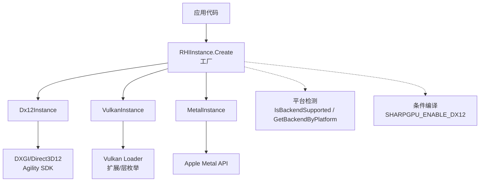
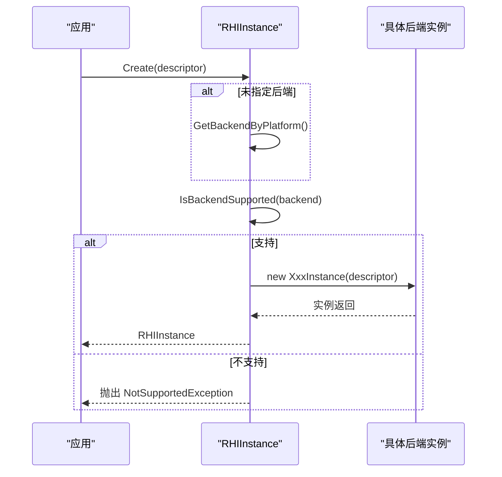
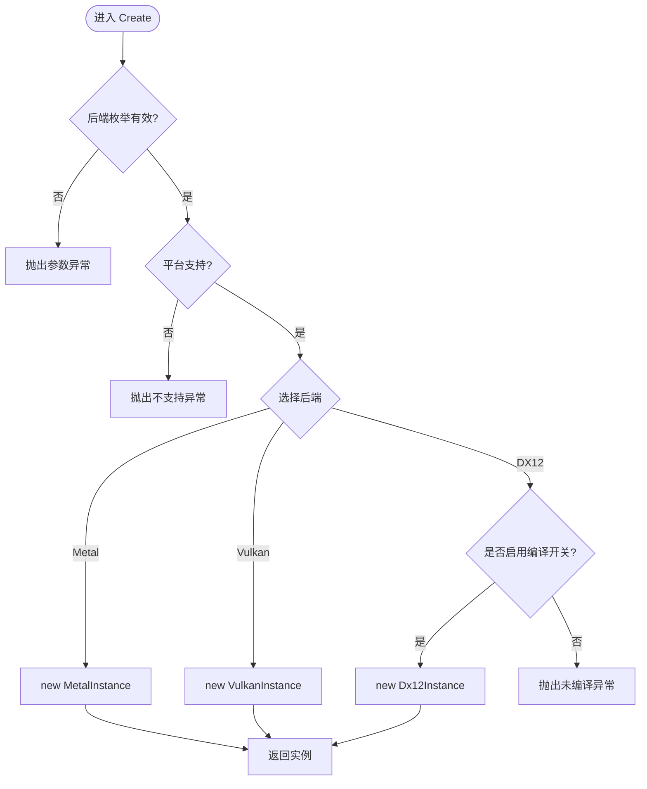
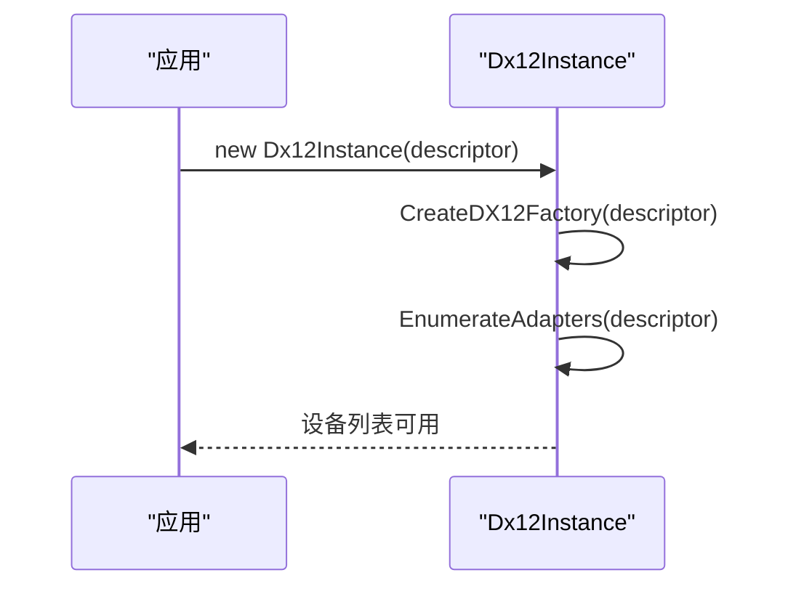
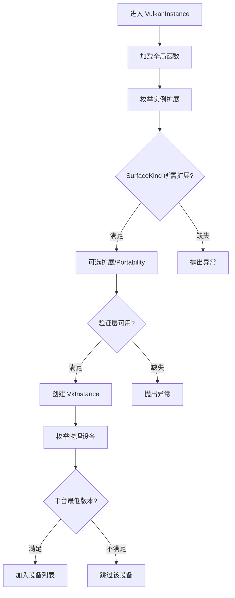
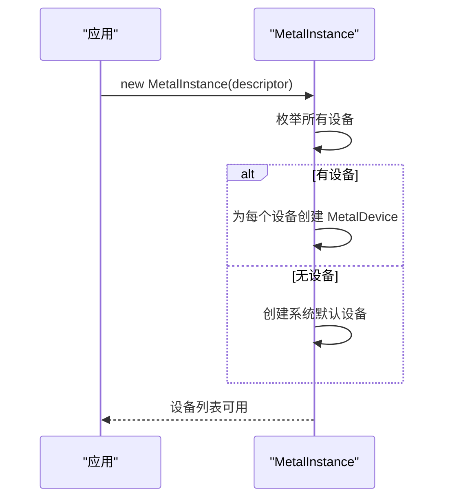
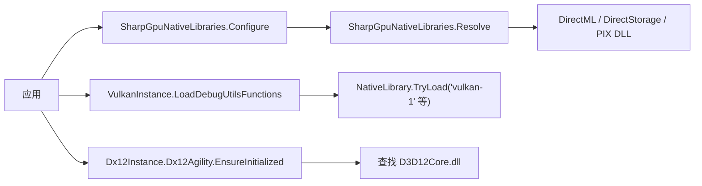
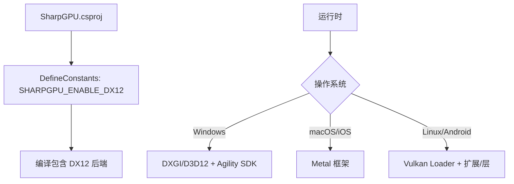

# 后端选择与切换

<cite>
**本文引用的文件**
- [RHIInstance.cs](file://src/SharpGPU/Abstract/RHIInstance.cs)
- [Dx12Instance.cs](file://src/SharpGPU/Dx12/Dx12Instance.cs)
- [VulkanInstance.cs](file://src/SharpGPU/Vulkan/VulkanInstance.cs)
- [MetalInstance.cs](file://src/SharpGPU/Metal/MetalInstance.cs)
- [SharpGpuNativeLibraries.cs](file://src/SharpGPU/Common/SharpGpuNativeLibraries.cs)
- [SharpGPU.csproj](file://src/SharpGPU/SharpGPU.csproj)
- [PackageReadme.md](file://docs/SharpGPU/PackageReadme.md)
- [NativeLibraryConfigurationTests.cs](file://tests/SharpGPU.Conformance.Tests/NativeLibraryConfigurationTests.cs)
</cite>

## 目录
1. [简介](#简介)
2. [项目结构](#项目结构)
3. [核心组件](#核心组件)
4. [架构总览](#架构总览)
5. [详细组件分析](#详细组件分析)
6. [依赖关系分析](#依赖关系分析)
7. [性能考量](#性能考量)
8. [故障排查指南](#故障排查指南)
9. [结论](#结论)
10. [附录](#附录)

## 简介
本文件系统性说明 SharpGPU 的后端选择与切换机制，重点围绕 RHIInstance 类如何根据运行时环境自动选择合适的图形后端（DirectX 12、Vulkan、Metal），包括能力探测、依赖检查与兼容性验证流程。文档还解释后端工厂模式实现、动态库加载机制与插件化设计思路，并给出手动指定后端的方法、环境变量配置与优先级规则。最后提供后端切换的限制条件、性能影响、迁移注意事项，以及多后端测试策略、回退机制与故障恢复方案。

## 项目结构
SharpGPU 采用“抽象接口 + 多后端实现”的分层组织：
- 抽象层：定义统一的实例与设备抽象（如 RHIInstance、RHIDevice）。
- 后端实现层：针对 DirectX 12、Vulkan、Metal 的具体实现（Dx12Instance、VulkanInstance、MetalInstance）。
- 公共基础设施：原生库定位与加载（SharpGpuNativeLibraries）、平台检测与编译期开关（csproj 中的条件编译常量）。
- 测试与基准：覆盖各后端的兼容性与功能矩阵。

图表来源
- [RHIInstance.cs:122-156](file://src/SharpGPU/Abstract/RHIInstance.cs#L122-L156)
- [Dx12Instance.cs:20-106](file://src/SharpGPU/Dx12/Dx12Instance.cs#L20-L106)
- [VulkanInstance.cs:74-85](file://src/SharpGPU/Vulkan/VulkanInstance.cs#L74-L85)
- [MetalInstance.cs:16-54](file://src/SharpGPU/Metal/MetalInstance.cs#L16-L54)
- [SharpGPU.csproj:12](file://src/SharpGPU/SharpGPU.csproj#L12)

章节来源
- [RHIInstance.cs:46-156](file://src/SharpGPU/Abstract/RHIInstance.cs#L46-L156)
- [SharpGPU.csproj:1-47](file://src/SharpGPU/SharpGPU.csproj#L1-L47)

## 核心组件
- RHIInstanceDescriptor：描述实例创建参数，包括后端类型、表面类型、调试层与验证开关、队列请求数等。
- RHIInstance：抽象基类，提供静态方法用于平台能力判断、默认后端选择与实例创建。
- 具体后端实例：Dx12Instance、VulkanInstance、MetalInstance，分别负责对应平台的初始化、设备枚举与生命周期管理。
- 原生库解析器：SharpGpuNativeLibraries，用于在运行前或首次使用期间解析 DirectML、DirectStorage、PIX 等可选原生库位置。

章节来源
- [RHIInstance.cs:6-15](file://src/SharpGPU/Abstract/RHIInstance.cs#L6-L15)
- [RHIInstance.cs:46-156](file://src/SharpGPU/Abstract/RHIInstance.cs#L46-L156)
- [SharpGpuNativeLibraries.cs:7-73](file://src/SharpGPU/Common/SharpGpuNativeLibraries.cs#L7-L73)

## 架构总览
后端选择与切换的整体流程如下：
- 应用调用 RHIInstance.Create，传入 RHIInstanceDescriptor。
- 若未显式指定后端，可通过 RHIInstance.GetBackendByPlatform 按平台选择默认后端。
- IsBackendSupported 进行平台级能力校验（例如 DirectX 12 仅 Windows，Metal 仅 macOS/iOS）。
- Create 内部根据后端类型构造对应的实例对象；若 DX12 未启用编译开关则抛出异常。
- 各后端实例在构造时执行能力探测与依赖检查（如 Vulkan 的扩展/层枚举、DX12 的 Agility SDK 初始化、Metal 的设备发现）。

图表来源
- [RHIInstance.cs:105-156](file://src/SharpGPU/Abstract/RHIInstance.cs#L105-L156)

章节来源
- [RHIInstance.cs:59-156](file://src/SharpGPU/Abstract/RHIInstance.cs#L59-L156)

## 详细组件分析

### RHIInstance：后端工厂与平台能力探测
- 能力探测：IsBackendSupported 基于操作系统判断后端可用性，并返回失败原因。
- 默认后端选择：GetBackendByPlatform 根据平台决定首选后端（Windows→DX12，macOS/iOS→Metal，Linux/Android→Vulkan），并可强制选择 Vulkan。
- 工厂创建：Create 对后端进行合法性校验与平台支持校验，然后按分支创建具体实例；DX12 受编译期宏控制。

图表来源
- [RHIInstance.cs:122-156](file://src/SharpGPU/Abstract/RHIInstance.cs#L122-L156)

章节来源
- [RHIInstance.cs:59-156](file://src/SharpGPU/Abstract/RHIInstance.cs#L59-L156)

### Dx12Instance：DirectX 12 后端初始化与设备枚举
- 通过 DXGI/Direct3D12 工厂创建与调试层配置（可开启 GPU 验证）。
- 枚举适配器并过滤软件适配器，为每个硬件适配器创建设备。
- 使用 Agility SDK 获取设备工厂，确保 D3D12Core.dll 存在。

图表来源
- [Dx12Instance.cs:20-106](file://src/SharpGPU/Dx12/Dx12Instance.cs#L20-L106)

章节来源
- [Dx12Instance.cs:20-131](file://src/SharpGPU/Dx12/Dx12Instance.cs#L20-L131)
- [Dx12Instance.cs:134-233](file://src/SharpGPU/Dx12/Dx12Instance.cs#L134-L233)

### VulkanInstance：Vulkan 后端初始化、扩展/层探测与物理设备枚举
- 启动时加载全局函数指针（vkGetInstanceProcAddr 等），枚举实例扩展与层。
- 根据 SurfaceKind 要求必要扩展（如 VK_KHR_surface、平台特定 surface 扩展），可选启用 portability enumeration。
- 若启用验证，需存在 VK_EXT_debug_utils 与 Khronos 验证层。
- 创建 VkInstance 后枚举物理设备，并按平台最低版本要求筛选（如 Android 需要 Vulkan 1.1+）。

图表来源
- [VulkanInstance.cs:127-198](file://src/SharpGPU/Vulkan/VulkanInstance.cs#L127-L198)
- [VulkanInstance.cs:200-230](file://src/SharpGPU/Vulkan/VulkanInstance.cs#L200-L230)
- [VulkanInstance.cs:232-380](file://src/SharpGPU/Vulkan/VulkanInstance.cs#L232-L380)
- [VulkanInstance.cs:382-418](file://src/SharpGPU/Vulkan/VulkanInstance.cs#L382-L418)

章节来源
- [VulkanInstance.cs:74-418](file://src/SharpGPU/Vulkan/VulkanInstance.cs#L74-L418)

### MetalInstance：Metal 后端设备发现与初始化
- 通过 Apple Metal API 枚举所有设备；若无可用设备则尝试创建系统默认设备。
- 将发现的设备封装为 MetalDevice，供上层访问。

图表来源
- [MetalInstance.cs:16-54](file://src/SharpGPU/Metal/MetalInstance.cs#L16-L54)

章节来源
- [MetalInstance.cs:9-77](file://src/SharpGPU/Metal/MetalInstance.cs#L9-L77)

### 动态库加载与原生资源解析
- Vulkan 后端通过 NativeLibrary.TryLoad 动态加载 vulkan 相关库，并解析关键函数指针。
- DX12 后端通过 Agility SDK 查找 D3D12Core.dll，确保运行时依赖存在。
- SharpGpuNativeLibraries 提供统一的原生库目录配置与解析，支持 DirectML、DirectStorage、PIX，并在首次使用后冻结配置。

图表来源
- [SharpGpuNativeLibraries.cs:16-57](file://src/SharpGPU/Common/SharpGpuNativeLibraries.cs#L16-L57)
- [VulkanInstance.cs:420-478](file://src/SharpGPU/Vulkan/VulkanInstance.cs#L420-L478)
- [VulkanInstance.cs:519-577](file://src/SharpGPU/Vulkan/VulkanInstance.cs#L519-L577)
- [Dx12Instance.cs:165-233](file://src/SharpGPU/Dx12/Dx12Instance.cs#L165-L233)

章节来源
- [SharpGpuNativeLibraries.cs:7-73](file://src/SharpGPU/Common/SharpGpuNativeLibraries.cs#L7-L73)
- [VulkanInstance.cs:420-577](file://src/SharpGPU/Vulkan/VulkanInstance.cs#L420-L577)
- [Dx12Instance.cs:165-233](file://src/SharpGPU/Dx12/Dx12Instance.cs#L165-L233)

### 插件架构设计与扩展点
- 后端以“实例工厂 + 具体实现”的方式解耦，新增后端只需实现 RHIInstance 派生类并在 Create 中注册分支。
- 能力探测与依赖检查在各后端内部完成，避免中心逻辑膨胀。
- 原生库解析器作为独立模块，便于在不同平台或部署环境下灵活配置。

章节来源
- [RHIInstance.cs:122-156](file://src/SharpGPU/Abstract/RHIInstance.cs#L122-L156)
- [SharpGpuNativeLibraries.cs:7-73](file://src/SharpGPU/Common/SharpGpuNativeLibraries.cs#L7-L73)

## 依赖关系分析
- 编译期依赖：SharpGPU.csproj 定义了 SHARPGPU_ENABLE_DX12 常量，控制 DX12 后端是否参与构建。
- 运行时依赖：
  - DX12：需要 Windows 平台与 Agility SDK（D3D12Core.dll）。
  - Vulkan：需要系统 Vulkan Loader 及可选验证层与扩展。
  - Metal：需要 macOS/iOS 平台与 Metal 框架。
- 外部库：Vortice 绑定用于跨语言/平台访问底层 API。

图表来源
- [SharpGPU.csproj:12](file://src/SharpGPU/SharpGPU.csproj#L12)
- [RHIInstance.cs:64-120](file://src/SharpGPU/Abstract/RHIInstance.cs#L64-L120)

章节来源
- [SharpGPU.csproj:1-47](file://src/SharpGPU/SharpGPU.csproj#L1-L47)
- [RHIInstance.cs:64-120](file://src/SharpGPU/Abstract/RHIInstance.cs#L64-L120)

## 性能考量
- 后端选择时机：在应用启动阶段完成，避免运行时频繁切换带来的开销。
- 设备枚举成本：DX12 与 Vulkan 均会枚举适配器/物理设备，建议缓存结果并在必要时复用。
- 验证层与调试层：启用后会引入额外开销，建议在开发与诊断阶段使用，发布版本关闭。
- 原生库加载：Vulkan 的动态加载与函数解析仅在首次使用时发生，后续调用无显著开销。

[本节为通用指导，不直接分析具体文件]

## 故障排查指南
- 平台不支持：
  - 现象：创建实例抛出 NotSupportedException。
  - 处理：确认平台限制（DX12 仅 Windows，Metal 仅 macOS/iOS），或改用其他后端。
- 依赖缺失：
  - DX12：缺少 D3D12Core.dll 或 Agility SDK 初始化失败。
  - Vulkan：缺少验证层或必需扩展；需安装 Khronos 验证层并确保扩展可用。
  - 原生库：DirectML/DirectStorage/PIX 路径错误或目录不存在。
- 设备不可用：
  - Vulkan：无支持 GPU 或 Android 上 Vulkan 版本过低。
  - Metal：无法创建默认设备。
- 配置冻结：
  - 现象：重复调用 SharpGpuNativeLibraries.Configure 抛出异常。
  - 处理：确保在首次使用原生库前完成配置。

章节来源
- [RHIInstance.cs:59-156](file://src/SharpGPU/Abstract/RHIInstance.cs#L59-L156)
- [Dx12Instance.cs:26-106](file://src/SharpGPU/Dx12/Dx12Instance.cs#L26-L106)
- [VulkanInstance.cs:127-418](file://src/SharpGPU/Vulkan/VulkanInstance.cs#L127-L418)
- [MetalInstance.cs:16-54](file://src/SharpGPU/Metal/MetalInstance.cs#L16-L54)
- [SharpGpuNativeLibraries.cs:16-57](file://src/SharpGPU/Common/SharpGpuNativeLibraries.cs#L16-L57)
- [NativeLibraryConfigurationTests.cs:12-53](file://tests/SharpGPU.Conformance.Tests/NativeLibraryConfigurationTests.cs#L12-L53)

## 结论
SharpGPU 通过 RHIInstance 的工厂方法与平台能力探测实现了跨平台后端的选择与切换。各后端在初始化阶段完成依赖检查与能力验证，确保在不可用场景下明确失败而非静默降级。结合条件编译与原生库解析器，项目能够在不同平台与部署环境中灵活适配。生产环境建议关闭验证层以减少开销，并通过测试矩阵保障多后端一致性。

[本节为总结性内容，不直接分析具体文件]

## 附录

### 手动指定后端与环境变量配置
- 手动指定：在 RHIInstanceDescriptor 中设置 Backend 字段，再调用 RHIInstance.Create。
- 默认选择：若不设置 Backend，可使用 RHIInstance.GetBackendByPlatform 按平台选择默认后端。
- 环境变量：当前仓库未检测到用于后端选择的专用环境变量；如需通过环境变量控制，可在上层封装中读取并映射到 descriptor.Backend。

章节来源
- [RHIInstance.cs:6-15](file://src/SharpGPU/Abstract/RHIInstance.cs#L6-L15)
- [RHIInstance.cs:105-156](file://src/SharpGPU/Abstract/RHIInstance.cs#L105-L156)

### 后端切换限制与迁移注意事项
- 限制：
  - 平台限制：DX12 仅 Windows，Metal 仅 macOS/iOS，Vulkan 适用于 Linux/Android 等。
  - 编译期限制：DX12 后端需启用 SHARPGPU_ENABLE_DX12。
  - 依赖限制：Vulkan 需要验证层与扩展；DX12 需要 Agility SDK。
- 迁移：
  - 从 DX12 迁移到 Vulkan：关注表面扩展与验证层差异。
  - 从 Metal 迁移到其他后端：注意设备枚举与资源管理的差异。
  - 原生库路径：确保目标平台正确配置 DirectML/DirectStorage/PIX 目录。

章节来源
- [RHIInstance.cs:64-120](file://src/SharpGPU/Abstract/RHIInstance.cs#L64-L120)
- [SharpGPU.csproj:12](file://src/SharpGPU/SharpGPU.csproj#L12)
- [VulkanInstance.cs:127-230](file://src/SharpGPU/Vulkan/VulkanInstance.cs#L127-L230)
- [Dx12Instance.cs:165-233](file://src/SharpGPU/Dx12/Dx12Instance.cs#L165-L233)
- [SharpGpuNativeLibraries.cs:16-57](file://src/SharpGPU/Common/SharpGpuNativeLibraries.cs#L16-L57)

### 多后端测试策略、回退机制与故障恢复
- 测试策略：
  - 使用 FeatureMatrix 与 Conformance Tests 覆盖各后端能力。
  - 针对不同平台与驱动组合进行交叉测试。
- 回退机制：
  - 当首选后端不可用时，可在上层根据 IsBackendSupported 的结果切换到备选后端。
- 故障恢复：
  - 捕获 NotSupportedException 并记录原因，提示用户安装依赖或调整配置。
  - 对于原生库解析失败，提供明确的错误信息与修复指引。

章节来源
- [PackageReadme.md:1-13](file://docs/SharpGPU/PackageReadme.md#L1-L13)
- [RHIInstance.cs:59-156](file://src/SharpGPU/Abstract/RHIInstance.cs#L59-L156)