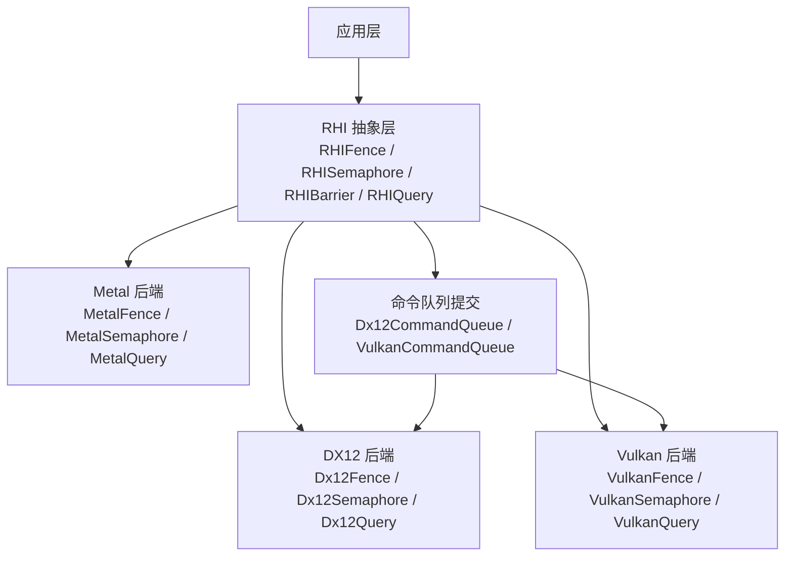
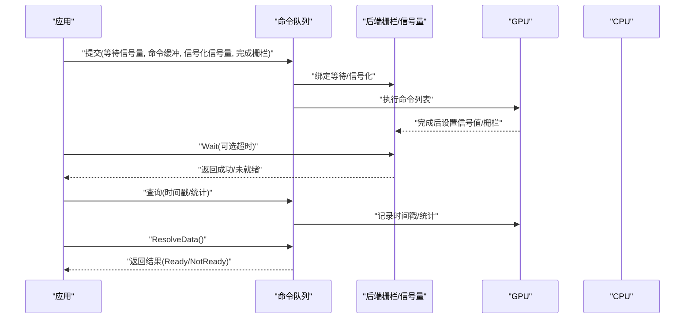
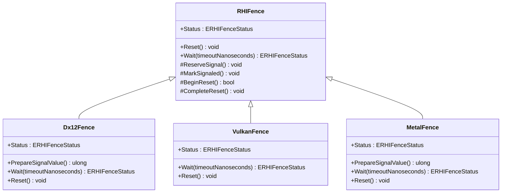
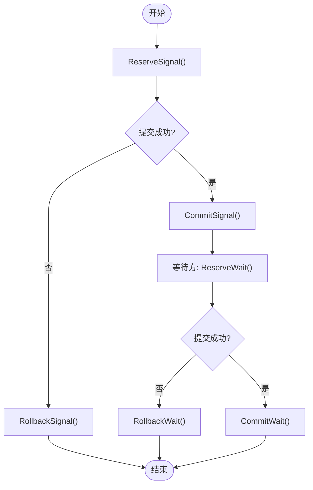
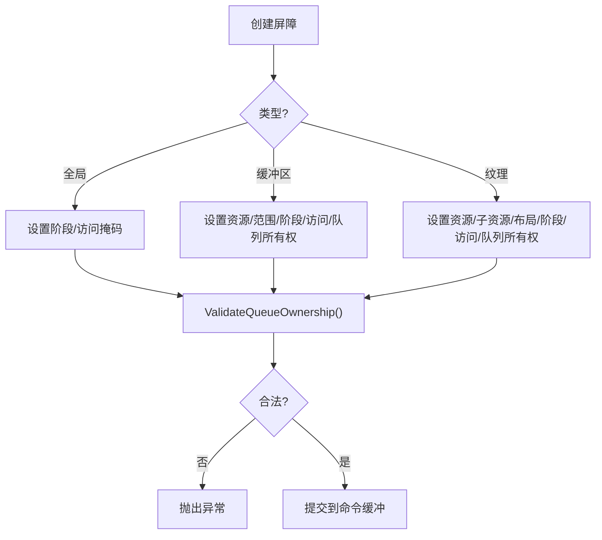
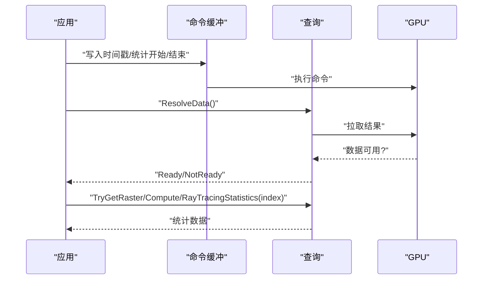
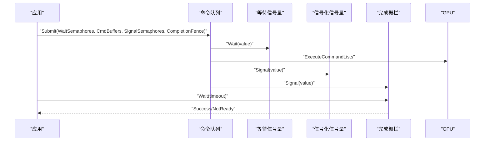

# 同步原语

<cite>
**本文引用的文件**
- [RHISynchronous.cs](file://src/SharpGPU/Abstract/RHISynchronous.cs)
- [Dx12Synchronous.cs](file://src/SharpGPU/Dx12/Dx12Synchronous.cs)
- [VulkanSynchronous.cs](file://src/SharpGPU/Vulkan/VulkanSynchronous.cs)
- [MetalSynchronous.cs](file://src/SharpGPU/Metal/MetalSynchronous.cs)
- [RHIQuery.cs](file://src/SharpGPU/Abstract/RHIQuery.cs)
- [Dx12Query.cs](file://src/SharpGPU/Dx12/Dx12Query.cs)
- [VulkanQuery.cs](file://src/SharpGPU/Vulkan/VulkanQuery.cs)
- [MetalQuery.cs](file://src/SharpGPU/Metal/MetalQuery.cs)
- [Dx12CommandQueue.cs](file://src/SharpGPU/Dx12/Dx12CommandQueue.cs)
- [VulkanCommandQueue.cs](file://src/SharpGPU/Vulkan/VulkanCommandQueue.cs)
</cite>

## 目录
1. [简介](#简介)
2. [项目结构](#项目结构)
3. [核心组件](#核心组件)
4. [架构总览](#架构总览)
5. [详细组件分析](#详细组件分析)
6. [依赖关系分析](#依赖关系分析)
7. [性能考量](#性能考量)
8. [故障排查指南](#故障排查指南)
9. [结论](#结论)
10. [附录：常见同步模式与示例路径](#附录：常见同步模式与示例路径)

## 简介
本文件聚焦 SharpGPU 的 GPU-CPU 同步机制，系统性地解释栅栏（Fence）、信号量（Semaphore）、屏障（Barrier）以及查询（Query）等原语的工作原理、后端实现差异、性能影响与使用场景。文档同时给出命令队列提交流程中的异步性说明，并提供避免死锁、性能监控与调试技巧，以及帧同步、资源访问控制、性能测量等典型模式的实践指引。

## 项目结构
SharpGPU 将同步原语抽象在 RHI 层，并在各后端（DirectX12、Vulkan、Metal）提供具体实现。关键目录与职责如下：
- Abstract：定义统一的同步原语接口与数据结构（Fence/Semaphore/Barrier/Query）。
- Dx12/Vulkan/Metal：各自的后端实现，封装原生 API 并遵循抽象契约。
- CommandQueue：负责提交命令缓冲，并在提交时绑定等待/信号化的同步对象。

图表来源
- [RHISynchronous.cs:14-280](file://src/SharpGPU/Abstract/RHISynchronous.cs#L14-L280)
- [Dx12Synchronous.cs:8-199](file://src/SharpGPU/Dx12/Dx12Synchronous.cs#L8-L199)
- [VulkanSynchronous.cs:7-155](file://src/SharpGPU/Vulkan/VulkanSynchronous.cs#L7-L155)
- [MetalSynchronous.cs:11-168](file://src/SharpGPU/Metal/MetalSynchronous.cs#L11-L168)
- [Dx12CommandQueue.cs:58-154](file://src/SharpGPU/Dx12/Dx12CommandQueue.cs#L58-L154)
- [VulkanCommandQueue.cs:63-158](file://src/SharpGPU/Vulkan/VulkanCommandQueue.cs#L63-L158)

章节来源
- [RHISynchronous.cs:14-280](file://src/SharpGPU/Abstract/RHISynchronous.cs#L14-L280)
- [Dx12CommandQueue.cs:58-154](file://src/SharpGPU/Dx12/Dx12CommandQueue.cs#L58-L154)
- [VulkanCommandQueue.cs:63-158](file://src/SharpGPU/Vulkan/VulkanCommandQueue.cs#L63-L158)

## 核心组件
- 栅栏（RHIFence）：用于 CPU 等待 GPU 完成某项任务。支持状态查询、重置、带超时等待。内部通过原子状态机保证“准备信号—提交—标记完成”的一致性。
- 信号量（RHISemaphore）：用于跨队列或跨设备（平台相关）的轻量级同步点，常用于提交前等待与提交后信号化。
- 屏障（RHIBarrier）：描述资源在不同阶段与访问模式之间的转换，包括全局、缓冲区、纹理三种类型，支持源/目标队列所有权转移校验。
- 查询（RHIQuery）：用于时间戳、遮挡、管线统计等度量；提供结果解析与类型安全的统计读取。

章节来源
- [RHISynchronous.cs:14-280](file://src/SharpGPU/Abstract/RHISynchronous.cs#L14-L280)
- [RHISynchronous.cs:282-661](file://src/SharpGPU/Abstract/RHISynchronous.cs#L282-L661)
- [RHIQuery.cs:7-447](file://src/SharpGPU/Abstract/RHIQuery.cs#L7-L447)

## 架构总览
下图展示了从应用到后端的同步调用链，涵盖命令提交、等待/信号化、CPU 侧等待与结果获取。

图表来源
- [Dx12CommandQueue.cs:58-154](file://src/SharpGPU/Dx12/Dx12CommandQueue.cs#L58-L154)
- [VulkanCommandQueue.cs:63-158](file://src/SharpGPU/Vulkan/VulkanCommandQueue.cs#L63-L158)
- [Dx12Synchronous.cs:18-142](file://src/SharpGPU/Dx12/Dx12Synchronous.cs#L18-L142)
- [VulkanSynchronous.cs:11-116](file://src/SharpGPU/Vulkan/VulkanSynchronous.cs#L11-L116)
- [MetalSynchronous.cs:31-120](file://src/SharpGPU/Metal/MetalSynchronous.cs#L31-L120)
- [Dx12Query.cs:115-153](file://src/SharpGPU/Dx12/Dx12Query.cs#L115-L153)
- [VulkanQuery.cs:84-150](file://src/SharpGPU/Vulkan/VulkanQuery.cs#L84-L150)
- [MetalQuery.cs:175-224](file://src/SharpGPU/Metal/MetalQuery.cs#L175-L224)

## 详细组件分析

### 栅栏（Fence）
- 抽象行为
  - 状态：成功、未就绪、未定义。
  - 生命周期：准备信号（ReserveSignal）→ 提交 → 标记完成（MarkSignaled）→ 可重置（Reset）→ 可再次使用。
  - 等待：支持超时，内部根据后端能力选择事件或原生等待。
- 后端实现
  - DX12：基于 ID3D12Fence + AutoResetEvent，轮询 CompletedValue 或使用 SetEventOnCompletion。
  - Vulkan：vkGetFenceStatus/vkWaitForFences，直接映射状态。
  - Metal：基于 MTLSharedEvent，比较 SignaledValue 与目标值。

图表来源
- [RHISynchronous.cs:14-176](file://src/SharpGPU/Abstract/RHISynchronous.cs#L14-L176)
- [Dx12Synchronous.cs:8-149](file://src/SharpGPU/Dx12/Dx12Synchronous.cs#L8-L149)
- [VulkanSynchronous.cs:7-122](file://src/SharpGPU/Vulkan/VulkanSynchronous.cs#L7-L122)
- [MetalSynchronous.cs:11-130](file://src/SharpGPU/Metal/MetalSynchronous.cs#L11-L130)

章节来源
- [RHISynchronous.cs:14-176](file://src/SharpGPU/Abstract/RHISynchronous.cs#L14-L176)
- [Dx12Synchronous.cs:18-142](file://src/SharpGPU/Dx12/Dx12Synchronous.cs#L18-L142)
- [VulkanSynchronous.cs:11-116](file://src/SharpGPU/Vulkan/VulkanSynchronous.cs#L11-L116)
- [MetalSynchronous.cs:31-120](file://src/SharpGPU/Metal/MetalSynchronous.cs#L31-L120)

### 信号量（Semaphore）
- 抽象行为
  - 二进制信号量，严格的状态机：Ready → Pending → Signaled → Ready。
  - 提供 ReserveSignal/CommitSignal/RollbackSignal 与 ReserveWait/CommitWait/RollbackWait，确保提交前后一致性。
- 后端实现
  - DX12：复用 ID3D12Fence 作为二进制信号量载体，维护 LastSignaledValue。
  - Vulkan：VkSemaphore，配合 vkQueueSubmit 的 wait/signal 数组。
  - Metal：MTLSharedEvent，维护 LastSignaledValue。

图表来源
- [RHISynchronous.cs:178-280](file://src/SharpGPU/Abstract/RHISynchronous.cs#L178-L280)
- [Dx12Synchronous.cs:151-199](file://src/SharpGPU/Dx12/Dx12Synchronous.cs#L151-L199)
- [VulkanSynchronous.cs:125-155](file://src/SharpGPU/Vulkan/VulkanSynchronous.cs#L125-L155)
- [MetalSynchronous.cs:132-168](file://src/SharpGPU/Metal/MetalSynchronous.cs#L132-L168)

章节来源
- [RHISynchronous.cs:178-280](file://src/SharpGPU/Abstract/RHISynchronous.cs#L178-L280)
- [Dx12Synchronous.cs:151-199](file://src/SharpGPU/Dx12/Dx12Synchronous.cs#L151-L199)
- [VulkanSynchronous.cs:125-155](file://src/SharpGPU/Vulkan/VulkanSynchronous.cs#L125-L155)
- [MetalSynchronous.cs:132-168](file://src/SharpGPU/Metal/MetalSynchronous.cs#L132-L168)

### 屏障（Barrier）
- 作用：声明资源在阶段与访问模式间的转换，支持全局、缓冲区、纹理三类。
- 关键约束
  - 队列所有权转移需成对指定源/目标队列，且必须在正确的录制队列上记录。
  - 阶段掩码与访问掩码必须匹配实际读写语义。
  - 纹理布局转换需显式指定 Before/After。
- 工具方法：提供队列所有权校验、阶段掩码转换、子资源范围构造等。

图表来源
- [RHISynchronous.cs:282-661](file://src/SharpGPU/Abstract/RHISynchronous.cs#L282-L661)

章节来源
- [RHISynchronous.cs:282-661](file://src/SharpGPU/Abstract/RHISynchronous.cs#L282-L661)

### 查询（Query）
- 类型
  - 时间戳（Timestamp/TimestampTransfer）：测量 GPU 时间跨度。
  - 遮挡（Occlusion）：可见性计数。
  - 管线统计（Statistics）：按域（光栅/计算/光线追踪）统计顶点、着色器调用等。
- 结果解析
  - ResolveData() 返回 Ready/NotReady；统计类提供类型安全的 TryGet* 方法。
- 后端差异
  - DX12：QueryHeap + Readback Buffer，统计分 Statistics/Statistics1 两种结构。
  - Vulkan：QueryPool + vkGetQueryPoolResults，统计位标志映射。
  - Metal：CounterHeap/CounterSampleBuffer/Visibility Buffer，时间戳频率换算纳秒。

图表来源
- [RHIQuery.cs:7-447](file://src/SharpGPU/Abstract/RHIQuery.cs#L7-L447)
- [Dx12Query.cs:115-153](file://src/SharpGPU/Dx12/Dx12Query.cs#L115-L153)
- [VulkanQuery.cs:84-150](file://src/SharpGPU/Vulkan/VulkanQuery.cs#L84-L150)
- [MetalQuery.cs:175-224](file://src/SharpGPU/Metal/MetalQuery.cs#L175-L224)

章节来源
- [RHIQuery.cs:7-447](file://src/SharpGPU/Abstract/RHIQuery.cs#L7-L447)
- [Dx12Query.cs:115-153](file://src/SharpGPU/Dx12/Dx12Query.cs#L115-L153)
- [VulkanQuery.cs:84-150](file://src/SharpGPU/Vulkan/VulkanQuery.cs#L84-L150)
- [MetalQuery.cs:175-224](file://src/SharpGPU/Metal/MetalQuery.cs#L175-L224)

### 命令队列提交与同步绑定
- DX12
  - 提交前：依次 Wait 等待信号量的 LastSignaledValue。
  - 执行命令列表。
  - 提交后：Signal 信号化信号量与完成栅栏，PrepareSignalValue 生成递增的值。
- Vulkan
  - 构建 VkSubmitInfo，包含等待/信号化数组与命令缓冲指针，必要时附带 Fence。
  - 提交后由驱动管理同步点。

图表来源
- [Dx12CommandQueue.cs:58-154](file://src/SharpGPU/Dx12/Dx12CommandQueue.cs#L58-L154)
- [VulkanCommandQueue.cs:63-158](file://src/SharpGPU/Vulkan/VulkanCommandQueue.cs#L63-L158)

章节来源
- [Dx12CommandQueue.cs:58-154](file://src/SharpGPU/Dx12/Dx12CommandQueue.cs#L58-L154)
- [VulkanCommandQueue.cs:63-158](file://src/SharpGPU/Vulkan/VulkanCommandQueue.cs#L63-L158)

## 依赖关系分析
- 耦合度
  - 抽象层仅暴露统一接口，后端通过继承实现，降低耦合。
  - 命令队列与后端同步对象强耦合（类型检查），确保正确性。
- 外部依赖
  - DX12：ID3D12Fence、AutoResetEvent。
  - Vulkan：VkFence、VkSemaphore、VkQueryPool。
  - Metal：MTLSharedEvent、MTL4CounterHeap、MTLCounterSampleBuffer。
- 循环依赖
  - 无循环依赖；抽象层不依赖后端，后端依赖抽象层。

章节来源
- [RHISynchronous.cs:14-280](file://src/SharpGPU/Abstract/RHISynchronous.cs#L14-L280)
- [Dx12Synchronous.cs:8-199](file://src/SharpGPU/Dx12/Dx12Synchronous.cs#L8-L199)
- [VulkanSynchronous.cs:7-155](file://src/SharpGPU/Vulkan/VulkanSynchronous.cs#L7-L155)
- [MetalSynchronous.cs:11-168](file://src/SharpGPU/Metal/MetalSynchronous.cs#L11-L168)

## 性能考量
- 栅栏等待
  - 优先使用非阻塞 Status 轮询，减少线程切换开销；仅在必要时使用 Wait 阻塞。
  - 合理设置超时，避免长时间占用 CPU。
- 信号量
  - 尽量复用信号量与递增数值，避免频繁创建销毁。
  - 在提交前批量等待，减少多次同步开销。
- 屏障
  - 精确指定阶段与访问掩码，避免过度同步。
  - 合理使用全局屏障与细粒度资源屏障的权衡。
- 查询
  - 统计查询仅在需要时启用，避免额外开销。
  - 时间戳查询注意分辨率与频率换算，避免精度损失。

[本节为通用指导，不直接分析具体文件]

## 故障排查指南
- 常见错误与定位
  - “栅栏未就绪”：确认已调用 PrepareSignalValue 并提交信号，且未被提前 Reset。
  - “等待信号量无原生信号值”：检查 LastSignaledValue 是否已被 PrepareSignalValue 赋值。
  - “队列所有权不一致”：检查 Barrier 的 SourceQueue/DestinationQueue 是否与录制队列一致。
  - “查询结果 NotReady”：确认命令已执行完毕，再调用 ResolveData。
- 调试建议
  - 使用 Status 快速判断完成状态，结合日志输出关键值。
  - 在提交前后打印信号值，验证递增顺序。
  - 对屏障进行最小化测试，逐步缩小问题范围。

章节来源
- [Dx12Synchronous.cs:18-142](file://src/SharpGPU/Dx12/Dx12Synchronous.cs#L18-L142)
- [VulkanSynchronous.cs:11-116](file://src/SharpGPU/Vulkan/VulkanSynchronous.cs#L11-L116)
- [MetalSynchronous.cs:31-120](file://src/SharpGPU/Metal/MetalSynchronous.cs#L31-L120)
- [RHISynchronous.cs:38-176](file://src/SharpGPU/Abstract/RHISynchronous.cs#L38-L176)
- [RHISynchronous.cs:512-661](file://src/SharpGPU/Abstract/RHISynchronous.cs#L512-L661)
- [Dx12Query.cs:115-153](file://src/SharpGPU/Dx12/Dx12Query.cs#L115-L153)
- [VulkanQuery.cs:84-150](file://src/SharpGPU/Vulkan/VulkanQuery.cs#L84-L150)
- [MetalQuery.cs:175-224](file://src/SharpGPU/Metal/MetalQuery.cs#L175-L224)

## 结论
SharpGPU 通过一致的抽象层屏蔽了不同后端的同步细节，提供了健壮且高效的 GPU-CPU 同步机制。正确使用 Fence/Semaphore/Barrier/Query 能够安全地协调异步命令执行，避免死锁并提升性能。建议在工程中采用“提交前等待、提交后信号化、按需阻塞”的模式，并结合查询进行性能分析与调优。

[本节为总结，不直接分析具体文件]

## 附录：常见同步模式与示例路径
- 帧同步
  - 使用完成栅栏在每个帧末尾 Signal，下一帧开始时 Wait，确保逐帧隔离。
  - 参考路径：[Dx12Synchronous.cs:82-142](file://src/SharpGPU/Dx12/Dx12Synchronous.cs#L82-L142)、[VulkanSynchronous.cs:90-116](file://src/SharpGPU/Vulkan/VulkanSynchronous.cs#L90-L116)、[MetalSynchronous.cs:72-120](file://src/SharpGPU/Metal/MetalSynchronous.cs#L72-L120)
- 资源访问控制
  - 在写读之间插入合适的 Barrier，明确阶段与访问掩码，必要时进行队列所有权转移。
  - 参考路径：[RHISynchronous.cs:411-510](file://src/SharpGPU/Abstract/RHISynchronous.cs#L411-L510)、[RHISynchronous.cs:512-661](file://src/SharpGPU/Abstract/RHISynchronous.cs#L512-L661)
- 性能测量
  - 使用时间戳查询包裹关键代码段，ResolveData 后计算差值；统计查询用于管线阶段指标。
  - 参考路径：[Dx12Query.cs:115-153](file://src/SharpGPU/Dx12/Dx12Query.cs#L115-L153)、[VulkanQuery.cs:84-150](file://src/SharpGPU/Vulkan/VulkanQuery.cs#L84-L150)、[MetalQuery.cs:175-224](file://src/SharpGPU/Metal/MetalQuery.cs#L175-L224)
- 多队列协作
  - 通过信号量在传输/计算/图形队列间建立先后关系，提交时绑定等待/信号化。
  - 参考路径：[Dx12CommandQueue.cs:58-154](file://src/SharpGPU/Dx12/Dx12CommandQueue.cs#L58-L154)、[VulkanCommandQueue.cs:63-158](file://src/SharpGPU/Vulkan/VulkanCommandQueue.cs#L63-L158)

[本节为实践指引，不直接分析具体文件]