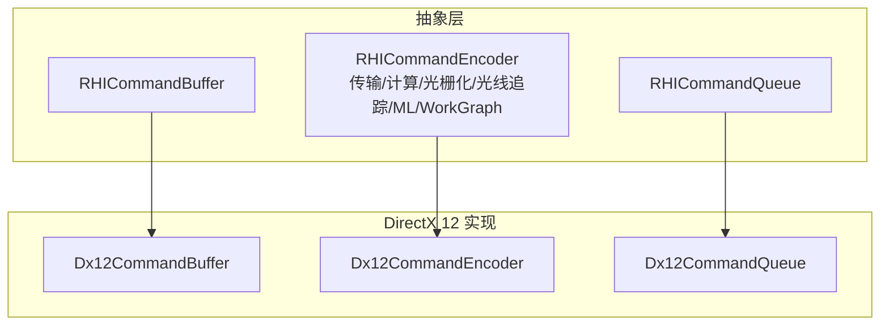
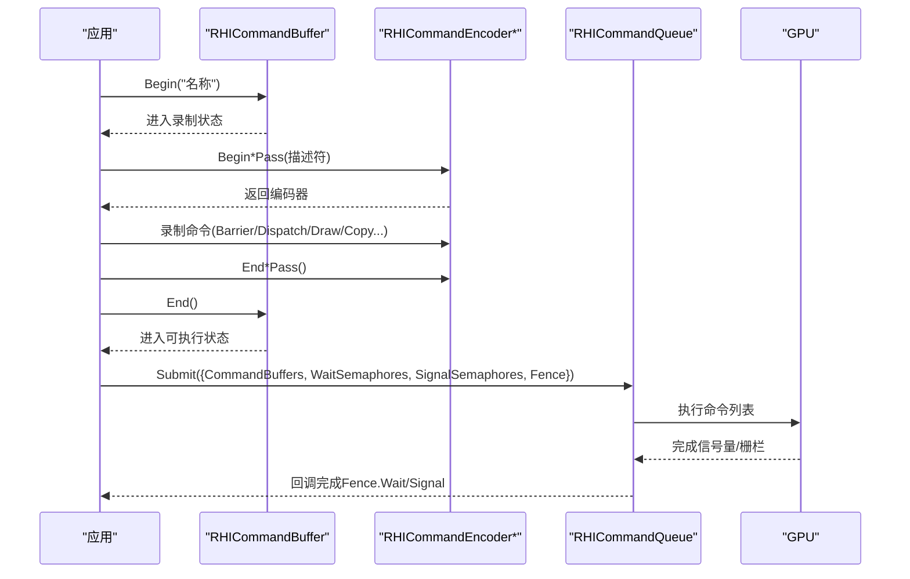
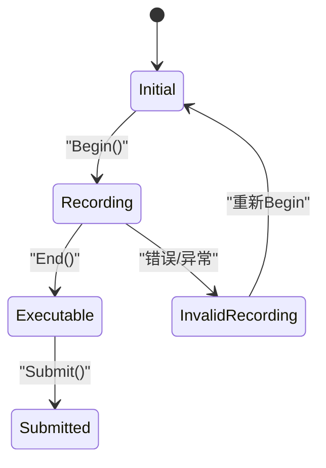
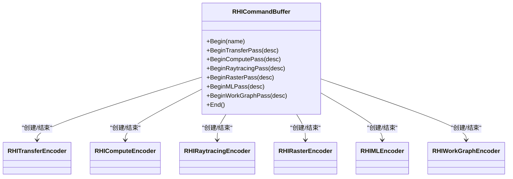
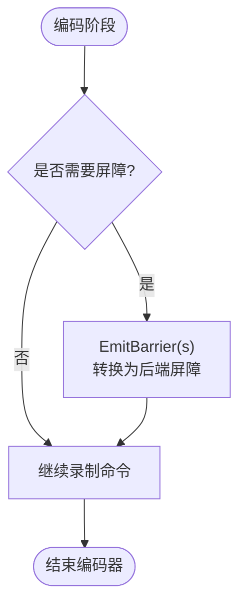
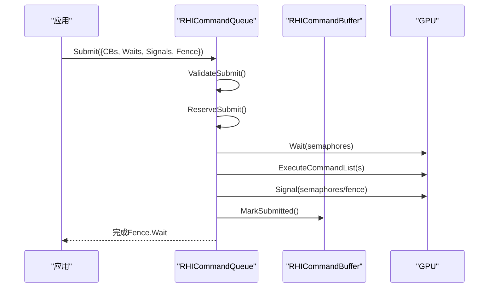
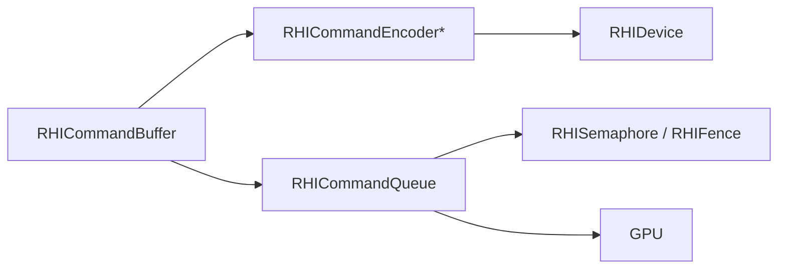

# 命令系统

<cite>
**本文引用的文件**
- [RHICommandBuffer.cs](file://src/SharpGPU/Abstract/RHICommandBuffer.cs)
- [RHICommandEncoder.cs](file://src/SharpGPU/Abstract/RHICommandEncoder.cs)
- [RHICommandQueue.cs](file://src/SharpGPU/Abstract/RHICommandQueue.cs)
- [Dx12CommandBuffer.cs](file://src/SharpGPU/Dx12/Dx12CommandBuffer.cs)
- [Dx12CommandEncoder.cs](file://src/SharpGPU/Dx12/Dx12CommandEncoder.cs)
- [Dx12CommandQueue.cs](file://src/SharpGPU/Dx12/Dx12CommandQueue.cs)
- [ComputeWorkload.cs](file://samples/ComputeAndDraw/ComputeWorkload.cs)
- [RasterWorkload.cs](file://samples/ComputeAndDraw/RasterWorkload.cs)
</cite>

## 目录
1. [简介](#简介)
2. [项目结构](#项目结构)
3. [核心组件](#核心组件)
4. [架构总览](#架构总览)
5. [详细组件分析](#详细组件分析)
6. [依赖关系分析](#依赖关系分析)
7. [性能考量](#性能考量)
8. [故障排查指南](#故障排查指南)
9. [结论](#结论)
10. [附录](#附录)

## 简介
本文件围绕 SharpGPU 的命令系统，系统性阐述命令缓冲（Command Buffer）、编码器（Command Encoder）与队列（Command Queue）的工作机制与执行流程。重点覆盖：
- 命令录制、提交、执行的完整生命周期
- 异步执行模型、命令依赖管理（信号量、栅栏）
- 状态机转换（命令缓冲状态、编码器类型）
- 不同命令类型（计算、光栅化、光线追踪等）的使用方法与优化技巧
- 最佳实践、性能调优与调试方法

## 项目结构
SharpGPU 在抽象层定义跨后端的命令接口，并在具体后端（如 DirectX 12）实现底层调用。关键路径：
- 抽象层：命令缓冲、编码器、队列的通用接口与状态机
- 后端实现：以 Dx12 为例，封装原生命令列表、资源屏障、提交逻辑
- 示例：计算与光栅化工作负载演示命令录制与提交

图表来源
- [RHICommandBuffer.cs:26-190](file://src/SharpGPU/Abstract/RHICommandBuffer.cs#L26-L190)
- [RHICommandEncoder.cs:110-402](file://src/SharpGPU/Abstract/RHICommandEncoder.cs#L110-L402)
- [RHICommandQueue.cs:60-108](file://src/SharpGPU/Abstract/RHICommandQueue.cs#L60-L108)
- [Dx12CommandBuffer.cs:10-56](file://src/SharpGPU/Dx12/Dx12CommandBuffer.cs#L10-L56)
- [Dx12CommandEncoder.cs:12-174](file://src/SharpGPU/Dx12/Dx12CommandEncoder.cs#L12-L174)
- [Dx12CommandQueue.cs:6-56](file://src/SharpGPU/Dx12/Dx12CommandQueue.cs#L6-L56)

章节来源
- [RHICommandBuffer.cs:26-190](file://src/SharpGPU/Abstract/RHICommandBuffer.cs#L26-L190)
- [RHICommandEncoder.cs:110-402](file://src/SharpGPU/Abstract/RHICommandEncoder.cs#L110-L402)
- [RHICommandQueue.cs:60-108](file://src/SharpGPU/Abstract/RHICommandQueue.cs#L60-L108)
- [Dx12CommandBuffer.cs:10-56](file://src/SharpGPU/Dx12/Dx12CommandBuffer.cs#L10-L56)
- [Dx12CommandEncoder.cs:12-174](file://src/SharpGPU/Dx12/Dx12CommandEncoder.cs#L12-L174)
- [Dx12CommandQueue.cs:6-56](file://src/SharpGPU/Dx12/Dx12CommandQueue.cs#L6-L56)

## 核心组件
- 命令缓冲（RHICommandBuffer）：承载一组已录制的命令，维护状态机（初始、录制中、可执行、已提交、无效录制），并协调多种编码器。
- 编码器（RHICommandEncoder）：按任务类型划分（传输、计算、光栅化、光线追踪、机器学习、WorkGraph），提供 Barrier、Dispatch、Draw、Copy 等 API。
- 命令队列（RHICommandQueue）：负责提交命令缓冲到 GPU，处理等待/信号同步原语（信号量、栅栏），并保证提交参数合法性。

章节来源
- [RHICommandBuffer.cs:6-190](file://src/SharpGPU/Abstract/RHICommandBuffer.cs#L6-L190)
- [RHICommandEncoder.cs:110-402](file://src/SharpGPU/Abstract/RHICommandEncoder.cs#L110-L402)
- [RHICommandQueue.cs:6-519](file://src/SharpGPU/Abstract/RHICommandQueue.cs#L6-L519)

## 架构总览
命令系统的典型流程：
1. 创建命令队列与命令缓冲
2. Begin() 开始录制，进入“录制中”状态
3. 通过 Begin*Pass() 获取对应编码器，录制各类命令
4. End*Pass() 结束编码器，End() 结束命令缓冲，进入“可执行”状态
5. Submit() 提交到队列，队列验证并执行，标记为“已提交”
6. 使用 Fence/Semaphore 进行异步完成检测与依赖管理

图表来源
- [RHICommandBuffer.cs:36-164](file://src/SharpGPU/Abstract/RHICommandBuffer.cs#L36-L164)
- [RHICommandEncoder.cs:110-402](file://src/SharpGPU/Abstract/RHICommandEncoder.cs#L110-L402)
- [RHICommandQueue.cs:118-310](file://src/SharpGPU/Abstract/RHICommandQueue.cs#L118-L310)
- [Dx12CommandQueue.cs:58-154](file://src/SharpGPU/Dx12/Dx12CommandQueue.cs#L58-L154)

## 详细组件分析

### 命令缓冲状态机与生命周期
- 状态枚举：Initial、Recording、Executable、Submitted、InvalidRecording
- 关键校验：
  - Begin：确保未处于录制且无活动编码器
  - Begin*Pass/End*Pass：确保当前编码器类型正确且唯一
  - End：确保所有编码器已结束
  - Submit：仅允许从 Executable 状态提交，并提交后转为 Submitted
- 后端实现（Dx12）：Begin 重置分配器与命令列表；End 关闭命令列表；提交时执行 ExecuteCommandList(s)

图表来源
- [RHICommandBuffer.cs:6-164](file://src/SharpGPU/Abstract/RHICommandBuffer.cs#L6-L164)
- [Dx12CommandBuffer.cs:87-210](file://src/SharpGPU/Dx12/Dx12CommandBuffer.cs#L87-L210)

章节来源
- [RHICommandBuffer.cs:6-164](file://src/SharpGPU/Abstract/RHICommandBuffer.cs#L6-L164)
- [Dx12CommandBuffer.cs:87-210](file://src/SharpGPU/Dx12/Dx12CommandBuffer.cs#L87-L210)

### 编码器体系与命令类型
- 传输编码器（RHITransferEncoder）：用于数据拷贝、布局转换、查询解析
- 计算编码器（RHIComputeEncoder）：设置管线、绑定表、PushConstants、Dispatch/Indirect
- 光栅化编码器（RHIRasterEncoder）：设置管线、视口、裁剪、绘制、统计
- 光线追踪编码器（RHIRaytracingEncoder）：构建加速结构、发射射线、函数表绑定
- 机器学习编码器（RHIMLEncoder）：设置 ML 管线与绑定表、Dispatch
- WorkGraph 编码器（RHIWorkGraphEncoder）：设置管线、绑定表、BackingMemory、DispatchGraph

图表来源
- [RHICommandBuffer.cs:170-190](file://src/SharpGPU/Abstract/RHICommandBuffer.cs#L170-L190)
- [RHICommandEncoder.cs:110-402](file://src/SharpGPU/Abstract/RHICommandEncoder.cs#L110-L402)

章节来源
- [RHICommandEncoder.cs:110-402](file://src/SharpGPU/Abstract/RHICommandEncoder.cs#L110-L402)

### 资源屏障与依赖管理
- 屏障（Barrier）：在编码器内对缓冲区或纹理进行访问/布局转换，确保阶段间顺序
- 后端实现（Dx12）：根据能力选择增强屏障或传统 ResourceBarrier，支持全局/缓冲/纹理屏障
- 队列级同步：Wait/Signal 信号量、CompletionFence，确保多帧/多线程安全

图表来源
- [Dx12CommandEncoder.cs:295-672](file://src/SharpGPU/Dx12/Dx12CommandEncoder.cs#L295-L672)
- [RHICommandEncoder.cs:110-133](file://src/SharpGPU/Abstract/RHICommandEncoder.cs#L110-L133)

章节来源
- [Dx12CommandEncoder.cs:295-672](file://src/SharpGPU/Dx12/Dx12CommandEncoder.cs#L295-L672)
- [RHICommandEncoder.cs:110-133](file://src/SharpGPU/Abstract/RHICommandEncoder.cs#L110-L133)

### 提交与执行流程（队列）
- 提交前校验：命令缓冲归属队列、状态为 Executable、无重复、同步原语合法
- 预保留（Reserve）：为等待/信号信号量与栅栏预留值
- 执行：等待信号量 -> 执行命令列表 -> 信号信号量/栅栏
- 提交后：标记命令缓冲为 Submitted，提交成功则 Commit，失败则 Rollback

图表来源
- [RHICommandQueue.cs:118-310](file://src/SharpGPU/Abstract/RHICommandQueue.cs#L118-L310)
- [Dx12CommandQueue.cs:58-154](file://src/SharpGPU/Dx12/Dx12CommandQueue.cs#L58-L154)

章节来源
- [RHICommandQueue.cs:118-310](file://src/SharpGPU/Abstract/RHICommandQueue.cs#L118-L310)
- [Dx12CommandQueue.cs:58-154](file://src/SharpGPU/Dx12/Dx12CommandQueue.cs#L58-L154)

### 不同命令类型的用法与优化
- 计算（Compute）
  - 设置管线、绑定表、PushConstants，Dispatch 或 Indirect Dispatch
  - 优化：合并多次 Dispatch 为一次 Indirect；合理使用 PushConstants 减少绑定开销
- 光栅化（Raster）
  - 设置管线、视口、裁剪，Draw/DrawIndexed；支持统计查询
  - 优化：批处理绘制；合理设置渲染目标与解析；利用子通道（Subpass）减少状态切换
- 光线追踪（RayTracing）
  - 构建加速结构（BLAS/TLAS），设置函数表，Dispatch/DispatchIndirect
  - 优化：复用加速结构；按需更新 TLAS；合并构建批次
- 传输（Transfer）
  - 复制缓冲/纹理，布局转换，查询解析
  - 优化：批量拷贝；避免不必要的布局转换；使用间接拷贝减少 CPU 开销

章节来源
- [RHICommandEncoder.cs:135-402](file://src/SharpGPU/Abstract/RHICommandEncoder.cs#L135-L402)
- [Dx12CommandEncoder.cs:295-672](file://src/SharpGPU/Dx12/Dx12CommandEncoder.cs#L295-L672)

### 示例：计算与光栅化工作负载
- 计算工作负载：创建管线与绑定表，录制 Compute Pass，拷贝结果回读，提交并等待栅栏
- 光栅化工作负载：创建管线与渲染目标，录制 Raster Pass，启用统计查询，提交并读取统计

章节来源
- [ComputeWorkload.cs:45-161](file://samples/ComputeAndDraw/ComputeWorkload.cs#L45-L161)
- [RasterWorkload.cs:37-161](file://samples/ComputeAndDraw/RasterWorkload.cs#L37-L161)

## 依赖关系分析
- 耦合性：
  - 命令缓冲持有各类型编码器实例，统一生命周期管理
  - 编码器依赖命令缓冲以进行屏障与状态校验
  - 队列负责提交与同步，不直接操作资源
- 外部依赖：
  - 后端实现（Dx12）依赖 Vortice.Direct3D12 进行原生调用
  - 同步原语（信号量、栅栏）由设备创建，跨命令缓冲共享

图表来源
- [RHICommandBuffer.cs:26-190](file://src/SharpGPU/Abstract/RHICommandBuffer.cs#L26-L190)
- [RHICommandQueue.cs:60-108](file://src/SharpGPU/Abstract/RHICommandQueue.cs#L60-L108)

章节来源
- [RHICommandBuffer.cs:26-190](file://src/SharpGPU/Abstract/RHICommandBuffer.cs#L26-L190)
- [RHICommandQueue.cs:60-108](file://src/SharpGPU/Abstract/RHICommandQueue.cs#L60-L108)

## 性能考量
- 减少状态切换：尽量在同一 Pass 内完成相关命令，避免频繁 Begin/End
- 批处理与间接命令：使用 Indirect Dispatch/Draw 降低 CPU 开销
- 屏障最小化：仅在必要时插入屏障，合并多个屏障为一个
- 管线复用：缓存管线与布局，避免重复创建
- 内存与绑定表：合理组织绑定表，减少动态绑定频率
- 统计与调试：使用 Query 统计像素/图元数量，定位瓶颈

[本节为通用指导，无需特定文件引用]

## 故障排查指南
- 常见错误与原因：
  - 命令缓冲未结束即提交：需先 End() 再 Submit()
  - 重复提交同一命令缓冲：提交列表中不允许重复
  - 信号量/栅栏来自不同设备：需确保同设备创建
  - 屏障对象不属于当前后端：需使用对应后端的资源类型
- 调试建议：
  - 使用命名（Name）标识命令与 Pass，便于工具分析
  - 捕获异常堆栈，检查 Begin/End 配对是否正确
  - 使用 Fence.Wait 确认命令完成后再读取结果

章节来源
- [RHICommandQueue.cs:118-242](file://src/SharpGPU/Abstract/RHICommandQueue.cs#L118-L242)
- [Dx12CommandBuffer.cs:87-210](file://src/SharpGPU/Dx12/Dx12CommandBuffer.cs#L87-L210)

## 结论
SharpGPU 的命令系统通过抽象层统一了跨后端的命令录制与提交接口，并以状态机保障命令缓冲的生命周期安全。编码器按任务类型拆分，便于管理与优化。队列层提供强大的同步能力，支持异步执行与依赖管理。结合示例与最佳实践，开发者可以高效地构建高性能图形与计算流水线。

[本节为总结，无需特定文件引用]

## 附录
- 术语表：
  - 命令缓冲：记录 GPU 命令的数据结构
  - 编码器：针对特定任务类型的命令录制接口
  - 队列：提交命令并驱动 GPU 执行的对象
  - 屏障：资源访问与布局转换的同步点
  - 信号量/栅栏：跨命令/线程的同步原语

[本节为概念说明，无需特定文件引用]