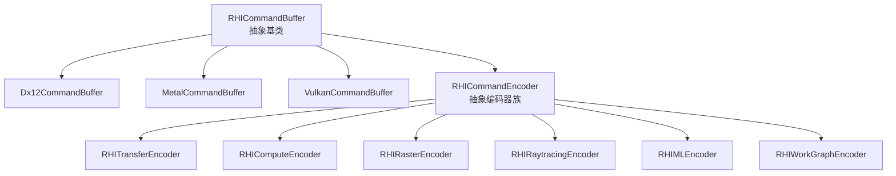
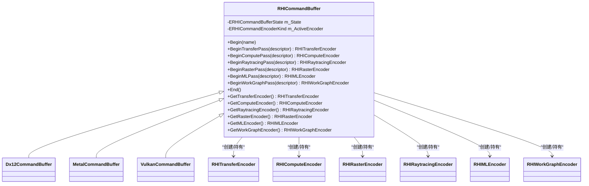
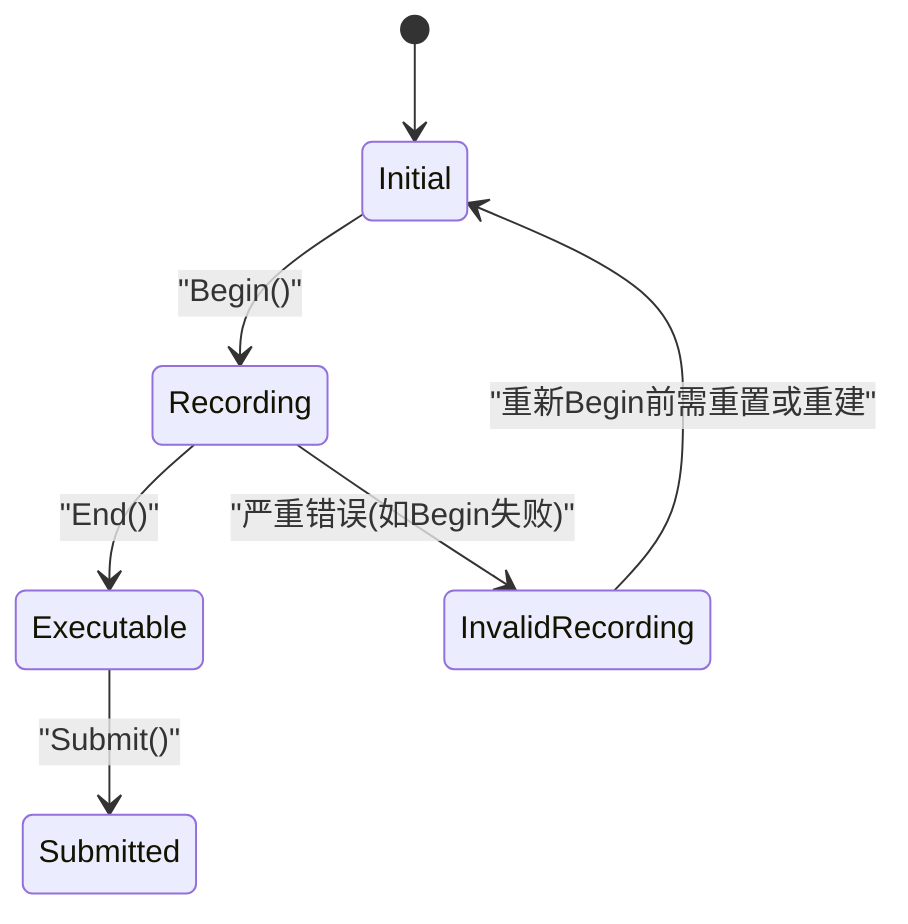
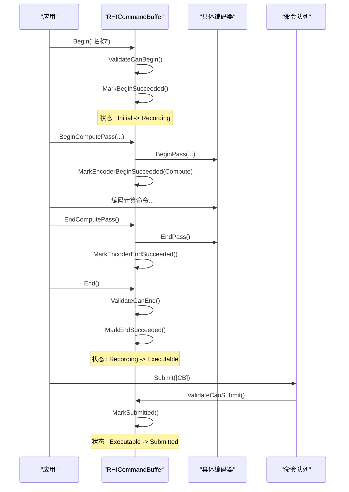
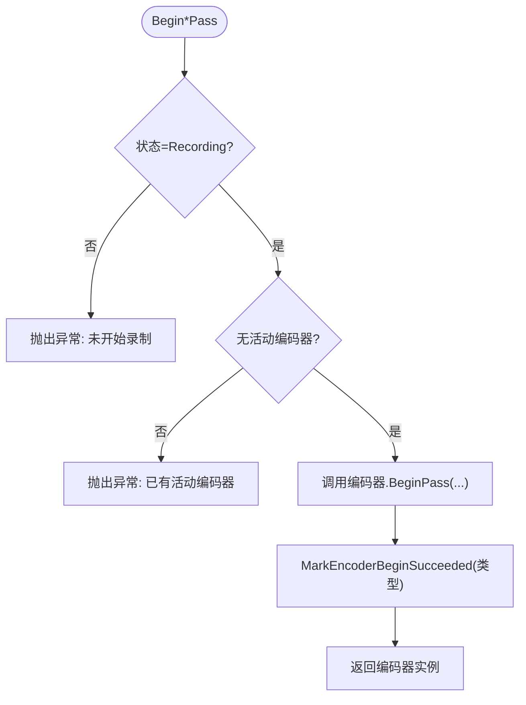
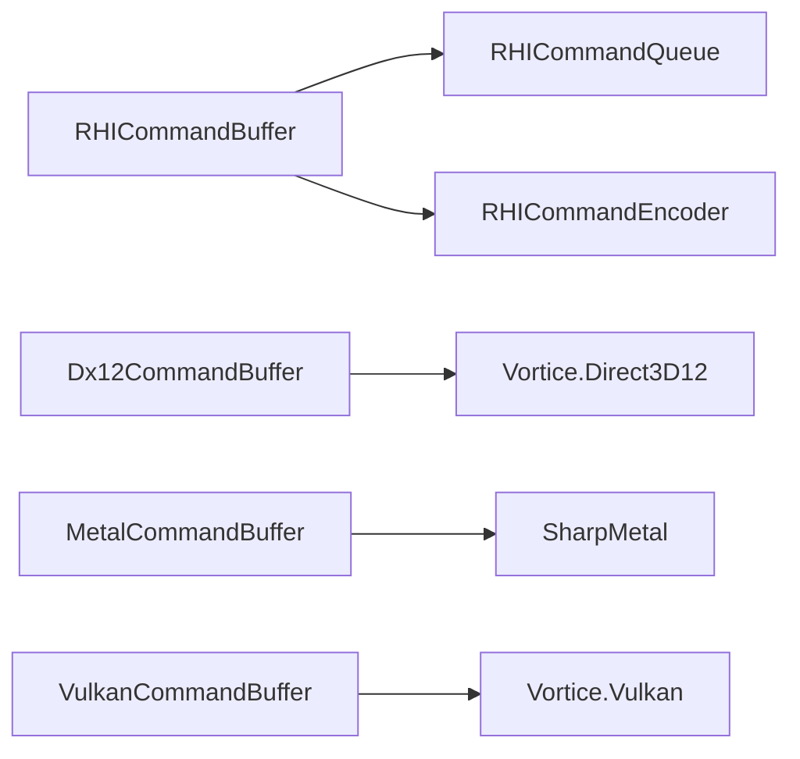

# 命令缓冲

<cite>
**本文引用的文件**
- [RHICommandBuffer.cs](file://src/SharpGPU/Abstract/RHICommandBuffer.cs)
- [RHICommandEncoder.cs](file://src/SharpGPU/Abstract/RHICommandEncoder.cs)
- [Dx12CommandBuffer.cs](file://src/SharpGPU/Dx12/Dx12CommandBuffer.cs)
- [MetalCommandBuffer.cs](file://src/SharpGPU/Metal/MetalCommandBuffer.cs)
- [VulkanCommandBuffer.cs](file://src/SharpGPU/Vulkan/VulkanCommandBuffer.cs)
- [RHICommandBufferScopes.cs](file://src/SharpGPU/Common/Scopes/RHICommandBufferScopes.cs)
- [RasterWorkload.cs](file://samples/ComputeAndDraw/RasterWorkload.cs)
</cite>

## 目录
1. [简介](#简介)
2. [项目结构](#项目结构)
3. [核心组件](#核心组件)
4. [架构总览](#架构总览)
5. [详细组件分析](#详细组件分析)
6. [依赖关系分析](#依赖关系分析)
7. [性能考虑](#性能考虑)
8. [故障排查指南](#故障排查指南)
9. [结论](#结论)
10. [附录：使用示例与最佳实践](#附录使用示例与最佳实践)

## 简介
本文件聚焦 SharpGPU 的 RHICommandBuffer 设计与实现，系统性阐述其状态机、生命周期管理、与编码器的协作关系、跨后端（DirectX12、Metal、Vulkan）的差异与共性，以及重用策略、错误处理与性能优化建议。文档同时提供基于仓库代码的流程图与时序图，帮助读者从抽象到具体逐步理解命令缓冲的工作方式。

## 项目结构
SharpGPU 将命令缓冲抽象为平台无关接口，并在各后端提供具体实现：
- 抽象层：定义命令缓冲状态机、编码器类型、生命周期方法等
- 后端实现：分别封装 DirectX12、Metal、Vulkan 的原生命令缓冲对象与资源管理
- 作用域工具：提供 RAII 风格的 Scope 以简化 Begin/End 配对
- 示例：展示完整的命令缓冲使用流程

图表来源
- [RHICommandBuffer.cs:6-24](file://src/SharpGPU/Abstract/RHICommandBuffer.cs#L6-L24)
- [RHICommandEncoder.cs:110-402](file://src/SharpGPU/Abstract/RHICommandEncoder.cs#L110-L402)
- [Dx12CommandBuffer.cs:10-56](file://src/SharpGPU/Dx12/Dx12CommandBuffer.cs#L10-L56)
- [MetalCommandBuffer.cs:8-48](file://src/SharpGPU/Metal/MetalCommandBuffer.cs#L8-L48)
- [VulkanCommandBuffer.cs:9-80](file://src/SharpGPU/Vulkan/VulkanCommandBuffer.cs#L9-L80)

章节来源
- [RHICommandBuffer.cs:6-24](file://src/SharpGPU/Abstract/RHICommandBuffer.cs#L6-L24)
- [RHICommandEncoder.cs:110-402](file://src/SharpGPU/Abstract/RHICommandEncoder.cs#L110-L402)

## 核心组件
- RHICommandBuffer：命令缓冲抽象基类，维护状态机与活动编码器，提供 Begin/End、Begin*Pass/End*Pass、Get*Encoder 等方法
- ERHICommandBufferState：命令缓冲状态枚举，包含 Initial、Recording、Executable、Submitted、InvalidRecording
- ERHICommandEncoderKind：活动编码器类型枚举，包含 None、Transfer、Compute、RayTracing、MachineLearning、WorkGraph
- 各类编码器：RHITransferEncoder、RHIComputeEncoder、RHIRasterEncoder、RHIRaytracingEncoder、RHIMLEncoder、RHIWorkGraphEncoder
- 后端实现：Dx12CommandBuffer、MetalCommandBuffer、VulkanCommandBuffer
- 作用域工具：RHICommandBufferScope 与各 Pass 的 Scope，用于自动 End

章节来源
- [RHICommandBuffer.cs:6-24](file://src/SharpGPU/Abstract/RHICommandBuffer.cs#L6-L24)
- [RHICommandBuffer.cs:26-190](file://src/SharpGPU/Abstract/RHICommandBuffer.cs#L26-L190)
- [RHICommandEncoder.cs:110-402](file://src/SharpGPU/Abstract/RHICommandEncoder.cs#L110-L402)
- [RHICommandBufferScopes.cs:6-168](file://src/SharpGPU/Common/Scopes/RHICommandBufferScopes.cs#L6-L168)

## 架构总览
命令缓冲是 GPU 命令录制的入口，通过状态机确保录制、结束、提交的生命周期正确；每个命令缓冲在同一时间只能有一个活动编码器，且必须成对开启和关闭。不同后端在 Begin/End 时调用各自原生命令缓冲 API，并管理临时资源。

图表来源
- [RHICommandBuffer.cs:26-190](file://src/SharpGPU/Abstract/RHICommandBuffer.cs#L26-L190)
- [Dx12CommandBuffer.cs:10-56](file://src/SharpGPU/Dx12/Dx12CommandBuffer.cs#L10-L56)
- [MetalCommandBuffer.cs:8-48](file://src/SharpGPU/Metal/MetalCommandBuffer.cs#L8-L48)
- [VulkanCommandBuffer.cs:9-80](file://src/SharpGPU/Vulkan/VulkanCommandBuffer.cs#L9-L80)
- [RHICommandEncoder.cs:110-402](file://src/SharpGPU/Abstract/RHICommandEncoder.cs#L110-L402)

## 详细组件分析

### 状态机与转换规则
命令缓冲的状态机由内部状态枚举驱动，关键状态包括：
- Initial：初始空闲状态
- Recording：开始录制后进入，允许开启/结束编码器
- Executable：结束录制后可提交
- Submitted：已提交给队列执行
- InvalidRecording：录制过程中发生严重错误，进入不可恢复状态

图表来源
- [RHICommandBuffer.cs:6-13](file://src/SharpGPU/Abstract/RHICommandBuffer.cs#L6-L13)
- [RHICommandBuffer.cs:36-163](file://src/SharpGPU/Abstract/RHICommandBuffer.cs#L36-L163)

章节来源
- [RHICommandBuffer.cs:6-13](file://src/SharpGPU/Abstract/RHICommandBuffer.cs#L6-L13)
- [RHICommandBuffer.cs:36-163](file://src/SharpGPU/Abstract/RHICommandBuffer.cs#L36-L163)

### 生命周期管理：从 Begin() 到 End()
- Begin(name)：校验当前状态，重置后端命令分配器/列表，设置描述符堆，标记进入 Recording
- Begin*Pass(...)：校验处于 Recording 且无活动编码器，开启对应编码器，标记活动编码器类型
- End*Pass()：校验活动编码器匹配，结束编码器，清除活动编码器
- End()：校验处于 Recording 且无活动编码器，关闭后端命令缓冲，标记进入 Executable
- Submit()：校验处于 Executable，标记 Submitted 并触发 OnSubmitted

图表来源
- [RHICommandBuffer.cs:36-163](file://src/SharpGPU/Abstract/RHICommandBuffer.cs#L36-L163)
- [Dx12CommandBuffer.cs:87-210](file://src/SharpGPU/Dx12/Dx12CommandBuffer.cs#L87-L210)
- [MetalCommandBuffer.cs:50-167](file://src/SharpGPU/Metal/MetalCommandBuffer.cs#L50-L167)
- [VulkanCommandBuffer.cs:82-555](file://src/SharpGPU/Vulkan/VulkanCommandBuffer.cs#L82-L555)

章节来源
- [RHICommandBuffer.cs:36-163](file://src/SharpGPU/Abstract/RHICommandBuffer.cs#L36-L163)
- [Dx12CommandBuffer.cs:87-210](file://src/SharpGPU/Dx12/Dx12CommandBuffer.cs#L87-L210)
- [MetalCommandBuffer.cs:50-167](file://src/SharpGPU/Metal/MetalCommandBuffer.cs#L50-L167)
- [VulkanCommandBuffer.cs:82-555](file://src/SharpGPU/Vulkan/VulkanCommandBuffer.cs#L82-L555)

### 命令缓冲与编码器之间的关系
- 一个命令缓冲在同一时刻仅能有一个活动编码器，类型由 ERHICommandEncoderKind 表示
- 开启编码器前会检查当前是否处于 Recording 且无活动编码器；结束时严格匹配活动编码器类型
- 各后端在 Begin*Pass 中调用对应编码器的 BeginPass，并记录活动编码器；End*Pass 则委托编码器完成收尾

图表来源
- [RHICommandBuffer.cs:65-120](file://src/SharpGPU/Abstract/RHICommandBuffer.cs#L65-L120)
- [RHICommandEncoder.cs:110-402](file://src/SharpGPU/Abstract/RHICommandEncoder.cs#L110-L402)

章节来源
- [RHICommandBuffer.cs:65-120](file://src/SharpGPU/Abstract/RHICommandBuffer.cs#L65-L120)
- [RHICommandEncoder.cs:110-402](file://src/SharpGPU/Abstract/RHICommandEncoder.cs#L110-L402)

### 不同编码器之间的切换
- 必须在结束上一个编码器之后才能开启下一个编码器
- 若尝试在未结束的情况下开启新编码器，会抛出“已有活动编码器”的错误
- 各后端实现遵循同一约束，保证跨后端行为一致

章节来源
- [RHICommandBuffer.cs:65-120](file://src/SharpGPU/Abstract/RHICommandBuffer.cs#L65-L120)
- [Dx12CommandBuffer.cs:113-186](file://src/SharpGPU/Dx12/Dx12CommandBuffer.cs#L113-L186)
- [MetalCommandBuffer.cs:61-137](file://src/SharpGPU/Metal/MetalCommandBuffer.cs#L61-L137)
- [VulkanCommandBuffer.cs:441-525](file://src/SharpGPU/Vulkan/VulkanCommandBuffer.cs#L441-L525)

### 后端差异与特性
- DirectX12：
  - Begin 时重置命令分配器和命令列表，设置描述符堆
  - End 时关闭命令列表，调试模式下输出设备消息
  - 支持 Work Graph 与 ML 编码器（根据能力）
- Metal：
  - 延迟创建 MTL4CommandBuffer，首次需要时创建并绑定分配器
  - 跟踪编码器内阶段位，辅助屏障决策
  - Work Graph 在当前实现中不支持
- Vulkan：
  - Begin 时重置命令缓冲并开始录制，清理图像布局覆盖表
  - 提供图像布局覆盖与回滚机制，保障一致性
  - ML 与 Work Graph 在当前实现中不可用

章节来源
- [Dx12CommandBuffer.cs:58-111](file://src/SharpGPU/Dx12/Dx12CommandBuffer.cs#L58-L111)
- [Dx12CommandBuffer.cs:189-210](file://src/SharpGPU/Dx12/Dx12CommandBuffer.cs#L189-L210)
- [MetalCommandBuffer.cs:213-244](file://src/SharpGPU/Metal/MetalCommandBuffer.cs#L213-L244)
- [MetalCommandBuffer.cs:257-290](file://src/SharpGPU/Metal/MetalCommandBuffer.cs#L257-L290)
- [VulkanCommandBuffer.cs:82-98](file://src/SharpGPU/Vulkan/VulkanCommandBuffer.cs#L82-L98)
- [VulkanCommandBuffer.cs:100-194](file://src/SharpGPU/Vulkan/VulkanCommandBuffer.cs#L100-L194)

### 命令缓冲的重用策略
- 复用前提：先 End()，再 Begin() 下一帧
- DirectX12：Begin 时 Reset 命令分配器与命令列表，释放临时 CBV/SRV/UAV 描述符
- Metal：Begin 时释放原生命令对象并重置状态，必要时延迟创建 MTL4CommandBuffer
- Vulkan：Begin 时重置命令缓冲，清理图像布局覆盖表与临时资源

章节来源
- [Dx12CommandBuffer.cs:87-111](file://src/SharpGPU/Dx12/Dx12CommandBuffer.cs#L87-L111)
- [Dx12CommandBuffer.cs:262-282](file://src/SharpGPU/Dx12/Dx12CommandBuffer.cs#L262-L282)
- [MetalCommandBuffer.cs:50-59](file://src/SharpGPU/Metal/MetalCommandBuffer.cs#L50-L59)
- [MetalCommandBuffer.cs:292-308](file://src/SharpGPU/Metal/MetalCommandBuffer.cs#L292-L308)
- [VulkanCommandBuffer.cs:82-98](file://src/SharpGPU/Vulkan/VulkanCommandBuffer.cs#L82-L98)
- [VulkanCommandBuffer.cs:410-428](file://src/SharpGPU/Vulkan/VulkanCommandBuffer.cs#L410-L428)

### 错误处理机制
- 状态校验：Begin/End/Submit 均进行状态与活动编码器校验，非法操作抛出 InvalidOperationException
- 后端异常：捕获后端异常并附加上下文信息（例如 DirectX12 在 End 失败时输出设备消息）
- 回滚与清理：Vulkan 在栅格通道开始失败时回滚图像布局与临时资源，并标记录制无效

章节来源
- [RHICommandBuffer.cs:36-163](file://src/SharpGPU/Abstract/RHICommandBuffer.cs#L36-L163)
- [Dx12CommandBuffer.cs:189-210](file://src/SharpGPU/Dx12/Dx12CommandBuffer.cs#L189-L210)
- [VulkanCommandBuffer.cs:163-194](file://src/SharpGPU/Vulkan/VulkanCommandBuffer.cs#L163-L194)

### 性能优化技巧
- 避免频繁创建命令缓冲：尽量复用命令缓冲，减少分配与重置开销
- 合理组织 Pass：将同类型命令合并到同一 Pass，减少状态切换
- 合理使用屏障：仅在必要处插入屏障，利用后端提供的阶段追踪（如 Metal）降低多余同步
- 使用作用域：借助 Scope 确保 End 被调用，避免泄漏与死锁
- 调试标记：启用后端调试事件（如 PIX），便于定位瓶颈

章节来源
- [RHICommandBufferScopes.cs:6-168](file://src/SharpGPU/Common/Scopes/RHICommandBufferScopes.cs#L6-L168)
- [MetalCommandBuffer.cs:257-290](file://src/SharpGPU/Metal/MetalCommandBuffer.cs#L257-L290)
- [Dx12CommandBuffer.cs:105-111](file://src/SharpGPU/Dx12/Dx12CommandBuffer.cs#L105-L111)

## 依赖关系分析
命令缓冲依赖命令队列获取设备能力与提交命令；编码器依赖命令缓冲进行状态校验与资源访问；各后端实现依赖原生库（Vortice.Direct3D12、SharpMetal、Vortice.Vulkan）。

图表来源
- [RHICommandBuffer.cs:26-34](file://src/SharpGPU/Abstract/RHICommandBuffer.cs#L26-L34)
- [Dx12CommandBuffer.cs:10-35](file://src/SharpGPU/Dx12/Dx12CommandBuffer.cs#L10-L35)
- [MetalCommandBuffer.cs:8-30](file://src/SharpGPU/Metal/MetalCommandBuffer.cs#L8-L30)
- [VulkanCommandBuffer.cs:9-41](file://src/SharpGPU/Vulkan/VulkanCommandBuffer.cs#L9-L41)

章节来源
- [RHICommandBuffer.cs:26-34](file://src/SharpGPU/Abstract/RHICommandBuffer.cs#L26-L34)
- [Dx12CommandBuffer.cs:10-35](file://src/SharpGPU/Dx12/Dx12CommandBuffer.cs#L10-L35)
- [MetalCommandBuffer.cs:8-30](file://src/SharpGPU/Metal/MetalCommandBuffer.cs#L8-L30)
- [VulkanCommandBuffer.cs:9-41](file://src/SharpGPU/Vulkan/VulkanCommandBuffer.cs#L9-L41)

## 性能考虑
- 复用命令缓冲与编码器，减少对象创建与销毁
- 批量编码同类型命令，减少状态切换
- 谨慎使用屏障，结合后端阶段追踪最小化同步
- 使用作用域确保资源及时释放，避免内存泄漏
- 在调试构建中使用后端调试事件定位问题

[本节为通用指导，不直接分析具体文件]

## 故障排查指南
- 常见错误：
  - “命令缓冲已在录制中”：重复 Begin 或未 End 就再次 Begin
  - “存在活动编码器”：未结束上一个编码器就开启新的
  - “命令缓冲未结束就提交”：未调用 End() 直接 Submit
  - “后端命令缓冲未结束就提交”：Metal 端未在 End() 中结束原生命令缓冲
- 诊断步骤：
  - 检查状态机转换是否正确
  - 确认所有 Begin*Pass 都有对应的 End*Pass
  - 查看后端异常信息与设备日志（如 DirectX12 的设备消息）
  - 使用作用域包裹命令缓冲与 Pass，确保异常路径也能 End

章节来源
- [RHICommandBuffer.cs:36-163](file://src/SharpGPU/Abstract/RHICommandBuffer.cs#L36-L163)
- [Dx12CommandBuffer.cs:189-210](file://src/SharpGPU/Dx12/Dx12CommandBuffer.cs#L189-L210)
- [MetalCommandBuffer.cs:157-167](file://src/SharpGPU/Metal/MetalCommandBuffer.cs#L157-L167)
- [VulkanCommandBuffer.cs:163-194](file://src/SharpGPU/Vulkan/VulkanCommandBuffer.cs#L163-L194)

## 结论
SharpGPU 的命令缓冲通过清晰的状态机与严格的编码器管理，确保了跨后端的一致性与安全性。各后端在 Begin/End 时管理各自的资源与状态，提供了健壮的错误处理与回滚机制。合理使用复用策略、屏障与作用域，可以显著提升性能与稳定性。

[本节为总结性内容，不直接分析具体文件]

## 附录：使用示例与最佳实践
- 基本流程：
  - 创建命令缓冲
  - Begin("名称")
  - 开启 Pass（传输/计算/栅格/光线追踪/ML/工作图）
  - 编码命令
  - 结束 Pass
  - End()
  - 提交到队列并等待完成
- 推荐模式：
  - 使用 RHICommandBufferScope 与各 Pass 的 Scope 自动管理 End
  - 将相关命令组织在同一 Pass 中，减少状态切换
  - 在异常路径下确保资源释放（Scope 可帮助）
- 参考示例：
  - 栅格绘制与统计查询的完整流程见示例文件

章节来源
- [RasterWorkload.cs:104-151](file://samples/ComputeAndDraw/RasterWorkload.cs#L104-L151)
- [RHICommandBufferScopes.cs:6-168](file://src/SharpGPU/Common/Scopes/RHICommandBufferScopes.cs#L6-L168)