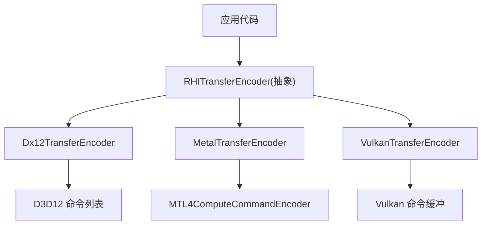
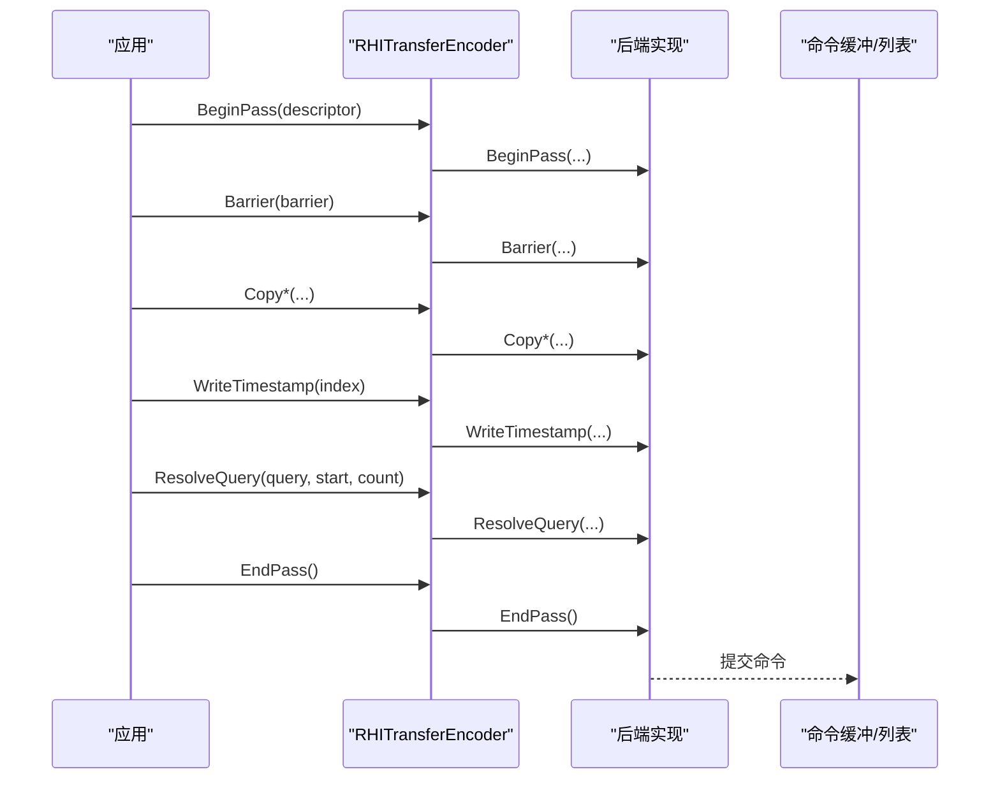
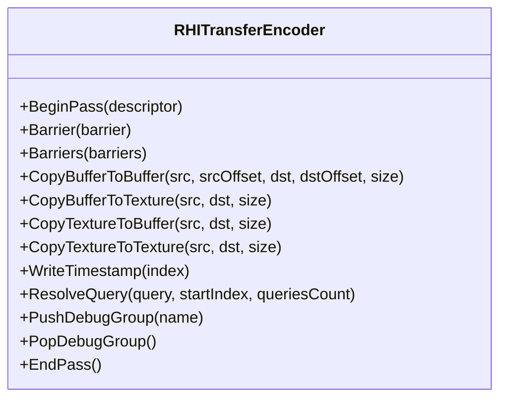
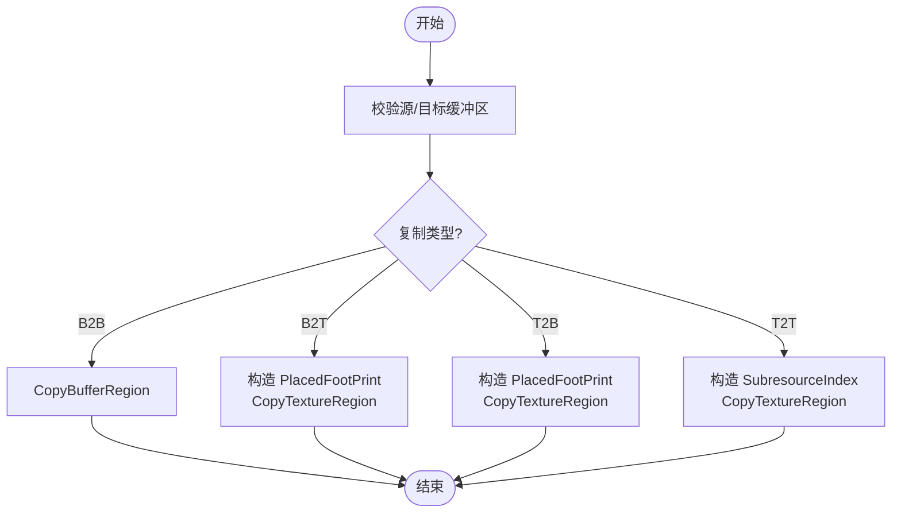
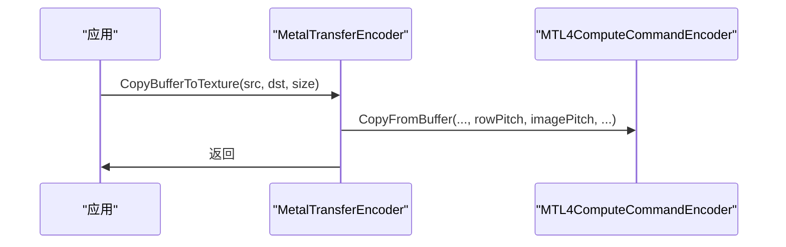
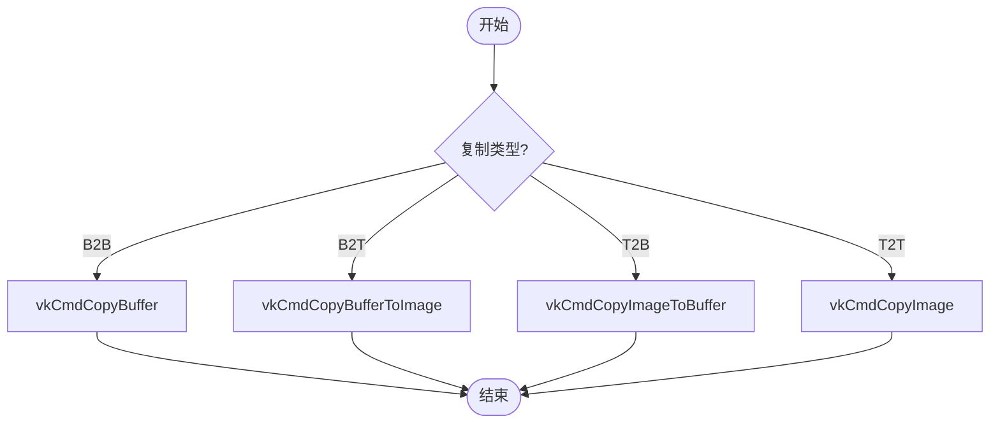
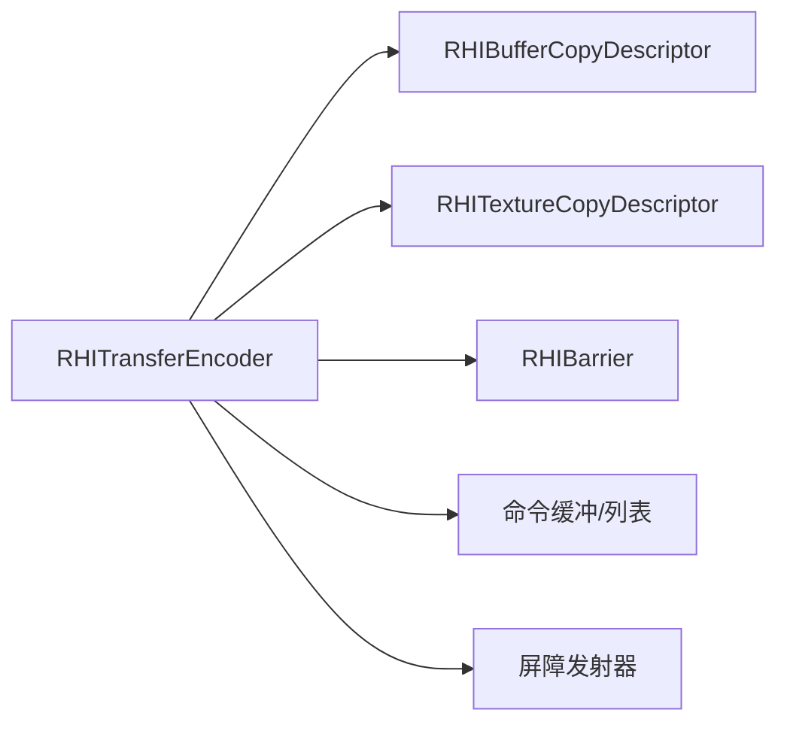
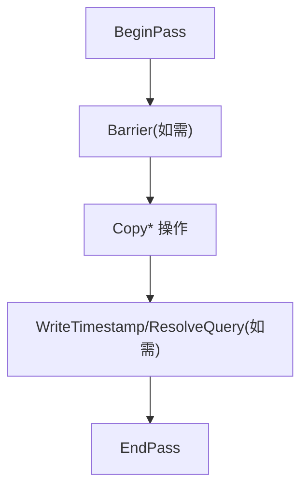

# 传输编码器

<cite>
**本文引用的文件**
- [RHICommandEncoder.cs](file://src/SharpGPU/Abstract/RHICommandEncoder.cs)
- [Dx12CommandEncoder.cs](file://src/SharpGPU/Dx12/Dx12CommandEncoder.cs)
- [MetalCommandEncoder.cs](file://src/SharpGPU/Metal/MetalCommandEncoder.cs)
- [VulkanCommandEncoder.cs](file://src/SharpGPU/Vulkan/VulkanCommandEncoder.cs)
- [RHISynchronous.cs](file://src/SharpGPU/Abstract/RHISynchronous.cs)
</cite>

## 目录
1. [简介](#简介)
2. [项目结构](#项目结构)
3. [核心组件](#核心组件)
4. [架构总览](#架构总览)
5. [详细组件分析](#详细组件分析)
6. [依赖关系分析](#依赖关系分析)
7. [性能考虑](#性能考虑)
8. [故障排查指南](#故障排查指南)
9. [结论](#结论)
10. [附录：使用示例与最佳实践](#附录使用示例与最佳实践)

## 简介
本文件聚焦于 SharpGPU 的传输编码器（RHITransferEncoder），系统阐述其职责、API 接口、作用域管理、资源状态转换机制，以及在不同后端（Direct3D 12、Metal、Vulkan）中的具体实现。文档覆盖以下数据传输操作：
- 缓冲区到缓冲区复制
- 缓冲区到纹理复制
- 纹理到缓冲区复制
- 纹理到纹理复制

同时提供屏障（Barrier）的使用方式、查询时间戳与统计解析、调试标记等能力说明，并给出性能调优建议与常见问题解决方案。

## 项目结构
传输编码器在抽象层定义统一接口，各后端分别实现：
- 抽象层：RHITransferEncoder 定义 BeginPass、Barrier、Copy* 等方法
- 后端实现：
  - Dx12TransferEncoder：基于 Direct3D 12 命令列表
  - MetalTransferEncoder：基于 Metal 计算命令编码器（用于传输）
  - VulkanTransferEncoder：基于 Vulkan 命令缓冲

图表来源
- [RHICommandEncoder.cs:110-133](file://src/SharpGPU/Abstract/RHICommandEncoder.cs#L110-L133)
- [Dx12CommandEncoder.cs:1483-1679](file://src/SharpGPU/Dx12/Dx12CommandEncoder.cs#L1483-L1679)
- [MetalCommandEncoder.cs:1386-1579](file://src/SharpGPU/Metal/MetalCommandEncoder.cs#L1386-L1579)
- [VulkanCommandEncoder.cs:875-1056](file://src/SharpGPU/Vulkan/VulkanCommandEncoder.cs#L875-L1056)

章节来源
- [RHICommandEncoder.cs:110-133](file://src/SharpGPU/Abstract/RHICommandEncoder.cs#L110-L133)

## 核心组件
- RHITransferEncoder：抽象传输编码器基类，封装传输通道的生命周期与通用 API
- RHIBufferCopyDescriptor / RHITextureCopyDescriptor：描述缓冲区与纹理复制的参数
- RHITransferPassDescriptor：传输通道描述（名称、可选的时间戳）
- RHIBarrier：资源屏障，用于阶段与访问权限转换，支持全局、缓冲区、纹理三种类型

关键要点
- 传输编码器通过 BeginPass 进入作用域，EndPass 退出；期间可执行 Barrier、Copy*、WriteTimestamp、ResolveQuery、Push/PopDebugGroup
- 各后端将高层 API 映射为原生命令（如 CopyBufferRegion、CopyTextureRegion、vkCmdCopyImage 等）
- 屏障由后端专用发射器生成（如 Dx12BarrierEmitter、VulkanBarrierEmitter、MetalBarrierHelper）

章节来源
- [RHICommandEncoder.cs:55-133](file://src/SharpGPU/Abstract/RHICommandEncoder.cs#L55-L133)
- [RHISynchronous.cs:437-629](file://src/SharpGPU/Abstract/RHISynchronous.cs#L437-L629)

## 架构总览
传输编码器的调用流程如下：
- 应用创建并获取传输编码器实例
- 调用 BeginPass 开始记录
- 根据需要插入 Barrier 进行资源状态同步
- 执行一个或多个 Copy* 操作
- 可选写入时间戳或解析查询结果
- 调用 EndPass 结束记录并提交

图表来源
- [RHICommandEncoder.cs:110-133](file://src/SharpGPU/Abstract/RHICommandEncoder.cs#L110-L133)
- [Dx12CommandEncoder.cs:1483-1679](file://src/SharpGPU/Dx12/Dx12CommandEncoder.cs#L1483-L1679)
- [MetalCommandEncoder.cs:1386-1579](file://src/SharpGPU/Metal/MetalCommandEncoder.cs#L1386-L1579)
- [VulkanCommandEncoder.cs:875-1056](file://src/SharpGPU/Vulkan/VulkanCommandEncoder.cs#L875-L1056)

## 详细组件分析

### 抽象传输编码器（RHITransferEncoder）
- 作用：定义统一的传输通道 API 与生命周期管理
- 主要方法：
  - BeginPass：开启传输通道，支持命名与时间戳
  - Barrier/Barriers：插入资源屏障，确保阶段与访问权限正确
  - CopyBufferToBuffer/CopyBufferToTexture/CopyTextureToBuffer/CopyTextureToTexture：四类复制操作
  - WriteTimestamp/ResolveQuery：计时与查询解析
  - PushDebugGroup/PopDebugGroup：调试分组标记
  - EndPass：结束传输通道（默认抛出未实现异常，由各后端覆写）

图表来源
- [RHICommandEncoder.cs:110-133](file://src/SharpGPU/Abstract/RHICommandEncoder.cs#L110-L133)

章节来源
- [RHICommandEncoder.cs:110-133](file://src/SharpGPU/Abstract/RHICommandEncoder.cs#L110-L133)

### Direct3D 12 传输编码器（Dx12TransferEncoder）
- 作用：将 RHITransferEncoder 的 API 映射到 D3D12 命令列表
- 关键点：
  - CopyBufferToBuffer：调用 CopyBufferRegion
  - CopyBufferToTexture/CopyTextureToBuffer/CopyTextureToTexture：构造 TextureCopyLocation 与 Box，调用 CopyTextureRegion
  - Barrier：委托给 Dx12BarrierEmitter 生成资源屏障
  - 时间戳：通过 QueryHeap 的 Timestamp 查询

图表来源
- [Dx12CommandEncoder.cs:1555-1673](file://src/SharpGPU/Dx12/Dx12CommandEncoder.cs#L1555-L1673)

章节来源
- [Dx12CommandEncoder.cs:1483-1679](file://src/SharpGPU/Dx12/Dx12CommandEncoder.cs#L1483-L1679)

### Metal 传输编码器（MetalTransferEncoder）
- 作用：使用 MTL4ComputeCommandEncoder 执行传输任务
- 关键点：
  - CopyBufferToBuffer：CopyFromBuffer
  - CopyBufferToTexture/CopyTextureToBuffer：CopyFromBuffer/CopyFromTexture，处理行距与图像间距
  - CopyTextureToTexture：CopyFromTexture
  - Barrier：通过 MetalBarrierHelper 计划并应用屏障
  - 阶段标记：调用 MarkStagesSeen 标记传输阶段已见

图表来源
- [MetalCommandEncoder.cs:1492-1518](file://src/SharpGPU/Metal/MetalCommandEncoder.cs#L1492-L1518)

章节来源
- [MetalCommandEncoder.cs:1386-1579](file://src/SharpGPU/Metal/MetalCommandEncoder.cs#L1386-L1579)

### Vulkan 传输编码器（VulkanTransferEncoder）
- 作用：将 RHITransferEncoder 的 API 映射到 Vulkan 命令缓冲
- 关键点：
  - CopyBufferToBuffer：vkCmdCopyBuffer
  - CopyBufferToTexture/CopyTextureToBuffer：vkCmdCopyBufferToImage/vkCmdCopyImageToBuffer，设置 VkBufferImageCopy
  - CopyTextureToTexture：vkCmdCopyImage，设置 VkImageCopy
  - Barrier：委托给 VulkanBarrierEmitter
  - 时间戳：vkCmdWriteTimestamp，并在 EndPass 中写入结束时间戳

图表来源
- [VulkanCommandEncoder.cs:941-1035](file://src/SharpGPU/Vulkan/VulkanCommandEncoder.cs#L941-L1035)

章节来源
- [VulkanCommandEncoder.cs:875-1056](file://src/SharpGPU/Vulkan/VulkanCommandEncoder.cs#L875-L1056)

## 依赖关系分析
- RHITransferEncoder 依赖：
  - RHICommandBuffer：用于验证编码器生命周期与提交
  - 后端命令对象：D3D12 命令列表、Metal 计算编码器、Vulkan 命令缓冲
  - 屏障工具：Dx12BarrierEmitter、VulkanBarrierEmitter、MetalBarrierHelper
- 数据描述结构：
  - RHIBufferCopyDescriptor：包含 Offset、RowPitch、TextureHeight、Buffer
  - RHITextureCopyDescriptor：包含 MipLevel、SliceBase、SliceCount、Origin、Texture
- 屏障模型：
  - RHIBarrier：支持 Global、Buffer、Texture 三类，指定阶段与访问权限转换，支持队列所有权转移

图表来源
- [RHICommandEncoder.cs:55-133](file://src/SharpGPU/Abstract/RHICommandEncoder.cs#L55-L133)
- [RHISynchronous.cs:437-629](file://src/SharpGPU/Abstract/RHISynchronous.cs#L437-L629)

章节来源
- [RHICommandEncoder.cs:55-133](file://src/SharpGPU/Abstract/RHICommandEncoder.cs#L55-L133)
- [RHISynchronous.cs:437-629](file://src/SharpGPU/Abstract/RHISynchronous.cs#L437-L629)

## 性能考虑
- 批量复制：尽量合并多次小复制到一次大复制，减少命令数量
- 行距优化：在 Buffer→Texture 复制时合理设置 RowPitch，避免不必要的对齐开销
- 屏障最小化：仅在必要时插入屏障，避免过度同步导致流水线停顿
- 格式与布局：确保纹理格式与布局符合后端要求，减少隐式转换
- 查询与调试：仅在需要时启用时间戳与调试标记，避免额外开销
- 内存驻留跟踪（Metal）：确保资源驻留状态正确，避免频繁切换导致的性能损失

[本节为通用指导，不直接分析具体文件]

## 故障排查指南
- 未附加命令缓冲：EndPass 会抛出“未附加命令缓冲”的异常，检查是否正确获取并绑定命令缓冲
- 不支持的操作：某些后端可能未实现特定功能（如默认 EndPass），需确认后端实现
- 屏障参数错误：阶段或访问权限不匹配会导致运行时错误，核对 StageBefore/After 与 AccessBefore/After
- 队列所有权转移：跨队列屏障必须同时提供 SourceQueue 与 DestinationQueue，且不能相同
- 查询解析失败：确保 Query 类型与后端一致，并在合适的时机调用 ResolveQuery

章节来源
- [RHICommandEncoder.cs:125-133](file://src/SharpGPU/Abstract/RHICommandEncoder.cs#L125-L133)
- [RHISynchronous.cs:512-629](file://src/SharpGPU/Abstract/RHISynchronous.cs#L512-L629)

## 结论
SharpGPU 的传输编码器通过抽象层统一了不同后端的传输 API，提供了高效的缓冲区与纹理复制能力。借助屏障机制，开发者可以精确控制资源状态转换，确保多线程与多队列环境下的正确性。遵循最佳实践与性能调优建议，可在各类后端上获得稳定且高效的传输性能。

[本节为总结，不直接分析具体文件]

## 附录：使用示例与最佳实践

### 典型操作流程（概念性步骤）
- 创建并获取传输编码器
- 调用 BeginPass 开始记录
- 插入必要的 Barrier 以同步资源状态
- 执行 CopyBufferToBuffer / CopyBufferToTexture / CopyTextureToBuffer / CopyTextureToTexture
- 可选写入时间戳与解析查询
- 调用 EndPass 结束记录

[此图为概念流程图，不直接映射具体源码]

### 屏障使用要点
- 全局屏障：适用于所有资源的全局阶段与访问权限转换
- 缓冲区屏障：针对特定缓冲区范围进行阶段与访问权限转换
- 纹理屏障：针对纹理子资源范围进行布局与阶段转换
- 队列所有权转移：当资源在多个逻辑队列间共享时，需显式声明 SourceQueue 与 DestinationQueue

章节来源
- [RHISynchronous.cs:437-629](file://src/SharpGPU/Abstract/RHISynchronous.cs#L437-L629)

### 复制操作参数说明
- 缓冲区到缓冲区：指定源/目标缓冲区、偏移与大小
- 缓冲区到纹理：使用 RHIBufferCopyDescriptor 与 RHITextureCopyDescriptor 描述源与目标
- 纹理到缓冲区：同上，方向相反
- 纹理到纹理：使用两个 RHITextureCopyDescriptor 描述源与目标

章节来源
- [RHICommandEncoder.cs:55-70](file://src/SharpGPU/Abstract/RHICommandEncoder.cs#L55-L70)