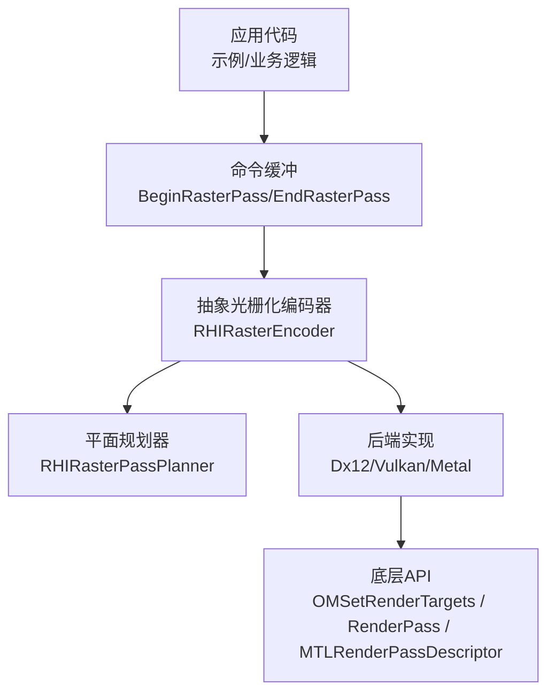
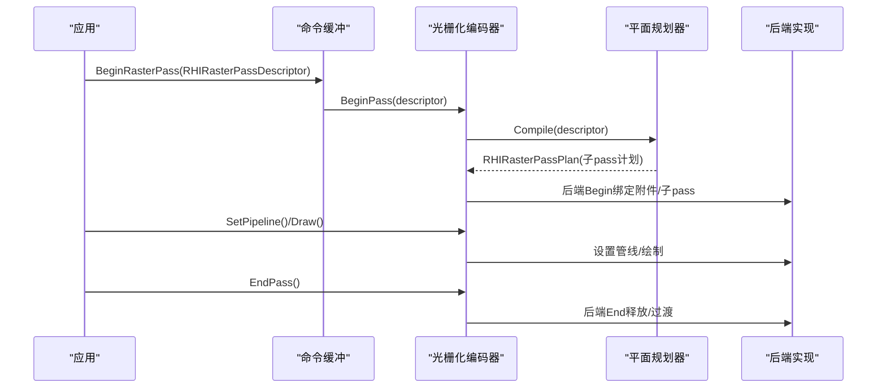
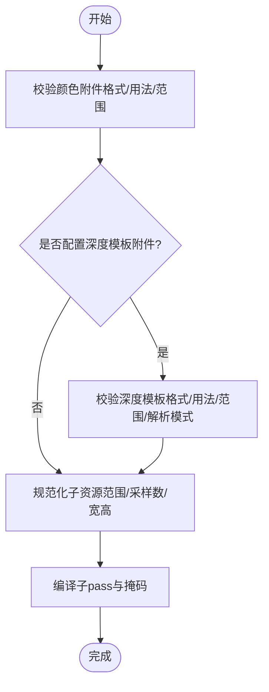
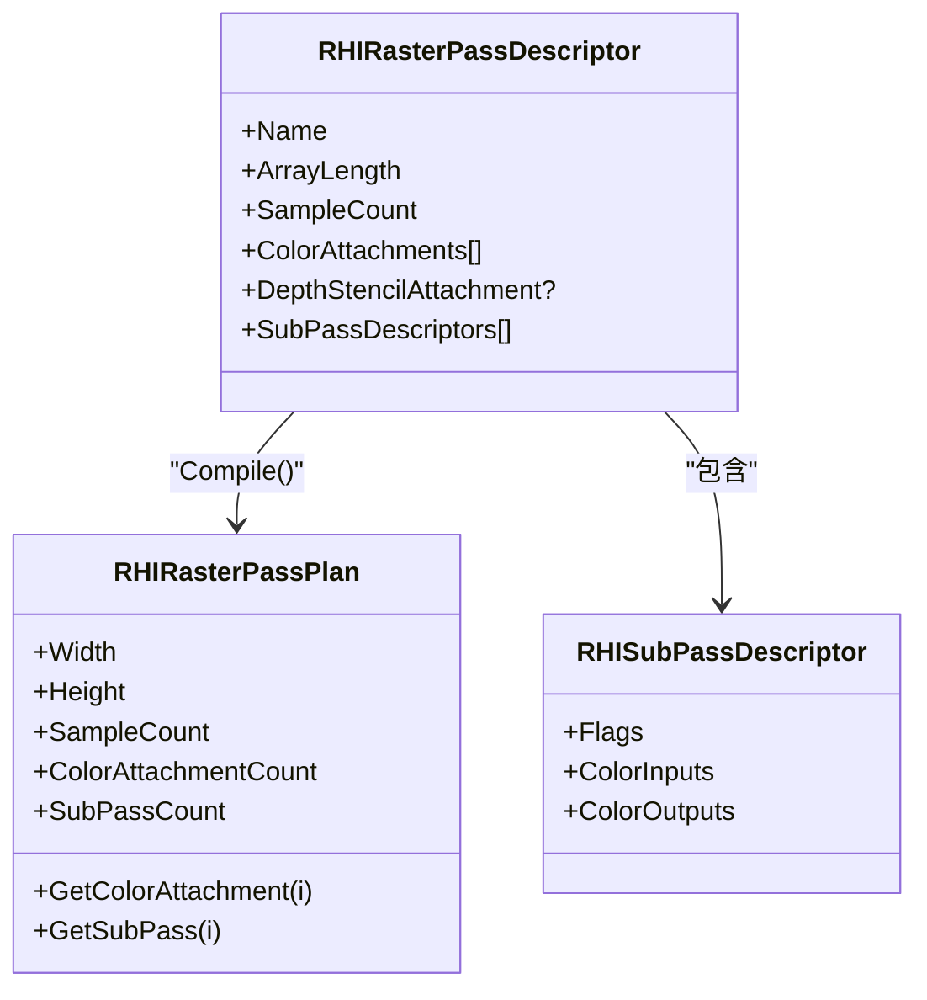
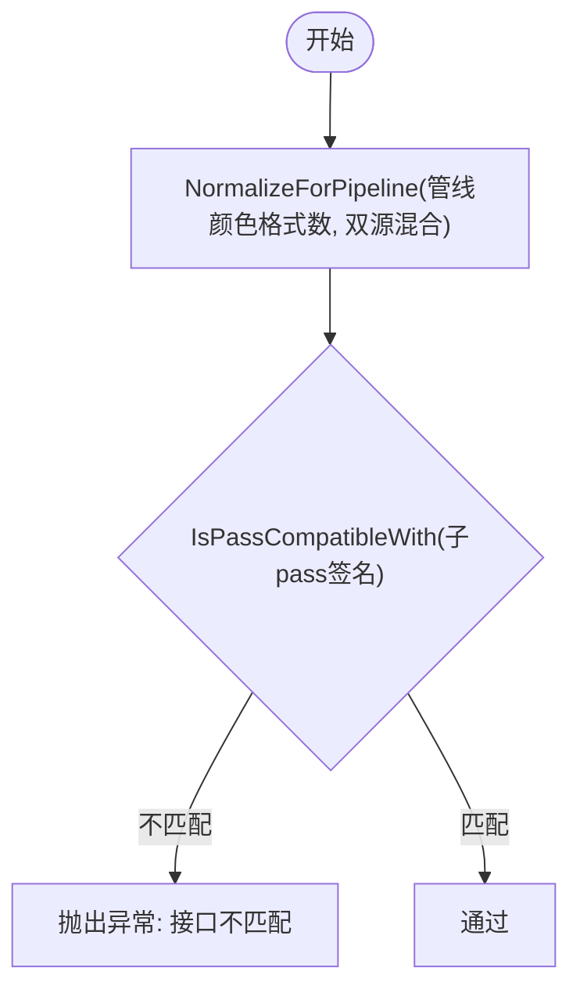
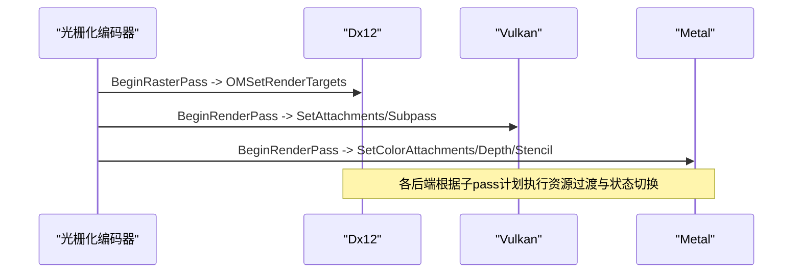
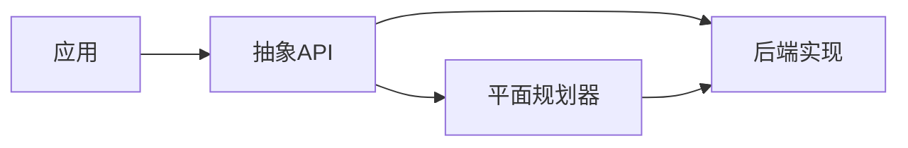

# 光栅化编码器

<cite>
**本文引用的文件**
- [RHICommandEncoder.cs](file://src/SharpGPU/Abstract/RHICommandEncoder.cs)
- [RasterWorkload.cs](file://samples/ComputeAndDraw/RasterWorkload.cs)
- [Dx12CommandEncoder.cs](file://src/SharpGPU/Dx12/Dx12CommandEncoder.cs)
- [VulkanCommandBuffer.cs](file://src/SharpGPU/Vulkan/VulkanCommandBuffer.cs)
- [MetalCommandBuffer.cs](file://src/SharpGPU/Metal/MetalCommandBuffer.cs)
- [RasterPassPlannerContractTests.cs](file://tests/SharpGPU.Conformance.Tests/RasterPassPlannerContractTests.cs)
</cite>

## 目录
1. [简介](#简介)
2. [项目结构](#项目结构)
3. [核心组件](#核心组件)
4. [架构总览](#架构总览)
5. [详细组件分析](#详细组件分析)
6. [依赖关系分析](#依赖关系分析)
7. [性能考量](#性能考量)
8. [故障排查指南](#故障排查指南)
9. [结论](#结论)
10. [附录：完整示例与最佳实践](#附录完整示例与最佳实践)

## 简介
本文件聚焦 SharpGPU 的光栅化编码器，系统阐述其在传统图形渲染管线中的职责、数据流与控制流，并深入讲解颜色附件与深度模板附件的配置、子pass（subpass）的概念与多重渲染目标处理、以及附件接口签名匹配与兼容性检查机制。文档同时提供从设置渲染附件、配置子pass到执行光栅化绘制的端到端使用路径，帮助读者在跨后端（DirectX12、Vulkan、Metal）环境下正确构建高效、可移植的渲染流程。

## 项目结构
SharpGPU 将抽象 API 与后端实现解耦：
- 抽象层定义通用命令编码接口、描述符与计划器（如 RHIRasterEncoder、RHIRasterPassDescriptor、RHIRasterPassPlanner）。
- 各后端（Dx12、Vulkan、Metal）实现具体的 Begin/End 渲染通道、子pass切换与底层绑定。
- 示例工程演示如何创建纹理、管线、开始光栅化通道、设置附件与绘制。

图表来源
- [RasterWorkload.cs:104-137](file://samples/ComputeAndDraw/RasterWorkload.cs#L104-L137)
- [RHICommandEncoder.cs:1903-2175](file://src/SharpGPU/Abstract/RHICommandEncoder.cs#L1903-L2175)
- [Dx12CommandEncoder.cs:2159-2284](file://src/SharpGPU/Dx12/Dx12CommandEncoder.cs#L2159-L2284)
- [VulkanCommandBuffer.cs:487-522](file://src/SharpGPU/Vulkan/VulkanCommandBuffer.cs#L487-L522)
- [MetalCommandBuffer.cs:106-115](file://src/SharpGPU/Metal/MetalCommandBuffer.cs#L106-L115)

章节来源
- [RasterWorkload.cs:104-137](file://samples/ComputeAndDraw/RasterWorkload.cs#L104-L137)
- [RHICommandEncoder.cs:833-996](file://src/SharpGPU/Abstract/RHICommandEncoder.cs#L833-L996)
- [RHICommandEncoder.cs:998-1191](file://src/SharpGPU/Abstract/RHICommandEncoder.cs#L998-L1191)

## 核心组件
- 颜色附件描述符 RHIColorAttachmentDescriptor：指定子资源范围、清除值、加载/存储动作、渲染目标及可选解析目标。
- 深度模板附件描述符 RHIDepthStencilAttachmentDescriptor：分别控制深度与模板的加载/存储/解析行为，以及对应的渲染目标。
- 子pass描述符 RHISubPassDescriptor：声明当前子pass对颜色附件的输入/输出映射与标志位。
- 光栅化通道描述符 RHIRasterPassDescriptor：聚合颜色附件、深度模板附件、子pass列表、采样数、统计/遮挡查询等。
- 光栅化编码器 RHIRasterEncoder：封装 Begin/NextSubPass/SetPipeline/Draw 等生命周期与状态管理。
- 平面规划器 RHIRasterPassPlanner：校验附件一致性、规范化子资源范围、生成子pass计划与掩码。

章节来源
- [RHICommandEncoder.cs:404-429](file://src/SharpGPU/Abstract/RHICommandEncoder.cs#L404-L429)
- [RHICommandEncoder.cs:833-852](file://src/SharpGPU/Abstract/RHICommandEncoder.cs#L833-L852)
- [RHICommandEncoder.cs:1903-2175](file://src/SharpGPU/Abstract/RHICommandEncoder.cs#L1903-L2175)
- [RHICommandEncoder.cs:998-1191](file://src/SharpGPU/Abstract/RHICommandEncoder.cs#L998-L1191)

## 架构总览
下图展示了从应用调用 BeginRasterPass 到后端绑定的关键流程，包括附件校验、子pass计划与管线兼容性检查。

图表来源
- [RHICommandEncoder.cs:1911-1934](file://src/SharpGPU/Abstract/RHICommandEncoder.cs#L1911-L1934)
- [RHICommandEncoder.cs:998-1191](file://src/SharpGPU/Abstract/RHICommandEncoder.cs#L998-L1191)
- [Dx12CommandEncoder.cs:2159-2284](file://src/SharpGPU/Dx12/Dx12CommandEncoder.cs#L2159-L2284)
- [VulkanCommandBuffer.cs:487-522](file://src/SharpGPU/Vulkan/VulkanCommandBuffer.cs#L487-L522)
- [MetalCommandBuffer.cs:106-115](file://src/SharpGPU/Metal/MetalCommandBuffer.cs#L106-L115)

## 详细组件分析

### 颜色附件与深度模板附件
- RHIColorAttachmentDescriptor
  - 字段：子资源范围、清除值、加载/存储动作、渲染目标、解析子资源范围与解析目标。
  - 用途：定义每个颜色缓冲区的读写语义与解析策略（MSAA 到单样本）。
- RHIDepthStencilAttachmentDescriptor
  - 字段：深度/模板各自的清除值、加载/存储动作、子资源范围、解析模式与解析目标。
  - 用途：统一管控深度与模板缓冲的载入、写入与解析行为。

图表来源
- [RHICommandEncoder.cs:998-1191](file://src/SharpGPU/Abstract/RHICommandEncoder.cs#L998-L1191)

章节来源
- [RHICommandEncoder.cs:404-429](file://src/SharpGPU/Abstract/RHICommandEncoder.cs#L404-L429)
- [RHICommandEncoder.cs:998-1191](file://src/SharpGPU/Abstract/RHICommandEncoder.cs#L998-L1191)

### 子pass与多重渲染目标
- 子pass概念：在一个光栅化通道内，通过多个子pass复用同一组附件，但每次仅读写其中一部分，从而减少内存带宽与状态切换开销。
- 多重渲染目标（MRT）：通过 ColorAttachments 数组一次绑定多个颜色缓冲区；每个子pass用 ColorInputs/ColorOutputs 声明其读/写集合。
- 计划器会计算每个子pass的读取/写入/保留/过渡掩码，确保数据依赖与布局转换正确。

图表来源
- [RHICommandEncoder.cs:833-996](file://src/SharpGPU/Abstract/RHICommandEncoder.cs#L833-L996)

章节来源
- [RHICommandEncoder.cs:833-996](file://src/SharpGPU/Abstract/RHICommandEncoder.cs#L833-L996)
- [RHICommandEncoder.cs:998-1191](file://src/SharpGPU/Abstract/RHICommandEncoder.cs#L998-L1191)

### 附件接口签名与兼容性检查
- RHIAttachmentInterfaceSignature
  - 记录颜色附件数量、输入槽/输出位置计数与掩码、帧缓冲读写掩码、分层访问掩码、深度模板标志、双源混合标记。
  - 提供 NormalizeForPipeline 与 IsPassCompatibleWith 用于与管线进行接口一致性比对。
- 管线兼容性验证
  - 采样数、颜色格式数量与顺序、深度/模板格式必须一致。
  - 附件接口签名需与子pass声明完全匹配（包括双源混合要求）。

图表来源
- [RHICommandEncoder.cs:517-831](file://src/SharpGPU/Abstract/RHICommandEncoder.cs#L517-L831)
- [RHICommandEncoder.cs:2087-2166](file://src/SharpGPU/Abstract/RHICommandEncoder.cs#L2087-L2166)

章节来源
- [RHICommandEncoder.cs:517-831](file://src/SharpGPU/Abstract/RHICommandEncoder.cs#L517-L831)
- [RHICommandEncoder.cs:2087-2166](file://src/SharpGPU/Abstract/RHICommandEncoder.cs#L2087-L2166)

### 后端绑定与执行
- DirectX12：通过 OMSetRenderTargets 绑定 RTV/DSV，并在 Begin/End 中管理子pass与资源屏障。
- Vulkan：在 BeginRasterPass 中创建 RenderPass 实例，按子pass索引设置 attachments 与 subpass。
- Metal：使用 MTLRenderPassDescriptor 配置 colorAttachments/depthAttachment/stencilAttachment，并在子pass间切换。

图表来源
- [Dx12CommandEncoder.cs:2159-2284](file://src/SharpGPU/Dx12/Dx12CommandEncoder.cs#L2159-L2284)
- [VulkanCommandBuffer.cs:487-522](file://src/SharpGPU/Vulkan/VulkanCommandBuffer.cs#L487-L522)
- [MetalCommandBuffer.cs:106-115](file://src/SharpGPU/Metal/MetalCommandBuffer.cs#L106-L115)

## 依赖关系分析
- 上层应用依赖抽象 API（RHIRasterEncoder、描述符），无需感知后端差异。
- 平面规划器集中负责校验与计划，降低后端复杂度。
- 后端实现仅关注具体绑定与资源生命周期管理。

图表来源
- [RHICommandEncoder.cs:1903-2175](file://src/SharpGPU/Abstract/RHICommandEncoder.cs#L1903-L2175)
- [RHICommandEncoder.cs:998-1191](file://src/SharpGPU/Abstract/RHICommandEncoder.cs#L998-L1191)

章节来源
- [RHICommandEncoder.cs:1903-2175](file://src/SharpGPU/Abstract/RHICommandEncoder.cs#L1903-L2175)
- [RHICommandEncoder.cs:998-1191](file://src/SharpGPU/Abstract/RHICommandEncoder.cs#L998-L1191)

## 性能考量
- 合理拆分子pass以减少不必要的读写与内存布局转换。
- 利用解析目标（ResolveTarget）将 MSAA 结果一次性解析到单样本纹理，避免多次拷贝。
- 保持颜色附件与管线格式严格一致，避免运行时回退或额外转换。
- 使用 LoadAction/StoreAction 精确表达数据需求，减少隐式初始化与写回。

[本节为通用指导，不直接分析具体文件]

## 故障排查指南
- 附件格式/用法错误：颜色附件必须为颜色格式且带 RenderTarget 用法；深度模板附件必须为深度/模板格式且带 DepthStencil 用法。
- 子资源范围不一致：所有附件的子资源范围必须在阵列长度、层级、mip 层面保持一致。
- 子pass越界：EndPass 时若未遍历完全部子pass，将触发异常。
- 管线不兼容：采样数、颜色格式数量与顺序、深度/模板格式必须与通道一致；附件接口签名需匹配。
- 解析模式非法：深度/模板解析模式需符合平台能力与格式约束。

章节来源
- [RasterPassPlannerContractTests.cs:77-175](file://tests/SharpGPU.Conformance.Tests/RasterPassPlannerContractTests.cs#L77-L175)
- [RHICommandEncoder.cs:2045-2060](file://src/SharpGPU/Abstract/RHICommandEncoder.cs#L2045-L2060)
- [RHICommandEncoder.cs:2087-2166](file://src/SharpGPU/Abstract/RHICommandEncoder.cs#L2087-L2166)

## 结论
SharpGPU 的光栅化编码器通过统一的抽象接口与强大的平面规划器，屏蔽了多后端差异，提供了安全、高效的渲染通道管理能力。借助颜色附件与深度模板附件的精细控制、子pass的多重渲染目标支持，以及严格的附件接口签名匹配机制，开发者可以构建高性能、可移植的传统图形渲染管线。

[本节为总结性内容，不直接分析具体文件]

## 附录：完整示例与最佳实践
以下示例展示如何设置渲染附件、配置子pass并执行光栅化渲染。为避免泄露实现细节，此处以“代码片段路径”形式给出参考位置。

- 创建设备、队列、查询与纹理
  - 参考路径：[RasterWorkload.cs:37-68](file://samples/ComputeAndDraw/RasterWorkload.cs#L37-L68)
- 编译着色器与创建光栅化管线
  - 参考路径：[RasterWorkload.cs:69-102](file://samples/ComputeAndDraw/RasterWorkload.cs#L69-L102)
- 开始光栅化通道并设置颜色附件
  - 参考路径：[RasterWorkload.cs:104-130](file://samples/ComputeAndDraw/RasterWorkload.cs#L104-L130)
- 设置视口/裁剪矩形、开始统计、绘制三角形
  - 参考路径：[RasterWorkload.cs:131-137](file://samples/ComputeAndDraw/RasterWorkload.cs#L131-L137)
- 结束通道并提交命令
  - 参考路径：[RasterWorkload.cs:137-152](file://samples/ComputeAndDraw/RasterWorkload.cs#L137-L152)

最佳实践清单
- 明确每个附件的 LoadAction/StoreAction，避免无意义的读写。
- 使用子pass分离不同阶段的读写集合，减少冗余过渡。
- 保证管线颜色格式与附件顺序严格一致，启用双源混合时需满足首输出位置绑定要求。
- 对 MSAA 场景配置 ResolveTarget 与正确的解析模式。
- 在 Begin/End 之间严格遵循子pass顺序，不要遗漏 NextSubPass。

章节来源
- [RasterWorkload.cs:37-152](file://samples/ComputeAndDraw/RasterWorkload.cs#L37-L152)
- [RHICommandEncoder.cs:1903-2175](file://src/SharpGPU/Abstract/RHICommandEncoder.cs#L1903-L2175)
- [RHICommandEncoder.cs:998-1191](file://src/SharpGPU/Abstract/RHICommandEncoder.cs#L998-L1191)