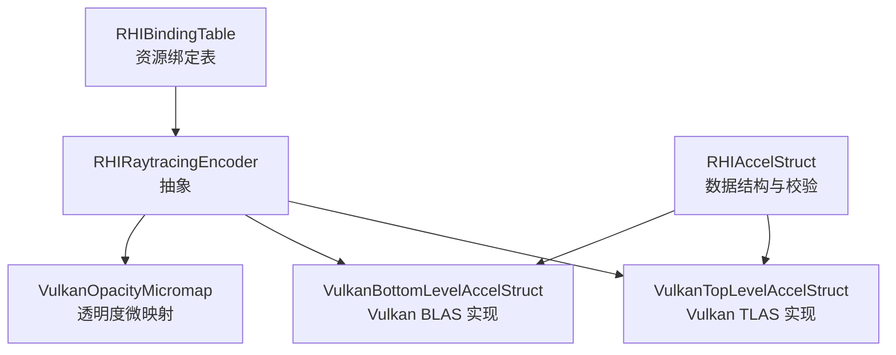
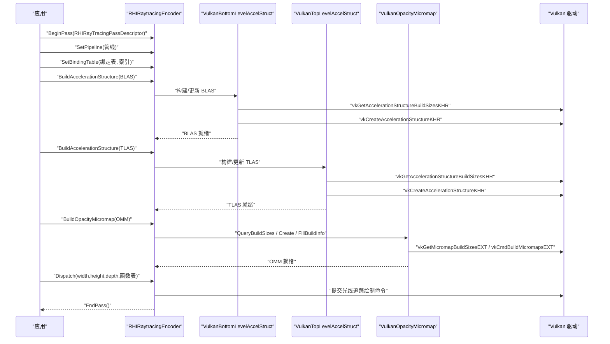
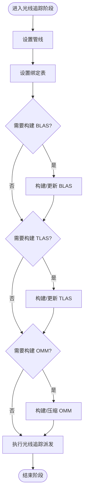
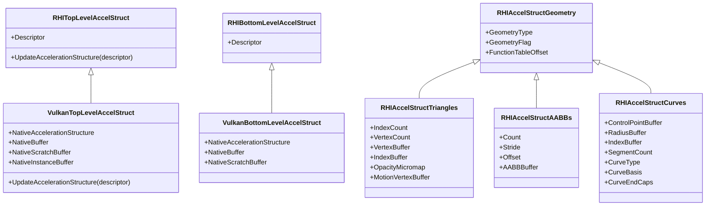
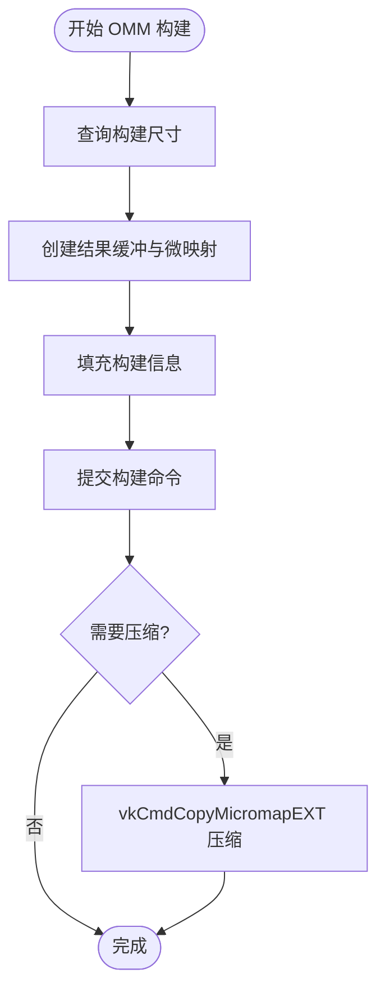
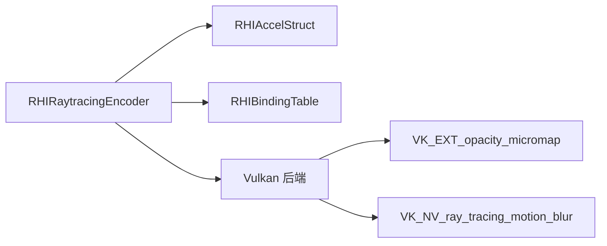

# 光线追踪编码器

<cite>
**本文引用的文件**
- [RHICommandEncoder.cs](file://src/SharpGPU/Abstract/RHICommandEncoder.cs)
- [RHIAccelStruct.cs](file://src/SharpGPU/Abstract/RHIAccelStruct.cs)
- [RHIBindingTable.cs](file://src/SharpGPU/Abstract/RHIBindingTable.cs)
- [VulkanAccelStruct.cs](file://src/SharpGPU/Vulkan/VulkanAccelStruct.cs)
- [VulkanOpacityMicromap.cs](file://src/SharpGPU/Vulkan/VulkanOpacityMicromap.cs)
- [VulkanRayTracingMotionNative.cs](file://src/SharpGPU/Vulkan/VulkanRayTracingMotionNative.cs)
</cite>

## 目录
1. [简介](#简介)
2. [项目结构](#项目结构)
3. [核心组件](#核心组件)
4. [架构总览](#架构总览)
5. [详细组件分析](#详细组件分析)
6. [依赖关系分析](#依赖关系分析)
7. [性能考虑](#性能考虑)
8. [故障排查指南](#故障排查指南)
9. [结论](#结论)
10. [附录：完整使用流程示例](#附录完整使用流程示例)

## 简介
本文件面向 SharpGPU 的光线追踪能力，聚焦 RHIRaytracingEncoder（光线追踪编码器）的职责与使用场景，系统阐述其在光线追踪渲染与加速结构构建中的角色。文档覆盖以下关键点：
- 光线追踪编码器的 API：SetPipeline、SetBindingTable、BuildAccelerationStructure、Dispatch、DispatchIndirect 等。
- 加速结构的构建过程：顶层加速结构（TLAS）与底层加速结构（BLAS）的创建、更新与优化。
- 透明度微映射（Opacity Micromap）的构建与压缩：BuildOpacityMicromap、CompactOpacityMicromap 的实现细节与约束。
- 提供端到端的代码级流程图，展示如何构建光线追踪场景并执行光线追踪渲染。

## 项目结构
SharpGPU 将抽象接口与后端实现解耦：
- 抽象层（Abstract）定义统一的命令编码器、绑定表、加速结构等接口与数据结构。
- 后端实现（如 Vulkan）将抽象接口落地到具体平台 API。
- 光线追踪相关能力集中在 RHIRaytracingEncoder 抽象类及其 Vulkan 实现中，并通过 RHIAccelStruct 系列类型描述几何与实例数据。

图表来源
- [RHICommandEncoder.cs:279-339](file://src/SharpGPU/Abstract/RHICommandEncoder.cs#L279-L339)
- [RHIAccelStruct.cs:90-150](file://src/SharpGPU/Abstract/RHIAccelStruct.cs#L90-L150)
- [VulkanAccelStruct.cs:7-141](file://src/SharpGPU/Vulkan/VulkanAccelStruct.cs#L7-L141)
- [VulkanOpacityMicromap.cs:202-252](file://src/SharpGPU/Vulkan/VulkanOpacityMicromap.cs#L202-L252)

章节来源
- [RHICommandEncoder.cs:279-339](file://src/SharpGPU/Abstract/RHICommandEncoder.cs#L279-L339)
- [RHIAccelStruct.cs:90-150](file://src/SharpGPU/Abstract/RHIAccelStruct.cs#L90-L150)
- [VulkanAccelStruct.cs:7-141](file://src/SharpGPU/Vulkan/VulkanAccelStruct.cs#L7-L141)
- [VulkanOpacityMicromap.cs:202-252](file://src/SharpGPU/Vulkan/VulkanOpacityMicromap.cs#L202-L252)

## 核心组件
- RHIRaytracingEncoder（光线追踪编码器）
  - 职责：在命令缓冲中录制光线追踪相关的状态设置、加速结构构建、以及光线追踪派发。
  - 关键方法：
    - SetPipeline：设置当前光线追踪管线。
    - SetBindingTable：设置资源绑定表（包含着色器表、加速结构引用等）。
    - BuildAccelerationStructure：构建或更新 TLAS/BLAS。
    - Dispatch / DispatchIndirect：执行光线追踪绘制。
    - BuildOpacityMicromap / CompactOpacityMicromap：构建与压缩透明度微映射（可选能力）。
- RHIAccelStruct（加速结构数据结构）
  - 负责描述三角形、AABB、曲线等几何体，以及实例、运动、透明度微映射附件等。
  - 提供大量校验逻辑，确保构建参数合法。
- RHIBindingTable（绑定表）
  - 用于将着色器、纹理、缓冲、加速结构等资源按槽位绑定到管线阶段。
- Vulkan 后端实现
  - VulkanTopLevelAccelStruct / VulkanBottomLevelAccelStruct：封装 VK 加速结构创建、实例上传、尺寸查询与构建。
  - VulkanOpacityMicromap：封装 VK 透明度微映射的创建、构建与压缩。

章节来源
- [RHICommandEncoder.cs:279-339](file://src/SharpGPU/Abstract/RHICommandEncoder.cs#L279-L339)
- [RHIAccelStruct.cs:90-150](file://src/SharpGPU/Abstract/RHIAccelStruct.cs#L90-L150)
- [RHIBindingTable.cs:12-62](file://src/SharpGPU/Abstract/RHIBindingTable.cs#L12-L62)
- [VulkanAccelStruct.cs:7-141](file://src/SharpGPU/Vulkan/VulkanAccelStruct.cs#L7-L141)
- [VulkanOpacityMicromap.cs:202-252](file://src/SharpGPU/Vulkan/VulkanOpacityMicromap.cs#L202-L252)

## 架构总览
下图展示了从应用调用光线追踪编码器到后端构建加速结构与执行光线追踪的调用链。

图表来源
- [RHICommandEncoder.cs:279-339](file://src/SharpGPU/Abstract/RHICommandEncoder.cs#L279-L339)
- [VulkanAccelStruct.cs:7-141](file://src/SharpGPU/Vulkan/VulkanAccelStruct.cs#L7-L141)
- [VulkanOpacityMicromap.cs:202-252](file://src/SharpGPU/Vulkan/VulkanOpacityMicromap.cs#L202-L252)

## 详细组件分析

### RHIRaytracingEncoder（光线追踪编码器）
- 职责边界
  - 管理光线追踪阶段的开始与结束。
  - 设置管线、绑定表、加速结构构建、透明度微映射构建/压缩、光线追踪派发。
- 关键 API
  - SetPipeline：设置当前光线追踪管线。
  - SetBindingTable：设置资源绑定表（含着色器表、加速结构引用等）。
  - BuildAccelerationStructure：支持 TLAS 与 BLAS 两种重载。
  - Dispatch / DispatchIndirect：执行光线追踪绘制，支持间接参数。
  - BuildOpacityMicromap / CompactOpacityMicromap：透明度微映射构建与压缩（需能力检查）。
- 错误处理与能力检查
  - 透明度微映射操作前会检查设备能力 RayTracing.OpacityMicromap。
  - 压缩前要求源微映射具备 AllowCompaction 标志。

图表来源
- [RHICommandEncoder.cs:279-339](file://src/SharpGPU/Abstract/RHICommandEncoder.cs#L279-L339)

章节来源
- [RHICommandEncoder.cs:279-339](file://src/SharpGPU/Abstract/RHICommandEncoder.cs#L279-L339)

### 加速结构（BLAS/TLAS）构建与优化
- BLAS（底层加速结构）
  - 几何类型：三角形、AABB、曲线。
  - 支持透明度微映射附件与运动顶点数据。
  - 构建流程：计算最大原语数 -> 查询构建尺寸 -> 创建结果缓冲与加速结构 -> 创建暂存缓冲。
- TLAS（顶层加速结构）
  - 实例数组：包含变换矩阵、命中组索引、掩码、BLAS 引用等。
  - 支持运动实例（Matrix/SRT）与静态实例混合。
  - 构建流程：准备实例缓冲 -> 查询构建尺寸 -> 创建结果缓冲与加速结构 -> 上传实例数据。
- 优化要点
  - 合理设置 Flag（如 PreferFastTrace、AllowCompaction、Motion）。
  - 对曲线几何体，先计算 AABB 再构建 BLAS，减少内存占用。
  - 对 TLAS，使用设备地址缓冲与主机可见缓冲进行高效上传。

图表来源
- [RHIAccelStruct.cs:90-150](file://src/SharpGPU/Abstract/RHIAccelStruct.cs#L90-L150)
- [VulkanAccelStruct.cs:7-141](file://src/SharpGPU/Vulkan/VulkanAccelStruct.cs#L7-L141)
- [VulkanAccelStruct.cs:415-715](file://src/SharpGPU/Vulkan/VulkanAccelStruct.cs#L415-L715)

章节来源
- [RHIAccelStruct.cs:90-150](file://src/SharpGPU/Abstract/RHIAccelStruct.cs#L90-L150)
- [VulkanAccelStruct.cs:7-141](file://src/SharpGPU/Vulkan/VulkanAccelStruct.cs#L7-L141)
- [VulkanAccelStruct.cs:415-715](file://src/SharpGPU/Vulkan/VulkanAccelStruct.cs#L415-L715)

### 透明度微映射（Opacity Micromap）构建与压缩
- 构建流程
  - 查询构建尺寸：根据 UsageCounts、输入缓冲、三角形数组缓冲计算 micromapSize 与 scratchSize。
  - 创建结果缓冲与微映射对象：使用 VkMicromapCreateInfoEXT。
  - 填充构建信息：设置 usageCounts、data、triangleArray、scratchData。
  - 提交构建命令：vkCmdBuildMicromapsEXT。
- 压缩流程
  - 要求源微映射具备 AllowCompaction 标志。
  - 使用 vkCmdCopyMicromapEXT 进行压缩复制。
- 附件与校验
  - 三角形几何可附加 OpacityMicromap 与每三角索引缓冲或特殊索引常量。
  - 校验输入缓冲必须带有 AccelStruct 使用标志，以便后端附加 MICROMAP_BUILD_INPUT_READ_ONLY。

图表来源
- [VulkanOpacityMicromap.cs:202-252](file://src/SharpGPU/Vulkan/VulkanOpacityMicromap.cs#L202-L252)
- [VulkanOpacityMicromap.cs:254-368](file://src/SharpGPU/Vulkan/VulkanOpacityMicromap.cs#L254-L368)
- [VulkanOpacityMicromap.cs:380-411](file://src/SharpGPU/Vulkan/VulkanOpacityMicromap.cs#L380-L411)

章节来源
- [VulkanOpacityMicromap.cs:202-252](file://src/SharpGPU/Vulkan/VulkanOpacityMicromap.cs#L202-L252)
- [VulkanOpacityMicromap.cs:254-368](file://src/SharpGPU/Vulkan/VulkanOpacityMicromap.cs#L254-L368)
- [VulkanOpacityMicromap.cs:380-411](file://src/SharpGPU/Vulkan/VulkanOpacityMicromap.cs#L380-L411)

### 绑定表（Binding Table）与管线设置
- 绑定表布局
  - 元素包括槽位、数量、绑定类型、着色器阶段、是否必需。
  - 元素内容可为采样器、缓冲视图、纹理视图、加速结构。
- 管线设置
  - 通过 SetPipeline 设置光线追踪管线。
  - 通过 SetBindingTable 将资源绑定到管线阶段。

章节来源
- [RHIBindingTable.cs:12-62](file://src/SharpGPU/Abstract/RHIBindingTable.cs#L12-L62)
- [RHICommandEncoder.cs:279-339](file://src/SharpGPU/Abstract/RHICommandEncoder.cs#L279-L339)

## 依赖关系分析
- 耦合与内聚
  - RHIRaytracingEncoder 与 RHIAccelStruct 强耦合（构建加速结构），与 RHIBindingTable 弱耦合（资源绑定）。
  - Vulkan 后端将抽象类型映射为原生句柄与缓冲，保持高内聚。
- 直接依赖
  - 光线追踪编码器依赖设备能力（如 OpacityMicromap、Motion）。
  - 加速结构构建依赖几何体缓冲的设备地址与格式转换。
- 外部集成点
  - Vulkan 扩展：VK_EXT_opacity_micromap、VK_NV_ray_tracing_motion_blur。
  - 原生 API：vkGetAccelerationStructureBuildSizesKHR、vkCreateAccelerationStructureKHR、vkCmdBuildMicromapsEXT、vkCmdCopyMicromapEXT。

图表来源
- [RHICommandEncoder.cs:279-339](file://src/SharpGPU/Abstract/RHICommandEncoder.cs#L279-L339)
- [VulkanOpacityMicromap.cs:7-24](file://src/SharpGPU/Vulkan/VulkanOpacityMicromap.cs#L7-L24)
- [VulkanRayTracingMotionNative.cs:7-24](file://src/SharpGPU/Vulkan/VulkanRayTracingMotionNative.cs#L7-L24)

章节来源
- [RHICommandEncoder.cs:279-339](file://src/SharpGPU/Abstract/RHICommandEncoder.cs#L279-L339)
- [VulkanOpacityMicromap.cs:7-24](file://src/SharpGPU/Vulkan/VulkanOpacityMicromap.cs#L7-L24)
- [VulkanRayTracingMotionNative.cs:7-24](file://src/SharpGPU/Vulkan/VulkanRayTracingMotionNative.cs#L7-L24)

## 性能考虑
- 加速结构构建
  - 使用 PreferFastTrace 标志优化射线求交性能。
  - 对频繁更新的 TLAS，采用 UpdateAccelerationStructure 而非重建。
  - 曲线几何体预计算 AABB，减少构建时的内存与时间开销。
- 透明度微映射
  - 合理设置 UsageCounts，避免过度细分导致内存浪费。
  - 启用 AllowCompaction 并在帧间压缩，降低显存占用。
- 绑定表与管线
  - 复用管线与绑定表，减少状态切换成本。
  - 批量设置绑定元素，减少多次 SetBindElement 调用。

[本节为通用指导，不直接分析具体文件]

## 故障排查指南
- 常见错误与原因
  - 透明度微映射构建失败：UsageCounts 为空或输入缓冲未设置 AccelStruct 使用标志。
  - 压缩失败：源微映射未设置 AllowCompaction。
  - TLAS 实例上传越界：实例缓冲大小不足或偏移超出范围。
  - 运动模式不一致：TLAS/BLAS 的 Motion 标志与实际数据不匹配。
- 定位建议
  - 检查设备能力：RayTracing.OpacityMicromap、RayTracing.Motion。
  - 检查几何体与实例描述符：索引计数、顶点格式、步长。
  - 检查原生 API 返回值与错误码。

章节来源
- [RHIAccelStruct.cs:222-260](file://src/SharpGPU/Abstract/RHIAccelStruct.cs#L222-L260)
- [RHIAccelStruct.cs:324-350](file://src/SharpGPU/Abstract/RHIAccelStruct.cs#L324-L350)
- [VulkanAccelStruct.cs:143-159](file://src/SharpGPU/Vulkan/VulkanAccelStruct.cs#L143-L159)
- [VulkanOpacityMicromap.cs:313-322](file://src/SharpGPU/Vulkan/VulkanOpacityMicromap.cs#L313-L322)

## 结论
SharpGPU 的光线追踪编码器以抽象接口统一了不同后端的实现，提供了清晰的 API 来构建与更新加速结构、设置管线与绑定表、执行光线追踪渲染，并支持透明度微映射的构建与压缩。通过合理的标志设置与资源管理，可以在保证正确性的同时获得良好的性能表现。

[本节为总结性内容，不直接分析具体文件]

## 附录：完整使用流程示例
以下为端到端的使用流程说明（以文字步骤呈现，避免直接粘贴代码）：
- 初始化与阶段开始
  - 创建命令缓冲并 BeginPass(RHIRayTracingPassDescriptor)。
- 设置管线与绑定表
  - SetPipeline(已创建的光线追踪管线)。
  - SetBindingTable(绑定表与索引)，将着色器表、加速结构等绑定到相应槽位。
- 构建 BLAS
  - 准备几何体描述（三角形/AABB/曲线），设置缓冲与格式。
  - 调用 BuildAccelerationStructure(BLAS) 完成构建。
- 构建 TLAS
  - 准备实例数组（包含变换矩阵、命中组索引、掩码、BLAS 引用）。
  - 调用 BuildAccelerationStructure(TLAS) 完成构建。
- 构建与压缩透明度微映射（可选）
  - 准备 UsageCounts、输入缓冲、三角形数组缓冲。
  - 调用 BuildOpacityMicromap(OMM) 完成构建。
  - 若需压缩，确保源 OMM 具备 AllowCompaction，然后调用 CompactOpacityMicromap。
- 执行光线追踪渲染
  - 调用 Dispatch(width,height,depth,函数表) 或 DispatchIndirect（间接参数）。
- 阶段结束
  - 调用 EndPass() 完成阶段清理。

章节来源
- [RHICommandEncoder.cs:279-339](file://src/SharpGPU/Abstract/RHICommandEncoder.cs#L279-L339)
- [VulkanAccelStruct.cs:7-141](file://src/SharpGPU/Vulkan/VulkanAccelStruct.cs#L7-L141)
- [VulkanOpacityMicromap.cs:202-252](file://src/SharpGPU/Vulkan/VulkanOpacityMicromap.cs#L202-L252)