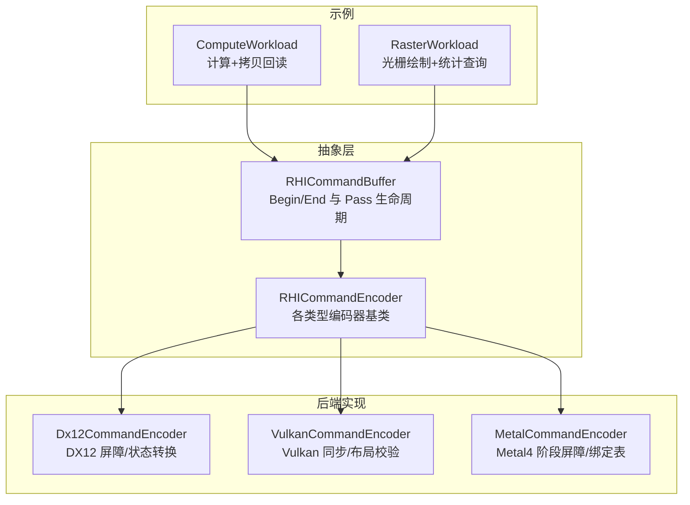
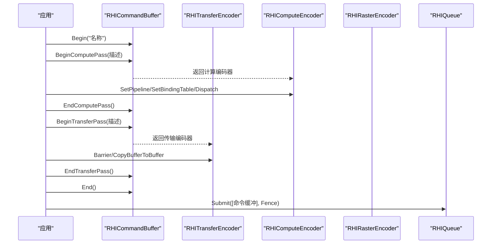
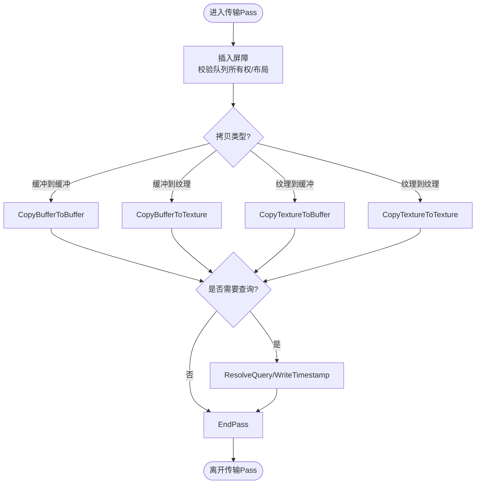
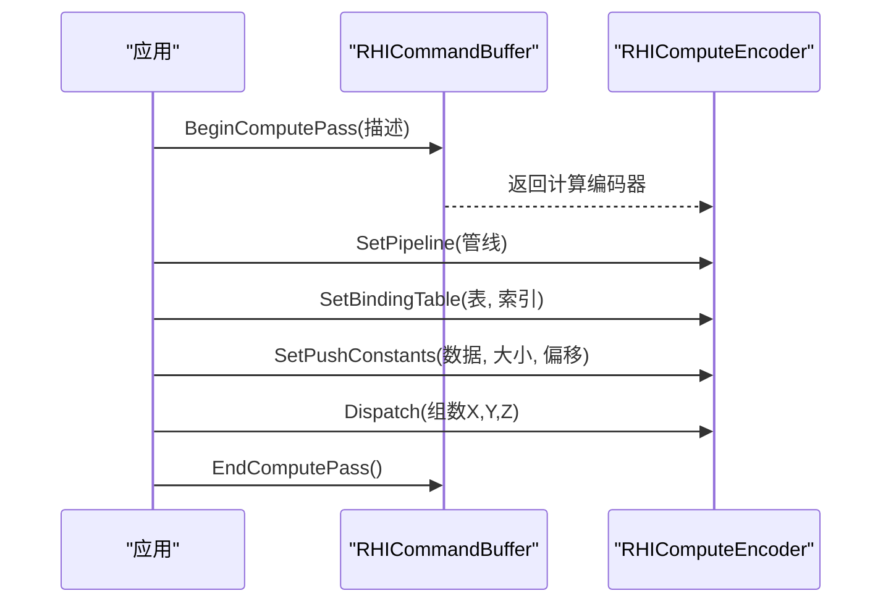
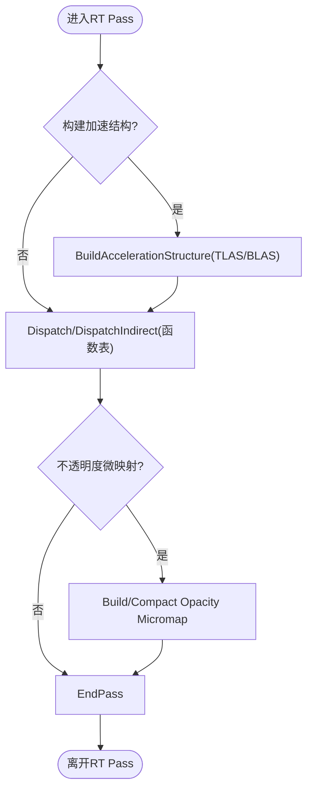
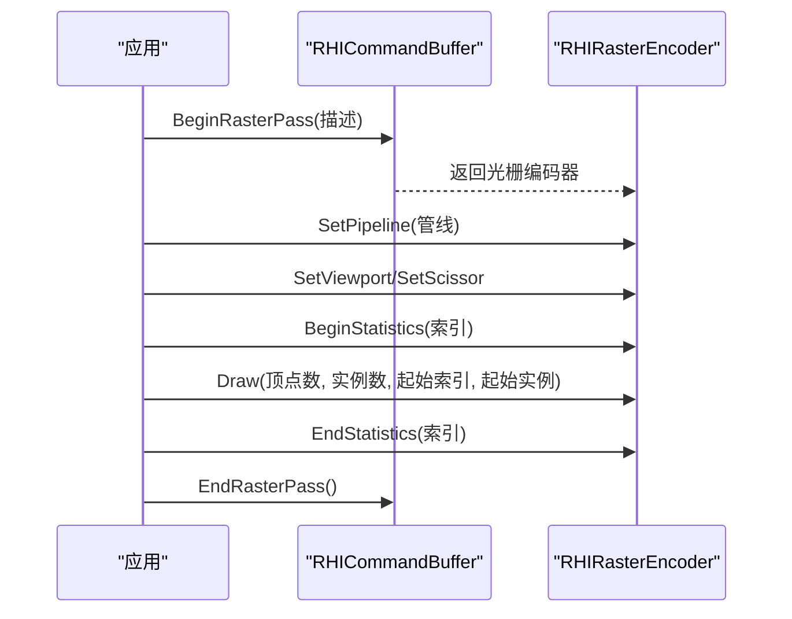
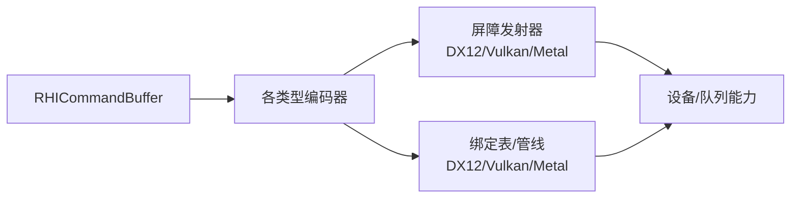

# 命令编码器

<cite>
**本文引用的文件**
- [RHICommandEncoder.cs](file://src/SharpGPU/Abstract/RHICommandEncoder.cs)
- [RHICommandBuffer.cs](file://src/SharpGPU/Abstract/RHICommandBuffer.cs)
- [Dx12CommandEncoder.cs](file://src/SharpGPU/Dx12/Dx12CommandEncoder.cs)
- [VulkanCommandEncoder.cs](file://src/SharpGPU/Vulkan/VulkanCommandEncoder.cs)
- [MetalCommandEncoder.cs](file://src/SharpGPU/Metal/MetalCommandEncoder.cs)
- [ComputeWorkload.cs](file://samples/ComputeAndDraw/ComputeWorkload.cs)
- [RasterWorkload.cs](file://samples/ComputeAndDraw/RasterWorkload.cs)
</cite>

## 目录
1. [简介](#简介)
2. [项目结构](#项目结构)
3. [核心组件](#核心组件)
4. [架构总览](#架构总览)
5. [详细组件分析](#详细组件分析)
6. [依赖关系分析](#依赖关系分析)
7. [性能考虑](#性能考虑)
8. [故障排查指南](#故障排查指南)
9. [结论](#结论)
10. [附录：使用示例与最佳实践](#附录使用示例与最佳实践)

## 简介
本文件面向SharpGPU的命令编码器体系，系统性说明传输、计算、光线追踪、光栅化、机器学习与工作图编码器的职责、API接口、参数配置、执行流程、作用域管理与资源绑定机制。文档同时给出跨后端（DirectX12、Vulkan、Metal）的屏障实现差异、常见性能调优技巧与问题定位方法，并通过示例工程展示如何正确使用各类编码器完成典型GPU任务。

## 项目结构
SharpGPU采用“抽象接口 + 多后端实现”的分层设计：
- 抽象层：定义统一的命令缓冲区与编码器接口（传输、计算、光线追踪、光栅化、机器学习、工作图），以及通用的描述符、查询、屏障等数据结构。
- 后端实现层：针对DX12、Vulkan、Metal分别实现具体的命令缓冲与编码器逻辑，包括屏障发射、状态机管理、资源验证与底层API调用。
- 示例层：提供可运行的最小用例，演示如何在不同后端上创建管线、绑定资源、记录命令并读取结果。

图表来源
- [RHICommandBuffer.cs:6-24](file://src/SharpGPU/Abstract/RHICommandBuffer.cs#L6-L24)
- [RHICommandEncoder.cs:110-402](file://src/SharpGPU/Abstract/RHICommandEncoder.cs#L110-L402)
- [Dx12CommandEncoder.cs:66-174](file://src/SharpGPU/Dx12/Dx12CommandEncoder.cs#L66-L174)
- [VulkanCommandEncoder.cs:16-127](file://src/SharpGPU/Vulkan/VulkanCommandEncoder.cs#L16-L127)
- [MetalCommandEncoder.cs:337-658](file://src/SharpGPU/Metal/MetalCommandEncoder.cs#L337-L658)

章节来源
- [RHICommandBuffer.cs:6-24](file://src/SharpGPU/Abstract/RHICommandBuffer.cs#L6-L24)
- [RHICommandEncoder.cs:110-402](file://src/SharpGPU/Abstract/RHICommandEncoder.cs#L110-L402)

## 核心组件
- RHICommandBuffer：命令缓冲区的生命周期与状态机，维护当前是否处于录制状态、当前激活的编码器种类，确保Begin/End与Pass成对出现且互斥。
- 编码器基类族：
  - RHITransferEncoder：负责内存拷贝、布局转换、查询解析等数据搬运操作。
  - RHIComputeEncoder：设置计算管线、绑定表、推送常量，执行Dispatch或间接执行。
  - RHIRaytracingEncoder：构建加速结构、发射射线、可选构建不透明度微映射。
  - RHIRasterEncoder：设置渲染管线、视口/裁剪、颜色/深度附件、绘制调用与统计。
  - RHIMLEncoder：设置ML管线与绑定表，执行ML调度。
  - RHIWorkGraphEncoder：设置工作图管线、绑定表、推送常量、后备内存与图调度。

这些基类在抽象层定义了统一API；具体后端通过各自的后端编码器实现细节（如屏障、状态转换、绑定表提交）。

章节来源
- [RHICommandBuffer.cs:26-190](file://src/SharpGPU/Abstract/RHICommandBuffer.cs#L26-L190)
- [RHICommandEncoder.cs:110-402](file://src/SharpGPU/Abstract/RHICommandEncoder.cs#L110-L402)

## 架构总览
命令缓冲与编码器协作的典型流程：
- 应用创建命令队列与命令缓冲，Begin开始录制。
- 根据任务类型选择对应Pass：传输、计算、光线追踪、光栅化、机器学习、工作图。
- 在每个Pass内设置管线、绑定资源、执行相应命令。
- EndPass结束该Pass，最后End结束命令缓冲并提交到队列。

图表来源
- [RHICommandBuffer.cs:170-183](file://src/SharpGPU/Abstract/RHICommandBuffer.cs#L170-L183)
- [RHICommandEncoder.cs:135-181](file://src/SharpGPU/Abstract/RHICommandEncoder.cs#L135-L181)
- [RHICommandEncoder.cs:110-133](file://src/SharpGPU/Abstract/RHICommandEncoder.cs#L110-L133)

## 详细组件分析

### 传输编码器（RHITransferEncoder）
- 职责：进行缓冲/纹理之间的拷贝、布局转换、查询解析、时间戳写入、调试分组等。
- 关键API：
  - BeginPass/EndPass：开启/关闭传输Pass。
  - Barrier/Barriers：插入资源屏障，保证读写顺序与布局正确性。
  - CopyBufferToBuffer/CopyBufferToTexture/CopyTextureToBuffer/CopyTextureToTexture：各种拷贝操作。
  - WriteTimestamp/ResolveQuery：用于性能计时与查询结果解析。
- 作用域与资源绑定：传输Pass通常不需要管线，但需要正确的屏障来保证资源状态一致。
- 后端差异：
  - DX12：将抽象屏障转换为ResourceBarrier或增强屏障组，按队列流水线类型映射状态。
  - Vulkan：根据Synchronization1/2路径生成Memory/Buffer/Image屏障，严格校验图像布局契约。
  - Metal：基于MTL4阶段掩码合并屏障，区分编码器内与队列级屏障。

图表来源
- [RHICommandEncoder.cs:110-133](file://src/SharpGPU/Abstract/RHICommandEncoder.cs#L110-L133)
- [Dx12CommandEncoder.cs:295-800](file://src/SharpGPU/Dx12/Dx12CommandEncoder.cs#L295-L800)
- [VulkanCommandEncoder.cs:129-800](file://src/SharpGPU/Vulkan/VulkanCommandEncoder.cs#L129-L800)
- [MetalCommandEncoder.cs:69-328](file://src/SharpGPU/Metal/MetalCommandEncoder.cs#L69-L328)

章节来源
- [RHICommandEncoder.cs:110-133](file://src/SharpGPU/Abstract/RHICommandEncoder.cs#L110-L133)
- [Dx12CommandEncoder.cs:295-800](file://src/SharpGPU/Dx12/Dx12CommandEncoder.cs#L295-L800)
- [VulkanCommandEncoder.cs:129-800](file://src/SharpGPU/Vulkan/VulkanCommandEncoder.cs#L129-L800)
- [MetalCommandEncoder.cs:69-328](file://src/SharpGPU/Metal/MetalCommandEncoder.cs#L69-L328)

### 计算编码器（RHIComputeEncoder）
- 职责：设置计算管线、绑定资源表、推送常量、执行线程组调度（含直接/间接）。
- 关键API：
  - BeginPass/EndPass：开启/关闭计算Pass。
  - SetPipeline/SetBindingTable/SetPushConstants：配置执行上下文。
  - Dispatch/DispatchIndirect/ExecuteIndirect：执行计算任务。
  - 采样器反馈相关：Clear/Resolve/Decode/Copy（需设备能力支持）。
- 作用域与资源绑定：必须在计算Pass中绑定对应的管线与绑定表；推送常量用于传递每帧/每批次小量数据。
- 后端差异：
  - DX12：校验管线与布局，使用根签名/描述符表提交绑定。
  - Vulkan：校验管线与布局，使用DescriptorSet/Root Descriptor提交。
  - Metal：通过ArgumentTable/Reference Buffer提交绑定，注意保留槽位冲突检查。

图表来源
- [RHICommandEncoder.cs:135-181](file://src/SharpGPU/Abstract/RHICommandEncoder.cs#L135-L181)
- [Dx12CommandEncoder.cs:92-174](file://src/SharpGPU/Dx12/Dx12CommandEncoder.cs#L92-L174)
- [VulkanCommandEncoder.cs:24-105](file://src/SharpGPU/Vulkan/VulkanCommandEncoder.cs#L24-L105)
- [MetalCommandEncoder.cs:337-658](file://src/SharpGPU/Metal/MetalCommandEncoder.cs#L337-L658)

章节来源
- [RHICommandEncoder.cs:135-181](file://src/SharpGPU/Abstract/RHICommandEncoder.cs#L135-L181)
- [Dx12CommandEncoder.cs:92-174](file://src/SharpGPU/Dx12/Dx12CommandEncoder.cs#L92-L174)
- [VulkanCommandEncoder.cs:24-105](file://src/SharpGPU/Vulkan/VulkanCommandEncoder.cs#L24-L105)
- [MetalCommandEncoder.cs:337-658](file://src/SharpGPU/Metal/MetalCommandEncoder.cs#L337-L658)

### 光线追踪编码器（RHIRaytracingEncoder）
- 职责：构建加速结构（顶层/底层）、发射射线、可选构建/压缩不透明度微映射。
- 关键API：
  - BeginPass/EndPass：开启/关闭RT Pass。
  - SetPipeline/SetBindingTable：配置RT管线与函数表。
  - BuildAccelerationStructure：构建TLAS/BLAS。
  - Dispatch/DispatchIndirect：发射射线（附带函数表）。
  - BuildOpacityMicromap/CompactOpacityMicromap：可选特性，需设备能力支持。
- 作用域与资源绑定：必须绑定RT管线与函数表；加速结构需满足允许压缩等标志要求。
- 后端差异：
  - DX12：使用StateObject/DispatchRays API，校验加速结构类型与标志。
  - Vulkan：使用RayTracingPipelineKHR/BuildAccelerationStructuresKHR，校验功能与格式。
  - Metal：通过MTL4 Compute Encoder与特定阶段处理RT任务。

图表来源
- [RHICommandEncoder.cs:279-339](file://src/SharpGPU/Abstract/RHICommandEncoder.cs#L279-L339)
- [Dx12CommandEncoder.cs:98-174](file://src/SharpGPU/Dx12/Dx12CommandEncoder.cs#L98-L174)
- [VulkanCommandEncoder.cs:60-105](file://src/SharpGPU/Vulkan/VulkanCommandEncoder.cs#L60-L105)
- [MetalCommandEncoder.cs:337-658](file://src/SharpGPU/Metal/MetalCommandEncoder.cs#L337-L658)

章节来源
- [RHICommandEncoder.cs:279-339](file://src/SharpGPU/Abstract/RHICommandEncoder.cs#L279-L339)
- [Dx12CommandEncoder.cs:98-174](file://src/SharpGPU/Dx12/Dx12CommandEncoder.cs#L98-L174)
- [VulkanCommandEncoder.cs:60-105](file://src/SharpGPU/Vulkan/VulkanCommandEncoder.cs#L60-L105)
- [MetalCommandEncoder.cs:337-658](file://src/SharpGPU/Metal/MetalCommandEncoder.cs#L337-L658)

### 光栅化编码器（RHIRasterEncoder）
- 职责：设置渲染管线、视口/裁剪、颜色/深度附件、绘制调用、统计查询。
- 关键API：
  - BeginPass/EndPass：开启/关闭光栅Pass。
  - SetPipeline/SetViewport/SetScissor：配置渲染状态。
  - Draw/DrawIndexed：执行绘制。
  - BeginStatistics/EndStatistics：启用/禁用统计查询。
- 作用域与资源绑定：需在Pass中绑定管线与附件；统计查询需设备能力支持。
- 后端差异：
  - DX12：使用Graphics Command List，管理Render Target/DS视图与状态。
  - Vulkan：使用Render Pass/Subpass，严格管理Image布局与依赖。
  - Metal：使用Render Command Encoder，处理顶点/片段阶段与输出目标。

图表来源
- [RasterWorkload.cs:104-146](file://samples/ComputeAndDraw/RasterWorkload.cs#L104-L146)
- [RHICommandEncoder.cs:403-800](file://src/SharpGPU/Abstract/RHICommandEncoder.cs#L403-L800)

章节来源
- [RasterWorkload.cs:104-146](file://samples/ComputeAndDraw/RasterWorkload.cs#L104-L146)
- [RHICommandEncoder.cs:403-800](file://src/SharpGPU/Abstract/RHICommandEncoder.cs#L403-L800)

### 机器学习编码器（RHIMLEncoder）
- 职责：设置ML管线与绑定表，执行ML调度。
- 关键API：
  - BeginPass/EndPass：开启/关闭ML Pass。
  - SetPipeline/SetBindingTable：配置ML执行上下文。
  - Dispatch：执行ML任务。
- 作用域与资源绑定：ML任务可能涉及专用硬件单元，需遵循队列阶段与屏障约束。
- 后端差异：
  - Metal：ML阶段作为队列级阶段参与屏障，避免与生产者/消费者阶段冲突。
  - DX12/Vulkan：通过各自扩展或原生API执行ML指令。

章节来源
- [RHICommandEncoder.cs:341-370](file://src/SharpGPU/Abstract/RHICommandEncoder.cs#L341-L370)
- [MetalCommandEncoder.cs:69-328](file://src/SharpGPU/Metal/MetalCommandEncoder.cs#L69-L328)

### 工作图编码器（RHIWorkGraphEncoder）
- 职责：设置工作图管线、绑定表、推送常量、后备内存，调度图执行。
- 关键API：
  - BeginPass/EndPass：开启/关闭WorkGraph Pass。
  - SetPipeline/SetBindingTable/SetPushConstants：配置图执行上下文。
  - SetBackingMemory：指定后备内存区域。
  - DispatchGraph：以入口点与记录数调度图。
- 作用域与资源绑定：工作图通常包含多个节点与依赖，需正确配置输入记录与内存布局。
- 后端差异：
  - DX12：使用WorkGraph相关命令，管理节点与依赖。
  - Vulkan：通过扩展或自定义实现。
  - Metal：通过MTL4 Compute/Render Encoder组合实现。

章节来源
- [RHICommandEncoder.cs:372-402](file://src/SharpGPU/Abstract/RHICommandEncoder.cs#L372-L402)

## 依赖关系分析
- 命令缓冲与编码器：
  - RHICommandBuffer维护当前激活的编码器种类，防止嵌套与非法切换。
  - 每个编码器在BeginPass时标记Active，EndPass时清除。
- 屏障与同步：
  - 所有后端均通过RHIBarrier抽象描述同步需求，后端将其转换为本地API。
  - DX12：支持增强屏障与资源屏障两种路径。
  - Vulkan：支持Sync1与Sync2路径，严格校验图像布局。
  - Metal：基于MTL4阶段掩码合并屏障，区分编码器内与队列级屏障。
- 绑定表与管线：
  - 各后端通过绑定表将资源映射到管线槽位，Metal还处理参考缓冲与保留槽位冲突。

图表来源
- [RHICommandBuffer.cs:6-24](file://src/SharpGPU/Abstract/RHICommandBuffer.cs#L6-L24)
- [Dx12CommandEncoder.cs:295-800](file://src/SharpGPU/Dx12/Dx12CommandEncoder.cs#L295-L800)
- [VulkanCommandEncoder.cs:129-800](file://src/SharpGPU/Vulkan/VulkanCommandEncoder.cs#L129-L800)
- [MetalCommandEncoder.cs:69-328](file://src/SharpGPU/Metal/MetalCommandEncoder.cs#L69-L328)

章节来源
- [RHICommandBuffer.cs:6-24](file://src/SharpGPU/Abstract/RHICommandBuffer.cs#L6-L24)
- [Dx12CommandEncoder.cs:295-800](file://src/SharpGPU/Dx12/Dx12CommandEncoder.cs#L295-L800)
- [VulkanCommandEncoder.cs:129-800](file://src/SharpGPU/Vulkan/VulkanCommandEncoder.cs#L129-L800)
- [MetalCommandEncoder.cs:69-328](file://src/SharpGPU/Metal/MetalCommandEncoder.cs#L69-L328)

## 性能考虑
- 屏障合并与批处理：
  - 尽量批量插入屏障，减少API调用次数；后端会尝试合并相同阶段的屏障。
  - 在Vulkan中优先使用Sync2路径以获得更细粒度的控制。
- 资源布局优化：
  - 在Vulkan中严格管理图像布局，避免不必要的Layout转换。
  - 在DX12中使用增强屏障以减少状态切换开销。
- 绑定表与管线缓存：
  - 复用管线与绑定表，减少创建与切换成本。
  - 在Metal中注意保留槽位冲突，避免RT函数表与其他绑定冲突。
- 统计与计时：
  - 合理使用统计查询与时间戳，定位瓶颈；避免频繁查询导致阻塞。

[本节为通用指导，无需特定文件引用]

## 故障排查指南
- 命令缓冲状态错误：
  - 未Begin即BeginPass：检查命令缓冲状态是否为Recording。
  - 重复Begin或嵌套Pass：确保每个Pass成对Begin/End，且无嵌套。
- 资源类型不匹配：
  - 后端类型不匹配：例如在DX12编码器中使用Vulkan资源，会抛出异常。
  - 管线与布局不兼容：确保绑定表结构与管线布局一致。
- 屏障与布局错误：
  - Vulkan图像布局无效：确保LayoutBefore/After合法，且符合设备能力。
  - 队列所有权转移失败：检查源/目的队列族是否可用。
- 查询与统计：
  - 查询类型不匹配：确保查询堆类型与期望域一致。
  - 统计未推进：确认绘制/计算命令已执行且查询已解析。

章节来源
- [RHICommandBuffer.cs:36-115](file://src/SharpGPU/Abstract/RHICommandBuffer.cs#L36-L115)
- [Dx12CommandEncoder.cs:66-174](file://src/SharpGPU/Dx12/Dx12CommandEncoder.cs#L66-L174)
- [VulkanCommandEncoder.cs:16-127](file://src/SharpGPU/Vulkan/VulkanCommandEncoder.cs#L16-L127)
- [MetalCommandEncoder.cs:34-67](file://src/SharpGPU/Metal/MetalCommandEncoder.cs#L34-L67)

## 结论
SharpGPU的命令编码器体系通过抽象接口统一了不同后端的GPU命令记录方式，提供了传输、计算、光线追踪、光栅化、机器学习与工作图等多种任务类型的编码器。各后端在屏障、绑定表、管线状态等方面有差异化实现，但都遵循相同的生命周期与作用域管理。通过合理配置资源、屏障与管线，结合统计与计时工具，可以有效提升性能并简化调试。

[本节为总结，无需特定文件引用]

## 附录：使用示例与最佳实践

### 计算任务示例（ComputeWorkload）
- 步骤概览：
  - 创建实例与设备，获取图形队列。
  - 编译着色器并创建函数、管线布局、计算管线。
  - 创建输出缓冲与回读缓冲，创建绑定表。
  - 开始计算Pass，设置管线与绑定表，执行Dispatch。
  - 开始传输Pass，拷贝结果到回读缓冲，结束Pass。
  - 结束命令缓冲并提交，等待完成并读取结果。

章节来源
- [ComputeWorkload.cs:45-161](file://samples/ComputeAndDraw/ComputeWorkload.cs#L45-L161)

### 光栅化任务示例（RasterWorkload）
- 步骤概览：
  - 创建实例与设备，获取图形队列。
  - 创建查询、渲染目标纹理、管线布局与光栅管线。
  - 开始光栅Pass，设置管线、视口、裁剪区，启用统计查询。
  - 执行绘制调用，结束统计查询。
  - 开始传输Pass，解析查询结果，结束Pass。
  - 结束命令缓冲并提交，等待完成并验证统计。

章节来源
- [RasterWorkload.cs:37-161](file://samples/ComputeAndDraw/RasterWorkload.cs#L37-L161)

### 最佳实践清单
- 始终成对使用Begin/End与Pass Begin/End，避免状态泄漏。
- 在资源使用前插入合适的屏障，确保布局与访问权限正确。
- 复用管线与绑定表，减少创建与切换开销。
- 使用统计查询与时间戳定位性能瓶颈。
- 针对不同后端选择合适的屏障路径（如Vulkan Sync2、DX12增强屏障）。
- 在Metal中注意ML阶段与队列级屏障的使用。

[本节为通用指导，无需特定文件引用]