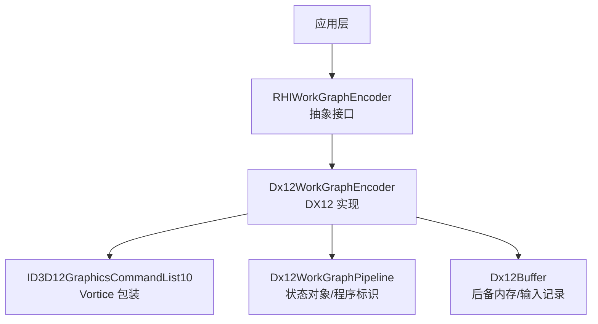
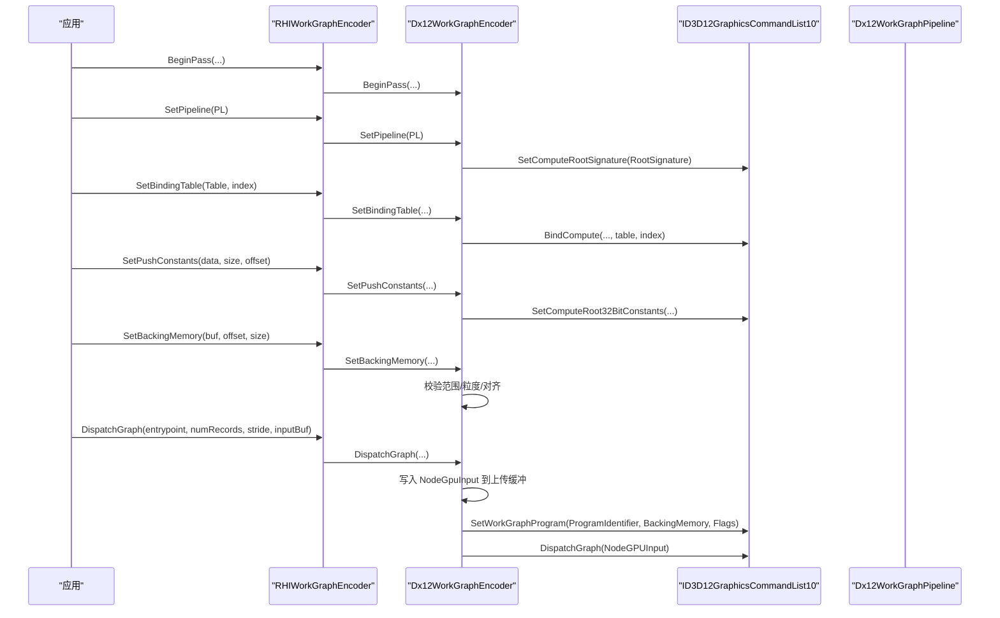
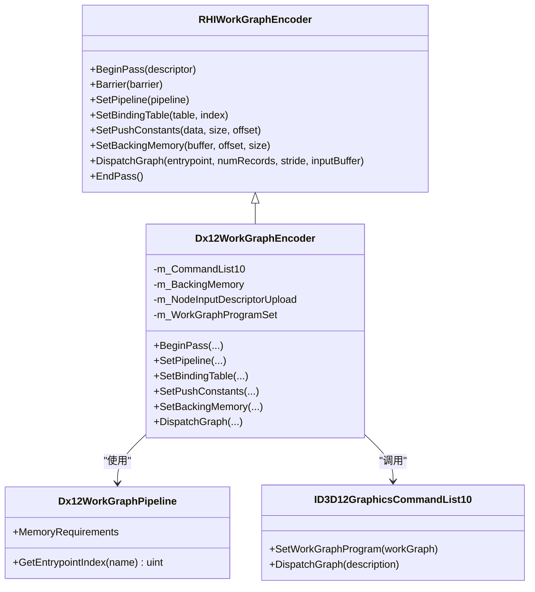

# 工作图编码器

<cite>
**本文引用的文件**
- [RHICommandEncoder.cs](file://src/SharpGPU/Abstract/RHICommandEncoder.cs)
- [Dx12CommandEncoder.cs](file://src/SharpGPU/Dx12/Dx12CommandEncoder.cs)
- [RHIPipeline.cs](file://src/SharpGPU/Abstract/RHIPipeline.cs)
- [Dx12Pipeline.cs](file://src/SharpGPU/Dx12/Dx12Pipeline.cs)
- [ID3D12GraphicsCommandList10.WorkGraph.cs](file://third_party/Vortice.Windows/src/Vortice.Direct3D12/ID3D12GraphicsCommandList10.WorkGraph.cs)
- [WorkGraphDescription.StateSubObject.cs](file://third_party/Vortice.Windows/src/Vortice.Direct3D12/WorkGraphDescription.StateSubObject.cs)
- [Dx12WorkGraphConformanceTests.cs](file://tests/SharpGPU.Conformance.Tests/Dx12WorkGraphConformanceTests.cs)
</cite>

## 目录
1. [简介](#简介)
2. [项目结构](#项目结构)
3. [核心组件](#核心组件)
4. [架构总览](#架构总览)
5. [详细组件分析](#详细组件分析)
6. [依赖关系分析](#依赖关系分析)
7. [性能考虑](#性能考虑)
8. [故障排查指南](#故障排查指南)
9. [结论](#结论)
10. [附录：完整使用示例与最佳实践](#附录完整使用示例与最佳实践)

## 简介
本文件聚焦于 SharpGPU 的工作图（Work Graph）编码器，系统性说明 RHIWorkGraphEncoder 的职责、API 与执行流程，并结合 DX12 后端实现解释现代 GPU 的工作图执行模式。内容涵盖：
- 工作图编码器的职责与使用场景
- 关键 API：SetPipeline、SetBindingTable、SetPushConstants、SetBackingMemory、DispatchGraph
- 执行流程与记录缓冲区管理
- 工作图入口点调用与资源访问机制
- 端到端示例：创建工作图、设置参数、执行任务

## 项目结构
围绕工作图编码器，代码主要分布在抽象接口层与各后端实现层：
- 抽象层定义通用工作图编码器接口与工作图管道描述
- DX12 后端提供具体实现，封装 ID3D12GraphicsCommandList10 的 SetWorkGraphProgram / DispatchGraph 调用
- 测试用例展示了从设备、管线、绑定表到命令记录的完整流程

图表来源
- [RHICommandEncoder.cs:372-402](file://src/SharpGPU/Abstract/RHICommandEncoder.cs#L372-L402)
- [Dx12CommandEncoder.cs:4289-4495](file://src/SharpGPU/Dx12/Dx12CommandEncoder.cs#L4289-L4495)
- [ID3D12GraphicsCommandList10.WorkGraph.cs:6-23](file://third_party/Vortice.Windows/src/Vortice.Direct3D12/ID3D12GraphicsCommandList10.WorkGraph.cs#L6-L23)
- [Dx12Pipeline.cs:1128-1224](file://src/SharpGPU/Dx12/Dx12Pipeline.cs#L1128-L1224)

章节来源
- [RHICommandEncoder.cs:372-402](file://src/SharpGPU/Abstract/RHICommandEncoder.cs#L372-L402)
- [Dx12CommandEncoder.cs:4289-4495](file://src/SharpGPU/Dx12/Dx12CommandEncoder.cs#L4289-L4495)

## 核心组件
- RHIWorkGraphEncoder：抽象工作图编码器，定义 BeginPass、Barrier、SetPipeline、SetBindingTable、SetPushConstants、SetBackingMemory、DispatchGraph、EndPass 等统一接口
- Dx12WorkGraphEncoder：DX12 后端的具体实现，负责将高层 API 映射为 ID3D12GraphicsCommandList10 的原语调用，并管理后备内存、节点输入描述符上传缓冲等内部状态
- RHIWorkGraphPipeline：工作图管道抽象，持有 MemoryRequirements；DX12 实现中进一步维护 ProgramIdentifier、入口点索引缓存、原生状态对象等
- Vortice Direct3D12 包装：SetWorkGraphProgram / DispatchGraph 等底层调用封装

章节来源
- [RHICommandEncoder.cs:372-402](file://src/SharpGPU/Abstract/RHICommandEncoder.cs#L372-L402)
- [RHIPipeline.cs:740-762](file://src/SharpGPU/Abstract/RHIPipeline.cs#L740-L762)
- [Dx12Pipeline.cs:1128-1224](file://src/SharpGPU/Dx12/Dx12Pipeline.cs#L1128-L1224)
- [ID3D12GraphicsCommandList10.WorkGraph.cs:6-23](file://third_party/Vortice.Windows/src/Vortice.Direct3D12/ID3D12GraphicsCommandList10.WorkGraph.cs#L6-L23)

## 架构总览
工作图执行在 DX12 上通过“状态对象 + 程序标识 + 后备内存 + 节点输入”的模式完成：
- 创建工作图管道时，构建包含 DXIL 库、全局根签名和工作图描述的 StateObject，并获取 ProgramIdentifier 与内存需求
- 记录命令时，先 SetComputeRootSignature（来自 PipelineLayout），再 SetWorkGraphProgram 设置程序与后备内存，最后 DispatchGraph 提交节点输入记录
- 资源访问通过绑定表（Binding Table）和推入常量（Push Constants）进行

图表来源
- [Dx12CommandEncoder.cs:4307-4495](file://src/SharpGPU/Dx12/Dx12CommandEncoder.cs#L4307-L4495)
- [ID3D12GraphicsCommandList10.WorkGraph.cs:6-23](file://third_party/Vortice.Windows/src/Vortice.Direct3D12/ID3D12GraphicsCommandList10.WorkGraph.cs#L6-L23)
- [Dx12Pipeline.cs:1148-1184](file://src/SharpGPU/Dx12/Dx12Pipeline.cs#L1148-L1184)

## 详细组件分析

### RHIWorkGraphEncoder（抽象接口）
- 职责：定义跨后端一致的工作图编码 API，屏蔽后端差异
- 关键方法：
  - BeginPass/EndPass：生命周期控制，支持命名与时间戳
  - Barrier/Barriers：资源屏障
  - PushDebugGroup/PopDebugGroup：调试标记
  - WriteTimestamp：计时查询
  - SetPipeline：设置工作图管道（DX12 要求 Compute Root Signature）
  - SetBindingTable：绑定资源表及槽位
  - SetPushConstants：写入推入常量
  - SetBackingMemory：设置工作图后备内存（含范围、粒度校验）
  - DispatchGraph：提交工作图执行（入口点、记录数、步幅、输入记录缓冲）
- 错误处理：未附加命令缓冲、不支持的后端或操作会抛出异常

章节来源
- [RHICommandEncoder.cs:372-402](file://src/SharpGPU/Abstract/RHICommandEncoder.cs#L372-L402)

### Dx12WorkGraphEncoder（DX12 实现）
- 内部状态：
  - m_CommandList10：ID3D12GraphicsCommandList10 引用
  - m_BackingMemory/m_BackingMemoryGpuAddress/m_BackingMemorySize：后备内存及其 GPU 地址与大小
  - m_NodeInputDescriptorUpload/m_NodeInputDescriptorUploadPtr/m_NodeInputDescriptorUploadGpuAddress：节点输入描述符上传缓冲
  - m_WorkGraphProgramSet：是否已设置 WorkGraph 程序
- 关键流程：
  - BeginPass：初始化状态，必要时开启调试组和时间戳
  - SetPipeline：校验并设置 Compute Root Signature
  - SetBindingTable：通过绑定表绑定器绑定计算阶段资源表
  - SetPushConstants：校验布局后写入根常量
  - SetBackingMemory：校验偏移/大小/粒度，更新 GPU 地址与初始化标志
  - DispatchGraph：
    - 校验 numRecords > 0、inputRecordStride > 0、输入缓冲范围
    - 确保 NodeGpuInput 上传缓冲存在并写入 EntrypointIndex、NumRecords、Records 的 GVA+Stride
    - 首次或需要时调用 SetWorkGraphProgram（带 Initialize 标志）
    - 调用 DispatchGraph 提交执行
- 错误处理：缺少 CommandList10、未设置后备内存、非法范围/粒度、入口点不存在等

章节来源
- [Dx12CommandEncoder.cs:4289-4495](file://src/SharpGPU/Dx12/Dx12CommandEncoder.cs#L4289-L4495)

### RHIWorkGraphPipeline 与 Dx12WorkGraphPipeline
- RHIWorkGraphPipeline：暴露 MemoryRequirements（最小/最大/粒度）
- Dx12WorkGraphPipeline：
  - 构造时组合 DXIL Library、Global Root Signature、WorkGraph Description，创建 StateObject
  - 获取 ProgramIdentifier、WorkGraphIndex、MemoryRequirements
  - 缓存入口点名称到索引的映射，避免重复查询
- 入口点解析：GetEntrypointIndex 返回节点入口点索引，若不存在则报错

章节来源
- [RHIPipeline.cs:740-762](file://src/SharpGPU/Abstract/RHIPipeline.cs#L740-L762)
- [Dx12Pipeline.cs:1128-1224](file://src/SharpGPU/Dx12/Dx12Pipeline.cs#L1128-L1224)

### 后端原语封装（Vortice）
- ID3D12GraphicsCommandList10.SetWorkGraphProgram：将 WorkGraph 程序与后备内存设置到命令列表
- WorkGraphDescription.StateSubObject：用于 StateObject 描述中的工作图子对象

章节来源
- [ID3D12GraphicsCommandList10.WorkGraph.cs:6-23](file://third_party/Vortice.Windows/src/Vortice.Direct3D12/ID3D12GraphicsCommandList10.WorkGraph.cs#L6-L23)
- [WorkGraphDescription.StateSubObject.cs:1-33](file://third_party/Vortice.Windows/src/Vortice.Direct3D12/WorkGraphDescription.StateSubObject.cs#L1-L33)

## 依赖关系分析
- 耦合关系：
  - RHIWorkGraphEncoder 被各后端实现继承，保持统一 API
  - Dx12WorkGraphEncoder 强依赖 ID3D12GraphicsCommandList10 与 Dx12WorkGraphPipeline
  - 绑定表与推入常量通过 PipelineLayout 约束，确保资源访问合法性
- 外部依赖：
  - Vortice.Direct3D12 提供对 DX12 原语的托管封装
- 潜在循环依赖：无直接循环；通过抽象层解耦

图表来源
- [RHICommandEncoder.cs:372-402](file://src/SharpGPU/Abstract/RHICommandEncoder.cs#L372-L402)
- [Dx12CommandEncoder.cs:4289-4495](file://src/SharpGPU/Dx12/Dx12CommandEncoder.cs#L4289-L4495)
- [Dx12Pipeline.cs:1128-1224](file://src/SharpGPU/Dx12/Dx12Pipeline.cs#L1128-L1224)
- [ID3D12GraphicsCommandList10.WorkGraph.cs:6-23](file://third_party/Vortice.Windows/src/Vortice.Direct3D12/ID3D12GraphicsCommandList10.WorkGraph.cs#L6-L23)

章节来源
- [Dx12CommandEncoder.cs:4289-4495](file://src/SharpGPU/Dx12/Dx12CommandEncoder.cs#L4289-L4495)
- [Dx12Pipeline.cs:1128-1224](file://src/SharpGPU/Dx12/Dx12Pipeline.cs#L1128-L1224)

## 性能考虑
- 后备内存分配：遵循 MemoryRequirements 的最小值与粒度对齐，避免过小或越界导致失败
- 程序设置优化：仅在首次或需要时调用 SetWorkGraphProgram，减少重复设置开销
- 输入记录缓冲：合理设置 stride，避免过大造成带宽浪费；批量提交时复用缓冲
- 屏障与同步：在读写共享资源前后插入合适的 Barrier，减少不必要的同步开销
- 推入常量：尽量合并多次写入，降低根常量设置次数

[本节为通用指导，不直接分析具体文件]

## 故障排查指南
常见问题与定位建议：
- “未设置后备内存”：在 DispatchGraph 前必须调用 SetBackingMemory，且范围需合法
- “输入记录缓冲为空或越界”：numRecords * stride 不得超过输入缓冲大小
- “入口点不存在”：检查管道创建时的程序名与节点名是否匹配
- “粒度不对齐”：后备内存大小需满足 SizeGranularityInBytes 对齐要求
- “缺少 CommandList10”：确认设备支持 ID3D12GraphicsCommandList10

章节来源
- [Dx12CommandEncoder.cs:4394-4457](file://src/SharpGPU/Dx12/Dx12CommandEncoder.cs#L4394-L4457)
- [Dx12Pipeline.cs:1187-1213](file://src/SharpGPU/Dx12/Dx12Pipeline.cs#L1187-L1213)

## 结论
SharpGPU 的工作图编码器通过抽象接口与 DX12 后端实现的清晰分层，提供了统一的 WorkGraph 编程模型。其核心在于：
- 以 RHIWorkGraphEncoder 暴露一致的 API
- 以 Dx12WorkGraphEncoder 将高层语义映射为 SetWorkGraphProgram/DispatchGraph
- 以 Dx12WorkGraphPipeline 管理程序标识与内存需求
- 通过绑定表与推入常量实现灵活的资源访问
该设计既保证了跨后端的可移植性，又充分利用了 DX12 的现代工作图能力。

[本节为总结性内容，不直接分析具体文件]

## 附录：完整使用示例与最佳实践
以下示例基于测试用例的流程，展示如何创建工作图、设置参数并执行任务。为避免泄露实现细节，此处仅给出步骤与对应源码路径引用。

- 创建实例与设备
  - 参考：[Dx12WorkGraphConformanceTests.cs:42-90](file://tests/SharpGPU.Conformance.Tests/Dx12WorkGraphConformanceTests.cs#L42-L90)
- 编译函数库与创建工作图管道
  - 参考：[Dx12WorkGraphConformanceTests.cs:147-157](file://tests/SharpGPU.Conformance.Tests/Dx12WorkGraphConformanceTests.cs#L147-L157)
- 准备后备内存、输入记录缓冲、输出缓冲与绑定表
  - 参考：[Dx12WorkGraphConformanceTests.cs:159-195](file://tests/SharpGPU.Conformance.Tests/Dx12WorkGraphConformanceTests.cs#L159-L195)
- 记录命令：开始工作图通道、设置管线、绑定表、屏障、后备内存、调度
  - 参考：[Dx12WorkGraphConformanceTests.cs:211-237](file://tests/SharpGPU.Conformance.Tests/Dx12WorkGraphConformanceTests.cs#L211-L237)
- 提交命令队列并等待完成
  - 参考：[Dx12WorkGraphConformanceTests.cs:104-115](file://tests/SharpGPU.Conformance.Tests/Dx12WorkGraphConformanceTests.cs#L104-L115)
- 读回结果验证
  - 参考：[Dx12WorkGraphConformanceTests.cs:239-253](file://tests/SharpGPU.Conformance.Tests/Dx12WorkGraphConformanceTests.cs#L239-L253)

最佳实践要点：
- 始终根据管道的 MemoryRequirements 计算后备内存大小并进行粒度对齐
- 在每次提交前确保 SetBackingMemory 已正确设置
- 使用合理的输入记录 stride，避免过大或过小
- 在资源使用前插入适当的 Barrier，保证可见性与顺序
- 复用绑定表与管线以减少创建开销

章节来源
- [Dx12WorkGraphConformanceTests.cs:42-253](file://tests/SharpGPU.Conformance.Tests/Dx12WorkGraphConformanceTests.cs#L42-L253)