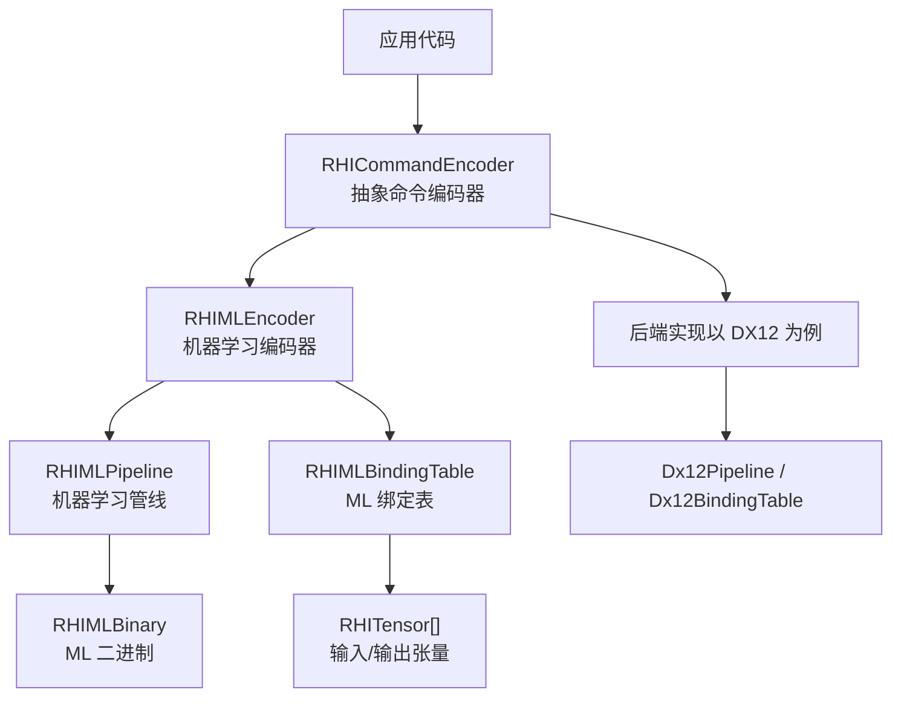
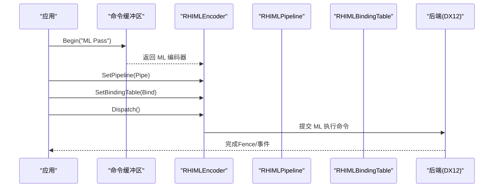
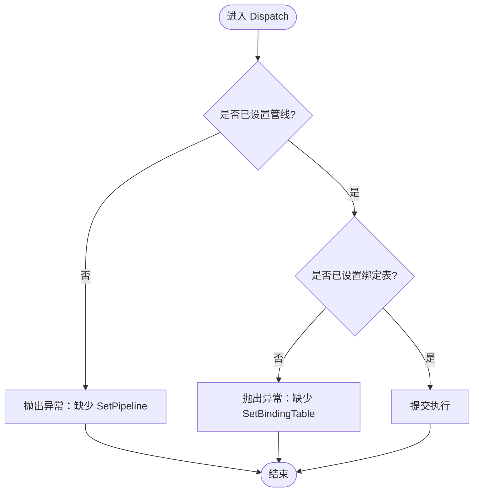
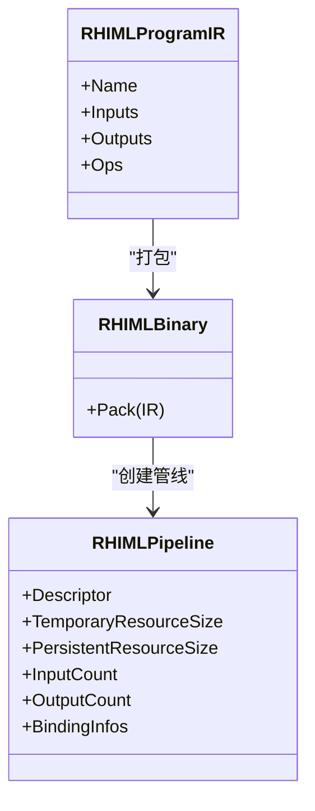
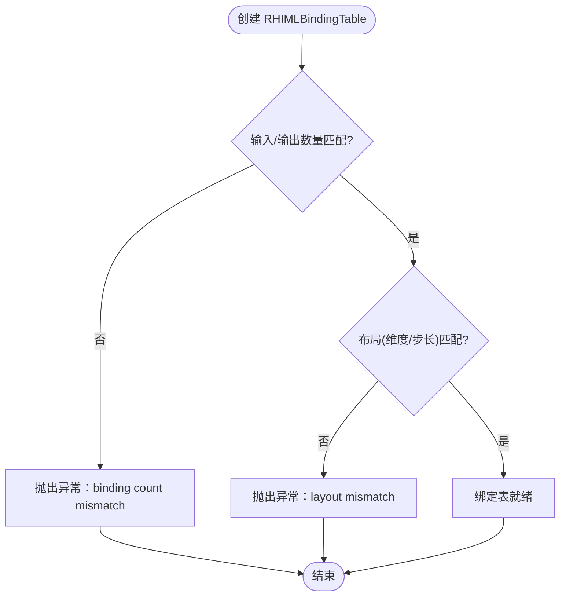
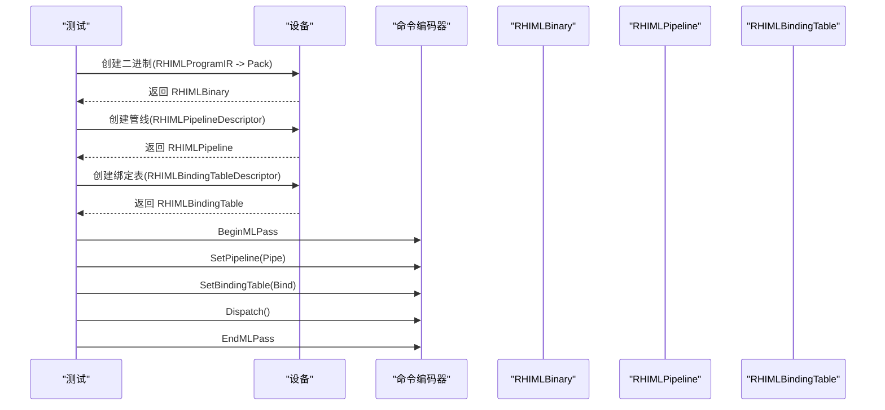
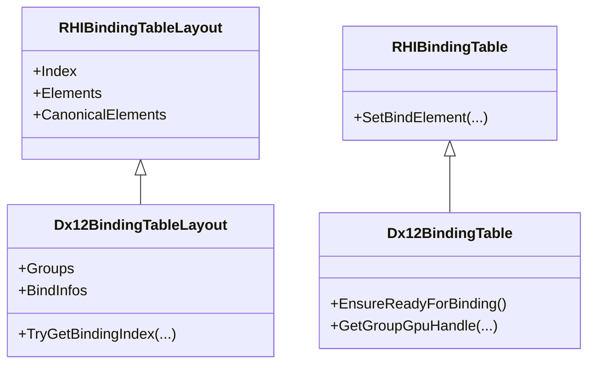
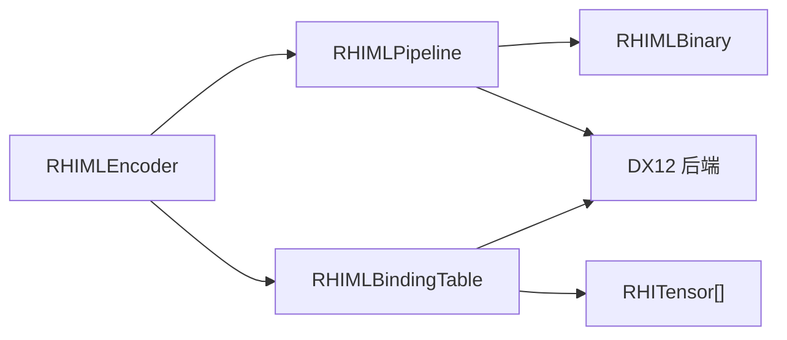

# 机器学习编码器

<cite>
**本文引用的文件**
- [RHICommandEncoder.cs](file://src/SharpGPU/Abstract/RHICommandEncoder.cs)
- [RHIPipeline.cs](file://src/SharpGPU/Abstract/RHIPipeline.cs)
- [RHIBindingTable.cs](file://src/SharpGPU/Abstract/RHIBindingTable.cs)
- [Dx12Pipeline.cs](file://src/SharpGPU/Dx12/Dx12Pipeline.cs)
- [Dx12BindingTable.cs](file://src/SharpGPU/Dx12/Dx12BindingTable.cs)
- [DirectMLBackendTests.cs](file://tests/SharpGPU.Conformance.Tests/DirectMLBackendTests.cs)
</cite>

## 目录
1. [简介](#简介)
2. [项目结构](#项目结构)
3. [核心组件](#核心组件)
4. [架构总览](#架构总览)
5. [详细组件分析](#详细组件分析)
6. [依赖关系分析](#依赖关系分析)
7. [性能考虑](#性能考虑)
8. [故障排查指南](#故障排查指南)
9. [结论](#结论)
10. [附录：端到端示例与最佳实践](#附录：端到端示例与最佳实践)

## 简介
本文件聚焦于 SharpGPU 的“机器学习编码器”能力，围绕 RHIMLEncoder 的职责、API 接口（SetPipeline、SetBindingTable、Dispatch）、机器学习管线设置与资源绑定机制，以及与 DirectML 等机器学习框架的集成方式进行系统化说明。文档同时提供完整的端到端使用流程，展示如何创建机器学习二进制、构建管线、绑定张量数据并执行推理任务。

## 项目结构
SharpGPU 将通用抽象与后端实现解耦：
- 抽象层（Abstract）：定义统一的 RHI 接口，包括命令编码器、管线、绑定表等。
- 后端实现（Dx12/Metal/Vulkan）：针对具体图形/计算后端进行实现。
- 测试与样例：通过单元测试验证 ML 路径的正确性与兼容性。

图表来源
- [RHICommandEncoder.cs:341-370](file://src/SharpGPU/Abstract/RHICommandEncoder.cs#L341-L370)
- [RHIPipeline.cs:779-800](file://src/SharpGPU/Abstract/RHIPipeline.cs#L779-L800)
- [Dx12Pipeline.cs:1-126](file://src/SharpGPU/Dx12/Dx12Pipeline.cs#L1-L126)
- [Dx12BindingTable.cs:163-371](file://src/SharpGPU/Dx12/Dx12BindingTable.cs#L163-L371)

章节来源
- [RHICommandEncoder.cs:341-370](file://src/SharpGPU/Abstract/RHICommandEncoder.cs#L341-L370)
- [RHIPipeline.cs:779-800](file://src/SharpGPU/Abstract/RHIPipeline.cs#L779-L800)

## 核心组件
- RHIMLEncoder：机器学习编码器的统一入口，负责开启/结束 ML Pass、设置管线、绑定资源表、触发执行。
- RHIMLPipeline：封装机器学习二进制及运行时所需信息（如临时/持久资源大小、输入输出数量、绑定信息等）。
- RHIMLBindingTable：将具体的 Tensor（输入/输出）与管线声明的绑定位置进行匹配和校验。
- RHIMLBinary：由上层工具或编译器生成的可执行二进制（例如通过 IR 打包为二进制）。
- RHITensor：描述张量的数据类型、维度、步长、存储模式与后备缓冲，供 ML 管线访问。

关键职责
- RHIMLEncoder：
  - BeginMLPass/EndMLPass：管理 ML Pass 生命周期。
  - SetPipeline：绑定当前要执行的 ML 管线。
  - SetBindingTable：将输入/输出张量与管线绑定。
  - Dispatch：提交执行。
- RHIMLPipeline：
  - 暴露 TemporaryResourceSize、PersistentResourceSize、InputCount、OutputCount 等元信息。
  - 提供 BindingInfos 用于描述每个绑定的名称、索引、种类（输入/输出）与张量描述符。
- RHIMLBindingTable：
  - 在创建时校验输入/输出数量、布局（维度/步长）与管线声明的一致性。
  - 维护绑定状态，确保必需绑定均已设置。

章节来源
- [RHICommandEncoder.cs:341-370](file://src/SharpGPU/Abstract/RHICommandEncoder.cs#L341-L370)
- [RHIPipeline.cs:779-800](file://src/SharpGPU/Abstract/RHIPipeline.cs#L779-L800)
- [DirectMLBackendTests.cs:123-156](file://tests/SharpGPU.Conformance.Tests/DirectMLBackendTests.cs#L123-L156)

## 架构总览
下图展示了从应用调用到后端执行的完整序列，涵盖 ML Pass 的生命周期、管线与绑定表的设置，以及最终执行。

图表来源
- [RHICommandEncoder.cs:341-370](file://src/SharpGPU/Abstract/RHICommandEncoder.cs#L341-L370)
- [DirectMLBackendTests.cs:227-274](file://tests/SharpGPU.Conformance.Tests/DirectMLBackendTests.cs#L227-L274)

## 详细组件分析

### RHIMLEncoder 与 API 契约
- BeginMLPass/EndMLPass：封装 ML Pass 的开始与结束，内部会校验编码器是否已附加到命令缓冲区。
- SetPipeline：绑定一个 RHIMLPipeline；若未设置则 Dispatch 会抛出异常。
- SetBindingTable：绑定 RHIMLBindingTable；若未设置则 Dispatch 会抛出异常。
- Dispatch：提交执行；要求先设置管线与绑定表。

图表来源
- [RHICommandEncoder.cs:341-370](file://src/SharpGPU/Abstract/RHICommandEncoder.cs#L341-L370)
- [DirectMLBackendTests.cs:123-156](file://tests/SharpGPU.Conformance.Tests/DirectMLBackendTests.cs#L123-L156)

章节来源
- [RHICommandEncoder.cs:341-370](file://src/SharpGPU/Abstract/RHICommandEncoder.cs#L341-L370)
- [DirectMLBackendTests.cs:123-156](file://tests/SharpGPU.Conformance.Tests/DirectMLBackendTests.cs#L123-L156)

### 机器学习管线与二进制
- RHIMLPipelineDescriptor：包含 Name 与 Binary。
- RHIMLProgramIR：用于描述程序图（输入/输出张量描述、算子列表），可由工具打包为 RHIMLBinary。
- RHIMLPipeline：承载二进制与运行时元信息（临时/持久资源大小、输入/输出计数、绑定信息等）。

图表来源
- [RHIPipeline.cs:779-800](file://src/SharpGPU/Abstract/RHIPipeline.cs#L779-L800)
- [DirectMLBackendTests.cs:276-315](file://tests/SharpGPU.Conformance.Tests/DirectMLBackendTests.cs#L276-L315)

章节来源
- [RHIPipeline.cs:779-800](file://src/SharpGPU/Abstract/RHIPipeline.cs#L779-L800)
- [DirectMLBackendTests.cs:276-315](file://tests/SharpGPU.Conformance.Tests/DirectMLBackendTests.cs#L276-L315)

### 绑定表与资源绑定机制
- RHIMLBindingTable：将输入/输出张量与管线声明的绑定位置进行匹配，校验数量与布局（维度/步长）一致性。
- 绑定失败场景：
  - 输入/输出数量不匹配：抛出异常。
  - 布局不匹配（维度/步长不一致）：抛出异常。
- 绑定表在创建时即完成必要校验，避免运行期错误。

图表来源
- [DirectMLBackendTests.cs:58-121](file://tests/SharpGPU.Conformance.Tests/DirectMLBackendTests.cs#L58-L121)

章节来源
- [DirectMLBackendTests.cs:58-121](file://tests/SharpGPU.Conformance.Tests/DirectMLBackendTests.cs#L58-L121)

### 与 DirectML 的集成
- 通过 RHIMLProgramIR 描述算子图（如矩阵乘加与激活函数），并使用后端提供的编解码器（如 Dx12MlBinaryCodec.Pack）生成 RHIMLBinary。
- 使用设备 API 创建 RHIMLPipeline 与 RHIMLBindingTable，并在命令缓冲区中记录 ML Pass 的执行。
- 测试用例展示了端到端流程：上传输入、设置屏障、执行 ML Pass、回读结果并与 CPU 参考对比。

图表来源
- [DirectMLBackendTests.cs:227-274](file://tests/SharpGPU.Conformance.Tests/DirectMLBackendTests.cs#L227-L274)
- [DirectMLBackendTests.cs:276-315](file://tests/SharpGPU.Conformance.Tests/DirectMLBackendTests.cs#L276-L315)

章节来源
- [DirectMLBackendTests.cs:227-274](file://tests/SharpGPU.Conformance.Tests/DirectMLBackendTests.cs#L227-L274)
- [DirectMLBackendTests.cs:276-315](file://tests/SharpGPU.Conformance.Tests/DirectMLBackendTests.cs#L276-L315)

### 通用绑定表（非 ML）与 DX12 实现要点
虽然 ML 使用专门的 RHIMLBindingTable，但通用绑定表（RHIBindingTable）在 DX12 后端的实现提供了理解资源绑定与根签名映射的重要参考：
- 绑定表布局（RHIBindingTableLayout）将槽位、类型、阶段、需求等信息转换为后端可理解的 DescriptorRange 与 RootParameter。
- 绑定表（RHIBindingTable）负责分配描述符堆、填充空描述符、校验必需绑定是否设置，并在执行前确保就绪。

图表来源
- [RHIBindingTable.cs:12-62](file://src/SharpGPU/Abstract/RHIBindingTable.cs#L12-L62)
- [Dx12BindingTable.cs:163-371](file://src/SharpGPU/Dx12/Dx12BindingTable.cs#L163-L371)
- [Dx12Pipeline.cs:128-238](file://src/SharpGPU/Dx12/Dx12Pipeline.cs#L128-L238)

章节来源
- [RHIBindingTable.cs:12-62](file://src/SharpGPU/Abstract/RHIBindingTable.cs#L12-L62)
- [Dx12BindingTable.cs:163-371](file://src/SharpGPU/Dx12/Dx12BindingTable.cs#L163-L371)
- [Dx12Pipeline.cs:128-238](file://src/SharpGPU/Dx12/Dx12Pipeline.cs#L128-L238)

## 依赖关系分析
- RHIMLEncoder 依赖 RHIMLPipeline 与 RHIMLBindingTable。
- RHIMLPipeline 依赖 RHIMLBinary。
- RHIMLBindingTable 依赖 RHITensor[]（输入/输出）。
- 在 DX12 后端，管线与绑定表进一步依赖底层 RootSignature 与 DescriptorHeap 的管理。

图表来源
- [RHICommandEncoder.cs:341-370](file://src/SharpGPU/Abstract/RHICommandEncoder.cs#L341-L370)
- [RHIPipeline.cs:779-800](file://src/SharpGPU/Abstract/RHIPipeline.cs#L779-L800)
- [Dx12Pipeline.cs:1-126](file://src/SharpGPU/Dx12/Dx12Pipeline.cs#L1-L126)

章节来源
- [RHICommandEncoder.cs:341-370](file://src/SharpGPU/Abstract/RHICommandEncoder.cs#L341-L370)
- [RHIPipeline.cs:779-800](file://src/SharpGPU/Abstract/RHIPipeline.cs#L779-L800)
- [Dx12Pipeline.cs:1-126](file://src/SharpGPU/Dx12/Dx12Pipeline.cs#L1-L126)

## 性能考虑
- 管线复用：尽量复用 RHIMLPipeline，减少创建开销。
- 绑定表缓存：RHIMLBindingTable 可在多帧间复用，避免重复创建。
- 内存布局：合理设置张量的 Strides，避免不必要的拷贝与对齐开销。
- 屏障优化：在 ML Pass 前后正确设置 Barrier，减少不必要的同步。
- 批量执行：合并多个小算子为更大的程序图，降低调度开销。

## 故障排查指南
- 未设置管线即 Dispatch：检查是否在 BeginMLPass 后调用 SetPipeline。
- 未设置绑定表即 Dispatch：检查是否在 BeginMLPass 后调用 SetBindingTable。
- 绑定数量不匹配：确认输入/输出数组长度与管线声明一致。
- 布局不匹配：核对张量的 Dimensions 与 Strides 是否与管线期望一致。
- 后端不可用：确认设备支持 MachineLearning 执行能力。

章节来源
- [DirectMLBackendTests.cs:58-121](file://tests/SharpGPU.Conformance.Tests/DirectMLBackendTests.cs#L58-L121)
- [DirectMLBackendTests.cs:123-156](file://tests/SharpGPU.Conformance.Tests/DirectMLBackendTests.cs#L123-L156)

## 结论
SharpGPU 的机器学习编码器通过 RHIMLEncoder 提供统一的 ML Pass 控制面，结合 RHIMLPipeline 与 RHIMLBindingTable 实现对机器学习任务的管线化与资源绑定。通过与 DirectML 的集成，开发者可以高效地在 GPU 上执行训练与推理任务。遵循正确的生命周期管理与资源绑定规范，可获得稳定且高性能的 ML 执行体验。

## 附录：端到端示例与最佳实践
以下示例基于测试用例中的流程，展示如何：
- 构建 RHIMLProgramIR（包含输入/输出张量描述与算子列表）。
- 打包为 RHIMLBinary。
- 创建 RHIMLPipeline。
- 创建 RHIMLBindingTable（绑定输入/输出张量）。
- 在命令缓冲区中记录 ML Pass 并执行。

步骤概览
- 准备输入/输出张量描述符与后备缓冲。
- 构建程序图（如 GEMM + ReLU）。
- 打包二进制并创建管线。
- 创建绑定表并设置屏障。
- 开始 ML Pass，设置管线与绑定表，执行 Dispatch。
- 结束 ML Pass，读取结果并验证。

章节来源
- [DirectMLBackendTests.cs:227-274](file://tests/SharpGPU.Conformance.Tests/DirectMLBackendTests.cs#L227-L274)
- [DirectMLBackendTests.cs:276-315](file://tests/SharpGPU.Conformance.Tests/DirectMLBackendTests.cs#L276-L315)
- [DirectMLBackendTests.cs:158-225](file://tests/SharpGPU.Conformance.Tests/DirectMLBackendTests.cs#L158-L225)