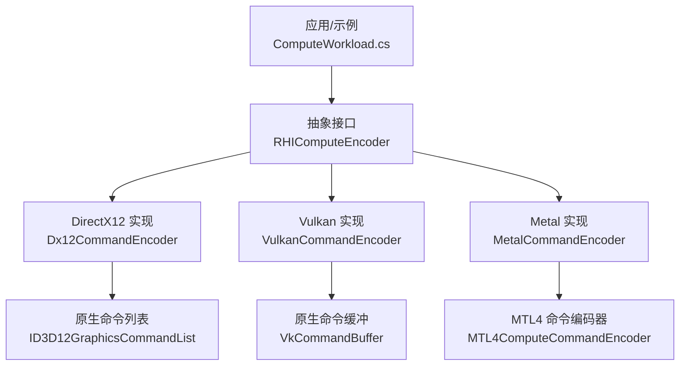
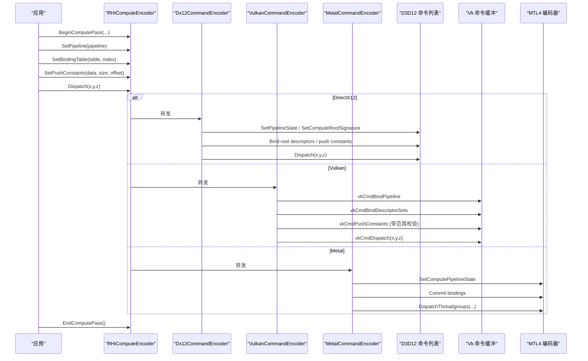
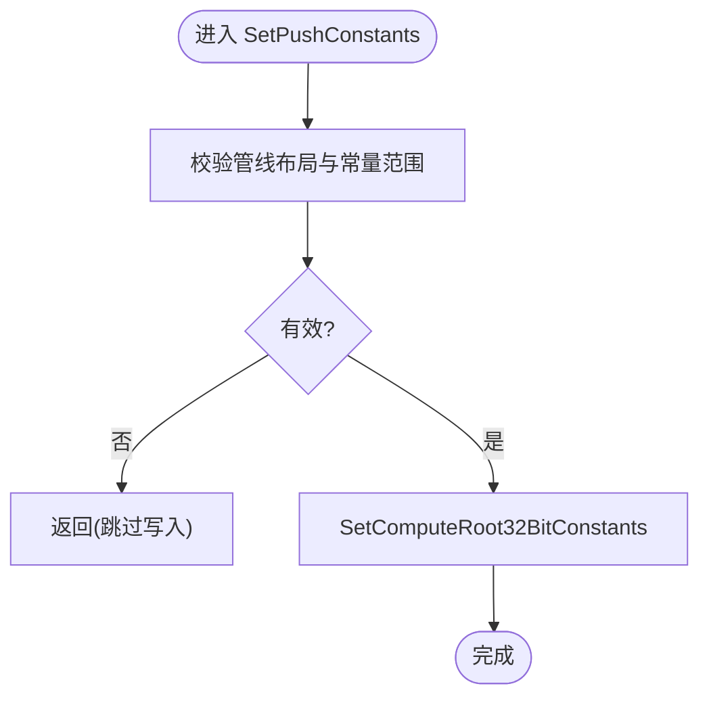
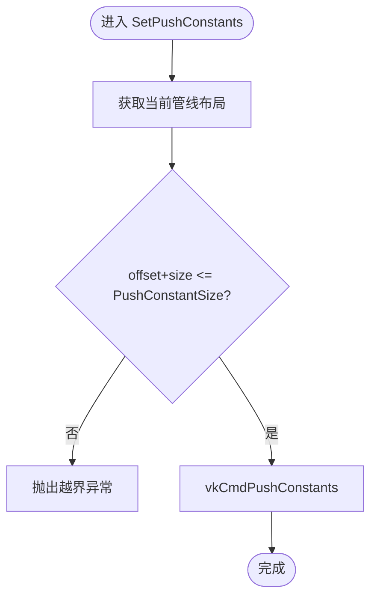
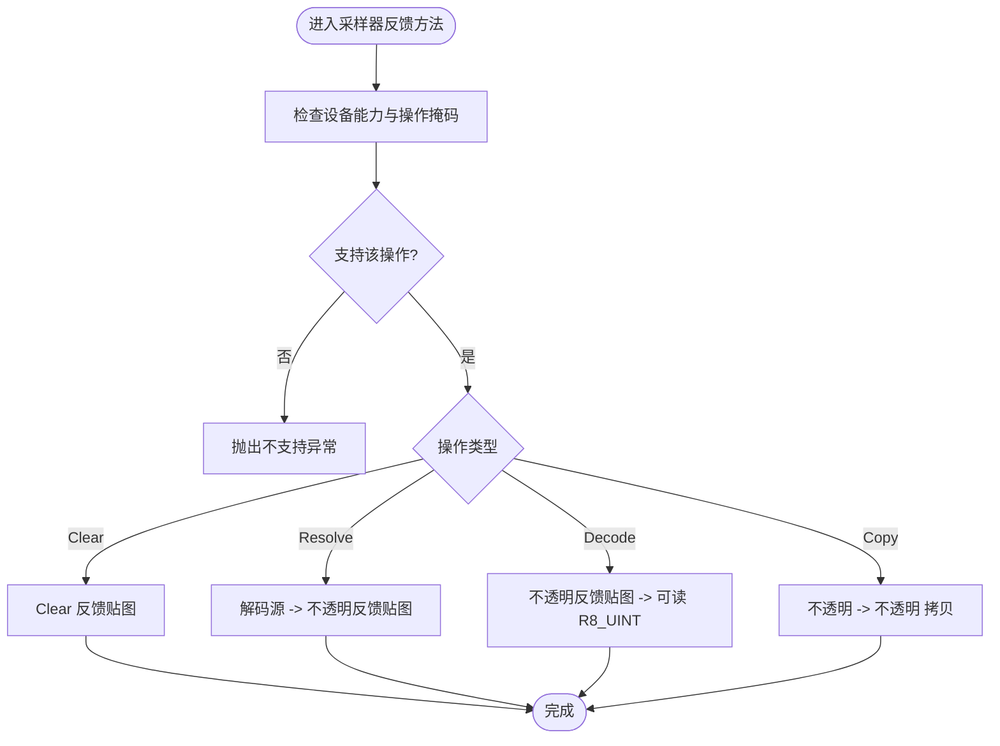
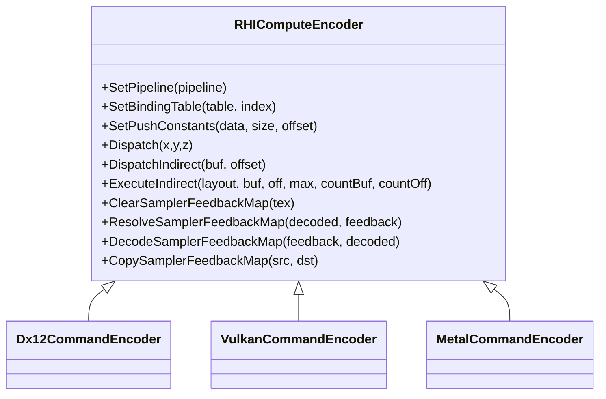

# 计算编码器

<cite>
**本文引用的文件**
- [RHICommandEncoder.cs](file://src/SharpGPU/Abstract/RHICommandEncoder.cs)
- [Dx12CommandEncoder.cs](file://src/SharpGPU/Dx12/Dx12CommandEncoder.cs)
- [VulkanCommandEncoder.cs](file://src/SharpGPU/Vulkan/VulkanCommandEncoder.cs)
- [MetalCommandEncoder.cs](file://src/SharpGPU/Metal/MetalCommandEncoder.cs)
- [ComputeWorkload.cs](file://samples/ComputeAndDraw/ComputeWorkload.cs)
</cite>

## 目录
1. [简介](#简介)
2. [项目结构](#项目结构)
3. [核心组件](#核心组件)
4. [架构总览](#架构总览)
5. [详细组件分析](#详细组件分析)
6. [依赖关系分析](#依赖关系分析)
7. [性能注意事项](#性能注意事项)
8. [故障排查指南](#故障排查指南)
9. [结论](#结论)
10. [附录：完整使用示例与最佳实践](#附录完整使用示例与最佳实践)

## 简介
本文件聚焦 SharpGPU 中的“计算编码器”（RHIComputeEncoder），系统性说明其职责、API 接口、管线设置、资源绑定、参数配置机制，以及采样器反馈相关操作。同时给出跨后端（DirectX12、Vulkan、Metal）的实现差异与调用流程，并提供完整的代码示例路径以展示如何设置计算管线、绑定资源并执行并行计算任务。

## 项目结构
SharpGPU 采用抽象 RHI + 多后端实现的层次化设计：
- 抽象层：定义统一的命令编码接口（如 RHIComputeEncoder），屏蔽平台差异。
- 后端实现：针对 DirectX12、Vulkan、Metal 提供具体实现，将抽象 API 映射到原生命令。
- 示例工程：通过 ComputeWorkload 演示从创建函数、管线、绑定表到 Dispatch 的完整流程。

图表来源
- [RHICommandEncoder.cs:135-277](file://src/SharpGPU/Abstract/RHICommandEncoder.cs#L135-L277)
- [Dx12CommandEncoder.cs:1757-1846](file://src/SharpGPU/Dx12/Dx12CommandEncoder.cs#L1757-L1846)
- [VulkanCommandEncoder.cs:1140-1203](file://src/SharpGPU/Vulkan/VulkanCommandEncoder.cs#L1140-L1203)
- [MetalCommandEncoder.cs:1748-1808](file://src/SharpGPU/Metal/MetalCommandEncoder.cs#L1748-L1808)

章节来源
- [RHICommandEncoder.cs:135-277](file://src/SharpGPU/Abstract/RHICommandEncoder.cs#L135-L277)
- [ComputeWorkload.cs:45-161](file://samples/ComputeAndDraw/ComputeWorkload.cs#L45-L161)

## 核心组件
- RHIComputeEncoder（抽象）：定义计算通道的统一 API，包括 BeginPass/EndPass、Barrier/Barriers、SetPipeline、SetBindingTable、SetPushConstants、Dispatch、DispatchIndirect、ExecuteIndirect，以及采样器反馈相关方法（Clear/Resolve/Decode/Copy）。
- 后端实现：
  - Dx12CommandEncoder：将 SetPipeline/SetBindingTable/SetPushConstants/Dispatch/DispatchIndirect 等映射到 D3D12 命令；支持 ExecuteIndirect 与采样器反馈命令。
  - VulkanCommandEncoder：将上述 API 映射到 Vulkan 命令；对 Push Constants 进行范围校验；支持 DispatchIndirect。
  - MetalCommandEncoder：基于 MTL4 命令编码器；不支持 Push Constants（需显式缓冲区绑定）；支持 Dispatch/DispatchIndirect。

章节来源
- [RHICommandEncoder.cs:135-277](file://src/SharpGPU/Abstract/RHICommandEncoder.cs#L135-L277)
- [Dx12CommandEncoder.cs:1757-1846](file://src/SharpGPU/Dx12/Dx12CommandEncoder.cs#L1757-L1846)
- [VulkanCommandEncoder.cs:1140-1203](file://src/SharpGPU/Vulkan/VulkanCommandEncoder.cs#L1140-L1203)
- [MetalCommandEncoder.cs:1748-1808](file://src/SharpGPU/Metal/MetalCommandEncoder.cs#L1748-L1808)

## 架构总览
下图展示了从应用侧到各后端的计算编码调用链，突出关键步骤：设置管线、绑定资源表、设置常量、派发线程组。

图表来源
- [Dx12CommandEncoder.cs:1757-1791](file://src/SharpGPU/Dx12/Dx12CommandEncoder.cs#L1757-L1791)
- [VulkanCommandEncoder.cs:1140-1196](file://src/SharpGPU/Vulkan/VulkanCommandEncoder.cs#L1140-L1196)
- [MetalCommandEncoder.cs:1748-1791](file://src/SharpGPU/Metal/MetalCommandEncoder.cs#L1748-L1791)

## 详细组件分析

### RHIComputeEncoder 抽象接口
- 管线设置：SetPipeline(RHIComputePipeline)
- 资源绑定：SetBindingTable(RHIBindingTable, tableIndex)
- 参数配置：SetPushConstants(IntPtr data, uint size, uint offset = 0)
- 执行：Dispatch(groupCountX, groupCountY, groupCountZ)、DispatchIndirect(argsBuffer, argsOffset)、ExecuteIndirect(layout, argumentsBuffer, argumentsOffset, maximumCommandCount, countBuffer?, countOffset)
- 同步与统计：Barrier/Barriers、WriteTimestamp、BeginStatistics/EndStatistics
- 采样器反馈：ClearSamplerFeedbackMap、ResolveSamplerFeedbackMap、DecodeSamplerFeedbackMap、CopySamplerFeedbackMap

注意：
- 采样器反馈方法在抽象基类中默认抛出“未实现”，由各后端实现具体逻辑。
- ExecuteIndirect 在抽象层默认抛出“未实现”，由后端按需实现。

章节来源
- [RHICommandEncoder.cs:135-277](file://src/SharpGPU/Abstract/RHICommandEncoder.cs#L135-L277)

### DirectX12 实现（Dx12CommandEncoder）
- SetPipeline：设置原生管线状态与根签名。
- SetBindingTable：通过绑定表绑定描述符到当前根签名槽位。
- SetPushConstants：写入根常量（按 32-bit 常量计数与偏移）。
- Dispatch：直接调用原生 Dispatch。
- DispatchIndirect：使用已创建的间接命令签名执行。
- ExecuteIndirect：验证布局域为 Compute，并进行设备一致性检查后调用 ExecuteIndirect。
- 采样器反馈：Clear/Resolve/Decode/Copy 均委托给 Dx12SamplerFeedbackCommands，并在调用前进行能力与纹理类型校验。

图表来源
- [Dx12CommandEncoder.cs:1776-1785](file://src/SharpGPU/Dx12/Dx12CommandEncoder.cs#L1776-L1785)

章节来源
- [Dx12CommandEncoder.cs:1757-1846](file://src/SharpGPU/Dx12/Dx12CommandEncoder.cs#L1757-L1846)
- [Dx12CommandEncoder.cs:1848-1928](file://src/SharpGPU/Dx12/Dx12CommandEncoder.cs#L1848-L1928)

### Vulkan 实现（VulkanCommandEncoder）
- SetPipeline：vkCmdBindPipeline。
- SetBindingTable：解析并绑定 DescriptorSet。
- SetPushConstants：先校验 offset+size 不超过声明大小，再 vkCmdPushConstants。
- Dispatch：vkCmdDispatch。
- DispatchIndirect：vkCmdDispatchIndirect。

图表来源
- [VulkanCommandEncoder.cs:1177-1190](file://src/SharpGPU/Vulkan/VulkanCommandEncoder.cs#L1177-L1190)

章节来源
- [VulkanCommandEncoder.cs:1140-1203](file://src/SharpGPU/Vulkan/VulkanCommandEncoder.cs#L1140-L1203)

### Metal 实现（MetalCommandEncoder）
- SetPipeline：设置 MTL4 计算管线状态，并初始化绑定后端。
- SetBindingTable：通过 MetalBindingBackend 提交绑定。
- SetPushConstants：当前后端不支持（需显式缓冲区绑定）。
- Dispatch：提交绑定后调用 DispatchThreadgroups。
- DispatchIndirect：使用间接缓冲调用 DispatchThreadgroupsWithIndirectBuffer。

章节来源
- [MetalCommandEncoder.cs:1748-1808](file://src/SharpGPU/Metal/MetalCommandEncoder.cs#L1748-L1808)

### 采样器反馈（Sampler Feedback）
- 抽象基类提供 Clear/Resolve/Decode/Copy 四个方法，用于处理不透明反馈贴图与可读 R8_UINT 解码图之间的转换与拷贝。
- 每个方法在进入时进行能力检查（Raster.SamplerFeedback）与操作支持掩码校验，确保设备支持该操作。
- DirectX12 后端实现了这些方法，并通过 Dx12SamplerFeedbackCommands 完成底层转码/复制/清空。

图表来源
- [RHICommandEncoder.cs:183-277](file://src/SharpGPU/Abstract/RHICommandEncoder.cs#L183-L277)
- [Dx12CommandEncoder.cs:1848-1928](file://src/SharpGPU/Dx12/Dx12CommandEncoder.cs#L1848-L1928)

章节来源
- [RHICommandEncoder.cs:183-277](file://src/SharpGPU/Abstract/RHICommandEncoder.cs#L183-L277)
- [Dx12CommandEncoder.cs:1848-1928](file://src/SharpGPU/Dx12/Dx12CommandEncoder.cs#L1848-L1928)

## 依赖关系分析
- RHIComputeEncoder 作为抽象入口，被各后端实现继承并重写。
- 各后端实现依赖各自的原生命令对象（D3D12 命令列表、Vk 命令缓冲、MTL4 编码器）。
- 绑定表与管线布局在后端内部进行一致性校验与绑定。
- 采样器反馈依赖设备能力与特定纹理类型（反馈贴图）。

图表来源
- [RHICommandEncoder.cs:135-277](file://src/SharpGPU/Abstract/RHICommandEncoder.cs#L135-L277)
- [Dx12CommandEncoder.cs:1757-1846](file://src/SharpGPU/Dx12/Dx12CommandEncoder.cs#L1757-L1846)
- [VulkanCommandEncoder.cs:1140-1203](file://src/SharpGPU/Vulkan/VulkanCommandEncoder.cs#L1140-L1203)
- [MetalCommandEncoder.cs:1748-1808](file://src/SharpGPU/Metal/MetalCommandEncoder.cs#L1748-L1808)

章节来源
- [RHICommandEncoder.cs:135-277](file://src/SharpGPU/Abstract/RHICommandEncoder.cs#L135-L277)

## 性能注意事项
- 批量屏障：尽量合并 Barrier/Barriers 以减少同步开销。
- 绑定表复用：避免频繁重建绑定表，尽量复用同一布局下的不同实例。
- 常量更新：仅在必要时更新 Push Constants，减少不必要的写入。
- 间接派发：对于动态调度数量，优先使用 ExecuteIndirect/DispatchIndirect 降低 CPU 开销。
- 采样器反馈：仅在需要时进行解码/转码/拷贝，避免多余的数据搬运。

[本节为通用指导，无需引用具体文件]

## 故障排查指南
- 未设置管线即绑定或派发：后端会抛出“必须设置管线”的错误。
- Push Constants 越界（Vulkan）：当 offset+size 超过声明大小时抛出异常。
- 采样器反馈不支持：若设备能力不包含对应操作，将抛出“不支持”异常。
- 间接执行参数不一致：ExecuteIndirect 要求布局域为 Compute，且参数与设备一致。
- 资源归属错误：间接执行或采样器反馈中，资源必须属于当前后端设备。

章节来源
- [VulkanCommandEncoder.cs:1177-1190](file://src/SharpGPU/Vulkan/VulkanCommandEncoder.cs#L1177-L1190)
- [RHICommandEncoder.cs:255-277](file://src/SharpGPU/Abstract/RHICommandEncoder.cs#L255-L277)
- [Dx12CommandEncoder.cs:1801-1846](file://src/SharpGPU/Dx12/Dx12CommandEncoder.cs#L1801-L1846)

## 结论
RHIComputeEncoder 提供了统一的计算通道抽象，屏蔽了 DirectX12、Vulkan、Metal 的差异。通过 SetPipeline、SetBindingTable、SetPushConstants 完成管线与资源绑定，再通过 Dispatch/DispatchIndirect/ExecuteIndirect 执行并行计算。采样器反馈方法为渲染质量优化提供了工具集，但需关注设备能力与操作支持。实际使用中应遵循后端特性与限制，合理组织屏障与绑定，以获得稳定高效的 GPU 执行。

[本节为总结性内容，无需引用具体文件]

## 附录：完整使用示例与最佳实践
以下示例来自 samples/ComputeAndDraw/ComputeWorkload.cs，展示了：
- 编译着色器并生成多后端产物
- 创建函数、管线布局、计算管线
- 创建输出缓冲与读取缓冲，并建立视图与绑定表
- 开始计算通道、设置屏障、设置管线、绑定表、派发线程组
- 结束计算通道，转入传输通道进行数据回读
- 提交命令并等待完成，读取结果验证

参考路径
- [ComputeWorkload.cs:45-161](file://samples/ComputeAndDraw/ComputeWorkload.cs#L45-L161)

最佳实践要点
- 在 BeginComputePass 后立即设置管线与绑定表，再进行派发。
- 明确资源访问语义，使用合适的 Barrier 保证读写顺序。
- 使用 ExecuteIndirect/DispatchIndirect 减少 CPU 侧循环开销。
- 采样器反馈仅在需要时启用，并确保设备能力满足。

章节来源
- [ComputeWorkload.cs:45-161](file://samples/ComputeAndDraw/ComputeWorkload.cs#L45-L161)