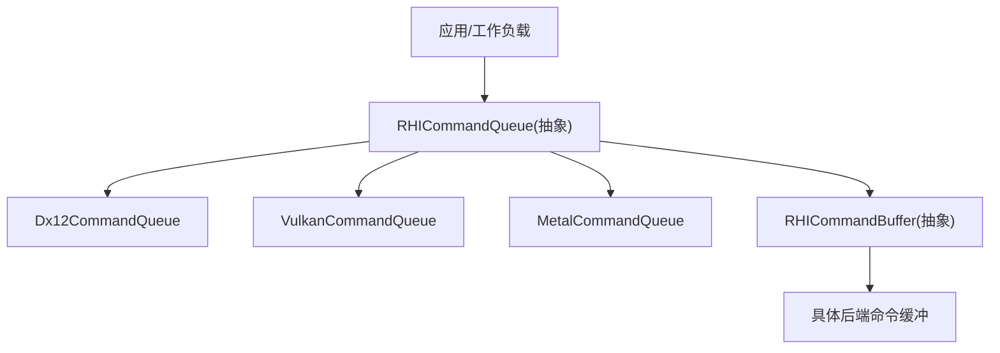
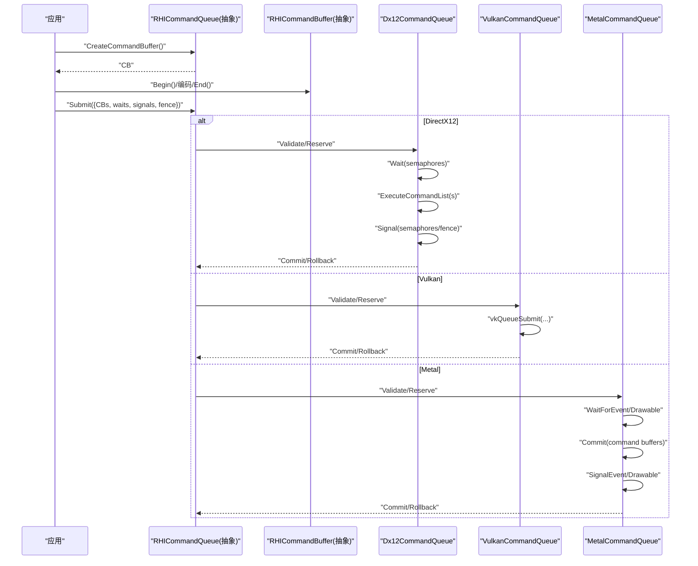
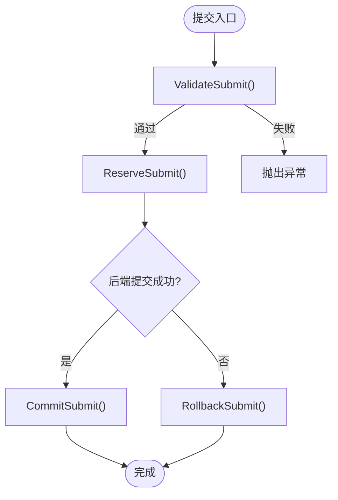
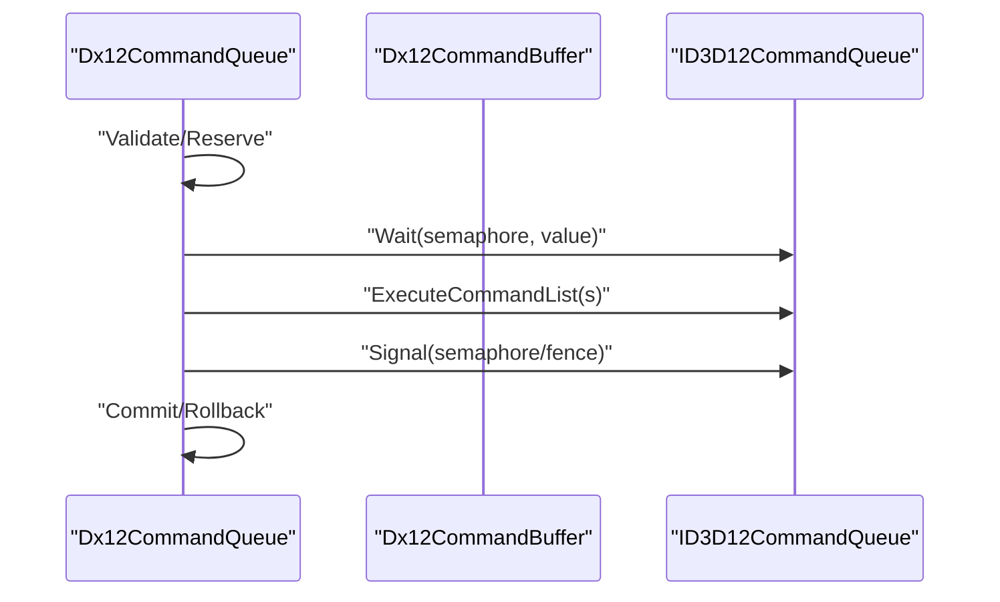
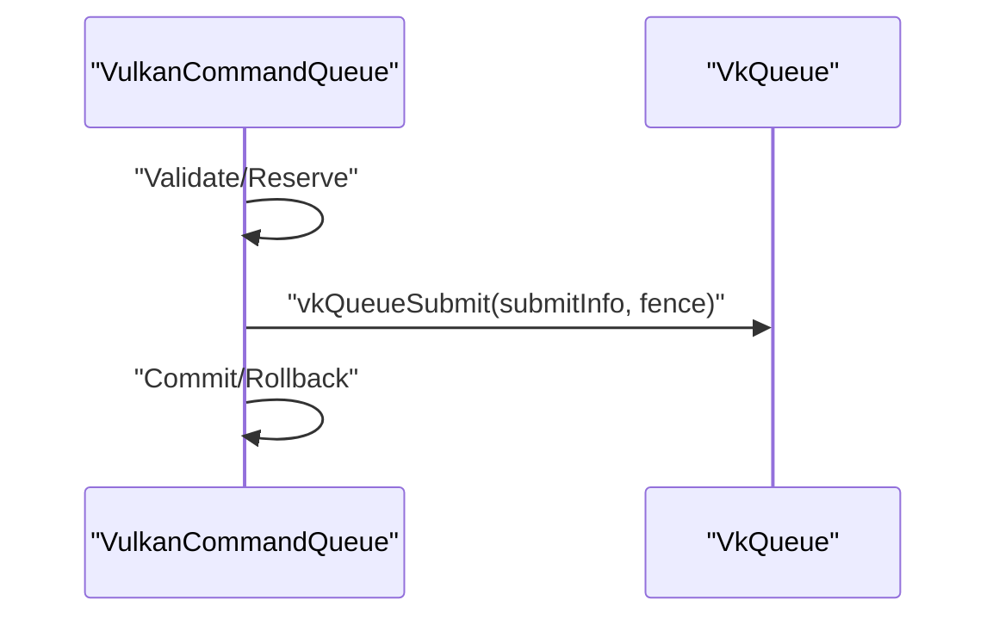
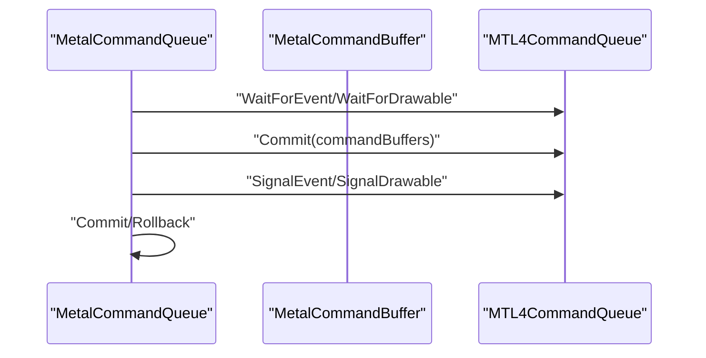
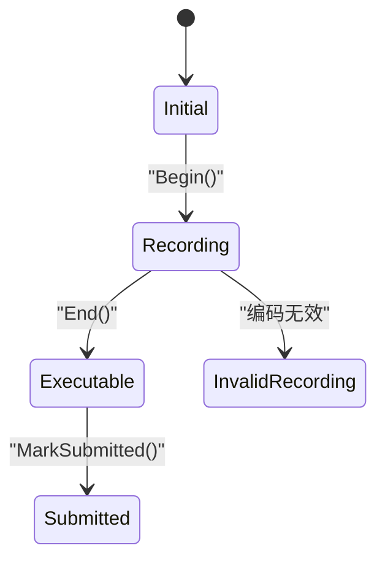
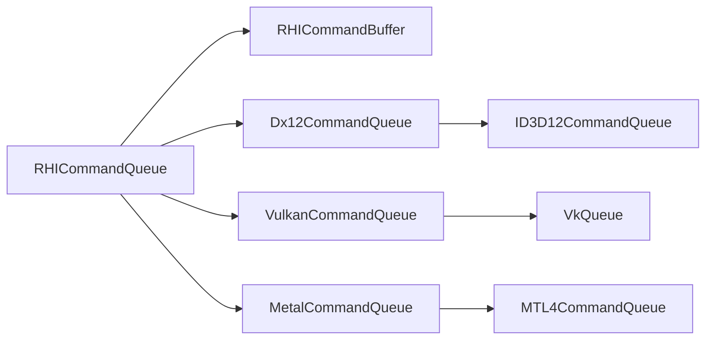

# 命令队列

<cite>
**本文引用的文件**
- [RHICommandQueue.cs](file://src/SharpGPU/Abstract/RHICommandQueue.cs)
- [Dx12CommandQueue.cs](file://src/SharpGPU/Dx12/Dx12CommandQueue.cs)
- [VulkanCommandQueue.cs](file://src/SharpGPU/Vulkan/VulkanCommandQueue.cs)
- [MetalCommandQueue.cs](file://src/SharpGPU/Metal/MetalCommandQueue.cs)
- [RHICommandBuffer.cs](file://src/SharpGPU/Abstract/RHICommandBuffer.cs)
- [ComputeWorkload.cs](file://samples/ComputeAndDraw/ComputeWorkload.cs)
- [RasterWorkload.cs](file://samples/ComputeAndDraw/RasterWorkload.cs)
</cite>

## 目录
1. [简介](#简介)
2. [项目结构](#项目结构)
3. [核心组件](#核心组件)
4. [架构总览](#架构总览)
5. [详细组件分析](#详细组件分析)
6. [依赖关系分析](#依赖关系分析)
7. [性能考量](#性能考量)
8. [故障排查指南](#故障排查指南)
9. [结论](#结论)
10. [附录：使用示例与最佳实践](#附录使用示例与最佳实践)

## 简介
本章节面向 SharpGPU 的命令队列（RHICommandQueue）进行系统化文档说明，重点覆盖以下方面：
- 命令提交、执行顺序保证与资源同步机制
- 队列类型与特性（计算、图形、传输等）及典型使用场景
- 异步执行模型、命令依赖管理与完成通知机制
- 批处理优化、内存使用与并发控制等性能要点
- 不同后端（DirectX12、Vulkan、Metal）在队列行为上的差异与兼容性考虑
- 正确提交命令、等待完成与异常处理的实践建议

## 项目结构
SharpGPU 将命令队列抽象为 RHICommandQueue，并在各后端提供具体实现：
- 抽象层：定义统一的提交接口、验证逻辑、同步原语（信号量/栅栏）的预留-提交-回滚模式
- 后端实现：
  - DirectX12：封装 ID3D12CommandQueue 的 Wait/ExecuteCommandList(s)/Signal
  - Vulkan：构建 VkSubmitInfo 并通过 vkQueueSubmit 提交
  - Metal：基于 MTL4CommandQueue 的事件等待/信号与可绘制对象同步
- 命令缓冲：RHICommandBuffer 负责编码阶段状态机管理，确保仅在“已结束”状态下提交

图表来源
- [RHICommandQueue.cs:60-108](file://src/SharpGPU/Abstract/RHICommandQueue.cs#L60-L108)
- [Dx12CommandQueue.cs:53-154](file://src/SharpGPU/Dx12/Dx12CommandQueue.cs#L53-L154)
- [VulkanCommandQueue.cs:58-158](file://src/SharpGPU/Vulkan/VulkanCommandQueue.cs#L58-L158)
- [MetalCommandQueue.cs:65-181](file://src/SharpGPU/Metal/MetalCommandQueue.cs#L65-L181)
- [RHICommandBuffer.cs:26-190](file://src/SharpGPU/Abstract/RHICommandBuffer.cs#L26-L190)

章节来源
- [RHICommandQueue.cs:60-108](file://src/SharpGPU/Abstract/RHICommandQueue.cs#L60-L108)
- [RHICommandBuffer.cs:26-190](file://src/SharpGPU/Abstract/RHICommandBuffer.cs#L26-L190)

## 核心组件
- RHICommandQueue（抽象）
  - 职责：统一提交入口、参数校验、同步原语的预留/提交/回滚、稀疏绑定（可选）
  - 关键能力：
    - CreateCommandBuffer：创建与该队列绑定的命令缓冲
    - Submit：提交命令缓冲与同步操作，保证顺序与一致性
    - BindSparse：按队列顺序更新纹理块映射（若支持）
- RHICommandBuffer（抽象）
  - 职责：编码生命周期管理（开始/结束）、编码器互斥、提交前状态检查
  - 关键能力：
    - Begin/End：记录命令并进入可执行状态
    - ValidateCanSubmit：确保仅“已结束”的命令缓冲可提交
    - MarkSubmitted：提交后状态迁移

章节来源
- [RHICommandQueue.cs:60-108](file://src/SharpGPU/Abstract/RHICommandQueue.cs#L60-L108)
- [RHICommandBuffer.cs:26-190](file://src/SharpGPU/Abstract/RHICommandBuffer.cs#L26-L190)

## 架构总览
命令队列在不同后端中的调用序列如下：

图表来源
- [Dx12CommandQueue.cs:58-154](file://src/SharpGPU/Dx12/Dx12CommandQueue.cs#L58-L154)
- [VulkanCommandQueue.cs:63-158](file://src/SharpGPU/Vulkan/VulkanCommandQueue.cs#L63-L158)
- [MetalCommandQueue.cs:71-181](file://src/SharpGPU/Metal/MetalCommandQueue.cs#L71-L181)

## 详细组件分析

### 抽象命令队列：RHICommandQueue
- 设计要点
  - 提交描述符：RHIQueueSubmitDescriptor 包含命令缓冲、等待信号量、信号信号量、完成栅栏
  - 严格校验：
    - 命令缓冲必须来自同一队列且未重复
    - 信号量/栅栏必须属于同一设备且未释放
    - 等待阶段掩码限制为已知集合
  - 原子性提交：
    - ReserveSubmit：预保留所有同步原语
    - CommitSubmit：成功后标记命令缓冲已提交
    - RollbackSubmit：失败时回滚已保留的原语
  - 稀疏绑定：
    - 提供通用校验与预留/提交/回滚流程，具体后端实现细节

图表来源
- [RHICommandQueue.cs:118-330](file://src/SharpGPU/Abstract/RHICommandQueue.cs#L118-L330)

章节来源
- [RHICommandQueue.cs:60-519](file://src/SharpGPU/Abstract/RHICommandQueue.cs#L60-L519)

### DirectX12 命令队列：Dx12CommandQueue
- 关键行为
  - 创建：根据 ERHIPipelineType 转换为底层队列类型
  - 提交：
    - 先 Wait 等待信号量值
    - ExecuteCommandList(s) 执行一个或多个命令列表
    - Signal 信号量与完成栅栏
  - 错误处理：捕获设备丢失并标记
  - 稀疏绑定：UpdateTileMappings 更新块映射

图表来源
- [Dx12CommandQueue.cs:58-154](file://src/SharpGPU/Dx12/Dx12CommandQueue.cs#L58-L154)
- [Dx12CommandQueue.cs:198-291](file://src/SharpGPU/Dx12/Dx12CommandQueue.cs#L198-L291)

章节来源
- [Dx12CommandQueue.cs:1-530](file://src/SharpGPU/Dx12/Dx12CommandQueue.cs#L1-L530)

### Vulkan 命令队列：VulkanCommandQueue
- 关键行为
  - 获取队列句柄：vkGetDeviceQueue
  - 提交：
    - 构造 VkSubmitInfo（等待信号量+阶段掩码、命令缓冲数组、信号信号量、栅栏）
    - vkQueueSubmit 一次性提交
  - 稀疏绑定：vkQueueBindSparse 支持图像块与不透明绑定
  - 频率：基于物理设备时间戳周期换算

图表来源
- [VulkanCommandQueue.cs:63-158](file://src/SharpGPU/Vulkan/VulkanCommandQueue.cs#L63-L158)
- [VulkanCommandQueue.cs:160-369](file://src/SharpGPU/Vulkan/VulkanCommandQueue.cs#L160-L369)

章节来源
- [VulkanCommandQueue.cs:1-503](file://src/SharpGPU/Vulkan/VulkanCommandQueue.cs#L1-L503)

### Metal 命令队列：MetalCommandQueue
- 关键行为
  - 要求 MTL4CommandQueue；维护驻留集（ResidencySet）以优化显存驻留
  - 提交：
    - WaitForEvent/WaitForDrawable 建立依赖
    - Commit 提交命令缓冲（当前不使用反馈回调以避免 PAC 故障）
    - SignalEvent/SignalDrawable 发出信号
  - 稀疏绑定：UpdateTextureMappings 更新映射
  - 频率：固定 1GHz

图表来源
- [MetalCommandQueue.cs:71-181](file://src/SharpGPU/Metal/MetalCommandQueue.cs#L71-L181)
- [MetalCommandQueue.cs:183-276](file://src/SharpGPU/Metal/MetalCommandQueue.cs#L183-L276)

章节来源
- [MetalCommandQueue.cs:1-607](file://src/SharpGPU/Metal/MetalCommandQueue.cs#L1-L607)

### 命令缓冲：RHICommandBuffer
- 状态机：Initial → Recording → Executable → Submitted
- 编码器互斥：同一时刻只能有一个活动编码器
- 提交约束：必须在“已结束”状态才能提交

图表来源
- [RHICommandBuffer.cs:6-163](file://src/SharpGPU/Abstract/RHICommandBuffer.cs#L6-L163)

章节来源
- [RHICommandBuffer.cs:1-193](file://src/SharpGPU/Abstract/RHICommandBuffer.cs#L1-L193)

## 依赖关系分析
- 耦合关系
  - RHICommandQueue 与 RHICommandBuffer：强关联，命令缓冲由队列创建，提交时校验归属
  - 各后端队列与原生 API：分别依赖 ID3D12CommandQueue、VkQueue、MTL4CommandQueue
  - 同步原语：信号量/栅栏需与队列同属一个设备，避免跨设备引用
- 外部依赖
  - 后端库：Vortice.Direct3D12、Vortice.Vulkan、SharpMetal
- 潜在循环依赖
  - 无直接循环；通过抽象接口解耦

图表来源
- [RHICommandQueue.cs:60-108](file://src/SharpGPU/Abstract/RHICommandQueue.cs#L60-L108)
- [Dx12CommandQueue.cs:1-530](file://src/SharpGPU/Dx12/Dx12CommandQueue.cs#L1-L530)
- [VulkanCommandQueue.cs:1-503](file://src/SharpGPU/Vulkan/VulkanCommandQueue.cs#L1-L503)
- [MetalCommandQueue.cs:1-607](file://src/SharpGPU/Metal/MetalCommandQueue.cs#L1-L607)

章节来源
- [RHICommandQueue.cs:60-108](file://src/SharpGPU/Abstract/RHICommandQueue.cs#L60-L108)

## 性能考量
- 批处理优化
  - 一次提交多个命令缓冲可减少驱动开销（DX12 的 ExecuteCommandLists）
  - 合并等待/信号操作，减少同步原语数量
- 内存使用
  - 合理复用命令缓冲与同步原语，避免频繁分配
  - Metal 后端利用驻留集降低页面换入换出成本
- 并发控制
  - 不同队列类型（图形/计算/传输）可并行工作，但需注意资源访问顺序与屏障
  - 使用信号量/栅栏明确依赖，避免不必要的 CPU 等待
- 频率与时序
  - 各后端 Frequency 不同，用于高精度计时；注意平台差异

[本节为通用指导，不直接分析具体文件]

## 故障排查指南
- 常见错误与定位
  - 命令缓冲不属于该队列或已释放：提交时校验失败
  - 信号量/栅栏不属于同一设备：提交前校验失败
  - 等待阶段掩码非法：超出已知集合
  - 重复提交同一命令缓冲或信号量：提交校验失败
  - 设备丢失：后端捕获并标记，需重建资源
- 调试建议
  - 使用 Fence.Wait 确认完成后再读取结果
  - 检查命令缓冲状态是否为“已结束”
  - 关注后端特定的错误信息（如 DX12 的 HRESULT、Vulkan 的错误码、Metal 的事件值）

章节来源
- [RHICommandQueue.cs:118-330](file://src/SharpGPU/Abstract/RHICommandQueue.cs#L118-L330)
- [Dx12CommandQueue.cs:142-154](file://src/SharpGPU/Dx12/Dx12CommandQueue.cs#L142-L154)
- [VulkanCommandQueue.cs:146-158](file://src/SharpGPU/Vulkan/VulkanCommandQueue.cs#L146-L158)
- [MetalCommandQueue.cs:164-181](file://src/SharpGPU/Metal/MetalCommandQueue.cs#L164-L181)

## 结论
SharpGPU 的命令队列通过抽象与后端实现分离，提供了统一的提交语义与严格的同步保障。各后端在底层 API 上各有特点，但均遵循预留-提交-回滚的一致性模式，确保错误路径下的资源安全。正确使用命令缓冲状态机、信号量/栅栏以及队列类型，是实现高性能与稳定性的关键。

[本节为总结性内容，不直接分析具体文件]

## 附录：使用示例与最佳实践
- 基本流程
  - 从设备获取命令队列（例如图形队列）
  - 创建命令缓冲，Begin/编码/End
  - 准备 Fence/Semaphore，调用 Submit
  - 等待完成，再读取结果
- 参考示例
  - 计算着色器调度与读回：[ComputeWorkload.cs](file://samples/ComputeAndDraw/ComputeWorkload.cs)
  - 光栅化绘制与统计查询：[RasterWorkload.cs](file://samples/ComputeAndDraw/RasterWorkload.cs)
- 最佳实践
  - 尽量批量提交命令缓冲以减少驱动开销
  - 使用明确的屏障与阶段掩码表达数据依赖
  - 对高频路径复用命令缓冲与同步原语
  - 针对不同后端选择合适的队列类型（图形/计算/传输），充分利用并行性

章节来源
- [ComputeWorkload.cs:45-162](file://samples/ComputeAndDraw/ComputeWorkload.cs#L45-L162)
- [RasterWorkload.cs:37-161](file://samples/ComputeAndDraw/RasterWorkload.cs#L37-L161)