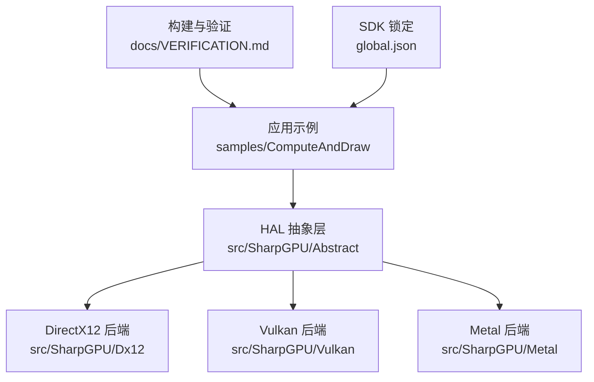
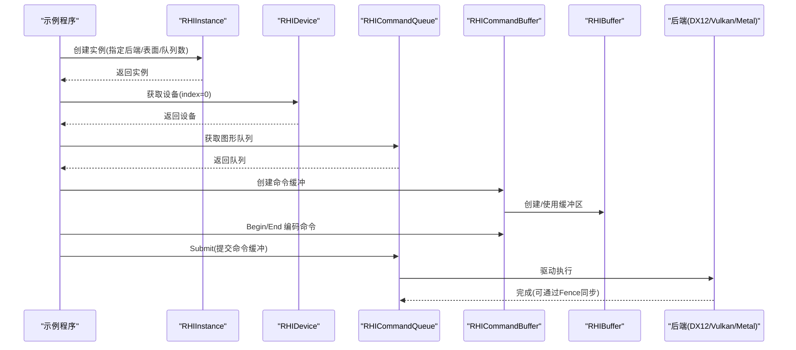
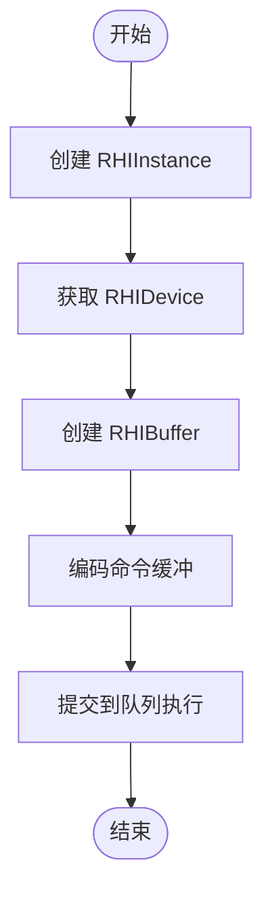
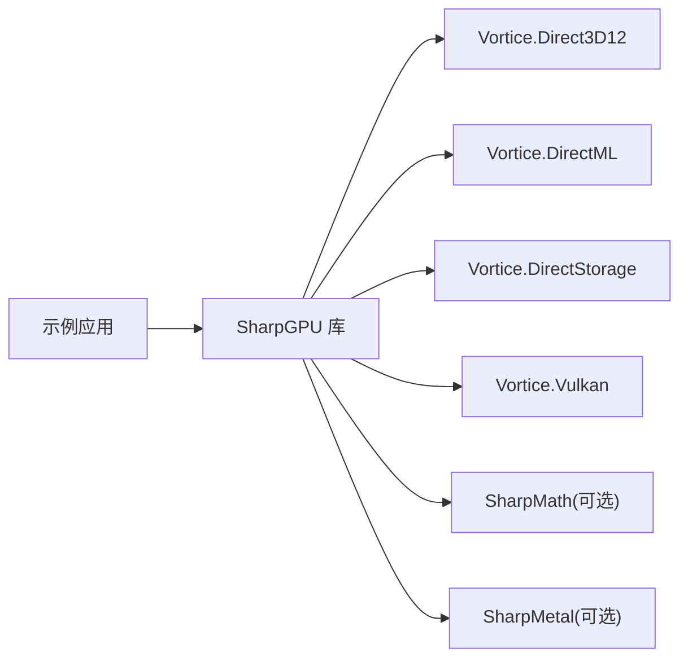

# 快速开始

<cite>
**本文引用的文件**
- [README.md](file://README.md)
- [global.json](file://global.json)
- [docs/VERIFICATION.md](file://docs/VERIFICATION.md)
- [docs/SharpGPU/QuickStart.md](file://docs/SharpGPU/QuickStart.md)
- [docs/SharpGPU/PackageReadme.md](file://docs/SharpGPU/PackageReadme.md)
- [src/SharpGPU/SharpGPU.csproj](file://src/SharpGPU/SharpGPU.csproj)
- [samples/ComputeAndDraw/Program.cs](file://samples/ComputeAndDraw/Program.cs)
- [samples/ComputeAndDraw/ComputeWorkload.cs](file://samples/ComputeAndDraw/ComputeWorkload.cs)
- [samples/ComputeAndDraw/RasterWorkload.cs](file://samples/ComputeAndDraw/RasterWorkload.cs)
- [samples/ComputeAndDraw/ComputeAndDraw.csproj](file://samples/ComputeAndDraw/ComputeAndDraw.csproj)
- [stack.local.props.example](file://stack.local.props.example)
- [src/SharpGPU/Abstract/RHIInstance.cs](file://src/SharpGPU/Abstract/RHIInstance.cs)
- [src/SharpGPU/Abstract/RHIDevice.cs](file://src/SharpGPU/Abstract/RHIDevice.cs)
- [src/SharpGPU/Abstract/RHIBuffer.cs](file://src/SharpGPU/Abstract/RHIBuffer.cs)
- [src/SharpGPU/Common/Builders/RHIDescriptorDefaults.cs](file://src/SharpGPU/Common/Builders/RHIDescriptorDefaults.cs)
</cite>

## 目录
1. [简介](#简介)
2. [项目结构](#项目结构)
3. [核心组件](#核心组件)
4. [架构总览](#架构总览)
5. [详细组件分析](#详细组件分析)
6. [依赖分析](#依赖分析)
7. [性能注意事项](#性能注意事项)
8. [故障排除指南](#故障排除指南)
9. [结论](#结论)
10. [附录](#附录)

## 简介
本快速开始指南帮助你在最短时间内运行第一个 SharpGPU 程序。你将了解：
- 环境要求（.NET SDK 版本）
- 安装与项目配置（源码模式与包模式）
- 基本使用方法（创建实例、设备、缓冲区、命令缓冲、提交执行）
- 配置文件的作用与自定义选项
- 常见问题与排错建议

SharpGPU 是一个面向 DirectX 12、Vulkan 和 Metal 的低层 .NET GPU HAL，提供运行时能力探测与后端实现，并通过示例工程展示计算与光栅化路径。

**章节来源**
- [README.md:1-23](file://README.md#L1-L23)
- [docs/SharpGPU/PackageReadme.md:1-13](file://docs/SharpGPU/PackageReadme.md#L1-L13)

## 项目结构
仓库采用分层组织：
- src/SharpGPU：核心 HAL 抽象与各后端实现（Dx12/Vulkan/Metal）
- samples/ComputeAndDraw：可运行的计算与绘制示例
- docs：构建验证、特性矩阵与快速入门文档
- native：原生资源清单与目标属性
- eng：CI/验证脚本

**图表来源**
- [samples/ComputeAndDraw/Program.cs:1-18](file://samples/ComputeAndDraw/Program.cs#L1-L18)
- [src/SharpGPU/Abstract/RHIInstance.cs:46-156](file://src/SharpGPU/Abstract/RHIInstance.cs#L46-L156)
- [docs/VERIFICATION.md:1-14](file://docs/VERIFICATION.md#L1-L14)
- [global.json:1-8](file://global.json#L1-L8)

**章节来源**
- [README.md:12-16](file://README.md#L12-L16)
- [docs/VERIFICATION.md:1-14](file://docs/VERIFICATION.md#L1-L14)

## 核心组件
- RHIInstance：RHI 入口，负责选择后端并创建实例；提供平台能力检测与工厂方法。
- RHIDevice：设备抽象，暴露队列、资源创建（缓冲区、纹理、查询等）、能力查询与生命周期管理。
- RHIBuffer：GPU/CPU 共享或独占的线性内存块，支持映射/卸载与视图创建。
- 构建器与默认值：RHIDescriptorDefaults 提供常用描述符的便捷构造，简化样板代码。

这些类型共同构成“实例→设备→队列→命令缓冲→资源”的标准工作流。

**章节来源**
- [src/SharpGPU/Abstract/RHIInstance.cs:6-15](file://src/SharpGPU/Abstract/RHIInstance.cs#L6-L15)
- [src/SharpGPU/Abstract/RHIInstance.cs:46-156](file://src/SharpGPU/Abstract/RHIInstance.cs#L46-L156)
- [src/SharpGPU/Abstract/RHIDevice.cs:422-553](file://src/SharpGPU/Abstract/RHIDevice.cs#L422-L553)
- [src/SharpGPU/Abstract/RHIBuffer.cs:6-47](file://src/SharpGPU/Abstract/RHIBuffer.cs#L6-L47)
- [src/SharpGPU/Common/Builders/RHIDescriptorDefaults.cs:6-106](file://src/SharpGPU/Common/Builders/RHIDescriptorDefaults.cs#L6-L106)

## 架构总览
下图展示了从应用到后端的调用链与关键对象关系。

**图表来源**
- [samples/ComputeAndDraw/ComputeWorkload.cs:45-161](file://samples/ComputeAndDraw/ComputeWorkload.cs#L45-L161)
- [samples/ComputeAndDraw/RasterWorkload.cs:37-161](file://samples/ComputeAndDraw/RasterWorkload.cs#L37-L161)
- [src/SharpGPU/Abstract/RHIInstance.cs:122-156](file://src/SharpGPU/Abstract/RHIInstance.cs#L122-L156)
- [src/SharpGPU/Abstract/RHIDevice.cs:527-553](file://src/SharpGPU/Abstract/RHIDevice.cs#L527-L553)

## 详细组件分析

### 环境要求与安装
- .NET SDK：由 global.json 锁定为 10.0.100，启用 latestFeature 滚动但不允许预发行版。
- 推荐先阅读 docs/VERIFICATION.md 中的构建与验证说明，再运行示例。
- 源码开发：复制 stack.local.props.example 为 stack.local.props，按需调整依赖根路径。
- 包消费：设置 StackReferenceMode=Package，并提供包含匹配产品版本的显式 NuGet 源。

**章节来源**
- [global.json:1-8](file://global.json#L1-L8)
- [docs/VERIFICATION.md:1-14](file://docs/VERIFICATION.md#L1-L14)
- [stack.local.props.example:1-12](file://stack.local.props.example#L1-L12)
- [README.md:5-10](file://README.md#L5-L10)

### 项目配置
- 示例工程 ComputeAndDraw.csproj 在 Source 模式下引用本地 SharpGPU 与 SharpShader 项目；在 Package 模式下通过 NuGet 引用对应包。
- 主库 SharpGPU.csproj 目标框架为 net10.0，并定义常量以启用 DX12 后端编译。

**章节来源**
- [samples/ComputeAndDraw/ComputeAndDraw.csproj:1-14](file://samples/ComputeAndDraw/ComputeAndDraw.csproj#L1-L14)
- [src/SharpGPU/SharpGPU.csproj:1-47](file://src/SharpGPU/SharpGPU.csproj#L1-L47)

### 基本使用方法（从零到运行）
以下步骤带你运行第一个示例：
1) 准备环境
- 安装 global.json 指定的 .NET SDK 10.0.100。
- 若进行源码开发，复制 stack.local.props.example 为 stack.local.props 并设置依赖根路径。

2) 选择运行模式
- 源码模式：直接 restore/build 示例工程，无需外部包源。
- 包模式：设置 StackReferenceMode=Package，并确保有包含匹配版本的私有源。

3) 运行示例
- 运行 samples/ComputeAndDraw 示例，它会依次执行计算负载与可选的光栅化负载。
- 示例会探测后端可用性，并在可用时分别运行 DX12 与 Vulkan 路径。

4) 最小传输示例（参考）
- 使用 RHIDescriptorDefaults 创建上传与 GPU 缓冲区，打开传输通道拷贝数据，利用作用域自动结束编码器。

注意：不要在此处粘贴具体代码，请参考以下路径查看完整示例。

**章节来源**
- [samples/ComputeAndDraw/Program.cs:1-18](file://samples/ComputeAndDraw/Program.cs#L1-L18)
- [samples/ComputeAndDraw/ComputeWorkload.cs:45-161](file://samples/ComputeAndDraw/ComputeWorkload.cs#L45-L161)
- [samples/ComputeAndDraw/RasterWorkload.cs:37-161](file://samples/ComputeAndDraw/RasterWorkload.cs#L37-L161)
- [docs/SharpGPU/QuickStart.md:1-31](file://docs/SharpGPU/QuickStart.md#L1-L31)
- [src/SharpGPU/Common/Builders/RHIDescriptorDefaults.cs:77-84](file://src/SharpGPU/Common/Builders/RHIDescriptorDefaults.cs#L77-L84)

### 创建 RHI 实例、设备与缓冲区
- 创建实例：通过 RHIInstance.Create 传入后端、表面类型、队列数量等描述符。
- 获取设备：从实例中取 index=0 的设备。
- 创建缓冲区：使用 RHIDevice.CreateBuffer 与 RHIBufferDescriptor，或通过 RHIDescriptorDefaults.Buffer 简化构造。
- 使用缓冲区：在命令缓冲中编码拷贝/写入，并提交队列执行。

**图表来源**
- [src/SharpGPU/Abstract/RHIInstance.cs:122-156](file://src/SharpGPU/Abstract/RHIInstance.cs#L122-L156)
- [src/SharpGPU/Abstract/RHIDevice.cs:527-553](file://src/SharpGPU/Abstract/RHIDevice.cs#L527-L553)
- [src/SharpGPU/Abstract/RHIBuffer.cs:6-47](file://src/SharpGPU/Abstract/RHIBuffer.cs#L6-L47)

**章节来源**
- [src/SharpGPU/Abstract/RHIInstance.cs:6-15](file://src/SharpGPU/Abstract/RHIInstance.cs#L6-L15)
- [src/SharpGPU/Abstract/RHIDevice.cs:422-553](file://src/SharpGPU/Abstract/RHIDevice.cs#L422-L553)
- [src/SharpGPU/Abstract/RHIBuffer.cs:6-47](file://src/SharpGPU/Abstract/RHIBuffer.cs#L6-L47)
- [src/SharpGPU/Common/Builders/RHIDescriptorDefaults.cs:8-26](file://src/SharpGPU/Common/Builders/RHIDescriptorDefaults.cs#L8-L26)

### 配置文件与自定义选项
- global.json：锁定 .NET SDK 版本与滚动策略，确保一致的开发体验。
- stack.local.props：用于源码模式下的依赖根路径映射（如 SharpMath、SharpMetal、SharpShader 等）。
- 项目文件：ComputeAndDraw.csproj 控制 Source/Package 两种引用方式；SharpGPU.csproj 控制目标框架与后端编译开关。
- 包模式：通过 StackReferenceMode=Package 与显式 NuGet 源消费发布产物。

**章节来源**
- [global.json:1-8](file://global.json#L1-L8)
- [stack.local.props.example:1-12](file://stack.local.props.example#L1-L12)
- [samples/ComputeAndDraw/ComputeAndDraw.csproj:1-14](file://samples/ComputeAndDraw/ComputeAndDraw.csproj#L1-L14)
- [src/SharpGPU/SharpGPU.csproj:1-47](file://src/SharpGPU/SharpGPU.csproj#L1-L47)

## 依赖分析
- 运行时依赖：.NET 10 运行时；Windows 上需要 DirectX 12 相关运行时；Linux/macOS/iOS 需对应 Vulkan/Metal 环境。
- 构建期依赖：Vortice.Windows 子模块（DX12/DirectML/DirectStorage），以及可选的 SharpMath/SharpMetal（源码模式）。
- 包内资源：特性矩阵与原生资产清单嵌入为资源，便于运行时自检与部署。

**图表来源**
- [src/SharpGPU/SharpGPU.csproj:15-29](file://src/SharpGPU/SharpGPU.csproj#L15-L29)
- [src/SharpGPU/SharpGPU.csproj:30-46](file://src/SharpGPU/SharpGPU.csproj#L30-L46)

**章节来源**
- [src/SharpGPU/SharpGPU.csproj:1-47](file://src/SharpGPU/SharpGPU.csproj#L1-L47)
- [docs/VERIFICATION.md:66-94](file://docs/VERIFICATION.md#L66-L94)

## 性能注意事项
- 合理使用存储模式：上传用 HostUpload，GPU 侧读写用 GPULocal，读回用 Readback，避免不必要的跨域拷贝。
- 明确 UsageFlag：仅声明需要的用途位，减少驱动状态切换与布局转换开销。
- 批量化命令：尽量合并小操作，减少 Pass 边界与屏障次数。
- 使用查询统计：通过管线统计查询评估绘制/计算阶段瓶颈。

[本节为通用指导，不直接分析具体文件]

## 故障排除指南
- 无法选择后端或平台不支持
  - 现象：IsBackendSupported 返回 false 或抛出 NotSupportedException。
  - 原因：当前平台不支持所选后端（例如 Windows 以外尝试 DX12）。
  - 处理：根据平台选择合适后端，或使用 GetBackendByPlatform 自动选择。

- 未找到设备或无可用队列
  - 现象：DeviceCount 为 0 或 GetCommandQueue 返回 null。
  - 处理：检查 SurfaceKind 与队列请求数量；确认驱动与系统组件已正确安装。

- 命令缓冲提交失败或 Fence 等待卡住
  - 现象：提交后无输出或等待超时。
  - 处理：检查命令编码是否成对 Begin/End；确认屏障与访问掩码正确；必要时启用调试层与验证层定位问题。

- 读取结果不正确
  - 现象：读回数据与预期不符。
  - 处理：确保在提交并等待 Fence 后再 Map 读回；核对缓冲区大小、偏移与步长。

- 包模式无法恢复或运行
  - 现象：NuGet 还原失败或运行时找不到原生 DLL。
  - 处理：使用显式包源与隔离缓存；确保 RID 与目标平台一致；按 docs/VERIFICATION.md 的隔离验证流程复现。

**章节来源**
- [src/SharpGPU/Abstract/RHIInstance.cs:59-120](file://src/SharpGPU/Abstract/RHIInstance.cs#L59-L120)
- [samples/ComputeAndDraw/ComputeWorkload.cs:45-161](file://samples/ComputeAndDraw/ComputeWorkload.cs#L45-L161)
- [samples/ComputeAndDraw/RasterWorkload.cs:37-161](file://samples/ComputeAndDraw/RasterWorkload.cs#L37-L161)
- [docs/VERIFICATION.md:95-134](file://docs/VERIFICATION.md#L95-L134)

## 结论
通过本指南，你应能：
- 安装正确的 .NET SDK 并完成源码或包模式配置
- 运行 ComputeAndDraw 示例，理解实例、设备、队列、命令缓冲与缓冲区的基本用法
- 借助默认构建器简化常见描述符的创建
- 遇到平台或环境问题时有明确的排查方向

如需进一步了解能力矩阵与验证流程，请查阅 docs/SharpGPU/FeatureMatrix.md 与 docs/VERIFICATION.md。

[本节为总结性内容，不直接分析具体文件]

## 附录
- 最小传输示例参考路径：docs/SharpGPU/QuickStart.md
- 示例入口与后端探测：samples/ComputeAndDraw/Program.cs
- 计算负载完整流程：samples/ComputeAndDraw/ComputeWorkload.cs
- 光栅化负载完整流程：samples/ComputeAndDraw/RasterWorkload.cs
- 构建与验证权威说明：docs/VERIFICATION.md

**章节来源**
- [docs/SharpGPU/QuickStart.md:1-31](file://docs/SharpGPU/QuickStart.md#L1-L31)
- [samples/ComputeAndDraw/Program.cs:1-18](file://samples/ComputeAndDraw/Program.cs#L1-L18)
- [samples/ComputeAndDraw/ComputeWorkload.cs:45-161](file://samples/ComputeAndDraw/ComputeWorkload.cs#L45-L161)
- [samples/ComputeAndDraw/RasterWorkload.cs:37-161](file://samples/ComputeAndDraw/RasterWorkload.cs#L37-L161)
- [docs/VERIFICATION.md:1-14](file://docs/VERIFICATION.md#L1-L14)