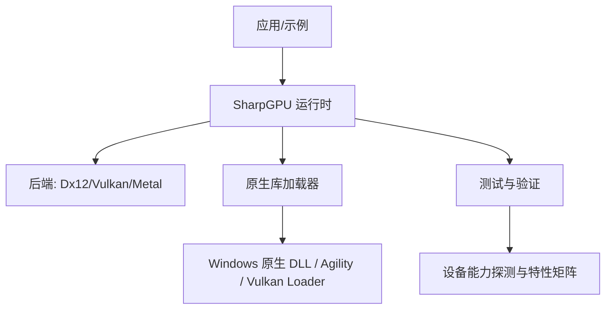
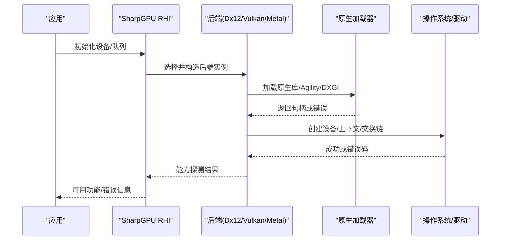
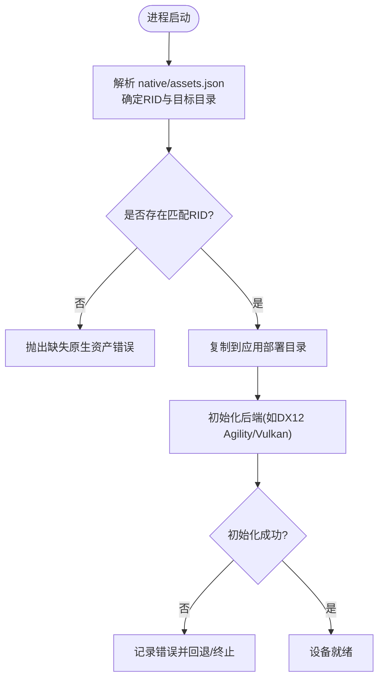
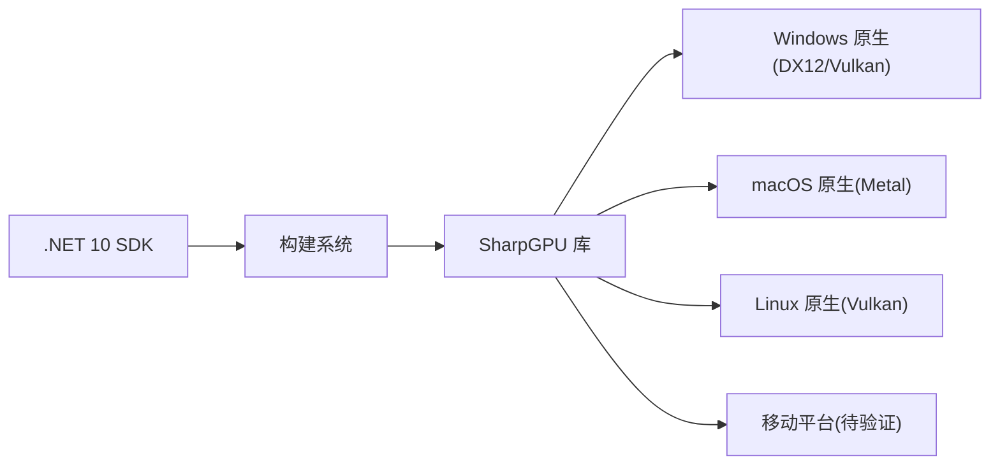

# 故障排除

<cite>
**本文引用的文件**
- [README.md](file://README.md)
- [DESIGN.md](file://DESIGN.md)
- [AGENTS.md](file://AGENTS.md)
- [global.json](file://global.json)
- [Directory.Build.props](file://Directory.Build.props)
- [stack.local.props.example](file://stack.local.props.example)
- [docs/VERIFICATION.md](file://docs/VERIFICATION.md)
- [docs/SharpGPU/QuickStart.md](file://docs/SharpGPU/QuickStart.md)
- [docs/SharpGPU/PackageReadme.md](file://docs/SharpGPU/PackageReadme.md)
- [native/assets.json](file://native/assets.json)
- [src/SharpGPU/Common/SharpGpuNativeLibraries.cs](file://src/SharpGPU/Common/SharpGpuNativeLibraries.cs)
- [tests/SharpGPU.Conformance.Tests/NativeLibraryConfigurationTests.cs](file://tests/SharpGPU.Conformance.Tests/NativeLibraryConfigurationTests.cs)
</cite>

## 目录
1. [简介](#简介)
2. [项目结构](#项目结构)
3. [核心组件](#核心组件)
4. [架构总览](#架构总览)
5. [详细组件分析](#详细组件分析)
6. [依赖关系分析](#依赖关系分析)
7. [性能注意事项](#性能注意事项)
8. [故障排除指南](#故障排除指南)
9. [结论](#结论)
10. [附录](#附录)

## 简介
本指南面向使用 SharpGPU 的开发者与运维人员，聚焦环境配置、编译构建、运行时异常、性能问题与平台差异等常见故障的诊断与修复。内容基于仓库中的构建验证文档、设计说明与测试用例，提供可操作的步骤、日志定位方法与预防措施，并给出社区支持与贡献指引。

## 项目结构
- 源码位于 src/SharpGPU，按后端（Dx12、Vulkan、Metal）与抽象接口分层组织；公共能力在 Common 下。
- 测试位于 tests/SharpGPU.Conformance.Tests，覆盖设备能力探测、原生库加载、管道缓存、DirectML/DirectStorage 等。
- 构建与验证脚本位于 eng/，权威命令与平台边界见 docs/VERIFICATION.md。
- 原生资产清单位于 native/assets.json，包内资源与部署布局由构建系统管理。
- 全局 SDK 版本锁定在 global.json；MSBuild 输出路径、锁文件模式与本地映射在 Directory.Build.props 与 stack.local.props.example。

图表来源
- [docs/VERIFICATION.md:136-144](file://docs/VERIFICATION.md#L136-L144)
- [DESIGN.md:11-16](file://DESIGN.md#L11-L16)

章节来源
- [README.md:12-16](file://README.md#L12-L16)
- [docs/VERIFICATION.md:15-48](file://docs/VERIFICATION.md#L15-L48)
- [Directory.Build.props:1-24](file://Directory.Build.props#L1-L24)

## 核心组件
- RHI 抽象与后端实现：统一 GPU 抽象，具体后端为 Dx12、Vulkan、Metal。
- 原生库加载与部署：通过内置加载逻辑与 native/assets.json 管理 RID 相关原生文件；Windows 使用扩展路径加载以避免长路径限制。
- 构建与验证：Source/Package 双模式，严格锁文件与隔离产物；CI 与本地验证命令在 docs/VERIFICATION.md。
- 能力探测与特性矩阵：运行时探测设备能力，未支持功能显式失败而非静默降级。

章节来源
- [docs/SharpGPU/PackageReadme.md:1-12](file://docs/SharpGPU/PackageReadme.md#L1-L12)
- [DESIGN.md:5-16](file://DESIGN.md#L5-L16)
- [docs/VERIFICATION.md:66-134](file://docs/VERIFICATION.md#L66-L134)

## 架构总览
下图展示从应用到后端的调用链与关键故障点：应用创建设备与队列，选择后端；原生层负责 DLL 加载与 Agility/Vulkan 初始化；测试与验证用于回归与能力确认。

图表来源
- [DESIGN.md:11-16](file://DESIGN.md#L11-L16)
- [docs/VERIFICATION.md:162-190](file://docs/VERIFICATION.md#L162-L190)

## 详细组件分析

### 原生库加载与部署
- Windows 原生 DLL 加载使用扩展长度路径，避免深目录导致的加载失败。
- native/assets.json 记录原生输入与部署目标；包中包含 runtimes/<rid>/native 下的文件。
- 测试包含对原生库配置的断言，确保加载顺序、路径与依赖正确。

图表来源
- [docs/VERIFICATION.md:252-269](file://docs/VERIFICATION.md#L252-L269)
- [docs/VERIFICATION.md:66-94](file://docs/VERIFICATION.md#L66-L94)

章节来源
- [docs/VERIFICATION.md:252-269](file://docs/VERIFICATION.md#L252-L269)
- [docs/VERIFICATION.md:66-94](file://docs/VERIFICATION.md#L66-L94)
- [tests/SharpGPU.Conformance.Tests/NativeLibraryConfigurationTests.cs](file://tests/SharpGPU.Conformance.Tests/NativeLibraryConfigurationTests.cs)

### DX12 Agility 路径与 UTF-8 处理
- DX12 需要应用 D3D12 目录存在且 UTF-8 路径正确；缺失会显式失败。
- 包与源引用均部署所需 Agility 文件；中文/emoji 路径与 C:/Windows 工作目录场景已验证。

章节来源
- [DESIGN.md:11-12](file://DESIGN.md#L11-L12)
- [docs/VERIFICATION.md:162-190](file://docs/VERIFICATION.md#L162-L190)

### 能力探测与特性矩阵
- 运行时探测设备能力，未支持特性必须显式失败，禁止静默降级。
- FeatureMatrix 定义公开契约；测试覆盖能力报告写入与校验。

章节来源
- [docs/SharpGPU/PackageReadme.md:1-12](file://docs/SharpGPU/PackageReadme.md#L1-L12)
- [docs/VERIFICATION.md:225-231](file://docs/VERIFICATION.md#L225-L231)

### 快速开始与最小复现
- 使用 QuickStart 的最小示例进行基础连通性验证：创建缓冲、开启传输通道、复制数据、结束作用域。
- 若该示例失败，优先检查 .NET SDK、RID、原生资产与后端可用性。

章节来源
- [docs/SharpGPU/QuickStart.md:1-31](file://docs/SharpGPU/QuickStart.md#L1-L31)

## 依赖关系分析
- 构建依赖：.NET 10 SDK（global.json），Source/Package 两种模式，锁文件隔离。
- 运行依赖：Windows x64 为主流宿主；macOS ARM64 需 Metal；Linux 需 Vulkan loader；移动端需各自原生表面与打包工程。
- 第三方绑定：维护 Vortice.Windows 绑定与补丁；Vulkan 绑定固定版本以确保 ABI 稳定。

图表来源
- [global.json:1-8](file://global.json#L1-L8)
- [docs/VERIFICATION.md:136-144](file://docs/VERIFICATION.md#L136-L144)
- [docs/VERIFICATION.md:66-74](file://docs/VERIFICATION.md#L66-L74)

章节来源
- [global.json:1-8](file://global.json#L1-L8)
- [Directory.Build.props:1-24](file://Directory.Build.props#L1-L24)
- [docs/VERIFICATION.md:136-144](file://docs/VERIFICATION.md#L136-L144)

## 性能注意事项
- 使用 scoped pass 与正确的 barrier 减少同步开销。
- 合理设置缓冲区用途与存储模式，避免不必要的内存拷贝。
- 利用管道缓存降低着色器编译成本。
- 在基准测试中关注 warmup 与迭代次数，避免冷启动偏差。

[本节为通用指导，不直接分析具体文件]

## 故障排除指南

### 环境与安装问题
- .NET SDK 版本不匹配
  - 现象：构建失败或无法识别目标框架。
  - 诊断：检查 global.json 指定的 SDK 版本。
  - 解决：安装匹配的 .NET 10 SDK。
- Source/Package 模式混用
  - 现象：依赖解析冲突或运行时找不到正确程序集。
  - 诊断：确认 StackReferenceMode 一致；不要混合项目引用与包。
  - 解决：统一为 Source 或 Package 模式，并使用对应锁文件。
- 本地映射未生效
  - 现象：构建时找不到依赖根路径。
  - 诊断：检查 stack.local.props 是否被导入；属性名与路径是否正确。
  - 解决：复制 stack.local.props.example 为 stack.local.props 并调整路径。

章节来源
- [global.json:1-8](file://global.json#L1-L8)
- [Directory.Build.props:1-24](file://Directory.Build.props#L1-L24)
- [stack.local.props.example:1-12](file://stack.local.props.example#L1-L12)

### 构建与打包问题
- 锁文件不一致
  - 现象：还原失败或行为与预期不符。
  - 诊断：对比 packages.<StackReferenceMode>.<RID-or-portable>.lock.json 哈希。
  - 解决：使用 RestoreLockedMode=true 并重新生成锁文件。
- 包内容不完整
  - 现象：运行时报缺少原生文件或许可证。
  - 诊断：检查包内 runtimes/<rid>/native 与 ThirdPartyNotices。
  - 解决：重新 pack，确保 RID 与平台匹配；发布时保留通知文件。

章节来源
- [docs/VERIFICATION.md:318-350](file://docs/VERIFICATION.md#L318-L350)
- [docs/VERIFICATION.md:352-369](file://docs/VERIFICATION.md#L352-L369)

### 运行时异常
- 原生库加载失败（长路径）
  - 现象：加载 dstoragecore.dll 或其他原生 DLL 失败。
  - 诊断：查看是否处于深层目录；检查原生加载器是否使用扩展路径。
  - 解决：保持当前加载逻辑；避免将旧版包放入全局缓存干扰。
- DX12 Agility 缺失或路径非 UTF-8
  - 现象：设备工厂初始化失败。
  - 诊断：确认应用 D3D12 目录存在且路径为 UTF-8。
  - 解决：部署 Agility 文件；从非中文/emoji 目录运行以隔离问题。
- 能力不支持导致显式失败
  - 现象：某些特性不可用，API 返回错误或跳过。
  - 诊断：查看能力报告与特性矩阵；确认设备支持。
  - 解决：降级功能或使用支持的设备；不要期望静默降级。

章节来源
- [docs/VERIFICATION.md:252-269](file://docs/VERIFICATION.md#L252-L269)
- [docs/VERIFICATION.md:162-190](file://docs/VERIFICATION.md#L162-L190)
- [docs/SharpGPU/PackageReadme.md:1-12](file://docs/SharpGPU/PackageReadme.md#L1-L12)

### 性能问题
- 频繁重建管道
  - 现象：首帧卡顿或延迟高。
  - 诊断：检查是否启用管道缓存；观察编译次数。
  - 解决：启用并持久化管道缓存；减少无关状态变更。
- 不当的资源生命周期
  - 现象：内存泄漏或 GPU 同步等待。
  - 诊断：使用 scoped pass 与正确 barrier；监控命令提交与完成。
  - 解决：遵循最小作用域原则；避免跨帧持有临时资源。

[本节为通用指导，不直接分析具体文件]

### 调试工具与日志分析
- 使用 conformance 测试作为最小复现入口
  - 执行完整测试矩阵，观察 TRX 结果与日志位置。
  - 针对失败用例缩小范围，逐步注释代码定位问题。
- 特征报告
  - 查看应用输出目录下的 feature-report JSON，确认设备能力与平台信息。
- 原生加载与部署
  - 核对 native/assets.json 与实际部署目录；比较包内条目与应用侧文件。

章节来源
- [docs/VERIFICATION.md:225-231](file://docs/VERIFICATION.md#L225-L231)
- [docs/VERIFICATION.md:66-94](file://docs/VERIFICATION.md#L66-L94)

### 平台特定问题
- Windows x64
  - 主要合格平台；注意 Agility 与原生 DLL 部署。
- macOS ARM64
  - 需 Metal 绑定与原生资源测试；系统框架由 OS 提供。
- Linux
  - 需 Vulkan loader/设备测试；不同发行版可能存在差异。
- Android/iOS
  - 需要各自原生表面与打包工程；当前标记为未验证。

章节来源
- [docs/VERIFICATION.md:136-144](file://docs/VERIFICATION.md#L136-L144)

### 常见问题速查表
- 构建失败
  - 检查 .NET SDK 版本、Source/Package 模式、锁文件一致性。
- 运行时报缺原生文件
  - 检查 RID 与 runtimes/<rid>/native；确认包内容与部署目录。
- DX12 初始化失败
  - 确认应用 D3D12 目录与 UTF-8 路径；避免中文/emoji 路径。
- 功能不可用
  - 查看能力报告与特性矩阵；使用支持的设备或降级功能。
- 性能退化
  - 启用管道缓存；优化屏障与资源生命周期；减少不必要拷贝。

[本节为通用指导，不直接分析具体文件]

### 社区支持与贡献
- 阅读 AGENTS.md 了解贡献规则与产品边界。
- 参考 DESIGN.md 理解架构与职责划分。
- 使用 docs/VERIFICATION.md 的命令进行独立验证与回归。
- 提交问题时附带：SDK 版本、平台、RID、Source/Package 模式、锁文件哈希、TRX 结果与 feature-report。

章节来源
- [AGENTS.md:1-33](file://AGENTS.md#L1-L33)
- [DESIGN.md:1-33](file://DESIGN.md#L1-L33)
- [docs/VERIFICATION.md:15-48](file://docs/VERIFICATION.md#L15-L48)

## 结论
SharpGPU 的故障排除应以“能力显式失败、原生边界清晰、构建与验证可重现”为核心原则。遇到环境问题优先核对 SDK 与模式；遇到运行时问题优先检查原生加载与 DX12/Vulkan 初始化；性能问题从缓存与生命周期入手。借助 conformance 测试与特征报告，可快速定位与复现问题。

## 附录
- 快速开始示例路径：[docs/SharpGPU/QuickStart.md](file://docs/SharpGPU/QuickStart.md)
- 权威构建与验证命令：[docs/VERIFICATION.md](file://docs/VERIFICATION.md)
- 原生资产清单：[native/assets.json](file://native/assets.json)
- 全局 SDK 锁定：[global.json](file://global.json)
- MSBuild 输出与锁文件策略：[Directory.Build.props](file://Directory.Build.props)
- 本地映射模板：[stack.local.props.example](file://stack.local.props.example)