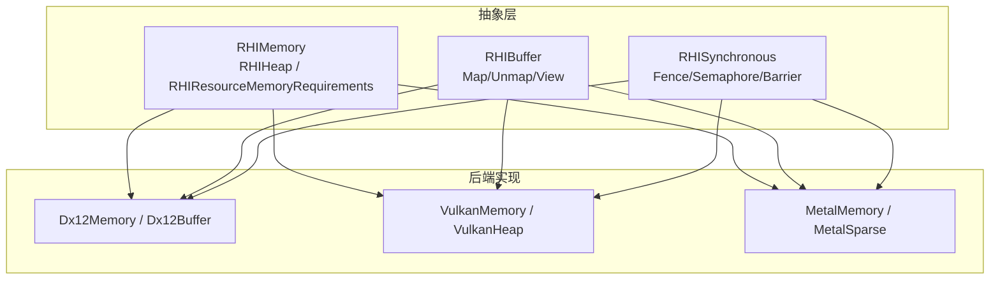
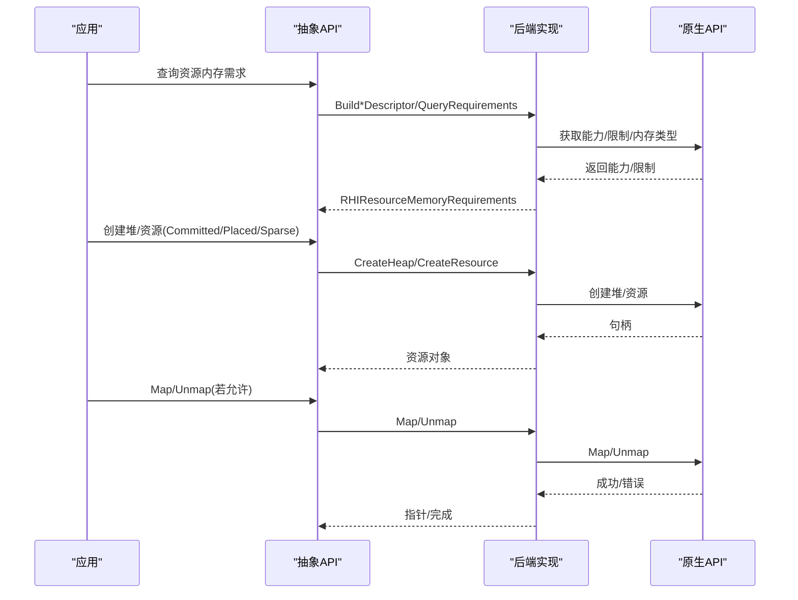
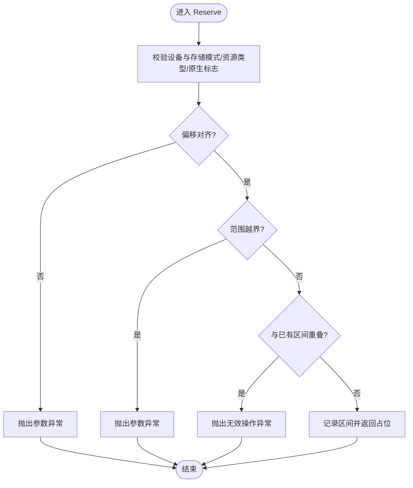
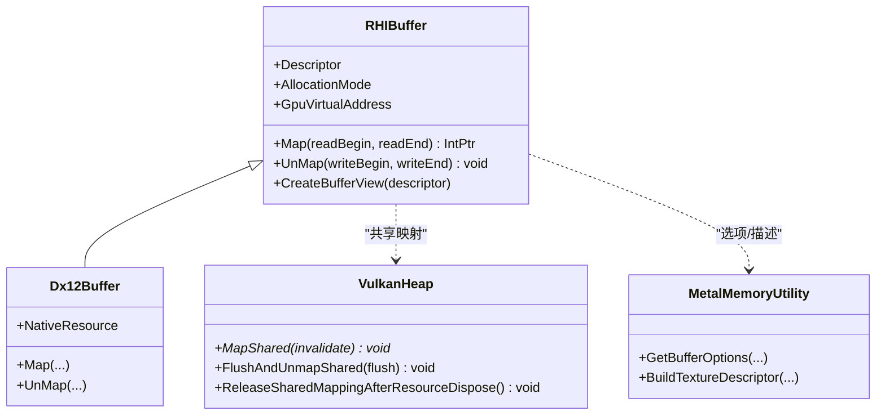
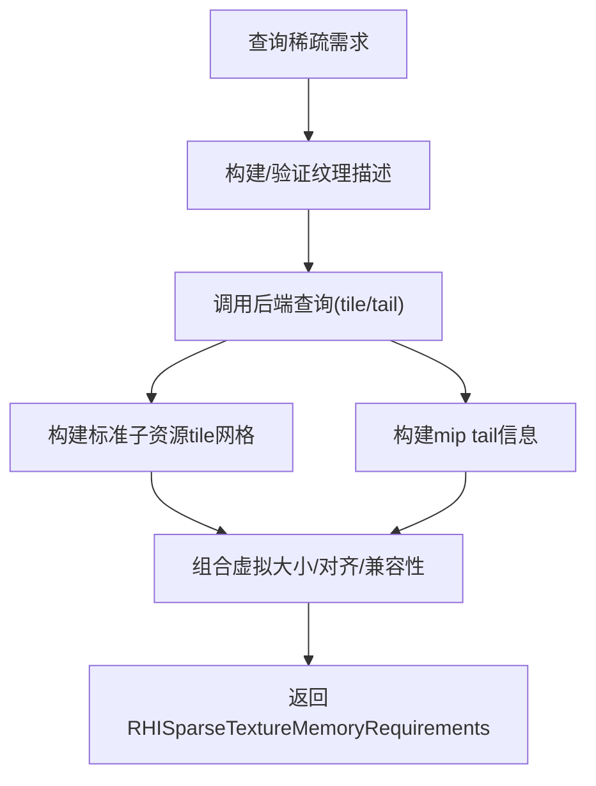
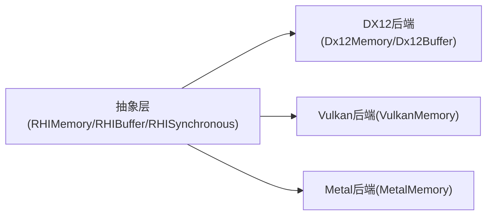

# 内存模型

<cite>
**本文引用的文件**
- [RHIMemory.cs](file://src/SharpGPU/Abstract/RHIMemory.cs)
- [RHIBuffer.cs](file://src/SharpGPU/Abstract/RHIBuffer.cs)
- [RHISynchronous.cs](file://src/SharpGPU/Abstract/RHISynchronous.cs)
- [Dx12Memory.cs](file://src/SharpGPU/Dx12/Dx12Memory.cs)
- [Dx12Buffer.cs](file://src/SharpGPU/Dx12/Dx12Buffer.cs)
- [VulkanMemory.cs](file://src/SharpGPU/Vulkan/VulkanMemory.cs)
- [MetalMemory.cs](file://src/SharpGPU/Metal/MetalMemory.cs)
- [SharpGpuMemoryMechanismTests.cs](file://tests/SharpGPU.Conformance.Tests/SharpGpuMemoryMechanismTests.cs)
</cite>

## 目录
1. [简介](#简介)
2. [项目结构](#项目结构)
3. [核心组件](#核心组件)
4. [架构总览](#架构总览)
5. [详细组件分析](#详细组件分析)
6. [依赖关系分析](#依赖关系分析)
7. [性能考量](#性能考量)
8. [故障排查指南](#故障排查指南)
9. [结论](#结论)
10. [附录：最佳实践与示例路径](#附录最佳实践与示例路径)

## 简介
本文件系统性阐述 SharpGPU 的内存模型，覆盖 CPU-GPU 内存架构、内存分配策略（提交式、放置式、稀疏、外部）、同步机制（栅栏、信号量、屏障）、缓冲区管理、内存映射、数据上传下载、不同后端（DX12、Vulkan、Metal）的内存类型与访问权限、对齐要求、缓存一致性、异步传输等主题。文档同时提供常见操作的最佳实践与代码片段路径，帮助读者在跨后端环境下正确高效地使用内存资源。

## 项目结构
SharpGPU 将内存抽象集中在 Abstract 层，具体后端实现位于 Dx12、Vulkan、Metal 子目录；同步原语（栅栏、信号量、屏障）亦定义于 Abstract 层，供各后端复用。测试用例覆盖堆放置、稀疏纹理等关键行为。



图表来源
- [RHIMemory.cs:23-116](file://src/SharpGPU/Abstract/RHIMemory.cs#L23-L116)
- [RHIBuffer.cs:6-47](file://src/SharpGPU/Abstract/RHIBuffer.cs#L6-L47)
- [RHISynchronous.cs:14-176](file://src/SharpGPU/Abstract/RHISynchronous.cs#L14-L176)
- [Dx12Memory.cs:7-124](file://src/SharpGPU/Dx12/Dx12Memory.cs#L7-L124)
- [Dx12Buffer.cs:8-147](file://src/SharpGPU/Dx12/Dx12Buffer.cs#L8-L147)
- [VulkanMemory.cs:7-127](file://src/SharpGPU/Vulkan/VulkanMemory.cs#L7-L127)
- [MetalMemory.cs:8-87](file://src/SharpGPU/Metal/MetalMemory.cs#L8-L87)

章节来源
- [RHIMemory.cs:23-116](file://src/SharpGPU/Abstract/RHIMemory.cs#L23-L116)
- [RHIBuffer.cs:6-47](file://src/SharpGPU/Abstract/RHIBuffer.cs#L6-L47)
- [RHISynchronous.cs:14-176](file://src/SharpGPU/Abstract/RHISynchronous.cs#L14-L176)

## 核心组件
- 资源内存需求与堆
  - RHIResourceMemoryRequirements：描述资源所需大小、对齐、存储模式及兼容性掩码，强制对齐为2的幂且非零。
  - RHIHeapDescription：基于资源需求创建堆，校验堆大小与对齐。
  - RHIHeap：封装原生内存分配，维护已放置资源的占用区间，防止重叠与越界，支持稀疏纹理范围校验。
- 缓冲区
  - RHIBuffer：统一 Map/Unmap 接口与视图创建；GPULocal 不可映射。
- 同步
  - RHIFence/RHISemaphore：二进制同步原语，状态机保证安全使用。
  - 屏障：全局/缓冲/纹理三种，指定阶段与访问位，支持队列所有权转移。

章节来源
- [RHIMemory.cs:23-116](file://src/SharpGPU/Abstract/RHIMemory.cs#L23-L116)
- [RHIMemory.cs:173-333](file://src/SharpGPU/Abstract/RHIMemory.cs#L173-L333)
- [RHIBuffer.cs:6-47](file://src/SharpGPU/Abstract/RHIBuffer.cs#L6-L47)
- [RHISynchronous.cs:14-176](file://src/SharpGPU/Abstract/RHISynchronous.cs#L14-L176)
- [RHISynchronous.cs:282-510](file://src/SharpGPU/Abstract/RHISynchronous.cs#L282-L510)

## 架构总览
SharpGPU 通过“抽象 + 后端”的方式屏蔽底层差异：
- 抽象层定义统一的内存需求、堆、缓冲区、同步语义。
- 后端层将抽象语义映射到 DX12 Heap/Resource、Vulkan Memory/Image、Metal Texture/Placement Sparse。
- 所有内存分配与映射均受严格校验（对齐、范围、设备亲和性、存储模式）。



图表来源
- [Dx12Memory.cs:13-124](file://src/SharpGPU/Dx12/Dx12Memory.cs#L13-L124)
- [VulkanMemory.cs:9-127](file://src/SharpGPU/Vulkan/VulkanMemory.cs#L9-L127)
- [MetalMemory.cs:10-87](file://src/SharpGPU/Metal/MetalMemory.cs#L10-L87)
- [Dx12Buffer.cs:37-147](file://src/SharpGPU/Dx12/Dx12Buffer.cs#L37-L147)
- [VulkanMemory.cs:539-728](file://src/SharpGPU/Vulkan/VulkanMemory.cs#L539-L728)

## 详细组件分析

### 内存需求与堆（RHIResourceMemoryRequirements / RHIHeap）
- 设计要点
  - 资源需求包含 Size、Alignment、StorageMode、CompatibilityMask，并校验对齐为2的幂、Size>0、Mask非空。
  - 堆描述必须来自同一设备的资源需求，且堆大小需满足对齐与最小尺寸。
  - 堆内部维护放置区间注册表，禁止重叠、越界，并在销毁前检查是否仍有活跃放置。
- 复杂度
  - Reserve 区间插入与冲突检测为 O(n)，n 为当前活跃放置数；通常较小。
- 错误处理
  - 非法对齐、越界、设备不匹配、原生标志不兼容等均抛出明确异常。
- 稀疏纹理
  - ValidateSparseSpan 仅用于纹理，校验偏移/大小对齐、不溢出堆空间，并要求资源类型为纹理。



图表来源
- [RHIMemory.cs:218-333](file://src/SharpGPU/Abstract/RHIMemory.cs#L218-L333)
- [RHIMemory.cs:353-457](file://src/SharpGPU/Abstract/RHIMemory.cs#L353-L457)

章节来源
- [RHIMemory.cs:23-116](file://src/SharpGPU/Abstract/RHIMemory.cs#L23-L116)
- [RHIMemory.cs:173-333](file://src/SharpGPU/Abstract/RHIMemory.cs#L173-L333)
- [RHIMemory.cs:353-457](file://src/SharpGPU/Abstract/RHIMemory.cs#L353-L457)
- [SharpGpuMemoryMechanismTests.cs:16-81](file://tests/SharpGPU.Conformance.Tests/SharpGpuMemoryMechanismTests.cs#L16-L81)

### 缓冲区与映射（RHIBuffer / 后端实现）
- 通用规则
  - GPULocal 缓冲区不可映射；Map/Unmap 需传入有效读写范围。
  - 视图创建由后端实现。
- DX12
  - Committed 资源直接创建；Placed 资源绑定到堆偏移；External 资源包装已有句柄。
  - Map/Unmap 调用原生 Map/Unmap，并校验范围。
- Vulkan
  - 共享映射通过 vkMapMemory 实现，带引用计数与刷新/失效控制。
  - 释放时确保先 Unmap 再 FreeMemory。
- Metal
  - 通过 MTLResourceOptions 与 StorageMode 控制缓存行为；CPU 上传模式使用 WriteCombined。



图表来源
- [RHIBuffer.cs:6-47](file://src/SharpGPU/Abstract/RHIBuffer.cs#L6-L47)
- [Dx12Buffer.cs:8-147](file://src/SharpGPU/Dx12/Dx12Buffer.cs#L8-L147)
- [VulkanMemory.cs:539-728](file://src/SharpGPU/Vulkan/VulkanMemory.cs#L539-L728)
- [MetalMemory.cs:8-87](file://src/SharpGPU/Metal/MetalMemory.cs#L8-L87)

章节来源
- [RHIBuffer.cs:6-47](file://src/SharpGPU/Abstract/RHIBuffer.cs#L6-L47)
- [Dx12Buffer.cs:37-147](file://src/SharpGPU/Dx12/Dx12Buffer.cs#L37-L147)
- [VulkanMemory.cs:539-728](file://src/SharpGPU/Vulkan/VulkanMemory.cs#L539-L728)
- [MetalMemory.cs:8-87](file://src/SharpGPU/Metal/MetalMemory.cs#L8-L87)

### 同步机制（栅栏、信号量、屏障）
- 栅栏（RHIFence）
  - 状态机：Ready -> Pending -> Signaled -> Resetting -> Ready，避免重复提交与未提交等待。
  - 提供 Wait(timeout)、Reset、标记完成等方法。
- 信号量（RHISemaphore）
  - 二元信号量，Reserve/Commit/Rollback 成对使用，保障提交顺序。
- 屏障（RHIBarrier）
  - 支持全局、缓冲、纹理三类；可指定源/目的队列进行所有权转移。
  - 自动推断纹理 aspect（颜色/深度/模板），并提供全范围构造器。

```mermaid
stateDiagram-v2
[*] --> Ready
Ready --> Pending : "ReserveSignal"
Pending --> Signaled : "MarkSignaled"
Signaled --> Resetting : "Reset"
Resetting --> Ready : "CompleteReset"
Note over Ready,Resetting : 状态转换受互斥保护，避免并发冲突
```

图表来源
- [RHISynchronous.cs:14-176](file://src/SharpGPU/Abstract/RHISynchronous.cs#L14-L176)
- [RHISynchronous.cs:178-280](file://src/SharpGPU/Abstract/RHISynchronous.cs#L178-L280)
- [RHISynchronous.cs:282-510](file://src/SharpGPU/Abstract/RHISynchronous.cs#L282-L510)

章节来源
- [RHISynchronous.cs:14-176](file://src/SharpGPU/Abstract/RHISynchronous.cs#L14-L176)
- [RHISynchronous.cs:178-280](file://src/SharpGPU/Abstract/RHISynchronous.cs#L178-L280)
- [RHISynchronous.cs:282-510](file://src/SharpGPU/Abstract/RHISynchronous.cs#L282-L510)

### 后端内存类型与特性
- DX12
  - 堆类型由存储模式决定；资源类分为 Buffer、RenderTarget 纹理、非渲染目标纹理三类，通过兼容性掩码选择。
  - 纹理要求 GPU-local；不支持 memoryless。
- Vulkan
  - 通过内存属性过滤出符合存储模式的内存类型；memoryless 仅适用于图像。
  - 预算查询通过 VK_EXT_memory_budget，聚合所选堆的预算与使用。
- Metal
  - 通过 StorageMode 与 CpuCacheMode 控制缓存策略；上传模式使用 WriteCombined。
  - Placement Sparse 纹理以固定页大小（如 16KB）为单位，查询 tile 几何与尾部分区。

章节来源
- [Dx12Memory.cs:73-124](file://src/SharpGPU/Dx12/Dx12Memory.cs#L73-L124)
- [VulkanMemory.cs:92-127](file://src/SharpGPU/Vulkan/VulkanMemory.cs#L92-L127)
- [VulkanMemory.cs:376-533](file://src/SharpGPU/Vulkan/VulkanMemory.cs#L376-L533)
- [MetalMemory.cs:10-87](file://src/SharpGPU/Metal/MetalMemory.cs#L10-L87)

### 稀疏纹理与分块映射
- 抽象层
  - RHISparseTextureMemoryRequirements 描述虚拟大小、tile 大小/extent、heap 兼容性、标准子资源 tile 网格与 mip tail。
  - 校验子资源无重复、mip tail 对齐且不重叠。
- 后端实现
  - DX12：查询 SubresourceTiling 与 PackedMipInfo，计算 tile 数量与尾部分区。
  - Vulkan：vkGetImageSparseMemoryRequirements 获取粒度与 mip tail，按层/层级构建 tile 网格。
  - Metal：查询 SparseTileSizeInBytes 与 FirstMipmapInTail，构建标准与尾部区域。



图表来源
- [RHIMemory.cs:515-748](file://src/SharpGPU/Abstract/RHIMemory.cs#L515-L748)
- [Dx12Memory.cs:191-302](file://src/SharpGPU/Dx12/Dx12Memory.cs#L191-L302)
- [VulkanMemory.cs:206-359](file://src/SharpGPU/Vulkan/VulkanMemory.cs#L206-L359)
- [MetalMemory.cs:219-341](file://src/SharpGPU/Metal/MetalMemory.cs#L219-L341)

章节来源
- [RHIMemory.cs:515-748](file://src/SharpGPU/Abstract/RHIMemory.cs#L515-L748)
- [Dx12Memory.cs:191-302](file://src/SharpGPU/Dx12/Dx12Memory.cs#L191-L302)
- [VulkanMemory.cs:206-359](file://src/SharpGPU/Vulkan/VulkanMemory.cs#L206-L359)
- [MetalMemory.cs:219-341](file://src/SharpGPU/Metal/MetalMemory.cs#L219-L341)

## 依赖关系分析
- 耦合与内聚
  - 抽象层高内聚：内存需求、堆、缓冲区、同步原语职责清晰。
  - 后端低耦合：仅依赖抽象接口与各自原生库。
- 外部依赖
  - DX12：Vortice.Direct3D12 资源/堆/内存 API。
  - Vulkan：Vortice.Vulkan 内存/图像/扩展 API。
  - Metal：SharpMetal 资源/纹理 API。
- 循环依赖
  - 未发现循环导入；抽象层不被后端反向依赖。



图表来源
- [RHIMemory.cs:23-116](file://src/SharpGPU/Abstract/RHIMemory.cs#L23-L116)
- [Dx12Memory.cs:7-124](file://src/SharpGPU/Dx12/Dx12Memory.cs#L7-L124)
- [VulkanMemory.cs:7-127](file://src/SharpGPU/Vulkan/VulkanMemory.cs#L7-L127)
- [MetalMemory.cs:8-87](file://src/SharpGPU/Metal/MetalMemory.cs#L8-L87)

章节来源
- [RHIMemory.cs:23-116](file://src/SharpGPU/Abstract/RHIMemory.cs#L23-L116)
- [Dx12Memory.cs:7-124](file://src/SharpGPU/Dx12/Dx12Memory.cs#L7-L124)
- [VulkanMemory.cs:7-127](file://src/SharpGPU/Vulkan/VulkanMemory.cs#L7-L127)
- [MetalMemory.cs:8-87](file://src/SharpGPU/Metal/MetalMemory.cs#L8-L87)

## 性能考量
- 对齐与布局
  - 所有资源对齐必须为2的幂；堆偏移与稀疏 span 均需对齐，避免未定义行为与性能退化。
- 存储模式
  - GPULocal 适合高频 GPU 读取但不可映射；HostUpload/HostVisible 适合频繁 CPU 写入/读取。
- 映射与缓存
  - Vulkan 共享映射需显式 flush/invalidate 以保证一致性；Metal 上传模式使用 WriteCombined 减少写回开销。
- 稀疏纹理
  - 按需绑定 tile，降低显存占用；注意 mip tail 的对齐与连续性。
- 同步
  - 合理设置屏障阶段与访问位，避免不必要的 stall；队列所有权转移仅在必要时使用。

[本节为通用指导，不直接分析具体文件]

## 故障排查指南
- 常见问题
  - 对齐错误：检查 Alignment 是否为2的幂，堆偏移与资源起始偏移是否对齐。
  - 越界/重叠：确认 Reserve 区间未超出堆大小且不与其它区间重叠。
  - 设备不匹配：堆与资源需求必须来自同一设备。
  - 存储模式不支持：例如 DX12 纹理要求 GPU-local；Vulkan buffer 不支持 memoryless。
  - 映射失败：GPULocal 不可映射；Vulkan 共享映射需确保未重复 Unmap。
- 定位方法
  - 查看抛出的异常信息与参数，结合上述校验点逐项核对。
  - 使用测试用例中的断言思路复现问题（如对齐、重叠、设备亲和性等）。

章节来源
- [RHIMemory.cs:218-333](file://src/SharpGPU/Abstract/RHIMemory.cs#L218-L333)
- [Dx12Buffer.cs:99-133](file://src/SharpGPU/Dx12/Dx12Buffer.cs#L99-L133)
- [VulkanMemory.cs:591-694](file://src/SharpGPU/Vulkan/VulkanMemory.cs#L591-L694)
- [SharpGpuMemoryMechanismTests.cs:16-81](file://tests/SharpGPU.Conformance.Tests/SharpGpuMemoryMechanismTests.cs#L16-L81)

## 结论
SharpGPU 的内存模型通过严格的抽象与后端适配，提供了跨平台一致的内存管理能力。其核心在于：
- 明确的资源内存需求与堆管理机制，确保对齐、范围与设备亲和性。
- 统一的缓冲区映射与视图创建，屏蔽后端差异。
- 完善的同步原语与屏障系统，保障多阶段、多队列的正确协作。
- 针对各后端的优化策略（存储模式、缓存、稀疏纹理）提升性能与资源利用率。

遵循本文档的对齐、存储模式、映射与同步最佳实践，可在不同后端上稳定高效地管理内存。

## 附录：最佳实践与示例路径
- 内存分配
  - 查询资源需求并创建堆：参考 [RHIMemory.cs:23-116](file://src/SharpGPU/Abstract/RHIMemory.cs#L23-L116)
  - 堆放置与防重叠：参考 [RHIMemory.cs:218-333](file://src/SharpGPU/Abstract/RHIMemory.cs#L218-L333)
  - 后端堆创建：DX12 [Dx12Memory.cs:318-355](file://src/SharpGPU/Dx12/Dx12Memory.cs#L318-L355)，Vulkan [VulkanMemory.cs:539-728](file://src/SharpGPU/Vulkan/VulkanMemory.cs#L539-L728)
- 数据上传/下载
  - 缓冲区映射与解映射：参考 [Dx12Buffer.cs:99-133](file://src/SharpGPU/Dx12/Dx12Buffer.cs#L99-L133)
  - Vulkan 共享映射与一致性：参考 [VulkanMemory.cs:591-694](file://src/SharpGPU/Vulkan/VulkanMemory.cs#L591-L694)
- 同步等待
  - 栅栏状态与等待：参考 [RHISynchronous.cs:14-176](file://src/SharpGPU/Abstract/RHISynchronous.cs#L14-L176)
  - 屏障构建与队列所有权转移：参考 [RHISynchronous.cs:282-510](file://src/SharpGPU/Abstract/RHISynchronous.cs#L282-L510)
- 稀疏纹理
  - 需求查询与 tile 网格构建：DX12 [Dx12Memory.cs:191-302](file://src/SharpGPU/Dx12/Dx12Memory.cs#L191-L302)，Vulkan [VulkanMemory.cs:206-359](file://src/SharpGPU/Vulkan/VulkanMemory.cs#L206-L359)，Metal [MetalMemory.cs:219-341](file://src/SharpGPU/Metal/MetalMemory.cs#L219-L341)