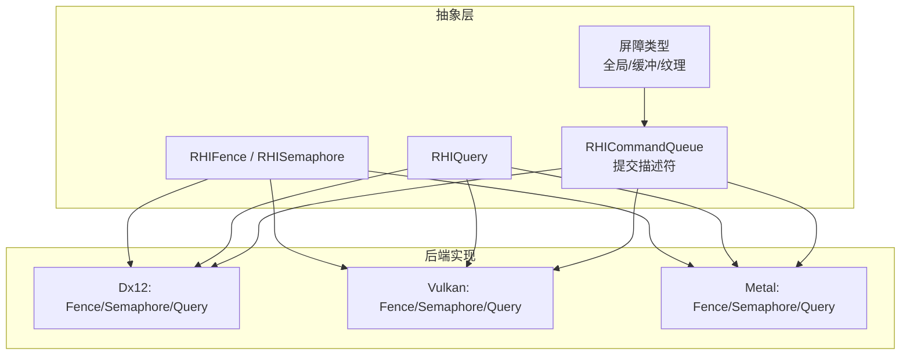
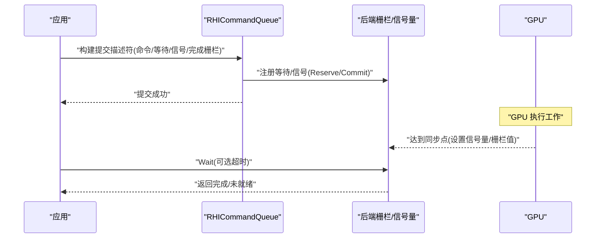
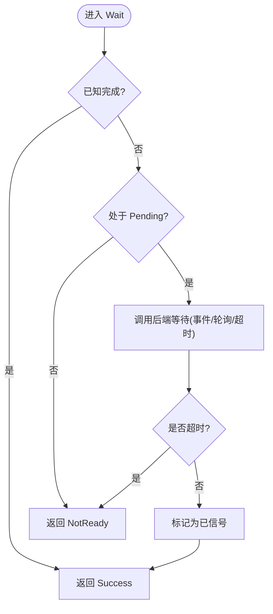
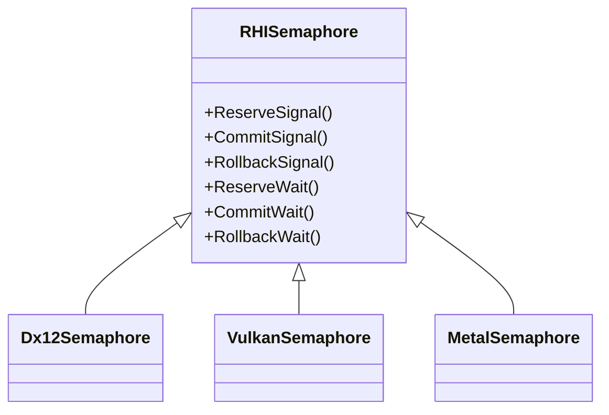
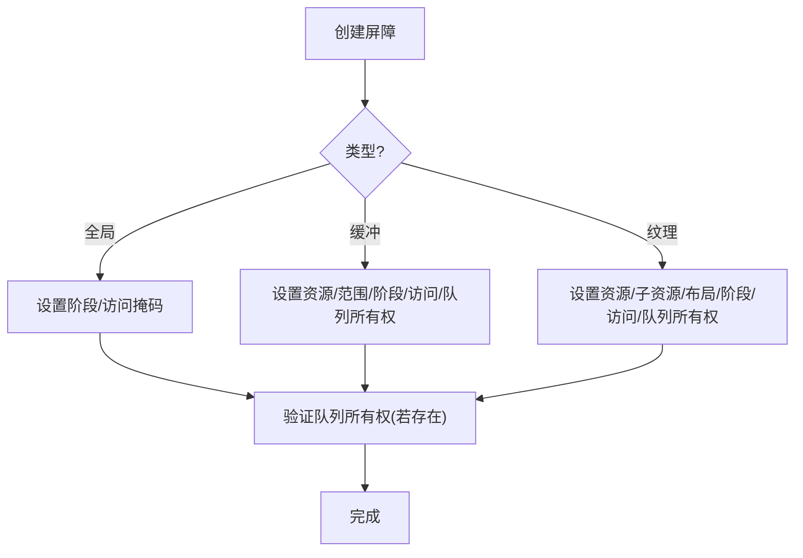
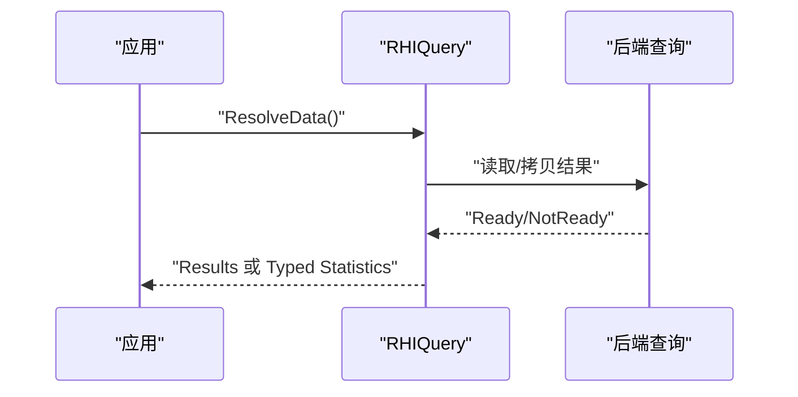
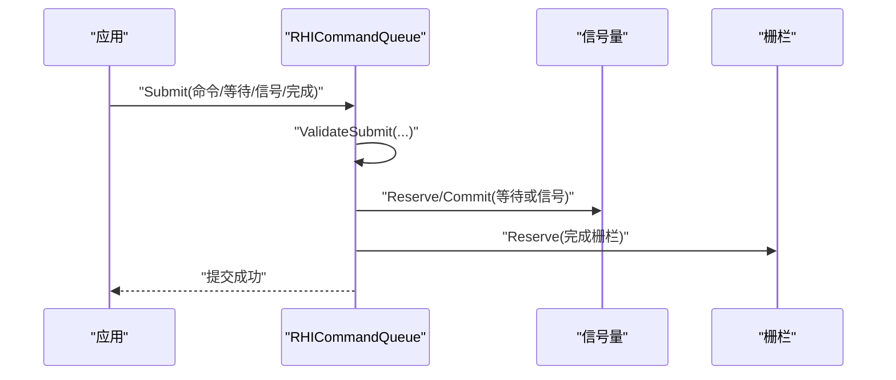
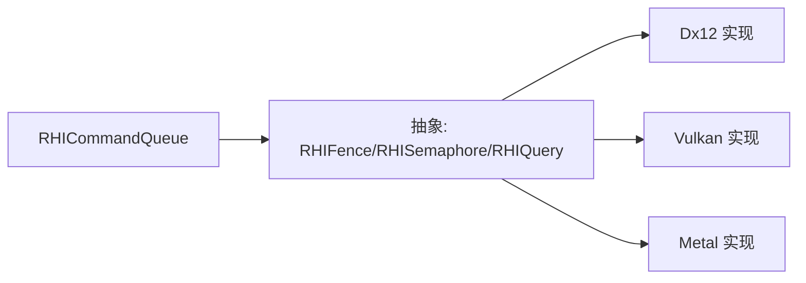

# 同步原语

<cite>
**本文引用的文件**
- [RHISynchronous.cs](file://src/SharpGPU/Abstract/RHISynchronous.cs)
- [RHIQuery.cs](file://src/SharpGPU/Abstract/RHIQuery.cs)
- [Dx12Synchronous.cs](file://src/SharpGPU/Dx12/Dx12Synchronous.cs)
- [VulkanSynchronous.cs](file://src/SharpGPU/Vulkan/VulkanSynchronous.cs)
- [MetalSynchronous.cs](file://src/SharpGPU/Metal/MetalSynchronous.cs)
- [Dx12Query.cs](file://src/SharpGPU/Dx12/Dx12Query.cs)
- [VulkanQuery.cs](file://src/SharpGPU/Vulkan/VulkanQuery.cs)
- [MetalQuery.cs](file://src/SharpGPU/Metal/MetalQuery.cs)
- [RHICommandQueue.cs](file://src/SharpGPU/Abstract/RHICommandQueue.cs)
- [QueueSubmissionContractTests.cs](file://tests/SharpGPU.Conformance.Tests/QueueSubmissionContractTests.cs)
</cite>

## 目录
1. [简介](#简介)
2. [项目结构](#项目结构)
3. [核心组件](#核心组件)
4. [架构总览](#架构总览)
5. [详细组件分析](#详细组件分析)
6. [依赖关系分析](#依赖关系分析)
7. [性能考量](#性能考量)
8. [故障排查指南](#故障排查指南)
9. [结论](#结论)
10. [附录：典型用法与示例路径](#附录：典型用法与示例路径)

## 简介
本文件聚焦 SharpGPU 的同步原语，系统阐述栅栏（Fence）、二进制信号量（Semaphore）、屏障（Barrier）以及查询（Query，含时间戳、遮挡、管线统计）的工作原理、使用场景与后端差异。文档还覆盖异步执行模型、完成通知、性能计数器、超时处理、死锁避免与调试技巧，并提供基于仓库源码的“代码片段路径”以便快速定位实现细节。

## 项目结构
SharpGPU 将同步原语抽象在 Abstract 层，并在各后端（DirectX12、Vulkan、Metal）提供具体实现。查询能力同样遵循抽象+后端实现的模式，统一暴露结果读取接口。命令队列提交描述符将等待/信号信号量与完成栅栏组合，形成完整的异步工作提交流。

图表来源
- [RHISynchronous.cs:14-280](file://src/SharpGPU/Abstract/RHISynchronous.cs#L14-L280)
- [RHIQuery.cs:178-446](file://src/SharpGPU/Abstract/RHIQuery.cs#L178-L446)
- [RHICommandQueue.cs:6-58](file://src/SharpGPU/Abstract/RHICommandQueue.cs#L6-L58)
- [Dx12Synchronous.cs:8-199](file://src/SharpGPU/Dx12/Dx12Synchronous.cs#L8-L199)
- [VulkanSynchronous.cs:7-155](file://src/SharpGPU/Vulkan/VulkanSynchronous.cs#L7-L155)
- [MetalSynchronous.cs:11-168](file://src/SharpGPU/Metal/MetalSynchronous.cs#L11-L168)
- [Dx12Query.cs:7-316](file://src/SharpGPU/Dx12/Dx12Query.cs#L7-L316)
- [VulkanQuery.cs:6-385](file://src/SharpGPU/Vulkan/VulkanQuery.cs#L6-L385)
- [MetalQuery.cs:10-393](file://src/SharpGPU/Metal/MetalQuery.cs#L10-L393)

章节来源
- [RHISynchronous.cs:14-280](file://src/SharpGPU/Abstract/RHISynchronous.cs#L14-L280)
- [RHICommandQueue.cs:6-58](file://src/SharpGPU/Abstract/RHICommandQueue.cs#L6-L58)

## 核心组件
- 栅栏（RHIFence）：用于标记 GPU 工作完成，支持状态查询、重置、带超时的等待；内部维护 Ready/Pending/Signaled/Resetting 生命周期，确保线程安全与正确顺序。
- 二进制信号量（RHISemaphore）：跨队列/设备边界的轻量同步点，支持 Reserve/Commit/Rollback 三阶段语义，保证“先信号后等待”“消费后再重发”。
- 屏障（Barrier）：描述资源访问阶段与访问权限转换，支持全局、缓冲、纹理三类，可表达队列所有权转移。
- 查询（RHIQuery）：封装时间戳、遮挡、管线统计等查询类型，统一通过 ResolveData 获取结果；统计类查询提供按域（光栅/计算/光线追踪）的强类型结果访问。
- 命令队列提交（RHICommandQueue.Submit）：将命令缓冲区、等待/信号信号量与完成栅栏打包提交，内置参数校验与重复提交保护。

章节来源
- [RHISynchronous.cs:14-280](file://src/SharpGPU/Abstract/RHISynchronous.cs#L14-L280)
- [RHIQuery.cs:178-446](file://src/SharpGPU/Abstract/RHIQuery.cs#L178-L446)
- [RHICommandQueue.cs:60-200](file://src/SharpGPU/Abstract/RHICommandQueue.cs#L60-L200)

## 架构总览
下图展示从应用层到后端的同步调用链：应用创建并记录命令缓冲区，提交时声明等待/信号信号量与完成栅栏；后端根据平台特性选择原生同步对象（如 D3D12 Fence、Vulkan Semaphore/Fence、Metal SharedEvent），并通过事件或轮询完成 CPU 侧等待。

图表来源
- [RHICommandQueue.cs:6-58](file://src/SharpGPU/Abstract/RHICommandQueue.cs#L6-L58)
- [Dx12Synchronous.cs:82-149](file://src/SharpGPU/Dx12/Dx12Synchronous.cs#L82-L149)
- [VulkanSynchronous.cs:90-121](file://src/SharpGPU/Vulkan/VulkanSynchronous.cs#L90-L121)
- [MetalSynchronous.cs:72-120](file://src/SharpGPU/Metal/MetalSynchronous.cs#L72-L120)

## 详细组件分析

### 栅栏（Fence）
- 抽象语义
  - 状态机：Ready → Pending（提交前预留）→ Signaled（GPU 完成）→ Resetting → Ready（重置完成）。
  - 关键方法：Status、Reset、Wait(timeout)、内部 ReserveSignal/MarkSignaled/BeginReset/CompleteReset。
- 后端差异
  - DirectX12：使用 ID3D12Fence + AutoResetEvent，通过 SetEventOnCompletion 等待；支持毫秒级超时。
  - Vulkan：vkGetFenceStatus 轮询状态，vkWaitForFences 阻塞等待，支持纳秒级超时。
  - Metal：基于 MTLSharedEvent 的值比较等待，支持毫秒级超时。
- 性能与行为
  - 优先检查本地状态位，减少原生调用开销。
  - 超时返回 NotReady，不改变 Signaled 状态，需重试或回退策略。

图表来源
- [RHISynchronous.cs:29-175](file://src/SharpGPU/Abstract/RHISynchronous.cs#L29-L175)
- [Dx12Synchronous.cs:82-149](file://src/SharpGPU/Dx12/Dx12Synchronous.cs#L82-L149)
- [VulkanSynchronous.cs:90-121](file://src/SharpGPU/Vulkan/VulkanSynchronous.cs#L90-L121)
- [MetalSynchronous.cs:72-120](file://src/SharpGPU/Metal/MetalSynchronous.cs#L72-L120)

章节来源
- [RHISynchronous.cs:14-175](file://src/SharpGPU/Abstract/RHISynchronous.cs#L14-L175)
- [Dx12Synchronous.cs:8-149](file://src/SharpGPU/Dx12/Dx12Synchronous.cs#L8-L149)
- [VulkanSynchronous.cs:7-121](file://src/SharpGPU/Vulkan/VulkanSynchronous.cs#L7-L121)
- [MetalSynchronous.cs:11-120](file://src/SharpGPU/Metal/MetalSynchronous.cs#L11-L120)

### 二进制信号量（Semaphore）
- 抽象语义
  - 三阶段：ReserveSignal/CommitSignal/RollbackSignal；ReserveWait/CommitWait/RollbackWait。
  - 严格顺序：必须先 Signal 再 Wait；已消费的信号不可再次 Signal。
- 后端差异
  - DirectX12：底层用 Fence 模拟二进制信号量，维护 LastSignaledValue。
  - Vulkan：原生 VkSemaphore，跨队列/设备边界同步。
  - Metal：MTLSharedEvent 作为共享事件，支持值比较。
- 使用要点
  - 提交前 Reserve，提交中 Commit，失败 Rollback。
  - 等待端同样 Reserve/Commit，确保原子性。

图表来源
- [RHISynchronous.cs:178-280](file://src/SharpGPU/Abstract/RHISynchronous.cs#L178-L280)
- [Dx12Synchronous.cs:151-199](file://src/SharpGPU/Dx12/Dx12Synchronous.cs#L151-L199)
- [VulkanSynchronous.cs:126-155](file://src/SharpGPU/Vulkan/VulkanSynchronous.cs#L126-L155)
- [MetalSynchronous.cs:132-168](file://src/SharpGPU/Metal/MetalSynchronous.cs#L132-L168)

章节来源
- [RHISynchronous.cs:178-280](file://src/SharpGPU/Abstract/RHISynchronous.cs#L178-L280)
- [Dx12Synchronous.cs:151-199](file://src/SharpGPU/Dx12/Dx12Synchronous.cs#L151-L199)
- [VulkanSynchronous.cs:126-155](file://src/SharpGPU/Vulkan/VulkanSynchronous.cs#L126-L155)
- [MetalSynchronous.cs:132-168](file://src/SharpGPU/Metal/MetalSynchronous.cs#L132-L168)

### 屏障（Barrier）
- 类型与字段
  - 全局屏障：指定前后阶段与访问掩码。
  - 缓冲屏障：指定资源、范围、阶段/访问转换及队列所有权转移。
  - 纹理屏障：指定子资源范围、布局转换、阶段/访问转换及队列所有权转移。
- 队列所有权验证
  - 源/目的队列必须成对出现且不同；录制队列必须是源或目的之一。
- 用途
  - 在命令编码期间插入资源可见性与一致性约束，避免数据竞争。

图表来源
- [RHISynchronous.cs:283-661](file://src/SharpGPU/Abstract/RHISynchronous.cs#L283-L661)

章节来源
- [RHISynchronous.cs:283-661](file://src/SharpGPU/Abstract/RHISynchronous.cs#L283-L661)

### 查询（Query）
- 类型与结果
  - 时间戳：测量 GPU/CPU 时间差，单位纳秒（后端频率换算）。
  - 遮挡：像素可见计数。
  - 管线统计：按域（光栅/计算/光线追踪）提供强类型统计结果。
- 结果解析
  - 统一通过 ResolveData 获取 ERHIQueryResultStatus；统计类查询提供 TryGet*Statistics 强类型访问。
- 后端差异
  - DirectX12：QueryHeap + Readback Buffer，统计分 Statistics/Statistics1。
  - Vulkan：QueryPool + vkGetQueryPoolResults，统计项按启用标志解包。
  - Metal：CounterHeap/CounterSampleBuffer/Visibility Buffer，时间戳频率换算纳秒。

图表来源
- [RHIQuery.cs:178-446](file://src/SharpGPU/Abstract/RHIQuery.cs#L178-L446)
- [Dx12Query.cs:115-153](file://src/SharpGPU/Dx12/Dx12Query.cs#L115-L153)
- [VulkanQuery.cs:84-150](file://src/SharpGPU/Vulkan/VulkanQuery.cs#L84-L150)
- [MetalQuery.cs:175-224](file://src/SharpGPU/Metal/MetalQuery.cs#L175-L224)

章节来源
- [RHIQuery.cs:178-446](file://src/SharpGPU/Abstract/RHIQuery.cs#L178-L446)
- [Dx12Query.cs:7-316](file://src/SharpGPU/Dx12/Dx12Query.cs#L7-L316)
- [VulkanQuery.cs:6-385](file://src/SharpGPU/Vulkan/VulkanQuery.cs#L6-L385)
- [MetalQuery.cs:10-393](file://src/SharpGPU/Metal/MetalQuery.cs#L10-L393)

### 命令队列提交与同步点编排
- 提交描述符包含：命令缓冲区、等待信号量（带阶段掩码）、信号信号量、完成栅栏。
- 校验规则：至少包含一项工作/同步；命令缓冲区不得重复；等待信号量阶段掩码合法；信号/等待信号量不得重复。
- 测试覆盖：空提交拒绝、二元信号量先信号后等待、栅栏重置时序、跨设备/已释放对象拒绝。

图表来源
- [RHICommandQueue.cs:6-200](file://src/SharpGPU/Abstract/RHICommandQueue.cs#L6-L200)
- [QueueSubmissionContractTests.cs:9-99](file://tests/SharpGPU.Conformance.Tests/QueueSubmissionContractTests.cs#L9-L99)

章节来源
- [RHICommandQueue.cs:60-200](file://src/SharpGPU/Abstract/RHICommandQueue.cs#L60-L200)
- [QueueSubmissionContractTests.cs:9-99](file://tests/SharpGPU.Conformance.Tests/QueueSubmissionContractTests.cs#L9-L99)

## 依赖关系分析
- 抽象层依赖：所有后端实现均继承自 RHIFence/RHISemaphore/RHIQuery，复用生命周期与状态机。
- 命令队列依赖：提交流程依赖信号量/栅栏的状态机，确保提交前/后的原子性。
- 查询依赖：统计结果解析依赖后端特定的数据结构与频率信息。

图表来源
- [RHISynchronous.cs:14-280](file://src/SharpGPU/Abstract/RHISynchronous.cs#L14-L280)
- [RHIQuery.cs:178-446](file://src/SharpGPU/Abstract/RHIQuery.cs#L178-L446)
- [RHICommandQueue.cs:60-200](file://src/SharpGPU/Abstract/RHICommandQueue.cs#L60-L200)

章节来源
- [RHISynchronous.cs:14-280](file://src/SharpGPU/Abstract/RHISynchronous.cs#L14-L280)
- [RHIQuery.cs:178-446](file://src/SharpGPU/Abstract/RHIQuery.cs#L178-L446)
- [RHICommandQueue.cs:60-200](file://src/SharpGPU/Abstract/RHICommandQueue.cs#L60-L200)

## 性能考量
- 最小化同步开销
  - 优先使用信号量进行跨队列/设备同步，避免频繁栅栏等待。
  - 合理批量化查询，减少多次 ResolveData 调用。
- 超时策略
  - 为 Wait 设置合理超时，避免无限阻塞；超时后采用指数退避重试。
- 屏障粒度
  - 尽量缩小屏障作用范围（精确到子资源/范围），降低不必要的序列化。
- 统计查询
  - 仅启用需要的计数器，减少内存带宽与解析开销。

## 故障排查指南
- 常见错误与原因
  - “栅栏未提交即等待”：需在提交前预留信号，否则 EnsureWaitable 会抛错。
  - “信号量未先信号就等待”：违反二元信号量顺序，提交时会抛出异常。
  - “重复提交命令缓冲区”：同一提交内不允许重复引用。
  - “跨设备/已释放对象”：提交描述符中的同步对象必须属于同一设备且未释放。
- 定位建议
  - 关注提交前的 Reserve/Commit 调用与异常堆栈。
  - 检查屏障的阶段/访问掩码与队列所有权是否匹配。
  - 对查询结果使用 NotReady 分支进行重试或降级。

章节来源
- [RHISynchronous.cs:136-175](file://src/SharpGPU/Abstract/RHISynchronous.cs#L136-L175)
- [RHICommandQueue.cs:118-200](file://src/SharpGPU/Abstract/RHICommandQueue.cs#L118-L200)
- [QueueSubmissionContractTests.cs:9-99](file://tests/SharpGPU.Conformance.Tests/QueueSubmissionContractTests.cs#L9-L99)

## 结论
SharpGPU 通过统一的抽象层屏蔽了多后端同步原语差异，提供了健壮的生命周期管理与严格的提交校验。结合信号量、栅栏与屏障，可实现高效、安全的异步执行与资源一致性控制；查询机制则提供细粒度的性能分析与调试能力。遵循本文的最佳实践与故障排查建议，可在不同后端上获得一致且高性能的同步体验。

## 附录：典型用法与示例路径
- 创建并等待完成栅栏
  - 抽象定义与状态机：[RHISynchronous.cs:14-175](file://src/SharpGPU/Abstract/RHISynchronous.cs#L14-L175)
  - DirectX12 等待实现：[Dx12Synchronous.cs:82-149](file://src/SharpGPU/Dx12/Dx12Synchronous.cs#L82-L149)
  - Vulkan 等待实现：[VulkanSynchronous.cs:90-121](file://src/SharpGPU/Vulkan/VulkanSynchronous.cs#L90-L121)
  - Metal 等待实现：[MetalSynchronous.cs:72-120](file://src/SharpGPU/Metal/MetalSynchronous.cs#L72-L120)
- 信号量的信号与等待
  - 抽象三阶段语义：[RHISynchronous.cs:178-280](file://src/SharpGPU/Abstract/RHISynchronous.cs#L178-L280)
  - 提交校验与用例：[RHICommandQueue.cs:118-200](file://src/SharpGPU/Abstract/RHICommandQueue.cs#L118-L200), [QueueSubmissionContractTests.cs:18-46](file://tests/SharpGPU.Conformance.Tests/QueueSubmissionContractTests.cs#L18-L46)
- 屏障的使用
  - 全局/缓冲/纹理屏障构造与队列所有权验证：[RHISynchronous.cs:283-661](file://src/SharpGPU/Abstract/RHISynchronous.cs#L283-L661)
- 查询（时间戳/遮挡/统计）
  - 抽象接口与结果访问：[RHIQuery.cs:178-446](file://src/SharpGPU/Abstract/RHIQuery.cs#L178-L446)
  - DirectX12 解析：[Dx12Query.cs:115-153](file://src/SharpGPU/Dx12/Dx12Query.cs#L115-L153)
  - Vulkan 解析：[VulkanQuery.cs:84-150](file://src/SharpGPU/Vulkan/VulkanQuery.cs#L84-L150)
  - Metal 解析：[MetalQuery.cs:175-224](file://src/SharpGPU/Metal/MetalQuery.cs#L175-L224)