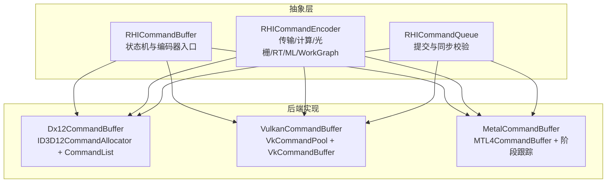
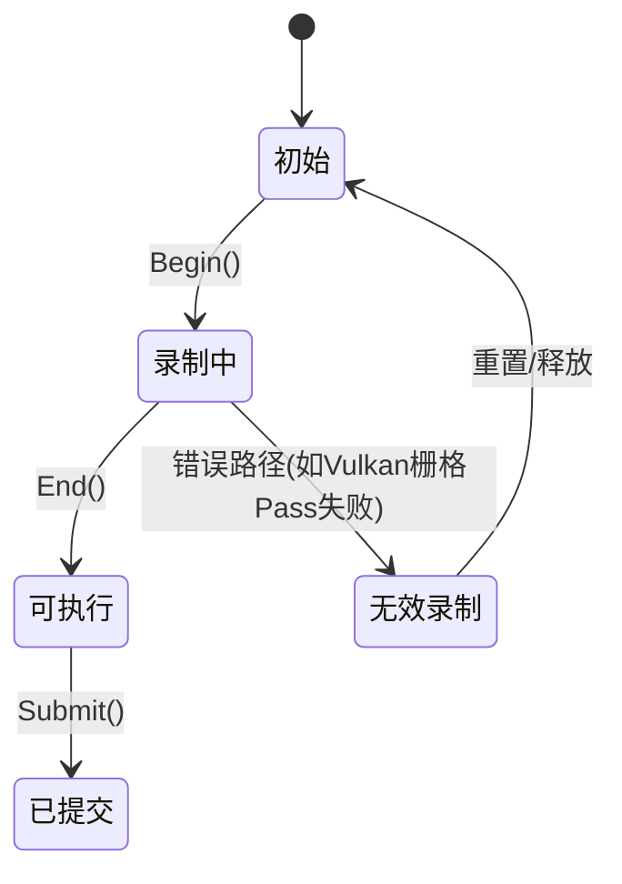
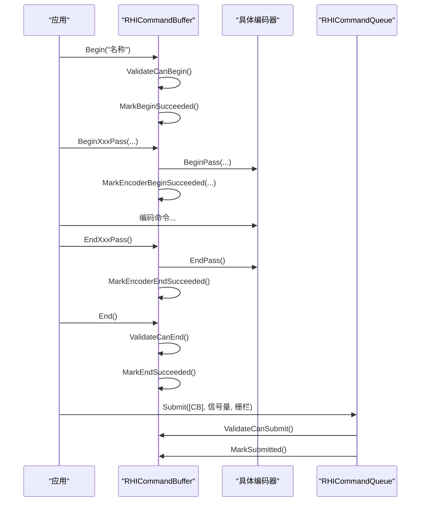
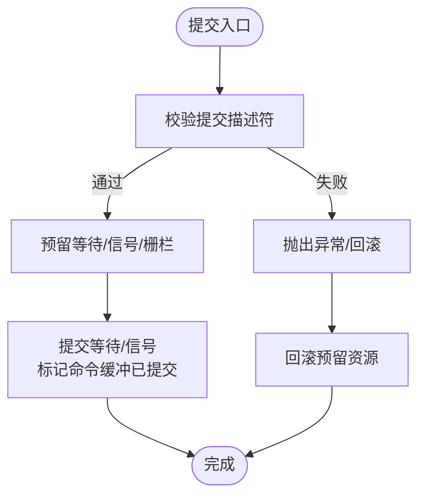
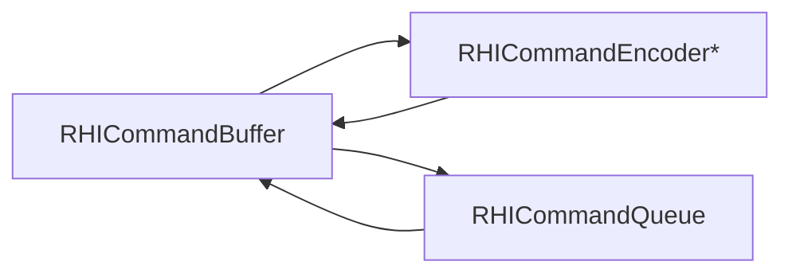

# 命令缓冲机制

<cite>
**本文引用的文件**
- [RHICommandBuffer.cs](file://src/SharpGPU/Abstract/RHICommandBuffer.cs)
- [RHICommandEncoder.cs](file://src/SharpGPU/Abstract/RHICommandEncoder.cs)
- [RHICommandQueue.cs](file://src/SharpGPU/Abstract/RHICommandQueue.cs)
- [Dx12CommandBuffer.cs](file://src/SharpGPU/Dx12/Dx12CommandBuffer.cs)
- [VulkanCommandBuffer.cs](file://src/SharpGPU/Vulkan/VulkanCommandBuffer.cs)
- [MetalCommandBuffer.cs](file://src/SharpGPU/Metal/MetalCommandBuffer.cs)
</cite>

## 目录
1. [简介](#简介)
2. [项目结构](#项目结构)
3. [核心组件](#核心组件)
4. [架构总览](#架构总览)
5. [详细组件分析](#详细组件分析)
6. [依赖关系分析](#依赖关系分析)
7. [性能考量](#性能考量)
8. [故障排查指南](#故障排查指南)
9. [结论](#结论)
10. [附录：完整使用流程示例](#附录：完整使用流程示例)

## 简介
本文件系统性阐述 SharpGPU 的命令缓冲机制，覆盖以下主题：
- 命令缓冲的工作原理、状态机模型与生命周期管理
- 命令编码器（传输、计算、光栅、光线追踪、机器学习、WorkGraph）的使用模式与录制流程
- 提交执行模型与同步机制（信号量、栅栏、查询）
- 不同后端（Direct3D 12、Vulkan、Metal）在命令缓冲实现上的差异与性能要点
- 资源绑定、状态切换、屏障等关键概念
- 从创建到提交执行的端到端流程说明

## 项目结构
SharpGPU 将命令缓冲抽象为 RHICommandBuffer，并通过各后端具体实现：
- 抽象层：定义统一的状态机、编码器接口、提交描述符与验证逻辑
- 后端层：分别对接 D3D12、Vulkan、Metal 的原生命令对象与语义

图表来源
- [RHICommandBuffer.cs:6-190](file://src/SharpGPU/Abstract/RHICommandBuffer.cs#L6-L190)
- [RHICommandEncoder.cs:110-402](file://src/SharpGPU/Abstract/RHICommandEncoder.cs#L110-L402)
- [RHICommandQueue.cs:60-108](file://src/SharpGPU/Abstract/RHICommandQueue.cs#L60-L108)
- [Dx12CommandBuffer.cs:10-56](file://src/SharpGPU/Dx12/Dx12CommandBuffer.cs#L10-L56)
- [VulkanCommandBuffer.cs:9-80](file://src/SharpGPU/Vulkan/VulkanCommandBuffer.cs#L9-L80)
- [MetalCommandBuffer.cs:8-48](file://src/SharpGPU/Metal/MetalCommandBuffer.cs#L8-L48)

章节来源
- [RHICommandBuffer.cs:6-190](file://src/SharpGPU/Abstract/RHICommandBuffer.cs#L6-L190)
- [RHICommandEncoder.cs:110-402](file://src/SharpGPU/Abstract/RHICommandEncoder.cs#L110-L402)
- [RHICommandQueue.cs:60-108](file://src/SharpGPU/Abstract/RHICommandQueue.cs#L60-L108)
- [Dx12CommandBuffer.cs:10-56](file://src/SharpGPU/Dx12/Dx12CommandBuffer.cs#L10-L56)
- [VulkanCommandBuffer.cs:9-80](file://src/SharpGPU/Vulkan/VulkanCommandBuffer.cs#L9-L80)
- [MetalCommandBuffer.cs:8-48](file://src/SharpGPU/Metal/MetalCommandBuffer.cs#L8-L48)

## 核心组件
- 命令缓冲（RHICommandBuffer）
  - 维护内部状态机：初始、录制中、可执行、已提交、无效录制
  - 维护当前活动编码器类型，确保同一时间仅有一个编码器处于活动状态
  - 提供 Begin/End 与各 Pass 的 Begin/End 方法，以及获取对应编码器的接口
- 命令编码器（RHICommandEncoder 系列）
  - 传输编码器：复制、屏障、时间戳、查询解析
  - 计算编码器：设置管线、绑定表、推入常量、Dispatch/Indirect、统计与采样反馈
  - 光栅编码器：颜色/深度模板附件、子通道、分辨率、渲染状态
  - 光线追踪编码器：加速结构构建、函数表调度、透明度微图支持
  - 机器学习编码器：管线与绑定表设置、Dispatch
  - WorkGraph 编码器：图形化工作流调度、输入记录、后备内存
- 命令队列（RHICommandQueue）
  - 提交描述符：命令缓冲列表、等待/信号信号量、完成栅栏
  - 提交前校验：命令缓冲归属、重复提交、空提交、信号量合法性
  - 提交过程：预留、提交、回滚；成功后标记命令缓冲为已提交

章节来源
- [RHICommandBuffer.cs:6-190](file://src/SharpGPU/Abstract/RHICommandBuffer.cs#L6-L190)
- [RHICommandEncoder.cs:110-402](file://src/SharpGPU/Abstract/RHICommandEncoder.cs#L110-L402)
- [RHICommandQueue.cs:25-108](file://src/SharpGPU/Abstract/RHICommandQueue.cs#L25-L108)

## 架构总览
命令缓冲的生命周期由状态机驱动，编码器在录制期间按“开始-操作-结束”的模式工作，最终通过命令队列提交并进入 GPU 执行。

图表来源
- [RHICommandBuffer.cs:6-163](file://src/SharpGPU/Abstract/RHICommandBuffer.cs#L6-L163)
- [VulkanCommandBuffer.cs:163-194](file://src/SharpGPU/Vulkan/VulkanCommandBuffer.cs#L163-L194)

章节来源
- [RHICommandBuffer.cs:6-163](file://src/SharpGPU/Abstract/RHICommandBuffer.cs#L6-L163)
- [VulkanCommandBuffer.cs:163-194](file://src/SharpGPU/Vulkan/VulkanCommandBuffer.cs#L163-L194)

## 详细组件分析

### 命令缓冲状态机与生命周期
- 状态枚举与转换
  - 初始 -> 录制中：Begin() 成功
  - 录制中 -> 可执行：End() 成功
  - 录制中 -> 无效录制：某些后端在录制过程中发生不可恢复错误（例如 Vulkan 栅格 Pass 开始失败）
  - 可执行 -> 已提交：Submit() 成功，调用 MarkSubmitted() 并触发 OnSubmitted()
- 活动编码器约束
  - 同一时刻只能有一个编码器处于活动状态
  - 开始/结束编码器时进行严格校验，防止嵌套或错位
- 生命周期清理
  - 后端在 Release() 中释放原生命令对象与临时资源

图表来源
- [RHICommandBuffer.cs:36-163](file://src/SharpGPU/Abstract/RHICommandBuffer.cs#L36-L163)
- [RHICommandQueue.cs:118-310](file://src/SharpGPU/Abstract/RHICommandQueue.cs#L118-L310)

章节来源
- [RHICommandBuffer.cs:36-163](file://src/SharpGPU/Abstract/RHICommandBuffer.cs#L36-L163)
- [RHICommandQueue.cs:118-310](file://src/SharpGPU/Abstract/RHICommandQueue.cs#L118-L310)

### 命令编码器使用模式与录制流程
- 通用模式
  - BeginXxxPass(descriptor)：校验状态、激活编码器、记录活动类型
  - 编码命令：Barrier/Barriers、SetPipeline/SetBindingTable、Dispatch/Draw、Copy/Resolve、Timestamp/Statistics
  - EndXxxPass()：校验活动编码器、调用编码器 EndPass、清除活动编码器
- 传输编码器
  - 提供 Barrier/Barriers、CopyBufferToBuffer/Texture、WriteTimestamp、ResolveQuery
- 计算编码器
  - SetPipeline、SetBindingTable、SetPushConstants、Dispatch、ExecuteIndirect（可选）、统计与采样反馈
- 光栅编码器
  - 颜色/深度附件描述、子通道、分辨率、双源混合等
- 光线追踪编码器
  - 加速结构构建、函数表调度、透明度微图构建/压缩（能力检查）
- 机器学习编码器
  - 管线与绑定表设置、Dispatch（部分后端未启用）
- WorkGraph 编码器
  - 设置管线、绑定表、推入常量、后备内存、DispatchGraph（部分后端未启用）

章节来源
- [RHICommandEncoder.cs:110-402](file://src/SharpGPU/Abstract/RHICommandEncoder.cs#L110-L402)

### 后端实现差异与性能要点

#### Direct3D 12
- 原生对象
  - ID3D12CommandAllocator + ID3D12GraphicsCommandList7
- Begin/End
  - Begin：Reset 分配器与命令列表，设置描述符堆，开启 PIX 事件（调试）
  - End：Close 命令列表，异常时转储设备消息
- 资源与临时数据
  - 临时 CBV/SRV/UAV 描述符注册与释放，避免泄漏
- 性能要点
  - 复用命令分配器与命令列表，减少 CPU 开销
  - 一次性提交策略（OneTimeSubmit 风格）有助于驱动优化

章节来源
- [Dx12CommandBuffer.cs:58-111](file://src/SharpGPU/Dx12/Dx12CommandBuffer.cs#L58-L111)
- [Dx12CommandBuffer.cs:189-210](file://src/SharpGPU/Dx12/Dx12CommandBuffer.cs#L189-L210)
- [Dx12CommandBuffer.cs:262-282](file://src/SharpGPU/Dx12/Dx12CommandBuffer.cs#L262-L282)

#### Vulkan
- 原生对象
  - VkCommandPool + VkCommandBuffer（Primary）
- Begin/End
  - Begin：vkResetCommandBuffer、vkBeginCommandBuffer（OneTimeSubmit），清理图像布局覆盖层与临时资源
  - End：vkEndCommandBuffer
- 图像布局覆盖层
  - 维护每个子资源的已知布局，校验声明一致性，支持回滚
- 临时资源管理
  - 捕获检查点，支持回滚临时分配、ImageView、Framebuffer、RenderPass、DescriptorSetLease、Raster Pipeline
- 错误恢复
  - 栅格 Pass 开始失败时，尝试重置命令缓冲并清理状态，标记无效录制
- 性能要点
  - 严格的布局一致性检查避免运行时错误
  - 临时资源批量回收降低分配压力

章节来源
- [VulkanCommandBuffer.cs:82-98](file://src/SharpGPU/Vulkan/VulkanCommandBuffer.cs#L82-L98)
- [VulkanCommandBuffer.cs:100-194](file://src/SharpGPU/Vulkan/VulkanCommandBuffer.cs#L100-L194)
- [VulkanCommandBuffer.cs:486-555](file://src/SharpGPU/Vulkan/VulkanCommandBuffer.cs#L486-L555)
- [VulkanCommandBuffer.cs:635-800](file://src/SharpGPU/Vulkan/VulkanCommandBuffer.cs#L635-L800)

#### Metal
- 原生对象
  - MTL4CommandBuffer + MTL4CommandAllocator
- Begin/End
  - Begin：重置编码器状态，释放原生命令对象，必要时创建新命令缓冲与分配器
  - End：EndCommandBuffer（若尚未结束）
- 阶段跟踪
  - 记录当前编码器内已产生的阶段位，用于决定 BarrierAfterEncoderStages vs BarrierAfterQueueStages
- 特性开关
  - 机器学习与 WorkGraph 在当前实现中未暴露（抛出不支持）
- 性能要点
  - 通过阶段跟踪减少不必要的跨编码器屏障
  - 延迟创建命令缓冲以节省资源

章节来源
- [MetalCommandBuffer.cs:50-167](file://src/SharpGPU/Metal/MetalCommandBuffer.cs#L50-L167)
- [MetalCommandBuffer.cs:213-255](file://src/SharpGPU/Metal/MetalCommandBuffer.cs#L213-L255)
- [MetalCommandBuffer.cs:257-301](file://src/SharpGPU/Metal/MetalCommandBuffer.cs#L257-L301)

### 提交执行模型与同步
- 提交描述符
  - 包含命令缓冲列表、等待信号量（带阶段掩码）、信号信号量、完成栅栏
- 提交前校验
  - 非空提交、命令缓冲归属与重复性、信号量合法性、栅栏所属设备一致
- 提交过程
  - Reserve：预留等待/信号与栅栏
  - Commit：提交等待/信号，标记命令缓冲为已提交
  - Rollback：失败时回滚预留的资源
- 结果获取
  - 通过 RHIFence 或 RHISemaphore 等待 GPU 完成，再读取查询结果或呈现帧

图表来源
- [RHICommandQueue.cs:118-310](file://src/SharpGPU/Abstract/RHICommandQueue.cs#L118-L310)

章节来源
- [RHICommandQueue.cs:118-310](file://src/SharpGPU/Abstract/RHICommandQueue.cs#L118-L310)

### 资源绑定、状态切换与屏障
- 资源绑定
  - 通过 SetBindingTable 设置资源表（计算/光栅/RT）
  - 推入常量 SetPushConstants 用于小参数快速传递
- 状态切换
  - 传输/计算/光栅/RT 编码器均提供 Barrier/Barriers
  - Vulkan 额外维护图像布局覆盖层，确保子资源布局一致性
  - Metal 通过阶段跟踪选择更合适的屏障粒度
- 查询与时间戳
  - WriteTimestamp、ResolveQuery 用于性能分析与耗时测量

章节来源
- [RHICommandEncoder.cs:110-402](file://src/SharpGPU/Abstract/RHICommandEncoder.cs#L110-L402)
- [VulkanCommandBuffer.cs:100-194](file://src/SharpGPU/Vulkan/VulkanCommandBuffer.cs#L100-L194)
- [MetalCommandBuffer.cs:257-301](file://src/SharpGPU/Metal/MetalCommandBuffer.cs#L257-L301)

## 依赖关系分析
- 耦合与内聚
  - RHICommandBuffer 与 RHICommandEncoder 高内聚：编码器仅在录制期活跃，状态机保证正确顺序
  - RHICommandQueue 与 RHICommandBuffer 松耦合：通过接口与描述符交互，便于扩展
- 外部依赖
  - D3D12：命令分配器与命令列表
  - Vulkan：命令池与命令缓冲、图像布局覆盖层
  - Metal：MTL4CommandBuffer、阶段跟踪
- 循环依赖
  - 无直接循环依赖；编码器持有命令缓冲引用用于校验与回调

图表来源
- [RHICommandBuffer.cs:26-190](file://src/SharpGPU/Abstract/RHICommandBuffer.cs#L26-L190)
- [RHICommandEncoder.cs:110-402](file://src/SharpGPU/Abstract/RHICommandEncoder.cs#L110-L402)
- [RHICommandQueue.cs:60-108](file://src/SharpGPU/Abstract/RHICommandQueue.cs#L60-L108)

章节来源
- [RHICommandBuffer.cs:26-190](file://src/SharpGPU/Abstract/RHICommandBuffer.cs#L26-L190)
- [RHICommandEncoder.cs:110-402](file://src/SharpGPU/Abstract/RHICommandEncoder.cs#L110-L402)
- [RHICommandQueue.cs:60-108](file://src/SharpGPU/Abstract/RHICommandQueue.cs#L60-L108)

## 性能考量
- 命令缓冲复用
  - D3D12：复用命令分配器与命令列表，减少 CPU 开销
  - Vulkan：命令池与命令缓冲复用，临时资源批量回收
  - Metal：延迟创建命令缓冲，按需初始化
- 屏障粒度
  - Metal：基于阶段跟踪选择更细粒度的屏障，减少跨编码器同步成本
  - Vulkan：严格的布局一致性检查避免运行时错误，提高稳定性
- 资源管理
  - D3D12：临时描述符注册与释放，避免泄漏
  - Vulkan：检查点与回滚机制，保障复杂录制路径的健壮性
- 提交批处理
  - 合理组织命令缓冲提交，减少同步点数量，提升吞吐

[本节为一般性指导，不直接分析具体文件]

## 故障排查指南
- 常见错误与定位
  - “命令缓冲已在录制中”：重复 Begin 或未正确 End
  - “存在活动编码器”：未结束上一个编码器即开始新的
  - “命令缓冲未结束就提交”：缺少 End() 或 EndXxxPass() 未成对
  - “命令缓冲不属于该队列”：跨队列提交
  - “重复提交命令缓冲”：同一命令缓冲多次提交
  - “信号量非法”：空、重复、阶段掩码未知、设备不一致
- 后端特定问题
  - D3D12：Begin 失败可能因分配器仍在 GPU 飞行或栅栏序列错误；End 失败时查看设备消息
  - Vulkan：栅格 Pass 开始失败会尝试重置命令缓冲并清理状态；检查图像布局覆盖层与临时资源检查点
  - Metal：提交前需确保命令缓冲已结束；机器学习/WorkGraph 未启用时会抛出不支持异常

章节来源
- [RHICommandBuffer.cs:36-163](file://src/SharpGPU/Abstract/RHICommandBuffer.cs#L36-L163)
- [RHICommandQueue.cs:118-310](file://src/SharpGPU/Abstract/RHICommandQueue.cs#L118-L310)
- [Dx12CommandBuffer.cs:87-111](file://src/SharpGPU/Dx12/Dx12CommandBuffer.cs#L87-L111)
- [Dx12CommandBuffer.cs:189-210](file://src/SharpGPU/Dx12/Dx12CommandBuffer.cs#L189-L210)
- [VulkanCommandBuffer.cs:163-194](file://src/SharpGPU/Vulkan/VulkanCommandBuffer.cs#L163-L194)
- [MetalCommandBuffer.cs:157-167](file://src/SharpGPU/Metal/MetalCommandBuffer.cs#L157-L167)

## 结论
SharpGPU 的命令缓冲机制通过清晰的状态机与统一的编码器接口，屏蔽了多后端的复杂性。D3D12、Vulkan、Metal 各自在资源管理、屏障粒度与错误恢复上做了针对性优化。遵循正确的录制与提交流程，结合查询与同步原语，可实现高效稳定的 GPU 工作负载编排。

[本节为总结性内容，不直接分析具体文件]

## 附录：完整使用流程示例
以下为端到端流程的步骤说明（不包含代码片段，仅提供步骤与对应源码位置参考）：
- 创建命令缓冲
  - 通过命令队列创建命令缓冲（各后端在构造函数中初始化原生命令对象）
  - 参考：[Dx12CommandBuffer.cs:39-56](file://src/SharpGPU/Dx12/Dx12CommandBuffer.cs#L39-L56)、[VulkanCommandBuffer.cs:43-80](file://src/SharpGPU/Vulkan/VulkanCommandBuffer.cs#L43-L80)、[MetalCommandBuffer.cs:37-48](file://src/SharpGPU/Metal/MetalCommandBuffer.cs#L37-L48)
- 开始录制
  - 调用 Begin(name)，进入录制状态
  - 参考：[RHICommandBuffer.cs:36-56](file://src/SharpGPU/Abstract/RHICommandBuffer.cs#L36-L56)
- 录制命令
  - 根据任务类型选择编码器：传输/计算/光栅/RT/ML/WorkGraph
  - 设置管线、绑定表、推入常量，执行 Dispatch/Draw/Copy/Resolve
  - 插入屏障与时间戳，必要时开启统计
  - 参考：[RHICommandEncoder.cs:110-402](file://src/SharpGPU/Abstract/RHICommandEncoder.cs#L110-L402)
- 结束录制
  - 结束当前编码器，结束命令缓冲
  - 参考：[RHICommandBuffer.cs:122-141](file://src/SharpGPU/Abstract/RHICommandBuffer.cs#L122-L141)
- 提交执行
  - 构造提交描述符（命令缓冲、等待/信号信号量、完成栅栏）
  - 调用队列 Submit，完成校验与提交
  - 参考：[RHICommandQueue.cs:25-108](file://src/SharpGPU/Abstract/RHICommandQueue.cs#L25-L108)、[RHICommandQueue.cs:118-310](file://src/SharpGPU/Abstract/RHICommandQueue.cs#L118-L310)
- 结果获取
  - 等待栅栏或信号量，读取查询结果或呈现帧
  - 参考：[RHICommandQueue.cs:25-108](file://src/SharpGPU/Abstract/RHICommandQueue.cs#L25-L108)

[本节为流程说明，不直接分析具体文件]