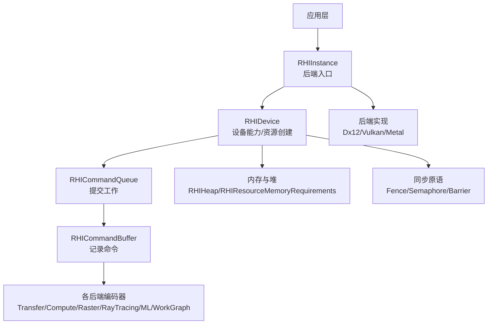
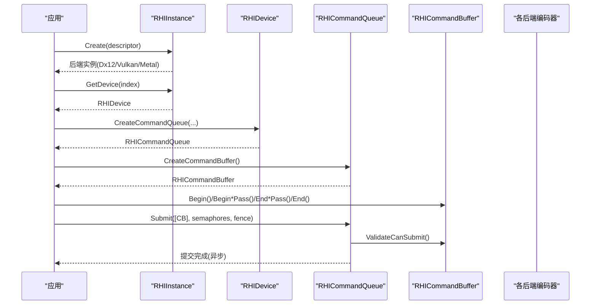
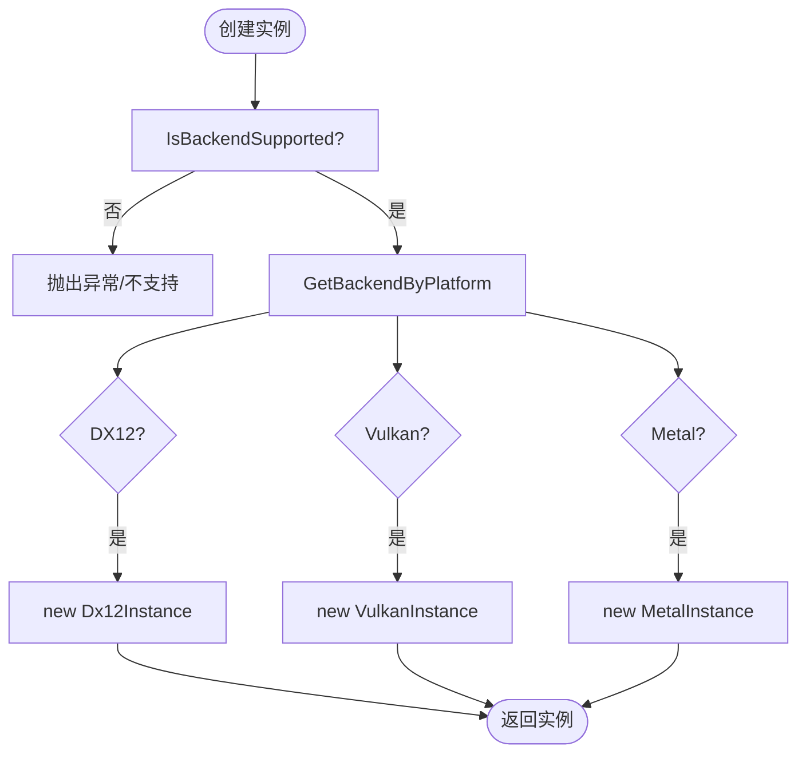
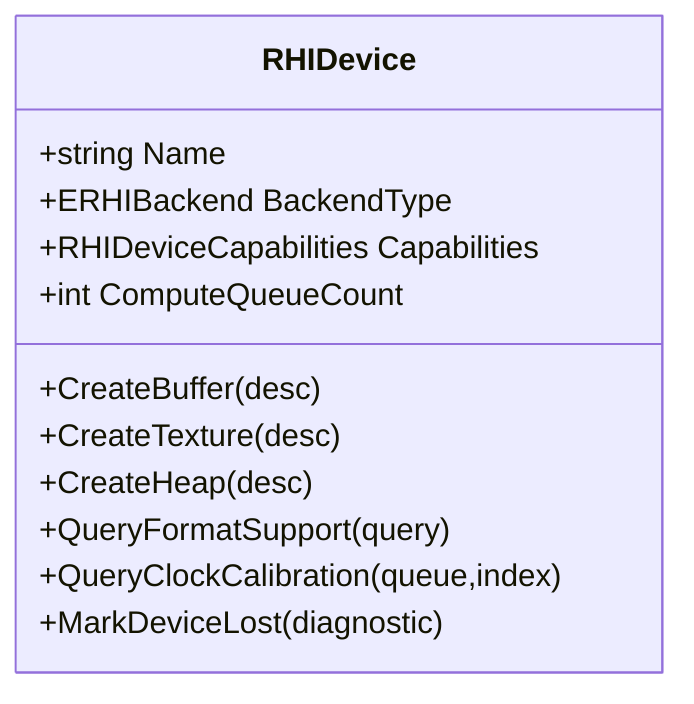
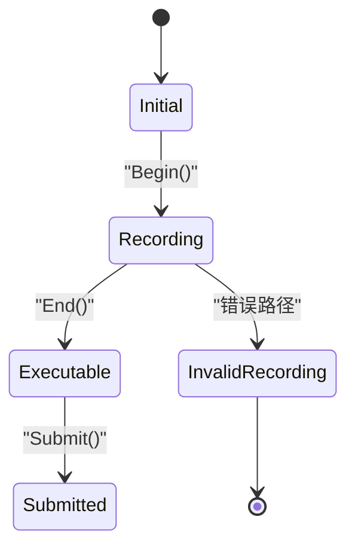
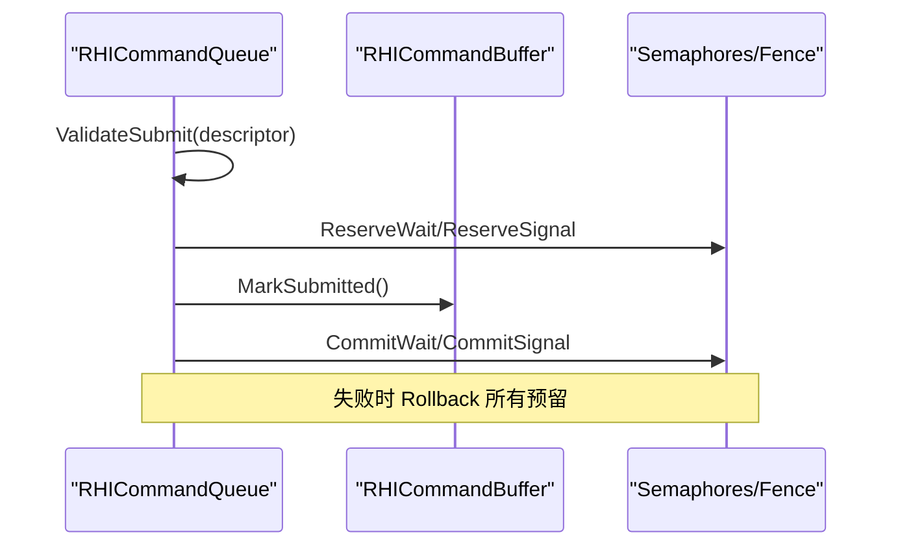
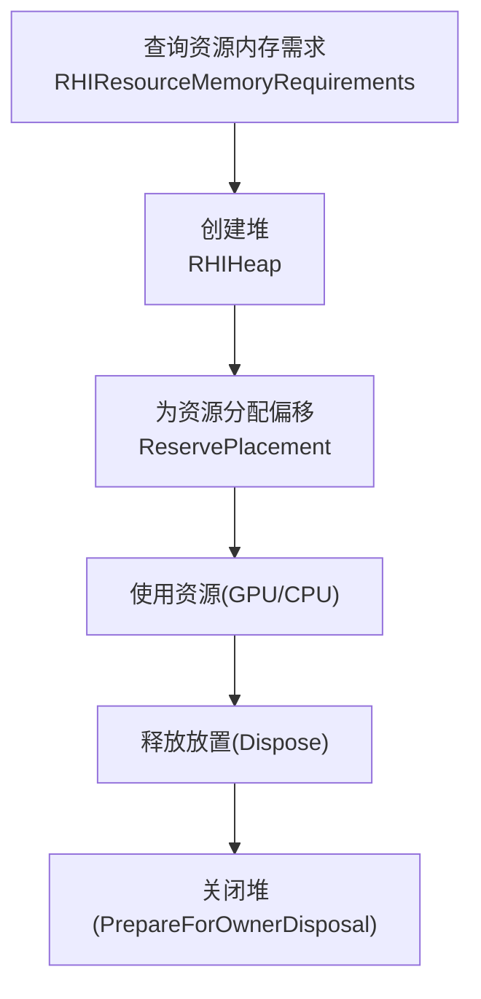
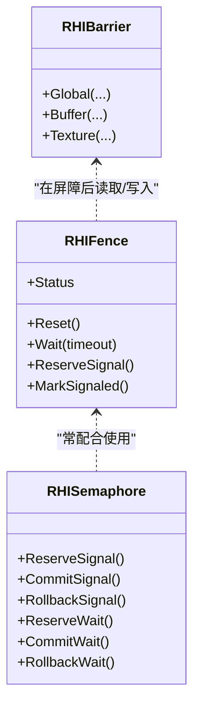
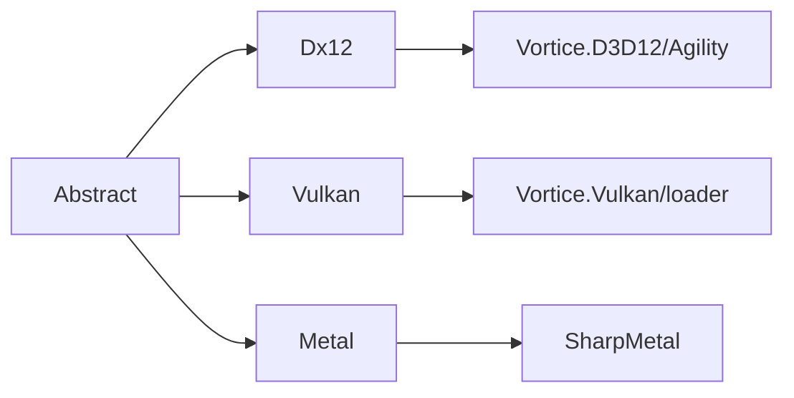

# 核心概念

<cite>
**本文引用的文件**
- [RHIInstance.cs](file://src/SharpGPU/Abstract/RHIInstance.cs)
- [RHIDevice.cs](file://src/SharpGPU/Abstract/RHIDevice.cs)
- [RHICommandBuffer.cs](file://src/SharpGPU/Abstract/RHICommandBuffer.cs)
- [RHICommandQueue.cs](file://src/SharpGPU/Abstract/RHICommandQueue.cs)
- [RHIMemory.cs](file://src/SharpGPU/Abstract/RHIMemory.cs)
- [RHISynchronous.cs](file://src/SharpGPU/Abstract/RHISynchronous.cs)
- [Dx12Instance.cs](file://src/SharpGPU/Dx12/Dx12Instance.cs)
- [VulkanInstance.cs](file://src/SharpGPU/Vulkan/VulkanInstance.cs)
- [MetalInstance.cs](file://src/SharpGPU/Metal/MetalInstance.cs)
- [README.md](file://README.md)
</cite>

## 目录
1. [简介](#简介)
2. [项目结构](#项目结构)
3. [核心组件](#核心组件)
4. [架构总览](#架构总览)
5. [详细组件分析](#详细组件分析)
6. [依赖关系分析](#依赖关系分析)
7. [性能考量](#性能考量)
8. [故障排查指南](#故障排查指南)
9. [结论](#结论)
10. [附录](#附录)

## 简介
本文件面向希望理解 SharpGPU 核心概念的读者，系统性阐述 GPU 硬件抽象层（HAL）的设计与实现：后端选择、设备发现、命令缓冲与编码、内存模型、同步原语、资源生命周期与异步执行模型。重点解释 RHIInstance、RHIDevice、RHICommandBuffer 等核心抽象的职责与协作方式，并对比 DirectX 12、Vulkan、Metal 三种后端的抽象差异与平台约束。文末提供最佳实践与常见问题定位建议。

## 项目结构
SharpGPU 采用“抽象 + 多后端”的层次化组织：
- Abstract：跨后端统一接口（实例、设备、命令缓冲、队列、内存、同步、资源描述等）。
- Dx12 / Vulkan / Metal：具体后端实现（实例枚举、设备创建、命令缓冲与队列、资源管理等）。
- Common/Core：通用基础类型与工具（如 Disposal、集合、数学等）。
- samples/benchmarks/tests：示例、基准与一致性测试。

图表来源
- [RHIInstance.cs:46-156](file://src/SharpGPU/Abstract/RHIInstance.cs#L46-L156)
- [RHIDevice.cs:422-594](file://src/SharpGPU/Abstract/RHIDevice.cs#L422-L594)
- [RHICommandBuffer.cs:26-190](file://src/SharpGPU/Abstract/RHICommandBuffer.cs#L26-L190)
- [RHICommandQueue.cs:60-108](file://src/SharpGPU/Abstract/RHICommandQueue.cs#L60-L108)
- [RHIMemory.cs:173-333](file://src/SharpGPU/Abstract/RHIMemory.cs#L173-L333)
- [RHISynchronous.cs:14-280](file://src/SharpGPU/Abstract/RHISynchronous.cs#L14-L280)

章节来源
- [README.md:1-23](file://README.md#L1-L23)

## 核心组件
- RHIInstance：后端入口，负责平台检测、后端选择、实例初始化与设备枚举。
- RHIDevice：设备抽象，暴露能力查询、资源创建（缓冲区、纹理、堆、查询等）、时钟校准、交换链等。
- RHICommandBuffer：命令缓冲状态机，管理 Begin/End 与各 Pass 编码器的开启/结束，保证正确的录制顺序。
- RHICommandQueue：队列抽象，负责将已结束的 CommandBuffer 提交到 GPU，并处理等待/信号等同步对象。
- 内存模型：通过 RHIResourceMemoryRequirements 与 RHIHeap 解耦资源大小/对齐与物理堆分配；支持 Committed/Placed/Sparse/External 多种分配模式。
- 同步原语：Fence、Semaphore、Barrier（全局/缓冲/纹理），以及阶段/访问掩码与布局转换，确保跨阶段与跨队列的正确数据可见性。

章节来源
- [RHIInstance.cs:46-156](file://src/SharpGPU/Abstract/RHIInstance.cs#L46-L156)
- [RHIDevice.cs:422-800](file://src/SharpGPU/Abstract/RHIDevice.cs#L422-L800)
- [RHICommandBuffer.cs:26-190](file://src/SharpGPU/Abstract/RHICommandBuffer.cs#L26-L190)
- [RHICommandQueue.cs:60-519](file://src/SharpGPU/Abstract/RHICommandQueue.cs#L60-L519)
- [RHIMemory.cs:23-333](file://src/SharpGPU/Abstract/RHIMemory.cs#L23-L333)
- [RHISynchronous.cs:282-660](file://src/SharpGPU/Abstract/RHISynchronous.cs#L282-L660)

## 架构总览
SharpGPU 以“后端无关的 HAL 抽象”为核心，上层仅依赖 Abstract 命名空间；不同后端在各自子目录中实现具体细节。实例创建时根据平台与配置选择后端，随后枚举设备并创建设备对象。设备负责资源与队列，命令缓冲由队列创建并在其上录制 Pass，最终提交到 GPU。

图表来源
- [RHIInstance.cs:122-156](file://src/SharpGPU/Abstract/RHIInstance.cs#L122-L156)
- [RHICommandQueue.cs:107-108](file://src/SharpGPU/Abstract/RHICommandQueue.cs#L107-L108)
- [RHICommandBuffer.cs:170-190](file://src/SharpGPU/Abstract/RHICommandBuffer.cs#L170-L190)

## 详细组件分析

### RHIInstance：后端入口与设备枚举
- 职责
  - 平台检测与后端选择：根据操作系统与配置返回合适的后端（Windows 默认 DX12，macOS/iOS 默认 Metal，Linux/Android 默认 Vulkan）。
  - 实例创建：校验后端是否受支持，按后端构造具体实例。
  - 设备枚举：后端实例内部维护设备列表并提供索引访问。
- 关键点
  - IsBackendSupported：对每个后端进行平台限制检查。
  - GetBackendByPlatform：基于平台决定首选后端。
  - Create：工厂方法，按后端分发到 MetalInstance/VulkanInstance/Dx12Instance。
- 后端差异
  - DX12：使用 Agility SDK 获取设备工厂，可启用调试层与 GPU 验证。
  - Vulkan：动态加载 loader，枚举扩展与层，按需启用 DebugUtils 与 Portability。
  - Metal：通过系统 API 枚举 MTLDevice，若无可用设备则回退到默认设备。

图表来源
- [RHIInstance.cs:59-120](file://src/SharpGPU/Abstract/RHIInstance.cs#L59-L120)
- [RHIInstance.cs:122-156](file://src/SharpGPU/Abstract/RHIInstance.cs#L122-L156)
- [Dx12Instance.cs:20-130](file://src/SharpGPU/Dx12/Dx12Instance.cs#L20-L130)
- [VulkanInstance.cs:74-85](file://src/SharpGPU/Vulkan/VulkanInstance.cs#L74-L85)
- [MetalInstance.cs:16-54](file://src/SharpGPU/Metal/MetalInstance.cs#L16-L54)

章节来源
- [RHIInstance.cs:46-156](file://src/SharpGPU/Abstract/RHIInstance.cs#L46-L156)
- [Dx12Instance.cs:1-131](file://src/SharpGPU/Dx12/Dx12Instance.cs#L1-L131)
- [VulkanInstance.cs:1-85](file://src/SharpGPU/Vulkan/VulkanInstance.cs#L1-L85)
- [MetalInstance.cs:1-79](file://src/SharpGPU/Metal/MetalInstance.cs#L1-L79)

### RHIDevice：设备能力与资源工厂
- 职责
  - 暴露设备信息：名称、厂商/设备 ID、驱动版本、类型、后端类型、能力集、适配器标识、各类队列数量。
  - 资源创建：缓冲区、纹理、堆、查询、交换链、采样器反馈图等。
  - 能力查询：格式支持、MSAA 解析支持、栅格附件支持、时钟校准、协同矩阵配置等。
  - 设备丢失诊断：标记丢失状态并对外抛出诊断异常。
- 关键点
  - 严格的参数校验：纹理用途、查询描述、采样器反馈配对等均在创建期验证。
  - 能力门控：通过 Capabilities 与 Limit 控制可选特性可用性。
- 后端差异
  - 各后端实现具体的 Create* 方法与 Query* 逻辑，但对外契约一致。

图表来源
- [RHIDevice.cs:422-800](file://src/SharpGPU/Abstract/RHIDevice.cs#L422-L800)

章节来源
- [RHIDevice.cs:422-800](file://src/SharpGPU/Abstract/RHIDevice.cs#L422-L800)

### RHICommandBuffer：命令录制状态机
- 职责
  - 管理录制生命周期：Initial → Recording → Executable → Submitted。
  - 管理活跃编码器：一次只能有一个活跃的 Pass 编码器（Transfer/Compute/RayTracing/Raster/ML/WorkGraph）。
  - 提供 Begin/End 与各 Pass 的 Begin*/End* 方法，确保正确顺序。
- 关键点
  - 严格的状态检查：未 Begin 不能开始编码器；有活跃编码器不能结束缓冲；只有 Executable 才能提交。
  - 提交后回调：OnSubmitted 供后端做清理或状态更新。
- 典型流程
  - Begin → BeginRasterPass/BeginComputePass... → End*Pass → End → Submit。

图表来源
- [RHICommandBuffer.cs:6-163](file://src/SharpGPU/Abstract/RHICommandBuffer.cs#L6-L163)
- [RHICommandBuffer.cs:170-190](file://src/SharpGPU/Abstract/RHICommandBuffer.cs#L170-L190)

章节来源
- [RHICommandBuffer.cs:26-190](file://src/SharpGPU/Abstract/RHICommandBuffer.cs#L26-L190)

### RHICommandQueue：提交与同步编排
- 职责
  - 创建命令缓冲并提交到 GPU。
  - 提交前校验：命令缓冲归属、重复提交、同步对象有效性、阶段掩码合法性。
  - 提交过程：预留/提交/回滚语义，确保原子性与一致性。
- 关键点
  - 同步对象：等待/信号信号量、完成栅栏，均需在同一设备上创建。
  - 稀疏绑定：可选的 BindSparse 用于显式队列序的稀疏纹理绑定。
- 提交流程

图表来源
- [RHICommandQueue.cs:118-330](file://src/SharpGPU/Abstract/RHICommandQueue.cs#L118-L330)

章节来源
- [RHICommandQueue.cs:60-519](file://src/SharpGPU/Abstract/RHICommandQueue.cs#L60-L519)

### 内存模型：堆、需求与稀疏纹理
- 资源内存需求：RHIResourceMemoryRequirements 描述 Size、Alignment、StorageMode、兼容性掩码等，屏蔽后端私有内存类。
- 堆与放置：RHIHeap 持有原生堆，并通过 ReservePlacement 为“放置型”资源分配偏移与范围，防止重叠与越界。
- 稀疏纹理：RHISparseTextureMemoryRequirements 描述虚拟大小、瓦片大小/范围、子资源瓦片网格与 mip tail 信息；配合队列序绑定/解绑。
- 关键约束
  - 堆与需求的存储模式必须匹配。
  - 偏移与大小需满足对齐要求。
  - 释放堆前需确保无活跃放置资源。

图表来源
- [RHIMemory.cs:23-116](file://src/SharpGPU/Abstract/RHIMemory.cs#L23-L116)
- [RHIMemory.cs:173-333](file://src/SharpGPU/Abstract/RHIMemory.cs#L173-L333)
- [RHIMemory.cs:335-457](file://src/SharpGPU/Abstract/RHIMemory.cs#L335-L457)
- [RHIMemory.cs:515-748](file://src/SharpGPU/Abstract/RHIMemory.cs#L515-L748)

章节来源
- [RHIMemory.cs:23-800](file://src/SharpGPU/Abstract/RHIMemory.cs#L23-L800)

### 同步原语：栅栏、信号量与屏障
- Fence：二元生命周期（Ready/Pending/Signaled/Resetting），提供 Wait/Reset/MarkSignaled 等方法，用于完成通知。
- Semaphore：二进制信号量，支持等待/信号的生命周期管理与原子预留/提交/回滚。
- Barrier：全局/缓冲/纹理三类屏障，指定阶段掩码、访问掩码与纹理布局转换，支持跨队列所有权转移。
- 关键规则
  - 栅栏重置前需等待其 pending signal 完成。
  - 信号量不可在未消费 prior signal 的情况下重复信号。
  - 队列所有权转移需同时指定源/目的队列且不同。

图表来源
- [RHISynchronous.cs:14-280](file://src/SharpGPU/Abstract/RHISynchronous.cs#L14-L280)
- [RHISynchronous.cs:282-660](file://src/SharpGPU/Abstract/RHISynchronous.cs#L282-L660)

章节来源
- [RHISynchronous.cs:14-660](file://src/SharpGPU/Abstract/RHISynchronous.cs#L14-L660)

### 后端抽象与差异处理
- 平台与后端选择
  - Windows：优先 DirectX12；若禁用或不可用可回退。
  - macOS/iOS：优先 Metal；也可强制 Vulkan。
  - Linux/Android：使用 Vulkan。
- 后端初始化差异
  - DX12：通过 Agility SDK 获取设备工厂，支持调试层与 GPU 验证开关。
  - Vulkan：动态加载 loader，枚举实例扩展与层，按需启用 DebugUtils 与 Portability；支持 Headless 与非 Headless 表面。
  - Metal：枚举系统设备，若无可用设备则创建默认设备。
- 共同点
  - 均实现 RHIInstance 抽象，暴露 DeviceCount 与 GetDevice。
  - 均遵循相同的设备/队列/命令缓冲/内存/同步契约。

章节来源
- [RHIInstance.cs:59-120](file://src/SharpGPU/Abstract/RHIInstance.cs#L59-L120)
- [Dx12Instance.cs:20-131](file://src/SharpGPU/Dx12/Dx12Instance.cs#L20-L131)
- [VulkanInstance.cs:74-85](file://src/SharpGPU/Vulkan/VulkanInstance.cs#L74-L85)
- [MetalInstance.cs:16-54](file://src/SharpGPU/Metal/MetalInstance.cs#L16-L54)

## 依赖关系分析
- 耦合与内聚
  - Abstract 层高度内聚，定义稳定契约；后端实现低耦合，仅依赖抽象。
  - 设备与队列强关联：命令缓冲由队列创建，提交时必须属于同一队列。
  - 内存与资源：资源需求来自设备查询，堆由设备创建，放置资源与堆生命周期紧密绑定。
- 外部依赖
  - DX12：Vortice.Direct3D12、Agility SDK。
  - Vulkan：Vortice.Vulkan、动态加载 loader。
  - Metal：SharpMetal 绑定。
- 潜在循环依赖
  - 当前设计避免循环：上层不依赖后端，后端仅依赖抽象。

图表来源
- [Dx12Instance.cs:1-131](file://src/SharpGPU/Dx12/Dx12Instance.cs#L1-L131)
- [VulkanInstance.cs:1-85](file://src/SharpGPU/Vulkan/VulkanInstance.cs#L1-L85)
- [MetalInstance.cs:1-79](file://src/SharpGPU/Metal/MetalInstance.cs#L1-L79)

章节来源
- [Dx12Instance.cs:1-131](file://src/SharpGPU/Dx12/Dx12Instance.cs#L1-L131)
- [VulkanInstance.cs:1-85](file://src/SharpGPU/Vulkan/VulkanInstance.cs#L1-L85)
- [MetalInstance.cs:1-79](file://src/SharpGPU/Metal/MetalInstance.cs#L1-L79)

## 性能考量
- 命令缓冲复用：尽量复用 CommandBuffer 以减少分配与重建开销。
- 批处理与合并：在同一 Pass 中合并相近状态的绘制/计算调用，减少状态切换。
- 内存对齐与布局：遵循资源需求中的对齐要求，合理选择纹理布局以降低转置成本。
- 同步最小化：仅在必要时插入屏障，利用阶段/访问掩码精确表达依赖。
- 队列并行：将传输、计算、图形任务分配到不同队列以提升吞吐。
- 稀疏纹理：对大纹理使用稀疏绑定，按需驻留，降低显存占用。

[本节为通用指导，不直接分析具体文件]

## 故障排查指南
- 设备丢失
  - 现象：后续操作抛出设备不可用异常。
  - 定位：检查 RHIDevice 的 DeviceLossDiagnostic 与 State。
  - 参考
    - [RHIDevice.cs:465-525](file://src/SharpGPU/Abstract/RHIDevice.cs#L465-L525)
- 命令缓冲提交失败
  - 现象：提交时报错“命令缓冲未结束”或“不属于该队列”。
  - 定位：确认 End() 已调用，且 CommandBuffer.CommandQueue 与提交队列一致。
  - 参考
    - [RHICommandBuffer.cs:122-163](file://src/SharpGPU/Abstract/RHICommandBuffer.cs#L122-L163)
    - [RHICommandQueue.cs:118-164](file://src/SharpGPU/Abstract/RHICommandQueue.cs#L118-L164)
- 同步对象生命周期
  - 现象：栅栏/信号量重复信号或未就绪等待。
  - 定位：检查 Reserve/Commit/Rollback 的使用顺序与状态机。
  - 参考
    - [RHISynchronous.cs:14-280](file://src/SharpGPU/Abstract/RHISynchronous.cs#L14-L280)
- 内存越界与重叠
  - 现象：放置资源重叠或超出堆大小。
  - 定位：检查 ReservePlacement 的参数与堆大小。
  - 参考
    - [RHIMemory.cs:375-457](file://src/SharpGPU/Abstract/RHIMemory.cs#L375-L457)
- 后端不可用
  - 现象：平台不支持所选后端。
  - 定位：使用 IsBackendSupported 检查原因。
  - 参考
    - [RHIInstance.cs:59-93](file://src/SharpGPU/Abstract/RHIInstance.cs#L59-L93)

章节来源
- [RHIDevice.cs:465-525](file://src/SharpGPU/Abstract/RHIDevice.cs#L465-L525)
- [RHICommandBuffer.cs:122-163](file://src/SharpGPU/Abstract/RHICommandBuffer.cs#L122-L163)
- [RHICommandQueue.cs:118-164](file://src/SharpGPU/Abstract/RHICommandQueue.cs#L118-L164)
- [RHISynchronous.cs:14-280](file://src/SharpGPU/Abstract/RHISynchronous.cs#L14-L280)
- [RHIMemory.cs:375-457](file://src/SharpGPU/Abstract/RHIMemory.cs#L375-L457)
- [RHIInstance.cs:59-93](file://src/SharpGPU/Abstract/RHIInstance.cs#L59-L93)

## 结论
SharpGPU 通过稳定的 HAL 抽象与多后端实现，提供了跨平台的 GPU 编程能力。RHIInstance、RHIDevice、RHICommandBuffer、RHICommandQueue 构成核心骨架；内存模型与同步原语确保资源安全与执行正确性。DX12、Vulkan、Metal 的差异被封装在后端层，上层代码可专注于渲染与计算逻辑。遵循本文的最佳实践与故障排查建议，可在不同平台上获得稳定高效的 GPU 执行体验。

[本节为总结，不直接分析具体文件]

## 附录
- 快速开始与功能矩阵请参考仓库文档。
- 构建与验证流程见 docs/VERIFICATION.md。
- 示例工程位于 samples/ComputeAndDraw。

[本节为补充说明，不直接分析具体文件]