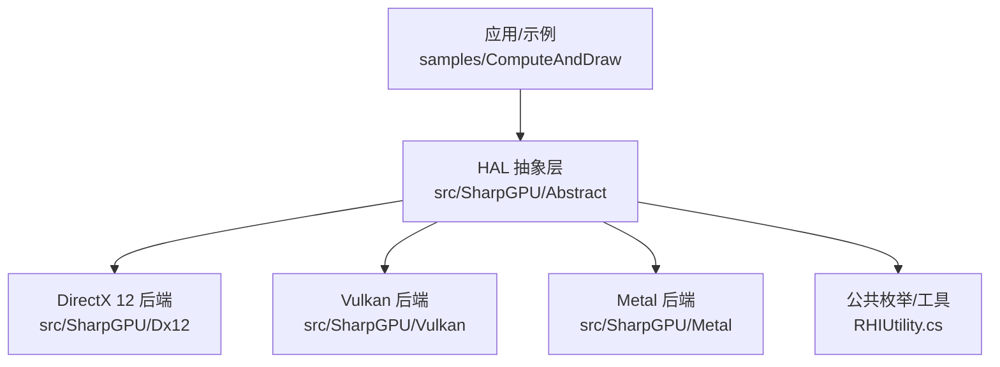
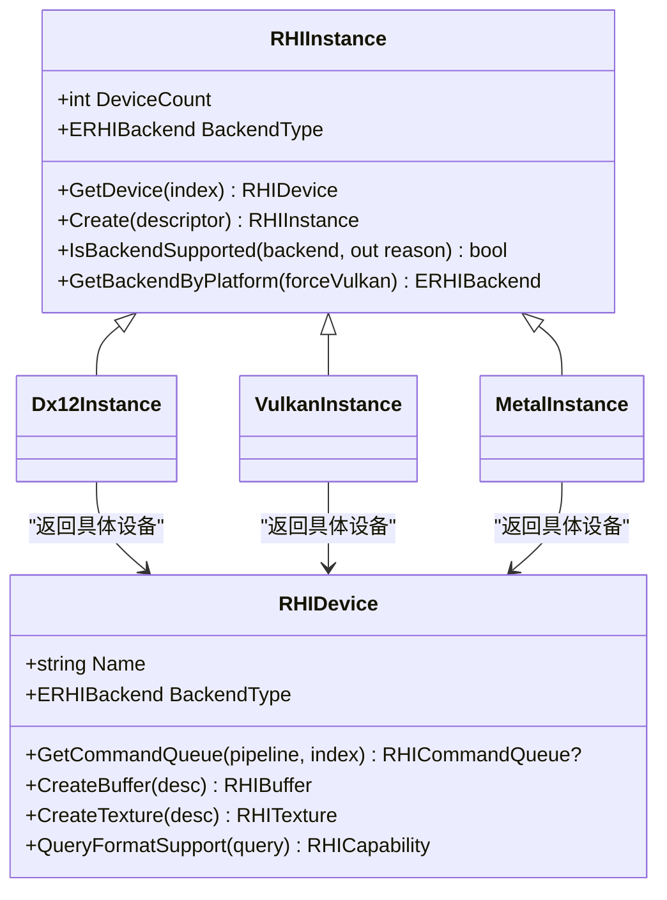
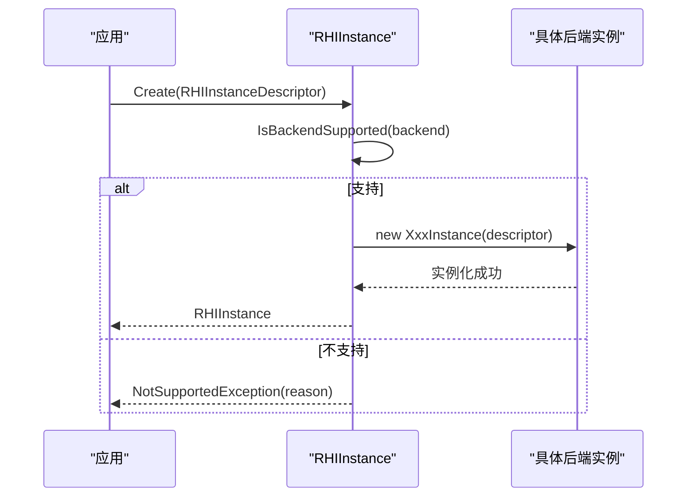
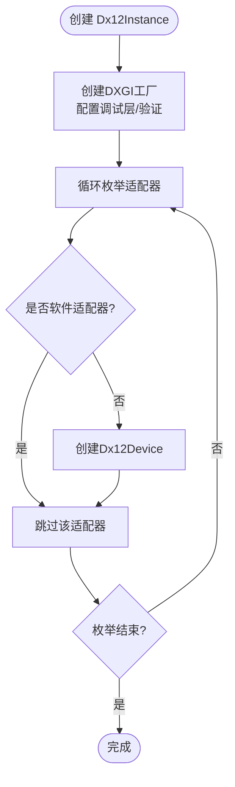
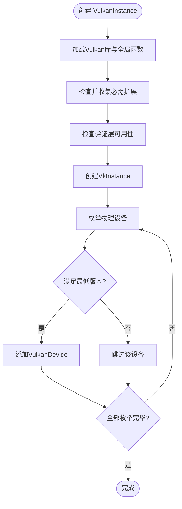
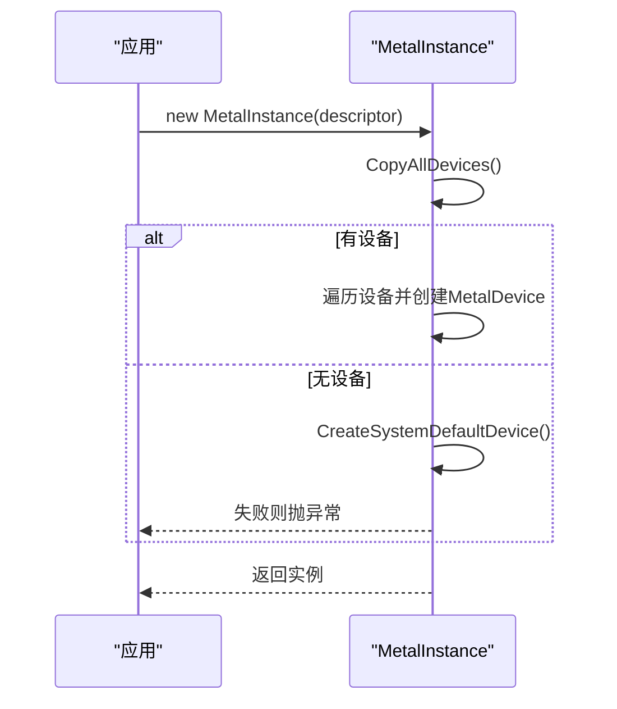
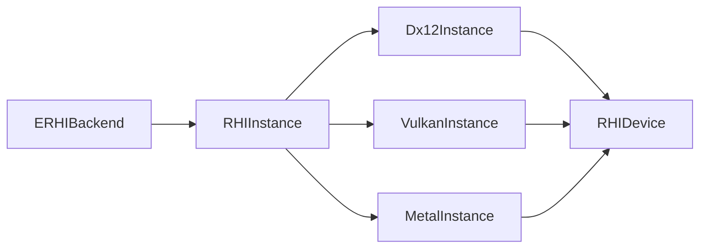

# 硬件抽象层概念

<cite>
**本文引用的文件**
- [RHIInstance.cs](file://src/SharpGPU/Abstract/RHIInstance.cs)
- [Dx12Instance.cs](file://src/SharpGPU/Dx12/Dx12Instance.cs)
- [VulkanInstance.cs](file://src/SharpGPU/Vulkan/VulkanInstance.cs)
- [MetalInstance.cs](file://src/SharpGPU/Metal/MetalInstance.cs)
- [RHIUtility.cs](file://src/SharpGPU/Abstract/RHIUtility.cs)
- [RHIDevice.cs](file://src/SharpGPU/Abstract/RHIDevice.cs)
- [Program.cs](file://samples/ComputeAndDraw/Program.cs)
- [RasterWorkload.cs](file://samples/ComputeAndDraw/RasterWorkload.cs)
- [README.md](file://README.md)
</cite>

## 目录
1. [简介](#简介)
2. [项目结构](#项目结构)
3. [核心组件](#核心组件)
4. [架构总览](#架构总览)
5. [详细组件分析](#详细组件分析)
6. [依赖关系分析](#依赖关系分析)
7. [性能与兼容性考量](#性能与兼容性考量)
8. [故障排查指南](#故障排查指南)
9. [结论](#结论)
10. [附录：示例用法路径](#附录示例用法路径)

## 简介
本文件聚焦于 SharpGPU 的硬件抽象层（HAL）概念，解释为何需要 GPU HAL、它如何统一 DirectX 12、Vulkan、Metal 的差异，并深入剖析 RHIInstance 的设计模式、后端选择机制、平台检测与兼容性处理。同时说明抽象层如何屏蔽底层 API 复杂性并提供统一的编程接口，附带具体代码示例路径以展示创建实例、检测后端支持、枚举设备等核心操作。

## 项目结构
SharpGPU 将 HAL 抽象定义放在 src/SharpGPU/Abstract 下，各后端实现分别位于 Dx12、Vulkan、Metal 子目录；示例位于 samples/ComputeAndDraw；文档与构建脚本在 docs 与 eng 等目录。

图表来源
- [RHIInstance.cs:46-156](file://src/SharpGPU/Abstract/RHIInstance.cs#L46-L156)
- [Dx12Instance.cs:9-131](file://src/SharpGPU/Dx12/Dx12Instance.cs#L9-L131)
- [VulkanInstance.cs:9-680](file://src/SharpGPU/Vulkan/VulkanInstance.cs#L9-L680)
- [MetalInstance.cs:9-77](file://src/SharpGPU/Metal/MetalInstance.cs#L9-L77)
- [RHIUtility.cs:24-30](file://src/SharpGPU/Abstract/RHIUtility.cs#L24-L30)

章节来源
- [README.md:1-23](file://README.md#L1-L23)

## 核心组件
- RHIInstance：HAL 入口，负责后端选择、平台检测、设备枚举与生命周期管理。
- 后端实例：Dx12Instance、VulkanInstance、MetalInstance，各自封装对应原生 API 的初始化、扩展/层检查、设备枚举与资源释放。
- RHIDevice：抽象设备接口，向上暴露统一能力查询、队列、内存、纹理/缓冲、管线等 API。
- ERHIBackend：后端枚举，用于跨平台分支与配置。

章节来源
- [RHIInstance.cs:46-156](file://src/SharpGPU/Abstract/RHIInstance.cs#L46-L156)
- [RHIUtility.cs:24-30](file://src/SharpGPU/Abstract/RHIUtility.cs#L24-L30)
- [RHIDevice.cs:422-543](file://src/SharpGPU/Abstract/RHIDevice.cs#L422-L543)

## 架构总览
SharpGPU 采用“工厂 + 策略”的 HAL 架构：
- 通过 RHIInstance.Create 根据描述符选择具体后端实例。
- 每个后端实例完成自身平台的初始化、能力探测与设备枚举。
- 上层仅依赖抽象接口（RHIInstance/RHIDevice），屏蔽 DirectX 12、Vulkan、Metal 差异。

图表来源
- [RHIInstance.cs:46-156](file://src/SharpGPU/Abstract/RHIInstance.cs#L46-L156)
- [RHIDevice.cs:422-543](file://src/SharpGPU/Abstract/RHIDevice.cs#L422-L543)

## 详细组件分析

### RHIInstance：后端选择与平台检测
- 设计模式：静态工厂 Create 接收 RHIInstanceDescriptor，校验后端合法性与平台支持后，按后端类型构造具体实例。
- 平台检测：ResolveCurrentPlatform 识别 Windows/Linux/macOS/iOS/Android；IsBackendSupported 对每种后端做最小平台约束检查（如 DX12 仅限 Windows，Metal 仅限 macOS/iOS）。
- 默认后端：GetBackendByPlatform 提供基于平台的默认后端选择逻辑（Windows->DX12，macOS/iOS->Metal，Linux/Android->Vulkan）。
- 设备访问：DeviceCount 与 GetDevice 暴露后端设备列表。

图表来源
- [RHIInstance.cs:59-156](file://src/SharpGPU/Abstract/RHIInstance.cs#L59-L156)

章节来源
- [RHIInstance.cs:59-156](file://src/SharpGPU/Abstract/RHIInstance.cs#L59-L156)

### DirectX 12 后端：工厂与适配器枚举
- 使用 DXGI 工厂枚举适配器，跳过软件适配器，为每个硬件适配器创建设备对象。
- 可选启用调试层与 GPU 验证（Agility SDK），失败时给出明确诊断信息。
- 设备丢失与资源释放由 Release 统一管理。

图表来源
- [Dx12Instance.cs:20-131](file://src/SharpGPU/Dx12/Dx12Instance.cs#L20-L131)

章节来源
- [Dx12Instance.cs:20-131](file://src/SharpGPU/Dx12/Dx12Instance.cs#L20-L131)

### Vulkan 后端：扩展/层检查与物理设备枚举
- 启动阶段动态加载 Vulkan loader，获取全局函数指针。
- 根据 SurfaceKind 要求启用必要扩展（如 VK_KHR_surface、平台特定 surface 扩展），可选启用 VK_EXT_debug_utils。
- 若启用验证层，则检查并注入 Khronos 验证层。
- 枚举物理设备，过滤不满足最低版本要求的设备（例如 Android 要求 Vulkan 1.1+）。
- 提供 DebugUtils 标签注入能力（可选）。

图表来源
- [VulkanInstance.cs:127-418](file://src/SharpGPU/Vulkan/VulkanInstance.cs#L127-L418)

章节来源
- [VulkanInstance.cs:127-418](file://src/SharpGPU/Vulkan/VulkanInstance.cs#L127-L418)

### Metal 后端：设备发现与默认设备回退
- 尝试枚举所有 MTLDevice；若无可用设备，则回退到系统默认设备。
- 为每个有效设备创建 MetalDevice，并在无可用设备时抛出明确异常。

图表来源
- [MetalInstance.cs:16-54](file://src/SharpGPU/Metal/MetalInstance.cs#L16-L54)

章节来源
- [MetalInstance.cs:16-54](file://src/SharpGPU/Metal/MetalInstance.cs#L16-L54)

### 统一设备接口：RHIDevice
- 暴露后端无关的设备属性（名称、厂商、驱动版本、类型、后端类型、队列数量等）。
- 提供能力查询（格式支持、MSAA解析支持、栅格附件支持）、同步原语（Fence/Semaphore）、资源创建（Buffer/Texture/Heap/Query）等统一方法。
- 设备状态管理与丢失诊断：内部维护设备状态与诊断信息，对外提供不可用时的强一致错误传播。

章节来源
- [RHIDevice.cs:422-800](file://src/SharpGPU/Abstract/RHIDevice.cs#L422-L800)

## 依赖关系分析
- RHIInstance 依赖 ERHIBackend 枚举进行分支；不同后端实现各自依赖其原生绑定（Vortice.Direct3D12、Vortice.Vulkan、SharpMetal）。
- 后端实例通过 RHIDevice 抽象向上传递设备能力，避免上层耦合具体后端。
- 示例程序通过 RHIInstance.IsBackendSupported 与 RHIInstance.Create 组合，实现运行时后端选择与健壮性。

图表来源
- [RHIUtility.cs:24-30](file://src/SharpGPU/Abstract/RHIUtility.cs#L24-L30)
- [RHIInstance.cs:46-156](file://src/SharpGPU/Abstract/RHIInstance.cs#L46-L156)
- [RHIDevice.cs:422-543](file://src/SharpGPU/Abstract/RHIDevice.cs#L422-L543)

章节来源
- [RHIUtility.cs:24-30](file://src/SharpGPU/Abstract/RHIUtility.cs#L24-L30)
- [RHIInstance.cs:46-156](file://src/SharpGPU/Abstract/RHIInstance.cs#L46-L156)
- [RHIDevice.cs:422-543](file://src/SharpGPU/Abstract/RHIDevice.cs#L422-L543)

## 性能与兼容性考量
- 后端选择：优先使用平台最优后端（Windows->DX12，macOS/iOS->Metal，Linux/Android->Vulkan），减少兼容层开销。
- 调试与验证：仅在开发或问题定位时启用调试层/验证层，避免生产环境额外开销。
- 设备过滤：跳过软件适配器与不满足最低版本的设备，确保运行在高性能硬件上。
- 扩展按需启用：Vulkan 仅启用必要扩展，降低初始化成本与潜在冲突。

[本节为通用指导，不直接分析具体文件]

## 故障排查指南
- 后端不支持：当 IsBackendSupported 返回 false 时，根据 reason 提示调整平台或后端选择。
- DX12 调试层不可用：若请求调试层但 Agility SDK 未就绪，会抛出包含 HRESULT 的诊断信息，需检查输出目录是否存在 D3D12Core.dll。
- Vulkan 验证层缺失：若启用验证但未安装 Khronos 验证层，会抛出明确异常，需安装或外部注入。
- 设备丢失：RHIDevice 内部维护设备状态与诊断，调用前会检查并抛出携带后端与状态的异常，便于快速定位。

章节来源
- [Dx12Instance.cs:26-76](file://src/SharpGPU/Dx12/Dx12Instance.cs#L26-L76)
- [VulkanInstance.cs:183-229](file://src/SharpGPU/Vulkan/VulkanInstance.cs#L183-L229)
- [RHIDevice.cs:465-525](file://src/SharpGPU/Abstract/RHIDevice.cs#L465-L525)

## 结论
SharpGPU 的 HAL 通过 RHIInstance 的统一工厂与后端策略，屏蔽了 DirectX 12、Vulkan、Metal 的差异，提供一致的实例创建、设备枚举、能力查询与资源管理接口。结合平台检测与兼容性处理，使上层应用能够以跨平台方式高效利用 GPU 能力，同时保留针对特定后端的优化空间。

[本节为总结，不直接分析具体文件]

## 附录：示例用法路径
- 创建实例与检测后端支持：
  - 示例入口遍历后端并调用 IsBackendSupported，再运行对应负载。
  - 参考路径：[Program.cs:7-15](file://samples/ComputeAndDraw/Program.cs#L7-L15)
- 创建实例、获取设备与队列：
  - 使用 RHIInstance.Create 传入 RHIInstanceDescriptor，获取设备与图形队列。
  - 参考路径：[RasterWorkload.cs:37-46](file://samples/ComputeAndDraw/RasterWorkload.cs#L37-L46)
- 设备能力与统计：
  - 查询统计能力、创建 Query、提交命令并读取结果。
  - 参考路径：[RasterWorkload.cs:47-160](file://samples/ComputeAndDraw/RasterWorkload.cs#L47-L160)

章节来源
- [Program.cs:7-15](file://samples/ComputeAndDraw/Program.cs#L7-L15)
- [RasterWorkload.cs:37-160](file://samples/ComputeAndDraw/RasterWorkload.cs#L37-L160)