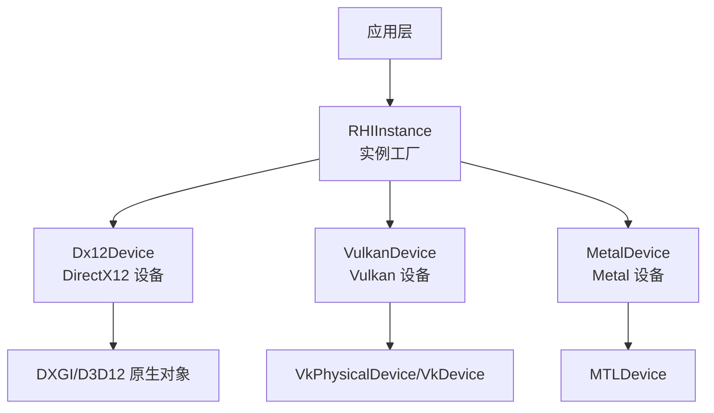
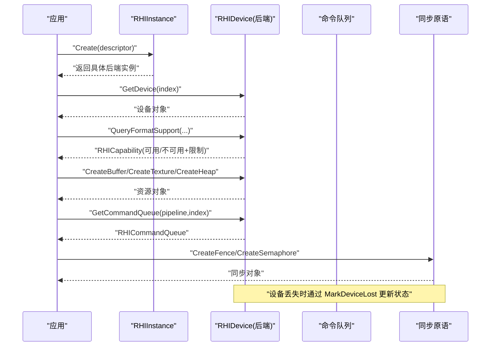
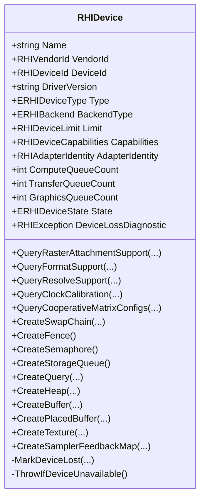
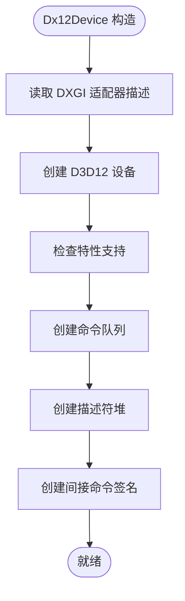
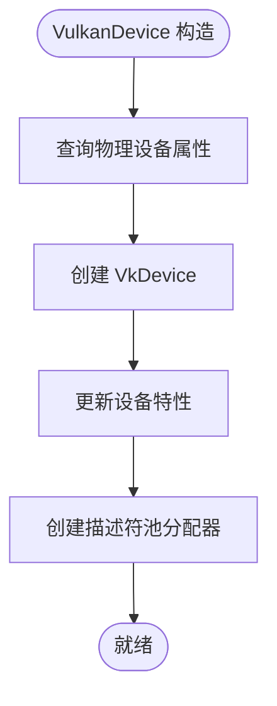
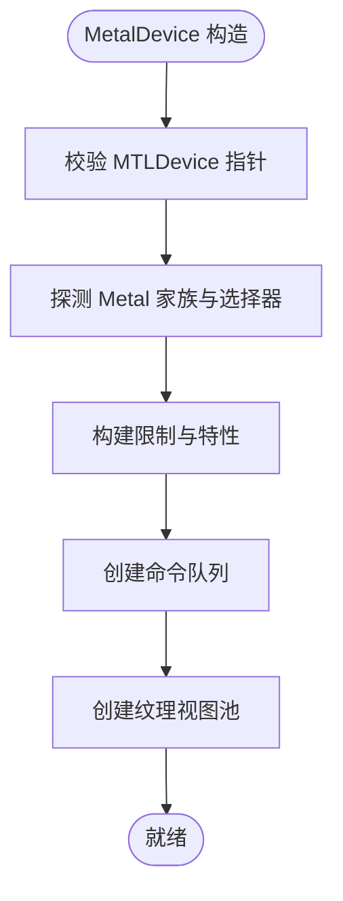
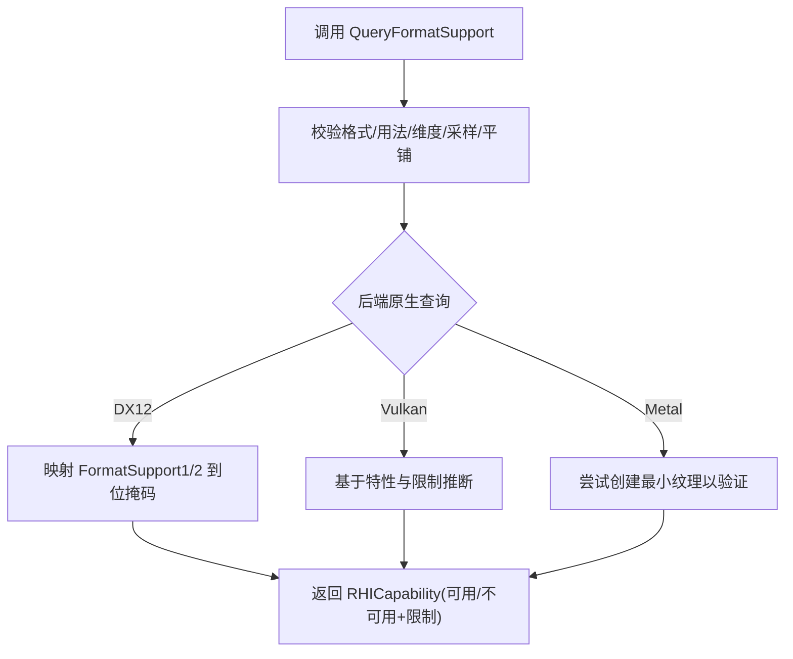
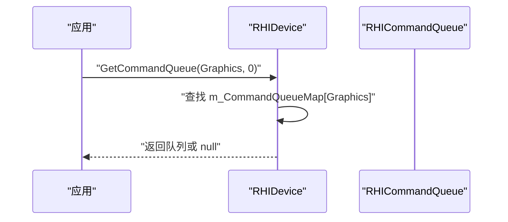
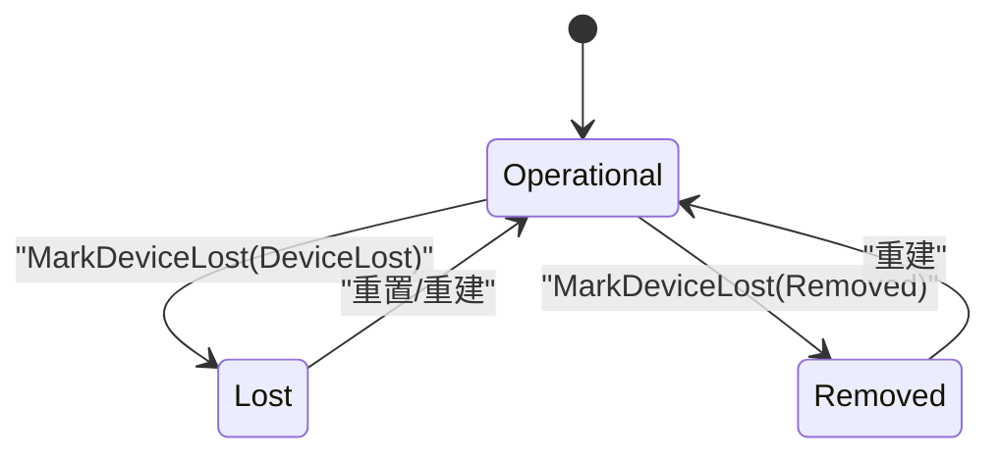

# 设备管理

<cite>
**本文引用的文件**
- [RHIDevice.cs](file://src/SharpGPU/Abstract/RHIDevice.cs)
- [RHIInstance.cs](file://src/SharpGPU/Abstract/RHIInstance.cs)
- [Dx12Device.cs](file://src/SharpGPU/Dx12/Dx12Device.cs)
- [VulkanDevice.cs](file://src/SharpGPU/Vulkan/VulkanDevice.cs)
- [MetalDevice.cs](file://src/SharpGPU/Metal/MetalDevice.cs)
- [RHISynchronous.cs](file://src/SharpGPU/Abstract/RHISynchronous.cs)
- [FeatureMatrix.md](file://docs/SharpGPU/FeatureMatrix.md)
</cite>

## 目录
1. [简介](#简介)
2. [项目结构](#项目结构)
3. [核心组件](#核心组件)
4. [架构总览](#架构总览)
5. [详细组件分析](#详细组件分析)
6. [依赖关系分析](#依赖关系分析)
7. [性能考量](#性能考量)
8. [故障排查指南](#故障排查指南)
9. [结论](#结论)
10. [附录：代码示例路径](#附录代码示例路径)

## 简介
本文件聚焦 SharpGPU 的设备管理能力，围绕抽象设备 RHIDevice 的设计与实现，系统阐述设备能力查询、特性探测、队列配置、后端初始化流程、适配器识别、设备选择与配置选项、生命周期管理、错误处理与调试支持。文档同时提供设备能力矩阵、性能特征比较与最佳实践指导，并给出具体代码示例的文件路径以便快速定位实现细节。

## 项目结构
SharpGPU 采用“抽象 HAL + 多后端”分层设计：
- 抽象层（Abstract）：定义跨后端的统一接口与数据结构，如 RHIDevice、RHIInstance、同步原语等。
- 后端实现（Dx12 / Vulkan / Metal）：分别对接 DirectX12、Vulkan、Metal 原生 API，实现具体的设备创建、能力探测、资源创建与队列管理。
- 文档与矩阵（docs）：公开契约与能力矩阵，用于约束行为与验证平台合格性。



图表来源
- [RHIInstance.cs:122-156](file://src/SharpGPU/Abstract/RHIInstance.cs#L122-L156)
- [Dx12Device.cs:137-158](file://src/SharpGPU/Dx12/Dx12Device.cs#L137-L158)
- [VulkanDevice.cs:182-191](file://src/SharpGPU/Vulkan/VulkanDevice.cs#L182-L191)
- [MetalDevice.cs:55-95](file://src/SharpGPU/Metal/MetalDevice.cs#L55-L95)

章节来源
- [RHIInstance.cs:122-156](file://src/SharpGPU/Abstract/RHIInstance.cs#L122-L156)

## 核心组件
- RHIDevice：抽象设备基类，暴露设备标识、能力、队列数量、状态诊断、资源与队列创建、能力查询等统一入口。
- RHIInstance：后端实例工厂，负责平台检测、后端选择与实例化。
- 后端设备：Dx12Device、VulkanDevice、MetalDevice，分别实现具体后端的能力探测、队列创建、资源创建与错误上报。
- 同步与屏障：RHISynchronous 提供 Fence/Semaphore/Barrier 等通用同步原语，辅助设备生命周期与错误传播。

关键职责划分
- 能力查询：QueryFormatSupport、QueryRasterAttachmentSupport、QueryResolveSupport、QueryClockCalibration、QueryCooperativeMatrixConfigs。
- 资源创建：CreateBuffer/CreateTexture/CreateHeap/CreateFence/CreateSemaphore/CreateStorageQueue/CreateSwapChain/CreateQuery。
- 设备状态：MarkDeviceLost、ThrowIfDeviceUnavailable、State、DeviceLossDiagnostic。
- 队列管理：GetCommandQueue、内部维护的 m_CommandQueueMap。

章节来源
- [RHIDevice.cs:422-800](file://src/SharpGPU/Abstract/RHIDevice.cs#L422-L800)
- [RHIInstance.cs:46-156](file://src/SharpGPU/Abstract/RHIInstance.cs#L46-L156)
- [RHISynchronous.cs:14-176](file://src/SharpGPU/Abstract/RHISynchronous.cs#L14-L176)

## 架构总览
下图展示从应用到后端的设备创建与能力查询主流程，以及设备丢失的诊断传播路径。



图表来源
- [RHIInstance.cs:122-156](file://src/SharpGPU/Abstract/RHIInstance.cs#L122-L156)
- [RHIDevice.cs:527-616](file://src/SharpGPU/Abstract/RHIDevice.cs#L527-L616)
- [RHISynchronous.cs:14-176](file://src/SharpGPU/Abstract/RHISynchronous.cs#L14-L176)

## 详细组件分析

### RHIDevice 抽象类设计
- 设备信息：Name、VendorId、DeviceId、DriverVersion、Type、BackendType、AdapterIdentity。
- 能力与限制：Capabilities、Limit（对齐、MSAA、线程数、纹理尺寸等）。
- 队列计数：ComputeQueueCount、TransferQueueCount、GraphicsQueueCount。
- 生命周期与诊断：State、DeviceLossDiagnostic、MarkDeviceLost、ThrowIfDeviceUnavailable。
- 能力查询：QueryRasterAttachmentSupport、QueryFormatSupport、QueryResolveSupport、QueryClockCalibration、QueryCooperativeMatrixConfigs。
- 资源创建：CreateSwapChain、CreateFence、CreateSemaphore、CreateStorageQueue、CreateQuery、CreateHeap、CreateBuffer、CreatePlacedBuffer、CreateTexture、CreateSamplerFeedbackMap。
- 参数校验：ValidateTextureUsage、ValidateQueryDescriptor、ValidateSamplerFeedbackMapDescriptor、RejectUnpairedSamplerFeedbackTexture。



图表来源
- [RHIDevice.cs:422-800](file://src/SharpGPU/Abstract/RHIDevice.cs#L422-L800)

章节来源
- [RHIDevice.cs:422-800](file://src/SharpGPU/Abstract/RHIDevice.cs#L422-L800)

### 后端设备初始化流程

#### DirectX12 设备
- 构造器中读取 DXGI 适配器描述，设置名称、类型、厂商/设备 ID、驱动版本、适配器身份。
- 创建 D3D12 设备、DirectML 对象、检查特性支持、创建命令队列、描述符堆、间接命令签名。
- 提供 GetCommandQueue、CreateSwapChain、CreateFence、CreateSemaphore、CreateStorageQueue、CreateQuery、CreateHeap、GetBufferMemoryRequirements、GetTextureMemoryRequirements、CreateBuffer、CreatePlacedBuffer、CreateTexture、CreateSamplerFeedbackMap、QueryRasterAttachmentSupport、QueryFormatSupport、QueryResolveSupport 等实现。



图表来源
- [Dx12Device.cs:137-158](file://src/SharpGPU/Dx12/Dx12Device.cs#L137-L158)

章节来源
- [Dx12Device.cs:137-158](file://src/SharpGPU/Dx12/Dx12Device.cs#L137-L158)
- [Dx12Device.cs:180-358](file://src/SharpGPU/Dx12/Dx12Device.cs#L180-L358)
- [Dx12Device.cs:420-759](file://src/SharpGPU/Dx12/Dx12Device.cs#L420-L759)

#### Vulkan 设备
- 构造器中查询物理设备属性、创建逻辑设备、更新设备特性、构建描述符池分配器。
- 在 CreateDevice 中枚举队列族、计算唯一队列族及数量、构建队列创建信息、枚举扩展、构建特性链、查询特性与限制。
- 暴露大量内部能力标志（动态渲染、局部读、渲染通道2、独立深度模板布局、分辨率模式、稀疏绑定、校准时间戳等），用于上层能力判断与策略选择。



图表来源
- [VulkanDevice.cs:182-191](file://src/SharpGPU/Vulkan/VulkanDevice.cs#L182-L191)
- [VulkanDevice.cs:264-473](file://src/SharpGPU/Vulkan/VulkanDevice.cs#L264-L473)

章节来源
- [VulkanDevice.cs:182-191](file://src/SharpGPU/Vulkan/VulkanDevice.cs#L182-L191)
- [VulkanDevice.cs:264-473](file://src/SharpGPU/Vulkan/VulkanDevice.cs#L264-L473)

#### Metal 设备
- 构造器中校验 MTLDevice 指针、设置名称/类型/厂商/设备ID/驱动版本/适配器身份、探测 Metal 家族支持与选择器可用性、探测光栅能力、构建限制与特性、创建命令队列与纹理视图池。
- 提供 GetCommandQueue、CreateSwapChain、CreateFence、CreateSemaphore、CreateStorageQueue、CreateQuery、CreateHeap、GetBufferMemoryRequirements、GetTextureMemoryRequirements、GetSparseTextureMemoryRequirements、CreateSparseTexture、CreateBuffer、CreatePlacedBuffer、CreateTexture、QueryRasterAttachmentSupport、QueryFormatSupport、QueryResolveSupport 等实现。



图表来源
- [MetalDevice.cs:55-95](file://src/SharpGPU/Metal/MetalDevice.cs#L55-L95)

章节来源
- [MetalDevice.cs:55-95](file://src/SharpGPU/Metal/MetalDevice.cs#L55-L95)
- [MetalDevice.cs:170-370](file://src/SharpGPU/Metal/MetalDevice.cs#L170-L370)
- [MetalDevice.cs:372-800](file://src/SharpGPU/Metal/MetalDevice.cs#L372-L800)

### 设备能力查询与特性探测
- 格式支持：QueryFormatSupport 返回精确的 ERHIFormatSupportOperation 掩码，包含采样、存储加载/存储、原子、颜色附件、深度模板附件、混合、解析源/目标、线性过滤、顶点/索引缓冲等能力位。
- 光栅附件支持：QueryRasterAttachmentSupport 针对输入/输出、分层、MSAA、混合、AlphaToCoverage 进行精确判定。
- 解析支持：QueryResolveSupport 对 MSAA 源与单样本目标的组合进行严格校验，返回支持的解析模式掩码。
- 时钟校准：QueryClockCalibration 要求 Synchronization.CalibratedTimestamps 能力。
- 协作矩阵：QueryCooperativeMatrixConfigs 要求 Compute.CooperativeMatrix 能力，空目标返回所需计数。



图表来源
- [RHIDevice.cs:577-616](file://src/SharpGPU/Abstract/RHIDevice.cs#L577-L616)
- [Dx12Device.cs:546-759](file://src/SharpGPU/Dx12/Dx12Device.cs#L546-L759)
- [MetalDevice.cs:474-659](file://src/SharpGPU/Metal/MetalDevice.cs#L474-L659)

章节来源
- [RHIDevice.cs:577-616](file://src/SharpGPU/Abstract/RHIDevice.cs#L577-L616)
- [Dx12Device.cs:546-759](file://src/SharpGPU/Dx12/Dx12Device.cs#L546-L759)
- [MetalDevice.cs:474-659](file://src/SharpGPU/Metal/MetalDevice.cs#L474-L659)

### 队列配置与管理
- 抽象层维护 m_CommandQueueMap，按管线类型映射到队列数组；GetCommandQueue 根据 pipeline 与 index 返回对应队列。
- 各后端在构造或专用方法中创建队列：
  - DX12：CreateCommandQueues（构造器内调用）。
  - Vulkan：CreateDevice 中计算唯一队列族与数量，构建 VkDeviceQueueCreateInfo 列表。
  - Metal：CreateCommandQueues（构造器内调用）。



图表来源
- [RHIDevice.cs:527-543](file://src/SharpGPU/Abstract/RHIDevice.cs#L527-L543)
- [Dx12Device.cs:180-190](file://src/SharpGPU/Dx12/Dx12Device.cs#L180-L190)
- [VulkanDevice.cs:264-378](file://src/SharpGPU/Vulkan/VulkanDevice.cs#L264-L378)
- [MetalDevice.cs:170-187](file://src/SharpGPU/Metal/MetalDevice.cs#L170-L187)

章节来源
- [RHIDevice.cs:527-543](file://src/SharpGPU/Abstract/RHIDevice.cs#L527-L543)
- [Dx12Device.cs:180-190](file://src/SharpGPU/Dx12/Dx12Device.cs#L180-L190)
- [VulkanDevice.cs:264-378](file://src/SharpGPU/Vulkan/VulkanDevice.cs#L264-L378)
- [MetalDevice.cs:170-187](file://src/SharpGPU/Metal/MetalDevice.cs#L170-L187)

### 设备生命周期管理与错误处理
- 设备状态：Operational/Lost/Removed/Reset 等，通过 Volatile 读写保证并发安全。
- 设备丢失：MarkDeviceLost 要求诊断为 DeviceLost 且状态合法，更新状态与诊断；ThrowIfDeviceUnavailable 在非 Operational 状态下抛出诊断异常。
- 后端反馈：
  - Metal：ReportCommandQueueFeedback 将队列错误转换为 RHIException，必要时调用 MarkDeviceLost。
  - 同步原语：RHIFence/RHISemaphore 在操作前调用 ThrowIfDeviceUnavailable，确保设备可用。



图表来源
- [RHIDevice.cs:465-525](file://src/SharpGPU/Abstract/RHIDevice.cs#L465-L525)
- [MetalDevice.cs:97-168](file://src/SharpGPU/Metal/MetalDevice.cs#L97-L168)
- [RHISynchronous.cs:165-176](file://src/SharpGPU/Abstract/RHISynchronous.cs#L165-L176)

章节来源
- [RHIDevice.cs:465-525](file://src/SharpGPU/Abstract/RHIDevice.cs#L465-L525)
- [MetalDevice.cs:97-168](file://src/SharpGPU/Metal/MetalDevice.cs#L97-L168)
- [RHISynchronous.cs:165-176](file://src/SharpGPU/Abstract/RHISynchronous.cs#L165-L176)

### 调试与诊断支持
- 驱动版本：DX12 通过 DXGI 接口获取 UMD 包版本；Vulkan 使用 driverVersion 与 apiVersion 格式化字符串。
- 能力探针来源：所有 Query* 方法均记录 ProbeSource，便于追踪能力来源（原生查询、运行时探测、后端契约）。
- 诊断信息：设备丢失诊断携带后端、错误码、消息与设备状态，便于上层恢复与用户提示。

章节来源
- [Dx12Device.cs:160-178](file://src/SharpGPU/Dx12/Dx12Device.cs#L160-L178)
- [VulkanDevice.cs:193-206](file://src/SharpGPU/Vulkan/VulkanDevice.cs#L193-L206)
- [RHIDevice.cs:465-525](file://src/SharpGPU/Abstract/RHIDevice.cs#L465-L525)

## 依赖关系分析
- RHIInstance 依赖平台检测与后端工厂，决定创建 Dx12Instance/VulkanInstance/MetalInstance。
- 各后端设备依赖各自原生库（DXGI/D3D12、Vulkan、Metal）进行能力探测与资源创建。
- RHIDevice 作为抽象基类，被所有后端继承，统一对外暴露能力与资源创建接口。
- 同步原语依赖设备状态，确保在设备不可用时提前失败。

```mermaid
graph LR
RHIInstance --> Dx12Device
RHIInstance --> VulkanDevice
RHIInstance --> MetalDevice
RHIDevice <|-- Dx12Device
RHIDevice <|-- VulkanDevice
RHIDevice <|-- MetalDevice
RHISynchronous --> RHIDevice
```

图表来源
- [RHIInstance.cs:122-156](file://src/SharpGPU/Abstract/RHIInstance.cs#L122-L156)
- [RHIDevice.cs:422-543](file://src/SharpGPU/Abstract/RHIDevice.cs#L422-L543)
- [RHISynchronous.cs:165-176](file://src/SharpGPU/Abstract/RHISynchronous.cs#L165-L176)

章节来源
- [RHIInstance.cs:122-156](file://src/SharpGPU/Abstract/RHIInstance.cs#L122-L156)
- [RHIDevice.cs:422-543](file://src/SharpGPU/Abstract/RHIDevice.cs#L422-L543)
- [RHISynchronous.cs:165-176](file://src/SharpGPU/Abstract/RHISynchronous.cs#L165-L176)

## 性能考量
- 能力查询应尽早执行，避免在编码阶段重复探测；利用 QueryFormatSupport 的掩码结果优化资源创建路径。
- 队列数量与类型应根据工作负载合理配置，避免过多队列导致上下文切换开销。
- 内存需求查询（GetBufferMemoryRequirements/GetTextureMemoryRequirements）应在堆分配前调用，减少无效分配。
- 解析与混合能力需结合具体格式与采样数，优先选择硬件直接支持的组合，减少软件降级。

## 故障排查指南
- 设备不可用：调用任何资源创建或队列获取前，若设备状态非 Operational，会抛出诊断异常；检查 DeviceLossDiagnostic 获取原因。
- 能力不支持：Query* 返回 Unavailable 时，查看 ProbeSource 与限制字段，确认是否受平台/驱动限制。
- 队列失败：Metal 后端 ReportCommandQueueFeedback 会将队列错误转为 RHIException，必要时触发设备丢失；检查错误码与消息。
- 同步对象错误：Fence/Semaphore 在设备不可用时操作会抛异常；确保在提交后再等待，避免状态非法。

章节来源
- [RHIDevice.cs:465-525](file://src/SharpGPU/Abstract/RHIDevice.cs#L465-L525)
- [MetalDevice.cs:97-168](file://src/SharpGPU/Metal/MetalDevice.cs#L97-L168)
- [RHISynchronous.cs:165-176](file://src/SharpGPU/Abstract/RHISynchronous.cs#L165-L176)

## 结论
SharpGPU 通过 RHIDevice 抽象统一了多后端设备管理，提供了精确的能力查询、严格的参数校验、健壮的生命周期管理与完善的诊断支持。各后端在保持契约一致的前提下，充分利用原生 API 的特性与限制，确保高性能与可移植性。建议在上层应用中优先进行能力探测与配置选择，遵循失败关闭原则，避免静默降级。

## 附录：代码示例路径
- 设备创建与后端选择
  - 实例创建：[RHIInstance.Create:122-156](file://src/SharpGPU/Abstract/RHIInstance.cs#L122-L156)
  - 后端支持检测：[RHIInstance.IsBackendSupported:59-93](file://src/SharpGPU/Abstract/RHIInstance.cs#L59-L93)
- 设备能力查询
  - 格式支持：[RHIDevice.QueryFormatSupport:585-586](file://src/SharpGPU/Abstract/RHIDevice.cs#L585-L586)
  - 光栅附件支持：[RHIDevice.QueryRasterAttachmentSupport:577-578](file://src/SharpGPU/Abstract/RHIDevice.cs#L577-L578)
  - 解析支持：[RHIDevice.QueryResolveSupport:593-594](file://src/SharpGPU/Abstract/RHIDevice.cs#L593-L594)
  - 时钟校准：[RHIDevice.QueryClockCalibration:599-601](file://src/SharpGPU/Abstract/RHIDevice.cs#L599-L601)
  - 协作矩阵配置：[RHIDevice.QueryCooperativeMatrixConfigs:609-616](file://src/SharpGPU/Abstract/RHIDevice.cs#L609-L616)
- 资源与队列创建
  - 缓冲区/纹理/堆：[RHIDevice.CreateBuffer/CreateTexture/CreateHeap:544-553](file://src/SharpGPU/Abstract/RHIDevice.cs#L544-L553)
  - 交换链/栅栏/信号量/存储队列/查询：[RHIDevice.CreateSwapChain/CreateFence/CreateSemaphore/CreateStorageQueue/CreateQuery:528-533](file://src/SharpGPU/Abstract/RHIDevice.cs#L528-L533)
  - 队列获取：[RHIDevice.GetCommandQueue:527-527](file://src/SharpGPU/Abstract/RHIDevice.cs#L527-L527)
- 后端实现参考
  - DX12 初始化与能力探测：[Dx12Device 构造与 Query*:137-158](file://src/SharpGPU/Dx12/Dx12Device.cs#L137-L158)
  - Vulkan 设备创建与特性链：[VulkanDevice 构造与 CreateDevice:182-191](file://src/SharpGPU/Vulkan/VulkanDevice.cs#L182-L191)
  - Metal 设备初始化与能力探测：[MetalDevice 构造与 Query*:55-95](file://src/SharpGPU/Metal/MetalDevice.cs#L55-L95)
- 能力矩阵与契约
  - 公开契约与能力矩阵：[FeatureMatrix.md:1-88](file://docs/SharpGPU/FeatureMatrix.md#L1-L88)