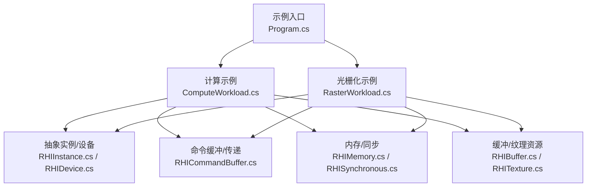
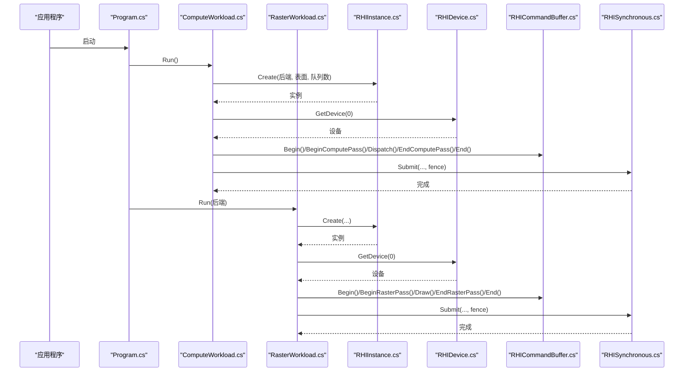
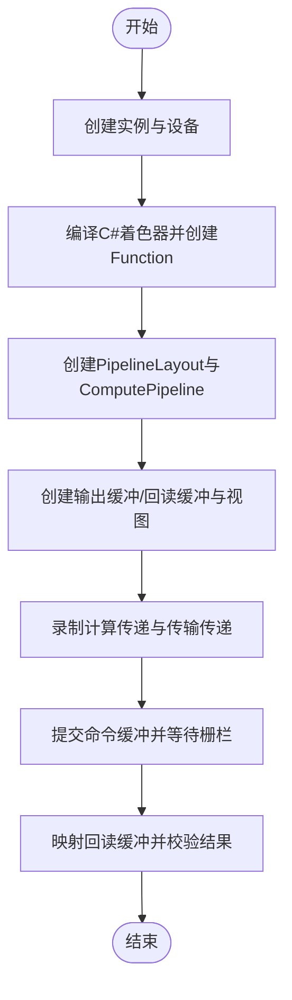
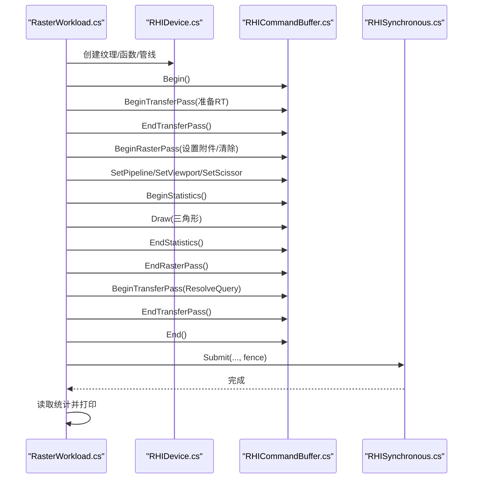
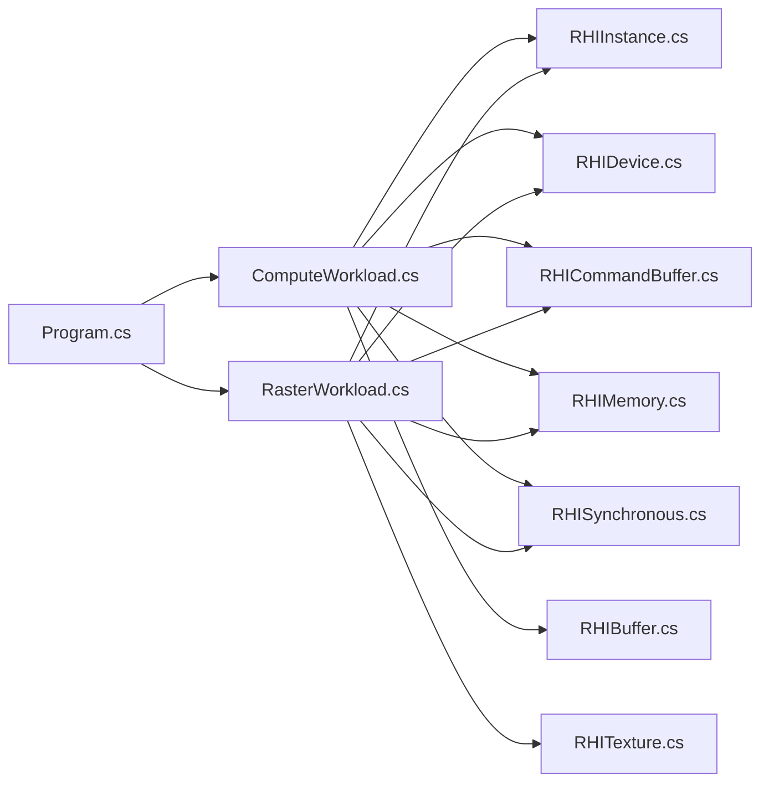

# 基础示例

<cite>
**本文引用的文件**
- [Program.cs](file://samples/ComputeAndDraw/Program.cs)
- [ComputeWorkload.cs](file://samples/ComputeAndDraw/ComputeWorkload.cs)
- [RasterWorkload.cs](file://samples/ComputeAndDraw/RasterWorkload.cs)
- [RHIInstance.cs](file://src/SharpGPU/Abstract/RHIInstance.cs)
- [RHIDevice.cs](file://src/SharpGPU/Abstract/RHIDevice.cs)
- [RHICommandBuffer.cs](file://src/SharpGPU/Abstract/RHICommandBuffer.cs)
- [RHIMemory.cs](file://src/SharpGPU/Abstract/RHIMemory.cs)
- [RHISynchronous.cs](file://src/SharpGPU/Abstract/RHISynchronous.cs)
- [RHIBuffer.cs](file://src/SharpGPU/Abstract/RHIBuffer.cs)
- [RHITexture.cs](file://src/SharpGPU/Abstract/RHITexture.cs)
- [QuickStart.md](file://docs/SharpGPU/QuickStart.md)
- [README.md](file://README.md)
</cite>

## 目录
1. [简介](#简介)
2. [项目结构](#项目结构)
3. [核心组件](#核心组件)
4. [架构总览](#架构总览)
5. [详细组件分析](#详细组件分析)
6. [依赖关系分析](#依赖关系分析)
7. [性能考虑](#性能考虑)
8. [故障排查指南](#故障排查指南)
9. [结论](#结论)
10. [附录](#附录)

## 简介
本示例文档面向初次接触 SharpGPU 的开发者，围绕“计算着色器”和“光栅化渲染”两类典型工作负载，给出从设备初始化、资源创建、命令录制到执行与同步的完整流程说明。通过 samples/ComputeAndDraw 中的两个示例程序，演示如何在 DirectX 12 与 Vulkan 后端上运行相同的逻辑，并对比差异。同时，结合抽象层的内存管理、同步机制与资源生命周期最佳实践，帮助读者建立稳定、可移植的低层 GPU 编程模型。

## 项目结构
- 示例入口位于 samples/ComputeAndDraw：
  - Program.cs：依次运行计算示例，并在支持的后端上运行光栅化示例。
  - ComputeWorkload.cs：使用 C# 着色器编译生成 DXIL/SPIR-V，创建设备、管线、缓冲区，录制计算传递并回读结果。
  - RasterWorkload.cs：使用 HLSL 交叉编译器生成字节码，创建顶点/像素函数、光栅化管线、渲染目标纹理，录制光栅化传递并查询管线统计。
- 抽象接口位于 src/SharpGPU/Abstract：
  - RHIInstance：实例创建、后端能力探测、平台选择。
  - RHIDevice：设备能力、资源创建（缓冲、纹理、管线等）。
  - RHICommandBuffer：命令缓冲状态机、传递开始/结束、编码器类型约束。
  - RHIMemory：堆、预算、驻留控制等内存抽象。
  - RHISynchronous：栅栏/信号量等同步原语的状态机与生命周期。
  - RHIBuffer/RHITexture：资源描述符与视图创建、映射/解映射等。
- 快速入门参考 docs/SharpGPU/QuickStart.md，展示最小化的传输拷贝用法。
- README.md 提供仓库布局、构建与运行指引。

图表来源
- [Program.cs:7-15](file://samples/ComputeAndDraw/Program.cs#L7-L15)
- [ComputeWorkload.cs:17-161](file://samples/ComputeAndDraw/ComputeWorkload.cs#L17-L161)
- [RasterWorkload.cs:37-161](file://samples/ComputeAndDraw/RasterWorkload.cs#L37-L161)
- [RHIInstance.cs:46-159](file://src/SharpGPU/Abstract/RHIInstance.cs#L46-L159)
- [RHICommandBuffer.cs:26-193](file://src/SharpGPU/Abstract/RHICommandBuffer.cs#L26-L193)
- [RHIMemory.cs:9-200](file://src/SharpGPU/Abstract/RHIMemory.cs#L9-L200)
- [RHISynchronous.cs:7-200](file://src/SharpGPU/Abstract/RHISynchronous.cs#L7-L200)
- [RHIBuffer.cs:6-49](file://src/SharpGPU/Abstract/RHIBuffer.cs#L6-L49)
- [RHITexture.cs:39-141](file://src/SharpGPU/Abstract/RHITexture.cs#L39-L141)

章节来源
- [Program.cs:7-15](file://samples/ComputeAndDraw/Program.cs#L7-L15)
- [README.md:1-23](file://README.md#L1-L23)

## 核心组件
- 实例与设备
  - 通过 RHIInstance.Create 创建实例，指定后端、表面类型与队列数量；使用 IsBackendSupported 进行运行时能力检查。
  - 从实例获取设备后，通过 GetCommandQueue 获取图形/计算/传输队列。
- 命令缓冲与传递
  - 命令缓冲具有严格的状态机：Begin -> 开启特定编码器（如 Compute/Raster/Transfer）-> EndEncoder -> End -> Submit。
  - 不同编码器之间必须显式 Barrier 转换资源访问权限与布局。
- 资源与视图
  - 缓冲：定义大小、格式、用途、存储模式；创建 BufferView 用于着色器绑定。
  - 纹理：定义维度、尺寸、格式、采样数、用途、存储模式；创建 TextureView 作为渲染目标或着色器输入。
- 内存与同步
  - 内存：通过堆与预算抽象管理分配与驻留；避免跨设备混用兼容性掩码。
  - 同步：使用 Fence 等待提交完成；在重置前确保已完成；避免重复提交未完成的栅栏。

章节来源
- [RHIInstance.cs:46-159](file://src/SharpGPU/Abstract/RHIInstance.cs#L46-L159)
- [RHICommandBuffer.cs:26-193](file://src/SharpGPU/Abstract/RHICommandBuffer.cs#L26-L193)
- [RHIBuffer.cs:6-49](file://src/SharpGPU/Abstract/RHIBuffer.cs#L6-L49)
- [RHITexture.cs:39-141](file://src/SharpGPU/Abstract/RHITexture.cs#L39-L141)
- [RHIMemory.cs:9-200](file://src/SharpGPU/Abstract/RHIMemory.cs#L9-L200)
- [RHISynchronous.cs:7-200](file://src/SharpGPU/Abstract/RHISynchronous.cs#L7-L200)

## 架构总览
下图展示了示例程序的端到端调用链：入口程序根据后端可用性分别运行计算与光栅化示例；两者均通过抽象实例/设备创建资源，录制命令缓冲并提交到队列，最后使用栅栏同步。

图表来源
- [Program.cs:7-15](file://samples/ComputeAndDraw/Program.cs#L7-L15)
- [ComputeWorkload.cs:17-161](file://samples/ComputeAndDraw/ComputeWorkload.cs#L17-L161)
- [RasterWorkload.cs:37-161](file://samples/ComputeAndDraw/RasterWorkload.cs#L37-L161)
- [RHIInstance.cs:122-159](file://src/SharpGPU/Abstract/RHIInstance.cs#L122-L159)
- [RHICommandBuffer.cs:170-183](file://src/SharpGPU/Abstract/RHICommandBuffer.cs#L170-L183)
- [RHISynchronous.cs:14-176](file://src/SharpGPU/Abstract/RHISynchronous.cs#L14-L176)

## 详细组件分析

### 计算工作负载（ComputeWorkload）
- 目标
  - 使用 C# 着色器源编译为 DXIL/Vulkan SPIR-V，创建计算函数、管线布局、计算管线，写入常量到输出缓冲，并通过传输通道回读到 CPU 验证。
- 关键步骤
  - 实例与设备：指定后端与无头表面，获取图形队列。
  - 着色器与管线：基于编译产物创建 Function，构造 PipelineLayout 与 ComputePipeline。
  - 资源与绑定：创建输出缓冲（无序访问）、回读缓冲（复制目标），创建 BufferView 与 BindingTable。
  - 命令录制：Begin -> BeginComputePass -> Barrier -> SetPipeline/SetBindingTable -> Dispatch -> EndComputePass -> BeginTransferPass -> Barrier -> CopyBufferToBuffer -> EndTransferPass -> End。
  - 同步与读取：Submit 带 Fence，Wait 完成后 Map 回读缓冲并校验结果。
- 输出说明
  - 控制台打印所选设备名称、后端标识与回读值；若回读值与期望不符将抛出异常。

图表来源
- [ComputeWorkload.cs:17-161](file://samples/ComputeAndDraw/ComputeWorkload.cs#L17-L161)
- [RHICommandBuffer.cs:170-183](file://src/SharpGPU/Abstract/RHICommandBuffer.cs#L170-L183)
- [RHIBuffer.cs:6-49](file://src/SharpGPU/Abstract/RHIBuffer.cs#L6-L49)

章节来源
- [ComputeWorkload.cs:17-161](file://samples/ComputeAndDraw/ComputeWorkload.cs#L17-L161)

### 光栅化渲染（RasterWorkload）
- 目标
  - 使用 HLSL 交叉编译器生成顶点/像素函数字节码，创建光栅化管线与渲染目标纹理，绘制一个全屏三角形，并查询管线统计（输入装配图元数、像素着色器调用次数）。
- 关键步骤
  - 实例与设备：无头表面，获取图形队列。
  - 着色器与管线：编译顶点/像素函数，创建 RHIRasterPipeline（包含顶点组装、片段函数、渲染状态）。
  - 资源与附件：创建 RenderTarget 纹理，配置颜色附件与清除值。
  - 命令录制：Begin -> PrepareRenderTarget（传输屏障）-> BeginRasterPass -> SetPipeline/SetViewport/SetScissor -> BeginStatistics -> Draw -> EndStatistics -> EndRasterPass -> ResolveQuery -> End。
  - 同步与查询：Submit 带 Fence，Wait 完成后查询统计并打印。
- 输出说明
  - 控制台打印后端标识、绘制的图元数与像素着色器调用次数；若统计未更新则抛出异常。

图表来源
- [RasterWorkload.cs:37-161](file://samples/ComputeAndDraw/RasterWorkload.cs#L37-L161)
- [RHICommandBuffer.cs:170-183](file://src/SharpGPU/Abstract/RHICommandBuffer.cs#L170-L183)
- [RHITexture.cs:39-141](file://src/SharpGPU/Abstract/RHITexture.cs#L39-L141)
- [RHISynchronous.cs:14-176](file://src/SharpGPU/Abstract/RHISynchronous.cs#L14-L176)

章节来源
- [RasterWorkload.cs:37-161](file://samples/ComputeAndDraw/RasterWorkload.cs#L37-L161)

### 后端差异与对比
- 计算示例
  - 使用 C# 着色器编译，针对 DirectX12 输出 DXIL，Vulkan 输出 SPIR-V；通过同一份源码适配多后端。
  - 绑定表布局由 SharpGpuShaderInterfaceAdapter 自动生成，简化了跨后端绑定差异。
- 光栅化示例
  - 使用 HLSLCrossCompiler 将 HLSL 编译为目标后端字节码（DXIL/SPIR-V）。
  - 渲染状态（混合、光栅化、深度模板）通过统一描述符配置，屏蔽后端细节。
- 共同点
  - 均通过 RHIInstance.IsBackendSupported 进行运行时能力检测。
  - 命令缓冲与传递 API 一致，Barrier 语义统一。

章节来源
- [ComputeWorkload.cs:164-199](file://samples/ComputeAndDraw/ComputeWorkload.cs#L164-L199)
- [RasterWorkload.cs:180-217](file://samples/ComputeAndDraw/RasterWorkload.cs#L180-L217)
- [RHIInstance.cs:59-93](file://src/SharpGPU/Abstract/RHIInstance.cs#L59-L93)

### 内存管理与资源生命周期
- 缓冲与纹理
  - 缓冲：明确 UsageFlag（如 UnorderedAccess、CopySrc/CopyDst）与 StorageMode（GPULocal、Readback）。
  - 纹理：明确 Dimension、Format、SampleCount、UsageFlag（RenderTarget）与 StorageMode。
- 内存抽象
  - 通过 RHIResourceMemoryRequirements 获取 Size/Alignment/StorageMode，确保堆大小对齐与兼容。
  - 使用 RHIHeapDescription 与驻留请求（MakeResident/Evict）管理大资源驻留。
- 生命周期
  - 所有资源实现 Disposal，应在 using 块中释放；视图先于资源销毁。
  - 命令缓冲状态机保证仅在 Recording 时开启编码器，在 Executable 时提交。

章节来源
- [RHIBuffer.cs:6-49](file://src/SharpGPU/Abstract/RHIBuffer.cs#L6-L49)
- [RHITexture.cs:39-141](file://src/SharpGPU/Abstract/RHITexture.cs#L39-L141)
- [RHIMemory.cs:23-200](file://src/SharpGPU/Abstract/RHIMemory.cs#L23-L200)
- [RHICommandBuffer.cs:26-193](file://src/SharpGPU/Abstract/RHICommandBuffer.cs#L26-L193)

### 同步机制与最佳实践
- 栅栏（Fence）
  - 提交命令缓冲时附带 Fence，Wait 阻塞直到 GPU 完成；Reset 前需确保上一次信号已完成。
  - 内部状态机禁止在未就绪时等待或在重置期间等待。
- 屏障（Barrier）
  - 在计算/传输/光栅化阶段切换时，显式声明阶段与访问掩码转换，避免数据竞争。
- 建议
  - 尽量将频繁使用的资源置于 GPULocal，减少带宽压力。
  - 使用 Readback 缓冲进行 CPU 侧读取，避免直接映射 GPU 本地内存。

章节来源
- [RHISynchronous.cs:7-200](file://src/SharpGPU/Abstract/RHISynchronous.cs#L7-L200)
- [ComputeWorkload.cs:118-161](file://samples/ComputeAndDraw/ComputeWorkload.cs#L118-L161)
- [RasterWorkload.cs:104-161](file://samples/ComputeAndDraw/RasterWorkload.cs#L104-L161)

## 依赖关系分析
- 示例对抽象层的依赖
  - Program.cs 依赖 ComputeWorkload 与 RasterWorkload。
  - 两个示例均依赖 RHIInstance/RHIDevice 进行设备与队列管理。
  - 命令缓冲与传递依赖 RHICommandBuffer 的状态机约束。
  - 资源创建依赖 RHIBuffer/RHITexture 的描述符与视图。
  - 同步依赖 RHISynchronous 的栅栏状态机。
  - 内存管理依赖 RHIMemory 的堆与预算抽象。

图表来源
- [Program.cs:7-15](file://samples/ComputeAndDraw/Program.cs#L7-L15)
- [ComputeWorkload.cs:17-161](file://samples/ComputeAndDraw/ComputeWorkload.cs#L17-L161)
- [RasterWorkload.cs:37-161](file://samples/ComputeAndDraw/RasterWorkload.cs#L37-L161)
- [RHIInstance.cs:46-159](file://src/SharpGPU/Abstract/RHIInstance.cs#L46-L159)
- [RHICommandBuffer.cs:26-193](file://src/SharpGPU/Abstract/RHICommandBuffer.cs#L26-L193)
- [RHIMemory.cs:9-200](file://src/SharpGPU/Abstract/RHIMemory.cs#L9-L200)
- [RHISynchronous.cs:7-200](file://src/SharpGPU/Abstract/RHISynchronous.cs#L7-L200)
- [RHIBuffer.cs:6-49](file://src/SharpGPU/Abstract/RHIBuffer.cs#L6-L49)
- [RHITexture.cs:39-141](file://src/SharpGPU/Abstract/RHITexture.cs#L39-L141)

章节来源
- [Program.cs:7-15](file://samples/ComputeAndDraw/Program.cs#L7-L15)
- [ComputeWorkload.cs:17-161](file://samples/ComputeAndDraw/ComputeWorkload.cs#L17-L161)
- [RasterWorkload.cs:37-161](file://samples/ComputeAndDraw/RasterWorkload.cs#L37-L161)

## 性能考虑
- 资源用途与存储模式
  - 仅启用必要的 UsageFlag，避免不必要的内存布局转换。
  - 高频读写资源优先使用 GPULocal，降低主机-GPU 带宽压力。
- 命令缓冲组织
  - 将相关操作合并到单个传递中，减少 Barrier 次数。
  - 使用 Transfer 传递集中处理复制与解析，避免与计算/渲染交错。
- 同步策略
  - 合理复用 Fence，避免每帧新建；确保 Reset 时机正确。
  - 使用 Query 统计评估绘制/计算开销，定位瓶颈。

[本节为通用指导，不直接分析具体文件]

## 故障排查指南
- 常见错误与原因
  - 命令缓冲状态错误：在已记录或未结束时开启新编码器；需在 Begin/End 之间保持单一活跃编码器。
  - 栅栏状态错误：在未就绪时等待或在重置期间等待；需确保信号完成后再 Reset。
  - 资源用途不匹配：纹理未设置为 RenderTarget 导致无法作为颜色附件；缓冲未设置相应 UsageFlag 导致访问失败。
  - 后端不支持：IsBackendSupported 返回 false 时，应跳过对应后端分支。
- 调试建议
  - 逐步缩小问题范围：先确认实例/设备创建成功，再检查资源创建，最后验证命令录制与提交。
  - 使用 QuickStart 的最小示例验证传输路径是否正常工作。

章节来源
- [RHICommandBuffer.cs:36-151](file://src/SharpGPU/Abstract/RHICommandBuffer.cs#L36-L151)
- [RHISynchronous.cs:63-176](file://src/SharpGPU/Abstract/RHISynchronous.cs#L63-L176)
- [QuickStart.md:1-31](file://docs/SharpGPU/QuickStart.md#L1-L31)

## 结论
通过 ComputeWorkload 与 RasterWorkload 两个示例，SharpGPU 展示了统一的低层 GPU 抽象：无论后端是 DirectX 12 还是 Vulkan，开发者均可使用一致的 API 完成设备初始化、资源创建、命令录制与执行。配合严格的命令缓冲状态机、屏障语义与同步原语，能够构建高效且稳定的 GPU 工作负载。遵循内存与生命周期最佳实践，可进一步提升性能与可靠性。

[本节为总结性内容，不直接分析具体文件]

## 附录
- 快速入门参考
  - 最小传输拷贝示例：创建上传缓冲与 GPU 缓冲，打开传输传递并复制数据，利用作用域自动结束编码器。
- 仓库与构建
  - 安装 .NET SDK，按 README 与 VERIFICATION 文档进行构建与测试；从 standalone sample 开始运行。

章节来源
- [QuickStart.md:1-31](file://docs/SharpGPU/QuickStart.md#L1-L31)
- [README.md:1-23](file://README.md#L1-L23)