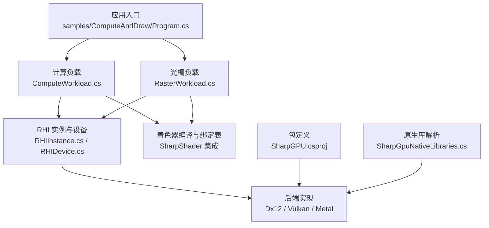
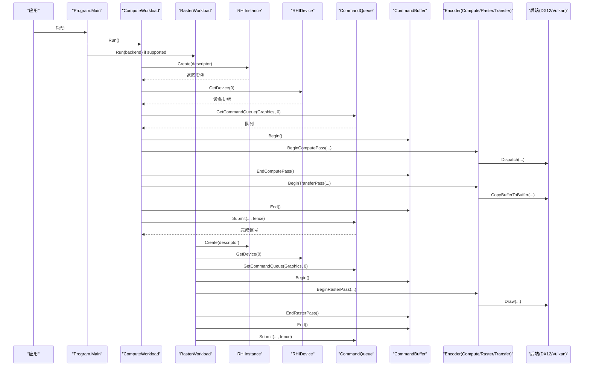
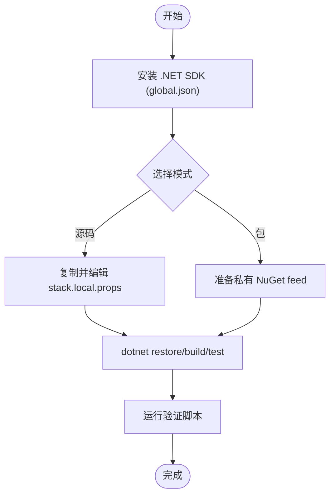
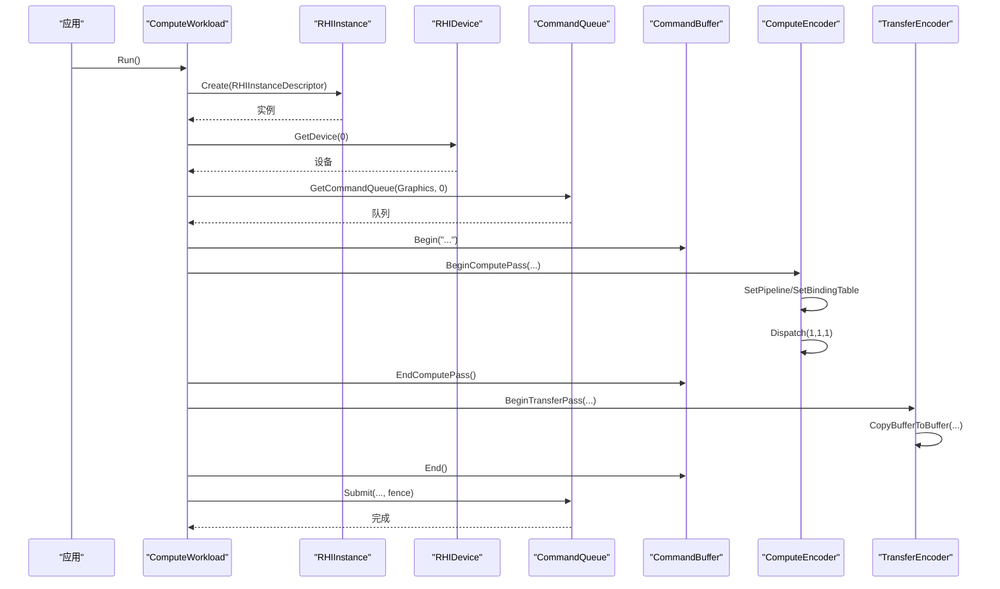
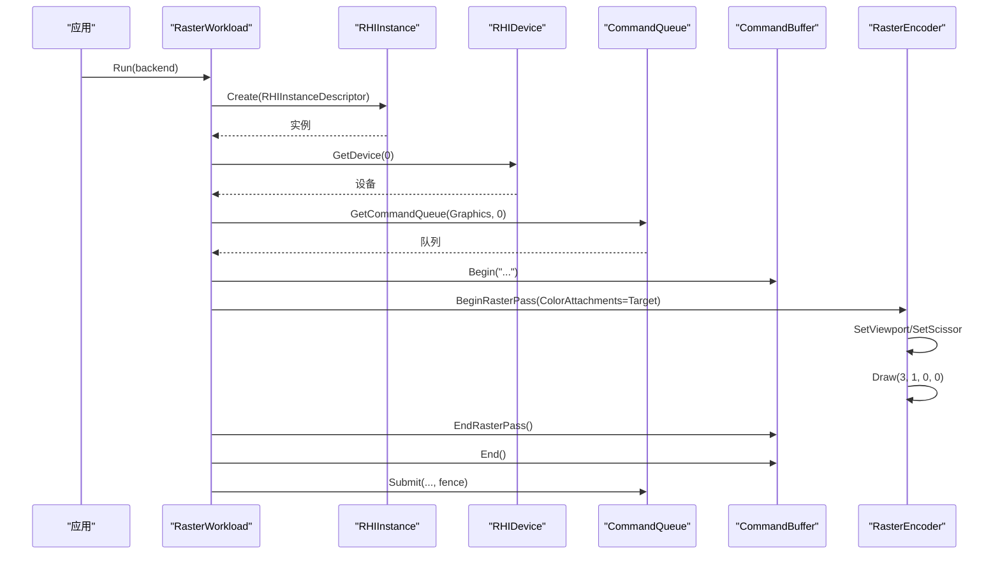
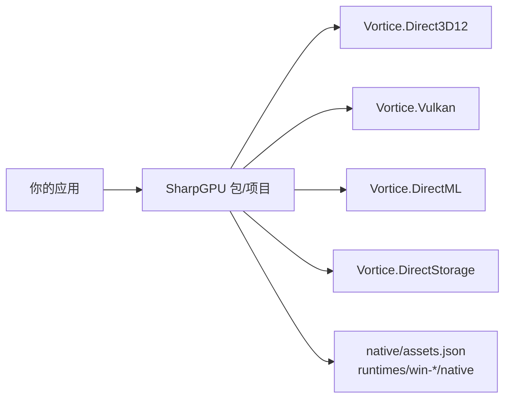

# 快速开始

<cite>
**本文引用的文件**
- [README.md](file://README.md)
- [QuickStart.md](file://docs/SharpGPU/QuickStart.md)
- [PackageReadme.md](file://docs/SharpGPU/PackageReadme.md)
- [VERIFICATION.md](file://docs/VERIFICATION.md)
- [Program.cs](file://samples/ComputeAndDraw/Program.cs)
- [ComputeWorkload.cs](file://samples/ComputeAndDraw/ComputeWorkload.cs)
- [RasterWorkload.cs](file://samples/ComputeAndDraw/RasterWorkload.cs)
- [ComputeAndDraw.csproj](file://samples/ComputeAndDraw/ComputeAndDraw.csproj)
- [SharpGPU.csproj](file://src/SharpGPU/SharpGPU.csproj)
- [RHIInstance.cs](file://src/SharpGPU/Abstract/RHIInstance.cs)
- [RHIDevice.cs](file://src/SharpGPU/Abstract/RHIDevice.cs)
- [SharpGpuNativeLibraries.cs](file://src/SharpGPU/Common/SharpGpuNativeLibraries.cs)
- [stack.local.props.example](file://stack.local.props.example)
</cite>

## 目录
1. [简介](#简介)
2. [项目结构](#项目结构)
3. [核心组件](#核心组件)
4. [架构总览](#架构总览)
5. [详细组件分析](#详细组件分析)
6. [依赖关系分析](#依赖关系分析)
7. [性能注意事项](#性能注意事项)
8. [故障排除指南](#故障排除指南)
9. [结论](#结论)
10. [附录](#附录)

## 简介
本指南面向从零开始的开发者，帮助你在 Windows x64 环境下快速安装、配置并运行 SharpGPU 的最小可执行示例。你将学会：
- 如何安装 .NET SDK 与 SharpGPU（包或源码模式）
- 如何创建第一个计算着色器应用程序
- 如何创建第一个图形渲染程序
- 如何排查常见环境问题（如原生库路径、后端不可用等）

SharpGPU 是一个面向 DirectX 12、Vulkan 和 Metal 的低层 GPU HAL，提供统一的设备、命令队列、管线、资源与编码器抽象，并通过运行时能力探测决定可用特性。

**章节来源**
- [README.md:1-23](file://README.md#L1-L23)
- [PackageReadme.md:1-13](file://docs/SharpGPU/PackageReadme.md#L1-L13)

## 项目结构
仓库采用“源码 + 示例 + 文档”的清晰分层：
- src/SharpGPU：HAL 核心与后端实现（Dx12/Vulkan/Metal）
- samples/ComputeAndDraw：最小可运行的计算与光栅化示例
- docs/SharpGPU：快速开始、功能矩阵、验证说明
- eng/：构建与验证脚本
- native/assets.json：原生资产清单

**图表来源**
- [Program.cs:1-18](file://samples/ComputeAndDraw/Program.cs#L1-L18)
- [ComputeWorkload.cs:1-224](file://samples/ComputeAndDraw/ComputeWorkload.cs#L1-L224)
- [RasterWorkload.cs:1-268](file://samples/ComputeAndDraw/RasterWorkload.cs#L1-L268)
- [RHIInstance.cs:1-159](file://src/SharpGPU/Abstract/RHIInstance.cs#L1-L159)
- [RHIDevice.cs:422-527](file://src/SharpGPU/Abstract/RHIDevice.cs#L422-L527)
- [SharpGPU.csproj:1-47](file://src/SharpGPU/SharpGPU.csproj#L1-L47)
- [SharpGpuNativeLibraries.cs:1-76](file://src/SharpGPU/Common/SharpGpuNativeLibraries.cs#L1-L76)

**章节来源**
- [README.md:12-17](file://README.md#L12-L17)
- [ComputeAndDraw.csproj:1-14](file://samples/ComputeAndDraw/ComputeAndDraw.csproj#L1-L14)

## 核心组件
- RHIInstance：创建后端实例、选择平台支持、获取设备
- RHIDevice：设备能力、队列、资源创建、查询与同步
- 命令缓冲与编码器：Begin/End 生命周期、Pass（Compute/Transfer/Raster）
- 资源与视图：Buffer/Texture/Sampler 及对应 View/BindingTable
- 着色器与管线：函数对象、计算/光栅管线布局与状态
- 原生库定位：DirectML/DirectStorage/PIX 的路径解析与冻结策略

这些组件共同构成跨后端的统一 API，使上层代码无需关心具体后端差异。

**章节来源**
- [RHIInstance.cs:46-159](file://src/SharpGPU/Abstract/RHIInstance.cs#L46-L159)
- [RHIDevice.cs:422-800](file://src/SharpGPU/Abstract/RHIDevice.cs#L422-L800)
- [SharpGpuNativeLibraries.cs:7-76](file://src/SharpGPU/Common/SharpGpuNativeLibraries.cs#L7-L76)

## 架构总览
下图展示了从应用入口到后端执行的典型调用链，涵盖计算与光栅两条路径。

**图表来源**
- [Program.cs:1-18](file://samples/ComputeAndDraw/Program.cs#L1-L18)
- [ComputeWorkload.cs:45-162](file://samples/ComputeAndDraw/ComputeWorkload.cs#L45-L162)
- [RasterWorkload.cs:37-161](file://samples/ComputeAndDraw/RasterWorkload.cs#L37-L161)
- [RHIInstance.cs:122-159](file://src/SharpGPU/Abstract/RHIInstance.cs#L122-L159)
- [RHIDevice.cs:527-533](file://src/SharpGPU/Abstract/RHIDevice.cs#L527-L533)

## 详细组件分析

### 环境设置与项目配置
- 安装 .NET SDK：使用 global.json 指定的版本（当前为 .NET 10）
- 源码模式：复制 stack.local.props.example 为 stack.local.props，并调整依赖根路径
- 包模式：通过 StackReferenceMode=Package 与显式 NuGet feed 消费包
- 验证命令：参考 VERIFICATION.md 中的 Source/Package 构建与测试流程

**图表来源**
- [README.md:5-10](file://README.md#L5-L10)
- [VERIFICATION.md:1-14](file://docs/VERIFICATION.md#L1-L14)
- [stack.local.props.example:1-12](file://stack.local.props.example#L1-L12)

**章节来源**
- [README.md:5-10](file://README.md#L5-L10)
- [VERIFICATION.md:1-14](file://docs/VERIFICATION.md#L1-L14)
- [stack.local.props.example:1-12](file://stack.local.props.example#L1-L12)

### 创建第一个计算着色器应用程序
最小步骤概览：
- 使用 CSharpShaderCompiler 编译内联着色器，生成 DXIL/SPIR-V 工件
- 创建 RHIInstance 与 RHIDevice，获取 Graphics 队列
- 构造 BindingTableLayoutPlan 与 PipelineLayout
- 创建 ComputePipeline、Buffer、View、BindingTable
- 在 ComputePass 中设置管线与绑定表，Dispatch 线程组
- 在 TransferPass 中将结果拷贝回 CPU 可读缓冲区
- 提交命令并使用 Fence 等待完成，读取结果

**图表来源**
- [ComputeWorkload.cs:17-162](file://samples/ComputeAndDraw/ComputeWorkload.cs#L17-L162)

**章节来源**
- [ComputeWorkload.cs:17-162](file://samples/ComputeAndDraw/ComputeWorkload.cs#L17-L162)

### 创建第一个图形渲染程序
最小步骤概览：
- 创建 RHIInstance/RHIDevice/CommandQueue
- 创建纹理作为渲染目标，设置颜色附件
- 编译顶点/像素着色器，创建光栅管线
- 在 RasterPass 中设置视口/裁剪区，绘制三角形
- 可选：使用 Query 统计图元与像素着色器调用次数
- 提交命令并等待完成

**图表来源**
- [RasterWorkload.cs:37-161](file://samples/ComputeAndDraw/RasterWorkload.cs#L37-L161)

**章节来源**
- [RasterWorkload.cs:37-161](file://samples/ComputeAndDraw/RasterWorkload.cs#L37-L161)

### 最小可运行示例
- 入口：Program.Main 依次运行计算负载，并在支持的后台上运行光栅负载
- 项目引用：ComputeAndDraw.csproj 在源码模式下引用 SharpGPU 与 SharpShader；包模式下引用对应 NuGet 包
- 运行前确保已按 README 与 VERIFICATION 配置好环境与依赖

**章节来源**
- [Program.cs:1-18](file://samples/ComputeAndDraw/Program.cs#L1-L18)
- [ComputeAndDraw.csproj:1-14](file://samples/ComputeAndDraw/ComputeAndDraw.csproj#L1-L14)

## 依赖关系分析
- 运行时目标：.NET 10
- 关键依赖：
  - Vortice.Vulkan（固定版本）
  - Vortice.Direct3D12（本地项目引用）
  - Vortice.DirectML / DirectStorage（本地项目引用）
  - 可选：SharpMath / SharpMetal（源码或包模式）
- 原生资产：通过 SharpGPU.NativeAssets.props 引入，包含 RID 特定的 native 文件与清单

**图表来源**
- [SharpGPU.csproj:1-47](file://src/SharpGPU/SharpGPU.csproj#L1-L47)

**章节来源**
- [SharpGPU.csproj:1-47](file://src/SharpGPU/SharpGPU.csproj#L1-L47)
- [VERIFICATION.md:66-99](file://docs/VERIFICATION.md#L66-L99)

## 性能注意事项
- 合理使用 Pass 边界：将数据拷贝、计算、渲染分阶段组织，减少不必要的状态切换
- 使用正确的存储模式：上传/读回使用 HostUpload/Readback，GPU 侧使用 GPULocal
- 避免过度映射：尽量批量写入/读取，减少 Map/Unmap 次数
- 利用查询统计：使用 Statistics Query 评估图元装配与像素着色器调用，指导优化
- 注意内存对齐与限制：通过设备 Limit/Capabilities 查询合理分配资源

[本节为通用建议，不直接分析具体文件]

## 故障排除指南
常见问题与解决思路：
- “所有指定目标目录无效”
  - 检查 stack.local.props 中的路径是否为绝对路径且存在
  - 确认 SharpMath/SharpMetal/SharpShader 等根路径正确
  - 若使用包模式，确保 NuGet feed 与缓存隔离且包含所需包
- 后端不可用
  - 使用 IsBackendSupported 检查平台与后端兼容性
  - 在 Windows 上优先尝试 DirectX12，跨平台可尝试 Vulkan
- 原生库加载失败
  - 首次运行会“冻结”原生库路径，请确保 Configure 调用早于任何设备创建
  - 确认 runtimes/win-*/native 下存在对应 DLL，或通过 Configure 指定绝对路径
- 着色器编译为空或目标不支持
  - 检查 ShaderModel 与后端目标（DXIL vs SPIR-V）
  - 确认设备能力与驱动支持

**章节来源**
- [RHIInstance.cs:59-93](file://src/SharpGPU/Abstract/RHIInstance.cs#L59-L93)
- [SharpGpuNativeLibraries.cs:16-58](file://src/SharpGPU/Common/SharpGpuNativeLibraries.cs#L16-L58)
- [stack.local.props.example:1-12](file://stack.local.props.example#L1-L12)
- [VERIFICATION.md:136-144](file://docs/VERIFICATION.md#L136-L144)

## 结论
通过本指南，你应能：
- 搭建开发环境并选择源码或包模式
- 运行最小计算与光栅示例，理解 RHI 的基本工作流
- 根据设备能力与后端特性进行开发与调试
- 遇到原生库与路径问题时，依据指南快速定位与修复

建议在熟悉基础后，进一步阅读 FeatureMatrix 与 VERIFICATION 以了解能力边界与验证流程。

[本节为总结性内容，不直接分析具体文件]

## 附录
- 快速参考
  - 创建实例与设备：RHIInstance.Create / GetDevice
  - 获取队列：GetCommandQueue(Graphics/Compute/Transfer)
  - 编码命令：Begin/End 各 Pass，Barrier 与 Copy/Resolve
  - 资源管理：Buffer/Texture/View/BindingTable/Pipeline
  - 同步：Fence 等待完成
- 相关文档
  - QuickStart：最小传输 Pass 示例
  - PackageReadme：公共契约与起步指引
  - VERIFICATION：完整构建、打包与平台验证命令

**章节来源**
- [QuickStart.md:1-31](file://docs/SharpGPU/QuickStart.md#L1-L31)
- [PackageReadme.md:1-13](file://docs/SharpGPU/PackageReadme.md#L1-L13)
- [VERIFICATION.md:15-65](file://docs/VERIFICATION.md#L15-L65)