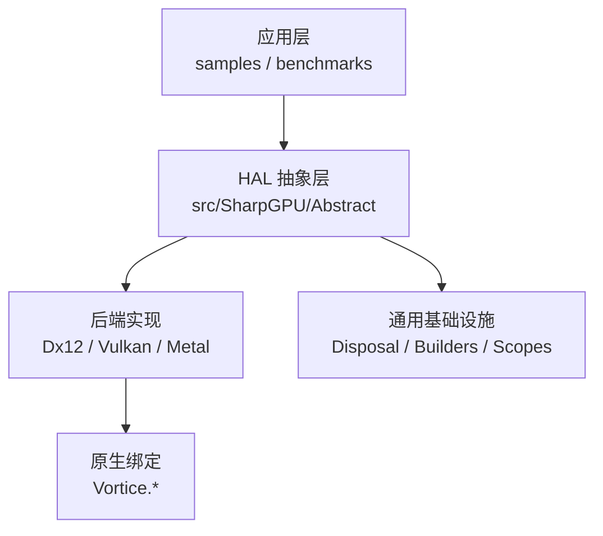
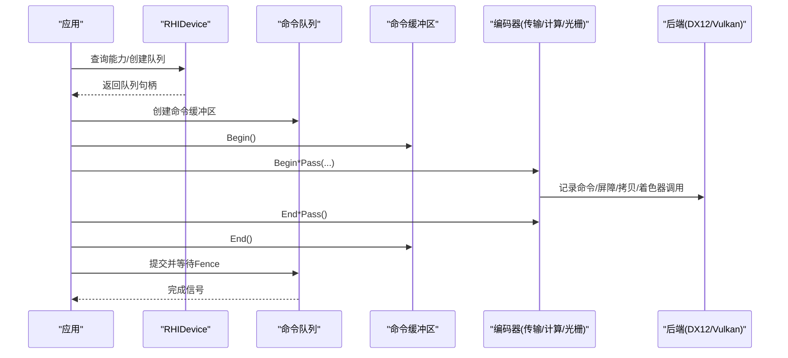
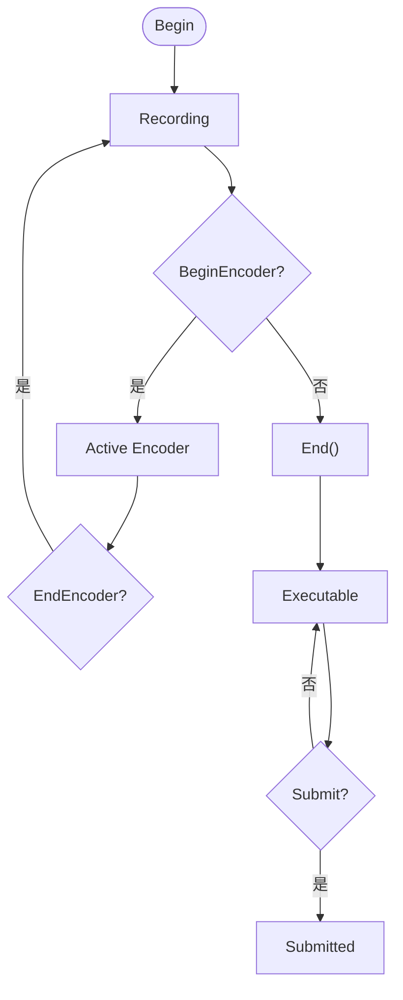
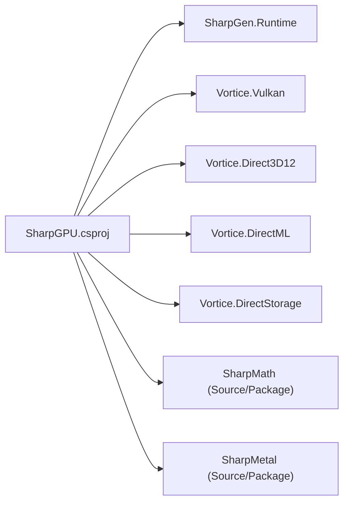

# 最佳实践

<cite>
**本文引用的文件**
- [README.md](file://README.md)
- [DESIGN.md](file://DESIGN.md)
- [SharpGPU.csproj](file://src/SharpGPU/SharpGPU.csproj)
- [PackageReadme.md](file://docs/SharpGPU/PackageReadme.md)
- [QuickStart.md](file://docs/SharpGPU/QuickStart.md)
- [RHIDevice.cs](file://src/SharpGPU/Abstract/RHIDevice.cs)
- [RHICommandBuffer.cs](file://src/SharpGPU/Abstract/RHICommandBuffer.cs)
- [RHIBuffer.cs](file://src/SharpGPU/Abstract/RHIBuffer.cs)
- [RHITexture.cs](file://src/SharpGPU/Abstract/RHITexture.cs)
- [Disposal.cs](file://src/SharpGPU/Common/Core/Disposal.cs)
- [Dx12Device.cs](file://src/SharpGPU/Dx12/Dx12Device.cs)
- [VulkanDevice.cs](file://src/SharpGPU/Vulkan/VulkanDevice.cs)
- [Program.cs（示例）](file://samples/ComputeAndDraw/Program.cs)
- [Program.cs（基准）](file://benchmarks/SharpGPU.Benchmarks/Program.cs)
</cite>

## 目录
1. [简介](#简介)
2. [项目结构](#项目结构)
3. [核心组件](#核心组件)
4. [架构总览](#架构总览)
5. [详细组件分析](#详细组件分析)
6. [依赖关系分析](#依赖关系分析)
7. [性能考量与调优](#性能考量与调优)
8. [故障排查指南](#故障排查指南)
9. [结论](#结论)
10. [附录：代码审查清单](#附录：代码审查清单)

## 简介
本指南面向在实际项目中使用 SharpGPU 的开发者，聚焦资源管理、内存优化、多线程安全、错误诊断、性能调优与架构设计等最佳实践。内容基于仓库中的抽象接口、后端实现、示例与基准程序提炼而成，强调“显式能力探测、严格生命周期管理、可验证的性能基线”三大原则。

## 项目结构
- src/SharpGPU：运行时 HAL 抽象与各后端实现（DirectX12、Vulkan、Metal）。
- samples/ComputeAndDraw：最小可用示例，演示缓冲创建、传输通道与提交流程。
- benchmarks/SharpGPU.Benchmarks：覆盖 API、后端、工作负载与提交的基准套件，提供零分配断言与回归检查。
- docs/SharpGPU：快速开始、特性矩阵、包说明等文档。
- native/*：原生依赖与许可证信息；构建时通过目标文件引入。
- eng/*：CI 与验证脚本。

**图示来源**
- [SharpGPU.csproj:1-47](file://src/SharpGPU/SharpGPU.csproj#L1-L47)
- [Program.cs（示例）:1-18](file://samples/ComputeAndDraw/Program.cs#L1-L18)
- [Program.cs（基准）:1-120](file://benchmarks/SharpGPU.Benchmarks/Program.cs#L1-L120)

**章节来源**
- [README.md:1-23](file://README.md#L1-L23)
- [DESIGN.md:1-33](file://DESIGN.md#L1-L33)

## 核心组件
- RHIDevice：设备抽象，暴露能力查询、队列获取、资源创建、时钟校准等入口；内部维护设备状态与丢失诊断，强制在不可用状态下抛出异常。
- RHICommandBuffer：命令缓冲区状态机，严格约束 Begin/End、编码器开启/结束顺序，防止非法嵌套与重复提交。
- RHIBuffer / RHITexture：资源描述与访问模式，包含存储模式、用途标志、采样反馈映射等语义。
- Disposal：统一释放基类，确保原生资源释放与调试期未释放告警。

关键实践要点
- 始终使用能力查询（格式支持、MSAA 解析、附件组合、统计域等）进行运行时分发，避免隐式降级。
- 使用 Scoped 辅助（如传输通道作用域）简化编码与屏障管理，减少遗漏风险。
- 所有资源遵循 RAII 风格：构造即声明所有权，using/Dispose 成对出现，禁止跨线程共享未同步对象。

**章节来源**
- [RHIDevice.cs:422-800](file://src/SharpGPU/Abstract/RHIDevice.cs#L422-L800)
- [RHICommandBuffer.cs:1-193](file://src/SharpGPU/Abstract/RHICommandBuffer.cs#L1-L193)
- [RHIBuffer.cs:1-49](file://src/SharpGPU/Abstract/RHIBuffer.cs#L1-L49)
- [RHITexture.cs:1-141](file://src/SharpGPU/Abstract/RHITexture.cs#L1-L141)
- [Disposal.cs:1-65](file://src/SharpGPU/Common/Core/Disposal.cs#L1-L65)

## 架构总览
SharpGPU 采用“抽象 HAL + 多后端实现”的分层架构。上层通过统一的 RHI 接口编程，底层根据平台选择 DirectX12 或 Vulkan 路径。设备能力探测贯穿初始化与资源创建阶段，确保“不支持即失败”的强契约。

**图示来源**
- [Program.cs（示例）:1-18](file://samples/ComputeAndDraw/Program.cs#L1-L18)
- [RHICommandBuffer.cs:1-193](file://src/SharpGPU/Abstract/RHICommandBuffer.cs#L1-L193)
- [Dx12Device.cs:1-200](file://src/SharpGPU/Dx12/Dx12Device.cs#L1-L200)
- [VulkanDevice.cs:1-200](file://src/SharpGPU/Vulkan/VulkanDevice.cs#L1-L200)

## 详细组件分析

### 设备与能力探测（RHIDevice）
- 设备状态与丢失诊断：通过 MarkDeviceLost 设置 Lost/Removed/Reset 状态，并在后续操作前通过 ThrowIfDeviceUnavailable 抛出携带诊断的异常，保证错误传播清晰。
- 能力查询：
  - 格式支持：QueryFormatSupport 针对精确的格式/用法/维度/采样/布局组合返回正交操作掩码。
  - MSAA 解析：QueryResolveSupport 校验源/目的格式、采样数、Aspect 与 ResolveMode 的合法性。
  - 附件组合：QueryRasterAttachmentSupport 限定输入/输出、混合、AlphaToCoverage 与分层访问。
  - 统计域：CreateQuery 时对统计域与计数器掩码进行合法性校验，并依据能力限制拒绝不支持的组合。
- 时钟校准：QueryClockCalibration 用于 CPU/GPU 时间域校准，便于精准计时。

建议
- 在资源创建前执行能力查询，按结果选择路径或回退策略。
- 将设备丢失视为致命错误，立即中止当前帧/任务并上报诊断。

**章节来源**
- [RHIDevice.cs:422-800](file://src/SharpGPU/Abstract/RHIDevice.cs#L422-L800)

### 命令缓冲区与编码器（RHICommandBuffer）
- 状态机：Initial → Recording → Executable → Submitted，任何越界转换均抛错。
- 编码器互斥：同一时刻仅允许一个活动编码器（传输/计算/光栅/光线追踪/ML/WorkGraph），Begin/End 必须配对。
- 提交前校验：仅在 Executable 状态可提交，避免重复提交与无效记录。

建议
- 使用 Scoped 封装（如 BeginScopedTransferPass）自动处理 End，降低忘记关闭的风险。
- 将长任务拆分为多个短命令缓冲区，提高调度并行度与错误隔离性。

**图示来源**
- [RHICommandBuffer.cs:1-193](file://src/SharpGPU/Abstract/RHICommandBuffer.cs#L1-L193)

**章节来源**
- [RHICommandBuffer.cs:1-193](file://src/SharpGPU/Abstract/RHICommandBuffer.cs#L1-L193)

### 资源模型（RHIBuffer / RHITexture）
- 缓冲：ByteSize、UsageFlag、StorageMode 决定分配与访问语义；Map/Unmap 需配合正确的读写范围。
- 纹理：MipCount、Extent、Format、SampleCount、UsageFlag、Dimension 共同定义资源形态；采样反馈映射需在创建时建立配对，禁止编码器阶段临时配对。
- 视图：通过 BufferView/TextureView 表达不同视角（Srv/Uav/RTV/DSV 等），注意对齐与步长。

建议
- 上传缓冲使用 HostUpload 存储模式，读取回使用 HostReadback，避免不必要的缓存一致性开销。
- 纹理用途位尽量精确，减少不必要的过渡与屏障。
- 采样反馈映射与采样纹理的配对必须在创建时完成，且采样纹理不得为多重采样或半透明反馈格式。

**章节来源**
- [RHIBuffer.cs:1-49](file://src/SharpGPU/Abstract/RHIBuffer.cs#L1-L49)
- [RHITexture.cs:1-141](file://src/SharpGPU/Abstract/RHITexture.cs#L1-L141)

### 释放与生命周期（Disposal）
- 统一 Dispose 流程：幂等释放、抑制终结器、调试期未释放告警。
- 子类应重写 Release 以释放原生资源，并在 ValidateCanDispose 中做前置校验。

建议
- 所有 GPU 资源继承 Disposal，使用 using 语句或 finally 块确保释放。
- 避免持有已释放资源的引用，必要时置空并记录日志。

**章节来源**
- [Disposal.cs:1-65](file://src/SharpGPU/Common/Core/Disposal.cs#L1-L65)

### 后端实现要点（DX12 / Vulkan）
- DX12：
  - 通过 Vortice.Direct3D12 访问原生设备与队列；需要 Agility 设备工厂初始化成功。
  - 指令签名、描述符堆、NullDescriptorCache 等细节由后端封装，上层通过 RHI 抽象交互。
- Vulkan：
  - 动态渲染、RenderPass2、局部读扩展、独立解析等能力通过设备属性查询启用。
  - 队列族索引、稀疏绑定、校准时间戳等能力影响路径选择与性能。

建议
- 优先使用高层抽象，避免直接触碰后端特定类型；当确需后端特性时，通过能力门控分支。
- 在 CI 中覆盖多后端、多设备的能力矩阵测试，确保“不支持即失败”。

**章节来源**
- [Dx12Device.cs:1-200](file://src/SharpGPU/Dx12/Dx12Device.cs#L1-L200)
- [VulkanDevice.cs:1-200](file://src/SharpGPU/Vulkan/VulkanDevice.cs#L1-L200)

### 示例与基准
- 示例：展示最小工作流——创建两个缓冲、打开传输通道、复制数据、提交并释放。
- 基准：覆盖 API、后端、工作负载与提交场景；提供零分配断言、分位数统计、CSV/JSON 输出与回归检查。

建议
- 使用基准套件作为性能回归门禁；对热点路径添加 RequireZeroAllocation 断言。
- 在真实设备上运行资格测试，区分主机 CI 与真机结果。

**章节来源**
- [QuickStart.md:1-31](file://docs/SharpGPU/QuickStart.md#L1-L31)
- [Program.cs（示例）:1-18](file://samples/ComputeAndDraw/Program.cs#L1-L18)
- [Program.cs（基准）:1-120](file://benchmarks/SharpGPU.Benchmarks/Program.cs#L1-L120)

## 依赖关系分析
- 产品目标框架 .NET 10，启用不安全块与可空上下文。
- 依赖 SharpGen.Runtime、Vortice.Vulkan，并通过项目引用集成 Vortice.Direct3D12、DirectML、DirectStorage。
- 可选依赖 SharpMath、SharpMetal（Source/Package 模式切换）。
- 包内嵌入 FeatureMatrix 与 native/assets.json，构建时注入原生资产与目标文件。

**图示来源**
- [SharpGPU.csproj:1-47](file://src/SharpGPU/SharpGPU.csproj#L1-L47)

**章节来源**
- [SharpGPU.csproj:1-47](file://src/SharpGPU/SharpGPU.csproj#L1-L47)
- [DESIGN.md:1-33](file://DESIGN.md#L1-L33)

## 性能考量与调优
- 命令编码
  - 批量合并小操作，减少编码器切换与屏障次数。
  - 使用 Scoped 传输通道减少手动 End 遗漏导致的额外同步。
- 内存与资源
  - 精确设置 UsageFlag，避免过度标记导致多余过渡。
  - 合理复用缓冲与视图，减少频繁分配与重建。
  - 采样反馈映射在创建时配对，避免运行时配对带来的不确定性。
- 能力与路径选择
  - 利用 QueryFormatSupport/QueryResolveSupport/QueryRasterAttachmentSupport 选择最优路径。
  - 对 WorkGraph、Mesh Shading、Ray Tracing 等高级特性进行能力门控，避免在不支持设备上退化。
- 计时与基准
  - 使用 QueryClockCalibration 校准 CPU/GPU 时间域，结合基准套件输出分位数与分配量。
  - 对热点路径添加 RequireZeroAllocation 断言，确保稳态无托管分配。
- 提交与同步
  - 合理使用 Fence/Semaphore 控制帧间依赖，避免全局阻塞。
  - 将大任务拆分为多个命令缓冲区，提升调度并行度。

[本节为通用指导，不直接分析具体文件]

## 故障排查指南
- 设备丢失
  - 现象：后续操作抛出携带 DeviceLost 诊断的异常。
  - 处理：捕获异常，记录诊断信息，尝试重置或重建设备；若不可恢复则优雅退出。
- 命令缓冲区状态错误
  - 现象：在非 Recording 状态 Begin/End，或重复 Begin、未结束编码器就 End。
  - 处理：检查 Begin/End 配对与编码器生命周期，优先使用 Scoped 封装。
- 能力不支持
  - 现象：能力查询返回不支持或抛出 NotSupportedException。
  - 处理：回退到兼容路径或提示用户升级驱动/硬件；在 CI 中覆盖能力矩阵。
- 资源释放问题
  - 现象：调试期检测到未释放对象；或释放后继续使用。
  - 处理：确保 using/Dispose 成对出现；释放后置空引用；避免跨线程共享未同步资源。
- 基准回归
  - 现象：基准报告分配量非零或耗时回归。
  - 处理：定位新增分配点，优化路径；更新基线或修复性能退化。

**章节来源**
- [RHIDevice.cs:465-525](file://src/SharpGPU/Abstract/RHIDevice.cs#L465-L525)
- [RHICommandBuffer.cs:36-163](file://src/SharpGPU/Abstract/RHICommandBuffer.cs#L36-L163)
- [Disposal.cs:13-65](file://src/SharpGPU/Common/Core/Disposal.cs#L13-L65)
- [Program.cs（基准）:84-129](file://benchmarks/SharpGPU.Benchmarks/Program.cs#L84-L129)

## 结论
SharpGPU 的最佳实践围绕“显式能力探测、严格生命周期管理、可验证性能基线”展开。通过抽象 HAL 与多后端实现，开发者可以在统一接口下获得跨平台能力；借助能力查询与 Scoped 辅助，能够写出健壮且高性能的代码；依托基准套件与能力矩阵测试，持续保障稳定性与性能。

[本节为总结，不直接分析具体文件]

## 附录：代码审查清单
- 资源管理
  - 是否对所有 GPU 资源使用 using/Dispose？
  - 是否避免跨线程共享未同步资源？
  - 是否正确使用 StorageMode 与 UsageFlag？
- 命令编码
  - Begin/End 是否成对？是否有未结束的编码器？
  - 是否使用 Scoped 传输通道以减少遗漏？
  - 是否合并小操作以减少屏障与切换？
- 能力与路径
  - 是否在创建资源前进行能力查询？
  - 是否对不支持的特性进行门控与回退？
- 性能
  - 是否对热点路径添加基准与零分配断言？
  - 是否使用 QueryClockCalibration 进行准确计时？
- 错误处理
  - 是否捕获并记录设备丢失诊断？
  - 是否在能力不支持时明确失败而非静默降级？
- 依赖与构建
  - 是否遵循 Source/Package 模式切换？
  - 是否保留锁文件与本地路径配置分离？

[本节为通用清单，不直接分析具体文件]