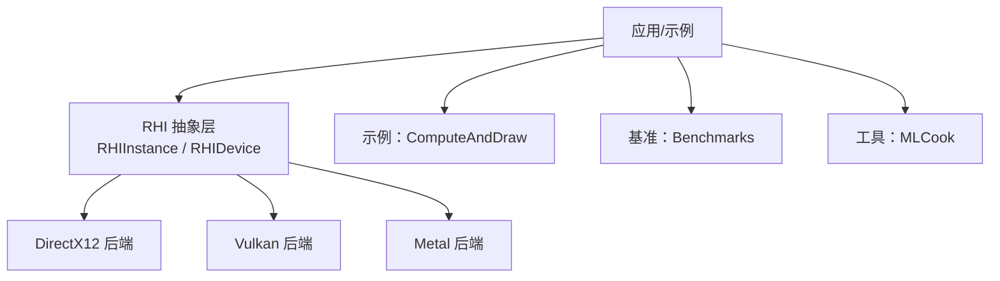
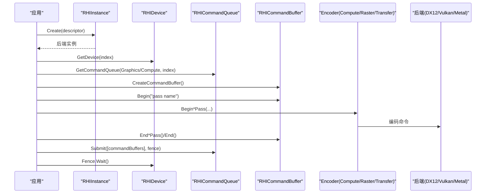
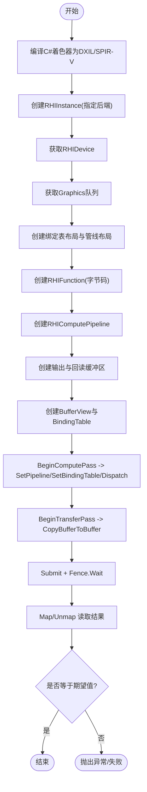
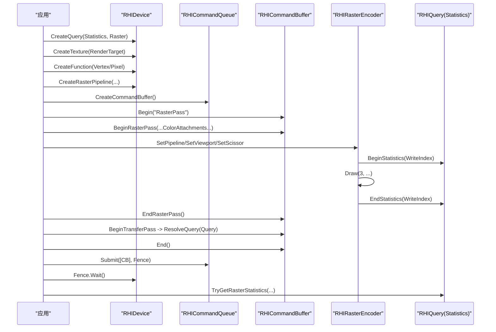
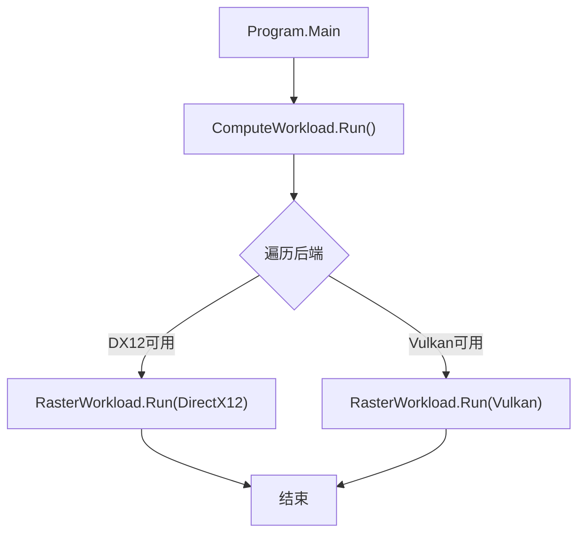
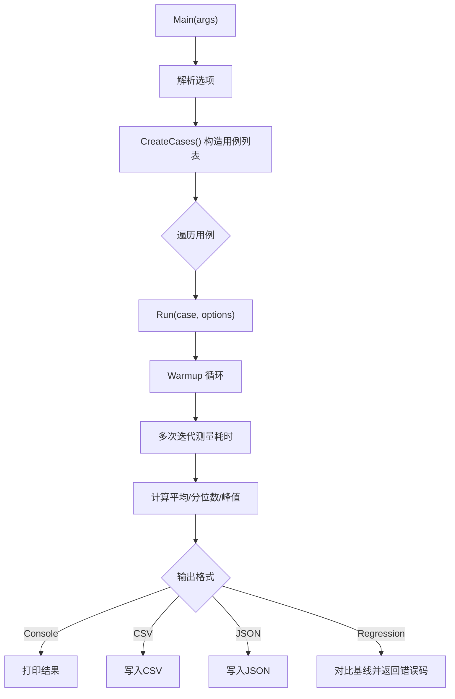
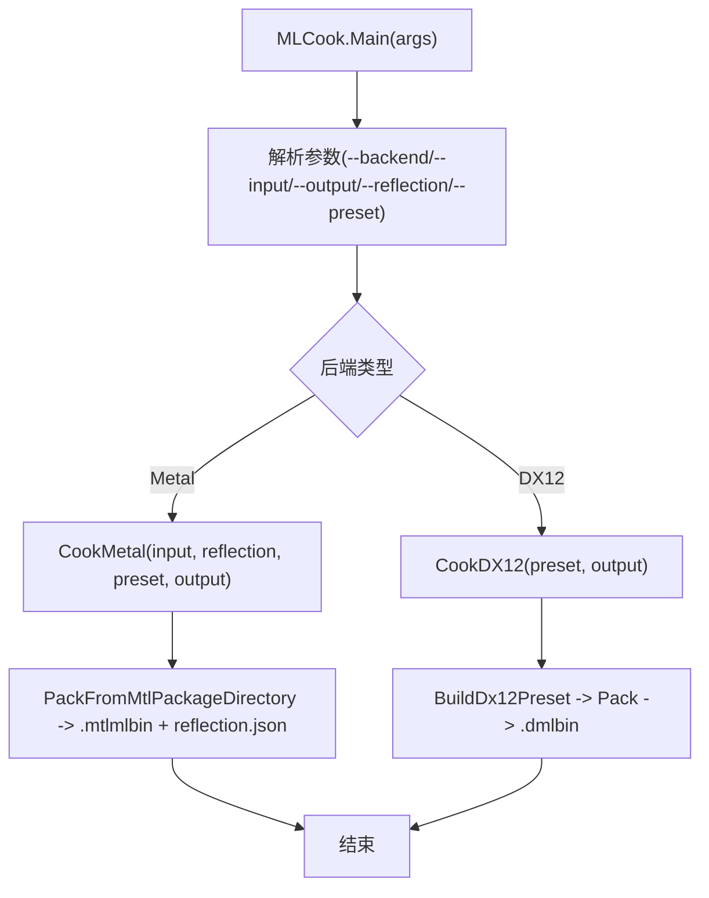
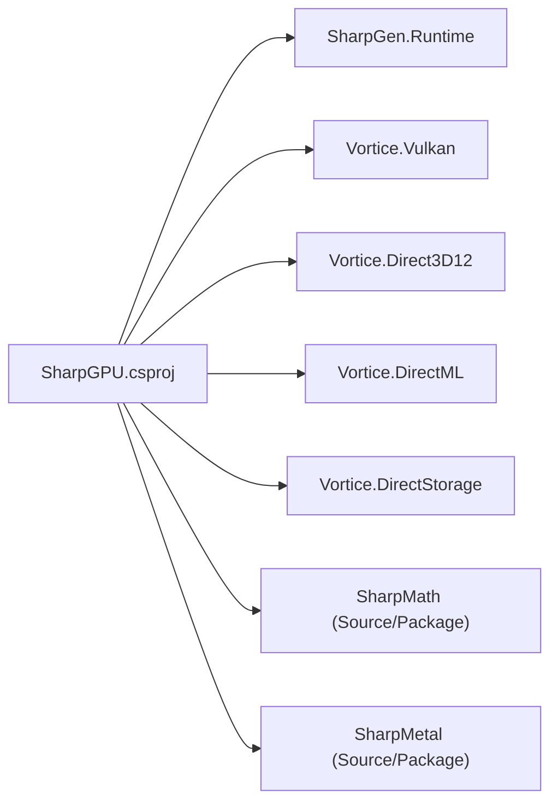

# 示例和教程

<cite>
**本文引用的文件**
- [README.md](file://README.md)
- [QuickStart.md](file://docs/SharpGPU/QuickStart.md)
- [FeatureMatrix.md](file://docs/SharpGPU/FeatureMatrix.md)
- [Program.cs（ComputeAndDraw）](file://samples/ComputeAndDraw/Program.cs)
- [ComputeWorkload.cs](file://samples/ComputeAndDraw/ComputeWorkload.cs)
- [RasterWorkload.cs](file://samples/ComputeAndDraw/RasterWorkload.cs)
- [Program.cs（Benchmarks）](file://benchmarks/SharpGPU.Benchmarks/Program.cs)
- [RHIInstance.cs](file://src/SharpGPU\Abstract\RHIInstance.cs)
- [RHIDevice.cs](file://src/SharpGPU\Abstract\RHIDevice.cs)
- [SharpGPU.csproj](file://src/SharpGPU/SharpGPU.csproj)
- [Program.cs（MLCook）](file://tools/SharpGPU.MLCook/Program.cs)
</cite>

## 目录
1. [简介](#简介)
2. [项目结构](#项目结构)
3. [核心组件](#核心组件)
4. [架构总览](#架构总览)
5. [详细组件分析](#详细组件分析)
6. [依赖关系分析](#依赖关系分析)
7. [性能与基准测试](#性能与基准测试)
8. [故障排除与调试](#故障排除与调试)
9. [结论](#结论)
10. [附录：逐步教程](#附录：逐步教程)

## 简介
本教程面向希望系统学习 SharpGPU 的开发者，提供从入门到进阶的学习路径。内容涵盖计算着色器、图形渲染、混合工作负载、性能基准测试、最佳实践与常见模式，并附带可运行的示例程序与详细的代码解释。通过本教程，你将掌握如何在 DirectX 12、Vulkan 与 Metal 后端上创建实例、设备、命令缓冲、管线、资源绑定与提交执行，以及如何利用查询、屏障、传递等机制进行性能分析与问题定位。

## 项目结构
仓库采用分层组织：
- src/SharpGPU：运行时抽象层与多后端实现（DirectX12、Vulkan、Metal），定义 RHI 公共契约与能力探测。
- samples/ComputeAndDraw：最小可运行示例，演示计算着色器与光栅化绘制流程。
- benchmarks/SharpGPU.Benchmarks：覆盖 API、后端、工作负载与提交的基准用例，支持 CSV/JSON 输出与基线回归检查。
- tools/SharpGPU.MLCook：离线 ML 二进制打包工具，用于生成 DX12 DirectML 与 Metal CoreML/Metal Package 产物。
- docs/SharpGPU：快速开始、特性矩阵与平台验证说明。

**图表来源**
- [RHIInstance.cs:46-156](file://src/SharpGPU\Abstract\RHIInstance.cs#L46-L156)
- [Program.cs（ComputeAndDraw）:7-15](file://samples/ComputeAndDraw/Program.cs#L7-L15)
- [Program.cs（Benchmarks）:25-57](file://benchmarks/SharpGPU.Benchmarks/Program.cs#L25-L57)
- [Program.cs（MLCook）:15-57](file://tools/SharpGPU.MLCook/Program.cs#L15-L57)

**章节来源**
- [README.md:12-16](file://README.md#L12-L16)
- [SharpGPU.csproj:1-47](file://src/SharpGPU/SharpGPU.csproj#L1-L47)

## 核心组件
- RHIInstance：后端工厂与平台能力检测，负责创建具体后端实例。
- RHIDevice：设备抽象，暴露队列、资源创建、查询、能力探测等接口。
- 命令与编码器：CommandBuffer、Compute/Raster/Transfer/WorkGraph Encoder，用于记录 GPU 操作。
- 资源与视图：Buffer、Texture、Sampler、BindingTable、PipelineLayout 等。
- 同步与查询：Fence、Semaphore、Query（时间戳、统计、遮挡等）。
- 构建器与范围：RHIDescriptorDefaults、Scopes（如 TransferPassScope）简化常用流程。

**章节来源**
- [RHIInstance.cs:6-15](file://src/SharpGPU\Abstract\RHIInstance.cs#L6-L15)
- [RHIInstance.cs:46-156](file://src/SharpGPU\Abstract\RHIInstance.cs#L46-L156)
- [RHIDevice.cs:422-527](file://src/SharpGPU\Abstract\RHIDevice.cs#L422-L527)

## 架构总览
SharpGPU 以 RHI 抽象为核心，屏蔽底层后端差异；上层示例与基准通过统一 API 创建实例、设备、命令缓冲与管线，并在不同后端上执行相同逻辑。

**图表来源**
- [RHIInstance.cs:122-156](file://src/SharpGPU\Abstract\RHIInstance.cs#L122-L156)
- [RHIDevice.cs:527-533](file://src/SharpGPU\Abstract\RHIDevice.cs#L527-L533)
- [ComputeWorkload.cs:47-161](file://samples/ComputeAndDraw/ComputeWorkload.cs#L47-L161)
- [RasterWorkload.cs:39-160](file://samples/ComputeAndDraw/RasterWorkload.cs#L39-L160)

## 详细组件分析

### 计算着色器示例（ComputeWorkload）
该示例展示了完整的计算管线：编译 C# 着色器、创建函数、构建管线布局与管线、分配输出与回读缓冲区、设置绑定表、记录计算与传输传递、提交并等待完成、读取结果校验。

**图表来源**
- [ComputeWorkload.cs:17-43](file://samples/ComputeAndDraw/ComputeWorkload.cs#L17-L43)
- [ComputeWorkload.cs:45-161](file://samples/ComputeAndDraw/ComputeWorkload.cs#L45-L161)
- [ComputeWorkload.cs:164-199](file://samples/ComputeAndDraw/ComputeWorkload.cs#L164-L199)

**章节来源**
- [ComputeWorkload.cs:17-43](file://samples/ComputeAndDraw/ComputeWorkload.cs#L17-L43)
- [ComputeWorkload.cs:45-161](file://samples/ComputeAndDraw/ComputeWorkload.cs#L45-L161)
- [ComputeWorkload.cs:164-199](file://samples/ComputeAndDraw/ComputeWorkload.cs#L164-L199)

### 光栅化绘制示例（RasterWorkload）
该示例演示了全屏三角形绘制与管线统计查询：创建纹理作为渲染目标、编译顶点/像素着色器、创建光栅管线、记录渲染传递、写入统计查询、提交并解析查询结果。

**图表来源**
- [RasterWorkload.cs:39-160](file://samples/ComputeAndDraw/RasterWorkload.cs#L39-L160)
- [RasterWorkload.cs:180-217](file://samples/ComputeAndDraw/RasterWorkload.cs#L180-L217)

**章节来源**
- [RasterWorkload.cs:39-160](file://samples/ComputeAndDraw/RasterWorkload.cs#L39-L160)
- [RasterWorkload.cs:180-217](file://samples/ComputeAndDraw/RasterWorkload.cs#L180-L217)

### 混合工作负载（Compute + Raster）
主程序依次运行计算示例，再按后端可用性运行光栅示例，展示如何根据后端支持情况选择执行路径。

**图表来源**
- [Program.cs（ComputeAndDraw）:7-15](file://samples/ComputeAndDraw/Program.cs#L7-L15)

**章节来源**
- [Program.cs（ComputeAndDraw）:7-15](file://samples/ComputeAndDraw/Program.cs#L7-L15)

### 性能基准测试框架（Benchmarks）
基准程序提供多种用例，覆盖 API 调用开销、后端命令记录、屏障与拷贝、绑定表更新与绑定、时间戳与 WorkGraph 编码、大量上传与调度等场景。支持预热、多次迭代采样、GC 控制、零分配断言、CSV/JSON 输出与基线回归检查。

**图表来源**
- [Program.cs（Benchmarks）:25-57](file://benchmarks/SharpGPU.Benchmarks/Program.cs#L25-L57)
- [Program.cs（Benchmarks）:84-129](file://benchmarks/SharpGPU.Benchmarks/Program.cs#L84-L129)

**章节来源**
- [Program.cs（Benchmarks）:25-57](file://benchmarks/SharpGPU.Benchmarks/Program.cs#L25-L57)
- [Program.cs（Benchmarks）:84-129](file://benchmarks/SharpGPU.Benchmarks/Program.cs#L84-L129)
- [Program.cs（Benchmarks）:229-306](file://benchmarks/SharpGPU.Benchmarks/Program.cs#L229-L306)
- [Program.cs（Benchmarks）:345-426](file://benchmarks/SharpGPU.Benchmarks/Program.cs#L345-L426)
- [Program.cs（Benchmarks）:542-628](file://benchmarks/SharpGPU.Benchmarks/Program.cs#L542-L628)
- [Program.cs（Benchmarks）:630-785](file://benchmarks/SharpGPU.Benchmarks/Program.cs#L630-L785)

### 机器学习工具（MLCook）
MLCook 提供离线打包能力：
- Metal：将 .mlpackage 或 .mtlpackage 打包为 .mtlmlbin，并生成反射 JSON。
- DX12：基于预设 IR 打包为 .dmlbin（仅 Windows）。

**图表来源**
- [Program.cs（MLCook）:15-57](file://tools/SharpGPU.MLCook/Program.cs#L15-L57)
- [Program.cs（MLCook）:60-88](file://tools/SharpGPU.MLCook/Program.cs#L60-L88)
- [Program.cs（MLCook）:90-142](file://tools/SharpGPU.MLCook/Program.cs#L90-L142)
- [Program.cs（MLCook）:193-207](file://tools/SharpGPU.MLCook/Program.cs#L193-L207)

**章节来源**
- [Program.cs（MLCook）:15-57](file://tools/SharpGPU.MLCook/Program.cs#L15-L57)
- [Program.cs（MLCook）:60-88](file://tools/SharpGPU.MLCook/Program.cs#L60-L88)
- [Program.cs（MLCook）:90-142](file://tools/SharpGPU.MLCook/Program.cs#L90-L142)
- [Program.cs（MLCook）:193-207](file://tools/SharpGPU.MLCook/Program.cs#L193-L207)

## 依赖关系分析
- 运行时目标与特性开关：
  - 目标框架 net10.0，启用不安全块与 Nullable。
  - 通过条件编译常量 SHARPGPU_ENABLE_DX12 控制 DirectX12 后端编译。
- 外部依赖：
  - SharpGen.Runtime、Vortice.Vulkan。
  - Vortice.Direct3D12、Vortice.DirectML、Vortice.DirectStorage（通过项目引用）。
  - 可选 SharpMath、SharpMetal（Source/Package 模式切换）。

**图表来源**
- [SharpGPU.csproj:1-47](file://src/SharpGPU/SharpGPU.csproj#L1-L47)

**章节来源**
- [SharpGPU.csproj:1-47](file://src/SharpGPU/SharpGPU.csproj#L1-L47)

## 性能与基准测试
- 基准用例分类：
  - API：对象创建与查找（如 Buffer 默认描述符、绑定表查找）。
  - 后端：命令缓冲 Begin/End、传递 Begin/End、屏障编码、拷贝编码、时间戳写入与解析、WorkGraph 编码。
  - 工作负载：大规模绑定表更新、批量上传拷贝、WorkGraph 多次调度。
  - 提交：空提交加 Fence 等待。
- 关键指标：
  - 平均耗时、中位数、95/99 分位、峰值耗时、托管内存分配量。
  - 支持零分配断言，确保热点路径无 GC 压力。
- 使用建议：
  - 合理设置 Warmup 与 Iterations，避免冷启动偏差。
  - 使用 CSV/JSON 输出便于持续集成与趋势分析。
  - 结合基线回归检查，防止性能退化。

**章节来源**
- [Program.cs（Benchmarks）:25-57](file://benchmarks/SharpGPU.Benchmarks/Program.cs#L25-L57)
- [Program.cs（Benchmarks）:84-129](file://benchmarks/SharpGPU.Benchmarks/Program.cs#L84-L129)
- [Program.cs（Benchmarks）:229-306](file://benchmarks/SharpGPU.Benchmarks/Program.cs#L229-L306)
- [Program.cs（Benchmarks）:345-426](file://benchmarks/SharpGPU.Benchmarks/Program.cs#L345-L426)
- [Program.cs（Benchmarks）:542-628](file://benchmarks/SharpGPU.Benchmarks/Program.cs#L542-L628)
- [Program.cs（Benchmarks）:630-785](file://benchmarks/SharpGPU.Benchmarks/Program.cs#L630-L785)

## 故障排除与调试
- 后端可用性检查：
  - 使用 RHIInstance.IsBackendSupported 判断当前平台是否支持目标后端，避免在不支持的平台上初始化失败。
- 设备状态与丢失诊断：
  - RHIDevice 提供设备状态与丢失诊断信息；在不可用时应捕获并处理异常，必要时重建设备。
- 查询与统计：
  - 使用 Query（Timestamp、Statistics、Occlusion）配合 Begin/End 与 Resolve，确保在提交后读取结果。
  - 若查询未就绪或能力不支持，应依据能力报告分支或降级策略。
- 屏障与访问语义：
  - 在阶段转换与资源用途变化时插入正确的 Barrier，避免数据竞争与未定义行为。
- 常见问题：
  - 着色器编译失败：确认目标后端与 ShaderModel 匹配，检查字节码非空。
  - 绑定表不生效：确认布局、元素顺序与索引一致，避免重复或冲突绑定。
  - 性能抖动：减少热点路径分配，复用命令缓冲与管线，合并小批次操作。

**章节来源**
- [RHIInstance.cs:59-93](file://src/SharpGPU\Abstract\RHIInstance.cs#L59-L93)
- [RHIDevice.cs:443-527](file://src/SharpGPU\Abstract\RHIDevice.cs#L443-L527)
- [RasterWorkload.cs:47-160](file://samples/ComputeAndDraw/RasterWorkload.cs#L47-L160)
- [ComputeWorkload.cs:115-161](file://samples/ComputeAndDraw/ComputeWorkload.cs#L115-L161)

## 结论
SharpGPU 提供了统一的 RHI 抽象，使开发者能够在多个后端上编写一次代码并高效执行。通过示例与基准，你可以快速上手计算与渲染流程，理解资源生命周期、命令记录与同步机制，并利用查询与屏障进行性能分析与问题定位。建议在工程中结合 FeatureMatrix 的能力报告与平台的 Qualified 测试结果，确保功能可用性与稳定性。

## 附录：逐步教程

### 从零开始：最小传输示例
- 目标：创建两个缓冲区，打开传输传递，复制数据，让作用域结束自动关闭编码器。
- 步骤要点：
  - 使用 RHIDescriptorDefaults.Buffer 创建上传与 GPU 本地缓冲区。
  - 通过 RHICommandBuffer.Begin/End 包裹 RHITransferPassScope，调用 CopyBufferToBuffer。
  - 注意资源释放与作用域管理。

**章节来源**
- [QuickStart.md:1-31](file://docs/SharpGPU/QuickStart.md#L1-L31)

### 计算着色器：写常量并回读
- 目标：编译 C# 着色器，创建计算管线，写入常量到输出缓冲区，回读并验证。
- 步骤要点：
  - 使用 CSharpShaderCompiler 编译，获取 DXIL/SPIR-V 字节码。
  - 创建 RHIFunction、RHIComputePipeline、绑定表与输出/回读缓冲区。
  - 记录计算与传输传递，提交并等待 Fence，Map 读取结果。

**章节来源**
- [ComputeWorkload.cs:17-43](file://samples/ComputeAndDraw/ComputeWorkload.cs#L17-L43)
- [ComputeWorkload.cs:45-161](file://samples/ComputeAndDraw/ComputeWorkload.cs#L45-L161)
- [ComputeWorkload.cs:164-199](file://samples/ComputeAndDraw/ComputeWorkload.cs#L164-L199)

### 光栅化绘制：全屏三角形与统计查询
- 目标：绘制全屏三角形，收集输入装配与像素着色器调用次数。
- 步骤要点：
  - 创建渲染目标纹理与光栅管线。
  - 记录渲染传递，设置视口与裁剪矩形，开启统计查询并绘制。
  - 提交后解析查询结果并验证计数。

**章节来源**
- [RasterWorkload.cs:39-160](file://samples/ComputeAndDraw/RasterWorkload.cs#L39-L160)
- [RasterWorkload.cs:180-217](file://samples/ComputeAndDraw/RasterWorkload.cs#L180-L217)

### 混合工作负载：计算与渲染串联
- 目标：先执行计算着色器，再进行光栅化绘制，验证前后端一致性。
- 步骤要点：
  - 在主程序中依次调用 ComputeWorkload.Run 与 RasterWorkload.Run。
  - 根据后端支持情况选择性执行。

**章节来源**
- [Program.cs（ComputeAndDraw）:7-15](file://samples/ComputeAndDraw/Program.cs#L7-L15)

### 性能基准：记录与回归
- 目标：对关键路径进行计时，输出指标并与基线比较。
- 步骤要点：
  - 选择合适的 BenchmarkCase，配置 Warmup 与 Iterations。
  - 运行后查看 Console/CSV/JSON 输出，必要时启用 FailOnRegression。

**章节来源**
- [Program.cs（Benchmarks）:25-57](file://benchmarks/SharpGPU.Benchmarks/Program.cs#L25-L57)
- [Program.cs（Benchmarks）:84-129](file://benchmarks/SharpGPU.Benchmarks/Program.cs#L84-L129)

### 机器学习：离线打包
- 目标：将 ML 模型打包为后端可执行二进制。
- 步骤要点：
  - Metal：准备 .mlpackage/.mtlpackage，运行 MLCook 生成 .mtlmlbin 与反射 JSON。
  - DX12：在 Windows 上使用预设 IR 生成 .dmlbin。

**章节来源**
- [Program.cs（MLCook）:15-57](file://tools/SharpGPU.MLCook/Program.cs#L15-L57)
- [Program.cs（MLCook）:60-88](file://tools/SharpGPU.MLCook/Program.cs#L60-L88)
- [Program.cs（MLCook）:90-142](file://tools/SharpGPU.MLCook/Program.cs#L90-L142)
- [Program.cs（MLCook）:193-207](file://tools/SharpGPU.MLCook/Program.cs#L193-L207)