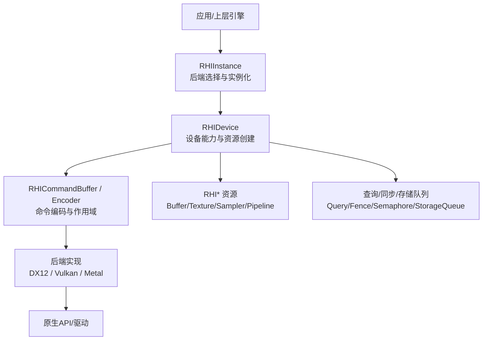
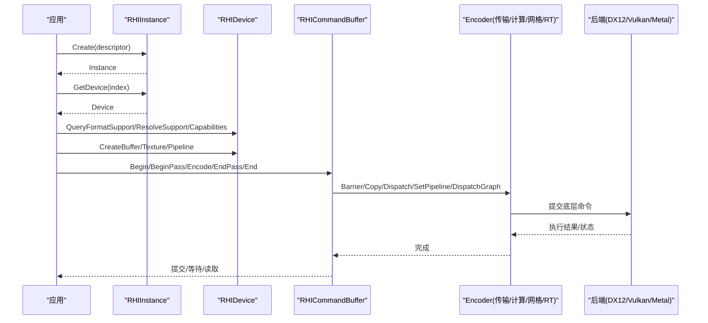
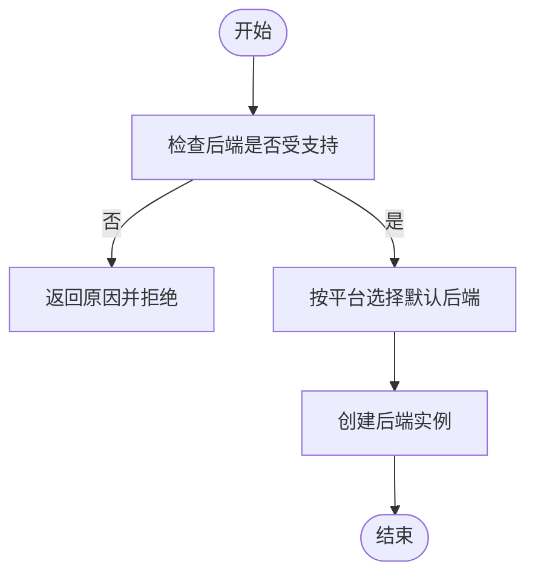
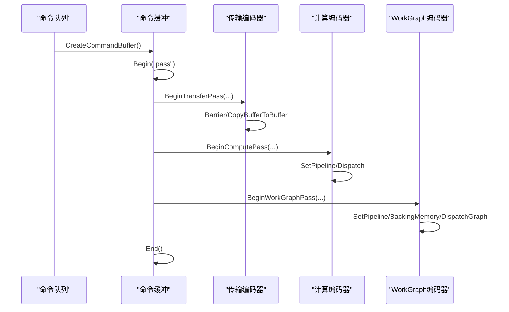
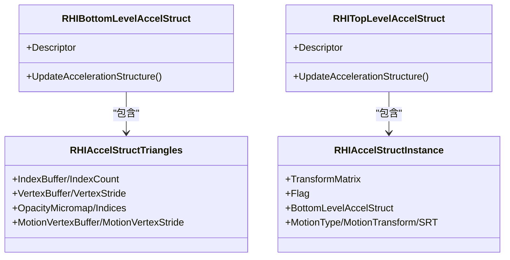
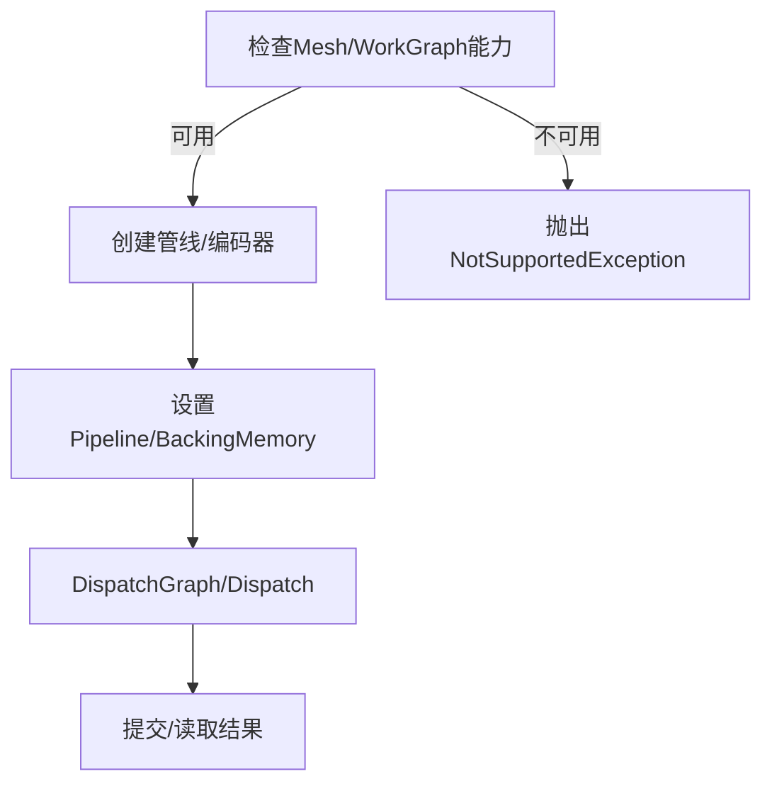
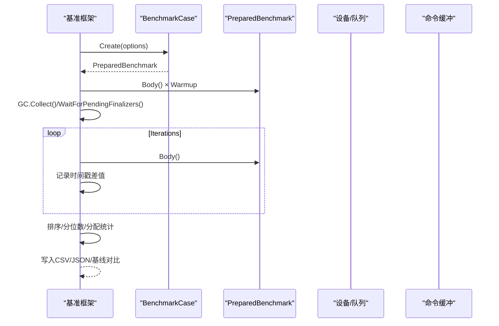
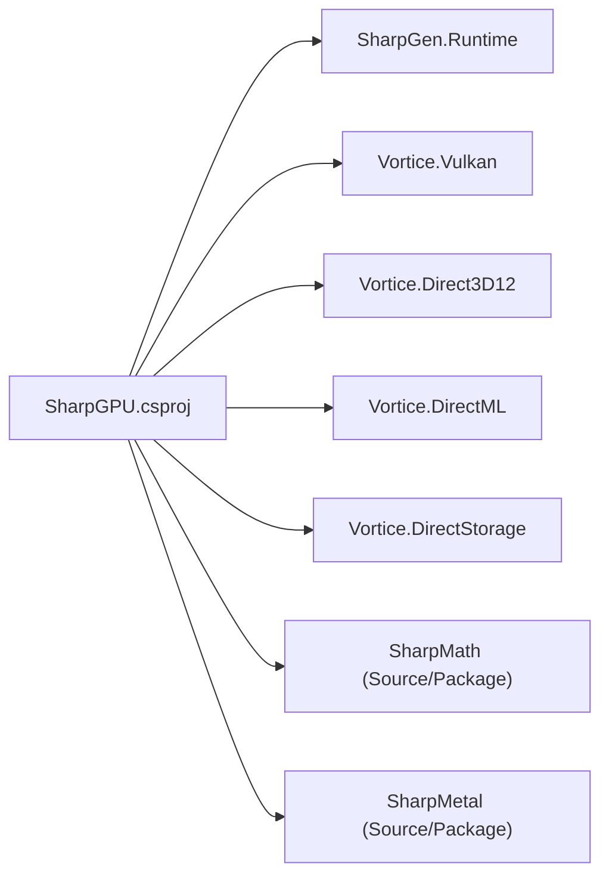

# 高级教程

<cite>
**本文引用的文件**
- [README.md](file://README.md)
- [DESIGN.md](file://DESIGN.md)
- [VERIFICATION.md](file://docs/VERIFICATION.md)
- [FeatureMatrix.md](file://docs/SharpGPU/FeatureMatrix.md)
- [QuickStart.md](file://docs/SharpGPU/QuickStart.md)
- [SharpGPU.csproj](file://src/SharpGPU/SharpGPU.csproj)
- [RHIInstance.cs](file://src/SharpGPU\Abstract\RHIInstance.cs)
- [RHIDevice.cs](file://src/SharpGPU\Abstract\RHIDevice.cs)
- [RHIAccelStruct.cs](file://src/SharpGPU\Abstract\RHIAccelStruct.cs)
- [Program.cs（基准）](file://benchmarks\SharpGPU.Benchmarks\Program.cs)
- [Program.cs（示例）](file://samples\ComputeAndDraw\Program.cs)
- [Disposal.cs](file://src/SharpGPU\Common\Core\Disposal.cs)
</cite>

## 目录
1. [简介](#简介)
2. [项目结构](#项目结构)
3. [核心组件](#核心组件)
4. [架构总览](#架构总览)
5. [详细组件分析](#详细组件分析)
6. [依赖关系分析](#依赖关系分析)
7. [性能考量与优化](#性能考量与优化)
8. [故障排查指南](#故障排查指南)
9. [结论](#结论)
10. [附录](#附录)

## 简介
本高级教程面向需要在现代 GPU 上构建高性能、跨后端图形与计算应用的工程师。内容覆盖混合工作负载编排、多后端切换策略、性能基准测试编写与分析、调试与性能分析工具使用，以及光线追踪、Mesh Shading、协作矩阵等现代特性的工程化实践。同时提供错误处理、异常管理与资源泄漏防护的高级技巧，帮助你在真实项目中建立稳健的架构与最佳实践。

## 项目结构
SharpGPU 采用“抽象 RHI + 多后端实现”的分层设计：
- 抽象层（Abstract）：定义统一的设备、命令缓冲、管线、纹理、缓冲区、查询、交换链等接口与数据结构。
- 后端实现（Dx12/Metal/Vulkan）：将抽象 API 映射到具体平台能力。
- 公共工具（Common）：包含基础对象生命周期管理、集合、数学、作用域封装等。
- 文档与验证（docs）：特性矩阵、快速入门、平台验证流程与注意事项。
- 示例与基准（samples/benchmarks）：最小可运行样例与性能基准套件。
- 第三方绑定（third_party/Vortice.Windows）：维护的 Direct3D/DirectML/DirectStorage 绑定与补丁。

**图表来源**
- [RHIInstance.cs:46-159](file://src/SharpGPU\Abstract\RHIInstance.cs#L46-L159)
- [RHIDevice.cs:422-527](file://src/SharpGPU\Abstract\RHIDevice.cs#L422-L527)

**章节来源**
- [README.md:1-23](file://README.md#L1-L23)
- [DESIGN.md:1-33](file://DESIGN.md#L1-L33)

## 核心组件
- RHIInstance：负责后端选择、平台能力检查与实例创建；支持 DirectX12、Vulkan、Metal 三种后端。
- RHIDevice：设备能力探测、资源创建、格式/MSAA/解析支持查询、时钟校准、协作矩阵配置枚举等。
- 命令与编码器：通过 CommandBuffer 与各类 Pass Encoder（传输、计算、网格、WorkGraph 等）组织混合工作负载。
- 资源模型：Buffer/Texture/Sampler/Pipeline/Query/Heap 等统一抽象，配合 Descriptor 描述符与布局进行绑定。
- 现代特性：光线追踪加速结构（BLAS/TLAS）、不透明度微图（Opacity Micromap）、运动模糊（Motion）、Mesh Shading、协作矩阵（Cooperative Matrix）。

**章节来源**
- [RHIInstance.cs:59-159](file://src/SharpGPU\Abstract\RHIInstance.cs#L59-L159)
- [RHIDevice.cs:422-800](file://src/SharpGPU\Abstract\RHIDevice.cs#L422-L800)
- [FeatureMatrix.md:44-73](file://docs/SharpGPU/FeatureMatrix.md#L44-L73)

## 架构总览
SharpGPU 以 RHIInstance 为入口，根据平台与配置选择后端并创建 RHIDevice。上层通过 RHIDevice 获取命令队列、创建资源与管线，并使用命令缓冲与编码器组织渲染/计算/传输/光线追踪等工作负载。所有后端行为由能力探测与契约约束，未实现或不可用的特性会显式失败，避免静默降级。

**图表来源**
- [RHIInstance.cs:122-159](file://src/SharpGPU\Abstract\RHIInstance.cs#L122-L159)
- [RHIDevice.cs:527-601](file://src/SharpGPU\Abstract\RHIDevice.cs#L527-L601)
- [Program.cs（基准）:229-277](file://benchmarks\SharpGPU.Benchmarks\Program.cs#L229-L277)

## 详细组件分析

### 多后端切换与运行时选择
- 平台检测：IsBackendSupported 根据操作系统限制后端可用性（例如 DX12 仅 Windows，Metal 仅 macOS/iOS）。
- 自动选择：GetBackendByPlatform 根据平台返回默认后端（Windows→DX12，macOS/iOS→Metal，Linux/Android→Vulkan），也可强制 Vulkan。
- 实例创建：Create 根据 descriptor.Backend 构造对应后端实例，并在未编译 DX12 时抛出明确异常。

**图表来源**
- [RHIInstance.cs:59-120](file://src/SharpGPU\Abstract\RHIInstance.cs#L59-L120)
- [RHIInstance.cs:122-159](file://src/SharpGPU\Abstract\RHIInstance.cs#L122-L159)

**章节来源**
- [RHIInstance.cs:59-159](file://src/SharpGPU\Abstract\RHIInstance.cs#L59-L159)

### 混合工作负载编排（传输+计算+网格/WorkGraph）
- 传输通道：使用 BeginTransferPass/EndTransferPass 或作用域 BeginScopedTransferPass 组织 Copy/Barrier 等操作。
- 计算通道：BeginComputePass → SetPipeline → Dispatch。
- 网格/WorkGraph：BeginMeshPass/BeginWorkGraphPass → SetPipeline/BackingMemory → DispatchGraph。
- 时间戳与统计：RHIQuery 用于 Timestamp/PipelineStatistics 测量，结合 ResolveQuery 读取结果。

**图表来源**
- [Program.cs（基准）:253-375](file://benchmarks\SharpGPU.Benchmarks\Program.cs#L253-L375)
- [Program.cs（基准）:542-627](file://benchmarks\SharpGPU.Benchmarks\Program.cs#L542-L627)

**章节来源**
- [Program.cs（基准）:229-375](file://benchmarks\SharpGPU.Benchmarks\Program.cs#L229-L375)
- [Program.cs（基准）:542-627](file://benchmarks\SharpGPU.Benchmarks\Program.cs#L542-L627)

### 光线追踪与现代特性（BLAS/TLAS、Opacity Micromap、Motion）
- 加速结构：BLAS（几何体）与 TLAS（实例）分离，支持 AABB/Curves/Triangles，支持索引与顶点缓冲。
- 不透明度微图：可为三角形附加 OpacityMicromap，支持特殊索引与禁用 OMM 的实例标志。
- 运动模糊：支持 Motion 标志与 SRT/矩阵变换，要求数据与标志一致，且不同后端共享顶点步长约束。
- 能力门控：相关工厂/编码在不可用时抛出 NotSupportedException，确保无静默降级。

**图表来源**
- [RHIAccelStruct.cs:707-752](file://src/SharpGPU\Abstract\RHIAccelStruct.cs#L707-L752)
- [RHIAccelStruct.cs:129-150](file://src/SharpGPU\Abstract\RHIAccelStruct.cs#L129-L150)
- [RHIAccelStruct.cs:707-720](file://src/SharpGPU\Abstract\RHIAccelStruct.cs#L707-L720)

**章节来源**
- [RHIAccelStruct.cs:10-21](file://src/SharpGPU\Abstract\RHIAccelStruct.cs#L10-L21)
- [RHIAccelStruct.cs:129-150](file://src/SharpGPU\Abstract\RHIAccelStruct.cs#L129-L150)
- [RHIAccelStruct.cs:201-396](file://src/SharpGPU\Abstract\RHIAccelStruct.cs#L201-L396)
- [RHIAccelStruct.cs:426-553](file://src/SharpGPU\Abstract\RHIAccelStruct.cs#L426-L553)
- [FeatureMatrix.md:46-58](file://docs/SharpGPU/FeatureMatrix.md#L46-L58)

### Mesh Shading 与 WorkGraph
- Mesh Shading：需要设备能力开启，工厂/编码不可用时抛出不支持异常；需准备 mesh pipeline 与像素读回证据。
- WorkGraph：基于 RHIWorkGraphPipeline/Encoder 的细粒度任务图调度，适合复杂依赖与资源共享场景。

**图表来源**
- [Program.cs（基准）:582-627](file://benchmarks\SharpGPU.Benchmarks\Program.cs#L582-L627)
- [FeatureMatrix.md:56-60](file://docs/SharpGPU/FeatureMatrix.md#L56-L60)

**章节来源**
- [Program.cs（基准）:582-627](file://benchmarks\SharpGPU.Benchmarks\Program.cs#L582-L627)
- [FeatureMatrix.md:56-60](file://docs/SharpGPU/FeatureMatrix.md#L56-L60)

### 协作矩阵（Cooperative Matrix）
- 能力探测：通过 RHIDeviceCapabilities.Compute.CooperativeMatrix 判断支持情况。
- 配置枚举：QueryCooperativeMatrixConfigs 将后端配置的协作矩阵参数复制到目标 Span，空目标返回 0，过小则返回所需计数。
- 注意：当前 DX12 路径不可用（vendored SDK 无 WaveMMA 查询），Vulkan 可通过扩展枚举。

**章节来源**
- [RHIDevice.cs:602-636](file://src/SharpGPU\Abstract\RHIDevice.cs#L602-L636)
- [FeatureMatrix.md:69-70](file://docs/SharpGPU/FeatureMatrix.md#L69-L70)

### 性能基准测试：设计与分析
- 用例组织：CreateCases 注册多种基准（API、后端、工作负载、提交），支持跳过与适配器名称记录。
- 执行流程：预热 → GC 清理 → 多次计时采样 → 排序与分位数统计 → 可选零分配校验。
- 输出：控制台、CSV、JSON，支持基线回归比较。
- 典型场景：命令 Begin/End、传输 Pass、屏障、拷贝、绑定表更新/绑定、时间戳、WorkGraph 调度、大量 bindless 更新、批量上传、空提交 fence。

**图表来源**
- [Program.cs（基准）:25-129](file://benchmarks\SharpGPU.Benchmarks\Program.cs#L25-L129)
- [Program.cs（基准）:60-81](file://benchmarks\SharpGPU.Benchmarks\Program.cs#L60-L81)

**章节来源**
- [Program.cs（基准）:25-129](file://benchmarks\SharpGPU.Benchmarks\Program.cs#L25-L129)
- [Program.cs（基准）:60-81](file://benchmarks\SharpGPU.Benchmarks\Program.cs#L60-L81)

### 示例：Compute and Draw 多后端运行
- 示例程序演示计算与绘制资源的创建与释放，并遍历支持的 backend（DX12/Vulkan）运行栅格化负载。
- 通过 IsBackendSupported 进行运行时能力检查，确保只在可用后端执行。

**章节来源**
- [Program.cs（示例）:7-13](file://samples\ComputeAndDraw\Program.cs#L7-L13)

## 依赖关系分析
- 项目依赖：SharpGPU.csproj 引用 SharpGen.Runtime、Vortice.Vulkan，以及本地 Vortice.Windows 子项目（Direct3D12、DirectML、DirectStorage）。
- 源/包模式：通过 StackReferenceMode 切换引用方式；Source 模式下引入 SharpMath/SharpMetal 源码，Package 模式下使用 NuGet 包。
- 嵌入资源：FeatureMatrix.md 与 native/assets.json 作为嵌入式资源参与打包与验证。

**图表来源**
- [SharpGPU.csproj:15-29](file://src/SharpGPU/SharpGPU.csproj#L15-L29)
- [SharpGPU.csproj:30-45](file://src/SharpGPU/SharpGPU.csproj#L30-L45)

**章节来源**
- [SharpGPU.csproj:1-47](file://src/SharpGPU/SharpGPU.csproj#L1-L47)

## 性能考量与优化
- 命令编码与 Pass 边界：尽量合并同类型操作，减少 Pass 切换；使用 BeginScopedTransferPass 降低忘记关闭的风险。
- 屏障与内存可见性：仅在必要时插入 Barrier，精确指定阶段与访问掩码，避免过度同步。
- 绑定表与根签名：预构建 BindingTableLayout，批量 SetBindElement；避免每帧重建。
- 时间戳与统计：使用 Timestamp/PipelineStatistics 定位瓶颈；结合 CalibratedTimestamps 做跨队列对齐。
- 资源复用：池化 Buffer/Texture/View，减少频繁创建销毁；利用 Heap 与 Placed Buffer（若后端支持）。
- 工作负载并行：分离 Compute/Transfer/Graphics 队列，合理交错提交，提升吞吐。
- 现代特性优化：合理使用 BLAS/TLAS 更新频率；启用 Motion 时保持顶点步长一致；Mesh/WorkGraph 减少 CPU 侧调度开销。

[本节为通用指导，无需特定文件来源]

## 故障排查指南
- 设备丢失与诊断：RHIDevice 提供 MarkDeviceLost 与 ThrowIfDeviceUnavailable，确保设备状态变化时立即抛出带诊断的异常。
- 能力门控：对不支持的特性（如 Mesh/WorkGraph/RayTracing/CooperativeMatrix）会抛出 NotSupportedException，避免静默降级。
- 资源生命周期：Disposal 基类提供 Dispose/Release/ValidateCanDispose 与终结器日志（DEBUG），防止资源泄漏。
- 平台与后端：RHIInstance.IsBackendSupported 给出明确的不可用原因；Create 在未编译后端时抛出明确异常。
- 验证与报告：遵循 docs/VERIFICATION.md 的流程生成特征报告与测试结果，确保平台与设备匹配。

**章节来源**
- [RHIDevice.cs:465-527](file://src/SharpGPU\Abstract\RHIDevice.cs#L465-L527)
- [Disposal.cs:7-65](file://src/SharpGPU\Common\Core\Disposal.cs#L7-L65)
- [RHIInstance.cs:59-159](file://src/SharpGPU\Abstract\RHIInstance.cs#L59-L159)
- [VERIFICATION.md:1-404](file://docs/VERIFICATION.md#L1-L404)

## 结论
SharpGPU 提供了稳定、可验证、可扩展的 GPU HAL，通过能力探测与严格契约确保现代 GPU 特性在不同后端的一致行为。借助其命令编码模型、资源抽象与基准工具，开发者可以高效构建混合工作负载、实现多后端切换，并以严谨的方式优化性能与可靠性。建议在生产环境中结合 FeatureMatrix 与 VERIFICATION 流程持续验证能力与兼容性，使用 Disposal 与设备诊断机制保障资源与状态安全。

[本节为总结，无需特定文件来源]

## 附录
- 快速入门：参考 QuickStart 的最小传输 Pass 示例，理解命令缓冲与作用域的使用。
- 特性矩阵：对照 FeatureMatrix 了解各特性的公开契约、能力门控与不支持行为。
- 验证流程：依据 VERIFICATION 进行构建、测试、打包与平台资格验证，确保交付质量。

**章节来源**
- [QuickStart.md:1-31](file://docs/SharpGPU/QuickStart.md#L1-L31)
- [FeatureMatrix.md:1-88](file://docs/SharpGPU/FeatureMatrix.md#L1-L88)
- [VERIFICATION.md:1-404](file://docs/VERIFICATION.md#L1-L404)