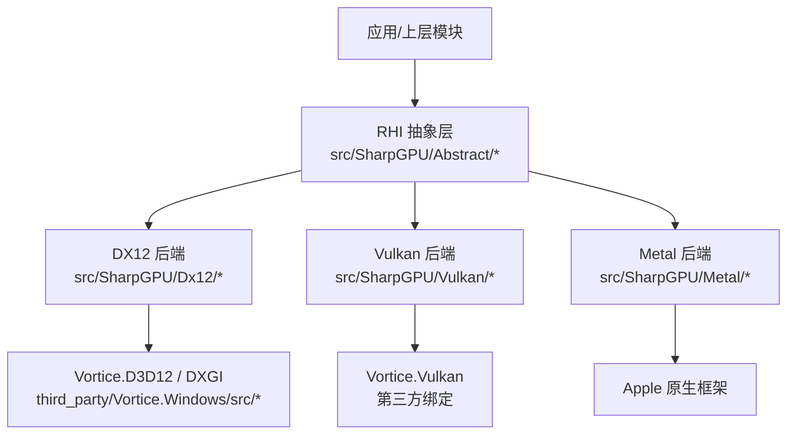
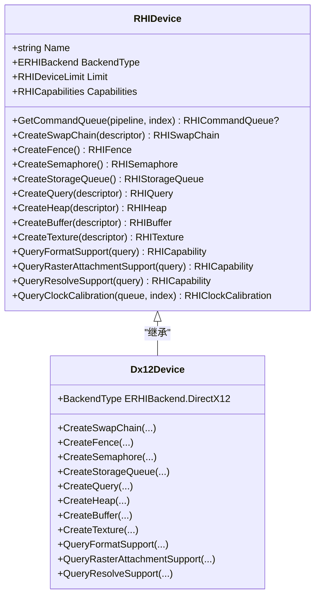
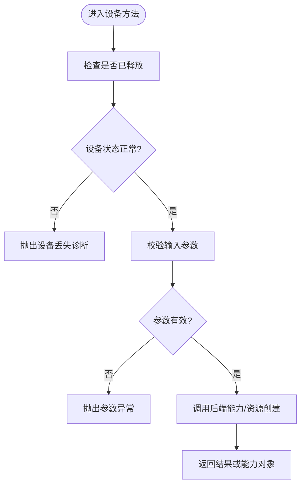
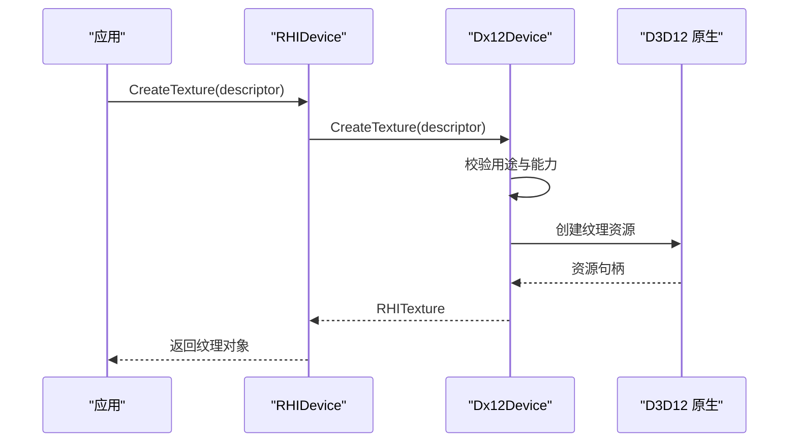
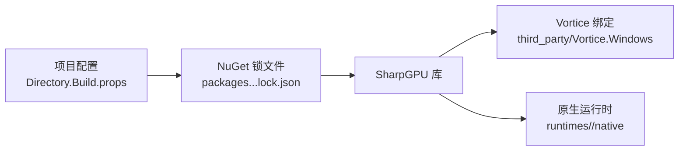

# 代码规范

<cite>
**本文引用的文件**
- [README.md](file://README.md)
- [DESIGN.md](file://DESIGN.md)
- [AGENTS.md](file://AGENTS.md)
- [Directory.Build.props](file://Directory.Build.props)
- [third_party/Vortice.Windows/.editorconfig](file://third_party/Vortice.Windows/.editorconfig)
- [src/SharpGPU/Abstract/RHIDevice.cs](file://src/SharpGPU/Abstract/RHIDevice.cs)
- [src/SharpGPU/Dx12/Dx12Device.cs](file://src/SharpGPU/Dx12/Dx12Device.cs)
- [samples/ComputeAndDraw/Program.cs](file://samples/ComputeAndDraw/Program.cs)
- [docs/VERIFICATION.md](file://docs/VERIFICATION.md)
</cite>

## 目录
1. [简介](#简介)
2. [项目结构](#项目结构)
3. [核心组件](#核心组件)
4. [架构总览](#架构总览)
5. [详细组件分析](#详细组件分析)
6. [依赖关系分析](#依赖关系分析)
7. [性能与可维护性考量](#性能与可维护性考量)
8. [故障排查指南](#故障排查指南)
9. [结论](#结论)
10. [附录：工具链、静态分析与审查清单](#附录工具链静态分析与审查清单)

## 简介
本规范面向 SharpGPU 项目的 C# 代码风格、命名约定、注释规范、架构设计原则，以及 RHI 与后端边界、Vortice 源文件维护策略、许可证要求、质量检查与代码审查标准。目标是确保多后端（DirectX 12、Vulkan、Metal）在统一抽象下保持一致的实现风格、错误处理与能力探测方式，同时保持对第三方 Vortice 绑定的可追溯维护。

## 项目结构
- src/SharpGPU：运行时核心，包含抽象 RHI 接口与各后端实现（Dx12、Vulkan、Metal）。
- samples：示例工作负载，演示计算与渲染路径。
- docs：设计、验证与特性矩阵等权威文档。
- eng：构建、测试与打包的自动化脚本。
- third_party/Vortice.Windows：维护的 Vortice 绑定源码与补丁，受版本与 ABI 约束。
- tests：独立一致性测试套件，覆盖各后端行为与契约。

图表来源
- [src/SharpGPU/Abstract/RHIDevice.cs:422-527](file://src/SharpGPU/Abstract/RHIDevice.cs#L422-L527)
- [src/SharpGPU/Dx12/Dx12Device.cs:48-158](file://src/SharpGPU/Dx12/Dx12Device.cs#L48-L158)
- [third_party/Vortice.Windows/.editorconfig:23-157](file://third_party/Vortice.Windows/.editorconfig#L23-L157)

章节来源
- [README.md:12-22](file://README.md#L12-L22)
- [DESIGN.md:1-10](file://DESIGN.md#L1-L10)

## 核心组件
- RHI 抽象设备 RHIDevice：定义跨后端的设备能力、队列、资源创建、查询与生命周期管理。所有后端通过继承该抽象类实现具体行为。
- 后端设备 Dx12Device：实现 DirectX 12 的具体能力探测、资源创建、命令签名、描述符堆与 DirectML 集成。
- 示例 Program：展示如何枚举并运行计算与光栅化工作负载，体现后端选择流程。

章节来源
- [src/SharpGPU/Abstract/RHIDevice.cs:422-527](file://src/SharpGPU/Abstract/RHIDevice.cs#L422-L527)
- [src/SharpGPU/Dx12/Dx12Device.cs:48-158](file://src/SharpGPU/Dx12/Dx12Device.cs#L48-L158)
- [samples/ComputeAndDraw/Program.cs:7-15](file://samples/ComputeAndDraw/Program.cs#L7-L15)

## 架构总览
SharpGPU 采用“RHI 抽象 + 多后端实现”的分层架构。上层仅依赖 RHI 抽象，不感知具体后端；后端实现负责将抽象操作映射到原生 API（如 D3D12、Vulkan、Metal），并通过能力探测返回精确支持信息。

图表来源
- [src/SharpGPU/Abstract/RHIDevice.cs:422-527](file://src/SharpGPU/Abstract/RHIDevice.cs#L422-L527)
- [src/SharpGPU/Dx12/Dx12Device.cs:48-158](file://src/SharpGPU/Dx12/Dx12Device.cs#L48-L158)

## 详细组件分析

### RHI 抽象设备（RHIDevice）
- 职责：提供统一的设备抽象，包括能力查询、资源创建、队列获取、同步原语与生命周期管理。
- 关键模式：
  - 能力探测：以 RHICapability 表达可用性与限制，避免隐式降级或兼容回退。
  - 参数校验：构造器与方法中对格式、维度、采样数、用途等进行严格校验，失败即抛异常。
  - 设备丢失：通过 MarkDeviceLost 与 ThrowIfDeviceUnavailable 保证状态一致性与诊断信息传递。
- 复杂度：多数方法为 O(1) 参数校验与能力检查；部分查询涉及原生能力探测，时间复杂度取决于底层驱动。

图表来源
- [src/SharpGPU/Abstract/RHIDevice.cs:465-527](file://src/SharpGPU/Abstract/RHIDevice.cs#L465-L527)
- [src/SharpGPU/Abstract/RHIDevice.cs:577-601](file://src/SharpGPU/Abstract/RHIDevice.cs#L577-L601)

章节来源
- [src/SharpGPU/Abstract/RHIDevice.cs:422-800](file://src/SharpGPU/Abstract/RHIDevice.cs#L422-L800)

### DX12 后端设备（Dx12Device）
- 职责：实现 DirectX 12 的设备初始化、能力探测、资源创建、命令签名与描述符管理，以及与 DirectML 的集成。
- 关键模式：
  - 能力探测：基于 D3D12 Feature Support 与 Format Support 返回精确能力掩码。
  - 资源创建：先校验用途与能力，再创建具体资源；对放置资源进行堆分配与偏移管理。
  - 错误处理：缺失能力时返回不可用能力对象，而非静默降级。
- 依赖：Vortice.D3D12、Vortice.DXGI 等原生绑定。

图表来源
- [src/SharpGPU/Dx12/Dx12Device.cs:297-303](file://src/SharpGPU/Dx12/Dx12Device.cs#L297-L303)
- [src/SharpGPU/Abstract/RHIDevice.cs:553-553](file://src/SharpGPU/Abstract/RHIDevice.cs#L553-L553)

章节来源
- [src/SharpGPU/Dx12/Dx12Device.cs:48-158](file://src/SharpGPU/Dx12/Dx12Device.cs#L48-L158)
- [src/SharpGPU/Dx12/Dx12Device.cs:297-358](file://src/SharpGPU/Dx12/Dx12Device.cs#L297-L358)

### 示例工作负载（ComputeAndDraw）
- 职责：演示计算与光栅化路径的后端选择与执行。
- 关键点：
  - 使用 RHIInstance.IsBackendSupported 判断后端可用性。
  - 依次运行 ComputeWorkload 与 RasterWorkload，体现后端切换。

章节来源
- [samples/ComputeAndDraw/Program.cs:7-15](file://samples/ComputeAndDraw/Program.cs#L7-L15)

## 依赖关系分析
- 构建与包管理：
  - 根级 Directory.Build.props 集中设置输出路径、锁定模式、平台与 RID 区分。
  - NuGet 锁文件按 Source/Package 模式与 RID 隔离，确保可重现构建。
- 第三方绑定：
  - Vortice.Windows 作为维护的绑定源码，需保留其约定与补丁，不得替换为上游包。
- 平台边界：
  - Windows x64 为主要合格平台；其他平台需匹配主机验证。

图表来源
- [Directory.Build.props:1-24](file://Directory.Build.props#L1-L24)
- [docs/VERIFICATION.md:66-99](file://docs/VERIFICATION.md#L66-L99)

章节来源
- [Directory.Build.props:1-24](file://Directory.Build.props#L1-L24)
- [docs/VERIFICATION.md:66-99](file://docs/VERIFICATION.md#L66-L99)

## 性能与可维护性考量
- 能力探测优先：通过 RHICapability 明确支持范围，避免运行时分支过多导致的性能抖动。
- 资源创建校验前置：在创建前完成用途、格式、维度等校验，减少无效原生调用。
- 锁与并发：设备状态变更使用锁与 Volatile 读写，保证线程安全与可见性。
- 可维护性：保持单一实现路径，禁止兼容性垫片与静默降级；新增功能需配套能力探测与测试。

[本节为通用指导，无需特定文件来源]

## 故障排查指南
- 设备丢失诊断：当设备进入非 Operational 状态时，必须携带诊断信息；调用方应捕获并处理。
- 参数校验失败：常见于格式、维度、采样数、用途不合法；检查构造器与方法中的参数断言。
- 能力不可用：查询返回 Unavailable 时，需根据 ProbeSource 定位原因并调整用法或降级策略。
- 原生加载失败：Windows 长路径问题需在 NativeLibrary 边界使用扩展长度路径；参考验证文档中的修复记录。

章节来源
- [src/SharpGPU/Abstract/RHIDevice.cs:465-527](file://src/SharpGPU/Abstract/RHIDevice.cs#L465-L527)
- [docs/VERIFICATION.md:252-269](file://docs/VERIFICATION.md#L252-L269)

## 结论
SharpGPU 通过清晰的 RHI 抽象与后端分离，结合严格的能力探测与参数校验，实现了跨平台 GPU 抽象的一致性与可验证性。遵循本规范可确保代码风格统一、边界清晰、可维护性强，并在多后端环境下保持稳定行为。

[本节为总结，无需特定文件来源]

## 附录：工具链、静态分析与审查清单

### C# 代码风格与命名约定
- 缩进与换行：4 空格缩进，大括号另起一行，控制流关键字后留空。
- 命名：
  - 实例字段：m_PascalCase
  - 静态字段：s_PascalCase
  - 常量字段：PascalCase
  - 内部/私有字段：_camelCase
- 类型声明：优先使用内置关键字而非 BCL 类型；仅在类型明显时使用 var。
- 表达式体：鼓励使用方法、构造函数、属性等的表达式体形式。
- 命名空间：使用文件级命名空间声明。

章节来源
- [AGENTS.md:15-19](file://AGENTS.md#L15-L19)
- [third_party/Vortice.Windows/.editorconfig:23-157](file://third_party/Vortice.Windows/.editorconfig#L23-L157)

### 注释规范
- 公共 API 需提供 XML 摘要说明用途、参数与返回值。
- 复杂逻辑处添加行内注释解释意图与约束。
- 能力探测与后端差异处标注 ProbeSource 以便追踪。

章节来源
- [src/SharpGPU/Abstract/RHIDevice.cs:71-143](file://src/SharpGPU/Abstract/RHIDevice.cs#L71-L143)
- [src/SharpGPU/Dx12/Dx12Device.cs:360-407](file://src/SharpGPU/Dx12/Dx12Device.cs#L360-L407)

### 架构设计原则
- 保持 RHI 与后端边界明确：上层不感知后端细节，后端不泄露原生类型至抽象层。
- 单一实现路径：禁止遗留别名、转发程序集、兼容垫片或静默依赖回退。
- 能力显式化：不支持的功能返回不可用能力，而非降级实现。
- 平台边界清晰：不同平台需独立验证，不得以“便携性”掩盖未验证路径。

章节来源
- [DESIGN.md:5-10](file://DESIGN.md#L5-L10)
- [AGENTS.md:9-19](file://AGENTS.md#L9-L19)

### RHI 与后端边界要求
- 抽象层仅暴露稳定契约；后端实现封装原生调用与平台差异。
- 能力探测结果以 RHICapability 表达，包含层级、策略与限制。
- 设备状态变更需通过统一入口，确保诊断信息完整。

章节来源
- [src/SharpGPU/Abstract/RHIDevice.cs:422-527](file://src/SharpGPU/Abstract/RHIDevice.cs#L422-L527)
- [src/SharpGPU/Dx12/Dx12Device.cs:420-544](file://src/SharpGPU/Dx12/Dx12Device.cs#L420-L544)

### Vortice 源文件维护策略
- 维护 Vortice 绑定源码与补丁，不得替换为缺乏自定义行为的上游包。
- 生成绑定与补丁需可重建，保留原始版权与许可证。
- 版本与 ABI 固定：Vulkan 绑定固定为 3.2.1，变更需重新验证。

章节来源
- [AGENTS.md:9-19](file://AGENTS.md#L9-L19)
- [docs/VERIFICATION.md:66-74](file://docs/VERIFICATION.md#L66-L74)

### 许可证要求
- 第一方代码与包元数据使用 MPL-2.0。
- 保留 LICENSE、来源归属与第三方许可证及通知。
- 应用部署时需复制 ThirdPartyNotices 内容，确保消费者可见。

章节来源
- [AGENTS.md:15-19](file://AGENTS.md#L15-L19)
- [DESIGN.md:22-26](file://DESIGN.md#L22-L26)
- [docs/VERIFICATION.md:352-369](file://docs/VERIFICATION.md#L352-L369)

### 代码质量检查与静态分析规则
- EditorConfig 统一格式化：缩进、换行、空白、命名规则。
- MSBuild 锁定模式：RestoreLockedMode=true 确保依赖可重现。
- 警告处理：编译警告需评估并修复，避免累积技术债。

章节来源
- [third_party/Vortice.Windows/.editorconfig:23-157](file://third_party/Vortice.Windows/.editorconfig#L23-L157)
- [Directory.Build.props:17-22](file://Directory.Build.props#L17-L22)
- [docs/VERIFICATION.md:146-154](file://docs/VERIFICATION.md#L146-L154)

### 代码审查标准
- 变更需通过 Source 与 Package 两种模式的构建与测试。
- 检查 native/assets.json 哈希与包内容，确保原生资产正确。
- 能力探测与错误路径需有对应测试覆盖。
- 禁止引入未经验证的平台路径或兼容性回退。

章节来源
- [docs/VERIFICATION.md:146-154](file://docs/VERIFICATION.md#L146-L154)
- [docs/VERIFICATION.md:318-350](file://docs/VERIFICATION.md#L318-L350)

### 常见反模式与最佳实践
- 反模式：
  - 静默降级：不支持功能时返回默认实现而非不可用能力。
  - 混合模式：Source 与 Package 依赖混用导致解析不一致。
  - 硬编码路径：使用开发者本地路径破坏可移植性。
- 最佳实践：
  - 前置校验：在资源创建前完成参数与能力检查。
  - 明确能力：使用 RHICapability 表达支持范围与限制。
  - 可重现构建：使用锁定依赖与隔离缓存。

章节来源
- [src/SharpGPU/Abstract/RHIDevice.cs:577-601](file://src/SharpGPU/Abstract/RHIDevice.cs#L577-L601)
- [Directory.Build.props:17-22](file://Directory.Build.props#L17-L22)
- [docs/VERIFICATION.md:66-99](file://docs/VERIFICATION.md#L66-L99)