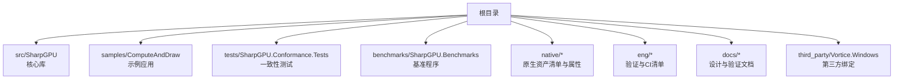
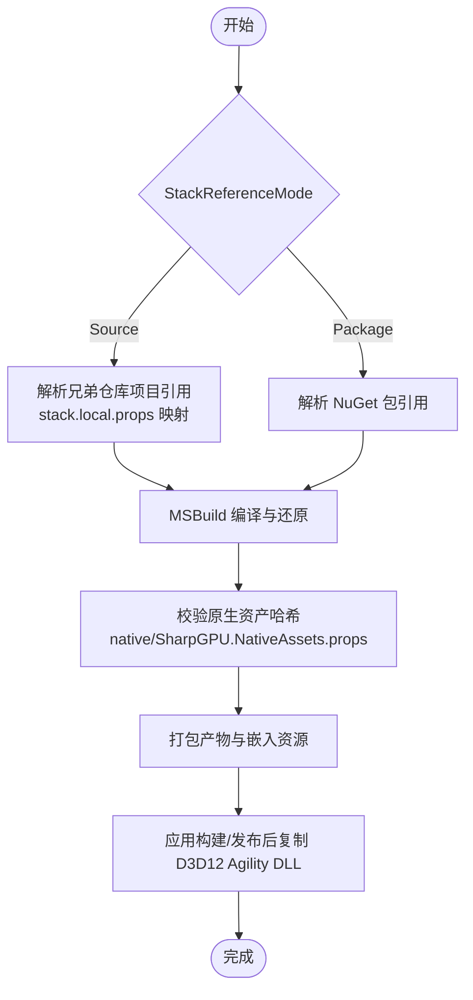
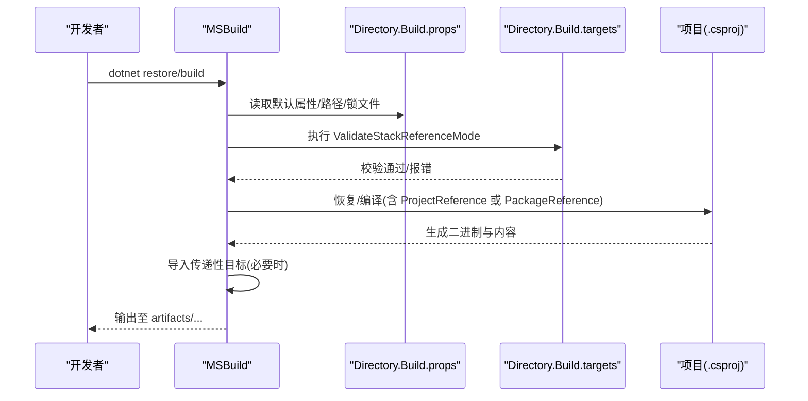
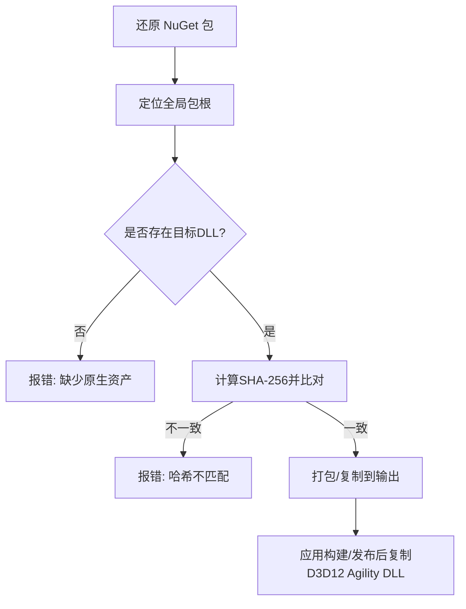
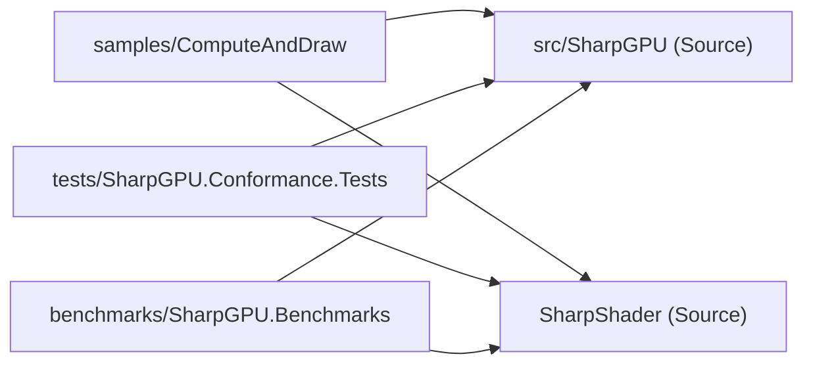
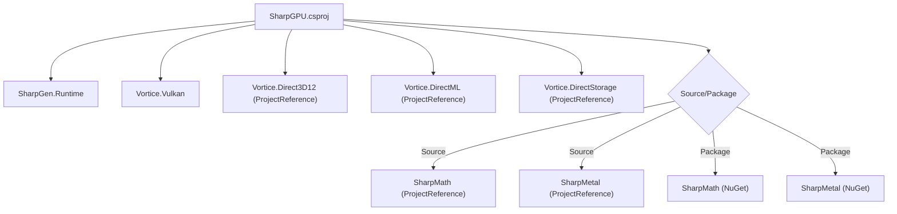

# 开发环境搭建

<cite>
**本文引用的文件**
- [global.json](file://global.json)
- [README.md](file://README.md)
- [Directory.Build.props](file://Directory.Build.props)
- [Directory.Build.targets](file://Directory.Build.targets)
- [SharpGPU.product.props](file://SharpGPU.product.props)
- [src/SharpGPU/SharpGPU.csproj](file://src/SharpGPU/SharpGPU.csproj)
- [stack.local.props.example](file://stack.local.props.example)
- [docs/VERIFICATION.md](file://docs/VERIFICATION.md)
- [native/assets.json](file://native/assets.json)
- [native/SharpGPU.NativeAssets.props](file://native/SharpGPU.NativeAssets.props)
- [buildTransitive/SharpGPU.targets](file://buildTransitive/SharpGPU.targets)
- [eng/ci.json](file://eng/ci.json)
- [samples/ComputeAndDraw/ComputeAndDraw.csproj](file://samples/ComputeAndDraw/ComputeAndDraw.csproj)
- [tests/SharpGPU.Conformance.Tests/SharpGPU.Conformance.Tests.csproj](file://tests/SharpGPU.Conformance.Tests/SharpGPU.Conformance.Tests.csproj)
- [benchmarks/SharpGPU.Benchmarks/SharpGPU.Benchmarks.csproj](file://benchmarks/SharpGPU.Benchmarks/SharpGPU.Benchmarks.csproj)
</cite>

## 目录
1. [简介](#简介)
2. [项目结构](#项目结构)
3. [核心组件](#核心组件)
4. [架构总览](#架构总览)
5. [详细组件分析](#详细组件分析)
6. [依赖分析](#依赖分析)
7. [性能考虑](#性能考虑)
8. [故障排查指南](#故障排查指南)
9. [结论](#结论)
10. [附录](#附录)

## 简介
本指南面向希望在本地搭建 SharpGPU 开发环境的开发者，覆盖 .NET SDK 版本、IDE 配置、本地依赖安装、构建系统工作原理、调试与工具推荐、常见问题解决方案以及本地开发最佳实践与性能优化建议。SharpGPU 是一个面向 DirectX 12、Vulkan 和 Metal 的低层 .NET GPU 抽象层（RHI），运行时目标为 .NET 10，并通过 MSBuild 工程图在 Source 与 Package 两种模式下统一构建与验证。

## 项目结构
仓库采用按职责分层的组织方式：
- src/SharpGPU：产品运行时库与后端实现（Dx12/Vulkan/Metal）
- samples/ComputeAndDraw：可运行的计算与绘制示例
- tests/SharpGPU.Conformance.Tests：一致性测试套件
- benchmarks/SharpGPU.Benchmarks：基准程序
- native/*：原生资源清单与打包属性
- eng/*：CI/验证脚本与清单
- docs/*：设计、特性矩阵与验证说明
- third_party/Vortice.Windows：维护的 Vortice 绑定（DX12/DirectML/DirectStorage 等）

**章节来源**
- [README.md:12-17](file://README.md#L12-L17)

## 核心组件
- 构建与产物布局：通过 Directory.Build.props 集中定义输出路径、锁定 NuGet 包、RID 选择与默认配置；通过 Directory.Build.targets 校验 StackReferenceMode、传播配置并导入传递性目标。
- 产品属性：SharpGPU.product.props 定义产品名称常量，供全局使用。
- 运行时目标：src/SharpGPU/SharpGPU.csproj 声明 net10.0 目标框架、启用不安全代码与可空检查，并引入必要的包与本地项目引用。
- 本地映射：stack.local.props.example 提供 Source 模式下的兄弟仓库路径映射模板。
- 原生资产：native/assets.json 记录各平台原生 DLL 的来源、哈希与部署位置；native/SharpGPU.NativeAssets.props 负责下载、校验与打包这些原生文件。
- 传递性部署：buildTransitive/SharpGPU.targets 在构建或发布后自动将 D3D12 Agility 所需 DLL 复制到应用目录，确保运行期加载路径正确。

**章节来源**
- [Directory.Build.props:1-24](file://Directory.Build.props#L1-L24)
- [Directory.Build.targets:1-41](file://Directory.Build.targets#L1-L41)
- [SharpGPU.product.props:1-2](file://SharpGPU.product.props#L1-L2)
- [src/SharpGPU/SharpGPU.csproj:1-47](file://src/SharpGPU/SharpGPU.csproj#L1-L47)
- [stack.local.props.example:1-12](file://stack.local.props.example#L1-L12)
- [native/assets.json:1-244](file://native/assets.json#L1-L244)
- [native/SharpGPU.NativeAssets.props:1-134](file://native/SharpGPU.NativeAssets.props#L1-L134)
- [buildTransitive/SharpGPU.targets:1-23](file://buildTransitive/SharpGPU.targets#L1-L23)

## 架构总览
下图展示从源码到可执行文件的构建与部署流程，包括 Source/Package 模式切换、原生资产校验与应用侧部署。

**图表来源**
- [Directory.Build.props:1-24](file://Directory.Build.props#L1-L24)
- [Directory.Build.targets:28-39](file://Directory.Build.targets#L28-L39)
- [native/SharpGPU.NativeAssets.props:106-132](file://native/SharpGPU.NativeAssets.props#L106-L132)
- [buildTransitive/SharpGPU.targets:6-21](file://buildTransitive/SharpGPU.targets#L6-L21)

## 详细组件分析

### 构建系统与模式切换
- 模式约束：Directory.Build.targets 强制 StackReferenceMode 必须为 Source 或 Package，并在 Source 模式下禁止混入同名 NuGet 包，避免图冲突。
- 输出与中间目录：Directory.Build.props 将产物与中间文件隔离到 artifacts 下，并按项目、模式、平台与 RID 细分。
- 锁文件策略：启用 RestorePackagesWithLockFile，并通过 packages.Package.*.lock.json 与 packages.Source.*.lock.json 区分模式。
- 传递性目标：当以 Source 模式引用时，会导入 buildTransitive/SharpGPU.targets，用于复制许可证与部署 D3D12 Agility 文件。

**图表来源**
- [Directory.Build.props:1-24](file://Directory.Build.props#L1-L24)
- [Directory.Build.targets:28-39](file://Directory.Build.targets#L28-L39)

**章节来源**
- [Directory.Build.props:1-24](file://Directory.Build.props#L1-L24)
- [Directory.Build.targets:1-41](file://Directory.Build.targets#L1-L41)

### 原生资产与运行时部署
- 资产清单：native/assets.json 记录了 D3D12Agility、DirectML、DirectStorage、PIX 等原生 DLL 的 RID、来源包、SHA-256 与部署路径。
- 下载与校验：native/SharpGPU.NativeAssets.props 根据全局包根定位已还原的包，计算 SHA-256 并与预期值比对，不匹配则构建失败。
- 应用部署：buildTransitive/SharpGPU.targets 在构建或发布后，将 D3D12 Agility 的核心 DLL 复制到应用目录的 D3D12 子文件夹，满足运行时加载约定。

**图表来源**
- [native/assets.json:1-244](file://native/assets.json#L1-L244)
- [native/SharpGPU.NativeAssets.props:106-132](file://native/SharpGPU.NativeAssets.props#L106-L132)
- [buildTransitive/SharpGPU.targets:6-21](file://buildTransitive/SharpGPU.targets#L6-L21)

**章节来源**
- [native/assets.json:1-244](file://native/assets.json#L1-L244)
- [native/SharpGPU.NativeAssets.props:1-134](file://native/SharpGPU.NativeAssets.props#L1-L134)
- [buildTransitive/SharpGPU.targets:1-23](file://buildTransitive/SharpGPU.targets#L1-L23)

### 示例与测试工程
- 示例 ComputeAndDraw：在 Source 模式下直接引用 src/SharpGPU 与 SharpShader 相关项目；在 Package 模式下引用对应 NuGet 包。
- 一致性测试：基于 xUnit 与 Microsoft.NET.Test.Sdk，支持 Windows/Linux 的 Vulkan 资格宏与 macOS 的 Metal 资格宏；同样支持 Source/Package 双模式。
- 基准程序：结构与示例类似，便于在不同后端与设备上评估性能。

**图表来源**
- [samples/ComputeAndDraw/ComputeAndDraw.csproj:1-14](file://samples/ComputeAndDraw/ComputeAndDraw.csproj#L1-L14)
- [tests/SharpGPU.Conformance.Tests/SharpGPU.Conformance.Tests.csproj:1-68](file://tests/SharpGPU.Conformance.Tests/SharpGPU.Conformance.Tests.csproj#L1-L68)
- [benchmarks/SharpGPU.Benchmarks/SharpGPU.Benchmarks.csproj:1-22](file://benchmarks/SharpGPU.Benchmarks/SharpGPU.Benchmarks.csproj#L1-L22)

**章节来源**
- [samples/ComputeAndDraw/ComputeAndDraw.csproj:1-14](file://samples/ComputeAndDraw/ComputeAndDraw.csproj#L1-L14)
- [tests/SharpGPU.Conformance.Tests/SharpGPU.Conformance.Tests.csproj:1-68](file://tests/SharpGPU.Conformance.Tests/SharpGPU.Conformance.Tests.csproj#L1-L68)
- [benchmarks/SharpGPU.Benchmarks/SharpGPU.Benchmarks.csproj:1-22](file://benchmarks/SharpGPU.Benchmarks/SharpGPU.Benchmarks.csproj#L1-L22)

## 依赖分析
- 运行时依赖：SharpGPU 依赖 SharpGen.Runtime、Vortice.Vulkan，并通过项目引用集成 Vortice.Direct3D12、Vortice.DirectML、Vortice.DirectStorage。
- 数学与金属后端：在 Source 模式下引用 SharpMath 与 SharpMetal 的本地项目；在 Package 模式下引用对应 NuGet 包。
- CI 清单：eng/ci.json 列出需构建的项目与测试项目，并固定依赖仓库提交，保证可重复构建。

**图表来源**
- [src/SharpGPU/SharpGPU.csproj:15-29](file://src/SharpGPU/SharpGPU.csproj#L15-L29)
- [eng/ci.json:1-27](file://eng/ci.json#L1-L27)

**章节来源**
- [src/SharpGPU/SharpGPU.csproj:1-47](file://src/SharpGPU/SharpGPU.csproj#L1-L47)
- [eng/ci.json:1-27](file://eng/ci.json#L1-L27)

## 性能考虑
- 构建并行与缓存：使用 -m 开启并行，结合 -nr:false 禁用热重载以获得更稳定的 CI 行为；利用 artifacts 隔离输出提升增量构建效率。
- 原生资产命中：确保全局包根正确且已还原指定版本的包，避免哈希校验失败导致的回退与重试。
- 运行时选择：明确 Platform 与 RuntimeIdentifier（如 x64/win-x64），减少不必要的多 RID 构建开销。
- 测试与基准：优先在 Release 配置下运行基准，关闭共享编译以减少干扰；使用隔离输出目录避免历史数据污染。

[本节为通用指导，无需特定文件来源]

## 故障排查指南
- 无法识别 .NET SDK 版本
  - 现象：提示未找到匹配的 SDK。
  - 处理：安装 global.json 指定的 SDK 版本，或使用支持 rollForward 的环境。
  - 参考：[global.json:1-8](file://global.json#L1-L8)

- StackReferenceMode 错误
  - 现象：构建时报错要求 Source 或 Package。
  - 处理：显式设置 -p:StackReferenceMode=Source 或 Package，并确保与项目引用/包引用一致。
  - 参考：[Directory.Build.targets:28-33](file://Directory.Build.targets#L28-L33)

- Source 模式找不到兄弟仓库
  - 现象：报错提示缺失 checkout 或 product.props。
  - 处理：复制 stack.local.props.example 为 stack.local.props，填写正确的兄弟仓库路径。
  - 参考：[stack.local.props.example:1-12](file://stack.local.props.example#L1-L12)

- 原生资产缺失或哈希不匹配
  - 现象：构建时报 Missing native asset 或 Hash mismatch。
  - 处理：重新还原 NuGet 包，确认全局包根指向正确；不要替换受保护的包版本。
  - 参考：[native/SharpGPU.NativeAssets.props:126-132](file://native/SharpGPU.NativeAssets.props#L126-L132)

- D3D12 Agility DLL 未复制到应用目录
  - 现象：运行时报找不到 D3D12Core.dll。
  - 处理：确保构建/发布后目标触发，或手动将 runtimes/win-*/native 中的 DLL 复制到应用目录的 D3D12 子文件夹。
  - 参考：[buildTransitive/SharpGPU.targets:6-21](file://buildTransitive/SharpGPU.targets#L6-L21)

- 测试/示例无法运行
  - 现象：测试跳过或运行失败。
  - 处理：确认平台限定（Windows x64 当前为唯一合格主机），按需设置环境变量与 RID；参考验证文档中的命令形状。
  - 参考：[docs/VERIFICATION.md:136-144](file://docs/VERIFICATION.md#L136-L144)

**章节来源**
- [global.json:1-8](file://global.json#L1-L8)
- [Directory.Build.targets:28-33](file://Directory.Build.targets#L28-L33)
- [stack.local.props.example:1-12](file://stack.local.props.example#L1-L12)
- [native/SharpGPU.NativeAssets.props:126-132](file://native/SharpGPU.NativeAssets.props#L126-L132)
- [buildTransitive/SharpGPU.targets:6-21](file://buildTransitive/SharpGPU.targets#L6-L21)
- [docs/VERIFICATION.md:136-144](file://docs/VERIFICATION.md#L136-L144)

## 结论
通过统一的 MSBuild 工程图与 Source/Package 双模式，SharpGPU 实现了跨仓库、跨平台的可重复构建与验证。本地开发的关键在于：安装匹配的 .NET SDK、正确配置 stack.local.props、理解原生资产的来源与校验机制，并遵循验证文档的命令形状进行构建与测试。遵循本文的最佳实践可显著提升开发与排障效率。

[本节为总结性内容，无需特定文件来源]

## 附录

### 快速上手步骤
- 安装 .NET SDK：依据 global.json 指定版本。
- 准备本地映射：复制 stack.local.props.example 为 stack.local.props，并调整兄弟仓库路径。
- 构建与测试：参考 docs/VERIFICATION.md 中的命令形状，先 restore 再 build/test。
- 运行示例：从 samples/ComputeAndDraw 开始，确保原生 DLL 已部署。

**章节来源**
- [global.json:1-8](file://global.json#L1-L8)
- [stack.local.props.example:1-12](file://stack.local.props.example#L1-L12)
- [docs/VERIFICATION.md:15-40](file://docs/VERIFICATION.md#L15-L40)

### 推荐的 IDE 与工具
- Visual Studio / VS Code：启用 .NET 10 SDK 支持，配置 C# 扩展与分析器。
- 命令行：dotnet CLI，配合 -c Release/-p:Platform=x64 等参数进行稳定复现。
- 调试：在 Debug 配置下运行测试与示例，结合日志与 TRX 结果定位问题。

[本节为通用指导，无需特定文件来源]

### 本地工作流最佳实践
- 始终使用隔离的 artifacts 输出目录，避免污染全局缓存。
- 在 Source 与 Package 模式间切换时，分别维护独立的 lock 文件。
- 修改原生资产或依赖版本前，先更新 assets.json 与属性文件，并运行完整验证。
- 提交前运行最小化验证集，确保关键路径可用。

**章节来源**
- [Directory.Build.props:17-22](file://Directory.Build.props#L17-L22)
- [docs/VERIFICATION.md:371-373](file://docs/VERIFICATION.md#L371-L373)