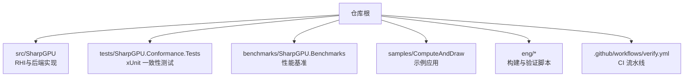
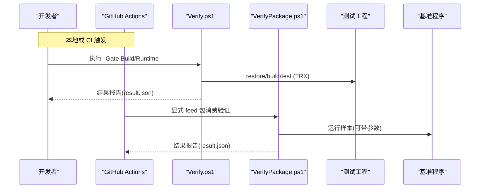
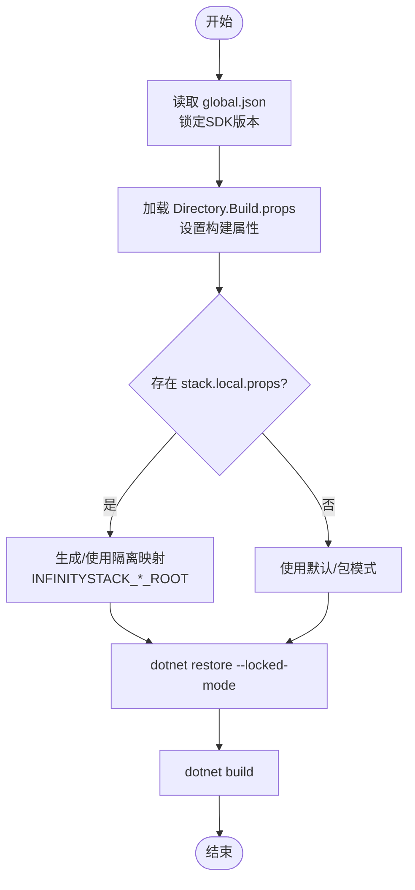
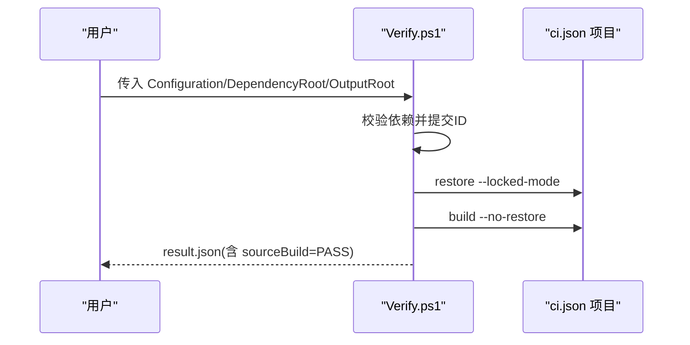
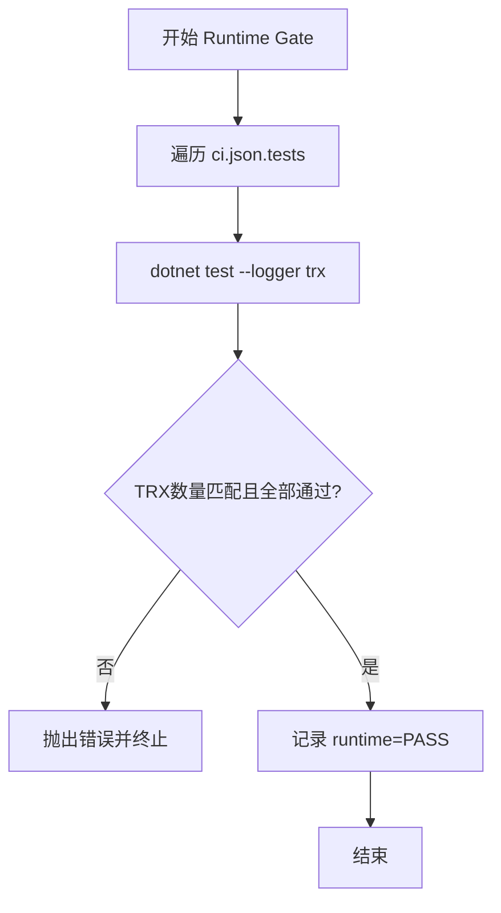
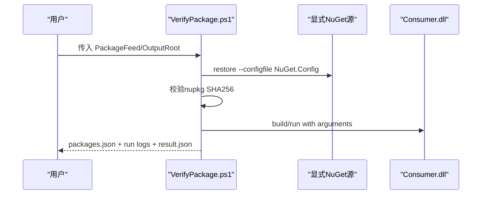
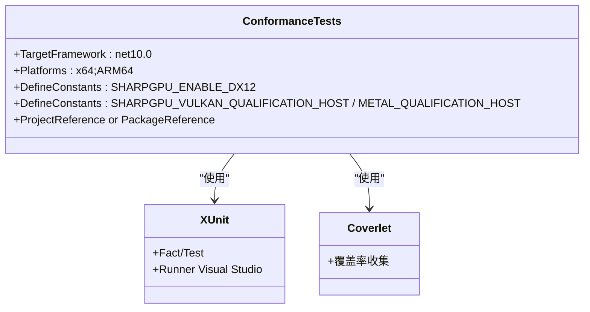
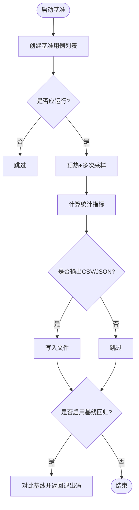
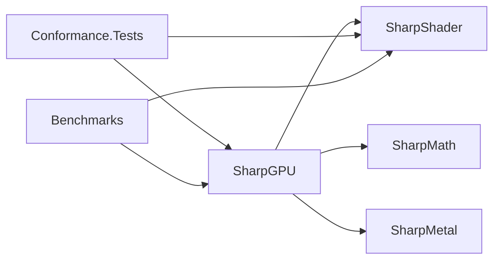

# 构建与测试

<cite>
**本文引用的文件**
- [README.md](file://README.md)
- [global.json](file://global.json)
- [Directory.Build.props](file://Directory.Build.props)
- [eng/ci.json](file://eng/ci.json)
- [.github/workflows/verify.yml](file://.github/workflows/verify.yml)
- [eng/Verify.ps1](file://eng/Verify.ps1)
- [eng/VerifyPackage.ps1](file://eng/VerifyPackage.ps1)
- [tests/SharpGPU.Conformance.Tests/SharpGPU.Conformance.Tests.csproj](file://tests/SharpGPU.Conformance.Tests/SharpGPU.Conformance.Tests.csproj)
- [benchmarks/SharpGPU.Benchmarks/SharpGPU.Benchmarks.csproj](file://benchmarks/SharpGPU.Benchmarks/SharpGPU.Benchmarks.csproj)
- [benchmarks/SharpGPU.Benchmarks/Program.cs](file://benchmarks/SharpGPU.Benchmarks/Program.cs)
- [samples/ComputeAndDraw/Program.cs](file://samples/ComputeAndDraw/Program.cs)
- [stack.local.props.example](file://stack.local.props.example)
- [docs/VERIFICATION.md](file://docs/VERIFICATION.md)
</cite>

## 目录
1. [简介](#简介)
2. [项目结构](#项目结构)
3. [核心组件](#核心组件)
4. [架构总览](#架构总览)
5. [详细组件分析](#详细组件分析)
6. [依赖关系分析](#依赖关系分析)
7. [性能考虑](#性能考虑)
8. [故障排除指南](#故障排除指南)
9. [结论](#结论)
10. [附录](#附录)

## 简介
本指南面向 SharpGPU 的构建、测试与持续集成，覆盖本地与 CI 环境下的命令、流程与质量门禁。内容基于仓库中的构建脚本、测试工程、基准程序与工作流配置整理而成，帮助你在 Windows x64 上完成源码图构建、运行测试、执行包消费验证与性能基准，并理解各阶段的质量要求与失败定位方法。

## 项目结构
- 源码位于 src/SharpGPU，提供 RHI 抽象与各后端实现（DX12/Vulkan/Metal）。
- 测试位于 tests/SharpGPU.Conformance.Tests，使用 xUnit，支持 Source 与 Package 两种模式。
- 基准位于 benchmarks/SharpGPU.Benchmarks，用于 API/后端/工作负载级性能测量与回归检查。
- 示例位于 samples/ComputeAndDraw，演示计算与光栅化路径。
- 构建与验证脚本位于 eng/，包括源码图构建、运行时门控与包消费验证。
- CI 流水线位于 .github/workflows/verify.yml，在 Windows 上执行源码构建与可选的设备运行时门控。

**章节来源**
- [README.md:1-23](file://README.md#L1-L23)
- [docs/VERIFICATION.md:1-404](file://docs/VERIFICATION.md#L1-L404)

## 核心组件
- 构建与恢复：通过全局 SDK 锁定与 MSBuild 属性统一输出路径、RID、参考模式（Source/Package）与锁文件策略。
- 源码图构建：eng/Verify.ps1 读取 eng/ci.json，校验依赖提交，生成隔离映射，按顺序 restore/build 所有项目。
- 运行时门控：在 Runtime 模式下执行测试，要求每个测试工程产生 TRX 且全部通过、无跳过。
- 包消费验证：eng/VerifyPackage.ps1 从显式 NuGet feed 恢复并构建最小消费者，校验 nupkg 哈希并运行样本。
- 测试工程：tests/SharpGPU.Conformance.Tests 使用 xUnit + coverlet，支持 Source 与 Package 模式切换。
- 基准程序：benchmarks/SharpGPU.Benchmarks 提供多类场景（API/后端/工作负载/提交），支持 CSV/JSON 输出与基线回归。

**章节来源**
- [Directory.Build.props:1-25](file://Directory.Build.props#L1-L25)
- [eng/ci.json:1-27](file://eng/ci.json#L1-L27)
- [eng/Verify.ps1:1-91](file://eng/Verify.ps1#L1-L91)
- [eng/VerifyPackage.ps1:1-76](file://eng/VerifyPackage.ps1#L1-L76)
- [tests/SharpGPU.Conformance.Tests/SharpGPU.Conformance.Tests.csproj:1-68](file://tests/SharpGPU.Conformance.Tests/SharpGPU.Conformance.Tests.csproj#L1-L68)
- [benchmarks/SharpGPU.Benchmarks/SharpGPU.Benchmarks.csproj:1-22](file://benchmarks/SharpGPU.Benchmarks/SharpGPU.Benchmarks.csproj#L1-L22)

## 架构总览
下图展示了本地与 CI 的构建与测试流程，以及源码图与包消费两条路径。

**图表来源**
- [.github/workflows/verify.yml:1-119](file://.github/workflows/verify.yml#L1-L119)
- [eng/Verify.ps1:1-91](file://eng/Verify.ps1#L1-L91)
- [eng/VerifyPackage.ps1:1-76](file://eng/VerifyPackage.ps1#L1-L76)

**章节来源**
- [.github/workflows/verify.yml:1-119](file://.github/workflows/verify.yml#L1-L119)
- [docs/VERIFICATION.md:271-350](file://docs/VERIFICATION.md#L271-L350)

## 详细组件分析

### 构建系统与环境
- SDK 锁定：global.json 指定 .NET 10 SDK 版本与回滚策略。
- 全局构建属性：Directory.Build.props 定义 StackReferenceMode、StackProductRoot、RID、输出路径、锁文件路径等，确保可重复构建。
- 本地依赖映射：stack.local.props.example 提供相邻仓库路径模板；CI 中由 Verify.ps1 动态生成隔离映射。

**图表来源**
- [global.json:1-8](file://global.json#L1-L8)
- [Directory.Build.props:1-25](file://Directory.Build.props#L1-L25)
- [stack.local.props.example:1-12](file://stack.local.props.example#L1-L12)
- [eng/Verify.ps1:26-55](file://eng/Verify.ps1#L26-L55)

**章节来源**
- [global.json:1-8](file://global.json#L1-L8)
- [Directory.Build.props:1-25](file://Directory.Build.props#L1-L25)
- [stack.local.props.example:1-12](file://stack.local.props.example#L1-L12)

### 源码图构建与测试（Build Gate）
- 入口：./eng/Verify.ps1 -Configuration <Debug|Release> -Gate Build -DependencyRoot <deps> -OutputRoot <out>
- 行为：校验依赖 HEAD，写入隔离 props，对 ci.json 列出的项目依次 restore/build。
- 产物：verification.log、result.json、输出目录 artifacts 隔离。

**图表来源**
- [eng/Verify.ps1:1-91](file://eng/Verify.ps1#L1-L91)
- [eng/ci.json:1-27](file://eng/ci.json#L1-L27)

**章节来源**
- [eng/Verify.ps1:1-91](file://eng/Verify.ps1#L1-L91)
- [eng/ci.json:1-27](file://eng/ci.json#L1-L27)
- [docs/VERIFICATION.md:271-300](file://docs/VERIFICATION.md#L271-L300)

### 运行时门控（Runtime Gate）
- 入口：./eng/Verify.ps1 -Gate Runtime ...
- 行为：在 Build 基础上，对 ci.json 列出的测试工程执行 test，输出 TRX 到 results/<project>/。
- 门禁：每个测试工程必须产生一个 TRX，且 total > 0、passed == total（不允许跳过）。

**图表来源**
- [eng/Verify.ps1:56-79](file://eng/Verify.ps1#L56-L79)

**章节来源**
- [eng/Verify.ps1:56-79](file://eng/Verify.ps1#L56-L79)
- [docs/VERIFICATION.md:271-300](file://docs/VERIFICATION.md#L271-L300)

### 包消费验证（Package Gate）
- 入口：./eng/VerifyPackage.ps1 -Configuration <Debug|Release> -PackageFeed <feed> -OutputRoot <out>
- 行为：复制真实 sample 代码为独立消费者，清理继承配置，使用显式 feed 与隔离缓存，恢复并锁定，校验每个 nupkg 的 SHA-256，构建并运行样本，检查必需输出。
- 产物：packages.json（包哈希）、run-*.log、result.json。

**图表来源**
- [eng/VerifyPackage.ps1:1-76](file://eng/VerifyPackage.ps1#L1-L76)

**章节来源**
- [eng/VerifyPackage.ps1:1-76](file://eng/VerifyPackage.ps1#L1-L76)
- [docs/VERIFICATION.md:318-350](file://docs/VERIFICATION.md#L318-L350)

### 单元测试与兼容性测试
- 框架：xUnit + xunit.runner.visualstudio + coverlet.collector。
- 模式：
  - Source：通过 ProjectReference 引用 SharpGPU 及 SharpShader 子项目。
  - Package：通过 PackageReference 引用对应版本包。
- 平台常量：根据操作系统启用 Vulkan/Metal 资格主机常量，以控制测试分支。
- 典型用例：公共契约、内存机制、屏障模型、队列提交、格式支持、管线统计、采样器反馈、稀疏能力、存储IO、变量率着色、DirectML/Metal/Vulkan/DX12 相关合格性测试等。

**图表来源**
- [tests/SharpGPU.Conformance.Tests/SharpGPU.Conformance.Tests.csproj:1-68](file://tests/SharpGPU.Conformance.Tests/SharpGPU.Conformance.Tests.csproj#L1-L68)

**章节来源**
- [tests/SharpGPU.Conformance.Tests/SharpGPU.Conformance.Tests.csproj:1-68](file://tests/SharpGPU.Conformance.Tests/SharpGPU.Conformance.Tests.csproj#L1-L68)

### 性能基准测试
- 入口：benchmarks/SharpGPU.Benchmarks/Program.cs
- 能力：
  - 多类场景：API、后端（DX12）、工作负载（bindless/upload/workgraph）、提交（fence）。
  - 指标：平均、中位数、P95、P99、尾延迟、托管分配字节数。
  - 输出：控制台、CSV、JSON；支持基线回归检查。
  - 跳过逻辑：当设备/功能不可用时返回 skipped。
- 建议：使用固定迭代次数与预热次数，避免 GC 干扰；必要时开启 RequireZeroAllocation 检测稳态分配。

**图表来源**
- [benchmarks/SharpGPU.Benchmarks/Program.cs:25-129](file://benchmarks/SharpGPU.Benchmarks/Program.cs#L25-L129)

**章节来源**
- [benchmarks/SharpGPU.Benchmarks/Program.cs:25-129](file://benchmarks/SharpGPU.Benchmarks/Program.cs#L25-L129)
- [benchmarks/SharpGPU.Benchmarks/SharpGPU.Benchmarks.csproj:1-22](file://benchmarks/SharpGPU.Benchmarks/SharpGPU.Benchmarks.csproj#L1-L22)

### 示例应用
- 入口：samples/ComputeAndDraw/Program.cs
- 行为：先运行计算负载，再枚举支持的 DX12/Vulkan 后端并运行光栅化负载，最后释放资源。

**章节来源**
- [samples/ComputeAndDraw/Program.cs:1-18](file://samples/ComputeAndDraw/Program.cs#L1-L18)

## 依赖关系分析
- 外部依赖：SharpMath、SharpMetal、SharpShader 的提交在 eng/ci.json 中固定，CI 会拉取并校验 HEAD。
- 内部依赖：测试与基准通过 Source 或 Package 模式引用 SharpGPU 与 SharpShader 子项目/包。
- 平台限制：当前仅 Windows x64 具备完整原生宿主资格；其他平台需匹配主机。

**图表来源**
- [eng/ci.json:1-27](file://eng/ci.json#L1-L27)
- [tests/SharpGPU.Conformance.Tests/SharpGPU.Conformance.Tests.csproj:19-66](file://tests/SharpGPU.Conformance.Tests/SharpGPU.Conformance.Tests.csproj#L19-L66)
- [benchmarks/SharpGPU.Benchmarks/SharpGPU.Benchmarks.csproj:9-20](file://benchmarks/SharpGPU.Benchmarks/SharpGPU.Benchmarks.csproj#L9-L20)

**章节来源**
- [eng/ci.json:1-27](file://eng/ci.json#L1-L27)
- [docs/VERIFICATION.md:136-145](file://docs/VERIFICATION.md#L136-L145)

## 性能考虑
- 基准设计：预热、多次采样、排序分位统计、GC 干预控制、零分配断言。
- 回归检查：可通过基线路径与 FailOnRegression 开关进行快速回归判定。
- 设备差异：不同 GPU/驱动可能影响时间分布，建议在目标硬件上复现。

[本节为通用指导，不直接分析具体文件]

## 故障排除指南
- 构建失败
  - 确认 SDK 版本与 global.json 一致。
  - 检查 StackReferenceMode 与 StackLocalProps 是否正确指向依赖根。
  - 使用 --locked-mode 与隔离输出目录，避免缓存污染。
- 测试失败
  - Runtime Gate 要求所有测试通过且无跳过；查看 TRX 与 verification.log 定位失败用例。
  - 平台相关测试可能因缺少原生库或设备能力而跳过；确认目标平台与驱动。
- 包消费失败
  - 显式 feed 必须包含所有依赖；校验 packages.json 中的 SHA-256 是否与 feed 一致。
  - 使用隔离缓存与 NuGet.Config，避免全局缓存干扰。
- 基准异常
  - 若 RequireZeroAllocation 失败，检查热点路径是否存在托管分配。
  - 设备不支持的功能会被跳过，检查适配器能力与跳过原因。

**章节来源**
- [eng/Verify.ps1:10-22](file://eng/Verify.ps1#L10-L22)
- [eng/Verify.ps1:56-79](file://eng/Verify.ps1#L56-L79)
- [eng/VerifyPackage.ps1:12-21](file://eng/VerifyPackage.ps1#L12-L21)
- [eng/VerifyPackage.ps1:40-67](file://eng/VerifyPackage.ps1#L40-L67)
- [benchmarks/SharpGPU.Benchmarks/Program.cs:84-129](file://benchmarks/SharpGPU.Benchmarks/Program.cs#L84-L129)

## 结论
SharpGPU 的构建与测试体系围绕“源码图构建—运行时门控—包消费验证”三阶段展开，配合 xUnit 一致性测试与自定义基准程序，形成完整的开发与发布质量闭环。遵循文档中的命令与门禁要求，可在本地与 CI 环境中稳定地验证功能正确性与性能稳定性。

## 附录

### 常用命令速查
- 源码图构建（Build Gate）
  - ./eng/Verify.ps1 -Configuration Debug -Gate Build -DependencyRoot <deps> -OutputRoot <out>
- 源码图运行时（Runtime Gate）
  - ./eng/Verify.ps1 -Configuration Release -Gate Runtime -DependencyRoot <deps> -OutputRoot <out>
- 包消费验证（Package Gate）
  - ./eng/VerifyPackage.ps1 -Configuration Release -PackageFeed <feed> -OutputRoot <out>
- 手动测试（Source 模式）
  - dotnet restore/tests/SharpGPU.Conformance.Tests/SharpGPU.Conformance.Tests.csproj @props
  - dotnet build/tests/SharpGPU.Conformance.Tests/SharpGPU.Conformance.Tests.csproj @props
  - dotnet test/tests/SharpGPU.Conformance.Tests/SharpGPU.Conformance.Tests.csproj @props --no-build --no-restore --logger "trx;LogFileName=source-release.trx" --results-directory "<out>/test-results/source-release"
- 示例运行
  - 编译并运行 samples/ComputeAndDraw，验证计算与光栅化路径。

**章节来源**
- [docs/VERIFICATION.md:15-40](file://docs/VERIFICATION.md#L15-L40)
- [docs/VERIFICATION.md:271-300](file://docs/VERIFICATION.md#L271-L300)
- [docs/VERIFICATION.md:318-350](file://docs/VERIFICATION.md#L318-L350)
- [samples/ComputeAndDraw/Program.cs:1-18](file://samples/ComputeAndDraw/Program.cs#L1-L18)

### 本地环境配置要点
- 安装 global.json 指定的 .NET 10 SDK。
- 复制 stack.local.props.example 为 stack.local.props，并调整依赖路径。
- 使用 Source 或 Package 模式之一，不要混用。
- 包消费时使用显式 feed 与隔离缓存，避免全局缓存污染。

**章节来源**
- [README.md:5-10](file://README.md#L5-L10)
- [stack.local.props.example:1-12](file://stack.local.props.example#L1-L12)
- [docs/VERIFICATION.md:1-14](file://docs/VERIFICATION.md#L1-L14)

### CI/CD 流水线说明
- 触发：push/pull_request/workflow_dispatch。
- 矩阵：Debug/Release 双配置。
- 构建：在 hosted Windows 上执行源码图构建。
- 运行时：仅在 workflow_dispatch 且勾选 runtime 时，在可信自托管 Windows x64 设备上执行运行时门控与包消费验证。
- 产物：verification.log、TRX、result.json、packages.json 等保留于 runner temp。

**章节来源**
- [.github/workflows/verify.yml:1-119](file://.github/workflows/verify.yml#L1-L119)
- [docs/VERIFICATION.md:271-350](file://docs/VERIFICATION.md#L271-L350)