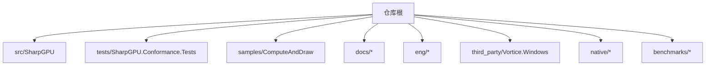
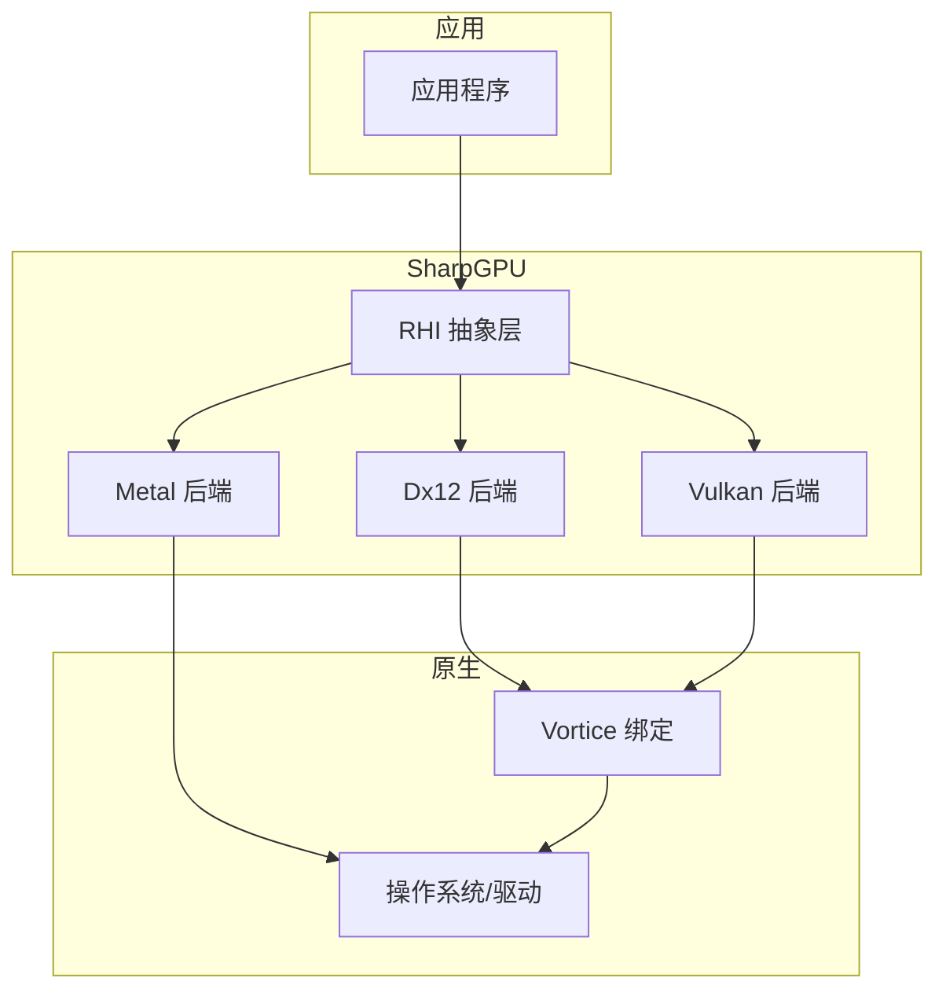
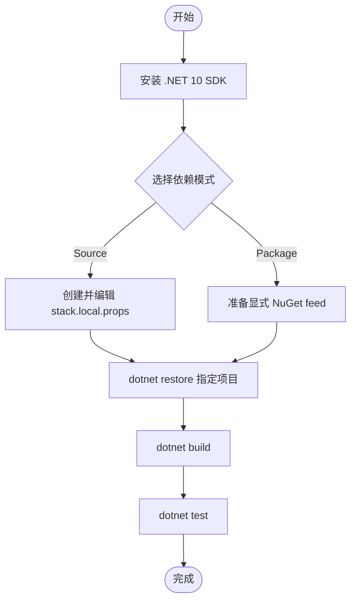
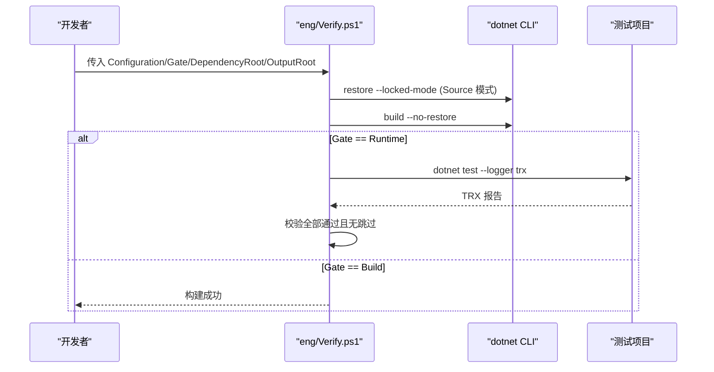
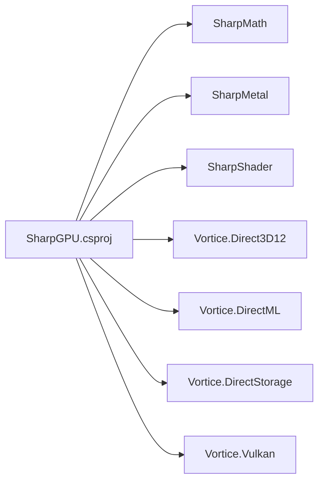

# 贡献指南

<cite>
**本文引用的文件**
- [README.md](file://README.md)
- [AGENTS.md](file://AGENTS.md)
- [global.json](file://global.json)
- [Directory.Build.props](file://Directory.Build.props)
- [SharpGPU.product.props](file://SharpGPU.product.props)
- [stack.local.props.example](file://stack.local.props.example)
- [docs/VERIFICATION.md](file://docs/VERIFICATION.md)
- [docs/SharpGPU/QuickStart.md](file://docs/SharpGPU/QuickStart.md)
- [.github/workflows/verify.yml](file://.github/workflows/verify.yml)
- [eng/ci.json](file://eng/ci.json)
- [eng/Verify.ps1](file://eng/Verify.ps1)
- [eng/VerifyPackage.ps1](file://eng/VerifyPackage.ps1)
- [src/SharpGPU/SharpGPU.csproj](file://src/SharpGPU/SharpGPU.csproj)
- [tests/SharpGPU.Conformance.Tests/SharpGPU.Conformance.Tests.csproj](file://tests/SharpGPU.Conformance.Tests/SharpGPU.Conformance.Tests.csproj)
- [native/assets.json](file://native/assets.json)
- [native/SharpGPU.NativeAssets.props](file://native/SharpGPU.NativeAssets.props)
</cite>

## 更新摘要
**所做更改**
- 更新了产品边界和工程规范部分，反映DESIGN.md移除和其内容整合到AGENTS.md
- 增强了Source/Package模式的详细说明
- 更新了绑定表契约和原生资产部署信息
- 改进了构建流程和验证流程的说明
- 更新了代码审查和质量保证流程

## 目录
1. [简介](#简介)
2. [项目结构](#项目结构)
3. [核心组件](#核心组件)
4. [架构总览](#架构总览)
5. [详细组件分析](#详细组件分析)
6. [依赖关系分析](#依赖关系分析)
7. [性能与构建注意事项](#性能与构建注意事项)
8. [故障排查指南](#故障排查指南)
9. [结论](#结论)
10. [附录：命令速查](#附录命令速查)

## 简介
本贡献指南面向希望参与 SharpGPU 项目的开发者，涵盖开发环境搭建、代码规范、构建与测试流程、代码审查要求、发布流程、CI/CD 配置说明以及质量保证措施。SharpGPU 是一个面向 DirectX 12、Vulkan 和 Metal 的低层 .NET GPU 抽象层（RHI），包含后端实现、维护的 Vortice 绑定与 MLCook 工具链。运行时能力探测决定设备支持特性；Windows x64 为当前已验证平台，其他平台需按平台边界单独验证。

**更新** 产品边界和工程规范现已整合到 AGENTS.md 中，提供了更详细的产品边界定义、Source/Package 模式说明、绑定表契约规范和原生资产部署要求。

## 项目结构
- src/：产品运行时源码，按 RHI 抽象与后端（Dx12/Vulkan/Metal）组织。
- tests/：独立一致性测试套件，覆盖跨平台契约、后端行为与原生集成。
- samples/：可运行示例，用于快速体验与回归验证。
- docs/：设计、验证与使用说明，含权威构建/测试/打包命令。
- eng/：验证脚本与 CI 清单，封装 Source/Package 模式下的构建与运行门禁。
- third_party/Vortice.Windows：维护的 Vortice 绑定与补丁，确保 ABI 稳定与路径处理正确。
- native/：原生资源清单与许可证信息，随包分发。
- benchmarks/：基准程序，用于性能观察与回归对比。

**章节来源**
- [README.md:115-122](file://README.md#L115-L122)
- [AGENTS.md:9-23](file://AGENTS.md#L9-L23)

## 核心组件
- RHI 抽象层：定义统一的设备、队列、缓冲、纹理、管线、查询等接口，屏蔽后端差异。
- 后端实现：Dx12、Vulkan、Metal 三个后端分别实现上述抽象，提供具体 GPU 调用。
- 原生绑定与补丁：维护 Vortice 绑定，修复长路径、UTF-8 路径、调度表生命周期等问题。
- 工具与样本：MLCook 工具与 ComputeAndDraw 示例，用于功能演示与回归验证。
- 构建与验证：通过 Directory.Build.props 统一输出布局、锁定 NuGet 包、隔离 artifacts；eng 脚本封装 Source/Package 模式门禁。

**更新** 产品边界现在明确定义了 Source 和 Package 模式的区别，以及绑定表契约的具体实现要求。

**章节来源**
- [src/SharpGPU/SharpGPU.csproj:1-46](file://src/SharpGPU/SharpGPU.csproj#L1-L46)
- [Directory.Build.props:1-24](file://Directory.Build.props#L1-L24)
- [docs/VERIFICATION.md:15-40](file://docs/VERIFICATION.md#L15-L40)

## 架构总览
SharpGPU 采用"抽象 + 多后端"的架构：上层应用通过 RHI 抽象访问 GPU，底层由 Dx12/Vulkan/Metal 后端实现。构建系统支持 Source 与 Package 两种依赖模式，并通过 eng 脚本在 CI 中执行 Build 与 Runtime 门禁。

**图示来源**
- [src/SharpGPU/SharpGPU.csproj:15-29](file://src/SharpGPU/SharpGPU.csproj#L15-L29)
- [README.md:17-30](file://README.md#L17-L30)

## 详细组件分析

### 开发与构建环境搭建
- SDK 版本：使用 global.json 指定的 .NET 10 SDK。
- 本地源模式：复制 stack.local.props.example 到 stack.local.props，并调整依赖路径；仅在 Source 模式下需要。
- 包模式：使用显式 NuGet feed 进行恢复与构建，避免全局缓存污染。
- 输出隔离：所有构建产物位于 artifacts/ 下，按项目、平台、RID、配置隔离。

**更新** Source 和 Package 模式现在是图级生效的选择，本地检出路径仅放在忽略的 stack.local.props 中。包版本由项目配置和特定于模式的 NuGet 锁定文件管理。

**章节来源**
- [global.json:1-8](file://global.json#L1-L8)
- [stack.local.props.example:1-11](file://stack.local.props.example#L1-L11)
- [Directory.Build.props:1-24](file://Directory.Build.props#L1-L24)
- [docs/VERIFICATION.md:15-40](file://docs/VERIFICATION.md#L15-L40)

### 产品边界与工程规范
**更新** 产品边界和工程规范现已整合到 AGENTS.md 中，提供更详细的指导：

- **产品范围**：SharpGPU 独立于 Infinity Engine 构建。产品源码位于 `src/`，测试位于 `tests/`，工具位于 `tools/`，示例位于 `samples/`。
- **Source 和 Package 模式**：这两种模式是图级且明确的。本地检出路径仅放在忽略的 `stack.local.props` 中。包版本由项目配置和特定于模式的 NuGet 锁定文件管理。
- **绑定表契约**：公共绑定表面是 `RHIBindingTable`，具有 `Count` 和 `SetBindElement(..., arrayIndex)` 用于有限 bindless。RHI 不增长 Heap、Pool 或 View 容器。
- **原生资产部署**：应用通知部署使用 `ThirdPartyNotices/<product>/`，适用于 Source 和 Package 消费者。

**章节来源**
- [AGENTS.md:9-23](file://AGENTS.md#L9-L23)
- [AGENTS.md:25-31](file://AGENTS.md#L25-L31)

### 代码规范与工程洁净度
- 命名与格式：手写 C# 使用块级命名空间、Allman 大括号、四空格缩进、m_PascalCase 字段与 s_PascalCase 静态字段；生成/原生绑定保留其约定。
- 单一实现路径：禁止引入遗留别名、转发程序集、兼容垫片或静默依赖回退。
- 依赖模式：Source/Package 选择图级生效；本地路径仅放在忽略的 stack.local.props。
- 证据与不可用平台：使用当前构建/测试/运行证据；无法匹配平台的执行标记 TODO(UNVERIFIED) 或 BLOCKED_PLATFORM。
- 许可证与归属：MPL-2.0；保留 LICENSE、来源声明与第三方许可；必要时更新 README/设计/验证文档。
- 工程洁净度原则：职责唯一、产物有生命周期、保留重建能力、文档保存结论与依据、忽略规则即接口、删除以核实范围为单位、历史与发布内容完整、验证与改动相称。

**章节来源**
- [AGENTS.md:25-31](file://AGENTS.md#L25-L31)
- [AGENTS.md:33-44](file://AGENTS.md#L33-L44)

### 构建与测试流程
- Source 模式：设置 StackReferenceMode=Source，使用本地依赖根与隔离输出目录，执行 restore/build/test。
- Package 模式：设置 StackReferenceMode=Package，使用显式 feed 与隔离缓存，执行 restore/build/test。
- 门禁脚本：eng/Verify.ps1 负责 Source 模式构建与运行门禁；eng/VerifyPackage.ps1 负责 Package 模式消费门禁。
- 测试框架：xUnit + Microsoft.NET.Test.Sdk，TRX 日志输出至隔离结果目录。

**更新** 构建流程现在强调 Source 和 Package 模式的独立性，以及锁定还原的重要性。

**图示来源**
- [eng/Verify.ps1:1-91](file://eng/Verify.ps1#L1-L91)
- [tests/SharpGPU.Conformance.Tests/SharpGPU.Conformance.Tests.csproj:1-68](file://tests/SharpGPU.Conformance.Tests/SharpGPU.Conformance.Tests.csproj#L1-L68)

**章节来源**
- [docs/VERIFICATION.md:15-40](file://docs/VERIFICATION.md#L15-L40)
- [eng/Verify.ps1:1-91](file://eng/Verify.ps1#L1-L91)
- [eng/VerifyPackage.ps1:1-76](file://eng/VerifyPackage.ps1#L1-L76)

### 新功能开发指南
- 明确边界：新增功能应遵循 RHI 抽象与后端边界，不破坏现有契约。
- 最小变更：优先在单一实现路径上修改，避免引入兼容层或别名。
- 证据先行：为行为变化提供构建/测试/运行证据；对不可用平台标注未验证或平台受限。
- 文档同步：若影响公共契约或部署布局，更新 README/设计/验证文档。

**更新** 新功能开发现在需要特别关注 Source/Package 模式的兼容性，以及绑定表契约的保持。

**章节来源**
- [AGENTS.md:9-23](file://AGENTS.md#L9-L23)
- [AGENTS.md:25-31](file://AGENTS.md#L25-L31)

### Bug 修复流程
- 复现与定位：使用隔离输出与锁定的依赖图复现问题；记录失败日志与 TRX。
- 修复策略：保持单一实现路径；修复后重新运行 Source/Package 门禁。
- 回归验证：确保相关测试全部通过，无跳过；必要时补充测试用例。
- 发布前检查：核对 native/assets.json 哈希、依赖图与许可证部署。

**更新** Bug 修复现在需要验证 Source 和 Package 两种模式下的行为一致性。

**章节来源**
- [docs/VERIFICATION.md:146-160](file://docs/VERIFICATION.md#L146-L160)
- [eng/Verify.ps1:56-83](file://eng/Verify.ps1#L56-L83)

### 文档更新要求
- 权威文档：README、AGENTS、VERIFICATION 为权威来源；契约变化需同步更新。
- 快速入门：QuickStart 展示最小可用用法，便于新贡献者上手。
- 许可证与通知：确保 ThirdPartyNotices 在构建与发布输出中一致。

**更新** 由于 DESIGN.md 已移除，相关文档更新现在参考 AGENTS.md 中的产品边界和工程规范。

**章节来源**
- [docs/SharpGPU/QuickStart.md:1-31](file://docs/SharpGPU/QuickStart.md#L1-L31)
- [AGENTS.md:9-23](file://AGENTS.md#L9-L23)

### 代码审查流程
- 前置检查：git diff --check；检查包内容与 native/assets.json 哈希；确认五款 SharpGPU.Vortice.* Windows 包与固定版本的 Vortice.Vulkan 存在且未被替换。
- 依赖对齐：Source 与 Package 模式分别验证；任何运行时或包修订会失效对应证据，需重新运行。
- 平台边界：不同平台需各自验证，不得弱化门限以宣称可移植性。

**更新** 代码审查现在需要特别关注 Source/Package 模式的兼容性验证。

**章节来源**
- [docs/VERIFICATION.md:146-160](file://docs/VERIFICATION.md#L146-L160)
- [docs/VERIFICATION.md:136-144](file://docs/VERIFICATION.md#L136-L144)

### 发布程序
- 打包：从同一源码版本打包库与五个自定义 Windows Vortice 包；嵌入 FeatureMatrix 与 native/assets.json。
- 原生资产：runtimes/<rid>/native 下包含 RID 限定原生文件；Agility DLL 位于应用部署目录。
- 消费验证：使用隔离包根与 Release/x64 资产文件；避免 AnyCPU 或全局缓存导致误判。
- 许可证部署：ThirdPartyNotices/<product>/... 在构建与发布输出中保持一致。

**更新** 发布程序现在强调 native/assets.json 的完整性验证和 Source/Package 两种模式的兼容性。

**章节来源**
- [docs/VERIFICATION.md:66-99](file://docs/VERIFICATION.md#L66-L99)
- [src/SharpGPU/SharpGPU.csproj:30-46](file://src/SharpGPU/SharpGPU.csproj#L30-L46)
- [native/assets.json:1-244](file://native/assets.json#L1-L244)

## 依赖关系分析
- 依赖模式：Source 与 Package 模式图级生效；NuGet 锁定文件按模式与 RID 隔离。
- 外部依赖：SharpMath、SharpMetal、SharpShader 在 CI 中按 commit 固定；Vortice.Windows 绑定维护于 third_party。
- 构建属性：Directory.Build.props 统一输出路径、锁定还原、默认配置与平台。

**更新** 依赖关系现在明确区分 Source 和 Package 模式，每种模式都有独立的锁定文件。

**图示来源**
- [src/SharpGPU/SharpGPU.csproj:15-29](file://src/SharpGPU/SharpGPU.csproj#L15-L29)
- [eng/ci.json:1-27](file://eng/ci.json#L1-L27)

**章节来源**
- [Directory.Build.props:1-24](file://Directory.Build.props#L1-L24)
- [eng/ci.json:1-27](file://eng/ci.json#L1-L27)

## 性能与构建注意事项
- 隔离输出：每次构建使用独立 OutputRoot，避免缓存污染。
- 锁定还原：使用 --locked-mode 与模式特定的 lock 文件，保证可重现。
- 并行与调试：构建时可使用 -m:1 -nr:false 控制并发与增量；Debug/Release 分别验证。
- 基准与观察：基准程序用于行为观察而非严格性能比较；需结合真实设备与受控窗口协议。

**更新** 构建注意事项现在强调 Source 和 Package 模式的独立验证，以及锁定还原的重要性。

**章节来源**
- [docs/VERIFICATION.md:15-40](file://docs/VERIFICATION.md#L15-L40)
- [eng/Verify.ps1:47-55](file://eng/Verify.ps1#L47-L55)

## 故障排查指南
- 常见错误：
  - 依赖版本不匹配：检查 ci.json 中的依赖 commit 与实际 checkout 是否一致。
  - 原生加载失败：确认 native/assets.json 哈希与 RID 布局；Windows 长路径问题已通过扩展路径修复。
  - 包消费失败：使用显式 feed 与隔离缓存；避免全局缓存混入旧包。
- 诊断步骤：
  - 查看 verification.log 与 TRX 报告。
  - 核对 packages.json 中的包哈希与 feed 一致性。
  - 在不同配置（Debug/Release）与模式（Source/Package）下重复验证。

**更新** 故障排查现在需要特别关注 Source 和 Package 模式下的不同行为。

**章节来源**
- [eng/Verify.ps1:26-35](file://eng/Verify.ps1#L26-L35)
- [eng/VerifyPackage.ps1:40-54](file://eng/VerifyPackage.ps1#L40-L54)
- [docs/VERIFICATION.md:252-269](file://docs/VERIFICATION.md#L252-L269)

## 结论
SharpGPU 通过清晰的 RHI 抽象、稳定的后端实现与维护的 Vortice 绑定，提供了跨平台 GPU 访问能力。贡献者应遵循 Source/Package 模式、隔离构建与锁定依赖、严格的代码规范与验证门禁。新功能与 bug 修复需提供充分证据，并在必要时更新文档与许可证部署。CI/CD 通过 GitHub Actions 与 eng 脚本保障质量与可重现性。

**更新** 随着 DESIGN.md 的移除和产品边界的整合到 AGENTS.md，贡献流程现在更加集中和明确，强调了 Source/Package 模式的独立性和绑定表契约的重要性。

## 附录：命令速查
- 本地 Source 构建与测试（Windows x64）：
  - 参考 docs/VERIFICATION.md 中的 Source gates 命令形状，设置 StackReferenceMode=Source、Platform=x64、StackProductRoot 与 StackLocalProps。
- 本地 Package 构建与测试：
  - 参考 docs/VERIFICATION.md 中的 Package graph 命令形状，设置 StackReferenceMode=Package 与显式 feed。
- CI 门禁：
  - Source：./eng/Verify.ps1 -Configuration <Debug|Release> -Gate Build/Runtime -DependencyRoot <path> -OutputRoot <path>
  - Package：./eng/VerifyPackage.ps1 -Configuration <Debug|Release> -PackageFeed <path> -OutputRoot <path>

**更新** 命令速查现在包含 Source 和 Package 两种模式的完整工作流程。

**章节来源**
- [docs/VERIFICATION.md:15-40](file://docs/VERIFICATION.md#L15-L40)
- [docs/VERIFICATION.md:66-99](file://docs/VERIFICATION.md#L66-L99)
- [docs/VERIFICATION.md:271-300](file://docs/VERIFICATION.md#L271-L300)
- [eng/Verify.ps1:1-91](file://eng/Verify.ps1#L1-L91)
- [eng/VerifyPackage.ps1:1-76](file://eng/VerifyPackage.ps1#L1-L76)