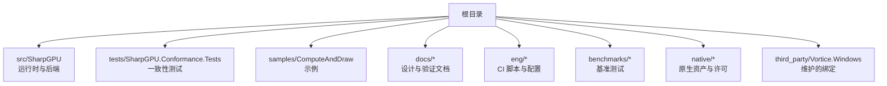
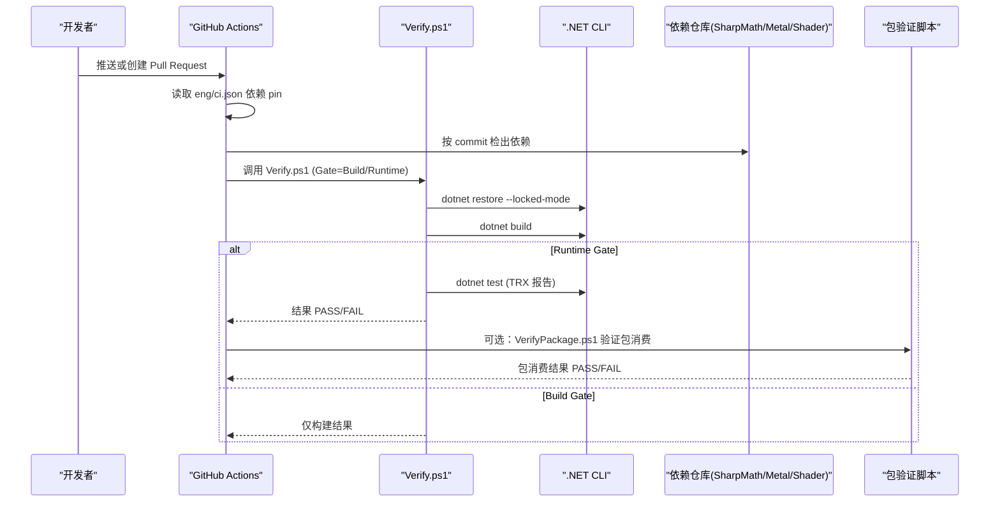
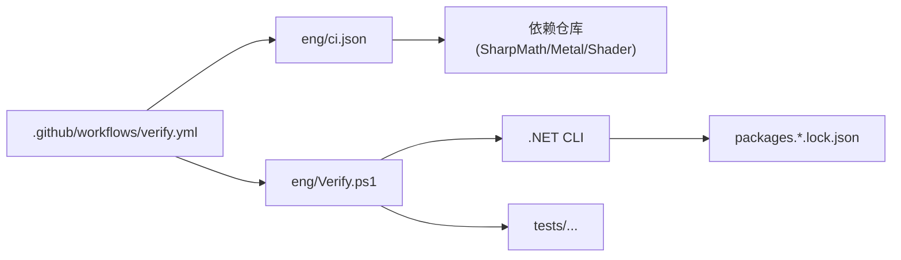

# 贡献流程

<cite>
**本文引用的文件**
- [README.md](file://README.md)
- [AGENTS.md](file://AGENTS.md)
- [DESIGN.md](file://DESIGN.md)
- [docs/VERIFICATION.md](file://docs/VERIFICATION.md)
- [.github/workflows/verify.yml](file://.github/workflows/verify.yml)
- [eng/ci.json](file://eng/ci.json)
- [eng/Verify.ps1](file://eng/Verify.ps1)
- [Directory.Build.props](file://Directory.Build.props)
- [global.json](file://global.json)
</cite>

## 目录
1. [简介](#简介)
2. [项目结构](#项目结构)
3. [核心组件](#核心组件)
4. [架构总览](#架构总览)
5. [详细组件分析](#详细组件分析)
6. [依赖分析](#依赖分析)
7. [性能考虑](#性能考虑)
8. [故障排查指南](#故障排查指南)
9. [结论](#结论)
10. [附录](#附录)

## 简介
本贡献流程文档面向 SharpGPU 仓库的贡献者，聚焦于分支管理、Pull Request 提交流程与代码审查要求，并覆盖功能开发、缺陷修复与文档更新的标准化步骤。同时给出提交信息规范、变更日志维护建议与发布准备清单，以及协作最佳实践与沟通渠道说明。SharpGPU 是面向 DirectX 12、Vulkan 与 Metal 的低层 .NET GPU 抽象层，具备独立构建、测试与打包能力，并通过 CI 在 Windows x64 上执行源图构建与设备端运行时验证。

## 项目结构
仓库采用按职责划分的目录组织：
- src：产品运行时与后端实现（RHI 与各平台后端）
- tests：独立一致性测试套件
- samples：可运行示例
- docs：设计、验证与使用说明
- eng：构建/测试/打包自动化脚本与配置
- benchmarks：基准测试
- native：原生资源与许可证
- third_party：维护的 Vortice 绑定与补丁

**章节来源**
- [README.md:12-22](file://README.md#L12-L22)
- [DESIGN.md:1-10](file://DESIGN.md#L1-L10)

## 核心组件
- 构建与验证入口
  - 统一 SDK 版本由 global.json 指定，确保本地与 CI 一致。
  - Directory.Build.props 集中定义输出路径、锁定模式、Source/Package 模式与产物隔离策略。
- CI 流水线
  - GitHub Actions 工作流在 push/pull_request 触发 Build；仅在 main 分支通过 workflow_dispatch 触发 Runtime 设备验证。
  - 依赖仓库（SharpMath、SharpMetal、SharpShader）按 eng/ci.json 中的 commit 精确检出。
- 验证脚本
  - eng/Verify.ps1 负责校验依赖 HEAD、生成临时 stack.local.props、以 Source 模式 restore/build/test，并在 Runtime Gate 下要求所有测试通过且无跳过。
  - docs/VERIFICATION.md 提供权威命令、证据保留策略与平台边界说明。

**章节来源**
- [global.json:1-8](file://global.json#L1-L8)
- [Directory.Build.props:1-25](file://Directory.Build.props#L1-L25)
- [.github/workflows/verify.yml:1-119](file://.github/workflows/verify.yml#L1-L119)
- [eng/Verify.ps1:1-91](file://eng/Verify.ps1#L1-L91)
- [docs/VERIFICATION.md:1-40](file://docs/VERIFICATION.md#L1-L40)

## 架构总览
下图展示从 PR 到设备验证的端到端流程，包括依赖拉取、源图构建、测试执行与包消费验证。

**图表来源**
- [.github/workflows/verify.yml:18-119](file://.github/workflows/verify.yml#L18-L119)
- [eng/Verify.ps1:26-79](file://eng/Verify.ps1#L26-L79)
- [eng/ci.json:1-27](file://eng/ci.json#L1-L27)

## 详细组件分析

### 分支管理与 Pull Request 流程
- 默认工作分支为 main。未经明确授权不得创建分支、PR、远程或发布。
- 建议在 main 的工作副本上进行修改，保持未提交无关改动不被清理。
- PR 应包含最小化变更集，附带对应测试与证据（如 TRX、日志）。
- 对于跨平台或设备相关变更，需明确标注平台限制与验证状态（BLOCKED_PLATFORM/TODO(UNVERIFIED)）。

**章节来源**
- [AGENTS.md:3-8](file://AGENTS.md#L3-L8)
- [docs/VERIFICATION.md:136-144](file://docs/VERIFICATION.md#L136-L144)

### 代码审查要求
- 审查前必须运行 git diff --check，检查包内容与 native/assets.json 哈希。
- 确认依赖图中包含五个 SharpGPU.Vortice.* Windows 包与固定版本的 Vortice.Vulkan 3.2.1，禁止替换或未固定自定义绑定。
- 若运行时或包版本变更，需重新执行源图、包与下游消费者证据验证。
- 审查需关注 RHI 与后端边界、单一实现路径、不引入兼容回退或别名。

**章节来源**
- [docs/VERIFICATION.md:146-160](file://docs/VERIFICATION.md#L146-L160)
- [AGENTS.md:9-19](file://AGENTS.md#L9-L19)

### 功能开发、Bug 修复与文档更新的标准流程
- 功能开发
  - 在 main 分支工作，遵循命名与格式约定（块级缩进、字段命名等）。
  - 新增行为需配套测试，优先使用当前构建/测试/运行证据。
  - 对不可用平台标记 BLOCKED_PLATFORM 或 TODO(UNVERIFIED)。
- Bug 修复
  - 复现问题并添加回归测试；确保错误、取消与生命周期路径被覆盖。
  - 修复后在 Debug/Release 源图与包模式下分别验证。
- 文档更新
  - 当契约变化时更新 README、设计或验证文档；保持许可证与第三方通知完整。
  - 避免将机器绝对路径提交到仓库，使用可移植模板与忽略规则。

**章节来源**
- [AGENTS.md:13-19](file://AGENTS.md#L13-L19)
- [docs/VERIFICATION.md:1-14](file://docs/VERIFICATION.md#L1-L14)

### 提交信息规范
- 提交应聚焦单一职责，避免混合无关变更。
- 描述应包含变更目的、影响范围与验证方式（例如“修复 Vulkan 调度表生命周期问题，补充单元测试并验证 Release/Debug 全量用例”）。
- 如涉及原生资源或包内容变更，需在提交中说明并附上哈希对比或证据路径。
- 不要重写历史或删除源码溯源信息。

**章节来源**
- [AGENTS.md:3-8](file://AGENTS.md#L3-L8)
- [docs/VERIFICATION.md:146-160](file://docs/VERIFICATION.md#L146-L160)

### 变更日志维护建议
- 建议在仓库根或 docs 下维护一份变更日志（例如 CHANGELOG.md），按版本记录：
  - 新增功能、破坏性变更、缺陷修复、依赖升级与已知限制。
  - 每次发布前核对条目完整性与准确性，并与测试证据关联。
- 变更日志应与 PR 标题和提交摘要保持一致，便于追溯。

[本节为通用建议，不直接分析具体文件]

### 发布准备步骤
- 构建与测试
  - 使用 eng/Verify.ps1 在 Debug/Release 执行 Build 与 Runtime Gate，确保所有测试通过且无跳过。
  - 使用 eng/VerifyPackage.ps1 验证包消费，要求每个 nupkg 来自指定 feed 且缓存 SHA-256 匹配。
- 包内容核验
  - 检查包内 RID-native 条目、许可证与 ThirdPartyNotices 部署路径。
  - 确认 native/assets.json 哈希与预期一致。
- 下游集成
  - 在隔离环境中恢复/构建/运行示例或集成项目，验证 DX12/Vulkan 计算与绘制路径。
  - 记录证据（TRX、日志、特征报告）并归档至 artifacts。

**章节来源**
- [docs/VERIFICATION.md:66-134](file://docs/VERIFICATION.md#L66-L134)
- [docs/VERIFICATION.md:318-350](file://docs/VERIFICATION.md#L318-L350)
- [eng/Verify.ps1:56-83](file://eng/Verify.ps1#L56-L83)

### 协作开发与沟通渠道
- 协作原则
  - 保持 RHI 与后端边界清晰；不引入多实现路径或静默依赖回退。
  - 使用 Source/Package 模式进行图级切换，避免混用。
  - 本地映射仅保存在忽略的 stack.local.props，模板保持可移植。
- 沟通建议
  - 在 PR 中明确说明变更动机、影响面与验证结果。
  - 对平台限制与未验证项显式标注，避免误导。
  - 与审查者共享证据路径（TRX、日志、包内容），便于快速定位问题。

**章节来源**
- [AGENTS.md:9-19](file://AGENTS.md#L9-L19)
- [docs/VERIFICATION.md:1-14](file://docs/VERIFICATION.md#L1-L14)

## 依赖分析
- 依赖声明与检出
  - eng/ci.json 列出依赖仓库与精确 commit，CI 据此检出并验证 HEAD。
  - Verify.ps1 在运行前校验依赖身份与 HEAD，不一致则失败。
- 构建模式与锁定
  - Directory.Build.props 启用 RestoreLockedMode，并使用 packages.<StackReferenceMode>.<RID-or-portable>.lock.json。
  - Source 与 Package 模式互不共享解析状态，需分别验证。
- 外部依赖
  - 维护的 Vortice 绑定与补丁随仓库一起分发，禁止替换为上游包。
  - 原生 DLL 与 Agility 位置分离，应用部署目录需满足 D3D12 期望。

**图表来源**
- [.github/workflows/verify.yml:18-119](file://.github/workflows/verify.yml#L18-L119)
- [eng/ci.json:1-27](file://eng/ci.json#L1-L27)
- [eng/Verify.ps1:26-55](file://eng/Verify.ps1#L26-L55)
- [Directory.Build.props:17-22](file://Directory.Build.props#L17-L22)

**章节来源**
- [eng/ci.json:1-27](file://eng/ci.json#L1-L27)
- [eng/Verify.ps1:26-55](file://eng/Verify.ps1#L26-L55)
- [Directory.Build.props:17-22](file://Directory.Build.props#L17-L22)

## 性能考虑
- 构建与测试并行
  - 使用 -m:1 控制并行度，避免资源争用；在 CI 中使用固定矩阵配置。
- 证据保留与清理
  - 产物与中间文件隔离到 artifacts，避免污染工作区；任务完成后收敛临时目录。
- 平台差异
  - Windows x64 为主要合格平台；其他平台需单独主机验证，不应降级断言。

[本节提供通用指导，不直接分析具体文件]

## 故障排查指南
- 常见失败点
  - 依赖 HEAD 不匹配：检查 eng/ci.json 与依赖仓库实际 HEAD。
  - 锁文件不一致：确保 Source/Package 模式分别生成并锁定 lock 文件。
  - 包消费失败：确认 feed 完整、缓存干净、nupkg 哈希匹配。
  - 原生加载失败：检查扩展长度路径与应用程序部署目录。
- 诊断步骤
  - 运行 git diff --check 与 Verify.ps1，查看 verification.log 与 result.json。
  - 检查 TRX 报告与日志，定位失败用例与平台限制。
  - 对比 native/assets.json 哈希与包内容，确认原生资源正确。

**章节来源**
- [docs/VERIFICATION.md:146-160](file://docs/VERIFICATION.md#L146-L160)
- [eng/Verify.ps1:26-83](file://eng/Verify.ps1#L26-L83)

## 结论
SharpGPU 的贡献流程强调严格的依赖锁定、明确的平台边界与完整的证据保留。通过 CI 的源图构建与设备端运行时验证，结合包消费验证，确保变更在真实设备上可靠。贡献者应遵循分支与 PR 规范、代码审查清单与提交信息约定，并在必要时标注平台限制与未验证项。发布前需完成构建、测试、包内容与下游集成的全面验证，并归档证据以便追溯。

## 附录
- 快速参考
  - SDK 版本：global.json
  - 构建/测试入口：eng/Verify.ps1
  - CI 配置：.github/workflows/verify.yml、eng/ci.json
  - 权威验证文档：docs/VERIFICATION.md
  - 贡献规则：AGENTS.md、DESIGN.md

[本节为索引与导航，不直接分析具体文件]